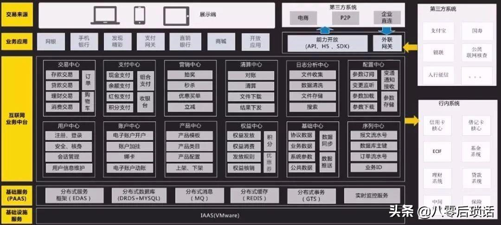

## **Arch**：各种架构图盘点

### ⼀、业务架构

使⽤⼀套⽅法论/逻辑对产品（项⽬）所涉及到的业务进⾏边界划分，所以熟悉业务是关键，如下图所⽰某业务中台架构图：

### ⼆、应⽤架构

它是对整个系统实现的总体上的架构，需要指出系统的层次、系统开发的原则、系统各个层次的应⽤服务。如下图所⽰，就将系统分为数据层、服务层、通讯层、展现层，并细分写明每个层次的应⽤服务。

### 三、技术架构

技术架构是应接应⽤架构的技术需求，并根据识别的技术需求，进⾏技术选型，把各个关键技术和技术之间的关系描述清楚。技术架构解决的问题包括：纯技术层⾯的分层、开发框架的选择、开发语⾔的选择、涉及⾮功能性需求的技术选择等。

### 四、部署图

部署图(deployment diagram，配置图)是⽤来显⽰系统中软件和硬件的物理架构。部署图中可以了解到软件和硬件之间的物理关系以及处理节点的组件分布情况。使⽤部署图可以显⽰运⾏时系统的结构，同时还传达构成应⽤程序的硬件和软件元素的配置和部署⽅式。

### 五、⽹络拓扑图

是指⽤传输媒体互连各种设备的物理布局，就是⽤什么⽅式把⽹络中的计算机等设备连接起来。拓扑图给出⽹络服务器、⼯作站的⽹络配置和相互间的连接，它的结构主要有星型结构、环型结构、总线结构、分布式结构、树型结构、⽹状结构、蜂窝状结构等。

