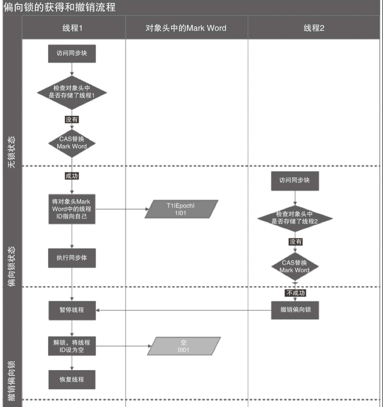

> 本文章仅用于本人学习笔记记录
> 来源《Java并发编程的艺术》
> 微信：wxid_ygj58saenbjh22（如本文档内容侵权了您的权益，请您通过微信联系到我）

Java代码在编译后会变成Java字节码，字节码被类加载器加载到JVM里，JVM执行字节码，最终需要转化为汇编指令在CPU上执行，Java中所使用的并发机制依赖于JVM的实现和CPU的指令。

## volatile的应用

volatile是轻量级的synchronized，它在多处理器开发中保证了共享变量的“可见性”和避免了指令重排。可见性的意思是当一个线程修改一个共享变量时，另外一个线程能读到这个修改的值。如果volatile变量修饰符使用恰当的话，它比synchronized的使用和执行成本更低，因为它不会引起线程上下文的切换和调度。避免指令重排主要是靠内存屏障来实现。

### volatile的定义与实现原理

Java语言提供了volatile，在某些情况下比锁要更加方便。如果一个字段被声明成volatile，Java线程内存模型确保所有线程看到这个变量的值是一致的。

有volatile变量修饰的共享变量进行写操作的时候:

1. 将当前处理器缓存行的数据写回到系统内存。
2. 这个写回内存的操作会使在其他CPU里缓存了该内存地址的数据无效。

为了提高处理速度，处理器不直接和内存进行通信，而是先将系统内存的数据读到内部缓存（L1，L2或其他）后再进行操作，但操作完不知道何时会写到内存。如果对声明了volatile的变量进行写操作，JVM就会向处理器发送一条Lock前缀的指令，将这个变量所在缓存行的数据写回到系统内存。但是，就算写回到内存，如果其他处理器缓存的值还是旧的，再执行计算操作就会有问题。所以，在多处理器下，为了保证各个处理器的缓存是一致的，就会实现缓存一致性协议，每个处理器通过嗅探在总线上传播的数据来检查自己缓存的值是不是过期了，当处理器发现自己缓存行对应的内存地址被修改，就会将当前处理器的缓存行设置成无效状态，当处理器对这个数据进行修改操作的时候，会重新从系统内存中把数据读到处理器缓存里。

## synchronized的实现原理与应用

Java中的每一个对象都可以作为锁。具体表现为以下3种形式:

- 对于普通同步方法，锁是当前实例对象。
- 对于静态同步方法，锁是当前类的Class对象。
- 对于同步方法块，锁是Synchonized括号里配置的对象。

当一个线程试图访问同步代码块时，它首先必须得到锁，退出或抛出异常时必须释放锁。

JVM基于进入和退出Monitor对象来实现方法同步和代码块同步，但两者的实现细节不一样。代码块同步是使用monitorenter和monitorexit指令实现的，而方法同步是使用另外一种方式实现的，细节在JVM规范里并没有详细说明。但是，方法的同步同样可以使用这两个指令来实现。

monitorenter指令是在编译后插入到同步代码块的开始位置，而monitorexit是插入到方法结束处和异常处，JVM要保证每个monitorenter必须有对应的monitorexit与之配对。任何对象都有一个monitor与之关联，当且一个monitor被持有后，它将处于锁定状态。线程执行到monitorenter指令时，将会尝试获取对象所对应的monitor的所有权，即尝试获得对象的锁。

### Java对象头

synchronized用的锁是存在Java对象头里的。如果对象是数组类型，则虚拟机用3个字宽（Word）存储对象头，如果对象是非数组类型，则用2字宽存储对象头。在32位虚拟机中，1字宽等于4字节，即32bit

Java对象头里的Mark Word里默认存储对象的HashCode、分代年龄和锁标记位。

在运行期间，Mark Word里存储的数据会随着锁标志位的变化而变化。Mark Word可能变化为存储以下4种数据

### 锁的升级与对比

锁一共有4种状态，级别从低到高依次是：无锁状态、偏向锁状态、轻量级锁状态和重量级锁状态，这几个状态会随着竞争情况逐渐升级。锁可以升级但不能降级，意味着偏向锁升级成轻量级锁后不能降级成偏向锁。**这种锁升级却不能降级的策略，目的是为了提高获得锁和释放锁的效率**

#### 偏向锁

大多数情况下，锁不仅不存在多线程竞争，而且总是由同一线程多次获得，为了让线程获得锁的代价更低而引入了偏向锁。当一个线程访问同步块并获取锁时，会在对象头和栈帧中的锁记录里存储锁偏向的线程ID，以后该线程在进入和退出同步块时不需要进行CAS操作来加锁和解锁，只需简单地测试一下对象头的Mark Word里是否存储着指向当前线程的偏向锁。如果测试成功，表示线程已经获得了锁。如果测试失败，则需要再测试一下Mark Word中偏向锁的标识是否设置成1（表示当前是偏向锁）：如果没有设置，则使用CAS竞争锁；如果设置了，则尝试使用CAS将对象头的偏向锁指向当前线程。

- 偏向锁的撤销

偏向锁使用了一种等到竞争出现才释放锁的机制，所以当其他线程尝试竞争偏向锁时，持有偏向锁的线程才会释放锁。偏向锁的撤销，需要等待全局安全点（在这个时间点上没有正在执行的字节码）。它会首先暂停拥有偏向锁的线程，然后检查持有偏向锁的线程是否活着，如果线程不处于活动状态，则将对象头设置成无锁状态；如果线程仍然活着，拥有偏向锁的栈会被执行。遍历偏向对象的锁记录，栈中的锁记录和对象头的Mark Word要么重新偏向于其他线程，要么恢复到无锁或者标记对象不适合作为偏向锁，最后唤醒暂停的线程。

#### 轻量级锁

- 轻量级锁加锁

线程在执行同步块之前，JVM会先在当前线程的栈桢中创建用于存储锁记录的空间，并将对象头中的Mark Word复制到锁记录中，然后线程尝试使用CAS将对象头中的Mark Word替换为指向锁记录的指针。如果成功，当前线程获得锁，如果失败，表示其他线程竞争锁，当前线程便尝试使用自旋来获取锁。

- 轻量级锁解锁

轻量级解锁时，会使用原子的CAS操作将Displaced Mark Word替换回到对象头，如果成功，则表示没有竞争发生。如果失败，表示当前锁存在竞争，锁就会膨胀成重量级锁。

因为自旋会消耗CPU，为了避免无用的自旋（比如获得锁的线程被阻塞住了），一旦锁升级成重量级锁，就不会再恢复到轻量级锁状态。当锁处于这个状态下，其他线程试图获取锁时，都会被阻塞住，当持有锁的线程释放锁之后会唤醒这些线程，被唤醒的线程就会进行新一轮的夺锁之争。

#### 锁的优缺点对比

## 原子操作的实现原理

### 使用总线锁保证原子性

第一个机制是通过总线锁保证原子性。如果多个处理器同时对共享变量进行读改写操作（i++就是经典的读改写操作），那么共享变量就会被多个处理器同时进行操作，这样读改写操作就不是原子的，操作完之后共享变量的值会和期望的不一致。举个例子，如果i=1，我们进行两次i++操作，我们期望的结果是3，但是有可能结果是2

原因可能是多个处理器同时从各自的缓存中读取变量i，分别进行加1操作，然后分别写入系统内存中。那么，想要保证读改写共享变量的操作是原子的，就必须保证CPU1读改写共享变量的时候，CPU2不能操作缓存了该共享变量内存地址的缓存。

处理器使用总线锁就是来解决这个问题的。所谓总线锁就是使用处理器提供的一个LOCK＃信号，当一个处理器在总线上输出此信号时，其他处理器的请求将被阻塞住，那么该处理器可以独占共享内存。

### 使用缓存锁保证原子性

第二个机制是通过缓存锁定来保证原子性。在同一时刻，我们只需保证对某个内存地址的操作是原子性即可，但总线锁定把CPU和内存之间的通信锁住了，这使得锁定期间，其他处理器不能操作其他内存地址的数据，所以总线锁定的开销比较大，目前处理器在某些场合下使用缓存锁定代替总线锁定来进行优化。

### Java如何实现原子操作

在Java中可以通过锁和循环CAS的方式来实现原子操作。

#### 使用循环CAS实现原子操作

JVM中的CAS操作正是利用了处理器提供的CMPXCHG指令实现的。自旋CAS实现的基本思路就是循环进行CAS操作直到成功为止

从Java 1.5开始，JDK的并发包里提供了一些类来支持原子操作，如AtomicBoolean（用原子方式更新的boolean值）、AtomicInteger（用原子方式更新的int值）和AtomicLong（用原子方式更新的long值）。这些原子包装类还提供了有用的工具方法，比如以原子的方式将当前值自增1和自减1。

CAS实现原子操作的三大问题：ABA问题，循环时间长开销大，以及只能保证一个共享变量的原子操作。

- ABA问题。

因为CAS需要在操作值的时候，检查值有没有发生变化，如果没有发生变化则更新，但是如果一个值原来是A，变成了B，又变成了A，那么使用CAS进行检查时会发现它的值没有发生变化，但是实际上却变化了。ABA问题的解决思路就是使用版本号。在变量前面追加上版本号，每次变量更新的时候把版本号加1，那么A→B→A就会变成1A→2B→3A。从Java 1.5开始，JDK的Atomic包里提供了一个类AtomicStampedReference来解决ABA问题。这个类的compareAndSet方法的作用是首先检查当前引用是否等于预期引用，并且检查当前标志是否等于预期标志，如果全部相等，则以原子方式将该引用和该标志的值设置为给定的更新值。

- 循环时间长开销大

自旋CAS如果长时间不成功，会给CPU带来非常大的执行开销。如果JVM能支持处理器提供的pause指令，那么效率会有一定的提升。pause指令有两个作用：第一，它可以延迟流水线执行指令（de-pipeline），使CPU不会消耗过多的执行资源，延迟的时间取决于具体实现的版本，在一些处理器上延迟时间是零；第二，它可以避免在退出循环的时候因内存顺序冲突（Memory Order Violation）而引起CPU流水线被清空（CPU Pipeline Flush），从而提高CPU的执行效率。

- 只能保证一个共享变量的原子操作。

当对一个共享变量执行操作时，我们可以使用循环CAS的方式来保证原子操作，但是对多个共享变量操作时，循环CAS就无法保证操作的原子性，这个时候就可以用锁。还有一个取巧的办法，就是把多个共享变量合并成一个共享变量来操作。比如，有两个共享变量i＝2，j=a，合并一下ij=2a，然后用CAS来操作ij。从Java 1.5开始，JDK提供了AtomicReference类来保证引用对象之间的原子性，就可以把多个变量放在一个对象里来进行CAS操作。

#### 使用锁机制实现原子操作

锁机制保证了只有获得锁的线程才能够操作锁定的内存区域。JVM内部实现了很多种锁机制，有偏向锁、轻量级锁和互斥锁。有意思的是除了偏向锁，JVM实现锁的方式都用了循环CAS，即当一个线程想进入同步块的时候使用循环CAS的方式来获取锁，当它退出同步块的时候使用循环CAS释放锁。