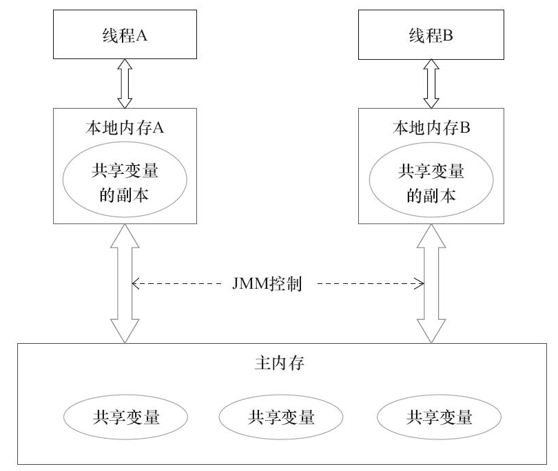
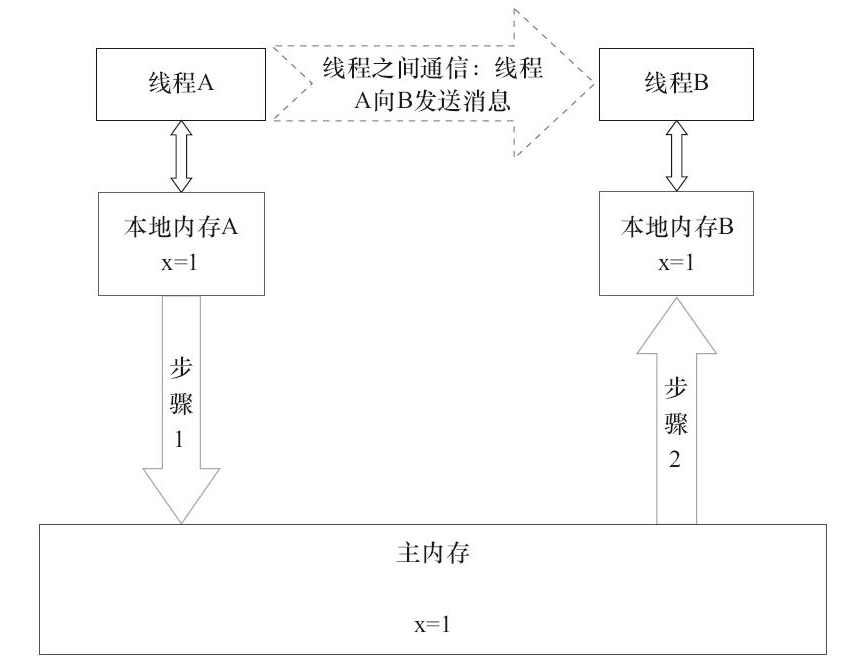
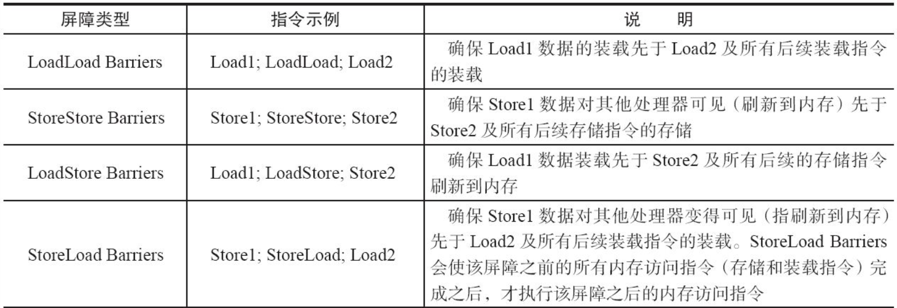
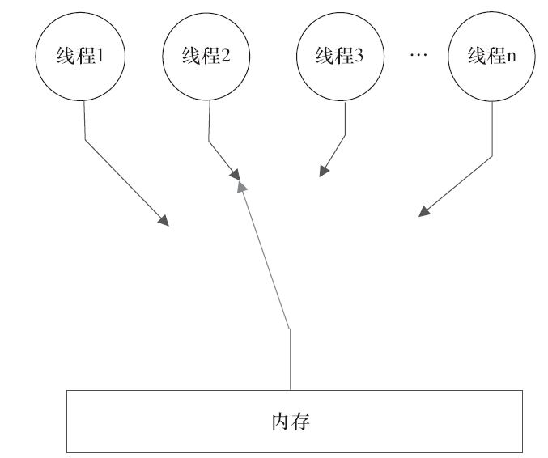
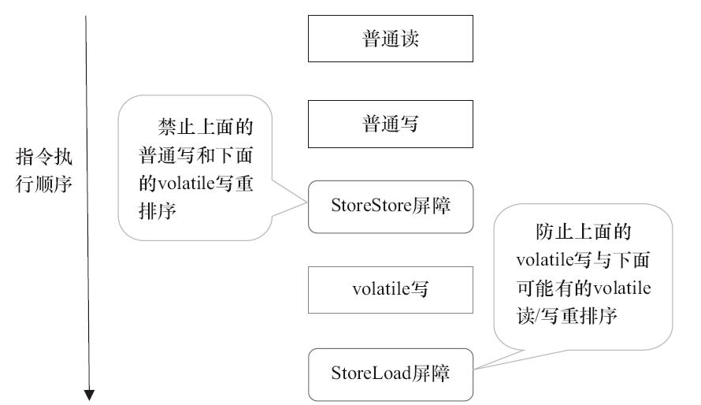
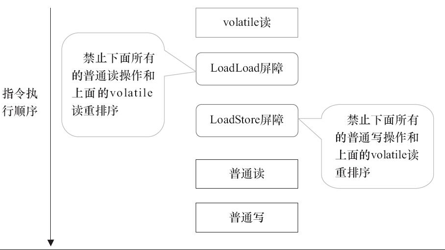
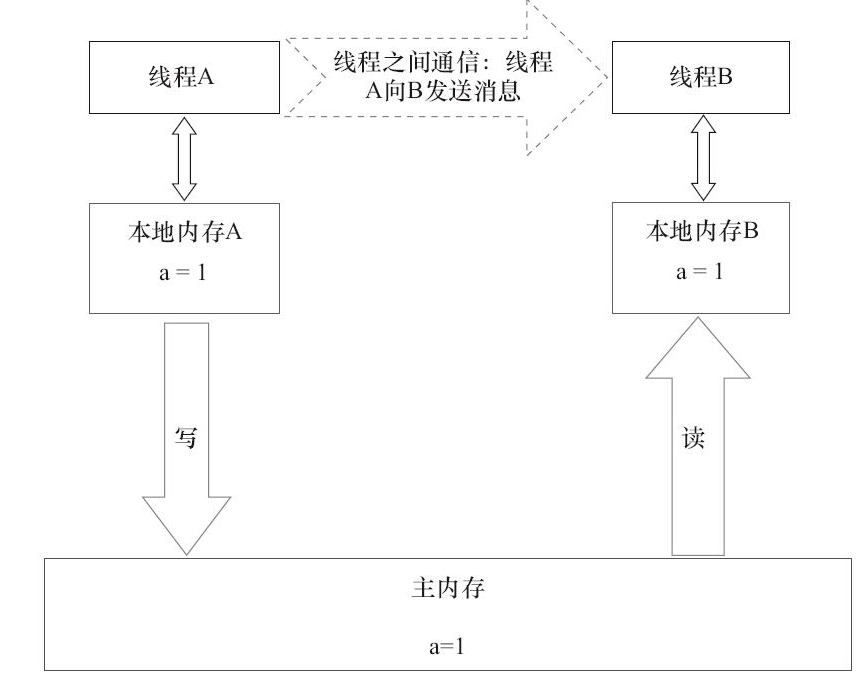

> 本文章仅用于本人学习笔记记录
> 来源《Java并发编程的艺术》
> 微信：wxid_ygj58saenbjh22（如本文档内容侵权了您的权益，请您通过微信联系到我）

## Java内存模型的基础

### 并发编程模型的两个关键问题

在并发编程中，需要处理两个关键问题：线程之间如何通信及线程之间如何同步（这里的线程是指并发执行的活动实体）。通信是指线程之间以何种机制来交换信息。在命令式编程中，线程之间的通信机制有两种：共享内存和消息传递。

在共享内存的并发模型里，线程之间共享程序的公共状态，通过写-读内存中的公共状态进行隐式通信。在消息传递的并发模型里，线程之间没有公共状态，线程之间必须通过发送消息来显式进行通信。

同步是指程序中用于控制不同线程间操作发生相对顺序的机制。在共享内存并发模型里，同步是显式进行的。程序员必须显式指定某个方法或某段代码需要在线程之间互斥执行。在消息传递的并发模型里，由于消息的发送必须在消息的接收之前，因此同步是隐式进行的。

### Java内存模型的抽象结构

在Java中，所有实例域、静态域和数组元素都存储在堆内存中，堆内存在线程之间共享（本章用“共享变量”这个术语代指实例域，静态域和数组元素）。局部变量（Local Variables），方法定义参数（Java语言规范称之为Formal Method Parameters）和异常处理器参数（Exception Handler Parameters）不会在线程之间共享，它们不会有内存可见性问题，也不受内存模型的影响。

Java线程之间的通信由Java内存模型（本文简称为JMM）控制，JMM决定一个线程对共享变量的写入何时对另一个线程可见。从抽象的角度来看，JMM定义了线程和主内存之间的抽象关系：线程之间的共享变量存储在主内存（Main Memory）中，每个线程都有一个私有的本地内存（Local Memory），本地内存中存储了该线程以读/写共享变量的副本。本地内存是JMM的一个抽象概念，并不真实存在。它涵盖了缓存、写缓冲区、寄存器以及其他的硬件和编译器优化。

线程A与线程B之间要通信的话，必须要经历下面2个步骤:

1. 线程A把本地内存A中更新过的共享变量刷新到主内存中去。
2. 线程B到主内存中去读取线程A之前已更新过的共享变量。

本地内存A和本地内存B由主内存中共享变量x的副本。假设初始时，这3个内存中的x值都为0。线程A在执行时，把更新后的x值（假设值为1）临时存放在自己的本地内存A中。当线程A和线程B需要通信时，线程A首先会把自己本地内存中修改后的x值刷新到主内存中，此时主内存中的x值变为了1。随后，线程B到主内存中去读取线程A更新后的x值，此时线程B的本地内存的x值也变为了1。

### 从源代码到指令序列的重排序

在执行程序时，为了提高性能，编译器和处理器常常会对指令做重排序。重排序分3种类型。

- 编译器优化的重排序。编译器在不改变单线程程序语义的前提下，可以重新安排语句的执行顺序。
- 指令级并行的重排序。现代处理器采用了指令级并行技术（Instruction-Level Parallelism，ILP）来将多条指令重叠执行。如果不存在数据依赖性，处理器可以改变语句对应机器指令的执行顺序。
- 内存系统的重排序。由于处理器使用缓存和读/写缓冲区，这使得加载和存储操作看上去可能是在乱序执行。

上述的1属于编译器重排序，2和3属于处理器重排序。

StoreLoad Barriers是一个“全能型”的屏障，它同时具有其他3个屏障的效果。

### happens-before简介

在JMM中，如果一个操作执行的结果需要对另一个操作可见，那么这两个操作之间必须要存在happens-before关系。这里提到的两个操作既可以是在一个线程之内，也可以是在不同线程之间。

- 程序顺序规则：一个线程中的每个操作，happens-before于该线程中的任意后续操作。
- 监视器锁规则：对一个锁的解锁，happens-before于随后对这个锁的加锁。
- volatile变量规则：对一个volatile域的写，happens-before于任意后续对这个volatile域的读。
- 传递性：如果A happens-before B，且B happens-before C，那么A happens-before C。

两个操作之间具有happens-before关系，并不意味着前一个操作必须要在后一个操作之前执行！happens-before仅仅要求前一个操作（执行的结果）对后一个操作可见，且前一个操作按顺序排在第二个操作之前（the first is visible to and ordered before the second）。

## 重排序

重排序是指编译器和处理器为了优化程序性能而对指令序列进行重新排序的一种手段。

### 数据依赖性

如果两个操作访问同一个变量，且这两个操作中有一个为写操作，此时这两个操作之间就存在数据依赖性。

上面3种情况，只要重排序两个操作的执行顺序，程序的执行结果就会被改变。

编译器和处理器在重排序时，会遵守数据依赖性，编译器和处理器不会改变存在数据依赖关系的两个操作的执行顺序。

### as-if-serial语义

as-if-serial语义的意思是：不管怎么重排序（编译器和处理器为了提高并行度），（单线程）程序的执行结果不能被改变。编译器、runtime和处理器都必须遵守as-if-serial语义。

为了遵守as-if-serial语义，编译器和处理器不会对存在数据依赖关系的操作做重排序，因为这种重排序会改变执行结果。但是，如果操作之间不存在数据依赖关系，这些操作就可能被编译器和处理器重排序。

### 程序顺序规则

- A　happens-before B。
- B　happens-before C。
- A　happens-before C。

这里的第3个happens-before关系，是根据happens-before的传递性推导出来的。

## 顺序一致性

顺序一致性内存模型是一个理论参考模型，在设计的时候，处理器的内存模型和编程语言的内存模型都会以顺序一致性内存模型作为参照。

### 数据竞争与顺序一致性

当程序未正确同步时，就可能会存在数据竞争。Java内存模型规范对数据竞争的定义如下。

在一个线程中写一个变量，在另一个线程读同一个变量，而且写和读没有通过同步来排序。

当代码中包含数据竞争时，程序的执行往往产生违反直觉的结果。如果一个多线程程序能正确同步，这个程序将是一个没有数据竞争的程序。

JMM对正确同步的多线程程序的内存一致性做了如下保证。

如果程序是正确同步的，程序的执行将具有顺序一致性（Sequentially Consistent）——即程序的执行结果与该程序在顺序一致性内存模型中的执行结果相同。马上我们就会看到，这对于程序员来说是一个极强的保证。这里的同步是指广义上的同步，包括对常用同步原语（synchronized、volatile和final）的正确使用。

### 顺序一致性内存模型

顺序一致性内存模型有两大特性。

- 一个线程中的所有操作必须按照程序的顺序来执行。
- （不管程序是否同步）所有线程都只能看到一个单一的操作执行顺序。在顺序一致性内存模型中，每个操作都必须原子执行且立刻对所有线程可见。

在概念上，顺序一致性模型有一个单一的全局内存，这个内存通过一个左右摆动的开关可以连接到任意一个线程，同时每一个线程必须按照程序的顺序来执行内存读/写操作。从上面的示意图可以看出，在任意时间点最多只能有一个线程可以连接到内存。当多个线程并发执行时，图中的开关装置能把所有线程的所有内存读/写操作串行化

但是，在JMM中就没有这个保证。未同步程序在JMM中不但整体的执行顺序是无序的，而且所有线程看到的操作执行顺序也可能不一致。比如，在当前线程把写过的数据缓存在本地内存中，在没有刷新到主内存之前，这个写操作仅对当前线程可见；从其他线程的角度来观察，会认为这个写操作根本没有被当前线程执行。只有当前线程把本地内存中写过的数据刷新到主内存之后，这个写操作才能对其他线程可见。在这种情况下，当前线程和其他线程看到的操作执行顺序将不一致。

## volatile的内存语义

- 可见性：对一个volatile变量的读，总是能看到（任意线程）对这个volatile变量最后的写入。
- 原子性：对任意单个volatile变量的读/写具有原子性，但类似于volatile++这种复合操作不具有原子性。

当第二个操作是volatile写时，不管第一个操作是什么，都不能重排序。这个规则确保volatile写之前的操作不会被编译器重排序到volatile写之后。

当第一个操作是volatile读时，不管第二个操作是什么，都不能重排序。这个规则确保volatile读之后的操作不会被编译器重排序到volatile读之前。

当第一个操作是volatile写，第二个操作是volatile读时，不能重排序。

为了实现volatile的内存语义，编译器在生成字节码时，会在指令序列中插入内存屏障来禁止特定类型的处理器重排序。对于编译器来说，发现一个最优布置来最小化插入屏障的总数几乎不可能。为此，JMM采取保守策略。下面是基于保守策略的JMM内存屏障插入策略。

- 在每个volatile写操作的前面插入一个StoreStore屏障。
- 在每个volatile写操作的后面插入一个StoreLoad屏障。
- 在每个volatile读操作的后面插入一个LoadLoad屏障。
- 在每个volatile读操作的后面插入一个LoadStore屏障。

## 锁的内存语义

锁除了让临界区互斥执行外，还可以让释放锁的线程向获取同一个锁的线程发送消息。

当线程释放锁时，JMM会把该线程对应的本地内存中的共享变量刷新到主内存中。

当线程获取锁时，JMM会把该线程对应的本地内存置为无效。从而使得被监视器保护的临界区代码必须从主内存中读取共享变量。

锁释放与volatile写有相同的内存语义；锁获取与volatile读有相同的内存语义。

## happens-before

- 程序顺序规则：一个线程中的每个操作，happens-before于该线程中的任意后续操作。
- 监视器锁规则：对一个锁的解锁，happens-before于随后对这个锁的加锁。
- volatile变量规则：对一个volatile域的写，happens-before于任意后续对这个volatile域的读。
- 传递性：如果A happens-before B，且B happens-before C，那么A happens-before C。
- start()规则：如果线程A执行操作ThreadB.start()（启动线程B），那么A线程的ThreadB.start()操作happens-before于线程B中的任意操作。
- join()规则：如果线程A执行操作ThreadB.join()并成功返回，那么线程B中的任意操作happens-before于线程A从ThreadB.join()操作成功返回。
