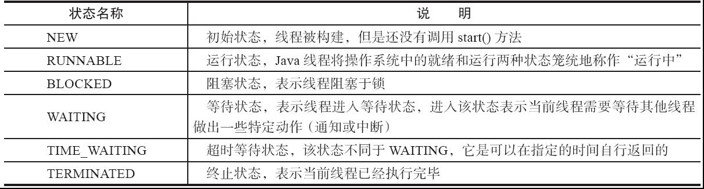
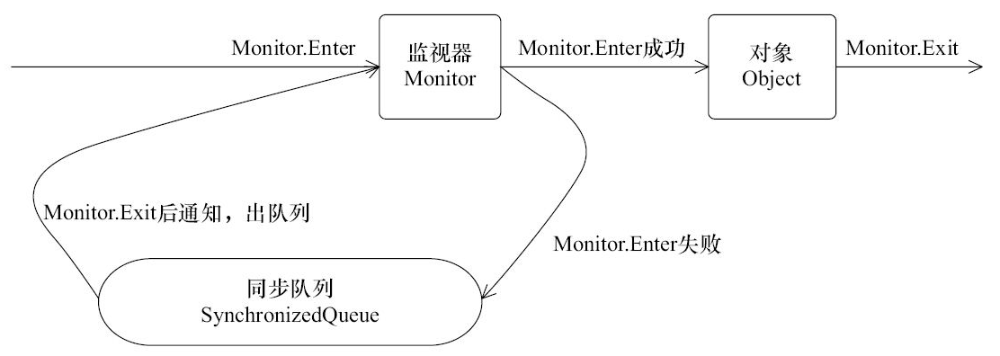
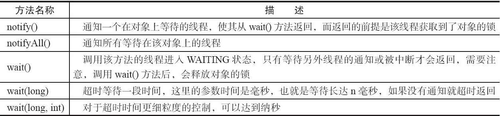

> 本文章仅用于本人学习笔记记录
> 来源《Java并发编程的艺术》
> 微信：wxid_ygj58saenbjh22（如本文档内容侵权了您的权益，请您通过微信联系到我）

## 线程简介

### 什么是线程

操作系统在运行一个程序时，会为其创建一个进程。例如，启动一个Java程序，操作系统就会创建一个Java进程。现代操作系统调度的最小单元是线程，也叫轻量级进程（Light Weight Process），在一个进程里可以创建多个线程，这些线程都拥有各自的计数器、堆栈和局部变量等属性，并且能够访问共享的内存变量。处理器在这些线程上高速切换，让使用者感觉到这些线程在同时执行。

### 为什么要使用多线程

- 更多的处理器核心

线程是大多数操作系统调度的基本单元，一个程序作为一个进程来运行，程序运行过程中能够创建多个线程，而一个线程在一个时刻只能运行在一个处理器核心上。试想一下，一个单线程程序在运行时只能使用一个处理器核心，那么再多的处理器核心加入也无法显著提升该程序的执行效率。相反，如果该程序使用多线程技术，将计算逻辑分配到多个处理器核心上，就会显著减少程序的处理时间，并且随着更多处理器核心的加入而变得更有效率。

- 更快的响应时间

以使用多线程技术，即将数据一致性不强的操作派发给其他线程处理（也可以使用消息队列），如生成订单快照、发送邮件等。这样做的好处是响应用户请求的线程能够尽可能快地处理完成，缩短了响应时间，提升了用户体验。

### 线程优先级

现代操作系统基本采用时分的形式调度运行的线程，操作系统会分出一个个时间片，线程会分配到若干时间片，当线程的时间片用完了就会发生线程调度，并等待着下次分配。线程分配到的时间片多少也就决定了线程使用处理器资源的多少，而线程优先级就是决定线程需要多或者少分配一些处理器资源的线程属性。

在Java线程中，通过一个整型成员变量priority来控制优先级，优先级的范围从1~10，在线程构建的时候可以通过setPriority(int)方法来修改优先级，默认优先级是5，优先级高的线程分配时间片的数量要多于优先级低的线程。

### 线程的状态

Java线程在运行的生命周期中可能处于6种不同的状态，在给定的一个时刻，线程只能处于其中的一个状态。



### Daemon线程

Daemon线程是一种支持型线程，因为它主要被用作程序中后台调度以及支持性工作。这意味着，当一个Java虚拟机中不存在非Daemon线程的时候，Java虚拟机将会退出。可以通过调用Thread.setDaemon(true)将线程设置为Daemon线程。

> Daemon属性需要在启动线程之前设置，不能在启动线程之后设置。

Daemon线程被用作完成支持性工作，但是在Java虚拟机退出时Daemon线程中的finally块并不一定会执行，在构建Daemon线程时，不能依靠finally块中的内容来确保执行关闭或清理资源的逻辑。

### 构造线程

在运行线程之前首先要构造一个线程对象，线程对象在构造的时候需要提供线程所需要的属性，如线程所属的线程组、线程优先级、是否是Daemon线程等信息。

### 启动线程

线程对象在初始化完成之后，调用start()方法就可以启动这个线程。线程start()方法的含义是：当前线程（即parent线程）同步告知Java虚拟机，只要线程规划器空闲，应立即启动调用start()方法的线程。

启动一个线程前，最好为这个线程设置线程名称，因为这样在使用jstack分析程序或者进行问题排查时，就会给开发人员提供一些提示，自定义的线程最好能够起个名字。

### 理解中断

中断可以理解为线程的一个标识位属性，它表示一个运行中的线程是否被其他线程进行了中断操作。中断好比其他线程对该线程打了个招呼，其他线程通过调用该线程的interrupt()方法对其进行中断操作。

### 过期的suspend()、resume()和stop()

suspend()、resume()和stop()方法完成了线程的暂停、恢复和终止工作，但是这些API是过期的，也就是不建议使用的。

不建议使用的原因主要有：以suspend()方法为例，在调用后，线程不会释放已经占有的资源（比如锁），而是占有着资源进入睡眠状态，这样容易引发死锁问题。同样，stop()方法在终结一个线程时不会保证线程的资源正常释放，通常是没有给予线程完成资源释放工作的机会，因此会导致程序可能工作在不确定状态下。

正因为suspend()、resume()和stop()方法带来的副作用，这些方法才被标注为不建议使用的过期方法，而暂停和恢复操作可以用后面提到的等待/通知机制来替代。

## 线程间通信

### volatile和synchronized关键字

Java支持多个线程同时访问一个对象或者对象的成员变量，由于每个线程可以拥有这个变量的拷贝（虽然对象以及成员变量分配的内存是在共享内存中的，但是每个执行的线程还是可以拥有一份拷贝，这样做的目的是加速程序的执行，这是现代多核处理器的一个显著特性），所以程序在执行过程中，一个线程看到的变量并不一定是最新的。

关键字volatile可以用来修饰字段（成员变量），就是告知程序任何对该变量的访问均需要从共享内存中获取，而对它的改变必须同步刷新回共享内存，它能保证所有线程对变量访问的可见性。

关键字synchronized可以修饰方法或者以同步块的形式来进行使用，它主要确保多个线程在同一个时刻，只能有一个线程处于方法或者同步块中，它保证了线程对变量访问的可见性和排他性。

任意一个对象都拥有自己的监视器，当这个对象由同步块或者这个对象的同步方法调用时，执行方法的线程必须先获取到该对象的监视器才能进入同步块或者同步方法，而没有获取到监视器（执行该方法）的线程将会被阻塞在同步块和同步方法的入口处，进入BLOCKED状态。



任意线程对Object（Object由synchronized保护）的访问，首先要获得Object的监视器。如果获取失败，线程进入同步队列，线程状态变为BLOCKED。当访问Object的前驱（获得了锁的线程）释放了锁，则该释放操作唤醒阻塞在同步队列中的线程，使其重新尝试对监视器的获取。

### 等待/通知机制



等待/通知机制，是指一个线程A调用了对象O的wait()方法进入等待状态，而另一个线程B调用了对象O的notify()或者notifyAll()方法，线程A收到通知后从对象O的wait()方法返回，进而执行后续操作。上述两个线程通过对象O来完成交互，而对象上的wait()和notify/notifyAll()的关系就如同开关信号一样，用来完成等待方和通知方之间的交互工作。

调用wait()、notify()以及notifyAll()时需要注意的细节:

- 使用wait()、notify()和notifyAll()时需要先对调用对象加锁。
- 调用wait()方法后，线程状态由RUNNING变为WAITING，并将当前线程放置到对象的等待队列。
- notify()或notifyAll()方法调用后，等待线程依旧不会从wait()返回，需要调用notify()或notifAll()的线程释放锁之后，等待线程才有机会从wait()返回。
- notify()方法将等待队列中的一个等待线程从等待队列中移到同步队列中，而notifyAll()方法则是将等待队列中所有的线程全部移到同步队列，被移动的线程状态由WAITING变为BLOCKED。
- 从wait()方法返回的前提是获得了调用对象的锁。

WaitThread首先获取了对象的锁，然后调用对象的wait()方法，从而放弃了锁并进入了对象的等待队列WaitQueue中，进入等待状态。由于WaitThread释放了对象的锁，NotifyThread随后获取了对象的锁，并调用对象的notify()方法，将WaitThread从WaitQueue移到SynchronizedQueue中，此时WaitThread的状态变为阻塞状态。NotifyThread释放了锁之后，WaitThread再次获取到锁并从wait()方法返回继续执行。

### 等待/通知的经典范式

等待方遵循如下原则:

- 获取对象的锁。
- 如果条件不满足，那么调用对象的wait()方法，被通知后仍要检查条件。
- 条件满足则执行对应的逻辑。

```
synchronized(对象) {
    while(条件不满足) {
        对象.wait();
    }
    对应的处理逻辑
}
```

通知方遵循如下原则:

- 获得对象的锁。
- 改变条件。
- 通知所有等待在对象上的线程。

```
synchronized(对象) {
    改变条件
    对象.notifyAll();
}
```

### Thread.join()的使用

如果一个线程A执行了thread.join()语句，其含义是：当前线程A等待thread线程终止之后才从thread.join()返回。线程Thread除了提供join()方法之外，还提供了join(long millis)和join(long millis,int nanos)两个具备超时特性的方法。这两个超时方法表示，如果线程thread在给定的超时时间里没有终止，那么将会从该超时方法中返回。

每个线程终止的前提是前驱线程的终止，每个线程等待前驱线程终止后，才从join()方法返回，这里涉及了等待/通知机制（等待前驱线程结束，接收前驱线程结束通知）。

### ThreadLocal的使用

ThreadLocal，即线程变量，是一个以ThreadLocal对象为键、任意对象为值的存储结构。这个结构被附带在线程上，也就是说一个线程可以根据一个ThreadLocal对象查询到绑定在这个线程上的一个值。可以通过set(T)方法来设置一个值，在当前线程下再通过get()方法获取到原先设置的值。