> 本文章仅用于本人学习笔记记录
> 来源《Java并发编程的艺术》
> 微信：wxid_ygj58saenbjh22（如本文档内容侵权了您的权益，请您通过微信联系到我）

## Lock接口

锁是用来控制多个线程访问共享资源的方式，一般来说，一个锁能够防止多个线程同时访问共享资源（但是有些锁可以允许多个线程并发的访问共享资源，比如读写锁）。在Lock接口出现之前，Java程序是靠synchronized关键字实现锁功能的，而Java SE 5之后，并发包中新增了Lock接口（以及相关实现类）用来实现锁功能，它提供了与synchronized关键字类似的同步功能，只是在使用时需要显式地获取和释放锁。虽然它缺少了（通过synchronized块或者方法所提供的）隐式获取释放锁的便捷性，但是却拥有了锁获取与释放的可操作性、可中断的获取锁以及超时获取锁等多种synchronized关键字所不具备的同步特性。

### 队列同步器

队列同步器AbstractQueuedSynchronizer（以下简称同步器），是用来构建锁或者其他同步组件的基础框架，它使用了一个int成员变量表示同步状态，通过内置的FIFO队列来完成资源获取线程的排队工作，并发包的作者（Doug Lea）期望它能够成为实现大部分同步需求的基础。

同步器的主要使用方式是继承，子类通过继承同步器并实现它的抽象方法来管理同步状态，在抽象方法的实现过程中免不了要对同步状态进行更改，这时就需要使用同步器提供的3个方法（getState()、setState(int newState)和compareAndSetState(int expect,int update)）来进行操作，因为它们能够保证状态的改变是安全的。子类推荐被定义为自定义同步组件的静态内部类，同步器自身没有实现任何同步接口，它仅仅是定义了若干同步状态获取和释放的方法来供自定义同步组件使用，同步器既可以支持独占式地获取同步状态，也可以支持共享式地获取同步状态，这样就可以方便实现不同类型的同步组件（ReentrantLock、ReentrantReadWriteLock和CountDownLatch等）。

同步器是实现锁（也可以是任意同步组件）的关键，在锁的实现中聚合同步器，利用同步器实现锁的语义。可以这样理解二者之间的关系：锁是面向使用者的，它定义了使用者与锁交互的接口（比如可以允许两个线程并行访问），隐藏了实现细节；同步器面向的是锁的实现者，它简化了锁的实现方式，屏蔽了同步状态管理、线程的排队、等待与唤醒等底层操作。锁和同步器很好地隔离了使用者和实现者所需关注的领域。

### 队列同步器的接口与示例

同步器的设计是基于模板方法模式的，也就是说，使用者需要继承同步器并重写指定的方法，随后将同步器组合在自定义同步组件的实现中，并调用同步器提供的模板方法，而这些模板方法将会调用使用者重写的方法。

重写同步器指定的方法时，需要使用同步器提供的如下3个方法来访问或修改同步状态。
- getState()：获取当前同步状态。
- setState(int newState)：设置当前同步状态。
- compareAndSetState(int expect,int update)：使用CAS设置当前状态，该方法能够保证状态设置的原子性。

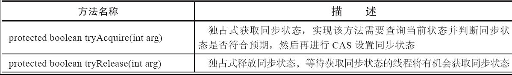

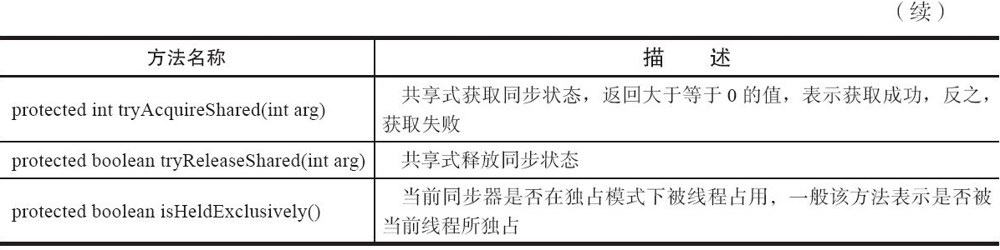

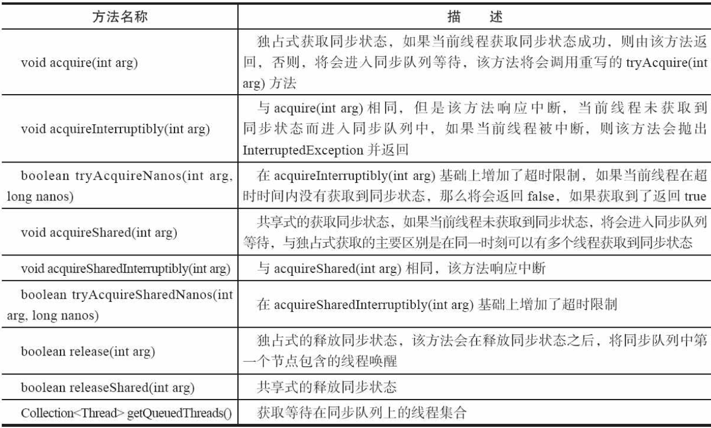

同步器提供的模板方法基本上分为3类：独占式获取与释放同步状态、共享式获取与释放同步状态和查询同步队列中的等待线程情况。自定义同步组件将使用同步器提供的模板方法来实现自己的同步语义。

独占锁就是在同一时刻只能有一个线程获取到锁，而其他获取锁的线程只能处于同步队列中等待，只有获取锁的线程释放了锁，后继的线程才能够获取锁

### 队列同步器的实现分析

#### 同步队列

同步器依赖内部的同步队列（一个FIFO双向队列）来完成同步状态的管理，当前线程获取同步状态失败时，同步器会将当前线程以及等待状态等信息构造成为一个节点（Node）并将其加入同步队列，同时会阻塞当前线程，当同步状态释放时，会把首节点中的线程唤醒，使其再次尝试获取同步状态。

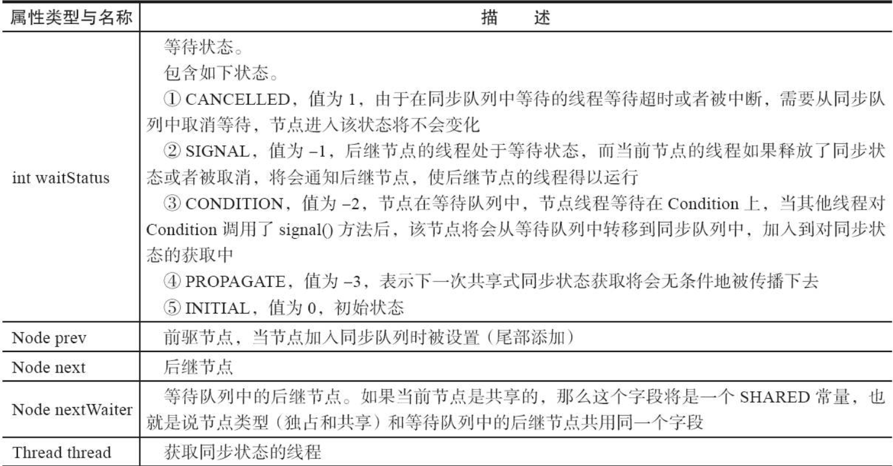

节点是构成同步队列的基础，同步器拥有首节点（head）和尾节点（tail），没有成功获取同步状态的线程将会成为节点加入该队列的尾部

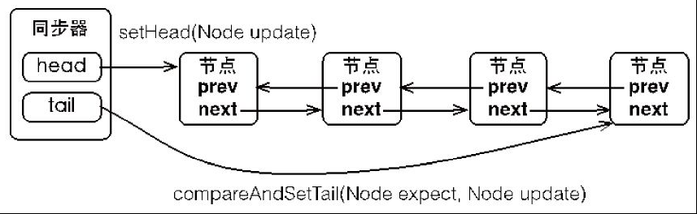

同步器包含了两个节点类型的引用，一个指向头节点，而另一个指向尾节点。试想一下，当一个线程成功地获取了同步状态（或者锁），其他线程将无法获取到同步状态，转而被构造成为节点并加入到同步队列中，而这个加入队列的过程必须要保证线程安全，因此同步器提供了一个基于CAS的设置尾节点的方法：compareAndSetTail(Node expect,Node update)，它需要传递当前线程“认为”的尾节点和当前节点，只有设置成功后，当前节点才正式与之前的尾节点建立关联。

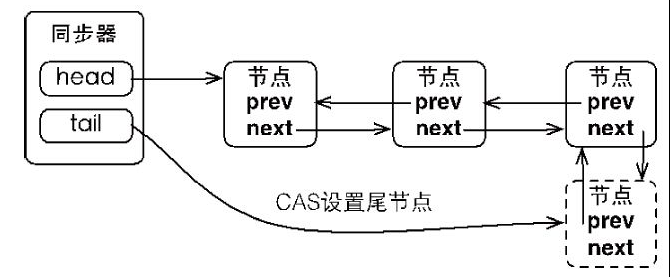

同步队列遵循FIFO，首节点是获取同步状态成功的节点，首节点的线程在释放同步状态时，将会唤醒后继节点，而后继节点将会在获取同步状态成功时将自己设置为首节点

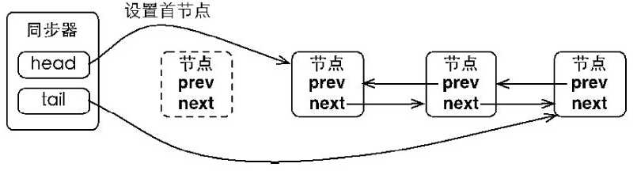

设置首节点是通过获取同步状态成功的线程来完成的，由于只有一个线程能够成功获取到同步状态，因此设置头节点的方法并不需要使用CAS来保证，它只需要将首节点设置成为原首节点的后继节点并断开原首节点的next引用即可。

#### 独占式同步状态获取与释放

通过调用同步器的acquire(int arg)方法可以获取同步状态，该方法对中断不敏感，也就是由于线程获取同步状态失败后进入同步队列中，后续对线程进行中断操作时，线程不会从同步队列中移出

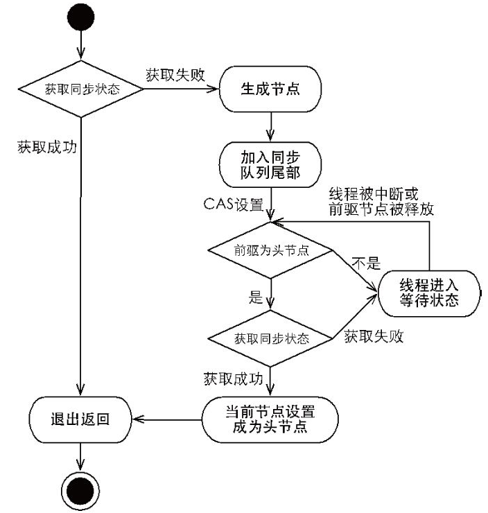

## 重入锁

重入锁ReentrantLock，顾名思义，就是支持重进入的锁，它表示该锁能够支持一个线程对资源的重复加锁。除此之外，该锁的还支持获取锁时的公平和非公平性选择。

ReentrantLock虽然没能像synchronized关键字一样支持隐式的重进入，但是在调用lock()方法时，已经获取到锁的线程，能够再次调用lock()方法获取锁而不被阻塞。

### 实现重进入

重进入是指任意线程在获取到锁之后能够再次获取该锁而不会被锁所阻塞，该特性的实现需要解决以下两个问题:

- 线程再次获取锁。锁需要去识别获取锁的线程是否为当前占据锁的线程，如果是，则再次成功获取。
- 锁的最终释放。线程重复n次获取了锁，随后在第n次释放该锁后，其他线程能够获取到该锁。锁的最终释放要求锁对于获取进行计数自增，计数表示当前锁被重复获取的次数，而锁被释放时，计数自减，当计数等于0时表示锁已经成功释放。

### 公平与非公平获取锁的区别

公平性与否是针对获取锁而言的，如果一个锁是公平的，那么锁的获取顺序就应该符合请求的绝对时间顺序，也就是FIFO。

对于非公平锁，只要CAS设置同步状态成功，则表示当前线程获取了锁，而公平锁则不同

## 读写锁

之前提到锁（如Mutex和ReentrantLock）基本都是排他锁，这些锁在同一时刻只允许一个线程进行访问，而读写锁在同一时刻可以允许多个读线程访问，但是在写线程访问时，所有的读线程和其他写线程均被阻塞。读写锁维护了一对锁，一个读锁和一个写锁，通过分离读锁和写锁，使得并发性相比一般的排他锁有了很大提升。

## LockSupport工具

当需要阻塞或唤醒一个线程的时候，都会使用LockSupport工具类来完成相应工作。LockSupport定义了一组的公共静态方法，这些方法提供了最基本的线程阻塞和唤醒功能，而LockSupport也成为构建同步组件的基础工具。

LockSupport定义了一组以park开头的方法用来阻塞当前线程，以及unpark(Thread thread)方法来唤醒一个被阻塞的线程。

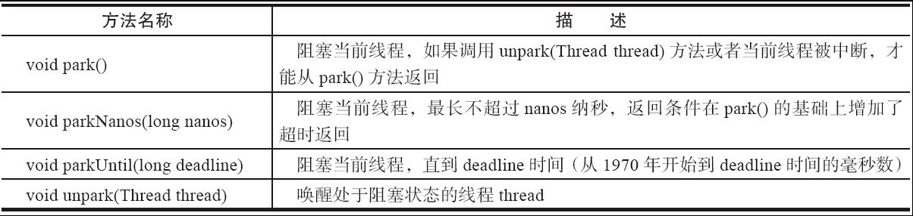

LockSupport增加了park(Object blocker)、parkNanos(Object blocker,long nanos)和parkUntil(Object blocker,long deadline)3个方法，用于实现阻塞当前线程的功能，其中参数blocker是用来标识当前线程在等待的对象（以下称为阻塞对象），该对象主要用于问题排查和系统监控。这是由于在Java 5之前，当线程阻塞（使用synchronized关键字）在一个对象上时，通过线程dump能够查看到该线程的阻塞对象，方便问题定位，而Java 5推出的Lock等并发工具时却遗漏了这一点，致使在线程dump时无法提供阻塞对象的信息。因此，在Java 6中，LockSupport新增了上述3个含有阻塞对象的park方法，用以替代原有的park方法。

## Condition接口

任意一个Java对象，都拥有一组监视器方法（定义在java.lang.Object上），主要包括wait()、wait(long timeout)、notify()以及notifyAll()方法，这些方法与synchronized同步关键字配合，可以实现等待/通知模式。Condition接口也提供了类似Object的监视器方法，与Lock配合可以实现等待/通知模式，但是这两者在使用方式以及功能特性上还是有差别的。

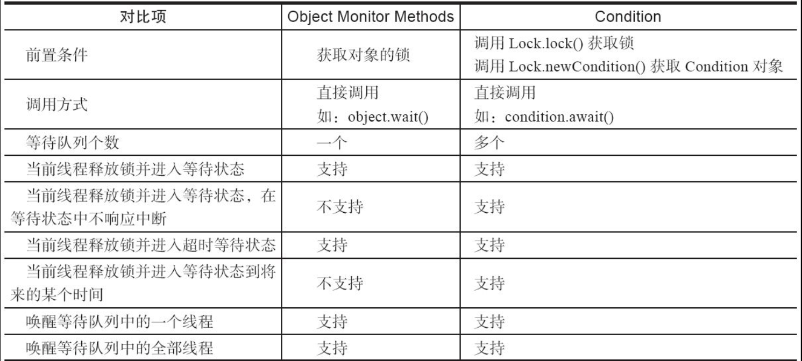

Condition定义了等待/通知两种类型的方法，当前线程调用这些方法时，需要提前获取到Condition对象关联的锁。Condition对象是由Lock对象（调用Lock对象的newCondition()方法）创建出来的，换句话说，Condition是依赖Lock对象的。

如示例所示，一般都会将Condition对象作为成员变量。当调用await()方法后，当前线程会**释放锁**并在此等待，而其他线程调用Condition对象的signal()方法，通知当前线程后，当前线程才从await()方法返回，并且在返回前已经获取了锁。

### Condition的实现分析

ConditionObject是同步器AbstractQueuedSynchronizer的内部类，因为Condition的操作需要获取相关联的锁，所以作为同步器的内部类也较为合理。每个Condition对象都包含着一个队列（以下称为等待队列），该队列是Condition对象实现等待/通知功能的关键。

等待队列是一个FIFO的队列，在队列中的每个节点都包含了一个线程引用，该线程就是在Condition对象上等待的线程，如果一个线程调用了Condition.await()方法，那么该线程将会释放锁、构造成节点加入等待队列并进入等待状态。事实上，节点的定义复用了同步器中节点的定义，也就是说，同步队列和等待队列中节点类型都是同步器的静态内部类AbstractQueuedSynchronizer.Node。

一个Condition包含一个等待队列，Condition拥有首节点（firstWaiter）和尾节点（lastWaiter）。当前线程调用Condition.await()方法，将会以当前线程构造节点，并将节点从尾部加入等待队列

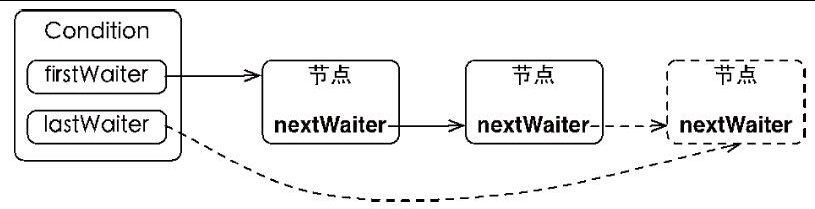

Condition拥有首尾节点的引用，而新增节点只需要将原有的尾节点nextWaiter指向它，并且更新尾节点即可。上述节点引用更新的过程并没有使用CAS保证，原因在于调用await()方法的线程必定是获取了锁的线程，也就是说该过程是由锁来保证线程安全的。

在Object的监视器模型上，一个对象拥有一个同步队列和等待队列，而并发包中的Lock（更确切地说是同步器）拥有一个同步队列和多个等待队列

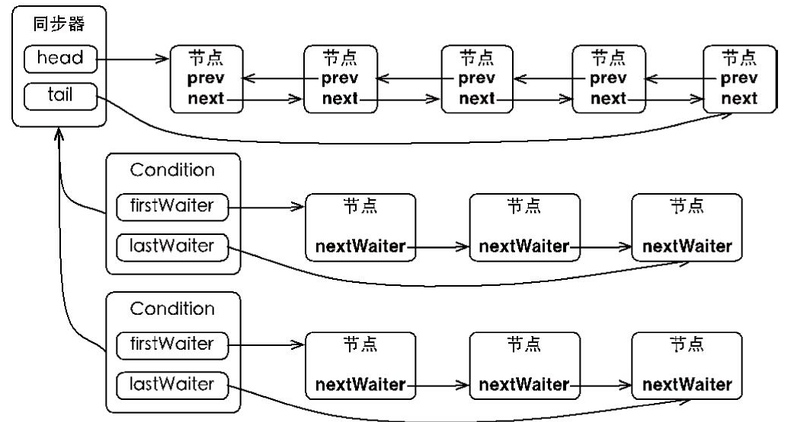

Condition的实现是同步器的内部类，因此每个Condition实例都能够访问同步器提供的方法，相当于每个Condition都拥有所属同步器的引用。

### 等待

调用Condition的await()方法（或者以await开头的方法），会使当前线程进入等待队列并释放锁，同时线程状态变为等待状态。当从await()方法返回时，当前线程一定获取了Condition相关联的锁。

如果从队列（同步队列和等待队列）的角度看await()方法，当调用await()方法时，相当于同步队列的首节点（获取了锁的节点）移动到Condition的等待队列中。

### 通知

调用Condition的signal()方法，将会唤醒在等待队列中等待时间最长的节点（首节点），在唤醒节点之前，会将节点移到同步队列中。
