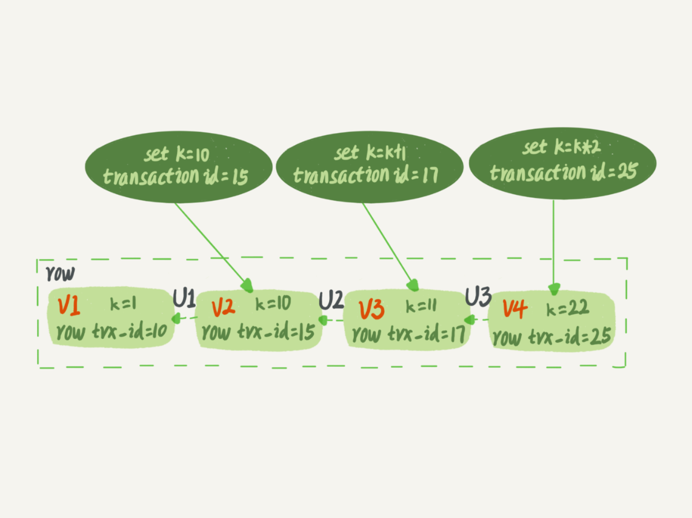

> 本文章仅用于本人学习笔记记录
> 来源《MySQL实战45课》
> 微信：wxid_ygj58saenbjh22（如本文档内容侵权了您的权益，请您通过微信联系到我）


**begin/start transaction 命令并不是一个事务的起点，在执行到它们之后的第一个操作 InnoDB 表的语句，事务才真正启动。**如果你想要马上启动一个事务，可以使用 start transaction with consistent snapshot 这个命令。

在 MySQL 里，有两个“视图”的概念：

- 一个是 view。它是一个用查询语句定义的虚拟表，在调用的时候执行查询语句并生成结果。创建视图的语法是 create view … ，而它的查询方法与表一样。
- 另一个是 InnoDB 在实现 MVCC 时用到的一致性读视图，即 consistent read view，用于支持 RC（Read Committed，读提交）和 RR（Repeatable Read，可重复读）隔离级别的实现。

“快照”在 MVCC 里是怎么工作的？

在可重复读隔离级别下，事务在启动的时候就“拍了个快照”。注意，这个快照是基于整库的。

这时，你会说这看上去不太现实啊。如果一个库有 100G，那么我启动一个事务，MySQL 就要拷贝 100G 的数据出来，这个过程得多慢啊。可是，我平时的事务执行起来很快啊。

实际上，我们并不需要拷贝出这 100G 的数据。我们先来看看这个快照是怎么实现的。

InnoDB 里面每个事务有一个唯一的事务 ID，叫作 transaction id。它是在事务开始的时候向 InnoDB 的事务系统申请的，是按申请顺序严格递增的。

而每行数据也都是有多个版本的。每次事务更新数据的时候，都会生成一个新的数据版本，并且把 transaction id 赋值给这个数据版本的事务 ID，记为 row trx_id。同时，旧的数据版本要保留，并且在新的数据版本中，能够有信息可以直接拿到它。

也就是说，数据表中的一行记录，其实可能有多个版本 (row)，每个版本有自己的 row trx_id。



图中虚线框里是同一行数据的 4 个版本，当前最新版本是 V4，k 的值是 22，它是被 transaction id 为 25 的事务更新的，因此它的 row trx_id 也是 25。

你可能会问，前面的文章不是说，语句更新会生成 undo log（回滚日志）吗？那么，undo log 在哪呢？

实际上，图 2 中的三个虚线箭头，就是 undo log；而 V1、V2、V3 并不是物理上真实存在的，而是每次需要的时候根据当前版本和 undo log 计算出来的。比如，需要 V2 的时候，就是通过 V4 依次执行 U3、U2 算出来。

明白了多版本和 row trx_id 的概念后，我们再来想一下，InnoDB 是怎么定义那个“100G”的快照的。

按照可重复读的定义，一个事务启动的时候，能够看到所有已经提交的事务结果。但是之后，这个事务执行期间，其他事务的更新对它不可见。

因此，一个事务只需要在启动的时候声明说，“以我启动的时刻为准，如果一个数据版本是在我启动之前生成的，就认；如果是我启动以后才生成的，我就不认，我必须要找到它的上一个版本”。

当然，如果“上一个版本”也不可见，那就得继续往前找。还有，如果是这个事务自己更新的数据，它自己还是要认的。

在实现上， InnoDB 为每个事务构造了一个数组，用来保存这个事务启动瞬间，当前正在“活跃”的所有事务 ID。“活跃”指的就是，启动了但还没提交。

数组里面事务 ID 的最小值记为低水位，当前系统里面已经创建过的事务 ID 的最大值加 1 记为高水位。

这个视图数组和高水位，就组成了当前事务的一致性视图（read-view）。

而数据版本的可见性规则，就是基于数据的 row trx_id 和这个一致性视图的对比结果得到的。

这个视图数组把所有的 row trx_id 分成了几种不同的情况。


这样，对于当前事务的启动瞬间来说，一个数据版本的 row trx_id，有以下几种可能：

1. 如果落在绿色部分，表示这个版本是已提交的事务或者是当前事务自己生成的，这个数据是可见的；
2. 如果落在红色部分，表示这个版本是由将来启动的事务生成的，是肯定不可见的；
3. 如果落在黄色部分，那就包括两种情况:a.若 row trx_id 在数组中，表示这个版本是由还没提交的事务生成的，不可见；b.若 row trx_id 不在数组中，表示这个版本是已经提交了的事务生成的，可见。

比如，对于图1中的数据来说，如果有一个事务，它的低水位是 18，那么当它访问这一行数据时，就会从 V4 通过 U3 计算出 V3，所以在它看来，这一行的值是 11。

你看，有了这个声明后，系统里面随后发生的更新，是不是就跟这个事务看到的内容无关了呢？因为之后的更新，生成的版本一定属于上面的 2 或者 3(a) 的情况，而对它来说，这些新的数据版本是不存在的，所以这个事务的快照，就是“静态”的了。

这里，我们不妨做如下假设：

1. 事务 A 开始前，系统里面只有一个活跃事务 ID 是 99；
2. 事务 A、B、C 的版本号分别是 100、101、102，且当前系统里只有这四个事务；
3. 三个事务开始前，(1,1）这一行数据的 row trx_id 是 90。

这样，事务 A 的视图数组就是[99,100], 事务 B 的视图数组是[99,100,101], 事务 C 的视图数组是[99,100,101,102]。

为了简化分析，我先把其他干扰语句去掉，只画出跟事务 A 查询逻辑有关的操作：


从图中可以看到，第一个有效更新是事务 C，把数据从 (1,1) 改成了 (1,2)。这时候，这个数据的最新版本的 row trx_id 是 102，而 90 这个版本已经成为了历史版本。

第二个有效更新是事务 B，把数据从 (1,2) 改成了 (1,3)。这时候，这个数据的最新版本（即 row trx_id）是 101，而 102 又成为了历史版本。

你可能注意到了，在事务 A 查询的时候，其实事务 B 还没有提交，但是它生成的 (1,3) 这个版本已经变成当前版本了。但这个版本对事务 A 必须是不可见的，否则就变成脏读了。

好，现在事务 A 要来读数据了，它的视图数组是[99,100]。当然了，读数据都是从当前版本读起的。所以，事务 A 查询语句的读数据流程是这样的：

- 找到 (1,3) 的时候，判断出 row trx_id=101，比高水位大，处于红色区域，不可见；
- 接着，找到上一个历史版本，一看 row trx_id=102，比高水位大，处于红色区域，不可见；
- 再往前找，终于找到了（1,1)，它的 row trx_id=90，比低水位小，处于绿色区域，可见。

这样执行下来，虽然期间这一行数据被修改过，但是事务 A 不论在什么时候查询，看到这行数据的结果都是一致的，所以我们称之为一致性读。

这个判断规则是从代码逻辑直接转译过来的，但是正如你所见，用于人肉分析可见性很麻烦。

所以，我来给你翻译一下。一个数据版本，对于一个事务视图来说，除了自己的更新总是可见以外，有三种情况：

1. 版本未提交，不可见；
2. 版本已提交，但是是在视图创建后提交的，不可见；
3. 版本已提交，而且是在视图创建前提交的，可见。

现在，我们用这个规则来判断图 4 中的查询结果，事务 A 的查询语句的视图数组是在事务 A 启动的时候生成的，这时候：

1. (1,3) 还没提交，属于情况 1，不可见；
2. (1,2) 虽然提交了，但是是在视图数组创建之后提交的，属于情况 2，不可见；
3. (1,1) 是在视图数组创建之前提交的，可见。

事务 B 的 update 语句，如果按照一致性读，好像结果不对哦？

是的，如果事务 B 在更新之前查询一次数据，这个查询返回的 k 的值确实是 1。

但是，当它要去更新数据的时候，就不能再在历史版本上更新了，否则事务 C 的更新就丢失了。因此，事务 B 此时的 set k=k+1 是在（1,2）的基础上进行的操作。

所以，这里就用到了这样一条规则：**更新数据都是先读后写的，而这个读，只能读当前的值，称为“当前读”（current read）**。

因此，在更新的时候，当前读拿到的数据是 (1,2)，更新后生成了新版本的数据 (1,3)，这个新版本的 row trx_id 是 101。

所以，在执行事务 B 查询语句的时候，一看自己的版本号是 101，最新数据的版本号也是 101，是自己的更新，可以直接使用，所以查询得到的 k 的值是 3。

这里我们提到了一个概念，叫作当前读。其实，**除了 update 语句外，select 语句如果加锁，也是当前读**。

所以，如果把事务 A 的查询语句 select * from t where id=1 修改一下，加上 lock in share mode 或 for update，也都可以读到版本号是 101 的数据，返回的 k 的值是 3。下面这两个 select 语句，就是分别加了读锁（S 锁，共享锁）和写锁（X 锁，排他锁）。

```
mysql> select k from t where id=1 lock in share mode;
mysql> select k from t where id=1 for update;
```

可重复读的核心就是一致性读（consistent read）；而事务更新数据的时候，只能用当前读。如果当前的记录的行锁被其他事务占用的话，就需要进入锁等待。

而读提交的逻辑和可重复读的逻辑类似，它们最主要的区别是：

- 在可重复读隔离级别下，只需要在事务开始的时候创建一致性视图，之后事务里的其他查询都共用这个一致性视图；
- 在读提交隔离级别下，每一个语句执行前都会重新算出一个新的视图。

## 小结

1. InnoDB 的行数据有多个版本，每个数据版本有自己的 row trx_id，每个事务或者语句有自己的一致性视图。普通查询语句是一致性读，一致性读会根据 row trx_id 和一致性视图确定数据版本的可见性。

2. 对于可重复读，查询只承认在事务启动前就已经提交完成的数据；

3. 对于读提交，查询只承认在语句启动前就已经提交完成的数据；

4. 而当前读，总是读取已经提交完成的最新版本。

5. 更新数据都是先读后写的，而这个读，只能读当前的值，称为“当前读”（current read）。

6. begin/start transaction 命令并不是一个事务的起点，在执行到它们之后的第一个操作 InnoDB 表的语句，事务才真正启动