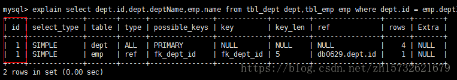
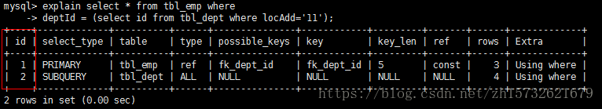
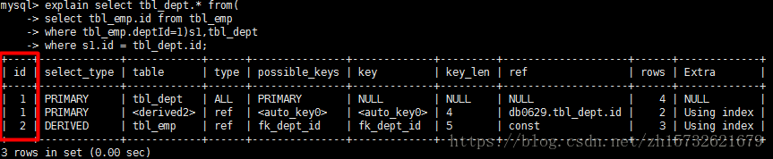
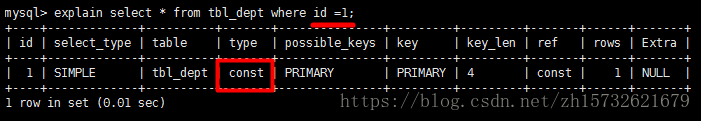

## EXPLAIN如何用

explain + SQL语句即可,如下:

```
explain select * from tbl_dept;
```

## EXPLAIN结果参数含义

### id

id代表执行select子句或操作表的顺序,id分别有三种不同的执行结果,分别如下: 

- id相同,执行顺序由上至下



- id不同,如果是子查询,id的序号会递增,id值越大,优先级越高,越先被执行



- id相同和不同,同时存在,遵从优先级高的优先执行,优先级相同的按照由上至下的顺序执行



### select_type

查询的类型,主要用于区别普通查询,联合查询,子查询等复杂查询

- simple:简单的select查询,查询中不包含子查询或union查询
- primary:查询中若包含任何复杂的子部分,最外层查询则被标记为primary
- subquery 在select 或where 列表中包含了子查询
- derived 在from列表中包含的子查询被标记为derived,mysql会递归这些子查询,把结果放在临时表里
- union 做第二个select出现在union之后,则被标记为union,若union包含在from子句的子查询中,外层select将被标记为derived
- union result 从union表获取结果的select

### table

显示一行的数据时关于哪张表的

### type

**查询类型从最好到最差依次是:system>const>eq_ref>ref>range>index>All,一般情况下,得至少保证达到range级别,最好能达到ref**

- system:表只有一行记录,这是const类型的特例,平时不会出现
- const:表示通过索引一次就找到了,const即常量,它用于比较primary key或unique索引,因为只匹配一行数据,所以效率很快,如将主键置于where条件中,mysql就能将该查询转换为一个常量

    

- eq_ref:唯一性索引扫描,对于每个索引键,表中只有一条记录与之匹配,常见于主键或唯一索引扫描
- ref:非唯一性索引扫描,返回匹配某个单独值的行,它可能会找到多个符合条件的行,所以他应该属于查找和扫描的混合体
- range:只检索给定范围的行,使用一个索引来选择行,如where语句中出现了between,<,>,in等查询,这种范围扫描索引比全表扫描要好，因为它只需要开始于索引的某一点，而结束于另一点，不用扫描全部索引。
- index:index类型只遍历索引树,这通常比All快,因为索引文件通常比数据文件小,index是从索引中读取,all从硬盘中读取
- all:全表扫描,是最差的一种查询类型

### possible_keys

显示可能应用在这张表中的索引,一个或多个,查询到的索引不一定是真正被用到的

### key

实际使用的索引,如果为null,则没有使用索引,因此会出现possible_keys列有可能被用到的索引,但是key列为null,表示实际没用索引。

### key_len

表示索引中使用的字节数,而通过该列计算查询中使用的 索引长度,在不损失精确性的情况下,长度越短越好,key_len显示的值为索引字段的最大可能长度,并非实际使用长度,即,key_len是根据表定义计算而得么不是通过表内检索出的

### ref

显示索引的哪一列被使用了,如果可能的话是一个常数,哪些列或常量被用于查找索引列上的值

### rows

根据表统计信息及索引选用情况,大只估算出找到所需的记录所需要读取的行数

### Extra

- Using filesort:说明mysql会对数据使用一个外部的索引排序,而不是按照表内的索引顺序进行读取,mysql中无法利用索引完成的排序操作称为"文件排序"
- Using temporary :使用了临时表保存中间结果,mysql在对查询结果排序时使用临时表,常见于order by和分组查询group by
- Using index:表示相应的select操作中使用了覆盖索引（Covering Index），避免访问了表的数据行，效率不错。如果同时出现using where，表明索引被用来执行索引键值的查找；如果没有同时出现using where，表明索引用来读取数据而非执行查找动作。 其中的覆盖索引含义是所查询的列是和建立的索引字段和个数是一一对应的
- Using where:表明使用了where过滤
- Using join buffer:表明使用了连接缓存,如在查询的时候会有多次join,则可能会产生临时表
- impossible where:表示where子句的值总是false,不能用来获取任何元祖
- select tables optimized away:在没有GROUPBY子句的情况下，基于索引优化MIN/MAX操作或者对于MyISAM存储引擎优化COUNT(*)操作，不必等到执行阶段再进行计算，查询执行计划生成的阶段即完成优化。
- distinct:优化distinct操作，在找到第一匹配的元组后即停止找同样值的动作