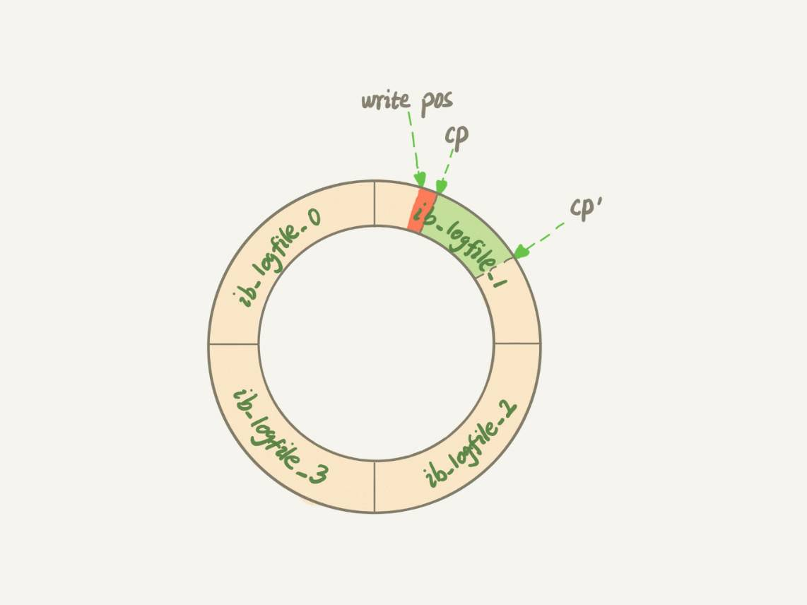

> 本文章仅用于本人学习笔记记录
> 来源《MySQL实战45课》
> 微信：wxid_ygj58saenbjh22（如本文档内容侵权了您的权益，请您通过微信联系到我）

## 你的 SQL 语句为什么变“慢”了

1. 第一种场景是，粉板满了，记不下了。这时候如果再有人来赊账，掌柜就只得放下手里的活儿，将粉板上的记录擦掉一些，留出空位以便继续记账。当然在擦掉之前，他必须先将正确的账目记录到账本中才行。

    也就是InnoDB 的 redo log 写满了。这时候系统会停止所有更新操作，把 checkpoint 往前推进，redo log 留出空间可以继续写。

    

    checkpoint 可不是随便往前修改一下位置就可以的。比如上图中，把 checkpoint 位置从 CP 推进到 CP’，就需要将两个点之间的日志（浅绿色部分），对应的所有脏页都 flush 到磁盘上。之后，图中从 write pos 到 CP’之间就是可以再写入的 redo log 的区域。

2. 第二种场景是，这一天生意太好，要记住的事情太多，掌柜发现自己快记不住了，赶紧找出账本把孔乙己这笔账先加进去。

    这种场景，对应的就是系统内存不足。当需要新的内存页，而内存不够用的时候，就要淘汰一些数据页，空出内存给别的数据页使用。如果淘汰的是“脏页”，就要先将脏页写到磁盘。


3. 第三种场景是，生意不忙的时候，或者打烊之后。这时候柜台没事，掌柜闲着也是闲着，不如更新账本。

    这种场景，对应的就是 MySQL 认为系统“空闲”的时候。当然，MySQL“这家酒店”的生意好起来可是会很快就能把粉板记满的，所以“掌柜”要合理地安排时间，即使是“生意好”的时候，也要见缝插针地找时间，只要有机会就刷一点“脏页”。

4. 第四种场景是，年底了咸亨酒店要关门几天，需要把账结清一下。这时候掌柜要把所有账都记到账本上，这样过完年重新开张的时候，就能就着账本明确账目情况了。
    
    这种场景，对应的就是 MySQL 正常关闭的情况。这时候，MySQL 会把内存的脏页都 flush 到磁盘上，这样下次 MySQL 启动的时候，就可以直接从磁盘上读数据，启动速度会很快。

分析一下上面四种场景对性能的影响。

其中，第三种情况是属于 MySQL 空闲时的操作，这时系统没什么压力，而第四种场景是数据库本来就要关闭了。这两种情况下，你不会太关注“性能”问题。所以这里，我们主要来分析一下前两种场景下的性能问题。

第一种是“redo log 写满了，要 flush 脏页”，这种情况是 InnoDB 要尽量避免的。因为出现这种情况的时候，整个系统就不能再接受更新了，所有的更新都必须堵住。如果你从监控上看，这时候更新数会跌为 0。

第二种是“内存不够用了，要先将脏页写到磁盘”，这种情况其实是常态。InnoDB 用缓冲池（buffer pool）管理内存，缓冲池中的内存页有三种状态：

- 第一种是，还没有使用的；
- 第二种是，使用了并且是干净页；
- 第三种是，使用了并且是脏页。

InnoDB 的策略是尽量使用内存，因此对于一个长时间运行的库来说，未被使用的页面很少。

而当要读入的数据页没有在内存的时候，就必须到缓冲池中申请一个数据页。这时候只能把最久不使用的数据页从内存中淘汰掉：如果要淘汰的是一个干净页，就直接释放出来复用；但如果是脏页呢，就必须将脏页先刷到磁盘，变成干净页后才能复用。

所以，刷脏页虽然是常态，但是出现以下这两种情况，都是会明显影响性能的：

- 一个查询要淘汰的脏页个数太多，会导致查询的响应时间明显变长；
- 日志写满，更新全部堵住，写性能跌为 0，这种情况对敏感业务来说，是不能接受的。

所以，InnoDB 需要有控制脏页比例的机制，来尽量避免上面的这两种情况。

## InnoDB 刷脏页的控制策略

首先，你要正确地告诉 InnoDB 所在主机的 IO 能力，这样 InnoDB 才能知道需要全力刷脏页的时候，可以刷多快。

这就要用到 innodb_io_capacity 这个参数了，它会告诉 InnoDB 你的磁盘能力。这个值我建议你设置成磁盘的 IOPS。磁盘的 IOPS 可以通过 fio 这个工具来测试，下面的语句是我用来测试磁盘随机读写的命令：

```
 fio -filename=$filename -direct=1 -iodepth 1 -thread -rw=randrw -ioengine=psync -bs=16k -size=500M -numjobs=10 -runtime=10 -group_reporting -name=mytest 
```

虽然我们现在已经定义了“全力刷脏页”的行为，但平时总不能一直是全力刷吧？毕竟磁盘能力不能只用来刷脏页，还需要服务用户请求。所以接下来，我们就一起看看 InnoDB 怎么控制引擎按照“全力”的百分比来刷脏页。

这个问题可以这么想，如果刷太慢，会出现什么情况？首先是内存脏页太多，其次是 redo log 写满。

所以，InnoDB 的刷盘速度就是要参考这两个因素：一个是脏页比例，一个是 redo log 写盘速度。

InnoDB 会根据这两个因素先单独算出两个数字。

参数 innodb_max_dirty_pages_pct 是脏页比例上限，默认值是 75%。InnoDB 会根据当前的脏页比例（假设为 M），算出一个范围在 0 到 100 之间的数字.

现在你知道了，InnoDB 会在后台刷脏页，而刷脏页的过程是要将内存页写入磁盘。所以，无论是你的查询语句在需要内存的时候可能要求淘汰一个脏页，还是由于刷脏页的逻辑会占用 IO 资源并可能影响到了你的更新语句，都可能是造成你从业务端感知到 MySQL“抖”了一下的原因。

要尽量避免这种情况，你就要合理地设置 innodb_io_capacity 的值，并且平时要多关注脏页比例，不要让它经常接近 75%。

一旦一个查询请求需要在执行过程中先 flush 掉一个脏页时，这个查询就可能要比平时慢了。而 MySQL 中的一个机制，可能让你的查询会更慢：在准备刷一个脏页的时候，如果这个数据页旁边的数据页刚好是脏页，就会把这个“邻居”也带着一起刷掉；而且这个把“邻居”拖下水的逻辑还可以继续蔓延，也就是对于每个邻居数据页，如果跟它相邻的数据页也还是脏页的话，也会被放到一起刷。

在 InnoDB 中，innodb_flush_neighbors 参数就是用来控制这个行为的，值为 1 的时候会有上述的“连坐”机制，值为 0 时表示不找邻居，自己刷自己的。

找“邻居”这个优化在机械硬盘时代是很有意义的，可以减少很多随机 IO。机械硬盘的随机 IOPS 一般只有几百，相同的逻辑操作减少随机 IO 就意味着系统性能的大幅度提升。

而如果使用的是 SSD 这类 IOPS 比较高的设备的话，我就建议你把 innodb_flush_neighbors 的值设置成 0。因为这时候 IOPS 往往不是瓶颈，而“只刷自己”，就能更快地执行完必要的刷脏页操作，减少 SQL 语句响应时间。

## 小结

1. MySQL抖一下是什么意思？

    抖我认为就是不稳定的意思，一个SQL语句平时速度都挺快的，偶尔会慢一下且没啥规律，就是抖啦！

2. MySQL为啥会抖一下？

    因为运行的不正常了，或者不稳定了，需要花费更多的资源处理别的事情，会使SQL语句的执行效率明显变慢。针对innoDB导致MySQL抖的原因，主要是InnoDB 会在后台刷脏页，而刷脏页的过程是要将内存页写入磁盘。所以，无论是你的查询语句在需要内存的时候可能要求淘汰一个脏页，还是由于刷脏页的逻辑会占用 IO 资源并可能影响到了你的更新语句，都可能是造成你从业务端感知MySQL“抖”了一下的原因。

3. MySQL抖一下有啥问题？

    很明显系统不稳定，性能突然下降对业务端是很不友好的。

4. 怎么让MySQL不抖？

    设置合理参数配配置，尤其是设置 好innodb_io_capacity 的值，并且平时要多关注脏页比例，不要让它经常接近 75%

5. 啥是脏页？

    当内存数据页跟磁盘数据页内容不一致的时候，我们称这个内存页为“脏页”。

    按照这个定义感觉脏页是不可避免的，写的时候总会先写内存再写磁盘和有没有用WAL没啥关系？

6. 啥是干净页？

    内存数据写入到磁盘后，内存和磁盘上的数据页的内容就一致了，称为“干净页”。

7. 脏页是咋产生的？

    因为使用了WAL技术，这个技术会把数据库的随机写转化为顺序写，但副作用就是会产生脏页。

8. 啥是随机写？为啥那么耗性能？

    随机写我的理解是，这次写磁盘的那个扇区和上一次没啥关系，需要重新定位位置，机械运动是很慢的即使不是机械运动重新定位写磁盘的位置也是很耗时的。

9. 啥是顺序写？

    顺序写我的理解是，这次写磁盘那个扇区就在上一次的下一个位置，不需要重新定位写磁盘的位置速度当然会快一些。

10. WAL怎么把随机写转化为顺序写的？

    写redolog是顺序写的，先写redolog等合适的时候再写磁盘，间接的将随机写变成了顺序写，性能确实会提高不少。

