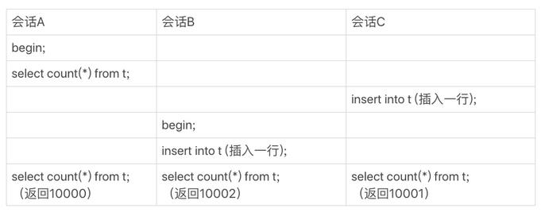

> 本文章仅用于本人学习笔记记录
> 来源《MySQL实战45课》
> 微信：wxid_ygj58saenbjh22（如本文档内容侵权了您的权益，请您通过微信联系到我）

## count(*) 的实现方式

在不同的 MySQL 引擎中，count(*) 有不同的实现方式。

- MyISAM 引擎把一个表的总行数存在了磁盘上，因此执行 count(*) 的时候会直接返回这个数，效率很高；
- 而 InnoDB 引擎就麻烦了，它执行 count(*) 的时候，需要把数据一行一行地从引擎里面读出来，然后累积计数。

这里需要注意的是，我们在这篇文章里讨论的是没有过滤条件的 count(*)，如果加了 where 条件的话，MyISAM 表也是不能返回得这么快的。

为什么 InnoDB 不跟 MyISAM 一样，也把数字存起来呢？

这是因为即使是在同一个时刻的多个查询，由于多版本并发控制（MVCC）的原因，InnoDB 表“应该返回多少行”也是不确定的。这里，我用一个算 count(*) 的例子来为你解释一下。

假设表 t 中现在有 10000 条记录，我们设计了三个用户并行的会话。

- 会话 A 先启动事务并查询一次表的总行数；
- 会话 B 启动事务，插入一行后记录后，查询表的总行数；
- 会话 C 先启动一个单独的语句，插入一行记录后，查询表的总行数。

你会看到，在最后一个时刻，三个会话 A、B、C 会同时查询表 t 的总行数，但拿到的结果却不同。

这和 InnoDB 的事务设计有关系，可重复读是它默认的隔离级别，在代码上就是通过多版本并发控制，也就是 MVCC 来实现的。每一行记录都要判断自己是否对这个会话可见，因此对于 count(*) 请求来说，InnoDB 只好把数据一行一行地读出依次判断，可见的行才能够用于计算“基于这个查询”的表的总行数。

**InnoDB 是索引组织表，主键索引树的叶子节点是数据，而普通索引树的叶子节点是主键值。所以，普通索引树比主键索引树小很多。对于 count(*) 这样的操作，遍历哪个索引树得到的结果逻辑上都是一样的。因此，MySQL 优化器会找到最小的那棵树来遍历。在保证逻辑正确的前提下，尽量减少扫描的数据量，是数据库系统设计的通用法则之一。**

如果你用过 show table status 命令的话，就会发现这个命令的输出结果里面也有一个 TABLE_ROWS 用于显示这个表当前有多少行，这个命令执行挺快的，那这个 TABLE_ROWS 能代替 count(*) 吗？

索引统计的值是通过采样来估算的。实际上，TABLE_ROWS 就是从这个采样估算得来的，因此它也很不准。有多不准呢，官方文档说误差可能达到 40% 到 50%。所以，show table status 命令显示的行数也不能直接使用。

小结一下：

- MyISAM 表虽然 count(*) 很快，但是不支持事务；
- show table status 命令虽然返回很快，但是不准确；
- InnoDB 表直接 count(*) 会遍历全表，虽然结果准确，但会导致性能问题。

## 不同的 count 用法

在 select count(?) from t 这样的查询语句里面，count(*)、count(主键 id)、count(字段) 和 count(1) 等不同用法的性能，有哪些差别?

count() 是一个聚合函数，对于返回的结果集，一行行地判断，如果 count 函数的参数不是 NULL，累计值就加 1，否则不加。最后返回累计值。

**所以，count(*)、count(主键 id) 和 count(1) 都表示返回满足条件的结果集的总行数；而 count(字段），则表示返回满足条件的数据行里面，参数“字段”不为 NULL 的总个数。**

至于分析性能差别的时候，你可以记住这么几个原则：

- server 层要什么就给什么；
- InnoDB 只给必要的值；
- 现在的优化器只优化了 count(*) 的语义为“取行数”，其他“显而易见”的优化并没有做。

对于 count(主键 id) 来说，InnoDB 引擎会遍历整张表，把每一行的 id 值都取出来，返回给 server 层。server 层拿到 id 后，判断是不可能为空的，就按行累加。

对于 count(1) 来说，InnoDB 引擎遍历整张表，但不取值。server 层对于返回的每一行，放一个数字“1”进去，判断是不可能为空的，按行累加。

单看这两个用法的差别的话，你能对比出来，count(1) 执行得要比 count(主键 id) 快。因为从引擎返回 id 会涉及到解析数据行，以及拷贝字段值的操作。

对于 count(字段) 来说：

- 如果这个“字段”是定义为 not null 的话，一行行地从记录里面读出这个字段，判断不能为 null，按行累加；
- 如果这个“字段”定义允许为 null，那么执行的时候，判断到有可能是 null，还要把值取出来再判断一下，不是 null 才累加。

也就是前面的第一条原则，server 层要什么字段，InnoDB 就返回什么字段。

**但是 count(*) 是例外，并不会把全部字段取出来，而是专门做了优化，不取值。count(*) 肯定不是 null，按行累加。**

所以结论是：按照效率排序的话，count(字段)<count(主键 id)<count(1)≈count(*)，所以我建议你，尽量使用 count(*)。

## 小结

1. 按照效率排序的话，count(字段)<count(主键 id)<count(1)≈count(*)，建议尽量使用 count(*)

2. MyISAM 引擎把一个表的总行数存在了磁盘上，因此执行 count(*) 的时候会直接返回这个数，效率很高；

3. 而 InnoDB 引擎就麻烦了，它执行 count(*) 的时候，需要把数据一行一行地从引擎里面读出来，然后累积计数。

4. count() 是一个聚合函数，对于返回的结果集，一行行地判断，如果 count 函数的参数不是 NULL，累计值就加 1，否则不加，最后返回累计值。

5. 如果这个“字段”是定义为 not null 的话，一行行地从记录里面读出这个字段，判断不能为 null，按行累加；

6. 如果这个“字段”定义允许为 null，那么执行的时候，判断到有可能是 null，还要把值取出来再判断一下，不是 null 才累加。

7. 从引擎返回的字段会涉及到解析数据行，以及拷贝字段值的操作。

8. 对于 count(主键 id) 来说，InnoDB 引擎会遍历整张表，把每一行的 id 值都取出来，返回给 server 层。server 层拿到 id 后，判断是不可能为空的，就按行累加。从引擎返回的 主键id 会涉及到解析数据行，以及拷贝字段值的操作。

9. 对于 count(1) 来说，InnoDB 引擎遍历整张表，但不取值。server 层对于返回的每一行，放一个数字“1”进去，判断是不可能为空的，按行累加。

10. 对于count(*)来说，并不会把全部字段取出来，而是专门做了优化，不取值。count(*) 肯定不是 null，按行累加。