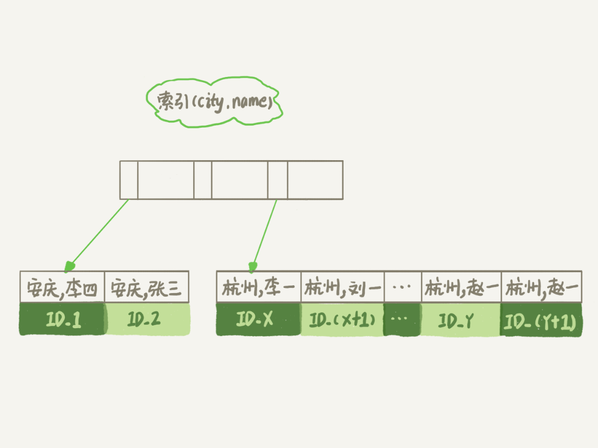
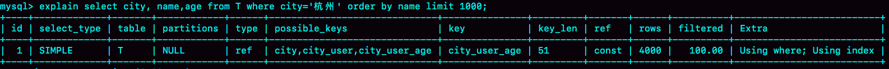

> 本文章仅用于本人学习笔记记录
> 来源《MySQL实战45课》
> 微信：wxid_ygj58saenbjh22（如本文档内容侵权了您的权益，请您通过微信联系到我）

## 全字段排序

假设你要查询城市是“杭州”的所有人名字，并且按照姓名排序返回前 1000 个人的姓名、年龄。

```
CREATE TABLE `t` (
  `id` int(11) NOT NULL,
  `city` varchar(16) NOT NULL,
  `name` varchar(16) NOT NULL,
  `age` int(11) NOT NULL,
  `addr` varchar(128) DEFAULT NULL,
  PRIMARY KEY (`id`),
  KEY `city` (`city`)
) ENGINE=InnoDB;
```

```
select city,name,age from t where city='杭州' order by name limit 1000  ;
```

为避免全表扫描，我们需要在 city 字段加上索引。

在 city 字段上创建索引之后，我们用 explain 命令来看看这个语句的执行情况。


Extra 这个字段中的“Using filesort”表示的就是需要排序，MySQL 会给每个线程分配一块内存用于排序，称为 sort_buffer。


从图中可以看到，满足 city='杭州’条件的行，是从 ID_X 到 ID_(X+N) 的这些记录。

通常情况下，这个语句执行流程如下所示 ：

1. 初始化 sort_buffer，确定放入 name、city、age 这三个字段；
2. 从索引 city 找到第一个满足 city='杭州’条件的主键 id，也就是图中的 ID_X；
3. 到主键 id 索引取出整行，取 name、city、age 三个字段的值，存入 sort_buffer 中；
4. 从索引 city 取下一个记录的主键 id；
5. 重复步骤 3、4 直到 city 的值不满足查询条件为止，对应的主键 id 也就是图中的 ID_Y；
6. 对 sort_buffer 中的数据按照字段 name 做快速排序；
7. 按照排序结果取前 1000 行返回给客户端。

我们暂且把这个排序过程，称为全字段排序，执行流程的示意图如下所示


图中“按 name 排序”这个动作，可能在内存中完成，也可能需要使用外部排序，这取决于排序所需的内存和参数 sort_buffer_size。

sort_buffer_size，就是 MySQL 为排序开辟的内存（sort_buffer）的大小。如果要排序的数据量小于 sort_buffer_size，排序就在内存中完成。但如果排序数据量太大，内存放不下，则不得不利用磁盘临时文件辅助排序。

可以用下面介绍的方法，来确定一个排序语句是否使用了临时文件。

```
/* 打开optimizer_trace，只对本线程有效 */
SET optimizer_trace='enabled=on'; 

/* @a保存Innodb_rows_read的初始值 */
select VARIABLE_VALUE into @a from  performance_schema.session_status where variable_name = 'Innodb_rows_read';

/* 执行语句 */
select city, name,age from t where city='杭州' order by name limit 1000; 

/* 查看 OPTIMIZER_TRACE 输出 */
SELECT * FROM `information_schema`.`OPTIMIZER_TRACE`\G

/* @b保存Innodb_rows_read的当前值 */
select VARIABLE_VALUE into @b from performance_schema.session_status where variable_name = 'Innodb_rows_read';

/* 计算Innodb_rows_read差值 */
select @b-@a;
```

这个方法是通过查看 OPTIMIZER_TRACE 的结果来确认的，你可以从 number_of_tmp_files 中看到是否使用了临时文件。


number_of_tmp_files 表示的是，排序过程中使用的临时文件数。你一定奇怪，为什么需要 12 个文件？内存放不下时，就需要使用外部排序，外部排序一般使用归并排序算法。可以这么简单理解，MySQL 将需要排序的数据分成 12 份，每一份单独排序后存在这些临时文件中。然后把这 12 个有序文件再合并成一个有序的大文件。

如果 sort_buffer_size 超过了需要排序的数据量的大小，number_of_tmp_files 就是 0，表示排序可以直接在内存中完成。

否则就需要放在临时文件中排序。sort_buffer_size 越小，需要分成的份数越多，number_of_tmp_files 的值就越大。

## rowid 排序

在上面这个算法过程里面，只对原表的数据读了一遍，剩下的操作都是在 sort_buffer 和临时文件中执行的。但这个算法有一个问题，就是如果查询要返回的字段很多的话，那么 sort_buffer 里面要放的字段数太多，这样内存里能够同时放下的行数很少，要分成很多个临时文件，排序的性能会很差。

所以如果单行很大，这个方法效率不够好。

那么，如果 MySQL 认为排序的单行长度太大会怎么做呢？

接下来，我来修改一个参数，让 MySQL 采用另外一种算法。

```
SET max_length_for_sort_data = 16;
```

max_length_for_sort_data，是 MySQL 中专门控制用于排序的行数据的长度的一个参数。它的意思是，如果单行的长度超过这个值，MySQL 就认为单行太大，要换一个算法。

city、name、age 这三个字段的定义总长度是 36，我把 max_length_for_sort_data 设置为 16，我们再来看看计算过程有什么改变。

新的算法放入 sort_buffer 的字段，只有要排序的列（即 name 字段）和主键 id。

但这时，排序的结果就因为少了 city 和 age 字段的值，不能直接返回了，整个执行流程就变成如下所示的样子：

1. 初始化 sort_buffer，确定放入两个字段，即 name 和 id；
2. 从索引 city 找到第一个满足 city='杭州’条件的主键 id，也就是图中的 ID_X；
3. 到主键 id 索引取出整行，取 name、id 这两个字段，存入 sort_buffer 中；
4. 从索引 city 取下一个记录的主键 id；
5. 重复步骤 3、4 直到不满足 city='杭州’条件为止，也就是图中的 ID_Y；
6. 对 sort_buffer 中的数据按照字段 name 进行排序；
7. 遍历排序结果，取前 1000 行，并按照 id 的值回到原表中取出 city、name 和 age 三个字段返回给客户端。

这个执行流程的示意图如下，我把它称为 rowid 排序。


对比全字段排序流程图你会发现，rowid 排序多访问了一次表 t 的主键索引，就是步骤 7。

需要说明的是，最后的“结果集”是一个逻辑概念，实际上 MySQL 服务端从排序后的 sort_buffer 中依次取出 id，然后到原表查到 city、name 和 age 这三个字段的结果，不需要在服务端再耗费内存存储结果，是直接返回给客户端的。

## 全字段排序 VS rowid 排序

如果 MySQL 实在是担心排序内存太小，会影响排序效率，才会采用 rowid 排序算法，这样排序过程中一次可以排序更多行，但是需要再回到原表去取数据。

如果 MySQL 认为内存足够大，会优先选择全字段排序，把需要的字段都放到 sort_buffer 中，这样排序后就会直接从内存里面返回查询结果了，不用再回到原表去取数据。

这也就体现了 MySQL 的一个设计思想：如果内存够，就要多利用内存，尽量减少磁盘访问。

对于 InnoDB 表来说，rowid 排序会要求回表多造成磁盘读，因此不会被优先选择。

其实，并不是所有的 order by 语句，都需要排序操作的。从上面分析的执行过程，我们可以看到，MySQL 之所以需要生成临时表，并且在临时表上做排序操作，其原因是原来的数据都是无序的。

你可以设想下，如果能够保证从 city 这个索引上取出来的行，天然就是按照 name 递增排序的话，是不是就可以不用再排序了呢？

所以，我们可以在这个市民表上创建一个 city 和 name 的联合索引，对应的 SQL 语句是

```
alter table t add index city_user(city, name);
```

作为与 city 索引的对比，我们来看看这个索引的示意图。



在这个索引里面，我们依然可以用树搜索的方式定位到第一个满足 city='杭州’的记录，并且额外确保了，接下来按顺序取“下一条记录”的遍历过程中，只要 city 的值是杭州，name 的值就一定是有序的。

这样整个查询过程的流程就变成了：

1. 从索引 (city,name) 找到第一个满足 city='杭州’条件的主键 id；
2. 到主键 id 索引取出整行，取 name、city、age 三个字段的值，作为结果集的一部分直接返回；
3. 从索引 (city,name) 取下一个记录主键 id；
4. 重复步骤 2、3，直到查到第 1000 条记录，或者是不满足 city='杭州’条件时循环结束。


可以看到，这个查询过程不需要临时表，也不需要排序。接下来，我们用 explain 的结果来印证一下。


从图中可以看到，Extra 字段中没有 Using filesort 了，也就是不需要排序了。而且由于 (city,name) 这个联合索引本身有序，所以这个查询也不用把 4000 行全都读一遍，只要找到满足条件的前 1000 条记录就可以退出了。也就是说，在我们这个例子里，只需要扫描 1000 次。

覆盖索引是指，索引上的信息足够满足查询请求，不需要再回到主键索引上去取数据。

按照覆盖索引的概念，我们可以再优化一下这个查询语句的执行流程。

针对这个查询，我们可以创建一个 city、name 和 age 的联合索引，对应的 SQL 语句就是：

```
alter table t add index city_user_age(city, name, age);
```

这时，对于 city 字段的值相同的行来说，还是按照 name 字段的值递增排序的，此时的查询语句也就不再需要排序了。这样整个查询语句的执行流程就变成了：

1. 从索引 (city,name,age) 找到第一个满足 city='杭州’条件的记录，取出其中的 city、name 和 age 这三个字段的值，作为结果集的一部分直接返回；
2. 从索引 (city,name,age) 取下一个记录，同样取出这三个字段的值，作为结果集的一部分直接返回；
3. 重复执行步骤 2，直到查到第 1000 条记录，或者是不满足 city='杭州’条件时循环结束。


然后，我们再来看看 explain 的结果。



可以看到，Extra 字段里面多了“Using index”，表示的就是使用了覆盖索引，性能上会快很多。

## 小结

1. MySQL会为每个线程分配一个内存（sort_buffer）用于排序该内存大小为sort_buffer_size
    - 如果排序的数据量小于sort_buffer_size，排序将会在内存中完成
    - 如果排序数据量很大，内存中无法存下这么多数据，则会使用磁盘临时文件来辅助排序，也称外部排序
    - 在使用外部排序时，MySQL会分成好几份单独的临时文件用来存放排序后的数据，然后在将这些文件合并成一个大文件
    - 按照情况建立联合索引来避免排序所带来的性能损耗，允许的情况下也可以建立覆盖索引来避免回表

2. 全字段排序
    - 通过索引将所需的字段全部读取到sort_buffer中
    - 按照排序字段进行排序
    - 将结果集返回给客户端
    缺点：
    - 造成sort_buffer中存放不下很多数据，因为除了排序字段还存放其他字段，对sort_buffer的利用效率不高
    - 当所需排序数据量很大时，会有很多的临时文件，排序性能也会很差
    优点：MySQL认为内存足够大时会优先选择全字段排序，因为这种方式比rowid 排序避免了一次回表操作

3. rowid排序
    - 通过控制排序的行数据的长度来让sort_buffer中尽可能多的存放数据，max_length_for_sort_data
    - 只将需要排序的字段和主键读取到sort_buffer中，并按照排序字段进行排序
    - 按照排序后的顺序，取id进行回表取出想要获取的数据
    - 将结果集返回给客户端
    优点：更好的利用内存的sort_buffer进行排序操作，尽量减少对磁盘的访问
    缺点：回表的操作是随机IO，会造成大量的随机读，不一定就比全字段排序减少对磁盘的访问

4. 全字段排序 VS rowid 排序
    - 如果 MySQL 实在是担心排序内存太小，会影响排序效率，才会采用 rowid 排序算法，这样排序过程中一次可以排序更多行，但是需要再回到原表去取数据。
    - 如果 MySQL 认为内存足够大，会优先选择全字段排序，把需要的字段都放到 sort_buffer 中，这样排序后就会直接从内存里面返回查询结果了，不用再回到原表去取数据。

5. 如果遇到order by，尽量使用索引，因为索引本来就已经排好序了的。甚至可以利用覆盖索引，减少回表查询，提高查询效率。