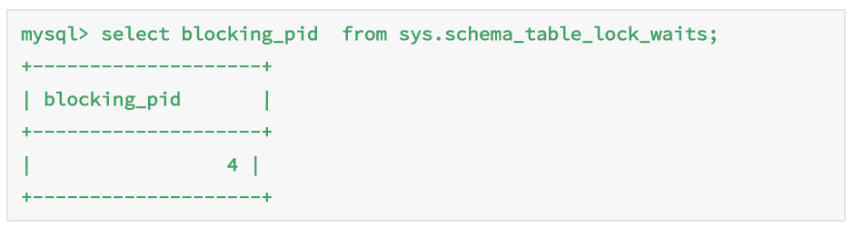
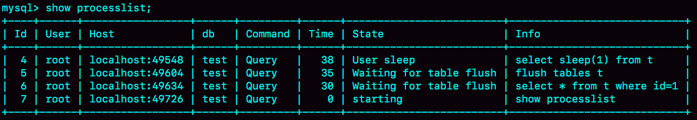

> 本文章仅用于本人学习笔记记录
> 来源《MySQL实战45课》
> 微信：wxid_ygj58saenbjh22（如本文档内容侵权了您的权益，请您通过微信联系到我）

一般情况下，如果我跟你说查询性能优化，你首先会想到一些复杂的语句，想到查询需要返回大量的数据。但有些情况下，“查一行”，也会执行得特别慢。

为了便于描述，构造一个表，基于这个表来说明问题。这个表有两个字段 id 和 c，并且我在里面插入了 10 万行记录。

```
mysql> CREATE TABLE `t` (
  `id` int(11) NOT NULL,
  `c` int(11) DEFAULT NULL,
  PRIMARY KEY (`id`)
) ENGINE=InnoDB;

delimiter ;;
create procedure idata()
begin
  declare i int;
  set i=1;
  while(i<=100000) do
    insert into t values(i,i);
    set i=i+1;
  end while;
end;;
delimiter ;

call idata();
```

## 查询长时间不返回

在表 t 执行下面的 SQL 语句：

```
mysql> select * from t where id=1;
```

查询结果长时间不返回。

一般碰到这种情况的话，大概率是表 t 被锁住了。接下来分析原因的时候，一般都是首先执行一下 show processlist 命令，看看当前语句处于什么状态。

然后我们再针对每种状态，去分析它们产生的原因、如何复现，以及如何处理。

### 等 MDL 锁

使用 show processlist 命令查看 Waiting for table metadata lock 的示意图。


出现这个状态表示的是，现在有一个线程正在表 t 上请求或者持有 MDL 写锁，把 select 语句堵住了。

需要说明的是，那个复现过程是基于 MySQL 5.6 版本的。而 MySQL 5.7 版本修改了 MDL 的加锁策略，所以就不能复现这个场景了。

不过，在 MySQL 5.7 版本下复现这个场景，也很容易。如图 3 所示，我给出了简单的复现步骤。


session A 通过 lock table 命令持有表 t 的 MDL 写锁，而 session B 的查询需要获取 MDL 读锁。所以，session B 进入等待状态。

这类问题的处理方式，就是找到谁持有 MDL 写锁，然后把它 kill 掉。

但是，由于在 show processlist 的结果里面，session A 的 Command 列是“Sleep”，导致查找起来很不方便。不过有了 performance_schema 和 sys 系统库以后，就方便多了。（MySQL 启动时需要设置 performance_schema=on，相比于设置为 off 会有 10% 左右的性能损失)

通过查询 sys.schema_table_lock_waits 这张表，我们就可以直接找出造成阻塞的 process id，把这个连接用 kill 命令断开即可。



### 等 flush

接下来，我给你举另外一种查询被堵住的情况。

我在表 t 上，执行下面的 SQL 语句：

```
mysql> select * from information_schema.processlist where id=1;
```

我查出来这个线程的状态是 Waiting for table flush，你可以设想一下这是什么原因。


这个状态表示的是，现在有一个线程正要对表 t 做 flush 操作。MySQL 里面对表做 flush 操作的用法，一般有以下两个：

```
flush tables t with read lock;

flush tables with read lock;
```

这两个 flush 语句，如果指定表 t 的话，代表的是只关闭表 t；如果没有指定具体的表名，则表示关闭 MySQL 里所有打开的表。

但是正常这两个语句执行起来都很快，除非它们也被别的线程堵住了。

所以，出现 Waiting for table flush 状态的可能情况是：有一个 flush tables 命令被别的语句堵住了，然后它又堵住了我们的 select 语句。


在 session A 中，我故意每行都调用一次 sleep(1)，这样这个语句默认要执行 10 万秒，在这期间表 t 一直是被 session A“打开”着。然后，session B 的 flush tables t 命令再要去关闭表 t，就需要等 session A 的查询结束。这样，session C 要再次查询的话，就会被 flush 命令堵住了。

这个例子的排查也很简单，你看到这个 show processlist 的结果，肯定就知道应该怎么做了。



### 等行锁

现在，经过了表级锁的考验，我们的 select 语句终于来到引擎里了。

```
mysql> select * from t where id=1 lock in share mode; 
```

由于访问 id=1 这个记录时要加读锁，如果这时候已经有一个事务在这行记录上持有一个写锁，我们的 select 语句就会被堵住。

复现步骤和现场如下：


显然，session A 启动了事务，占有写锁，还不提交，是导致 session B 被堵住的原因。

这个问题并不难分析，但问题是怎么查出是谁占着这个写锁。如果你用的是 MySQL 5.7 版本，可以通过 sys.innodb_lock_waits 表查到。

查询方法是：

```
mysql> select * from t sys.innodb_lock_waits where locked_table='`test`.`t`'\G
```


可以看到，这个信息很全，4 号线程是造成堵塞的罪魁祸首。而干掉这个罪魁祸首的方式，就是 KILL QUERY 4 或 KILL 4。

不过，这里不应该显示“KILL QUERY 4”。这个命令表示停止 4 号线程当前正在执行的语句，而这个方法其实是没有用的。因为占有行锁的是 update 语句，这个语句已经是之前执行完成了的，现在执行 KILL QUERY，无法让这个事务去掉 id=1 上的行锁。

实际上，KILL 4 才有效，也就是说直接断开这个连接。这里隐含的一个逻辑就是，连接被断开的时候，会自动回滚这个连接里面正在执行的线程，也就释放了 id=1 上的行锁。

## 查询慢

先来看一条你一定知道原因的 SQL 语句：

```
mysql> select * from t where c=50000 limit 1;
```

由于字段 c 上没有索引，这个语句只能走 id 主键顺序扫描，因此需要扫描 5 万行。

作为确认，你可以看一下慢查询日志。注意，这里为了把所有语句记录到 slow log 里，我在连接后先执行了 set long_query_time=0，将慢查询日志的时间阈值设置为 0。


Rows_examined 显示扫描了 50000 行。你可能会说，不是很慢呀，11.5 毫秒就返回了，我们线上一般都配置超过 1 秒才算慢查询。但你要记住：坏查询不一定是慢查询。我们这个例子里面只有 10 万行记录，数据量大起来的话，执行时间就线性涨上去了。

扫描行数多，所以执行慢，这个很好理解。

但是接下来，我们再看一个只扫描一行，但是执行很慢的语句。

```
mysql> select * from t where id=1；
```

虽然扫描行数是 1，但执行时间却长达 800 毫秒。


是不是有点奇怪呢，这些时间都花在哪里了？

如果我把这个 slow log 的截图再往下拉一点，你可以看到下一个语句，select * from t where id=1 lock in share mode，执行时扫描行数也是 1 行，执行时间是 0.2 毫秒。


看上去是不是更奇怪了？按理说 lock in share mode 还要加锁，时间应该更长才对啊。

这两个语句的执行输出结果:


第一个语句的查询结果里 c=1，带 lock in share mode 的语句返回的是 c=1000001。看到这里应该有更多的同学知道原因了。如果你还是没有头绪的话，也别着急。我先跟你说明一下复现步骤，再分析原因。


你看到了，session A 先用 start transaction with consistent snapshot 命令启动了一个事务，之后 session B 才开始执行 update 语句。

session B 执行完 100 万次 update 语句后，id=1 这一行处于什么状态呢？你可以从图 16 中找到答案。


session B 更新完 100 万次，生成了 100 万个回滚日志 (undo log)。

带 lock in share mode 的 SQL 语句，是当前读，因此会直接读到 1000001 这个结果，所以速度很快；而 select * from t where id=1 这个语句，是一致性读，因此需要从 1000001 开始，依次执行 undo log，执行了 100 万次以后，才将 1 这个结果返回。

注意，undo log 里记录的其实是“把 2 改成 1”，“把 3 改成 2”这样的操作逻辑，画成减 1 的目的是方便你看图。

## 小结

sql查询慢的原因：

- 全部语句特别慢：CPU高，IO高。

- 个别语句特别慢：等表锁，等行锁，等MDL锁。

- 个别语句有时候慢：没上索引，表数据太多了；一致性读前的事务过多，导致依次执行undo log，速度慢，而当前读速度很快。