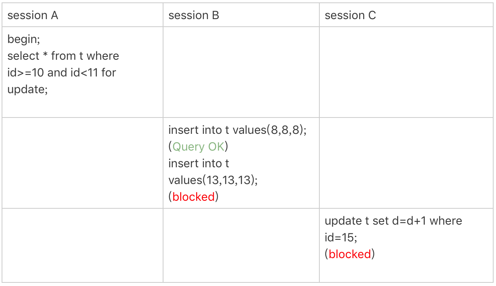

> 本文章仅用于本人学习笔记记录
> 来源《MySQL实战45课》
> 微信：wxid_ygj58saenbjh22（如本文档内容侵权了您的权益，请您通过微信联系到我）

加锁规则前提说明：MySQL 后面的版本可能会改变加锁策略，所以这个规则只限于截止到现在的最新版本，即 5.x 系列 <=5.7.24，8.0 系列 <=8.0.13。

加锁规则里面，包含了两个“原则”、两个“优化”和一个“bug”。

1. 原则 1：加锁的基本单位是 next-key lock，next-key lock 是前开后闭区间。
2. 原则 2：查找过程中访问到的对象才会加锁。
3. 优化 1：索引上的等值查询，给唯一索引加锁的时候，next-key lock 退化为行锁。
4. 优化 2：索引上的等值查询，向右遍历时且最后一个值不满足等值条件的时候，next-key lock 退化为间隙锁。
5. 一个 bug：唯一索引上的范围查询会访问到不满足条件的第一个值为止。

```
CREATE TABLE `t` (
  `id` int(11) NOT NULL,
  `c` int(11) DEFAULT NULL,
  `d` int(11) DEFAULT NULL,
  PRIMARY KEY (`id`),
  KEY `c` (`c`)
) ENGINE=InnoDB;

insert into t values(0,0,0),(5,5,5),
(10,10,10),(15,15,15),(20,20,20),(25,25,25);
```

## 等值查询间隙锁


由于表 t 中没有 id=7 的记录，所以用我们上面提到的加锁规则判断一下的话：

1. 根据原则 1，加锁单位是 next-key lock，session A 加锁范围就是 (5,10]；
2. 同时根据优化 2，这是一个等值查询 (id=7)，而 id=10 不满足查询条件，next-key lock 退化成间隙锁，因此最终加锁的范围是 (5,10)。

所以，session B 要往这个间隙里面插入 id=8 的记录会被锁住，但是 session C 修改 id=10 这行是可以的。

## 非唯一索引等值锁


看到这个例子，你是不是有一种“该锁的不锁，不该锁的乱锁”的感觉？我们来分析一下吧。

这里 session A 要给索引 c 上 c=5 的这一行加上读锁。

1. 根据原则 1，加锁单位是 next-key lock，因此会给 (0,5]加上 next-key lock。
2. 要注意 c 是普通索引，因此仅访问 c=5 这一条记录是不能马上停下来的，需要向右遍历，查到 c=10 才放弃。根据原则 2，访问到的都要加锁，因此要给 (5,10]加 next-key lock。
3. 但是同时这个符合优化 2：等值判断，向右遍历，最后一个值不满足 c=5 这个等值条件，因此退化成间隙锁 (5,10)。
4. 根据原则 2 ，只有访问到的对象才会加锁，这个查询使用覆盖索引，并不需要访问主键索引，所以主键索引上没有加任何锁，这就是为什么 session B 的 update 语句可以执行完成。

但 session C 要插入一个 (7,7,7) 的记录，就会被 session A 的间隙锁 (5,10) 锁住。

需要注意，在这个例子中，lock in share mode 只锁覆盖索引，但是如果是 for update 就不一样了。 执行 for update 时，系统会认为你接下来要更新数据，因此会顺便给主键索引上满足条件的行加上行锁。

这个例子说明，锁是加在索引上的；同时，它给我们的指导是，如果你要用 lock in share mode 来给行加读锁避免数据被更新的话，就必须得绕过覆盖索引的优化，在查询字段中加入索引中不存在的字段。比如，将 session A 的查询语句改成 select d from t where c=5 lock in share mode。你可以自己验证一下效果。

## 主键索引范围锁

```
mysql> select * from t where id=10 for update;
mysql> select * from t where id>=10 and id<11 for update;
```

你可能会想，id 定义为 int 类型，这两个语句就是等价的吧？其实，它们并不完全等价。

在逻辑上，这两条查语句肯定是等价的，但是它们的加锁规则不太一样。现在，我们就让 session A 执行第二个查询语句，来看看加锁效果。



现在我们就用前面提到的加锁规则，来分析一下 session A 会加什么锁呢？

1. 开始执行的时候，要找到第一个 id=10 的行，因此本该是 next-key lock(5,10]。 根据优化 1， 主键 id 上的等值条件，退化成行锁，只加了 id=10 这一行的行锁。
2. 范围查找就往后继续找，找到 id=15 这一行停下来，因此需要加 next-key lock(10,15]。

所以，session A 这时候锁的范围就是主键索引上，行锁 id=10 和 next-key lock(10,15]。这样，session B 和 session C 的结果你就能理解了。

这里你需要注意一点，首次 session A 定位查找 id=10 的行的时候，是当做等值查询来判断的，而向右扫描到 id=15 的时候，用的是范围查询判断。

## 非唯一索引范围锁


这次 session A 用字段 c 来判断，加锁规则跟案例三唯一的不同是：在第一次用 c=10 定位记录的时候，索引 c 上加了 (5,10]这个 next-key lock 后，由于索引 c 是非唯一索引，没有优化规则，也就是说不会蜕变为行锁，因此最终 sesion A 加的锁是，索引 c 上的 (5,10] 和 (10,15] 这两个 next-key lock。

所以从结果上来看，sesson B 要插入（8,8,8) 的这个 insert 语句时就被堵住了。

这里需要扫描到 c=15 才停止扫描，是合理的，因为 InnoDB 要扫到 c=15，才知道不需要继续往后找了。

## 唯一索引范围锁 bug


session A 是一个范围查询，按照原则 1 的话，应该是索引 id 上只加 (10,15]这个 next-key lock，并且因为 id 是唯一键，所以循环判断到 id=15 这一行就应该停止了。

但是实现上，InnoDB 会往前扫描到第一个不满足条件的行为止，也就是 id=20。而且由于这是个范围扫描，因此索引 id 上的 (15,20]这个 next-key lock 也会被锁上。

所以你看到了，session B 要更新 id=20 这一行，是会被锁住的。同样地，session C 要插入 id=16 的一行，也会被锁住。

照理说，这里锁住 id=20 这一行的行为，其实是没有必要的。因为扫描到 id=15，就可以确定不用往后再找了。但实现上还是这么做了，因此我认为这是个 bug。

## 非唯一索引上存在"等值"的例子

为了更好地说明“间隙”这个概念。这里，我给表 t 插入一条新记录。

```
mysql> insert into t values(30,10,30);
```

新插入的这一行 c=10，也就是说现在表里有两个 c=10 的行。那么，这时候索引 c 上的间隙是什么状态了呢？你要知道，由于非唯一索引上包含主键的值，所以是不可能存在“相同”的两行的。

可以看到，虽然有两个 c=10，但是它们的主键值 id 是不同的（分别是 10 和 30），因此这两个 c=10 的记录之间，也是有间隙的。

图中我画出了索引 c 上的主键 id。为了跟间隙锁的开区间形式进行区别，我用 (c=10,id=30) 这样的形式，来表示索引上的一行。

这次我们用 delete 语句来验证。注意，delete 语句加锁的逻辑，其实跟 select ... for update 是类似的，也就是我在文章开始总结的两个“原则”、两个“优化”和一个“bug”。


这时，session A 在遍历的时候，先访问第一个 c=10 的记录。同样地，根据原则 1，这里加的是 (c=5,id=5) 到 (c=10,id=10) 这个 next-key lock。

然后，session A 向右查找，直到碰到 (c=15,id=15) 这一行，循环才结束。根据优化 2，这是一个等值查询，向右查找到了不满足条件的行，所以会退化成 (c=10,id=10) 到 (c=15,id=15) 的间隙锁。

也就是说，这个 delete 语句在索引 c 上的加锁范围，就是下图中蓝色区域覆盖的部分。


这个蓝色区域左右两边都是虚线，表示开区间，即 (c=5,id=5) 和 (c=15,id=15) 这两行上都没有锁。

## limit 语句加锁


这个例子里，session A 的 delete 语句加了 limit 2。你知道表 t 里 c=10 的记录其实只有两条，因此加不加 limit 2，删除的效果都是一样的，但是加锁的效果却不同。可以看到，session B 的 insert 语句执行通过了，跟案例六的结果不同。

这是因为，delete 语句明确加了 limit 2 的限制，因此在遍历到 (c=10, id=30) 这一行之后，满足条件的语句已经有两条，循环就结束了。

因此，索引 c 上的加锁范围就变成了从（c=5,id=5) 到（c=10,id=30) 这个前开后闭区间，如下图所示：


可以看到，(c=10,id=30）之后的这个间隙并没有在加锁范围里，因此 insert 语句插入 c=12 是可以执行成功的。

这个例子对我们实践的指导意义就是，在删除数据的时候尽量加 limit。这样不仅可以控制删除数据的条数，让操作更安全，还可以减小加锁的范围。

so, **delete后面加limit可以减小next-key lock的范围**。

## 一个死锁的例子


现在，我们按时间顺序来分析一下为什么是这样的结果。

1. session A 启动事务后执行查询语句加 lock in share mode，在索引 c 上加了 next-key lock(5,10] 和间隙锁 (10,15)；
2. session B 的 update 语句也要在索引 c 上加 next-key lock(5,10] ，进入锁等待；
3. 然后 session A 要再插入 (8,8,8) 这一行，被 session B 的间隙锁锁住。由于出现了死锁，InnoDB 让 session B 回滚。

你可能会问，session B 的 next-key lock 不是还没申请成功吗？

其实是这样的，session B 的“加 next-key lock(5,10] ”操作，实际上分成了两步，先是加 (5,10) 的间隙锁，加锁成功；然后加 c=10 的行锁，这时候才被锁住的。

也就是说，我们在分析加锁规则的时候可以用 next-key lock 来分析。但是要知道，具体执行的时候，是要分成间隙锁和行锁两段来执行的。

另外，在读提交隔离级别下还有一个优化，即：语句执行过程中加上的行锁，在语句执行完成后，就要把“不满足条件的行”上的行锁直接释放了，不需要等到事务提交。

也就是说，读提交隔离级别下，锁的范围更小，锁的时间更短，这也是不少业务都默认使用读提交隔离级别的原因。

## 小结

1. 原则 1：加锁的基本单位是 next-key lock，next-key lock 是前开后闭区间。间隙锁是前开后开区间。
2. 原则 2：查找过程中访问到的对象才会加锁。
3. 优化 1：索引上的等值查询，给唯一索引加锁的时候，next-key lock 退化为行锁。
4. 优化 2：索引上的等值查询，向右遍历时且最后一个值不满足等值条件的时候，next-key lock 退化为间隙锁。
5. 一个 bug：唯一索引上的范围查询会访问到不满足条件的第一个值为止。
6. delete后面加limit可以减小next-key lock的范围。