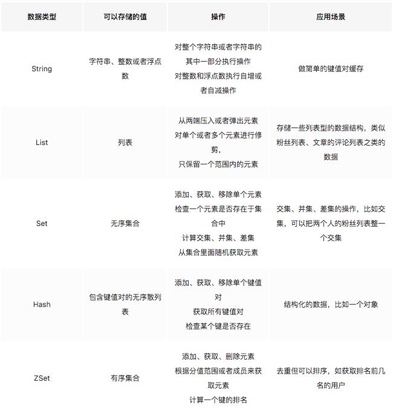
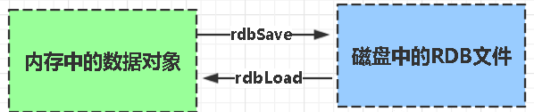
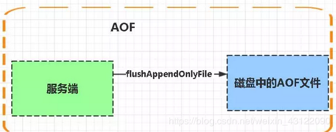

## 概述

### Redis定义

Redis 是一个使用 C 语言写成的，开源的高性能key-value非关系缓存数据库。它支持存储的value类型相对更多，包括string(字符串)、list(链表)、set(集合)、zset(sorted set --有序集合)和hash（哈希类型）。Redis的数据都基于缓存的，所以很快，每秒可以处理超过 10万次读写操作，是已知性能最快的Key-Value DB。Redis也可以实现数据写入磁盘中，保证了数据的安全不丢失，而且Redis的操作是原子性的。

### Redis优缺点

- 优点
    - 读写性能优异， Redis能读的速度是110000次/s，写的速度是81000次/s。
    - 支持数据持久化，支持AOF和RDB两种持久化方式。
    - 支持事务，Redis的所有操作都是原子性的，同时Redis还支持对几个操作合并后的原子性执行。
    - 数据结构丰富，除了支持string类型的value外还支持hash、set、zset、list等数据结构。
    - 支持主从复制，主机会自动将数据同步到从机，可以进行读写分离。
- 缺点
    - 数据库容量受到物理内存的限制，不能用作海量数据的高性能读写，因此Redis适合的场景主要局限在较小数据量的高性能操作和运算上。
    - Redis 不具备自动容错和恢复功能，主机从机的宕机都会导致前端部分读写请求失败，需要等待机器重启或者手动切换前端的IP才能恢复。
    - 主机宕机，宕机前有部分数据未能及时同步到从机，切换IP后还会引入数据不一致的问题，降低了系统的可用性。
    - Redis 较难支持在线扩容，在集群容量达到上限时在线扩容会变得很复杂。为避免这一问题，运维人员在系统上线时必须确保有足够的空间，这对资源造成了很大的浪费。

### 使用redis有哪些好处？

- 速度快，因为数据存在内存中，类似于HashMap，HashMap的优势就是查找和操作的时间复杂度都很低
- 支持丰富数据类型，支持string，list，set，sorted set，hash
- 支持事务，操作都是原子性，所谓的原子性就是对数据的更改要么全部执行，要么全部不执行
- 丰富的特性：可用于缓存，消息，按key设置过期时间，过期后将会自动删除

### 为什么要用 Redis / 为什么要用缓存

主要从“高性能”和“高并发”这两点来看待这个问题。

- 高性能：

    假如用户第一次访问数据库中的某些数据。这个过程会比较慢，因为是从硬盘上读取的。将该用户访问的数据存在数缓存中，这样下一次再访问这些数据的时候就可以直接从缓存中获取了。操作缓存就是直接操作内存，所以速度相当快。如果数据库中的对应数据改变的之后，同步改变缓存中相应的数据即可！

- 高并发：

    直接操作缓存能够承受的请求是远远大于直接访问数据库的，所以我们可以考虑把数据库中的部分数据转移到缓存中去，这样用户的一部分请求会直接到缓存这里而不用经过数据库。

### 为什么要用 Redis 而不用 map/guava 做缓存?

- 缓存分为本地缓存和分布式缓存。以 Java 为例，使用自带的 map 或者 guava 实现的是本地缓存，最主要的特点是轻量以及快速，生命周期随着 jvm 的销毁而结束，并且在多实例的情况下，每个实例都需要各自保存一份缓存，缓存不具有一致性。

- 使用 redis 或 memcached 之类的称为分布式缓存，在多实例的情况下，各实例共用一份缓存数据，缓存具有一致性。缺点是需要保持 redis 或 memcached服务的高可用，整个程序架构上较为复杂。

### Redis为什么这么快

- 完全基于内存，绝大部分请求是纯粹的内存操作，非常快速。数据存在内存中，类似于 HashMap，HashMap 的优势就是查找和操作的时间复杂度都是O(1)；
- 数据结构简单，对数据操作也简单，Redis 中的数据结构是专门进行设计的；
- 采用单线程，避免了不必要的上下文切换和竞争条件，也不存在多进程或者多线程导致的切换而消耗 CPU，不用去考虑各种锁的问题，不存在加锁释放锁操作，没有因为可能出现死锁而导致的性能消耗；
- 使用 I/O 多路复用机制，非阻塞 IO；
- 使用底层模型不同，它们之间底层实现方式以及与客户端之间通信的应用协议不一样，Redis 直接自己构建了 VM 机制 ，因为一般的系统调用系统函数的话，会浪费一定的时间去移动和请求；

### Redis有哪些数据类型

### Redis的应用场景

- 计数器

    可以对 String 进行自增自减运算，从而实现计数器功能。Redis 这种内存型数据库的读写性能非常高，很适合存储频繁读写的计数量。

- 缓存

    将热点数据放到内存中，设置内存的最大使用量以及淘汰策略来保证缓存的命中率。

- 会话缓存

    可以使用 Redis 来统一存储多台应用服务器的会话信息。当应用服务器不再存储用户的会话信息，也就不再具有状态，一个用户可以请求任意一个应用服务器，从而更容易实现高可用性以及可伸缩性。

- 全页缓存（FPC）

    除基本的会话token之外，Redis还提供很简便的FPC平台。以Magento为例，Magento提供一个插件来使用Redis作为全页缓存后端。此外，对WordPress的用户来说，Pantheon有一个非常好的插件 wp-redis，这个插件能帮助你以最快速度加载你曾浏览过的页面。

- 查找表

    例如 DNS 记录就很适合使用 Redis 进行存储。查找表和缓存类似，也是利用了 Redis 快速的查找特性。但是查找表的内容不能失效，而缓存的内容可以失效，因为缓存不作为可靠的数据来源。

- 消息队列(发布/订阅功能)

    List 是一个双向链表，可以通过 lpush 和 rpop 写入和读取消息。不过最好使用 Kafka、RabbitMQ 等消息中间件。

- 分布式锁实现

    在分布式场景下，无法使用单机环境下的锁来对多个节点上的进程进行同步。可以使用 Redis 自带的 SETNX 命令实现分布式锁，除此之外，还可以使用官方提供的 RedLock 分布式锁实现。

- 其它

    Set 可以实现交集、并集等操作，从而实现共同好友等功能。ZSet 可以实现有序性操作，从而实现排行榜等功能。

### 持久化

持久化就是把内存的数据写到磁盘中去，防止服务宕机了内存数据丢失。

### Redis 的持久化机制

Redis 提供两种持久化机制 RDB（默认） 和 AOF 机制

#### RDB：是Redis DataBase缩写快照

- RDB是Redis默认的持久化方式。按照一定的时间将内存的数据以快照的形式保存到硬盘中，对应产生的数据文件为dump.rdb。通过配置文件中的save参数来定义快照的周期。

    

- 优点：

    1. 只有一个文件 dump.rdb，方便持久化。
    2. 容灾性好，一个文件可以保存到安全的磁盘。
    3. 性能最大化，fork 子进程来完成写操作，让主进程继续处理命令，所以是 IO 最大化。使用单独子进程来进行持久化，主进程不会进行任何 IO 操作，保证了 redis 的高性能。

- 缺点：

    1. 数据安全性低。RDB 是间隔一段时间进行持久化，如果持久化之间 redis 发生故障，会发生数据丢失。所以这种方式更适合数据要求不严谨的时候)

#### AOF：持久化

- AOF持久化(即Append Only File持久化)，则是将Redis执行的每次写命令记录到单独的日志文件中，当重启Redis会重新将持久化的日志中文件恢复数据。

- 当两种方式同时开启时，数据恢复Redis会优先选择AOF恢复

    

- 优点：

    1. 数据安全，aof 持久化可以配置 appendfsync 属性，有 always，每进行一次 命令操作就记录到 aof 文件中一次。
    2. 通过 append 模式写文件，即使中途服务器宕机，可以通过 redis-check-aof 工具解决数据一致性问题。
    3. AOF 机制的 rewrite 模式。AOF 文件没被 rewrite 之前（文件过大时会对命令 进行合并重写），可以删除其中的某些命令（比如误操作的 flushall）)

- 缺点：

    1. AOF 文件比 RDB 文件大，且恢复速度慢。
    2. 数据集大的时候，比 RDB 启动效率低。

### 俩种持久化的优缺点对比

- AOF文件比RDB更新频率高，优先使用AOF还原数据。
- AOF比RDB更安全也更大
- RDB性能比AOF好
- 如果两个都配了优先加载AOF

### 如何选择合适的持久化方式

- 一般来说， 如果想达到足以媲美PostgreSQL的数据安全性，你应该同时使用两种持久化功能。在这种情况下，当 Redis 重启的时候会优先载入AOF文件来恢复原始的数据，因为在通常情况下AOF文件保存的数据集要比RDB文件保存的数据集要完整。
- 如果你非常关心你的数据， 但仍然可以承受数分钟以内的数据丢失，那么你可以只使用RDB持久化。
- 有很多用户都只使用AOF持久化，但并不推荐这种方式，因为定时生成RDB快照（snapshot）非常便于进行数据库备份， 并且 RDB 恢复数据集的速度也要比AOF恢复的速度要快，除此之外，使用RDB还可以避免AOF程序的bug。

### Redis持久化数据和缓存怎么做扩容

- 如果Redis被当做缓存使用，使用一致性哈希实现动态扩容缩容。
- 如果Redis被当做一个持久化存储使用，必须使用固定的keys-to-nodes映射关系，节点的数量一旦确定不能变化。否则的话(即Redis节点需要动态变化的情况），必须使用可以在运行时进行数据再平衡的一套系统，而当前只有Redis集群可以做到这样。

### Redis的过期键的删除策略

Redis中同时使用了定期过期和惰性过期两种过期策略。

- 定期过期：每隔一定的时间，会扫描一定数量的数据库的expires字典中一定数量的key，并清除其中已过期的key。该策略是前两者的一个折中方案。通过调整定时扫描的时间间隔和每次扫描的限定耗时，可以在不同情况下使得CPU和内存资源达到最优的平衡效果。(expires字典会保存所有设置了过期时间的key的过期时间数据，其中，key是指向键空间中的某个键的指针，value是该键的毫秒精度的UNIX时间戳表示的过期时间。键空间是指该Redis集群中保存的所有键。)
- 惰性过期：只有当访问一个key时，才会判断该key是否已过期，过期则清除。该策略可以最大化地节省CPU资源，却对内存非常不友好。极端情况可能出现大量的过期key没有再次被访问，从而不会被清除，占用大量内存。

### MySQL里有2000w数据，redis中只存20w的数据，如何保证redis中的数据都是热点数据

redis内存数据集大小上升到一定大小的时候，就会施行数据淘汰策略。

### Redis的内存淘汰策略

Redis的内存淘汰策略是指在Redis的用于缓存的内存不足时，怎么处理需要新写入且需要申请额外空间的数据。

- 全局的键空间选择性移除
    - noeviction：当内存不足以容纳新写入数据时，新写入操作会报错。
    - allkeys-lru：当内存不足以容纳新写入数据时，在键空间中，移除最近最少使用的key。
    - allkeys-random：当内存不足以容纳新写入数据时，在键空间中，随机移除某个key。
- 设置过期时间的键空间选择性移除
    - volatile-lru：当内存不足以容纳新写入数据时，在设置了过期时间的键空间中，移除最近最少使用的key。
    - volatile-random：当内存不足以容纳新写入数据时，在设置了过期时间的键空间中，随机移除某个key。
    - volatile-ttl：当内存不足以容纳新写入数据时，在设置了过期时间的键空间中，有更早过期时间的key优先移除。

- 总结

    Redis的内存淘汰策略的选取并不会影响过期的key的处理。内存淘汰策略用于处理内存不足时的需要申请额外空间的数据；过期策略用于处理过期的缓存数据。

### Redis主要消耗什么物理资源

内存

### Redis的内存用完了会发生什么

如果达到设置的上限，Redis的写命令会返回错误信息（但是读命令还可以正常返回。）或者你可以配置内存淘汰机制，当Redis达到内存上限时会冲刷掉旧的内容。

## 线程模型

### Redis线程模型

Redis基于Reactor模式开发了网络事件处理器，这个处理器被称为文件事件处理器（file event handler）。它的组成结构为4部分：多个套接字、IO多路复用程序、文件事件分派器、事件处理器。因为文件事件分派器队列的消费是单线程的，所以Redis才叫单线程模型。

