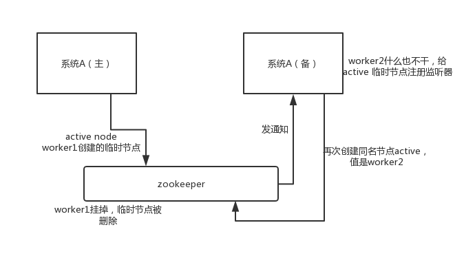

## 面试题

zookeeper 都有哪些使用场景？

### 面试官心理分析

现在聊的 topic 是分布式系统，面试官跟你聊完了 dubbo 相关的一些问题之后，已经确认你对分布式服务框架/RPC框架基本都有一些认知了。那么他可能开始要跟你聊分布式相关的其它问题了。

分布式锁这个东西，很常用的，你做 Java 系统开发，分布式系统，可能会有一些场景会用到。最常用的分布式锁就是基于 zookeeper 来实现的。

其实说实话，问这个问题，一般就是看看你是否了解 zookeeper，因为 zookeeper 是分布式系统中很常见的一个基础系统。而且问的话常问的就是说 zookeeper 的使用场景是什么？看你知道不知道一些基本的使用场景。但是其实 zookeeper 挖深了自然是可以问的很深很深的。

## * zookeeper 都有哪些使用场景？

大致来说，zookeeper 的使用场景如下，我就举几个简单的，大家能说几个就好了：

- 分布式协调
- 分布式锁
- 元数据/配置信息管理
- HA高可用性

### 分布式协调

这个其实是 zookeeper 很经典的一个用法，简单来说，就好比，你 A 系统发送个请求到 mq，然后 B 系统消息消费之后处理了。那 A 系统如何知道 B 系统的处理结果？用 zookeeper 就可以实现分布式系统之间的协调工作。A 系统发送请求之后可以在 zookeeper 上对某个节点的值注册个监听器，一旦 B 系统处理完了就修改 zookeeper 那个节点的值，A 系统立马就可以收到通知，完美解决。


### 分布式锁

举个栗子。对某一个数据连续发出两个修改操作，两台机器同时收到了请求，但是只能一台机器先执行完另外一个机器再执行。那么此时就可以使用 zookeeper 分布式锁，一个机器接收到了请求之后先获取 zookeeper 上的一把分布式锁，就是可以去创建一个 znode，接着执行操作；然后另外一个机器也尝试去创建那个 znode，结果发现自己创建不了，因为被别人创建了，那只能等着，等第一个机器执行完了自己再执行。


### 元数据/配置信息管理

zookeeper 可以用作很多系统的配置信息的管理，比如 kafka、storm 等等很多分布式系统都会选用 zookeeper 来做一些元数据、配置信息的管理，包括 dubbo 注册中心不也支持 zookeeper 么？


### HA高可用性

这个应该是很常见的，比如 hadoop、hdfs、yarn 等很多大数据系统，都选择基于 zookeeper 来开发 HA 高可用机制，就是一个重要进程一般会做主备两个，主进程挂了立马通过 zookeeper 感知到切换到备用进程。



------------

## 面试题

一般实现分布式锁都有哪些方式？使用 Redis 如何设计分布式锁？使用 zk 来设计分布式锁可以吗？这两种分布式锁的实现方式哪种效率比较高？

### 面试官心理分析

其实一般问问题，都是这么问的，先问问你 zk，然后其实是要过渡到 zk 相关的一些问题里去，比如分布式锁。因为在分布式系统开发中，分布式锁的使用场景还是很常见的。

## * 一般实现分布式锁都有哪些方式？

### Redis 分布式锁

官方叫做 RedLock 算法，是 Redis 官方支持的分布式锁算法。

这个分布式锁有 3 个重要的考量点：

- 互斥（只能有一个客户端获取锁）
- 不能死锁
- 容错（只要大部分 Redis 节点创建了这把锁就可以）

#### Redis 最普通的分布式锁

第一个最普通的实现方式，就是在 Redis 里使用 SET key value [EX seconds] [PX milliseconds] NX 创建一个 key，这样就算加锁。其中：

- NX：表示只有 key 不存在的时候才会设置成功，如果此时 redis 中存在这个 key，那么设置失败，返回 nil。
- EX seconds：设置 key 的过期时间，精确到秒级。意思是 seconds 秒后锁自动释放，别人创建的时候如果发现已经有了就不能加锁了。
- PX milliseconds：同样是设置 key 的过期时间，精确到毫秒级。

比如执行以下命令：

```
SET resource_name my_random_value PX 30000 NX
```

释放锁就是删除 key ，但是一般可以用 lua 脚本删除，判断 value 一样才删除：

```
-- 删除锁的时候，找到 key 对应的 value，跟自己传过去的 value 做比较，如果是一样的才删除。
if redis.call("get",KEYS[1]) == ARGV[1] then
    return redis.call("del",KEYS[1])
else
    return 0
end
```

为啥要用 random_value 随机值呢？因为如果某个客户端获取到了锁，但是阻塞了很长时间才执行完，比如说超过了 30s，此时可能已经自动释放锁了，此时可能别的客户端已经获取到了这个锁，要是你这个时候直接删除 key 的话会有问题，所以得用随机值加上面的 lua 脚本来释放锁。

但是这样是肯定不行的。因为如果是普通的 Redis 单实例，那就是单点故障。或者是 Redis 普通主从，那 Redis 主从异步复制，如果主节点挂了（key 就没有了），key 还没同步到从节点，此时从节点切换为主节点，别人就可以 set key，从而拿到锁。

#### RedLock 算法

这个场景是假设有一个 Redis cluster，有 5 个 Redis master 实例。然后执行如下步骤获取一把锁：

- 获取当前时间戳，单位是毫秒；
- 跟上面类似，轮流尝试在每个 master 节点上创建锁，过期时间较短，一般就几十毫秒；
- 尝试在大多数节点上建立一个锁，比如 5 个节点就要求是 3 个节点 n / 2 + 1 ；
- 客户端计算建立好锁的时间，如果建立锁的时间小于超时时间，就算建立成功了；
- 要是锁建立失败了，那么就依次之前建立过的锁删除；
- 只要别人建立了一把分布式锁，你就得不断轮询去尝试获取锁。


### zk 分布式锁

zk 分布式锁，其实可以做的比较简单，就是某个节点尝试创建临时 znode，此时创建成功了就获取了这个锁；这个时候别的客户端来创建锁会失败，只能注册个监听器监听这个锁。释放锁就是删除这个 znode，一旦释放掉就会通知客户端，然后有一个等待着的客户端就可以再次重新加锁。

```
/**
 * ZooKeeperSession
 */
public class ZooKeeperSession {

    private static CountDownLatch connectedSemaphore = new CountDownLatch(1);

    private ZooKeeper zookeeper;
    private CountDownLatch latch;

    public ZooKeeperSession() {
        try {
            this.zookeeper = new ZooKeeper("192.168.31.187:2181,192.168.31.19:2181,192.168.31.227:2181", 50000, new ZooKeeperWatcher());
            try {
                connectedSemaphore.await();
            } catch (InterruptedException e) {
                e.printStackTrace();
            }

            System.out.println("ZooKeeper session established......");
        } catch (Exception e) {
            e.printStackTrace();
        }
    }

    /**
     * 获取分布式锁
     * 
     * @param productId
     */
    public Boolean acquireDistributedLock(Long productId) {
        String path = "/product-lock-" + productId;

        try {
            zookeeper.create(path, "".getBytes(), Ids.OPEN_ACL_UNSAFE, CreateMode.EPHEMERAL);
            return true;
        } catch (Exception e) {
            while (true) {
                try {
                    // 相当于是给node注册一个监听器，去看看这个监听器是否存在
                    Stat stat = zk.exists(path, true);

                    if (stat != null) {
                        this.latch = new CountDownLatch(1);
                        this.latch.await(waitTime, TimeUnit.MILLISECONDS);
                        this.latch = null;
                    }
                    zookeeper.create(path, "".getBytes(), Ids.OPEN_ACL_UNSAFE, CreateMode.EPHEMERAL);
                    return true;
                } catch (Exception ee) {
                    continue;
                }
            }

        }
        return true;
    }

    /**
     * 释放掉一个分布式锁
     * 
     * @param productId
     */
    public void releaseDistributedLock(Long productId) {
        String path = "/product-lock-" + productId;
        try {
            zookeeper.delete(path, -1);
            System.out.println("release the lock for product[id=" + productId + "]......");
        } catch (Exception e) {
            e.printStackTrace();
        }
    }

    /**
     * 建立 zk session 的 watcher
     */
    private class ZooKeeperWatcher implements Watcher {

        public void process(WatchedEvent event) {
            System.out.println("Receive watched event: " + event.getState());

            if (KeeperState.SyncConnected == event.getState()) {
                connectedSemaphore.countDown();
            }

            if (this.latch != null) {
                this.latch.countDown();
            }
        }

    }

    /**
     * 封装单例的静态内部类
     */
    private static class Singleton {

        private static ZooKeeperSession instance;

        static {
            instance = new ZooKeeperSession();
        }

        public static ZooKeeperSession getInstance() {
            return instance;
        }

    }

    /**
     * 获取单例
     * 
     * @return
     */
    public static ZooKeeperSession getInstance() {
        return Singleton.getInstance();
    }

    /**
     * 初始化单例的便捷方法
     */
    public static void init() {
        getInstance();
    }

}
```

也可以采用另一种方式，创建临时顺序节点：

如果有一把锁，被多个人给竞争，此时多个人会排队，第一个拿到锁的人会执行，然后释放锁；后面的每个人都会去监听排在自己前面的那个人创建的 node 上，一旦某个人释放了锁，排在自己后面的人就会被 ZooKeeper 给通知，一旦被通知了之后，就 ok 了，自己就获取到了锁，就可以执行代码了。

```
public class ZooKeeperDistributedLock implements Watcher {

    private ZooKeeper zk;
    private String locksRoot = "/locks";
    private String productId;
    private String waitNode;
    private String lockNode;
    private CountDownLatch latch;
    private CountDownLatch connectedLatch = new CountDownLatch(1);
    private int sessionTimeout = 30000;

    public ZooKeeperDistributedLock(String productId) {
        this.productId = productId;
        try {
            String address = "192.168.31.187:2181,192.168.31.19:2181,192.168.31.227:2181";
            zk = new ZooKeeper(address, sessionTimeout, this);
            connectedLatch.await();
        } catch (IOException e) {
            throw new LockException(e);
        } catch (KeeperException e) {
            throw new LockException(e);
        } catch (InterruptedException e) {
            throw new LockException(e);
        }
    }

    public void process(WatchedEvent event) {
        if (event.getState() == KeeperState.SyncConnected) {
            connectedLatch.countDown();
            return;
        }

        if (this.latch != null) {
            this.latch.countDown();
        }
    }

    public void acquireDistributedLock() {
        try {
            if (this.tryLock()) {
                return;
            } else {
                waitForLock(waitNode, sessionTimeout);
            }
        } catch (KeeperException e) {
            throw new LockException(e);
        } catch (InterruptedException e) {
            throw new LockException(e);
        }
    }

    public boolean tryLock() {
        try {
             // 传入进去的locksRoot + “/” + productId
            // 假设productId代表了一个商品id，比如说1
            // locksRoot = locks
            // /locks/10000000000，/locks/10000000001，/locks/10000000002
            lockNode = zk.create(locksRoot + "/" + productId, new byte[0], ZooDefs.Ids.OPEN_ACL_UNSAFE, CreateMode.EPHEMERAL_SEQUENTIAL);

            // 看看刚创建的节点是不是最小的节点
             // locks：10000000000，10000000001，10000000002
            List<String> locks = zk.getChildren(locksRoot, false);
            Collections.sort(locks);

            if(lockNode.equals(locksRoot+"/"+ locks.get(0))){
                //如果是最小的节点,则表示取得锁
                return true;
            }

            //如果不是最小的节点，找到比自己小1的节点
      int previousLockIndex = -1;
            for(int i = 0; i < locks.size(); i++) {
        if(lockNode.equals(locksRoot + “/” + locks.get(i))) {
                     previousLockIndex = i - 1;
            break;
        }
       }

       this.waitNode = locks.get(previousLockIndex);
        } catch (KeeperException e) {
            throw new LockException(e);
        } catch (InterruptedException e) {
            throw new LockException(e);
        }
        return false;
    }

    private boolean waitForLock(String waitNode, long waitTime) throws InterruptedException, KeeperException {
        Stat stat = zk.exists(locksRoot + "/" + waitNode, true);
        if (stat != null) {
            this.latch = new CountDownLatch(1);
            this.latch.await(waitTime, TimeUnit.MILLISECONDS);
            this.latch = null;
        }
        return true;
    }

    public void unlock() {
        try {
            // 删除/locks/10000000000节点
            // 删除/locks/10000000001节点
            System.out.println("unlock " + lockNode);
            zk.delete(lockNode, -1);
            lockNode = null;
            zk.close();
        } catch (InterruptedException e) {
            e.printStackTrace();
        } catch (KeeperException e) {
            e.printStackTrace();
        }
    }

    public class LockException extends RuntimeException {
        private static final long serialVersionUID = 1L;

        public LockException(String e) {
            super(e);
        }

        public LockException(Exception e) {
            super(e);
        }
    }
}
```

## * redis 分布式锁和 zk 分布式锁的对比

- redis 分布式锁，其实需要自己不断去尝试获取锁，比较消耗性能。
- zk 分布式锁，获取不到锁，注册个监听器即可，不需要不断主动尝试获取锁，性能开销较小。

另外一点就是，如果是 Redis 获取锁的那个客户端 出现 bug 挂了，那么只能等待超时时间之后才能释放锁；而 zk 的话，因为创建的是临时 znode，只要客户端挂了，znode 就没了，此时就自动释放锁。

Redis 分布式锁大家没发现好麻烦吗？遍历上锁，计算时间等等......zk 的分布式锁语义清晰实现简单。

所以先不分析太多的东西，就说这两点，我个人实践认为 zk 的分布式锁比 Redis 的分布式锁牢靠、而且模型简单易用。

-----------

## 面试题

分布式事务了解吗？你们是如何解决分布式事务问题的？

### 面试官心理分析

只要聊到你做了分布式系统，必问分布式事务，你对分布式事务一无所知的话，确实会很坑，你起码得知道有哪些方案，一般怎么来做，每个方案的优缺点是什么。

现在面试，分布式系统成了标配，而分布式系统带来的分布式事务也成了标配了。因为你做系统肯定要用事务吧，如果是分布式系统，肯定要用分布式事务吧。先不说你搞过没有，起码你得明白有哪几种方案，每种方案可能有啥坑？比如 TCC 方案的网络问题、XA 方案的一致性问题。

## * 分布式事务了解吗？你们是如何解决分布式事务问题的？

分布式事务的实现主要有以下 6 种方案：

- XA 方案
- TCC 方案
- SAGA 方案
- 本地消息表
- 可靠消息最终一致性方案
- 最大努力通知方案

### 两阶段提交方案/XA 方案

所谓的 XA 方案，即：两阶段提交，有一个事务管理器的概念，负责协调多个数据库（资源管理器）的事务，事务管理器先问问各个数据库你准备好了吗？如果每个数据库都回复 ok，那么就正式提交事务，在各个数据库上执行操作；如果任何其中一个数据库回答不 ok，那么就回滚事务。

这种分布式事务方案，比较适合单块应用里，跨多个库的分布式事务，而且因为严重依赖于数据库层面来搞定复杂的事务，效率很低，绝对不适合高并发的场景。如果要玩儿，那么基于 Spring + JTA 就可以搞定，自己随便搜个 demo 看看就知道了。

这个方案，我们很少用，一般来说某个系统内部如果出现跨多个库的这么一个操作，是不合规的。我可以给大家介绍一下， 现在微服务，一个大的系统分成几十个甚至几百个服务。一般来说，我们的规定和规范，是要求每个服务只能操作自己对应的一个数据库。

如果你要操作别的服务对应的库，不允许直连别的服务的库，违反微服务架构的规范，你随便交叉胡乱访问，几百个服务的话，全体乱套，这样的一套服务是没法管理的，没法治理的，可能会出现数据被别人改错，自己的库被别人写挂等情况。

如果你要操作别人的服务的库，你必须是通过调用别的服务的接口来实现，绝对不允许交叉访问别人的数据库。


### TCC 方案

TCC 的全称是： Try 、 Confirm 、 Cancel 。

- Try 阶段：这个阶段说的是对各个服务的资源做检测以及对资源进行锁定或者预留。
- Confirm 阶段：这个阶段说的是在各个服务中执行实际的操作。
- Cancel 阶段：如果任何一个服务的业务方法执行出错，那么这里就需要进行补偿，就是执行已经执行成功的业务逻辑的回滚操作。（把那些执行成功的回滚）

这种方案说实话几乎很少人使用，我们用的也比较少，但是也有使用的场景。因为这个事务回滚实际上是严重依赖于你自己写代码来回滚和补偿了，会造成补偿代码巨大，非常之恶心。

比如说我们，一般来说跟钱相关的，跟钱打交道的，支付、交易相关的场景，我们会用 TCC，严格保证分布式事务要么全部成功，要么全部自动回滚，严格保证资金的正确性，保证在资金上不会出现问题。

而且最好是你的各个业务执行的时间都比较短。

但是说实话，一般尽量别这么搞，自己手写回滚逻辑，或者是补偿逻辑，实在太恶心了，那个业务代码是很难维护的。

**(可以联系实际渠道的退流程)**

### Saga 方案

金融核心等业务可能会选择 TCC 方案，以追求强一致性和更高的并发量，而对于更多的金融核心以上的业务系统 往往会选择补偿事务，补偿事务处理在 30 多年前就提出了 Saga 理论，随着微服务的发展，近些年才逐步受到大家的关注。目前业界比较公认的是采用 Saga 作为长事务的解决方案。

#### 基本原理

业务流程中每个参与者都提交本地事务，若某一个参与者失败，则补偿前面已经成功的参与者。下图左侧是正常的事务流程，当执行到 T3 时发生了错误，则开始执行右边的事务补偿流程，反向执行 T3、T2、T1 的补偿服务 C3、C2、C1，将 T3、T2、T1 已经修改的数据补偿掉。


#### 使用场景

对于一致性要求高、短流程、并发高 的场景，如：金融核心系统，会优先考虑 TCC 方案。而在另外一些场景下，我们并不需要这么强的一致性，只需要保证最终一致性即可。

比如 很多金融核心以上的业务（渠道层、产品层、系统集成层），这些系统的特点是最终一致即可、流程多、流程长、还可能要调用其它公司的服务。这种情况如果选择 TCC 方案开发的话，一来成本高，二来无法要求其它公司的服务也遵循 TCC 模式。同时流程长，事务边界太长，加锁时间长，也会影响并发性能。

所以 Saga 模式的适用场景是：

- 业务流程长、业务流程多；
- 参与者包含其它公司或遗留系统服务，无法提供 TCC 模式要求的三个接口。

#### 优势

- 一阶段提交本地事务，无锁，高性能；
- 参与者可异步执行，高吞吐；
- 补偿服务易于实现，因为一个更新操作的反向操作是比较容易理解的。

#### 缺点

- 不保证事务的隔离性。

### 本地消息表

本地消息表其实是国外的 ebay 搞出来的这么一套思想。

这个大概意思是这样的：

- A 系统在自己本地一个事务里操作同时，插入一条数据到消息表；
- 接着 A 系统将这个消息发送到 MQ 中去；
- B 系统接收到消息之后，在一个事务里，往自己本地消息表里插入一条数据，同时执行其他的业务操作，如果这个消息已经被处理过了，那么此时这个事务会回滚，这样保证不会重复处理消息；
- B 系统执行成功之后，就会更新自己本地消息表的状态以及 A 系统消息表的状态；
- 如果 B 系统处理失败了，那么就不会更新消息表状态，那么此时 A 系统会定时扫描自己的消息表，如果有未处理的消息，会再次发送到 MQ 中去，让 B 再次处理；
- 这个方案保证了最终一致性，哪怕 B 事务失败了，但是 A 会不断重发消息，直到 B 那边成功为止。

这个方案说实话最大的问题就在于严重依赖于数据库的消息表来管理事务啥的，如果是高并发场景咋办呢？咋扩展呢？所以一般确实很少用。


### 可靠消息最终一致性方案

这个的意思，就是干脆不要用本地的消息表了，直接基于 MQ 来实现事务。比如阿里的 RocketMQ 就支持消息事务。

大概的意思就是：

- A 系统先发送一个 prepared 消息到 mq，如果这个 prepared 消息发送失败那么就直接取消操作别执行了；
- 如果这个消息发送成功过了，那么接着执行本地事务，如果成功就告诉 mq 发送确认消息，如果失败就告诉 mq 回滚消息；
- 如果发送了确认消息，那么此时 B 系统会接收到确认消息，然后执行本地的事务；
- mq 会自动定时轮询所有 prepared 消息回调你的接口，问你，这个消息是不是本地事务处理失败了，所有没发送确认的消息，是继续重试还是回滚？一般来说这里你就可以查下数据库看之前本地事务是否执行，如果回滚了，那么这里也回滚吧。这个就是避免可能本地事务执行成功了，而确认消息却发送失败了。
- 这个方案里，要是系统 B 的事务失败了咋办？重试咯，自动不断重试直到成功，如果实在是不行，要么就是针对重要的资金类业务进行回滚，比如 B 系统本地回滚后，想办法通知系统 A 也回滚；或者是发送报警由人工来手工回滚和补偿。
- 这个还是比较合适的，目前国内互联网公司大都是这么玩儿的，要不你就用 RocketMQ 支持的，要不你就自己基于类似 ActiveMQ？RabbitMQ？自己封装一套类似的逻辑出来，总之思路就是这样子的


### 最大努力通知方案

这个方案的大致意思就是：

- 系统 A 本地事务执行完之后，发送个消息到 MQ；
- 这里会有个专门消费 MQ 的最大努力通知服务，这个服务会消费 MQ 然后写入数据库中记录下来，或者是放入个内存队列也可以，接着调用系统 B 的接口；
- 要是系统 B 执行成功就 ok 了；要是系统 B 执行失败了，那么最大努力通知服务就定时尝试重新调用系统 B，反复 N 次，最后还是不行就放弃。

## * 你们公司是如何处理分布式事务的？

如果你真的被问到，可以这么说，我们某某特别严格的场景，用的是 TCC 来保证强一致性；然后其他的一些场景基于阿里的 RocketMQ 来实现分布式事务。

你找一个严格资金要求绝对不能错的场景，你可以说你是用的 TCC 方案；如果是一般的分布式事务场景，订单插入之后要调用库存服务更新库存，库存数据没有资金那么的敏感，可以用可靠消息最终一致性方案。

友情提示一下，RocketMQ 3.2.6 之前的版本，是可以按照上面的思路来的，但是之后接口做了一些改变，我这里不再赘述了。

当然如果你愿意，你可以参考可靠消息最终一致性方案来自己实现一套分布式事务，比如基于 RocketMQ 来玩儿。