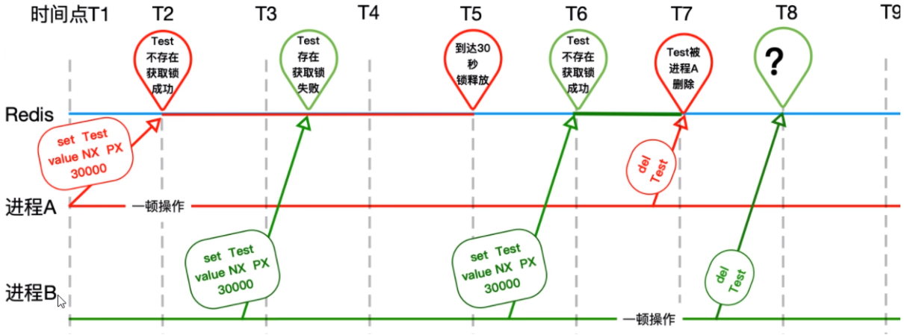
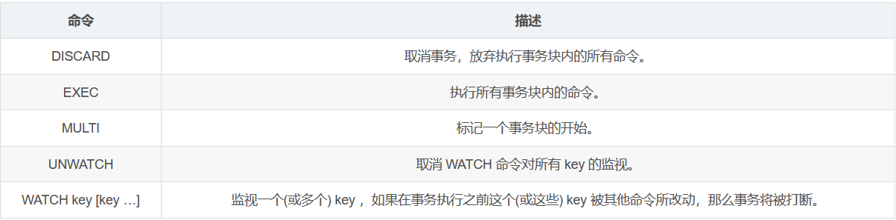

## redis分布式锁01

JVM层面的加锁，单机版的锁

```
class X {
    private final ReentrantLock lock = new ReentrantLock();
    // ...

    public void m() {
        lock.lock();  // block until condition holds//不见不散
        try {
            // ... method body
        } finally {
            lock.unlock()
        }
    }
     
     
    public void m2() {

       	if(lock.tryLock(timeout, unit)){//过时不候
            try {
            // ... method body
            } finally {
                lock.unlock()
            }   
        }else{
            // perform alternative actions
        }
   }
 }
     
```

## redis分布式锁02

如果分布式部署下，会有问题。

Redis具有极高的性能，且其命令对分布式锁支持友好，借助SET命令即可实现加锁处理。

- EX seconds – Set the specified expire time, in seconds.
- PX milliseconds – Set the specified expire time, in milliseconds.
- NX – Only set the key if it does not already exist.
- XX – Only set the key if it already exist.

```
public static final String REDIS_LOCK = "redis_lock";

@Autowired
private StringRedisTemplate stringRedisTemplate;

public void m(){
    String value = UUID.randomUUID().toString() + Thread.currentThread().getName();

    Boolean flag = stringRedisTemplate.opsForValue().setIfAbsent(REDIS_LOCK, value);


    if(!flag) {
        return "抢锁失败";
    }
 
    ...//业务逻辑
    
    stringRedisTemplate.delete(REDIS_LOCK);
}
```

## redis分布式锁03

出现异常的话，可能无法释放锁，必须要在代码层面finally释放锁。

```
public static final String REDIS_LOCK = "redis_lock";

@Autowired
private StringRedisTemplate stringRedisTemplate;

public void m(){
    String value = UUID.randomUUID().toString() + Thread.currentThread().getName();

    try{
		Boolean flag = stringRedisTemplate.opsForValue().setIfAbsent(REDIS_LOCK, value);

   		if(!flag) {
        	return "抢锁失败";
	    }
        
    	...//业务逻辑
            
    }finally{
	    stringRedisTemplate.delete(REDIS_LOCK);   
    }
}
```

另一个问题：分布式中获取锁的机器挂了，代码层面根本没有走到finally这块，没办法保证解锁，这个key没有被删除，需要加入一个过期时间限定key。

```
public static final String REDIS_LOCK = "redis_lock";

@Autowired
private StringRedisTemplate stringRedisTemplate;

public void m(){
    String value = UUID.randomUUID().toString() + Thread.currentThread().getName();

    try{
		Boolean flag = stringRedisTemplate.opsForValue().setIfAbsent(REDIS_LOCK, value);
		//设定时间
        stringRedisTemplate.expire(REDIS_LOCK, 10L, TimeUnit.SECONDS);
        
   		if(!flag) {
        	return "抢锁失败";
	    }
        
    	...//业务逻辑
            
    }finally{
	    stringRedisTemplate.delete(REDIS_LOCK);   
    }
}
```

## redis分布式锁04

设置key+过期时间分开了，必须要合并成一行具备原子性。

```
public static final String REDIS_LOCK = "redis_lock";

@Autowired
private StringRedisTemplate stringRedisTemplate;

public void m(){
    String value = UUID.randomUUID().toString() + Thread.currentThread().getName();

    try{
		Boolean flag = stringRedisTemplate.opsForValue()//使用另一个带有设置超时操作的方法
            .setIfAbsent(REDIS_LOCK, value, 10L, TimeUnit.SECONDS);
		//设定时间
        //stringRedisTemplate.expire(REDIS_LOCK, 10L, TimeUnit.SECONDS);
        
   		if(!flag) {
        	return "抢锁失败";
	    }
        
    	...//业务逻辑
            
    }finally{
	    stringRedisTemplate.delete(REDIS_LOCK);   
    }
}
```

另一个新问题：张冠李戴，删除了别人的锁。可能A线程业务复杂，耗时比较长，然后超时释放锁了，这时B线程获取到了锁，A线程执行到delete锁过程，然后把B的lock删除了，这时其他线程又可以获取锁了，B又删除其他线程的lock...炸了啊



解决方法：只能自己删除自己的，不许动别人的。

```
public static final String REDIS_LOCK = "redis_lock";

@Autowired
private StringRedisTemplate stringRedisTemplate;

public void m(){
    String value = UUID.randomUUID().toString() + Thread.currentThread().getName();

    try{
		Boolean flag = stringRedisTemplate.opsForValue()//使用另一个带有设置超时操作的方法
            .setIfAbsent(REDIS_LOCK, value, 10L, TimeUnit.SECONDS);
		//设定时间
        //stringRedisTemplate.expire(REDIS_LOCK, 10L, TimeUnit.SECONDS);
        
   		if(!flag) {
        	return "抢锁失败";
	    }
        
    	...//业务逻辑
            
    }finally{
        if(stringRedisTemplate.opsForValue().get(REDIS_LOCK).equals(value)) {
            stringRedisTemplate.delete(REDIS_LOCK);
        }
    }
}
```

## redis分布式锁05

finally块的判断 + del删除操作不是原子性的

解决办法：

- 用lua脚本
- 用redis自身的事务

Redis事务介绍：

- Redis的事条是通过MULTI，EXEC，DISCARD和WATCH这四个命令来完成。
- Redis的单个命令都是原子性的，所以这里确保事务性的对象是命令集合。
- Redis将命令集合序列化并确保处于一事务的命令集合连续且不被打断的执行。
- Redis不支持回滚的操作。



```
public static final String REDIS_LOCK = "redis_lock";

@Autowired
private StringRedisTemplate stringRedisTemplate;

public void m(){
    String value = UUID.randomUUID().toString() + Thread.currentThread().getName();

    try{
		Boolean flag = stringRedisTemplate.opsForValue()//使用另一个带有设置超时操作的方法
            .setIfAbsent(REDIS_LOCK, value, 10L, TimeUnit.SECONDS);
		//设定时间
        //stringRedisTemplate.expire(REDIS_LOCK, 10L, TimeUnit.SECONDS);
        
   		if(!flag) {
        	return "抢锁失败";
	    }
        
    	...//业务逻辑
            
    }finally{
        while(true){
            stringRedisTemplate.watch(REDIS_LOCK);
            if(stringRedisTemplate.opsForValue().get(REDIS_LOCK).equalsIgnoreCase(value)){
                stringRedisTemplate.setEnableTransactionSupport(true);
                stringRedisTemplate.multi();
                stringRedisTemplate.delete(REDIS_LOCK);
                List<Object> list = stringRedisTemplate.exec();
                if (list == null) {
                    continue;
                }
            }
            stringRedisTemplate.unwatch();
            break;
        } 
    }
}
```

## redis分布式锁06

确保RedisLock过期时间大于业务执行时间的问题

Redission有看门狗机制（watch dog）,每隔10秒钟看一下，如果还持有锁，延长生存时间。

## redis分布式锁07

```
public static final String REDIS_LOCK = "REDIS_LOCK";

@Autowired
private Redisson redisson;

@GetMapping("/doSomething")
public String doSomething(){

    RLock redissonLock = redisson.getLock(REDIS_LOCK);
    redissonLock.lock();
    try {
        //doSomething
    }finally {
    	//添加后，更保险
		if(redissonLock.isLocked() && redissonLock.isHeldByCurrentThread()) {
    		redissonLock.unlock();
    	}
    }
}
```

## redis分布式锁总结

- synchronized, reentranLock单机版oK，上分布式不行
- 取消单机锁，上Redis分布式锁setnx，如果不存在才能设置
- 只加了锁，没有释放锁，出异常的话，可能无法释放锁,必须要在代码层面finally释放锁
- 分布式中获取锁的机器挂了，代码层面根本没有走到finally这块，没办法保证解锁，这个key没有被删除，需要加入一个过期时间限定key。
- 设置key+过期时间分开了，必须要合并成一行具备原子性。nx ex
- 必须规定只能自己删除自己的锁,不能把别人的锁删除了，防止张冠李戴，1删2，2删3
- finally块的判断 + del删除操作不是原子性的
- 确保RedisLock过期时间大于业务执行时间的问题，看门狗机制