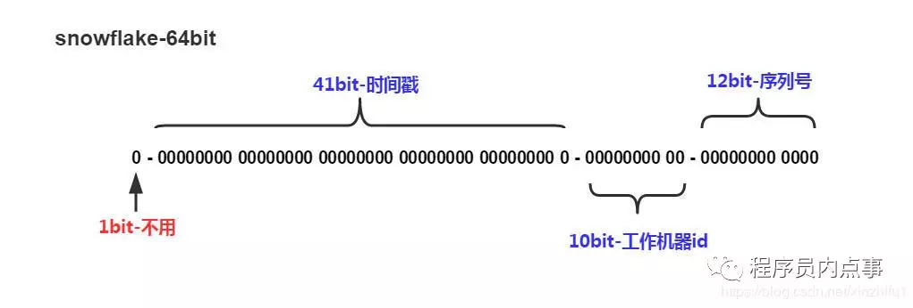

## 基于UUID

像用作订单号UUID这样的字符串没有丝毫的意义，看不出和订单相关的有用信息；而对于数据库来说用作业务主键ID，它不仅是太长还是字符串，存储性能差查询也很耗时，所以不推荐用作分布式ID。

优点：

- 生成足够简单，本地生成无网络消耗，具有唯一性

缺点：

- 无序的字符串，不具备趋势自增特性
- 没有具体的业务含义
- 长度过长16 字节128位，36位长度的字符串，存储以及查询对MySQL的性能消耗较大，MySQL官方明确建议主键要尽量越短越好，作为数据库主键 UUID 的无序性会导致数据位置频繁变动，严重影响性能。

## 基于数据库自增ID

基于数据库的auto_increment自增ID完全可以充当分布式ID，具体实现：需要一个单独的MySQL实例用来生成ID

当我们需要一个ID的时候，向表中插入一条记录返回主键ID，但这种方式有一个比较致命的缺点，访问量激增时MySQL本身就是系统的瓶颈，用它来实现分布式服务风险比较大，不推荐！

优点：

- 实现简单，ID单调自增，数值类型查询速度快

缺点：

- DB单点存在宕机风险，无法扛住高并发场景

## 基于数据库集群模式

前边说了单点数据库方式不可取，那对上边的方式做一些高可用优化，换成主从模式集群。害怕一个主节点挂掉没法用，那就做双主模式集群，也就是两个Mysql实例都能单独的生产自增ID。

那这样还会有个问题，两个MySQL实例的自增ID都从1开始，会生成重复的ID怎么办？

解决方案：设置起始值和自增步长

MySQL_1 配置：

```
set @@auto_increment_offset = 1;     -- 起始值
set @@auto_increment_increment = 2;  -- 步长
```

MySQL_2 配置：

```
set @@auto_increment_offset = 2;     -- 起始值
set @@auto_increment_increment = 2;  -- 步长
```

这样两个MySQL实例的自增ID分别就是：

```
1、3、5、7、9 
2、4、6、8、10
```

那如果集群后的性能还是扛不住高并发咋办？就要进行MySQL扩容增加节点，这是一个比较麻烦的事。


增加第三台MySQL实例需要人工修改一、二两台MySQL实例的起始值和步长

优点：

- 解决DB单点问题

缺点：

- 不利于后续扩容，而且实际上单个数据库自身压力还是大，依旧无法满足高并发场景。

## 基于数据库的号段模式

号段模式是当下分布式ID生成器的主流实现方式之一，号段模式可以理解为从数据库批量的获取自增ID，每次从数据库取出一个号段范围，例如 (1,1000] 代表1000个ID，具体的业务服务将本号段，生成1~1000的自增ID并加载到内存。表结构如下：

```
CREATE TABLE id_generator (
  id int(10) NOT NULL,
  max_id bigint(20) NOT NULL COMMENT '当前最大id',
  step int(20) NOT NULL COMMENT '号段的布长',
  biz_type    int(20) NOT NULL COMMENT '业务类型',
  version int(20) NOT NULL COMMENT '版本号',
  PRIMARY KEY (`id`)
) 
```

version ：是一个乐观锁，每次都更新version，保证并发时数据的正确性

等这批号段ID用完，再次向数据库申请新号段，对max_id字段做一次update操作，update max_id= max_id + step，update成功则说明新号段获取成功，新的号段范围是(max_id ,max_id +step]。

```
update id_generator set max_id = #{max_id+step}, version = version + 1 where version = # {version} and biz_type = XXX
```

由于多业务端可能同时操作，所以采用版本号version乐观锁方式更新，这种分布式ID生成方式不强依赖于数据库，不会频繁的访问数据库，对数据库的压力小很多。

## 基于Redis模式

Redis也同样可以实现，原理就是利用redis的 incr命令实现ID的原子性自增。

```
127.0.0.1:6379> set seq_id 1     // 初始化自增ID为1
OK
127.0.0.1:6379> incr seq_id      // 增加1，并返回递增后的数值
(integer) 2
```

用redis实现需要注意一点，要考虑到redis持久化的问题。redis有两种持久化方式RDB和AOF

- RDB会定时打一个快照进行持久化，假如连续自增但redis没及时持久化，而这会Redis挂掉了，重启Redis后会出现ID重复的情况。
- AOF会对每条写命令进行持久化，即使Redis挂掉了也不会出现ID重复的情况，但由于incr命令的特殊性，会导致Redis重启恢复的数据时间过长。

## 基于雪花算法（Snowflake）模式



雪花算法（Snowflake）是twitter公司内部分布式项目采用的ID生成算法

Snowflake生成的是Long类型的ID，一个Long类型占8个字节，每个字节占8比特，也就是说一个Long类型占64个比特。

Snowflake ID组成结构：正数位（占1比特）+ 时间戳（占41比特）+ 机器ID（占5比特）+ 数据中心（占5比特）+ 自增值（占12比特），总共64比特组成的一个Long类型。

- 第一个bit位（1bit）：Java中long的最高位是符号位代表正负，正数是0，负数是1，一般生成ID都为正数，所以默认为0。
- 时间戳部分（41bit）：毫秒级的时间，不建议存当前时间戳，而是用（当前时间戳 - 固定开始时间戳）的差值，可以使产生的ID从更小的值开始；41位的时间戳可以使用69年，(1L << 41) / (1000L * 60 * 60 * 24 * 365) = 69年
- 工作机器id（10bit）：也被叫做workId，这个可以灵活配置，机房或者机器号组合都可以。
- 序列号部分（12bit），自增值支持同一毫秒内同一个节点可以生成4096个ID

根据这个算法的逻辑，只需要将这个算法用Java语言实现出来，封装为一个工具方法，那么各个业务应用可以直接使用该工具方法来获取分布式ID，只需保证每个业务应用有自己的工作机器id即可，而不需要单独去搭建一个获取分布式ID的应用。

```
/**
 * Twitter的SnowFlake算法,使用SnowFlake算法生成一个整数，然后转化为62进制变成一个短地址URL
 *
 * https://github.com/beyondfengyu/SnowFlake
 */
public class SnowFlakeShortUrl {

    /**
     * 起始的时间戳
     */
    private final static long START_TIMESTAMP = 1480166465631L;

    /**
     * 每一部分占用的位数
     */
    private final static long SEQUENCE_BIT = 12;   //序列号占用的位数
    private final static long MACHINE_BIT = 5;     //机器标识占用的位数
    private final static long DATA_CENTER_BIT = 5; //数据中心占用的位数

    /**
     * 每一部分的最大值
     */
    private final static long MAX_SEQUENCE = -1L ^ (-1L << SEQUENCE_BIT);
    private final static long MAX_MACHINE_NUM = -1L ^ (-1L << MACHINE_BIT);
    private final static long MAX_DATA_CENTER_NUM = -1L ^ (-1L << DATA_CENTER_BIT);

    /**
     * 每一部分向左的位移
     */
    private final static long MACHINE_LEFT = SEQUENCE_BIT;
    private final static long DATA_CENTER_LEFT = SEQUENCE_BIT + MACHINE_BIT;
    private final static long TIMESTAMP_LEFT = DATA_CENTER_LEFT + DATA_CENTER_BIT;

    private long dataCenterId;  //数据中心
    private long machineId;     //机器标识
    private long sequence = 0L; //序列号
    private long lastTimeStamp = -1L;  //上一次时间戳

    private long getNextMill() {
        long mill = getNewTimeStamp();
        while (mill <= lastTimeStamp) {
            mill = getNewTimeStamp();
        }
        return mill;
    }

    private long getNewTimeStamp() {
        return System.currentTimeMillis();
    }

    /**
     * 根据指定的数据中心ID和机器标志ID生成指定的序列号
     *
     * @param dataCenterId 数据中心ID
     * @param machineId    机器标志ID
     */
    public SnowFlakeShortUrl(long dataCenterId, long machineId) {
        if (dataCenterId > MAX_DATA_CENTER_NUM || dataCenterId < 0) {
            throw new IllegalArgumentException("DtaCenterId can't be greater than MAX_DATA_CENTER_NUM or less than 0！");
        }
        if (machineId > MAX_MACHINE_NUM || machineId < 0) {
            throw new IllegalArgumentException("MachineId can't be greater than MAX_MACHINE_NUM or less than 0！");
        }
        this.dataCenterId = dataCenterId;
        this.machineId = machineId;
    }

    /**
     * 产生下一个ID
     *
     * @return
     */
    public synchronized long nextId() {
        long currTimeStamp = getNewTimeStamp();
        if (currTimeStamp < lastTimeStamp) {
            throw new RuntimeException("Clock moved backwards.  Refusing to generate id");
        }

        if (currTimeStamp == lastTimeStamp) {
            //相同毫秒内，序列号自增
            sequence = (sequence + 1) & MAX_SEQUENCE;
            //同一毫秒的序列数已经达到最大
            if (sequence == 0L) {
                currTimeStamp = getNextMill();
            }
        } else {
            //不同毫秒内，序列号置为0
            sequence = 0L;
        }

        lastTimeStamp = currTimeStamp;

        return (currTimeStamp - START_TIMESTAMP) << TIMESTAMP_LEFT //时间戳部分
                | dataCenterId << DATA_CENTER_LEFT       //数据中心部分
                | machineId << MACHINE_LEFT             //机器标识部分
                | sequence;                             //序列号部分
    }

    public static void main(String[] args) {
        SnowFlakeShortUrl snowFlake = new SnowFlakeShortUrl(2, 3);

        for (int i = 0; i < (1 << 4); i++) {
            //10进制
            System.out.println(snowFlake.nextId());
        }
    }
}
```