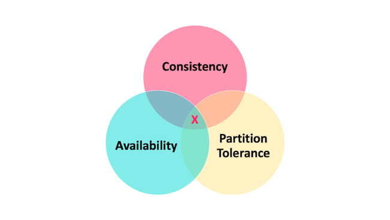
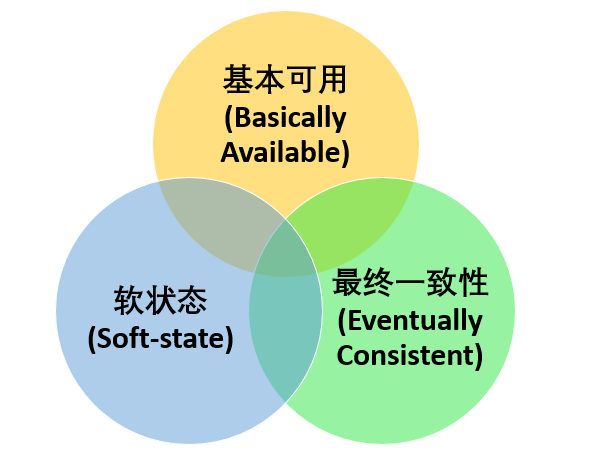

## CAP理论

CAP 也就是 Consistency（一致性）、Availability（可用性）、Partition Tolerance（分区容错性） 这三个单词首字母组合。

CAP 定理（CAP theorem）指出对于一个分布式系统来说，当设计读写操作时，只能同时满足以下三点中的两个：

- 一致性（Consistency） : 所有节点访问同一份最新的数据副本
- 可用性（Availability）: 非故障的节点在合理的时间内返回合理的响应（不是错误或者超时的响应）。
- 分区容错性（Partition tolerance） : 分布式系统出现网络分区的时候，仍然能够对外提供服务。

因此，分布式系统理论上不可能选择 CA 架构，只能选择 CP 或者 AP 架构。

比如 ZooKeeper、HBase 就是 CP 架构，Cassandra、Eureka 就是 AP 架构，Nacos 不仅支持 CP 架构也支持 AP 架构。

- ZooKeeper 保证的是 CP。 任何时刻对 ZooKeeper 的读请求都能得到一致性的结果，但是， ZooKeeper 不保证每次请求的可用性比如在 Leader 选举过程中或者半数以上的机器不可用的时候服务就是不可用的。 
- Eureka 保证的则是 AP。 Eureka 在设计的时候就是优先保证 A （可用性）。在 Eureka 中不存在什么 Leader 节点，每个节点都是一样的、平等的。因此 Eureka 不会像 ZooKeeper 那样出现选举过程中或者半数以上的机器不可用的时候服务就是不可用的情况。 Eureka 保证即使大部分节点挂掉也不会影响正常提供服务，只要有一个节点是可用的就行了。只不过这个节点上的数据可能并不是最新的。 
- Nacos 不仅支持 CP 也支持 AP。 # 总结

选择 CP 还是 AP 的关键在于当前的业务场景，没有定论，比如对于需要确保强一致性的场景如银行一般会选择保证 CP 。

如果网络分区正常的话（系统在绝大部分时候所处的状态），也就说不需要保证 P 的时候，C 和 A 能够同时保证。

### 什么是网络分区？

分布式系统中，多个节点之前的网络本来是连通的，但是因为某些故障（比如部分节点网络出了问题）某些节点之间不连通了，整个网络就分成了几块区域，这就叫网络分区。

## BASE理论

BASE 是 Basically Available（基本可用） 、Soft-state（软状态） 和 Eventually Consistent（最终一致性） 三个短语的缩写。

### BASE 理论的核心思想

即使无法做到强一致性，但每个应用都可以根据自身业务特点，采用适当的方式来使系统达到最终一致性。

> 也就是牺牲数据的一致性来满足系统的高可用性，系统中一部分数据不可用或者不一致时，仍需要保持系统整体“主要可用”。

BASE 理论本质上是对 CAP 的延伸和补充，更具体地说，是对 CAP 中 AP 方案的一个补充。

AP 方案只是在系统发生分区的时候放弃一致性，而不是永远放弃一致性。在分区故障恢复后，系统应该达到最终一致性。这一点其实就是 BASE 理论延伸的地方。

### BASE 理论三要素

#### 基本可用

基本可用是指分布式系统在出现不可预知故障的时候，允许损失部分可用性。但是，这绝不等价于系统不可用。

什么叫允许损失部分可用性呢？

- 响应时间上的损失: 正常情况下，处理用户请求需要 0.5s 返回结果，但是由于系统出现故障，处理用户请求的时间变为 3 s。 
- 系统功能上的损失：正常情况下，用户可以使用系统的全部功能，但是由于系统访问量突然剧增，系统的部分非核心功能无法使用。

#### 软状态

软状态指允许系统中的数据存在中间状态（CAP 理论中的数据不一致），并认为该中间状态的存在不会影响系统的整体可用性，即允许系统在不同节点的数据副本之间进行数据同步的过程存在延时。

#### 最终一致性

最终一致性强调的是系统中所有的数据副本，在经过一段时间的同步后，最终能够达到一个一致的状态。因此，最终一致性的本质是需要系统保证最终数据能够达到一致，而不需要实时保证系统数据的强一致性。

## 总结

ACID 是数据库事务完整性的理论，CAP 是分布式系统设计理论，BASE 是 CAP 理论中 AP 方案的延伸。