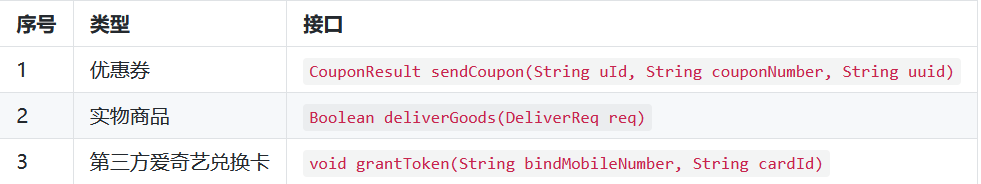

> 本文章仅用于本人学习笔记记录
> 微信：wxid_ygj58saenbjh22（如本文档内容侵权了您的权益，请您通过微信联系到我）

## 工厂方法模式介绍

工厂模式又称工厂方法模式，是一种创建型设计模式，其在父类中提供一个创建对象的方法， 允许子类决定实例化对象的类型。

这种设计模式也是 Java 开发中最常见的一种模式，它的主要意图是定义一个创建对象的接口，让其子类自己决定实例化哪一个工厂类，工厂模式使其创建过程延迟到子类进行。

简单说就是为了提供代码结构的扩展性，屏蔽每一个功能类中的具体实现逻辑。让外部可以更加简单的只是知道调用即可，同时，这也是去掉众多ifelse的方式。当然这可能也有一些缺点，比如需要实现的类非常多，如何去维护，怎样减低开发成本。但这些问题都可以在后续的设计模式结合使用中，逐步降低。

## 模拟发奖多种商品


由于营销场景的复杂、多变、临时的特性，它所需要的设计需要更加深入，否则会经常面临各种紧急CRUD操作，从而让代码结构混乱不堪，难以维护。

那么在这里我们模拟积分兑换中的发放多种类型商品，假如现在我们有如下三种类型的商品接口；



从以上接口来看有如下信息：

- 三个接口返回类型不同，有对象类型、布尔类型、还有一个空类型。
- 入参不同，发放优惠券需要仿重、兑换卡需要卡ID、实物商品需要发货位置(对象中含有)。
- 另外可能会随着后续的业务的发展，会新增其他种商品类型。因为你所有的开发需求都是随着业务对市场的拓展而带来的。

## 用一坨坨代码实现

如果不考虑任何扩展性，只为了尽快满足需求，那么对这么几种奖励发放只需使用ifelse语句判断，调用不同的接口即可满足需求。

### 工程结构

```
itstack-demo-design-1-01
└── src
    ├── main
    │   └── java
    │       └── org.itstack.demo.design
    │           ├── AwardReq.java
    │           ├── AwardRes.java
    │           └── PrizeController.java 
    └── test
         └── java
             └── org.itstack.demo.design.test
                 └── ApiTest.java
```

工程结构上非常简单，一个入参对象 AwardReq 、一个出参对象 AwardRes，以及一个接口类 PrizeController

### ifelse实现需求

```
public class PrizeController {

    private Logger logger = LoggerFactory.getLogger(PrizeController.class);

    public AwardRes awardToUser(AwardReq req) {
        String reqJson = JSON.toJSONString(req);
        AwardRes awardRes = null;
        try {
            logger.info("奖品发放开始{}。req:{}", req.getuId(), reqJson);
            // 按照不同类型方法商品[1优惠券、2实物商品、3第三方兑换卡(爱奇艺)]
            if (req.getAwardType() == 1) {
                CouponService couponService = new CouponService();
                CouponResult couponResult = couponService.sendCoupon(req.getuId(), req.getAwardNumber(), req.getBizId());
                if ("0000".equals(couponResult.getCode())) {
                    awardRes = new AwardRes("0000", "发放成功");
                } else {
                    awardRes = new AwardRes("0001", couponResult.getInfo());
                }
            } else if (req.getAwardType() == 2) {
                GoodsService goodsService = new GoodsService();
                DeliverReq deliverReq = new DeliverReq();
                deliverReq.setUserName(queryUserName(req.getuId()));
                deliverReq.setUserPhone(queryUserPhoneNumber(req.getuId()));
                deliverReq.setSku(req.getAwardNumber());
                deliverReq.setOrderId(req.getBizId());
                deliverReq.setConsigneeUserName(req.getExtMap().get("consigneeUserName"));
                deliverReq.setConsigneeUserPhone(req.getExtMap().get("consigneeUserPhone"));
                deliverReq.setConsigneeUserAddress(req.getExtMap().get("consigneeUserAddress"));
                Boolean isSuccess = goodsService.deliverGoods(deliverReq);
                if (isSuccess) {
                    awardRes = new AwardRes("0000", "发放成功");
                } else {
                    awardRes = new AwardRes("0001", "发放失败");
                }
            } else if (req.getAwardType() == 3) {
                String bindMobileNumber = queryUserPhoneNumber(req.getuId());
                IQiYiCardService iQiYiCardService = new IQiYiCardService();
                iQiYiCardService.grantToken(bindMobileNumber, req.getAwardNumber());
                awardRes = new AwardRes("0000", "发放成功");
            }
            logger.info("奖品发放完成{}。", req.getuId());
        } catch (Exception e) {
            logger.error("奖品发放失败{}。req:{}", req.getuId(), reqJson, e);
            awardRes = new AwardRes("0001", e.getMessage());
        }

        return awardRes;
    }

    private String queryUserName(String uId) {
        return "花花";
    }

    private String queryUserPhoneNumber(String uId) {
        return "15200101232";
    }

}
```

如上就是使用 ifelse 非常直接的实现出来业务需求的一坨代码，如果仅从业务角度看，研发如期甚至提前实现了功能。

那这样的代码目前来看并不会有什么问题，但如果在经过几次的迭代和拓展，接手这段代码的研发将十分痛苦。重构成本高需要理清之前每一个接口的使用，测试回归验证时间长，需要全部验证一次。这也就是很多人并不愿意接手别人的代码，如果接手了又被压榨开发时间。那么可想而知这样的 ifelse 还会继续增加。

## 工厂模式优化代码

接下来使用工厂方法模式来进行代码优化，也算是一次很小的重构。整理重构会你会发现代码结构清晰了、也具备了下次新增业务需求的扩展性。但在实际使用中还会对此进行完善，目前的只是抽离出最核心的部分体现到你面前，方便学习。

### 工程结构

```
itstack-demo-design-1-02
└── src
    ├── main
    │   └── java
    │       └── org.itstack.demo.design
    │           ├── store    
    │           │   ├── impl
    │           │   │   ├── CardCommodityService.java
    │           │   │   ├── CouponCommodityService.java 
    │           │   │   └── GoodsCommodityService.java  
    │           │   └── ICommodity.java
    │           └── StoreFactory.java 
    └── test
         └── java
             └── org.itstack.demo.design.test
                 └── ApiTest.java
```

首先，从上面的工程结构中你是否一些感觉，比如；它看上去清晰了、这样分层可以更好扩展了、似乎可以想象到每一个类做了什么。

### 代码实现

#### 定义发奖接口

```
public interface ICommodity {
    void sendCommodity(JSONObject req);

    int getType();
}
```

所有的奖品无论是实物、虚拟还是第三方，都需要通过我们的程序实现此接口进行处理，以保证最终入参出参的统一性。

固定的入参和返回结果。

#### 实现奖品发放接口

优惠券:

```
public class CouponCommodityService implements ICommodity{
    @Override
    public void sendCommodity(JSONObject req) {
        // todo
        System.out.println("------");
    }

    @Override
    public int getType() {
        return 0;
    }
}
```

实物商品:

```
public class GoodsCommodityService implements ICommodity{
    @Override
    public void sendCommodity(JSONObject req){
        // todo
    }

    @Override
    public int getType() {
        return 1;
    }
}
```

第三方兑换卡:

```
public class CardCommodityService implements ICommodity{

    @Override
    public void sendCommodity(JSONObject req) {
        // todo
    }

    @Override
    public int getType() {
        return 2;
    }
}
```

从上面可以看到每一种奖品的实现都包括在自己的类中，新增、修改或者删除都不会影响其他奖品功能的测试，降低回归测试的可能。

后续在新增的奖品只需要按照此结构进行填充即可，非常易于维护和扩展。

在统一了入参以及出参后，调用方不在需要关心奖品发放的内部逻辑，按照统一的方式即可处理。

### 创建商店工厂

```
public class CommodityFactory {
    private Map<Integer, ICommodity> map;

    public CommodityFactory() {

        List<ICommodity> strategies = new ArrayList<>();

        strategies.add(new CouponCommodityService());
        strategies.add(new GoodsCommodityService());
        strategies.add(new CardCommodityService());

        map = strategies.stream().collect(Collectors.toMap(ICommodity::getType, strategy -> strategy));

    }

    public static class Holder {
        public static CommodityFactory instance = new CommodityFactory();
    }

    public static CommodityFactory getInstance() {
        return Holder.instance;
    }

    public ICommodity get(Integer type) {
        return map.get(type);
    }
}
```

这里我们定义了一个商店的工厂类，在里面按照类型实现各种商品的服务。可以非常干净整洁的处理你的代码，后续新增的商品在这里扩展即可。

### 测试

```
public class FactoryTest {
    public static void main(String[] args) {
        ICommodity strategy = CommodityFactory.getInstance().get(0);
        strategy.sendCommodity(new JSONObject());
    }
}
```

## 总结

- 从上到下的优化来看，工厂方法模式并不复杂，甚至这样的开发结构在你有所理解后，会发现更加简单了。
- 那么这样的开发的好处知道后，也可以总结出来它的优点；**避免创建者与具体的产品逻辑耦合、满足单一职责，每一个业务逻辑实现都在所属自己的类中完成、满足开闭原则，无需更改使用调用方就可以在程序中引入新的产品类型**。但这样也会带来一些问题，比如有非常多的奖品类型，那么实现的子类会极速扩张。因此也需要使用其他的模式进行优化，这些在后续的设计模式中会逐步涉及到。
- 工厂模式又称工厂方法模式，是一种创建型设计模式，其在父类中提供一个创建对象的方法， 允许子类决定实例化对象的类型。
- 就是根据判断找出多个实现中的一个。