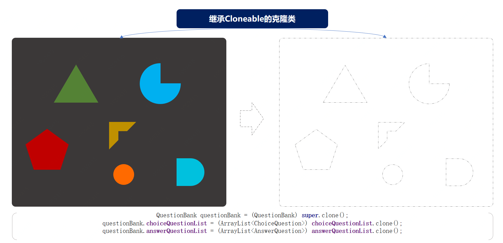

> 本文章仅用于本人学习笔记记录
> 微信：wxid_ygj58saenbjh22（如本文档内容侵权了您的权益，请您通过微信联系到我）

## 原型模式介绍

原型模式主要解决的问题就是创建重复对象，而这部分对象内容本身比较复杂，生成过程可能从库或者RPC接口中获取数据的耗时较长，因此采用克隆的方式节省时间。

其实这种场景经常出现在我们的身边，只不过很少用到自己的开发中，就像：

经常Ctrl+C、Ctrl+V，复制粘贴代码。

Java多数类中提供的API方法；Object clone()。

## 简单例子


每个人都经历过考试，从纸制版到上机答题，大大小小也有几百场。而以前坐在教室里答题身边的人都是一套试卷，考试的时候还能偷摸或者别人给发信息抄一抄答案。

但从一部分可以上机考试的内容开始，在保证大家的公平性一样的题目下，开始出现试题混排更有做的好的答案选项也混排。这样大大的增加了抄的成本，也更好的做到了考试的公平性。

需要实现一个上机考试抽题的服务，因此在这里建造一个题库题目的场景类信息，用于创建；选择题、问答题。

### 场景模拟工程

```
itstack-demo-design-4-00
└── src
    └── main
        └── java
            └── org.itstack.demo.design
                ├── AnswerQuestion.java
                └── ChoiceQuestion.java

```

在这里模拟了两个试卷题目的类；ChoiceQuestion(选择题)、AnswerQuestion(问答题)。如果是实际的业务场景开发中，会有更多的题目类型，可以回忆一下你的高考试卷。

### 场景简述

#### 选择题


```
public class ChoiceQuestion {

    private String name;                 // 题目
    private Map<String, String> option;  // 选项；A、B、C、D
    private String key;                  // 答案；B

    public ChoiceQuestion() {
    }

    public ChoiceQuestion(String name, Map<String, String> option, String key) {
        this.name = name;
        this.option = option;
        this.key = key;
    }

    // ...get/set
}

```

#### 问答题

```
public class AnswerQuestion {

    private String name;  // 问题
    private String key;   // 答案

    public AnswerQuestion() {
    }

    public AnswerQuestion(String name, String key) {
        this.name = name;
        this.key = key;
    }

    // ...get/set
}

```

## 用一坨坨代码实现

在以下的例子中我们会按照每一个用户创建试卷的题目，并返回给调用方。

### 工程结构

```
itstack-demo-design-4-01
└── src
    └── main
        └── java
            └── org.itstack.demo.design
                └── QuestionBankController.java

```

### 一把梭实现需求

一个类几千行的代码你是否见过，嚯？那今天就再让你见识一下有这样潜质的类！

```
public class QuestionBankController {

    public String createPaper(String candidate, String number) {

        List<ChoiceQuestion> choiceQuestionList = new ArrayList<ChoiceQuestion>();
        List<AnswerQuestion> answerQuestionList = new ArrayList<AnswerQuestion>();

        Map<String, String> map01 = new HashMap<String, String>();
        map01.put("A", "JAVA2 EE");
        map01.put("B", "JAVA2 Card");
        map01.put("C", "JAVA2 ME");
        map01.put("D", "JAVA2 HE");
        map01.put("E", "JAVA2 SE");

        Map<String, String> map02 = new HashMap<String, String>();
        map02.put("A", "JAVA程序的main方法必须写在类里面");
        map02.put("B", "JAVA程序中可以有多个main方法");
        map02.put("C", "JAVA程序中类名必须与文件名一样");
        map02.put("D", "JAVA程序的main方法中如果只有一条语句，可以不用{}(大括号)括起来");

        Map<String, String> map03 = new HashMap<String, String>();
        map03.put("A", "变量由字母、下划线、数字、$符号随意组成；");
        map03.put("B", "变量不能以数字作为开头；");
        map03.put("C", "A和a在java中是同一个变量；");
        map03.put("D", "不同类型的变量，可以起相同的名字；");

        Map<String, String> map04 = new HashMap<String, String>();
        map04.put("A", "STRING");
        map04.put("B", "x3x;");
        map04.put("C", "void");
        map04.put("D", "de$f");

        Map<String, String> map05 = new HashMap<String, String>();
        map05.put("A", "31");
        map05.put("B", "0");
        map05.put("C", "1");
        map05.put("D", "2");

        choiceQuestionList.add(new ChoiceQuestion("JAVA所定义的版本中不包括", map01, "D"));
        choiceQuestionList.add(new ChoiceQuestion("下列说法正确的是", map02, "A"));
        choiceQuestionList.add(new ChoiceQuestion("变量命名规范说法正确的是", map03, "B"));
        choiceQuestionList.add(new ChoiceQuestion("以下()不是合法的标识符", map04, "C"));
        choiceQuestionList.add(new ChoiceQuestion("表达式(11+3*8)/4%3的值是", map05, "D"));
        answerQuestionList.add(new AnswerQuestion("小红马和小黑马生的小马几条腿", "4条腿"));
        answerQuestionList.add(new AnswerQuestion("铁棒打头疼还是木棒打头疼", "头最疼"));
        answerQuestionList.add(new AnswerQuestion("什么床不能睡觉", "牙床"));
        answerQuestionList.add(new AnswerQuestion("为什么好马不吃回头草", "后面的草没了"));

        // 输出结果
        StringBuilder detail = new StringBuilder("考生：" + candidate + "\r\n" +
                "考号：" + number + "\r\n" +
                "--------------------------------------------\r\n" +
                "一、选择题" + "\r\n\n");

        for (int idx = 0; idx < choiceQuestionList.size(); idx++) {
            detail.append("第").append(idx + 1).append("题：").append(choiceQuestionList.get(idx).getName()).append("\r\n");
            Map<String, String> option = choiceQuestionList.get(idx).getOption();
            for (String key : option.keySet()) {
                detail.append(key).append("：").append(option.get(key)).append("\r\n");
                ;
            }
            detail.append("答案：").append(choiceQuestionList.get(idx).getKey()).append("\r\n\n");
        }

        detail.append("二、问答题" + "\r\n\n");

        for (int idx = 0; idx < answerQuestionList.size(); idx++) {
            detail.append("第").append(idx + 1).append("题：").append(answerQuestionList.get(idx).getName()).append("\r\n");
            detail.append("答案：").append(answerQuestionList.get(idx).getKey()).append("\r\n\n");
        }

        return detail.toString();
    }

}

```

这样的代码往往都非常易于理解，要什么程序就给什么代码，不面向对象，只面向过程。不考虑扩展性，能用就行。

以上的代码主要就三部分内容；首先创建选择题和问答题到集合中、定义详情字符串包装结果、返回结果内容。

但以上的代码有一个没有实现的地方就是不能乱序，所有人的试卷顺序都是一样的。如果需要加乱序也是可以的，但复杂度又会增加。

### 测试验证

```
@Test
public void test_QuestionBankController() {
    QuestionBankController questionBankController = new QuestionBankController();
    System.out.println(questionBankController.createPaper("花花", "1000001921032"));
    System.out.println(questionBankController.createPaper("豆豆", "1000001921051"));
    System.out.println(questionBankController.createPaper("大宝", "1000001921987"));
}

```

## 原型模式重构代码

原型模式主要解决的问题就是创建大量重复的类，而我们模拟的场景就需要给不同的用户都创建相同的试卷，但这些试卷的题目不便于每次都从库中获取，甚至有时候需要从远程的RPC中获取。这样都是非常耗时的，而且随着创建对象的增多将严重影响效率。

在原型模式中所需要的非常重要的手段就是克隆，在需要用到克隆的类中都需要实现 implements Cloneable 接口。

### 工程结构

```
itstack-demo-design-4-02
└── src
    ├── main
    │   └── java
    │       └── org.itstack.demo.design
    │           ├── QuestionBank.java
    │           └── QuestionBankController.java 
    └── test
         └── java
             └── org.itstack.demo.design.test
                 └── ApiTest.java

```

原型模式模型结构



工程中包括了核心的题库类QuestionBank，题库中主要负责将各个的题目进行组装最终输出试卷。

### 代码实现

#### 克隆对象处理类

```
public class QuestionBank implements Cloneable {

    private String candidate; // 考生
    private String number;    // 考号

    private ArrayList<ChoiceQuestion> choiceQuestionList = new ArrayList<ChoiceQuestion>();
    private ArrayList<AnswerQuestion> answerQuestionList = new ArrayList<AnswerQuestion>();

    public QuestionBank append(ChoiceQuestion choiceQuestion) {
        choiceQuestionList.add(choiceQuestion);
        return this;
    }

    public QuestionBank append(AnswerQuestion answerQuestion) {
        answerQuestionList.add(answerQuestion);
        return this;
    }

    @Override
    public Object clone() throws CloneNotSupportedException {
        QuestionBank questionBank = (QuestionBank) super.clone();
        questionBank.choiceQuestionList = (ArrayList<ChoiceQuestion>) choiceQuestionList.clone();
        questionBank.answerQuestionList = (ArrayList<AnswerQuestion>) answerQuestionList.clone();

        // 题目乱序
        Collections.shuffle(questionBank.choiceQuestionList);
        Collections.shuffle(questionBank.answerQuestionList);

        return questionBank;
    }

    public void setCandidate(String candidate) {
        this.candidate = candidate;
    }

    public void setNumber(String number) {
        this.number = number;
    }

    @Override
    public String toString() {

        StringBuilder detail = new StringBuilder("考生：" + candidate + "\r\n" +
                "考号：" + number + "\r\n" +
                "--------------------------------------------\r\n" +
                "一、选择题" + "\r\n\n");

        for (int idx = 0; idx < choiceQuestionList.size(); idx++) {
            detail.append("第").append(idx + 1).append("题：").append(choiceQuestionList.get(idx).getName()).append("\r\n");
            Map<String, String> option = choiceQuestionList.get(idx).getOption();
            for (String key : option.keySet()) {
                detail.append(key).append("：").append(option.get(key)).append("\r\n");;
            }
            detail.append("答案：").append(choiceQuestionList.get(idx).getKey()).append("\r\n\n");
        }

        detail.append("二、问答题" + "\r\n\n");

        for (int idx = 0; idx < answerQuestionList.size(); idx++) {
            detail.append("第").append(idx + 1).append("题：").append(answerQuestionList.get(idx).getName()).append("\r\n");
            detail.append("答案：").append(answerQuestionList.get(idx).getKey()).append("\r\n\n");
        }

        return detail.toString();
    }

}

```

- 两个append()，对各项题目的添加，有点像我们在建造者模式中使用的方式，添加装修物料。
- clone() ，这里的核心操作就是对对象的复制，这里的复制不只是包括了本身，同时对两个集合也做了复制。只有这样的拷贝才能确保在操作克隆对象的时候不影响原对象。
- 乱序操作，在list集合中有一个方法，Collections.shuffle，可以将原有集合的顺序打乱，输出一个新的顺序。在这里我们使用此方法对题目进行乱序操作。

### 初始化试卷数据

```
public class QuestionBankController {

    private QuestionBank questionBank = new QuestionBank();

    public QuestionBankController() {

        Map<String, String> map01 = new HashMap<String, String>();
        map01.put("A", "JAVA2 EE");
        map01.put("B", "JAVA2 Card");
        map01.put("C", "JAVA2 ME");
        map01.put("D", "JAVA2 HE");
        map01.put("E", "JAVA2 SE");

        Map<String, String> map02 = new HashMap<String, String>();
        map02.put("A", "JAVA程序的main方法必须写在类里面");
        map02.put("B", "JAVA程序中可以有多个main方法");
        map02.put("C", "JAVA程序中类名必须与文件名一样");
        map02.put("D", "JAVA程序的main方法中如果只有一条语句，可以不用{}(大括号)括起来");

        Map<String, String> map03 = new HashMap<String, String>();
        map03.put("A", "变量由字母、下划线、数字、$符号随意组成；");
        map03.put("B", "变量不能以数字作为开头；");
        map03.put("C", "A和a在java中是同一个变量；");
        map03.put("D", "不同类型的变量，可以起相同的名字；");

        Map<String, String> map04 = new HashMap<String, String>();
        map04.put("A", "STRING");
        map04.put("B", "x3x;");
        map04.put("C", "void");
        map04.put("D", "de$f");

        Map<String, String> map05 = new HashMap<String, String>();
        map05.put("A", "31");
        map05.put("B", "0");
        map05.put("C", "1");
        map05.put("D", "2");
        
        questionBank.append(new ChoiceQuestion("JAVA所定义的版本中不包括", map01, "D"))
                .append(new ChoiceQuestion("下列说法正确的是", map02, "A"))
                .append(new ChoiceQuestion("变量命名规范说法正确的是", map03, "B"))
                .append(new ChoiceQuestion("以下()不是合法的标识符",map04, "C"))
                .append(new ChoiceQuestion("表达式(11+3*8)/4%3的值是", map05, "D"))
                .append(new AnswerQuestion("小红马和小黑马生的小马几条腿", "4条腿"))
                .append(new AnswerQuestion("铁棒打头疼还是木棒打头疼", "头最疼"))
                .append(new AnswerQuestion("什么床不能睡觉", "牙床"))
                .append(new AnswerQuestion("为什么好马不吃回头草", "后面的草没了"));
    }

    public String createPaper(String candidate, String number) throws CloneNotSupportedException {
        QuestionBank questionBankClone = (QuestionBank) questionBank.clone();
        questionBankClone.setCandidate(candidate);
        questionBankClone.setNumber(number);
        return questionBankClone.toString();
    }

}

```

- 这个类的内容就比较简单了，主要提供对试卷内容的模式初始化操作(所有考生试卷一样，题目顺序不一致)。
- 以及对外部提供创建试卷的方法，在创建的过程中使用的是克隆的方式；(QuestionBank) questionBank.clone();，并最终返回试卷信息。

## 总结

- 以上的实际场景模拟了原型模式在开发中重构的作用，但是原型模式的使用频率确实不是很高。如果有一些特殊场景需要使用到，也可以按照此设计模式进行优化。
- 另外原型设计模式的优点包括；便于通过克隆方式创建复杂对象、也可以避免重复做初始化操作、不需要与类中所属的其他类耦合等。但也有一些缺点如果对象中包括了循环引用的克隆，以及类中深度使用对象的克隆，都会使此模式变得异常麻烦。
- 原型模式主要解决的问题就是创建重复对象，而这部分对象内容本身比较复杂，生成过程可能从库或者RPC接口中获取数据的耗时较长，因此采用克隆的方式节省时间。
- 就是在类中克隆不同的当前类和其他操作，减少了代码冗余。