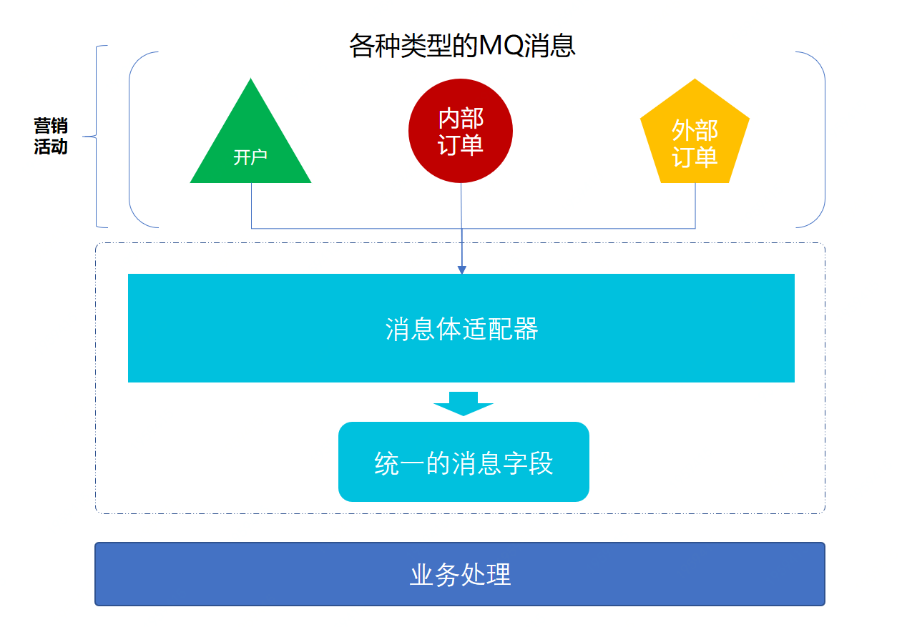
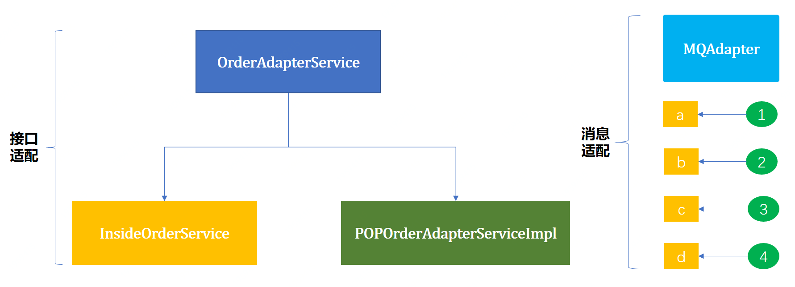

> 本文章仅用于本人学习笔记记录
> 微信：wxid_ygj58saenbjh22（如本文档内容侵权了您的权益，请您通过微信联系到我）

## 适配器模式介绍


适配器模式的主要作用就是把原本不兼容的接口，通过适配修改做到统一。

使得用户方便使用，就像我们提到的万能充、数据线、MAC笔记本的转换头、出国旅游买个插座等等，他们都是为了适配各种不同的口，做的兼容。

在业务开发中我们会经常的需要做不同接口的兼容。

## 简单例子



一个系统会接收各种各样的MQ消息或者接口，如果一个个的去开发，就会耗费很大的成本，同时对于后期的拓展也有一定的难度。此时就会希望有一个系统可以配置一下就把外部的MQ接入进行，这些MQ就像上面提到的可能是一些注册开户消息、商品下单消息等等。

而适配器的思想方式也恰恰可以运用到这里，并且我想强调一下，适配器不只是可以适配接口往往还可以适配一些属性信息。

### 场景模拟工程

```
itstack-demo-design-6-00
└── src
    └── main
        └── java
            └── org.itstack.demo.design
                ├── mq
                │   ├── create_account.java
                │   ├── OrderMq.java
                │   └── POPOrderDelivered.java
                └── service
                    ├── OrderServicejava
                    └── POPOrderService.java

```

- 这里模拟了三个不同类型的MQ消息，而在消息体中都有一些必要的字段，比如；用户ID、时间、业务ID，但是每个MQ的字段属性并不一样。就像用户ID在不同的MQ里也有不同的字段：uId、userId等。
- 同时还提供了两个不同类型的接口，一个用于查询内部订单订单下单数量，一个用于查询第三方是否首单。
- 后面会把这些不同类型的MQ和接口做适配兼容。

### 场景简述

#### 注册开户MQ

```
public class create_account {

    private String number;      // 开户编号
    private String address;     // 开户地
    private Date accountDate;   // 开户时间
    private String desc;        // 开户描述

    // ... get/set     
}

```

#### 内部订单MQ

```
public class OrderMq {

    private String uid;           // 用户ID
    private String sku;           // 商品
    private String orderId;       // 订单ID
    private Date createOrderTime; // 下单时间     

    // ... get/set      
}

```

#### 第三方订单MQ

```
public class POPOrderDelivered {

    private String uId;     // 用户ID
    private String orderId; // 订单号
    private Date orderTime; // 下单时间
    private Date sku;       // 商品
    private Date skuName;   // 商品名称
    private BigDecimal decimal; // 金额

    // ... get/set      
}

```

#### 查询用户内部下单数量接口

```
public class OrderService {

    private Logger logger = LoggerFactory.getLogger(POPOrderService.class);

    public long queryUserOrderCount(String userId){
        logger.info("自营商家，查询用户的订单是否为首单：{}", userId);
        return 10L;
    }

}

```

#### 查询用户第三方下单首单接口

```
public class POPOrderService {

    private Logger logger = LoggerFactory.getLogger(POPOrderService.class);

    public boolean isFirstOrder(String uId) {
        logger.info("POP商家，查询用户的订单是否为首单：{}", uId);
        return true;
    }

}

```

## 用一坨坨代码实现

### 工程结构

```
itstack-demo-design-6-01
└── src
    └── main
        └── java
            └── org.itstack.demo.design
                └── create_accountMqService.java
                └── OrderMqService.java
                └── POPOrderDeliveredService.java

```

目前需要接收三个MQ消息，所有就有了三个对应的类，和我们平时的代码几乎一样。如果你的MQ量不多，这样的写法也没什么问题，但是随着数量的增加，就需要考虑用一些设计模式来解决。

### Mq接收消息实现

```
public class create_accountMqService {

    public void onMessage(String message) {

        create_account mq = JSON.parseObject(message, create_account.class);

        mq.getNumber();
        mq.getAccountDate();

        // ... 处理自己的业务
    }

}

```

三组MQ的消息都是一样模拟使用，就不一一展示了。当成千上万个mq处理时怎么办？

## 适配器模式重构代码

适配器模式要解决的主要问题就是多种差异化类型的接口做统一输出，这在我们学习工厂方法模式中也有所提到不同种类的奖品处理，其实那也是适配器的应用。

在本文中我们还会再另外体现出一个多种MQ接收，使用MQ的场景。来把不同类型的消息做统一的处理，便于减少后续对MQ接收。

再者，本文所展示的MQ兼容的核心部分，也就是处理适配不同的类型字段。而如果我们接收MQ后，在配置不同的消费类时，如果不希望一个个开发类，那么可以使用代理类的方式进行处理。

### 工程结构

```
itstack-demo-design-6-02
└── src
    └── main
        └── java
            └── org.itstack.demo.design
                ├── impl
                │   ├── InsideOrderService.java
                │   └── POPOrderAdapterServiceImpl.java
                ├── MQAdapter,java
                ├── OrderAdapterService,java
                └── RebateInfo,java

```

适配器模型结构



- 这里包括了两个类型的适配；接口适配、MQ适配。之所以不只是模拟接口适配，因为很多时候大家都很常见了，所以把适配的思想换一下到MQ消息体上，增加大家多设计模式的认知。
- 先是做MQ适配，接收各种各样的MQ消息。

### 代码实现(MQ消息适配)

#### 统一的MQ消息体

```
public class RebateInfo {

    private String userId;  // 用户ID
    private String bizId;   // 业务ID
    private Date bizTime;   // 业务时间
    private String desc;    // 业务描述
    
    // ... get/set
}

```

#### MQ消息体适配类

```
public class MQAdapter {

    public static RebateInfo filter(String strJson, Map<String, String> link) throws NoSuchMethodException, InvocationTargetException, IllegalAccessException {
        return filter(JSON.parseObject(strJson, Map.class), link);
    }

    public static RebateInfo filter(Map obj, Map<String, String> link) throws NoSuchMethodException, InvocationTargetException, IllegalAccessException {
        RebateInfo rebateInfo = new RebateInfo();
        for (String key : link.keySet()) {
            Object val = obj.get(link.get(key));
            RebateInfo.class.getMethod("set" + key.substring(0, 1).toUpperCase() + key.substring(1), String.class).invoke(rebateInfo, val.toString());
        }
        return rebateInfo;
    }

}

```

- 这个类里的方法非常重要，主要用于把不同类型MQ种的各种属性，映射成我们需要的属性并返回。就像一个属性中有用户ID;uId，映射到我们需要的；userId，做统一处理。
- 而在这个处理过程中需要把映射管理传递给Map<String, String> link，也就是准确的描述了，当前MQ中某个属性名称，映射为我们的某个属性名称。
- 最终因为我们接收到的mq消息基本都是json格式，可以转换为MAP结构。最后使用反射调用的方式给我们的类型赋值。

#### 测试适配类

```
@Test
public void test_MQAdapter() throws NoSuchMethodException, IllegalAccessException, InvocationTargetException {
    create_account create_account = new create_account();
    create_account.setNumber("100001");
    create_account.setAddress("河北省.廊坊市.广阳区.大学里职业技术学院");
    create_account.setAccountDate(new Date());
    create_account.setDesc("在校开户");          

    HashMap<String, String> link01 = new HashMap<String, String>();
    link01.put("userId", "number");
    link01.put("bizId", "number");
    link01.put("bizTime", "accountDate");
    link01.put("desc", "desc");
    RebateInfo rebateInfo01 = MQAdapter.filter(create_account.toString(), link01);
    System.out.println("mq.create_account(适配前)" + create_account.toString());
    System.out.println("mq.create_account(适配后)" + JSON.toJSONString(rebateInfo01));

    System.out.println("");

    OrderMq orderMq = new OrderMq();
    orderMq.setUid("100001");
    orderMq.setSku("10928092093111123");
    orderMq.setOrderId("100000890193847111");
    orderMq.setCreateOrderTime(new Date()); 

    HashMap<String, String> link02 = new HashMap<String, String>();
    link02.put("userId", "uid");
    link02.put("bizId", "orderId");
    link02.put("bizTime", "createOrderTime");
    RebateInfo rebateInfo02 = MQAdapter.filter(orderMq.toString(), link02);

    System.out.println("mq.orderMq(适配前)" + orderMq.toString());
    System.out.println("mq.orderMq(适配后)" + JSON.toJSONString(rebateInfo02));
}

```

## 总结 

- 从上文可以看到不使用适配器模式这些功能同样可以实现，但是使用了适配器模式就可以让代码：干净整洁易于维护、减少大量重复的判断和使用、让代码更加易于维护和拓展。
- 尤其是我们对MQ这样的多种消息体中不同属性同类的值，进行适配再加上代理类，就可以使用简单的配置方式接入对方提供的MQ消息，而不需要大量重复的开发。非常利于拓展。
- 适配器模式的主要作用就是把原本不兼容的接口，通过适配修改做到统一。