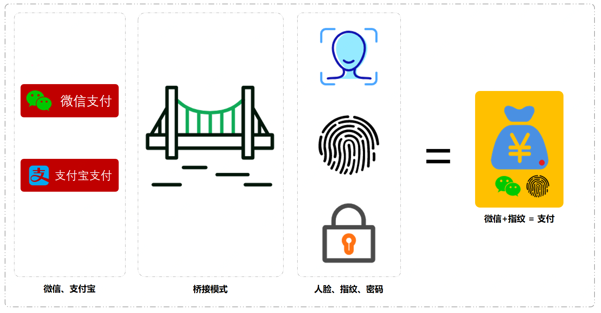
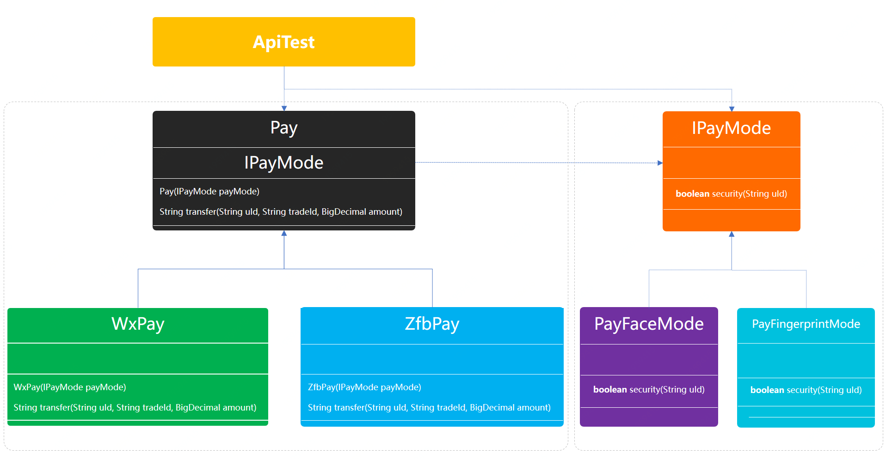

> 本文章仅用于本人学习笔记记录
> 微信：wxid_ygj58saenbjh22（如本文档内容侵权了您的权益，请您通过微信联系到我）

## 桥接模式介绍

桥接模式的主要作用就是通过将抽象部分与实现部分分离，把多种可匹配的使用进行组合。说白了核心实现也就是在A类中含有B类接口，通过构造函数传递B类的实现，这个B类就是设计的桥。

那么这样的桥接模式，在我们平常的开发中有哪些场景

JDBC多种驱动程序的实现、同品牌类型的台式机和笔记本平板、业务实现中的多类接口同组过滤服务等。这些场景都比较适合使用桥接模式进行实现，因为在一些组合中如果有如果每一个类都实现不同的服务可能会出现笛卡尔积，而使用桥接模式就可以非常简单。

## 简单例子



随着市场的竞争在支付服务行业出现了微信和支付宝还包括一些其他支付服务，但是对于商家来说并不希望改变用户习惯。就像如果我的地摊只能使用微信或者只能使用支付宝付款，那么就会让我顾客伤心，鸡蛋灌饼也卖不动了。

在这个时候就出现了第三方平台，把市面上综合占据市场90%以上的支付服务都集中到自己平台中，再把这样的平台提供给店铺、超市、地摊使用，同时支持人脸、扫描、密码多种方式。

我们这个案例就模拟一个这样的第三方平台来承接各个支付能力，同时使用自家的人脸让用户支付起来更加容易。那么这里就出现了多支付与多模式的融合使用，如果给每一个支付都实现一次不同的模式，即使是继承类也需要开发好多。而且随着后面接入了更多的支付服务或者支付方式，就会呈爆炸似的扩展。

## 用一坨坨代码实现

### 工程结构

```
itstack-demo-design-7-01
└── src
    └── main
        └── java
            └── org.itstack.demo.design
                └── PayController.java

```

### 代码实现

```
public class PayController {

    private Logger logger = LoggerFactory.getLogger(PayController.class);

    public boolean doPay(String uId, String tradeId, BigDecimal amount, int channelType, int modeType) {
        // 微信支付
        if (1 == channelType) {
            logger.info("模拟微信渠道支付划账开始。uId：{} tradeId：{} amount：{}", uId, tradeId, amount);
            if (1 == modeType) {
                logger.info("密码支付，风控校验环境安全");
            } else if (2 == modeType) {
                logger.info("人脸支付，风控校验脸部识别");
            } else if (3 == modeType) {
                logger.info("指纹支付，风控校验指纹信息");
            }
        }
        // 支付宝支付
        else if (2 == channelType) {
            logger.info("模拟支付宝渠道支付划账开始。uId：{} tradeId：{} amount：{}", uId, tradeId, amount);
            if (1 == modeType) {
                logger.info("密码支付，风控校验环境安全");
            } else if (2 == modeType) {
                logger.info("人脸支付，风控校验脸部识别");
            } else if (3 == modeType) {
                logger.info("指纹支付，风控校验指纹信息");
            }
        }
        return true;
    }

}

```

## 桥接模式重构代码

从上面的ifelse方式实现来看，这是两种不同类型的相互组合。那么就可以把支付方式和支付模式进行分离通过抽象类依赖实现类的方式进行桥接，通过这样的拆分后支付与模式其实是可以单独使用的，当需要组合时候只需要把模式传递给支付即可。

桥接模式的关键是选择的桥接点拆分，是否可以找到这样类似的相互组合，如果没有就不必要非得使用桥接模式。

### 工程结构

```
itstack-demo-design-7-02
└── src
    ├── main
    │   └── java
    │       └── org.itstack.demo.design.pay
    │           ├── channel
    │           │   ├── Pay.java
    │           │   ├── WxPay.java
    │           │   └── ZfbPay.java
    │           └── mode
    │               ├── IPayMode.java
    │               ├── PayCypher.java
    │               ├── PayFaceMode.java
    │               └── PayFingerprintMode.java
    └── test
         └── java
             └── org.itstack.demo.design.test
                 └── ApiTest.java

```

桥接模式模型结构



- 左侧Pay是一个抽象类，往下是它的两个支付类型实现；微信支付、支付宝支付。
- 右侧IPayMode是一个接口，往下是它的两个支付模型；刷脸支付、指纹支付。
- 那么，支付类型 × 支付模型 = 就可以得到相应的组合。

### 代码实现

#### 支付类型桥接抽象类

```
public abstract class Pay {

    protected Logger logger = LoggerFactory.getLogger(Pay.class);

    protected IPayMode payMode;

    public Pay(IPayMode payMode) {
        this.payMode = payMode;
    }

    public abstract String transfer(String uId, String tradeId, BigDecimal amount);

}

```

在这个类中定义了支付方式的需要实现的划账接口：transfer，以及桥接接口；IPayMode，并在构造函数中用户方自行选择支付方式。

#### 微信支付的实现

```
public class WxPay extends Pay {

    public WxPay(IPayMode payMode) {
        super(payMode);
    }

    public String transfer(String uId, String tradeId, BigDecimal amount) {
        logger.info("模拟微信渠道支付划账开始。uId：{} tradeId：{} amount：{}", uId, tradeId, amount);
        boolean security = payMode.security(uId);
        logger.info("模拟微信渠道支付风控校验。uId：{} tradeId：{} security：{}", uId, tradeId, security);
        if (!security) {
            logger.info("模拟微信渠道支付划账拦截。uId：{} tradeId：{} amount：{}", uId, tradeId, amount);
            return "0001";
        }
        logger.info("模拟微信渠道支付划账成功。uId：{} tradeId：{} amount：{}", uId, tradeId, amount);
        return "0000";
    }

}

```

#### 支付宝支付

```
public class ZfbPay extends Pay {

    public ZfbPay(IPayMode payMode) {
        super(payMode);
    }

    public String transfer(String uId, String tradeId, BigDecimal amount) {
        logger.info("模拟支付宝渠道支付划账开始。uId：{} tradeId：{} amount：{}", uId, tradeId, amount);
        boolean security = payMode.security(uId);
        logger.info("模拟支付宝渠道支付风控校验。uId：{} tradeId：{} security：{}", uId, tradeId, security);
        if (!security) {
            logger.info("模拟支付宝渠道支付划账拦截。uId：{} tradeId：{} amount：{}", uId, tradeId, amount);
            return "0001";
        }
        logger.info("模拟支付宝渠道支付划账成功。uId：{} tradeId：{} amount：{}", uId, tradeId, amount);
        return "0000";
    }

}

```

另外可以看到在支付的时候分别都调用了风控的接口进行验证，也就是不同模式的支付(刷脸、指纹)，都需要过指定的风控，才能保证支付安全。

#### 定义支付模式接口

```
public interface IPayMode {

    boolean security(String uId);

}

```

任何一个支付模式；刷脸、指纹、密码，都会过不同程度的安全风控，这里定义一个安全校验接口。

#### 刷脸

```
public class PayFaceMode implements IPayMode{

    protected Logger logger = LoggerFactory.getLogger(PayCypher.class);

    public boolean security(String uId) {
        logger.info("人脸支付，风控校验脸部识别");
        return true;
    }

}

```

#### 指纹

```
public class PayFingerprintMode implements IPayMode{

    protected Logger logger = LoggerFactory.getLogger(PayCypher.class);

    public boolean security(String uId) {
        logger.info("指纹支付，风控校验指纹信息");
        return true;
    }

}

```

#### 密码

```
public class PayCypher implements IPayMode{

    protected Logger logger = LoggerFactory.getLogger(PayCypher.class);

    public boolean security(String uId) {
        logger.info("密码支付，风控校验环境安全");
        return true;
    }

}

```

在这里实现了三种支付模式(刷脸、指纹、密码)的风控校验，在用户选择不同支付类型的时候，则会进行相应的风控拦截以此保障支付安全。

#### 测试验证

```
@Test
public void test_pay() {
    System.out.println("\r\n模拟测试场景；微信支付、人脸方式。");
    Pay wxPay = new WxPay(new PayFaceMode());
    wxPay.transfer("weixin_1092033111", "100000109893", new BigDecimal(100));

    System.out.println("\r\n模拟测试场景；支付宝支付、指纹方式。");
    Pay zfbPay = new ZfbPay(new PayFingerprintMode());
    zfbPay.transfer("jlu19dlxo111","100000109894",new BigDecimal(100));
}

```

目前以上优化主要针对桥接模式的使用进行重构if逻辑部分，关于调用部分可以使用抽象工厂或策略模式配合map结构，将服务配置化。

## 总结

- 通过模拟微信与支付宝两个支付渠道在不同的支付模式下，刷脸、指纹、密码，的组合从而体现了桥接模式的在这类场景中的合理运用。简化了代码的开发，给后续的需求迭代增加了很好的扩展性。
- 从桥接模式的实现形式来看满足了单一职责和开闭原则，让每一部分内容都很清晰易于维护和拓展，但如果我们是实现的高内聚的代码，那么就会很复杂。所以在选择重构代码的时候，需要考虑好整体的设计，否则选不到合理的设计模式，将会让代码变得难以开发。

- 桥接模式的主要作用就是通过将抽象部分与实现部分分离，把多种可匹配的使用进行组合。说白了核心实现也就是在A类中含有B类接口，通过构造函数传递B类的实现，这个B类就是设计的桥。