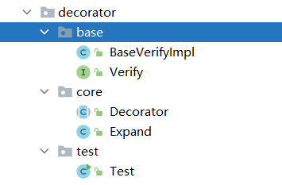

> 本文章仅用于本人学习笔记记录
> 微信：wxid_ygj58saenbjh22（如本文档内容侵权了您的权益，请您通过微信联系到我）

## 装饰器模式介绍

装饰器的核心就是在不改原有类的基础上给类新增功能。不改变原有类，可能会想到继承、AOP切面，当然这些方式都可以实现，但是使用装饰器模式会是另外一种思路更为灵活，可以避免继承导致的子类过多，也可以避免AOP带来的复杂性。、

new BufferedReader(new FileReader(""));，这段代码你是否熟悉，开发到字节流、字符流、文件流的内容时都见到了这样的代码，一层嵌套一层，一层嵌套一层，字节流转字符流等等，而这样方式的使用就是装饰器模式的一种体现。

## 简单例子


在本案例中我们模拟一个单点登录功能扩充的场景

一般在业务开发的初期，往往内部的ERP使用只需要判断账户验证即可，验证通过后即可访问ERP的所有资源。但随着业务的不断发展，团队里开始出现专门的运营人员、营销人员、数据人员，每个人员对于ERP的使用需求不同，有些需要创建活动，有些只是查看数据。同时为了保证数据的安全性，不会让每个用户都有最高的权限。

那么以往使用的SSO是一个组件化通用的服务，不能在里面添加需要的用户访问验证功能。这个时候我们就可以使用装饰器模式，扩充原有的单点登录服务。但同时也保证原有功能不受破坏，可以继续使用。

### 场景模拟工程

```
itstack-demo-design-9-00
└── src
    └── main
        └── java
            └── org.itstack.demo.design
                ├── HandlerInterceptor.java
                └── SsoInterceptor.java

```

这里模拟的是spring中的类：HandlerInterceptor，实现接口功能SsoInterceptor模拟的单点登录拦截服务。

### 场景简述

#### 模拟Spring的HandlerInterceptor

```
public interface HandlerInterceptor {

    boolean preHandle(String request, String response, Object handler);

}

```

实际的单点登录开发会基于；org.springframework.web.servlet.HandlerInterceptor 实现。

#### 模拟单点登录功能

```
public class SsoInterceptor implements HandlerInterceptor{

    public boolean preHandle(String request, String response, Object handler) {
        // 模拟获取cookie
        String ticket = request.substring(1, 8);
        // 模拟校验
        return ticket.equals("success");
    }

}

```

## 用一坨坨代码实现

继承类的实现方式也是一个比较通用的方式，通过继承后重写方法，并发将自己的逻辑覆盖进去。如果是一些简单的场景且不需要不断维护和扩展的，此类实现并不会有什么，也不会导致子类过多。

### 工程结构

```
itstack-demo-design-9-01
└── src
    └── main
        └── java
            └── org.itstack.demo.design
                └── LoginSsoDecorator.java

```

以上工程结构非常简单，只是通过 LoginSsoDecorator 继承 SsoInterceptor，重写方法功能。

### 代码实现

```
public class LoginSsoDecorator extends SsoInterceptor {

    private static Map<String, String> authMap = new ConcurrentHashMap<String, String>();

    static {
        authMap.put("huahua", "queryUserInfo");
        authMap.put("doudou", "queryUserInfo");
    }

    @Override
    public boolean preHandle(String request, String response, Object handler) {
        // 模拟获取cookie
        String ticket = request.substring(1, 8);
        // 模拟校验
        boolean success = ticket.equals("success");

        if (!success) return false;

        String userId = request.substring(9);
        String method = authMap.get(userId);

        // 模拟方法校验
        return "queryUserInfo".equals(method);
    }

}

```

以上这部分通过继承重写方法，将个人可访问哪些方法的功能添加到方法中。

### 测试验证

```
@Test
public void test_LoginSsoDecorator() {
    LoginSsoDecorator ssoDecorator = new LoginSsoDecorator();
    String request = "1successhuahua";
    boolean success = ssoDecorator.preHandle(request, "ewcdqwt40liuiu", "t");
    System.out.println("登录校验：" + request + (success ? " 放行" : " 拦截"));
}

```

## 装饰器模式重构代码

装饰器主要解决的是直接继承下因功能的不断横向扩展导致子类膨胀的问题，而是用装饰器模式后就会比直接继承显得更加灵活同时这样也就不再需要考虑子类的维护。

在装饰器模式中有四个比较重要点抽象出来的点；

- 抽象构件角色(Component) - 定义抽象接口
- 具体构件角色(ConcreteComponent) - 实现抽象接口，可以是一组
- 装饰角色(Decorator) - 定义抽象类并继承接口中的方法，保证一致性
- 具体装饰角色(ConcreteDecorator) - 扩展装饰具体的实现逻辑

通过以上这四项来实现装饰器模式，主要核心内容会体现在抽象类的定义和实现上。

### 工程结构

```
itstack-demo-design-9-02
└── src
    └── main
        └── java
            └── org.itstack.demo.design
                ├── LoginSsoDecorator.java
                └── SsoDecorator.java

```

装饰器模式模型结构


以上是一个装饰器实现的类图结构，重点的类是SsoDecorator，这个类是一个抽象类主要完成了对接口HandlerInterceptor继承。

当装饰角色继承接口后会提供构造函数，入参就是继承的接口实现类即可，这样就可以很方便的扩展出不同功能组件。

### 代码实现

#### 抽象类装饰角色

```
public abstract class SsoDecorator implements HandlerInterceptor {

    private HandlerInterceptor handlerInterceptor;

    private SsoDecorator(){}

    public SsoDecorator(HandlerInterceptor handlerInterceptor) {
        this.handlerInterceptor = handlerInterceptor;
    }

    public boolean preHandle(String request, String response, Object handler) {
        return handlerInterceptor.preHandle(request, response, handler);
    }

}

```

在装饰类中有两个重点的地方是；1)继承了处理接口、2)提供了构造函数、3)覆盖了方法preHandle。

以上三个点是装饰器模式的核心处理部分，这样可以踢掉对子类继承的方式实现逻辑功能扩展。

#### 装饰角色逻辑实现

```
public class LoginSsoDecorator extends SsoDecorator {

    private Logger logger = LoggerFactory.getLogger(LoginSsoDecorator.class);

    private static Map<String, String> authMap = new ConcurrentHashMap<String, String>();

    static {
        authMap.put("huahua", "queryUserInfo");
        authMap.put("doudou", "queryUserInfo");
    }

    public LoginSsoDecorator(HandlerInterceptor handlerInterceptor) {
        super(handlerInterceptor);
    }

    @Override
    public boolean preHandle(String request, String response, Object handler) {
        boolean success = super.preHandle(request, response, handler);
        if (!success) return false;
        String userId = request.substring(8);
        String method = authMap.get(userId);
        logger.info("模拟单点登录方法访问拦截校验：{} {}", userId, method);
        // 模拟方法校验
        return "queryUserInfo".equals(method);
    }
}

```

在具体的装饰类实现中，继承了装饰类SsoDecorator，那么现在就可以扩展方法；preHandle

在preHandle的实现中可以看到，这里只关心扩展部分的功能，同时不会影响原有类的核心服务，也不会因为使用继承方式而导致的多余子类，增加了整体的灵活性。

### 测试验证

```
@Test
public void test_LoginSsoDecorator() {
    LoginSsoDecorator ssoDecorator = new LoginSsoDecorator(new SsoInterceptor());
    String request = "1successhuahua";
    boolean success = ssoDecorator.preHandle(request, "ewcdqwt40liuiu", "t");
    System.out.println("登录校验：" + request + (success ? " 放行" : " 拦截"));
}

```

这里测试了对装饰器模式的使用，通过透传原有单点登录类new SsoInterceptor()，传递给装饰器，让装饰器可以执行扩充的功能。

同时对于传递者和装饰器都可以是多组的，在一些实际的业务开发中，往往也是由于太多类型的子类实现而导致不易于维护，从而使用装饰器模式替代。

## 简单例子

### 结构图



### 代码

```
public interface Verify {
    /**
     * 验证接口
     */
    boolean verify(String userId, String code, LocalDate localDate);
}
```

```
public class BaseVerifyImpl implements Verify{
    /**
     * admin验证
     */
    @Override
    public boolean verify(String userId, String code, LocalDate localDate) {
        return "admin".equals(userId) || "add".equals(code) ? true : false;
    }
}
```

重点看Decorator类和Expand类

```
public abstract class Decorator implements Verify {
    private Verify verify;

    public Decorator(Verify verify) {
        this.verify = verify;
    }

    @Override
    public boolean verify(String userId, String code, LocalDate localDate) {
        return verify.verify(userId, code, localDate);
    }
}
```

```
public class Expand extends Decorator{

    public Expand(Verify verify) {
        super(verify);
    }

    /**
     * admin检验,并且时间校验
     */
    @Override
    public boolean verify(String userId, String code, LocalDate localDate) {
        if (super.verify(userId, code, localDate)) {
            return !LocalDate.now().isBefore(localDate) ? true : false;
        }
        return false;
    }
}
```

```
public class Test {
    public static void main(String[] args) {
        Expand expand = new Expand(new BaseVerifyImpl());
        System.out.println(expand.verify("admin", "add", LocalDate.now()));
    }
}
```

## 总结

- 使用装饰器模式满足单一职责原则，你可以在自己的装饰类中完成功能逻辑的扩展，而不影响主类，同时可以按需在运行时添加和删除这部分逻辑。另外装饰器模式与继承父类重写方法，在某些时候需要按需选择，并不一定某一个就是最好。
- 装饰器实现的重点是对抽象类继承接口方式的使用，同时设定被继承的接口可以通过构造函数传递其实现类，由此增加扩展性并重写方法里可以实现此部分父类实现的功能。

- 就像夏天热你穿短裤，冬天冷你穿棉裤，雨天挨浇你穿雨衣一样，你的根本本身没有被改变，而你的需求却被不同的装饰而实现。
- 装饰器的核心就是在不改原有类的基础上给类新增功能。例如new BufferedReader(new FileReader(""))。