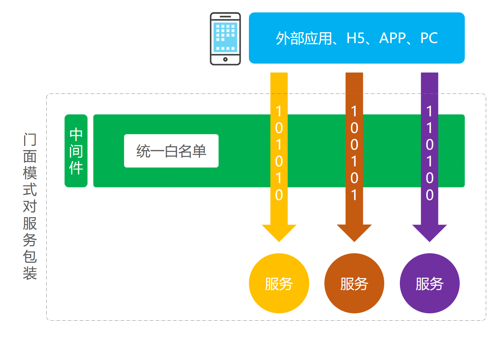
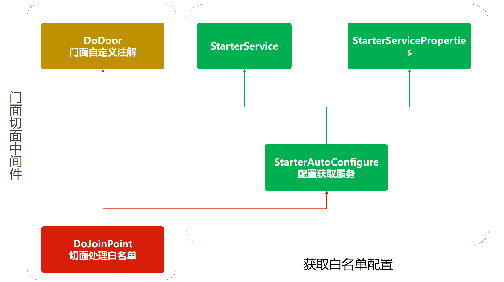

> 本文章仅用于本人学习笔记记录
> 微信：wxid_ygj58saenbjh22（如本文档内容侵权了您的权益，请您通过微信联系到我）

## 外观模式介绍

外观模式也叫门面模式，主要解决的是降低调用方的使用接口的复杂逻辑组合。这样调用方与实际的接口提供方提供方提供了一个中间层，用于包装逻辑提供API接口。有些时候外观模式也被用在中间件层，对服务中的通用性复杂逻辑进行中间件层包装，让使用方可以只关心业务开发。

那么这样的模式在我们的所见产品功能中也经常遇到，就像几年前我们注册一个网站时候往往要添加很多信息，包括；姓名、昵称、手机号、QQ、邮箱、住址、单身等等，但现在注册成为一个网站的用户只需要一步即可，无论是手机号还是微信也都提供了这样的登录服务。而对于服务端应用开发来说以前是提供了一个整套的接口，现在注册的时候并没有这些信息，那么服务端就需要进行接口包装，在前端调用注册的时候服务端获取相应的用户信息(从各个渠道)，如果获取不到会让用户后续进行补全(营销补全信息给奖励)，以此来拉动用户的注册量和活跃度。

## 简单例子



在本案例中我们模拟一个将所有服务接口添加白名单的场景

### 场景模拟工程

```
itstack-demo-design-10-00
└── src
    ├── main
    │   ├── java
    │   │   └── org.itstack.demo.design
    │   │       ├── domain
    │   │       │	└── UserInfo.java
    │   │       ├── web	
    │   │       │	└── HelloWorldController.java
    │   │       └── HelloWorldApplication.java
    │   └── resources	
    │       └── application.yml	
    └── test
        └── java
            └── org.itstack.demo.test
                └── ApiTest.java

```

### 场景简述

#### 定义基础查询接口

```
@RestController
public class HelloWorldController {

    @Value("${server.port}")
    private int port;

    /**
     * key：需要从入参取值的属性字段，如果是对象则从对象中取值，如果是单个值则直接使用
     * returnJson：预设拦截时返回值，是返回对象的Json
     *
     * http://localhost:8080/api/queryUserInfo?userId=1001
     * http://localhost:8080/api/queryUserInfo?userId=小团团
     */
    @RequestMapping(path = "/api/queryUserInfo", method = RequestMethod.GET)
    public UserInfo queryUserInfo(@RequestParam String userId) {
        return new UserInfo("虫虫:" + userId, 19, "天津市南开区旮旯胡同100号");
    }

}

```

这里提供了一个基本的查询服务，通过入参userId，查询用户信息。后续就需要在这里扩展白名单，只有指定用户才可以查询，其他用户不能查询。

#### 设置Application启动类

```
@SpringBootApplication
@Configuration
public class HelloWorldApplication {

    public static void main(String[] args) {
        SpringApplication.run(HelloWorldApplication.class, args);
    }

}

```

## 用一坨坨代码实现

```
public class HelloWorldController {

    public UserInfo queryUserInfo(@RequestParam String userId) {

        // 做白名单拦截
        List<String> userList = new ArrayList<String>();
        userList.add("1001");
        userList.add("aaaa");
        userList.add("ccc");
        if (!userList.contains(userId)) {
            return new UserInfo("1111", "非白名单可访问用户拦截！");
        }

        return new UserInfo("虫虫:" + userId, 19, "天津市南开区旮旯胡同100号");
    }

}

```

## 外观模式重构代码

这次重构的核心是使用外观模式也可以说门面模式，结合SpringBoot中的自定义starter中间件开发的方式，统一处理所有需要白名单的地方。

后续接下来的实现中，会涉及的知识:

- SpringBoot的starter中间件开发方式。
- 面向切面编程和自定义注解的使用。
- 外部自定义配置信息的透传，SpringBoot与Spring不同，对于此类方式获取白名单配置存在差异。

### 工程结构

```
itstack-demo-design-10-02
└── src
    ├── main
    │   ├── java
    │   │   └── org.itstack.demo.design.door
    │   │       ├── annotation
    │   │       │	└── DoDoor.java	
    │   │       ├── config
    │   │       │	├── StarterAutoConfigure.java
    │   │       │	├── StarterService.java
    │   │       │	└── StarterServiceProperties.java
    │   │       └── DoJoinPoint.java
    │   └── resources	
    │       └── META_INF
    │           └── spring.factories
    └── test
        └── java
            └── org.itstack.demo.test
                └── ApiTest.java

```

门面模式模型结构



- 以上是外观模式的中间件实现思路，右侧是为了获取配置文件，左侧是对于切面的处理。
- 门面模式可以是对接口的包装提供出接口服务，也可以是对逻辑的包装通过自定义注解对接口提供服务能力。

### 代码实现

#### 配置服务类

```
public class StarterService {

    private String userStr;

    public StarterService(String userStr) {
        this.userStr = userStr;
    }

    public String[] split(String separatorChar) {
        return StringUtils.split(this.userStr, separatorChar);
    }

}

```

#### 配置类注解定义

```
@ConfigurationProperties("itstack.door")
public class StarterServiceProperties {

    private String userStr;

    public String getUserStr() {
        return userStr;
    }

    public void setUserStr(String userStr) {
        this.userStr = userStr;
    }

}

```

用于定义好后续在 application.yml 中添加 itstack.door 的配置信息。

#### 自定义配置类信息获取

```
@Configuration
@ConditionalOnClass(StarterService.class)
@EnableConfigurationProperties(StarterServiceProperties.class)
public class StarterAutoConfigure {

    @Autowired
    private StarterServiceProperties properties;

    @Bean
    @ConditionalOnMissingBean
    @ConditionalOnProperty(prefix = "itstack.door", value = "enabled", havingValue = "true")
    StarterService starterService() {
        return new StarterService(properties.getUserStr());
    }

}

```

以上代码是对配置的获取操作，主要是对注解的定义；@Configuration、@ConditionalOnClass、@EnableConfigurationProperties，这一部分主要是与SpringBoot的结合使用。

#### 切面注解定义

```
@Retention(RetentionPolicy.RUNTIME)
@Target(ElementType.METHOD)
public @interface DoDoor {

    String key() default "";

    String returnJson() default "";

}

```

- 定义了外观模式门面注解，后续就是此注解添加到需要扩展白名单的方法上。
- 这里提供了两个入参，key：获取某个字段例如用户ID、returnJson：确定白名单拦截后返回的具体内容。

#### 白名单切面逻辑

```
@Aspect
@Component
public class DoJoinPoint {

    private Logger logger = LoggerFactory.getLogger(DoJoinPoint.class);

    @Autowired
    private StarterService starterService;

    @Pointcut("@annotation(org.itstack.demo.design.door.annotation.DoDoor)")
    public void aopPoint() {
    }

    @Around("aopPoint()")
    public Object doRouter(ProceedingJoinPoint jp) throws Throwable {
        //获取内容
        Method method = getMethod(jp);
        DoDoor door = method.getAnnotation(DoDoor.class);
        //获取字段值
        String keyValue = getFiledValue(door.key(), jp.getArgs());
        logger.info("itstack door handler method：{} value：{}", method.getName(), keyValue);
        if (null == keyValue || "".equals(keyValue)) return jp.proceed();
        //配置内容
        String[] split = starterService.split(",");
        //白名单过滤
        for (String str : split) {
            if (keyValue.equals(str)) {
                return jp.proceed();
            }
        }
        //拦截
        return returnObject(door, method);
    }

    private Method getMethod(JoinPoint jp) throws NoSuchMethodException {
        Signature sig = jp.getSignature();
        MethodSignature methodSignature = (MethodSignature) sig;
        return getClass(jp).getMethod(methodSignature.getName(), methodSignature.getParameterTypes());
    }

    private Class<? extends Object> getClass(JoinPoint jp) throws NoSuchMethodException {
        return jp.getTarget().getClass();
    }

    //返回对象
    private Object returnObject(DoDoor doGate, Method method) throws IllegalAccessException, InstantiationException {
        Class<?> returnType = method.getReturnType();
        String returnJson = doGate.returnJson();
        if ("".equals(returnJson)) {
            return returnType.newInstance();
        }
        return JSON.parseObject(returnJson, returnType);
    }

    //获取属性值
    private String getFiledValue(String filed, Object[] args) {
        String filedValue = null;
        for (Object arg : args) {
            try {
                if (null == filedValue || "".equals(filedValue)) {
                    filedValue = BeanUtils.getProperty(arg, filed);
                } else {
                    break;
                }
            } catch (Exception e) {
                if (args.length == 1) {
                    return args[0].toString();
                }
            }
        }
        return filedValue;
    }

}

```

这里包括的内容较多，核心逻辑主要是；Object doRouter(ProceedingJoinPoint jp)，接下来我们分别介绍:

- @Pointcut(“@annotation(org.itstack.demo.design.door.annotation.DoDoor)”)

    定义切面，这里采用的是注解路径，也就是所有的加入这个注解的方法都会被切面进行管理。

- getFiledValue

    获取指定key也就是获取入参中的某个属性，这里主要是获取用户ID，通过ID进行拦截校验。

- returnObject

    返回拦截后的转换对象，也就是说当非白名单用户访问时则返回一些提示信息。

- doRouter

    切面核心逻辑，这一部分主要是判断当前访问的用户ID是否白名单用户，如果是则放行jp.proceed();，否则返回自定义的拦截提示信息。

### 测试验证

#### 引入中间件POM配置

```
<dependency>
    <groupId>org.springframework.boot</groupId>
    <artifactId>itstack-demo-design-10-02</artifactId>
</dependency>

```

#### 配置application.yml

```
# 自定义中间件配置
itstack:
  door:
    enabled: true
    userStr: 1001,aaaa,ccc #白名单用户ID，多个逗号隔开

```

#### 在Controller中添加自定义注解

```
/**
 * http://localhost:8080/api/queryUserInfo?userId=1001
 * http://localhost:8080/api/queryUserInfo?userId=小团团
 */
@DoDoor(key = "userId", returnJson = "{\"code\":\"1111\",\"info\":\"非白名单可访问用户拦截！\"}")
@RequestMapping(path = "/api/queryUserInfo", method = RequestMethod.GET)
public UserInfo queryUserInfo(@RequestParam String userId) {
    return new UserInfo("虫虫:" + userId, 19, "天津市南开区旮旯胡同100号");
}

```


- 这里核心的内容主要是自定义的注解的添加@DoDoor，也就是我们的外观模式中间件化实现。
- key：需要从入参取值的属性字段，如果是对象则从对象中取值，如果是单个值则直接使用。
- returnJson：预设拦截时返回值，是返回对象的Json。


## 简单切面注解例子

```
import java.lang.annotation.ElementType;
import java.lang.annotation.Retention;
import java.lang.annotation.RetentionPolicy;
import java.lang.annotation.Target;

@Retention(RetentionPolicy.RUNTIME)
@Target(ElementType.METHOD)
public @interface Log {
}
```

```
@Aspect
@Component
public class LogJoinPoint {
    private Logger logger = LoggerFactory.getLogger(LogJoinPoint.class);

    @Pointcut("@annotation(design.outward.annotation.Log)")
    public void aopPoint() {
    }

    @Around("aopPoint()")
    public Object doRouter(ProceedingJoinPoint jp) throws Throwable {
        //获取内容
        Method method = getMethod(jp);
        Log log = method.getAnnotation(Log.class);
        String simpleName = getClass(jp).getSimpleName();
        JSONObject fieldValue = getFieldValue(method, jp);
        logger.info("当前时间[{}]，调用[{}]类的[{}]方法，参数为：[{}]", DateTimeFormatter.ofPattern("yyyy-MM-dd HH:mm:ss").format(LocalDateTime.now()), simpleName, method.getName(), fieldValue.toJSONString());
        return jp.proceed();
    }

    private JSONObject getFieldValue(Method method, ProceedingJoinPoint jp) {
        JSONObject filedValue = new JSONObject();
        Parameter[] parameters = method.getParameters();
        for (int i = 0; i < parameters.length; i++) {
            filedValue.put(parameters[i].getName(), jp.getArgs()[i]);
        }
        return filedValue;
    }

    private Method getMethod(JoinPoint jp) throws NoSuchMethodException {
        Signature sig = jp.getSignature();
        MethodSignature methodSignature = (MethodSignature) sig;
        return getClass(jp).getMethod(methodSignature.getName(), methodSignature.getParameterTypes());
    }

    private Class<? extends Object> getClass(JoinPoint jp) throws NoSuchMethodException {
        return jp.getTarget().getClass();
    }
}
```

## 总结

- 以上我们通过中间件的方式实现外观模式，这样的设计可以很好的增强代码的隔离性，以及复用性，不仅使用上非常灵活也降低了每一个系统都开发这样的服务带来的风险。
- 外观模式也叫门面模式，主要解决的是降低调用方的使用接口的复杂逻辑组合。这样调用方与实际的接口提供方提供方提供了一个中间层，用于包装逻辑提供API接口。有些时候外观模式也被用在中间件层，对服务中的通用性复杂逻辑进行中间件层包装，让使用方可以只关心业务开发。
