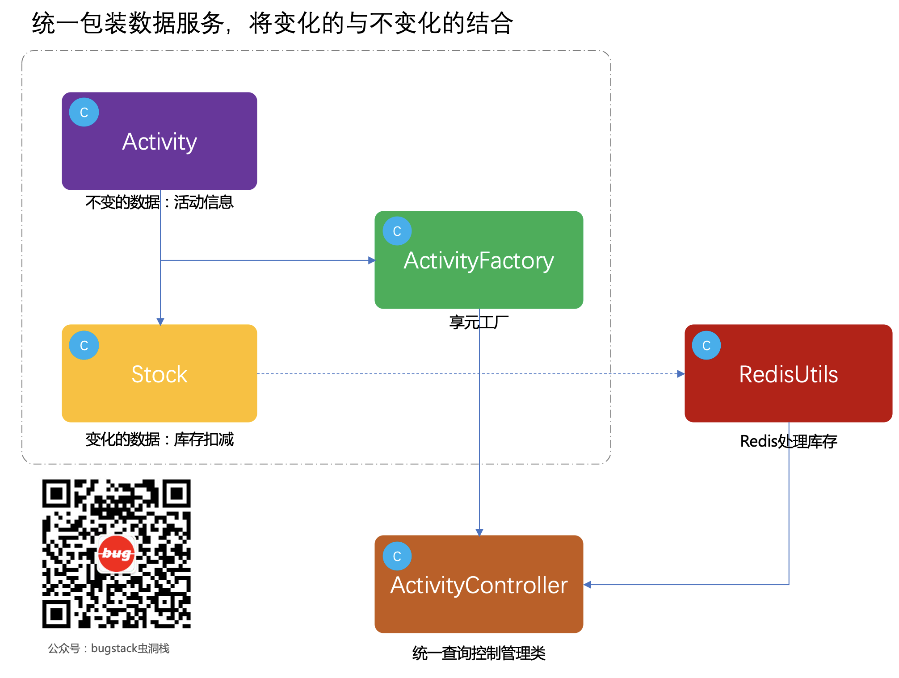

> 本文章仅用于本人学习笔记记录
> 微信：wxid_ygj58saenbjh22（如本文档内容侵权了您的权益，请您通过微信联系到我）

## 享元模式介绍

享元模式，主要在于共享通用对象，减少内存的使用，提升系统的访问效率。而这部分共享对象通常比较耗费内存或者需要查询大量接口或者使用数据库资源，因此统一抽离作为共享对象使用。

另外享元模式可以分为在服务端和客户端，一般互联网H5和Web场景下大部分数据都需要服务端进行处理，比如数据库连接池的使用、多线程线程池的使用，除了这些功能外，还有些需要服务端进行包装后的处理下发给客户端，因为服务端需要做享元处理。但在一些游戏场景下，很多都是客户端需要进行渲染地图效果，比如；树木、花草、鱼虫，通过设置不同元素描述使用享元公用对象，减少内存的占用，让客户端的游戏更加流畅。

在享元模型的实现中需要使用到享元工厂来进行管理这部分独立的对象和共享的对象，避免出现线程安全的问题。

## 简单例子

模拟在商品秒杀场景下使用享元模式查询优化

你是否经历过一个商品下单的项目从最初的日均十几单到一个月后每个时段秒杀量破十万的项目。一般在最初如果没有经验的情况下可能会使用数据库行级锁的方式下保证商品库存的扣减操作，但是随着业务的快速发展秒杀的用户越来越多，这个时候数据库已经扛不住了，一般都会使用redis的分布式锁来控制商品库存。

同时在查询的时候也不需要每一次对不同的活动查询都从库中获取，因为这里除了库存以外其他的活动商品信息都是固定不变的，以此这里一般大家会缓存到内存中。

这里我们模拟使用享元模式工厂结构，提供活动商品的查询。活动商品相当于不变的信息，而库存部分属于变化的信息。

## 用一坨坨代码实现

### 工程结构

```
itstack-demo-design-11-01
└── src
    └── main
        └── java
            └── org.itstack.demo.design
                └── ActivityController.java

```

### 代码实现

```
public class ActivityController {

    public Activity queryActivityInfo(Long id) {
        // 模拟从实际业务应用从接口中获取活动信息
        Activity activity = new Activity();
        activity.setId(10001L);
        activity.setName("图书嗨乐");
        activity.setDesc("图书优惠券分享激励分享活动第二期");
        activity.setStartTime(new Date());
        activity.setStopTime(new Date());
        activity.setStock(new Stock(1000,1));
        return activity;
    }

}
```

这里模拟的是从接口中查询活动信息，基本也就是从数据库中获取所有的商品信息和库存。有点像最开始写的商品销售系统，数据库就可以抗住购物量。

## 享元模式重构代码

享元模式一般情况下使用此结构在平时的开发中并不太多，除了一些线程池、数据库连接池外，再就是游戏场景下的场景渲染。另外这个设计的模式思想是减少内存的使用提升效率，与我们之前使用的原型模式通过克隆对象的方式生成复杂对象，减少rpc的调用，都是此类思想。

### 工程结构

```
itstack-demo-design-11-02
└── src
    ├── main
    │   └── java
    │       └── org.itstack.demo.design
    │           ├── util
    │           │	└── RedisUtils.java	
    │           ├── Activity.java
    │           ├── ActivityController.java
    │           ├── ActivityFactory.java
    │           └── Stock.java
    └── test
        └── java
            └── org.itstack.demo.test
                └── ApiTest.java

```

享元模式模型结构



### 代码实现

#### 活动信息

```
public class Activity {

    private Long id;        // 活动ID
    private String name;    // 活动名称
    private String desc;    // 活动描述
    private Date startTime; // 开始时间
    private Date stopTime;  // 结束时间
    private Stock stock;    // 活动库存
    
    // ...get/set
}
```

#### 库存信息

```
public class Stock {

    private int total; // 库存总量
    private int used;  // 库存已用
    
    // ...get/set
}

```

#### 享元工厂

```
public class ActivityFactory {

    static Map<Long, Activity> activityMap = new HashMap<Long, Activity>();

    public static Activity getActivity(Long id) {
        Activity activity = activityMap.get(id);
        if (null == activity) {
            // 模拟从实际业务应用从接口中获取活动信息
            activity = new Activity();
            activity.setId(10001L);
            activity.setName("图书嗨乐");
            activity.setDesc("图书优惠券分享激励分享活动第二期");
            activity.setStartTime(new Date());
            activity.setStopTime(new Date());
            activityMap.put(id, activity);
        }
        return activity;
    }

}
```

这里提供的是一个享元工厂🏭，通过map结构存放已经从库表或者接口中查询到的数据，存放到内存中，用于下次可以直接获取。

#### 模拟Redis类

```
public class RedisUtils {

    private ScheduledExecutorService scheduledExecutorService = Executors.newScheduledThreadPool(1);

    private AtomicInteger stock = new AtomicInteger(0);

    public RedisUtils() {
        scheduledExecutorService.scheduleAtFixedRate(() -> {
            // 模拟库存消耗
            stock.addAndGet(1);
        }, 0, 100000, TimeUnit.MICROSECONDS);

    }

    public int getStockUsed() {
        return stock.get();
    }

}
```

这里处理模拟redis的操作工具类外，还提供了一个定时任务用于模拟库存的使用，这样方面我们在测试的时候可以观察到库存的变化。

#### 活动控制类

```
public class ActivityController {

    private RedisUtils redisUtils = new RedisUtils();

    public Activity queryActivityInfo(Long id) {
        Activity activity = ActivityFactory.getActivity(id);
        // 模拟从Redis中获取库存变化信息
        Stock stock = new Stock(1000, redisUtils.getStockUsed());
        activity.setStock(stock);
        return activity;
    }

}
```

- 在活动控制类中使用了享元工厂获取活动信息，查询后将库存信息在补充上。因为库存信息是变化的，而活动信息是固定不变的。
- 在活动控制类中使用了享元工厂获取活动信息，查询后将库存信息在补充上。因为库存信息是变化的，而活动信息是固定不变的。

### 测试验证

```
public class ApiTest {

    private Logger logger = LoggerFactory.getLogger(ApiTest.class);

    private ActivityController activityController = new ActivityController();

    @Test
    public void test_queryActivityInfo() throws InterruptedException {
        for (int idx = 0; idx < 10; idx++) {
            Long req = 10001L;
            Activity activity = activityController.queryActivityInfo(req);
            logger.info("测试结果：{} {}", req, JSON.toJSONString(activity));
            Thread.sleep(1200);
        }
    }

}

```

## 简单例子

只有年龄变化

```
public class UserInfo {
    private Long id;
    private String name;
    private int age;
}
```

```
public class UserFactory {
    static Map<Long, UserInfo> map = new HashMap<>();

    public static UserInfo getUserInfo(Long id) {
        if (Objects.isNull(map.get(id))) {
            // 理论上这里应该查询数据库
            System.out.println("==========");
            UserInfo userInfo = new UserInfo();
            userInfo.setId(id);
            userInfo.setName("aaa");
            map.put(id, userInfo);
            return userInfo;
        }
        return map.get(id);
    }
}
```

```
public class Test {
    public static void main(String[] args) {
        for (int i = 0; i < 10; i++) {

            UserInfo userInfo = UserFactory.getUserInfo(10L);
            userInfo.setAge(new Random().nextInt(100));
            System.out.println(userInfo);
        }
    }
}
```

## 总结

- 关于享元模式的设计可以着重学习享元工厂的设计，在一些有大量重复对象可复用的场景下，使用此场景在服务端减少接口的调用，在客户端减少内存的占用。是这个设计模式的主要应用方式。
- 另外通过map结构的使用方式也可以看到，使用一个固定id来存放和获取对象，是非常关键的点。而且不只是在享元模式中使用，一些其他工厂模式、适配器模式、组合模式中都可以通过map结构存放服务供外部获取，减少ifelse的判断使用。
- 当然除了这种设计的减少内存的使用优点外，也有它带来的缺点，在一些复杂的业务处理场景，很不容易区分出内部和外部状态，就像我们活动信息部分与库存变化部分。如果不能很好的拆分，就会把享元工厂设计的非常混乱，难以维护。
- 享元模式，主要在于共享通用对象，减少内存的使用，提升系统的访问效率。而这部分共享对象通常比较耗费内存或者需要查询大量接口或者使用数据库资源，因此统一抽离作为共享对象使用。