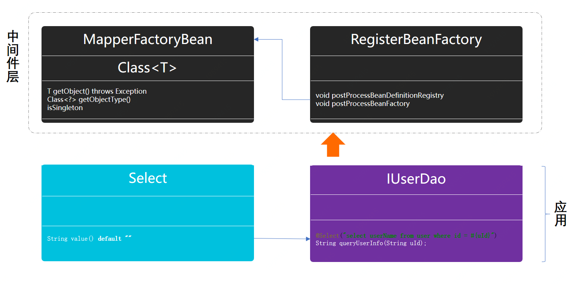

> 本文章仅用于本人学习笔记记录
> 微信：wxid_ygj58saenbjh22（如本文档内容侵权了您的权益，请您通过微信联系到我）

## 代理模式介绍

代理模式有点像老大和小弟，也有点像分销商。主要解决的是问题是为某些资源的访问、对象的类的易用操作上提供方便使用的代理服务。而这种设计思想的模式经常会出现在我们的系统中，或者你用到过的组件中，它们都提供给你一种非常简单易用的方式控制原本你需要编写很多代码的进行使用的服务类。

类似这样的场景可以想到；

- 你的数据库访问层面经常会提供一个较为基础的应用，以此来减少应用服务扩容时不至于数据库连接数暴增。
- 使用过的一些中间件例如；RPC框架，在拿到jar包对接口的描述后，中间件会在服务启动的时候生成对应的代理类，当调用接口的时候，实际是通过代理类发出的socket信息进行通过。
- 另外像我们常用的MyBatis，基本是定义接口但是不需要写实现类，就可以对xml或者自定义注解里的sql语句进行增删改查操作。


## 代理类模式实现过程

接下来会使用代理类模式来模拟实现一个Mybatis中对类的代理过程，也就是只需要定义接口，就可以关联到方法注解中的sql语句完成对数据库的操作。

这里需要注意一些知识点:

- BeanDefinitionRegistryPostProcessor，spring的接口类用于处理对bean的定义注册。
- GenericBeanDefinition，定义bean的信息，在mybatis-spring中使用到的是；ScannedGenericBeanDefinition 略有不同。
- FactoryBean，用于处理bean工厂的类，这个类非常见。

### 工程结构

```
itstack-demo-design-12-00
└── src
    ├── main
    │   ├── java
    │   │   └── org.itstack.demo.design
    │   │       ├── agent
    │   │       │	├── MapperFactoryBean.java
    │   │       │	├── RegisterBeanFactory.java
    │   │       │	└── Select.java
    │   │       └── IUserDao.java
    │   └── resources	
    │       └── spring-config.xml
    └── test
        └── java
            └── org.itstack.demo.test
                └── ApiTest.java

```

代理模式中间件模型结构



- 此模型中涉及的类并不多，但都是抽离出来的核心处理类。主要的事情就是对类的代理和注册到spring中。
- 上图中最上面是关于中间件的实现部分，下面对应的是功能的使用。

### 代码实现

#### 自定义注解

```
@Documented
@Retention(RetentionPolicy.RUNTIME)
@Target({ElementType.METHOD})
public @interface Select {

    String value() default "";  // sql语句

}

```

这里我们定义了一个模拟mybatis-spring中的自定义注解，用于使用在方法层面。

#### Dao层接口

```
public interface IUserDao {

    @Select("select userName from user where id = #{uId}")
    String queryUserInfo(String uId);

}

```

这里定义一个Dao层接口，并把自定义注解添加上。这与你使用的mybatis组件是一样的。

#### 代理类定义

```
public class MapperFactoryBean<T> implements FactoryBean<T> {

    private Logger logger = LoggerFactory.getLogger(MapperFactoryBean.class);

    private Class<T> mapperInterface;

    public MapperFactoryBean(Class<T> mapperInterface) {
        this.mapperInterface = mapperInterface;
    }

    @Override
    public T getObject() throws Exception {
        InvocationHandler handler = (proxy, method, args) -> {
            Select select = method.getAnnotation(Select.class);
            logger.info("SQL：{}", select.value().replace("#{uId}", args[0].toString()));
            return args[0] + ",沉淀、分享、成长，让自己和他人都能有所收获！";
        };
        return (T) Proxy.newProxyInstance(this.getClass().getClassLoader(), new Class[]{mapperInterface}, handler);
    }

    @Override
    public Class<?> getObjectType() {
        return mapperInterface;
    }

    @Override
    public boolean isSingleton() {
        return true;
    }

}

```

- 如果你有阅读过mybatis源码，是可以看到这样的一个类；MapperFactoryBean，这里我们也模拟一个这样的类，在里面实现我们对代理类的定义。
- 通过继承FactoryBean，提供bean对象，也就是方法；T getObject()。
- 在方法getObject()中提供类的代理以及模拟对sql语句的处理，这里包含了用户调用dao层方法时候的处理逻辑。
- 还有最上面我们提供构造函数来透传需要被代理类，Class<T> mapperInterface，在mybatis中也是使用这样的方式进行透传。
- 另外getObjectType()提供对象类型反馈，以及isSingleton()返回类是单例的。

#### 将Bean定义注册到Spring容器

```
public class RegisterBeanFactory implements BeanDefinitionRegistryPostProcessor {
    
    @Override
    public void postProcessBeanDefinitionRegistry(BeanDefinitionRegistry registry) throws BeansException {
        
        GenericBeanDefinition beanDefinition = new GenericBeanDefinition();
        beanDefinition.setBeanClass(MapperFactoryBean.class);
        beanDefinition.setScope("singleton");
        beanDefinition.getConstructorArgumentValues().addGenericArgumentValue(IUserDao.class);

        BeanDefinitionHolder definitionHolder = new BeanDefinitionHolder(beanDefinition, "userDao");
        BeanDefinitionReaderUtils.registerBeanDefinition(definitionHolder, registry);
    }

    @Override
    public void postProcessBeanFactory(ConfigurableListableBeanFactory configurableListableBeanFactory) throws BeansException {
        // left intentionally blank
    }

}

```

- 这里我们将代理的bean交给spring容器管理，也就可以非常方便让我们可以获取到代理的bean。这部分是spring中关于一个bean注册过程的源码。
- GenericBeanDefinition，用于定义一个bean的基本信息setBeanClass(MapperFactoryBean.class);，也包括可以透传给构造函数信息addGenericArgumentValue(IUserDao.class);
- 最后使用 BeanDefinitionReaderUtils.registerBeanDefinition，进行bean的注册，也就是注册到DefaultListableBeanFactory中。

#### 配置文件spring-config

```
<?xml version="1.0" encoding="UTF-8"?>
<beans xmlns="http://www.springframework.org/schema/beans"
       xmlns:xsi="http://www.w3.org/2001/XMLSchema-instance"
       xsi:schemaLocation="http://www.springframework.org/schema/beans http://www.springframework.org/schema/beans/spring-beans-3.0.xsd"
       default-autowire="byName">

    <bean id="userDao" class="org.itstack.demo.design.agent.RegisterBeanFactory"/>

</beans>

```

接下来在配置文件中添加我们的bean配置，在mybatis的使用中一般会配置扫描的dao层包，这样就可以减少这部分的配置。

#### 测试验证

```
@Test
public void test_IUserDao() {
    BeanFactory beanFactory = new ClassPathXmlApplicationContext("spring-config.xml");
    IUserDao userDao = beanFactory.getBean("userDao", IUserDao.class);
    String res = userDao.queryUserInfo("100001");
    logger.info("测试结果：{}", res);
}

```

## 总结

- 代理模式除了开发中间件外还可以是对服务的包装，物联网组件等等，让复杂的各项服务变为轻量级调用、缓存使用。你可以理解为你家里的电灯开关，我们不能操作220v电线的人肉连接，但是可以使用开关，避免触电。
- 代理模式主要解决的是问题是为某些资源的访问、对象的类的易用操作上提供方便使用的代理服务。