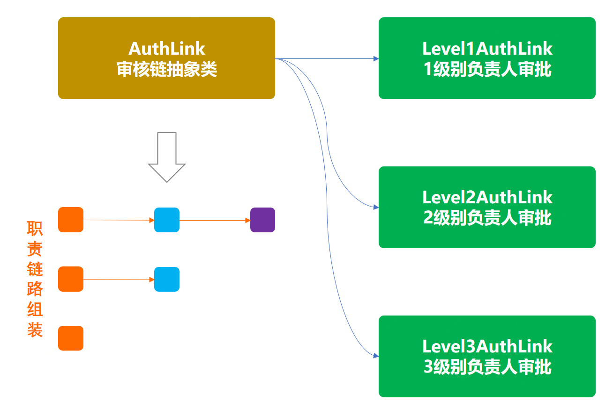

> 本文章仅用于本人学习笔记记录
> 微信：wxid_ygj58saenbjh22（如本文档内容侵权了您的权益，请您通过微信联系到我）

## 责任链模式介绍

责任链模式的核心是解决一组服务中的先后执行处理关系。就有点像你没钱花了，需要家庭财务支出审批，10块钱以下找闺女审批，100块钱先闺女审批在媳妇审批。你可以理解想象成当你要跳槽的时候被安排的明明白白的被各个领导签字放行。

## 简单例子


### 场景模拟工程

```
itstack-demo-design-13-00
└── src
    └── main
        └── java
            └── org.itstack.demo.design
                └── AuthService.java

```

### 场景简述

#### 模拟审核服务

```
public class AuthService {

    private static Map<String, Date> authMap = new ConcurrentHashMap<String, Date>();

    public static Date queryAuthInfo(String uId, String orderId) {
        return authMap.get(uId.concat(orderId));
    }

    public static void auth(String uId, String orderId) {
        authMap.put(uId.concat(orderId), new Date());
    }

}

```

这部分是把由谁审核的和审核的单子ID作为唯一key值记录到内存Map结构中

## 用一坨坨代码实现

按照我们的需求审批流程，平常系统上线只需要三级负责人审批就可以，但是到了618大促时间点，就需要由二级负责以及一级负责人一起加入审批系统上线流程。在这里我们使用非常直接的if判断方式来实现这样的需求。

### 工程结构

```
itstack-demo-design-13-01
└── src
    └── main
        └── java
            └── org.itstack.demo.design
                └── AuthController.java

```

### 代码实现

```
public class AuthController {

    private SimpleDateFormat f = new SimpleDateFormat("yyyy-MM-dd HH:mm:ss");// 时间格式化

    public AuthInfo doAuth(String uId, String orderId, Date authDate) throws ParseException {

        // 三级审批
        Date date = AuthService.queryAuthInfo("1000013", orderId);
        if (null == date) return new AuthInfo("0001", "单号：", orderId, " 状态：待三级审批负责人 ", "王工");

        // 二级审批
        if (authDate.after(f.parse("2020-06-01 00:00:00")) && authDate.before(f.parse("2020-06-25 23:59:59"))) {
            date = AuthService.queryAuthInfo("1000012", orderId);
            if (null == date) return new AuthInfo("0001", "单号：", orderId, " 状态：待二级审批负责人 ", "张经理");
        }

        // 一级审批
        if (authDate.after(f.parse("2020-06-11 00:00:00")) && authDate.before(f.parse("2020-06-20 23:59:59"))) {
            date = AuthService.queryAuthInfo("1000011", orderId);
            if (null == date) return new AuthInfo("0001", "单号：", orderId, " 状态：待一级审批负责人 ", "段总");
        }

        return new AuthInfo("0001", "单号：", orderId, " 状态：审批完成");
    }

}
```

### 测试验证

```
@Test
public void test_AuthController() throws ParseException {
    AuthController authController = new AuthController();  

    // 模拟三级负责人审批
    logger.info("测试结果：{}", JSON.toJSONString(authController.doAuth("小傅哥", "1000998004813441", new Date())));
    logger.info("测试结果：{}", "模拟三级负责人审批，王工");
    AuthService.auth("1000013", "1000998004813441");  

    // 模拟二级负责人审批                                 
    logger.info("测试结果：{}", JSON.toJSONString(authController.doAuth("小傅哥", "1000998004813441", new Date())));
    logger.info("测试结果：{}", "模拟二级负责人审批，张经理");
    AuthService.auth("1000012", "1000998004813441");    

    // 模拟一级负责人审批
    logger.info("测试结果：{}", JSON.toJSONString(authController.doAuth("小傅哥", "1000998004813441", new Date())));
    logger.info("测试结果：{}", "模拟一级负责人审批，段总");
    AuthService.auth("1000011", "1000998004813441");            

    logger.info("测试结果：{}", "审批完成");
}

```

```
23:25:00.363 [main] INFO  org.itstack.demo.design.test.ApiTest - 测试结果：{"code":"0001","info":"单号：1000998004813441 状态：待三级审批负责人 王工"}
23:25:00.366 [main] INFO  org.itstack.demo.design.test.ApiTest - 测试结果：模拟三级负责人审批，王工
23:25:00.367 [main] INFO  org.itstack.demo.design.test.ApiTest - 测试结果：{"code":"0001","info":"单号：1000998004813441 状态：待二级审批负责人 张经理"}
23:25:00.367 [main] INFO  org.itstack.demo.design.test.ApiTest - 测试结果：模拟二级负责人审批，张经理
23:25:00.368 [main] INFO  org.itstack.demo.design.test.ApiTest - 测试结果：{"code":"0001","info":"单号：1000998004813441 状态：待一级审批负责人 段总"}
23:25:00.368 [main] INFO  org.itstack.demo.design.test.ApiTest - 测试结果：模拟一级负责人审批，段总
23:25:00.368 [main] INFO  org.itstack.demo.design.test.ApiTest - 测试结果：审批完成

Process finished with exit code 0

```

## 责任链模式重构代码

责任链模式可以让各个服务模块更加清晰，而每一个模块间可以通过next的方式进行获取。而每一个next是由继承的统一抽象类实现的。最终所有类的职责可以动态的进行编排使用，编排的过程可以做成可配置化。

### 工程结构

```
itstack-demo-design-13-02
└── src
    └── main
        └── java
            └── org.itstack.demo.design
                ├── impl
                │    ├── Level1AuthLink.java
                │    ├── Level2AuthLink.java
                │    └── Level3AuthLink.java
                ├── AuthInfo.java
                └── AuthLink.java

```

责任链模式模型结构



- 上图是这个业务模型中责任链结构的核心部分，通过三个实现了统一抽象类AuthLink的不同规则，再进行责任编排模拟出一条链路。这个链路就是业务中的责任链。
- 一般在使用责任链时候如果是场景比较固定，可以通过写死到代码中进行初始化。但如果业务场景经常变化可以做成xml配置的方式进行处理，也可以落到库里进行初始化操作。

### 代码实现

#### 责任链中返回对象定义

```
public class AuthInfo {

    private String code;
    private String info = "";

    public AuthInfo(String code, String ...infos) {
        this.code = code;
        for (String str:infos){
            this.info = this.info.concat(str);
        }
    }
    
    // ...get/set
}

```

这个类的是包装了责任链处理过程中返回结果的类，方面处理每个责任链的返回信息。

#### 链路抽象类定义

```
public abstract class AuthLink {

    protected Logger logger = LoggerFactory.getLogger(AuthLink.class);

    protected SimpleDateFormat f = new SimpleDateFormat("yyyy-MM-dd HH:mm:ss");// 时间格式化
    protected String levelUserId;                           // 级别人员ID
    protected String levelUserName;                         // 级别人员姓名 
    private AuthLink next;                                  // 责任链

    public AuthLink(String levelUserId, String levelUserName) {
        this.levelUserId = levelUserId;
        this.levelUserName = levelUserName;
    }

    public AuthLink next() {
        return next;
    }

    public AuthLink appendNext(AuthLink next) {
        this.next = next;
        return this;
    }

    public abstract AuthInfo doAuth(String uId, String orderId, Date authDate);

}

```

- 这部分是责任链，链接起来的核心部分。AuthLink next，重点在于可以通过next方式获取下一个链路需要处理的节点。
- levelUserId、levelUserName，是责任链中的公用信息，标记每一个审核节点的人员信息。
- 抽象类中定义了一个抽象方法，abstract AuthInfo doAuth，这是每一个实现者必须实现的类，不同的审核级别处理不同的业务。

#### 三个审核实现类

```
public class Level1AuthLink extends AuthLink {

    public Level1AuthLink(String levelUserId, String levelUserName) {
        super(levelUserId, levelUserName);
    }

    public AuthInfo doAuth(String uId, String orderId, Date authDate) {
        Date date = AuthService.queryAuthInfo(levelUserId, orderId);
        if (null == date) {
            return new AuthInfo("0001", "单号：", orderId, " 状态：待一级审批负责人 ", levelUserName);
        }
        AuthLink next = super.next();
        if (null == next) {
            return new AuthInfo("0000", "单号：", orderId, " 状态：一级审批完成负责人", " 时间：", f.format(date), " 审批人：", levelUserName);
        }

        return next.doAuth(uId, orderId, authDate);
    }

}

```

```
public class Level2AuthLink extends AuthLink {

    private Date beginDate = f.parse("2020-06-11 00:00:00");
    private Date endDate = f.parse("2020-06-20 23:59:59");

    public Level2AuthLink(String levelUserId, String levelUserName) throws ParseException {
        super(levelUserId, levelUserName);
    }

    public AuthInfo doAuth(String uId, String orderId, Date authDate) {
        Date date = AuthService.queryAuthInfo(levelUserId, orderId);
        if (null == date) {
            return new AuthInfo("0001", "单号：", orderId, " 状态：待二级审批负责人 ", levelUserName);
        }
        AuthLink next = super.next();
        if (null == next) {
            return new AuthInfo("0000", "单号：", orderId, " 状态：二级审批完成负责人", " 时间：", f.format(date), " 审批人：", levelUserName);
        }

        if (authDate.before(beginDate) || authDate.after(endDate)) {
            return new AuthInfo("0000", "单号：", orderId, " 状态：二级审批完成负责人", " 时间：", f.format(date), " 审批人：", levelUserName);
        }

        return next.doAuth(uId, orderId, authDate);
    }

}

```

```
public class Level3AuthLink extends AuthLink {

    private Date beginDate = f.parse("2020-06-01 00:00:00");
    private Date endDate = f.parse("2020-06-25 23:59:59");

    public Level3AuthLink(String levelUserId, String levelUserName) throws ParseException {
        super(levelUserId, levelUserName);
    }

    public AuthInfo doAuth(String uId, String orderId, Date authDate) {
        Date date = AuthService.queryAuthInfo(levelUserId, orderId);
        if (null == date) {
            return new AuthInfo("0001", "单号：", orderId, " 状态：待三级审批负责人 ", levelUserName);
        }
        AuthLink next = super.next();
        if (null == next) {
            return new AuthInfo("0000", "单号：", orderId, " 状态：三级审批负责人完成", " 时间：", f.format(date), " 审批人：", levelUserName);
        }

        if (authDate.before(beginDate) || authDate.after(endDate)) {
            return new AuthInfo("0000", "单号：", orderId, " 状态：三级审批负责人完成", " 时间：", f.format(date), " 审批人：", levelUserName);
        }

        return next.doAuth(uId, orderId, authDate);
    }

}

```

- 例如第一个审核类中会先判断是否审核通过，如果没有审核通过则返回结果给调用方，引导去审核。
- 判断完成后获取下一个审核节点；super.next();，如果不存在下一个节点，则直接返回结果。
- 之后是根据不同的业务时间段进行判断是否需要，二级和一级的审核。
- 最后返回下一个审核结果；next.doAuth(uId, orderId, authDate);，有点像递归调用。

#### 测试验证

```
@Test
public void test_AuthLink() throws ParseException {
    AuthLink authLink = new Level3AuthLink("1000013", "王工")
            .appendNext(new Level2AuthLink("1000012", "张经理")
                    .appendNext(new Level1AuthLink("1000011", "段总")));

    logger.info("测试结果：{}", JSON.toJSONString(authLink.doAuth("小傅哥", "1000998004813441", new Date())));

    // 模拟三级负责人审批
    AuthService.auth("1000013", "1000998004813441");
    logger.info("测试结果：{}", "模拟三级负责人审批，王工");
    logger.info("测试结果：{}", JSON.toJSONString(authLink.doAuth("小傅哥", "1000998004813441", new Date())));

    // 模拟二级负责人审批
    AuthService.auth("1000012", "1000998004813441");
    logger.info("测试结果：{}", "模拟二级负责人审批，张经理");
    logger.info("测试结果：{}", JSON.toJSONString(authLink.doAuth("小傅哥", "1000998004813441", new Date())));

    // 模拟一级负责人审批
    AuthService.auth("1000011", "1000998004813441");
    logger.info("测试结果：{}", "模拟一级负责人审批，段总");
    logger.info("测试结果：{}", JSON.toJSONString(authLink.doAuth("小傅哥", "1000998004813441", new Date())));
}

```

- 这里包括最核心的责任链创建，实际的业务中会包装到控制层； AuthLink authLink = new Level3AuthLink("1000013", "王工") .appendNext(new Level2AuthLink("1000012", "张经理") .appendNext(new Level1AuthLink("1000011", "段总"))); 通过把不同的责任节点进行组装，构成一条完整业务的责任链。
- 接下里不断的执行查看审核链路authLink.doAuth(...)，通过返回结果对数据进行3、2、1级负责人审核，直至最后审核全部完成。

```
23:49:46.585 [main] INFO  org.itstack.demo.design.test.ApiTest - 测试结果：{"code":"0001","info":"单号：1000998004813441 状态：待三级审批负责人 王工"}
23:49:46.590 [main] INFO  org.itstack.demo.design.test.ApiTest - 测试结果：模拟三级负责人审批，王工
23:49:46.590 [main] INFO  org.itstack.demo.design.test.ApiTest - 测试结果：{"code":"0001","info":"单号：1000998004813441 状态：待二级审批负责人 张经理"}
23:49:46.590 [main] INFO  org.itstack.demo.design.test.ApiTest - 测试结果：模拟二级负责人审批，张经理
23:49:46.590 [main] INFO  org.itstack.demo.design.test.ApiTest - 测试结果：{"code":"0001","info":"单号：1000998004813441 状态：待一级审批负责人 段总"}
23:49:46.590 [main] INFO  org.itstack.demo.design.test.ApiTest - 测试结果：模拟一级负责人审批，段总
23:49:46.590 [main] INFO  org.itstack.demo.design.test.ApiTest - 测试结果：{"code":"0000","info":"单号：1000998004813441 状态：一级审批完成负责人 时间：2020-06-18 23:49:46 审批人：段总"}

Process finished with exit code 0

```

## 总结

- 从上面代码从if语句重构到使用责任链模式开发可以看到，我们的代码结构变得清晰干净了，也解决了大量if语句的使用。并不是if语句不好，只不过if语句并不适合做系统流程设计，但是在做判断和行为逻辑处理中还是非常可以使用的。
- 责任链模式很好的处理单一职责和开闭原则，简单了耦合也使对象关系更加清晰，而且外部的调用方并不需要关心责任链是如何进行处理的(以上程序中可以把责任链的组合进行包装，在提供给外部使用)。但除了这些优点外也需要是适当的场景才进行使用，避免造成性能以及编排混乱调试测试疏漏问题。
- 责任链模式的核心是解决一组服务中的先后执行处理关系。 