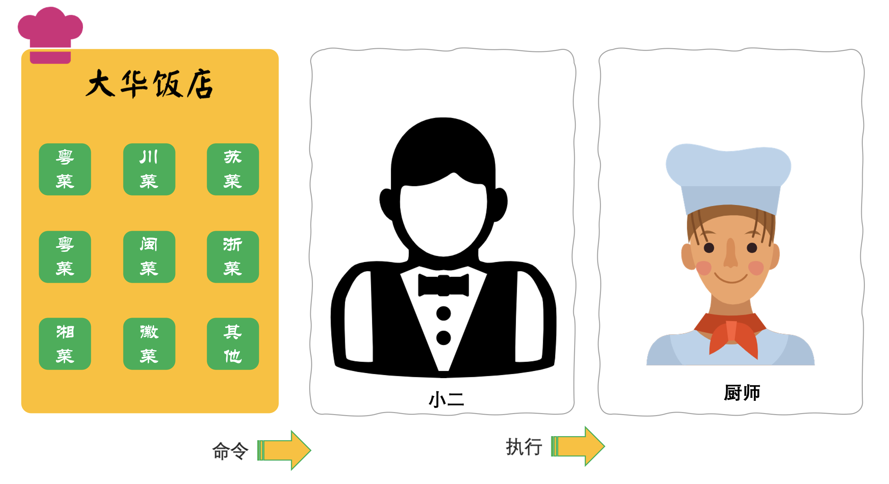
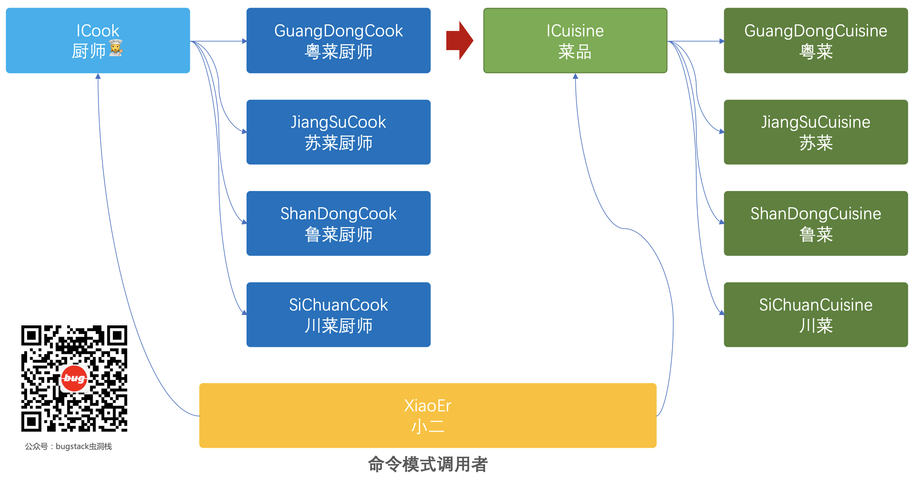

> 本文章仅用于本人学习笔记记录
> 微信：wxid_ygj58saenbjh22（如本文档内容侵权了您的权益，请您通过微信联系到我）

## 命令模式介绍

命令模式是行为模式中的一种，以数据驱动的方式将命令对象，可以使用构造函数的方式传递给调用者。调用者再提供相应的实现为命令执行提供操作方法。

在这个设计模式的实现过程中有如下几个比较重要的点；

- 抽象命令类：声明执行命令的接口和方法
- 具体的命令实现类：接口类的具体实现，可以是一组相似的行为逻辑
- 实现者：也就是为命令做实现的具体实现类
- 调用者：处理命令、实现的具体操作者，负责对外提供命令服务

## 简单例子



在这个案例中我们模拟在餐厅中点餐交给厨师👨‍🍳烹饪的场景

命令场景的核心的逻辑是调用方与不需要去关心具体的逻辑实现，在这个场景中也就是点餐人员只需要把需要点的各种菜系交个小二就可以，小二再把各项菜品交给各个厨师进行烹饪。也就是点餐人员不需要跟各个厨师交流，只需要在统一的环境里下达命令就可以。

在这个场景中可以看到有不同的菜品；山东（鲁菜）、四川（川菜）、江苏（苏菜）、广东（粤菜）、福建（闽菜）、浙江（浙菜）、湖南（湘菜），每种菜品都会有不同的厨师👩‍🍳进行烹饪。而客户并不会去关心具体是谁烹饪，厨师也不会去关心谁点的餐。客户只关心早点上菜，厨师只关心还有多少个菜要做。而这中间的衔接的过程，由小二完成。

## 用一坨坨代码实现

### 工程结构


```
itstack-demo-design-14-01
└── src
    └── main
        └── java
            └── org.itstack.demo.design
                └── XiaoEr.java

```

### 代码实现

```
public class XiaoEr {

    private Logger logger = LoggerFactory.getLogger(XiaoEr.class);

    private Map<Integer, String> cuisineMap = new ConcurrentHashMap<Integer, String>();

    public void order(int cuisine) {
        // 广东（粤菜）
        if (1 == cuisine) {
            cuisineMap.put(1, "广东厨师，烹饪鲁菜，宫廷最大菜系，以孔府风味为龙头");
        }

        // 江苏（苏菜）
        if (2 == cuisine) {
            cuisineMap.put(2, "江苏厨师，烹饪苏菜，宫廷第二大菜系，古今国宴上最受人欢迎的菜系。");
        }

        // 山东（鲁菜）
        if (3 == cuisine) {
            cuisineMap.put(3, "山东厨师，烹饪鲁菜，宫廷最大菜系，以孔府风味为龙头.");
        }

        // 四川（川菜）
        if (4 == cuisine) {
            cuisineMap.put(4, "四川厨师，烹饪川菜，中国最有特色的菜系，也是民间最大菜系。");
        }

    }

    public void placeOrder() {
        logger.info("菜单：{}", JSON.toJSONString(cuisineMap));
    }

}

```

在这个类的实现中提供了两个方法，一个方法用于点单添加菜品order()，另外一个方法展示菜品的信息placeOrder()。

## 命令模式重构代码

命令模式可以将上述的模式拆解三层大块，命令、命令实现者、命令的调用者，当有新的菜品或者厨师扩充时候就可以在指定的类结构下进行实现添加即可，外部的调用也会非常的容易扩展。

### 工程结构

```
itstack-demo-design-14-02
└── src
    ├── main
    │   └── java
    │       └── org.itstack.demo.design
    │           ├── cook
    │           │	├── impl
    │           │	│   ├── GuangDongCook.java
    │           │	│   ├── JiangSuCook.java
    │           │	│   ├── ShanDongCook.java
    │           │	│   └── SiChuanCook.java
    │           │	└── ICook.java
    │           ├── cuisine
    │           │	├── impl
    │           │	│   ├── GuangDoneCuisine.java
    │           │	│   ├── JiangSuCuisine.java
    │           │	│   ├── ShanDongCuisine.java
    │           │	│   └── SiChuanCuisine.java
    │           │	└── ICuisine.java
    │           └── XiaoEr.java
    └── test
        └── java
            └── org.itstack.demo.test
                └── ApiTest.java

```

### 命令模式模型结构



### 代码实现

#### 抽象命令定义(菜品接口)

```
public interface ICuisine {

    void cook(); // 烹调、制作

}
```

#### 广东（粤菜）

```
public class GuangDoneCuisine implements ICuisine {

    private ICook cook;

    public GuangDoneCuisine(ICook cook) {
        this.cook = cook;
    }

    public void cook() {
        cook.doCooking();
    }

}

```

#### 江苏（苏菜）

```
public class JiangSuCuisine implements ICuisine {

    private ICook cook;

    public JiangSuCuisine(ICook cook) {
        this.cook = cook;
    }

    public void cook() {
        cook.doCooking();
    }

}

```

在实现的类中都有添加了一个厨师类(ICook)，并通过这个类提供的方法进行操作命令(烹饪菜品)cook.doCooking()。

#### 抽象实现者定义(厨师接口)

```
public interface ICook {

    void doCooking();

}

```

这里定义的是具体的为命令的实现者，这里也就是菜品对应的厨师烹饪的指令实现。

#### 粤菜，厨师

```
public class GuangDongCook implements ICook {

    private Logger logger = LoggerFactory.getLogger(ICook.class);

    public void doCooking() {
        logger.info("广东厨师，烹饪鲁菜，宫廷最大菜系，以孔府风味为龙头");
    }

}

```

#### 苏菜，厨师

```
public class JiangSuCook implements ICook {

    private Logger logger = LoggerFactory.getLogger(ICook.class);

    public void doCooking() {
        logger.info("江苏厨师，烹饪苏菜，宫廷第二大菜系，古今国宴上最受人欢迎的菜系。");
    }

}

```

在这个实现的过程是模拟打了日志，相当于通知了厨房里具体的厨师进行菜品烹饪。

#### 调用者(小二)

```
public class XiaoEr {

    private Logger logger = LoggerFactory.getLogger(XiaoEr.class);

    private List<ICuisine> cuisineList = new ArrayList<ICuisine>();

    public void order(ICuisine cuisine) {
        cuisineList.add(cuisine);
    }

    public synchronized void placeOrder() {
        for (ICuisine cuisine : cuisineList) {
            cuisine.cook();
        }
        cuisineList.clear();
    }

}

```

在调用者的具体实现中，提供了菜品的添加和菜单执行烹饪。这个过程是命令模式的具体调用，通过外部将菜品和厨师传递进来而进行具体的调用。

#### 测试验证

```
@Test
public void test(){

    // 菜系 + 厨师；广东（粤菜）、江苏（苏菜）、山东（鲁菜）、四川（川菜）
    ICuisine guangDoneCuisine = new GuangDoneCuisine(new GuangDongCook());
    JiangSuCuisine jiangSuCuisine = new JiangSuCuisine(new JiangSuCook());
    ShanDongCuisine shanDongCuisine = new ShanDongCuisine(new ShanDongCook());
    SiChuanCuisine siChuanCuisine = new SiChuanCuisine(new SiChuanCook());

    // 点单
    XiaoEr xiaoEr = new XiaoEr();
    xiaoEr.order(guangDoneCuisine);
    xiaoEr.order(jiangSuCuisine);
    xiaoEr.order(shanDongCuisine);
    xiaoEr.order(siChuanCuisine);

    // 下单
    xiaoEr.placeOrder();
}

```

这里可以主要观察菜品与厨师的组合；new GuangDoneCuisine(new GuangDongCook());，每一个具体的命令都拥有一个对应的实现类，可以进行组合。

## 总结

- 从以上的内容和例子可以感受到，命令模式的使用场景需要分为三个比较大的块；命令、实现、调用者，而这三块内容的拆分也是选择适合场景的关键因素，经过这样的拆分可以让逻辑具备单一职责的性质，便于扩展。
- 通过这样的实现方式与if语句相比，降低了耦合性也方便其他的命令和实现的扩展。但同时这样的设计模式也带来了一点问题，就是在各种命令与实现的组合下，会扩展出很多的实现类，需要进行管理。
- 命令模式是行为模式中的一种，以数据驱动的方式将命令对象，可以使用构造函数的方式传递给调用者。调用者再提供相应的实现为命令执行提供操作方法。