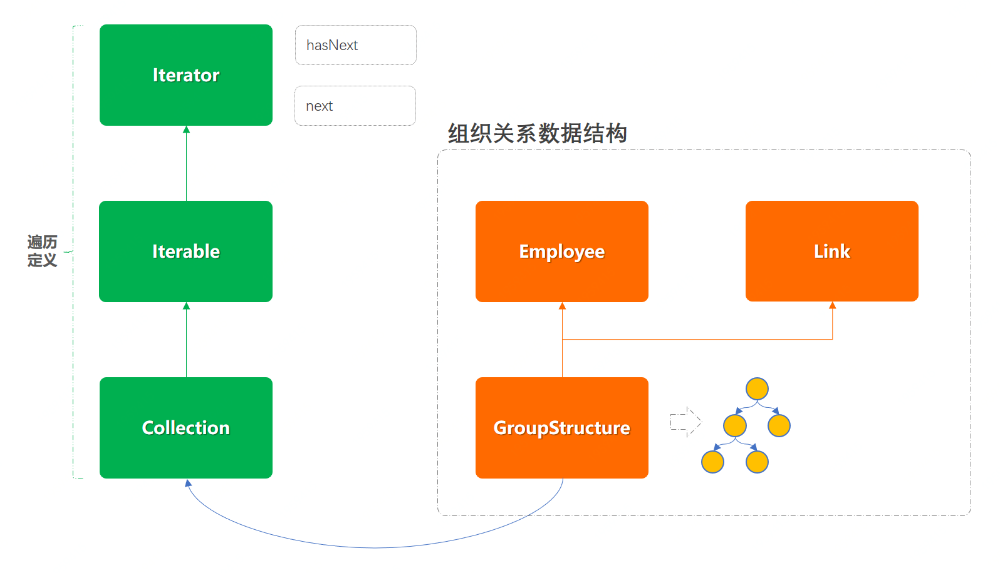

> 本文章仅用于本人学习笔记记录
> 微信：wxid_ygj58saenbjh22（如本文档内容侵权了您的权益，请您通过微信联系到我）

## 迭代器模式介绍

迭代器模式，常见的就是我们日常使用的iterator遍历。虽然这个设计模式在我们的实际业务开发中的场景并不多，但却几乎每天都要使用jdk为我们提供的list集合遍历。另外增强的for循环虽然是循环输出数据，但是他不是迭代器模式。迭代器模式的特点是实现Iterable接口，通过next的方式获取集合元素，同时具备对元素的删除等操作。而增强的for循环是不可以的。

这种设计模式的优点是可以让我们以相同的方式，遍历不同的数据结构元素，这些数据结构包括；数组、链表、树等，而用户在使用遍历的时候并不需要去关心每一种数据结构的遍历处理逻辑，从让使用变得统一易用。


## 迭代器模式遍历组织结构

在实现迭代器模式之前可以先阅读下java中list方法关于iterator的实现部分，几乎所有的迭代器开发都会按照这个模式来实现，这个模式主要分为以下几块；

- Collection，集合方法部分用于对自定义的数据结构添加通用方法:add、remove、iterator等核心方法。
- Iterable，提供获取迭代器，这个接口类会被Collection继承。
- Iterator，提供了两个方法的定义:hasNext、next，会在具体的数据结构中写实现方式。

## 简单例子

### 工程结构

```
itstack-demo-design-15-00
└── src
    ├── main
    │   └── java
    │       └── org.itstack.demo.design
    │           ├── group
    │           │	├── Employee.java
    │           │	├── GroupStructure.java
    │           │	└── Link.java
    │           └──  lang
    │            	├── Collection.java
    │            	├── Iterable.java
    │            	└── Iterator.java
    └── test
        └── java
            └── org.itstack.demo.design.test
                └── ApiTest.java

```

### 迭代器模式模型结构



### 代码实现

#### 雇员实体类

```
/**
 * 雇员
 */
public class Employee {

    private String uId;   // ID
    private String name;  // 姓名
    private String desc;  // 备注
    
    // ...get/set
}

```

#### 树节点链路

```
/**
 * 树节点链路
 */
public class Link {

    private String fromId; // 雇员ID
    private String toId;   // 雇员ID    
    
    // ...get/set
}

```

这个类用于描述结构树中的各个节点之间的关系链，也就是A to B、B to C、B to D，以此描述出一套完整的树组织结构。

#### 迭代器定义

```
public interface Iterator<E> {

    boolean hasNext();

    E next();
    
}

```

方法描述:hasNext，判断是否有下一个元素、next，获取下一个元素。这个在list的遍历中是经常用到的。

#### 可迭代接口定义

```
public interface Iterable<E> {

    Iterator<E> iterator();

}

```

这个接口中提供了上面迭代器的实现Iterator的获取，也就是后续在自己的数据结构中需要实现迭代器的功能并交给Iterable，由此让外部调用方进行获取使用。

#### 集合功能接口定义

```
public interface Collection<E, L> extends Iterable<E> {

    boolean add(E e);

    boolean remove(E e);

    boolean addLink(String key, L l);

    boolean removeLink(String key);

    Iterator<E> iterator();

}

```

- 定义集合操作接口；Collection，同时继承了另外一个接口Iterable的方法iterator()。这样后续谁来实现这个接口，就需要实现上述定义的一些基本功能；添加元素、删除元素、遍历。
- 这里定义了两个泛型<E, L>，因为我们的数据结构一个是用于添加元素，另外一个是用于添加树节点的链路关系。

#### (核心)迭代器功能实现

```
public class GroupStructure implements Collection<Employee, Link> {

    private String groupId;                                                 // 组织ID，也是一个组织链的头部ID
    private String groupName;                                               // 组织名称
    private Map<String, Employee> employeeMap = new ConcurrentHashMap<String, Employee>();  // 雇员列表
    private Map<String, List<Link>> linkMap = new ConcurrentHashMap<String, List<Link>>();  // 组织架构关系；id->list
    private Map<String, String> invertedMap = new ConcurrentHashMap<String, String>();       // 反向关系链

    public GroupStructure(String groupId, String groupName) {
        this.groupId = groupId;
        this.groupName = groupName;
    }

    public boolean add(Employee employee) {
        return null != employeeMap.put(employee.getuId(), employee);
    }

    public boolean remove(Employee o) {
        return null != employeeMap.remove(o.getuId());
    }

    public boolean addLink(String key, Link link) {
        invertedMap.put(link.getToId(), link.getFromId());
        if (linkMap.containsKey(key)) {
            return linkMap.get(key).add(link);
        } else {
            List<Link> links = new LinkedList<Link>();
            links.add(link);
            linkMap.put(key, links);
            return true;
        }
    }

    public boolean removeLink(String key) {
        return null != linkMap.remove(key);
    }

    public Iterator<Employee> iterator() {

        return new Iterator<Employee>() {

            HashMap<String, Integer> keyMap = new HashMap<String, Integer>();

            int totalIdx = 0;
            private String fromId = groupId;  // 雇员ID，From
            private String toId = groupId;   // 雇员ID，To

            public boolean hasNext() {
                return totalIdx < employeeMap.size();
            }

            public Employee next() {
                List<Link> links = linkMap.get(toId);
                int cursorIdx = getCursorIdx(toId);

                // 同级节点扫描
                if (null == links) {
                    cursorIdx = getCursorIdx(fromId);
                    links = linkMap.get(fromId);
                }

                // 上级节点扫描
                while (cursorIdx > links.size() - 1) {
                    fromId = invertedMap.get(fromId);
                    cursorIdx = getCursorIdx(fromId);
                    links = linkMap.get(fromId);
                }

                // 获取节点
                Link link = links.get(cursorIdx);
                toId = link.getToId();
                fromId = link.getFromId();
                totalIdx++;

                // 返回结果
                return employeeMap.get(link.getToId());
            }
             
            // 给每个层级定义宽度遍历进度
            public int getCursorIdx(String key) {
                int idx = 0;
                if (keyMap.containsKey(key)) {
                    idx = keyMap.get(key);
                    keyMap.put(key, ++idx);
                } else {
                    keyMap.put(key, idx);
                }
                return idx;
            }
        };
    }

}

```

- 以上的这部分代码稍微有点长，主要包括了对元素的添加和删除。另外最重要的是对遍历的实现 new Iterator<Employee>。
- 添加和删除元素相对来说比较简单，使用了两个map数组结构进行定义；雇员列表、组织架构关系；id->list。当元素添加元素的时候，会分别在不同的方法中向map结构中进行填充指向关系(A->B)，也就构建出了我们的树形组织关系。


迭代器实现思路

- 这里的树形结构我们需要做的是深度遍历，也就是左侧的一直遍历到最深节点。
- 当遍历到最深节点后，开始遍历最深节点的横向节点。
- 当横向节点遍历完成后则向上寻找横向节点，直至树结构全部遍历完成。

### 测试验证

```
@Test
public void test_iterator() { 
    // 数据填充
    GroupStructure groupStructure = new GroupStructure("1", "小傅哥");  
    
    // 雇员信息
    groupStructure.add(new Employee("2", "花花", "二级部门"));
    groupStructure.add(new Employee("3", "豆包", "二级部门"));
    groupStructure.add(new Employee("4", "蹦蹦", "三级部门"));
    groupStructure.add(new Employee("5", "大烧", "三级部门"));
    groupStructure.add(new Employee("6", "虎哥", "四级部门"));
    groupStructure.add(new Employee("7", "玲姐", "四级部门"));
    groupStructure.add(new Employee("8", "秋雅", "四级部门"));   
    
    // 节点关系 1->(1,2) 2->(4,5)
    groupStructure.addLink("1", new Link("1", "2"));
    groupStructure.addLink("1", new Link("1", "3"));
    groupStructure.addLink("2", new Link("2", "4"));
    groupStructure.addLink("2", new Link("2", "5"));
    groupStructure.addLink("5", new Link("5", "6"));
    groupStructure.addLink("5", new Link("5", "7"));
    groupStructure.addLink("5", new Link("5", "8"));       

    Iterator<Employee> iterator = groupStructure.iterator();
    while (iterator.hasNext()) {
        Employee employee = iterator.next();
        logger.info("{}，雇员 Id：{} Name：{}", employee.getDesc(), employee.getuId(), employee.getName());
    }
}

```

```
22:23:37.166 [main] INFO  org.itstack.demo.design.test.ApiTest - 二级部门，雇员 Id：2 Name：花花
22:23:37.168 [main] INFO  org.itstack.demo.design.test.ApiTest - 三级部门，雇员 Id：4 Name：蹦蹦
22:23:37.169 [main] INFO  org.itstack.demo.design.test.ApiTest - 三级部门，雇员 Id：5 Name：大烧
22:23:37.169 [main] INFO  org.itstack.demo.design.test.ApiTest - 四级部门，雇员 Id：6 Name：虎哥
22:23:37.169 [main] INFO  org.itstack.demo.design.test.ApiTest - 四级部门，雇员 Id：7 Name：玲姐
22:23:37.169 [main] INFO  org.itstack.demo.design.test.ApiTest - 四级部门，雇员 Id：8 Name：秋雅
22:23:37.169 [main] INFO  org.itstack.demo.design.test.ApiTest - 二级部门，雇员 Id：3 Name：豆包

Process finished with exit code 0

```

从遍历的结果可以看到，我们是顺着树形结构的深度开始遍历，一直到右侧的节点3；雇员 Id：2、雇员 Id：4...雇员 Id：3

## 总结

- 迭代器的设计模式从以上的功能实现可以看到，满足了单一职责和开闭原则，外界的调用方也不需要知道任何一个不同的数据结构在使用上的遍历差异。可以非常方便的扩展，也让整个遍历变得更加干净整洁。