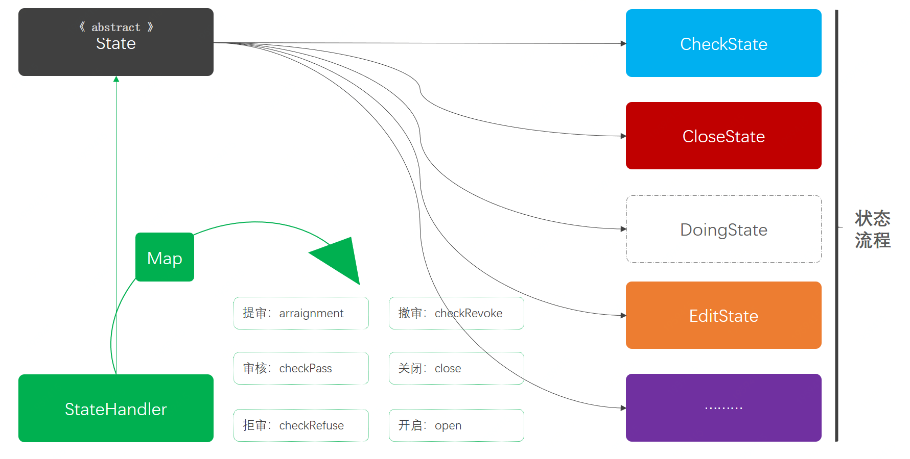

> 本文章仅用于本人学习笔记记录
> 微信：wxid_ygj58saenbjh22（如本文档内容侵权了您的权益，请您通过微信联系到我）

## 状态模式介绍

状态模式描述的是一个行为下的多种状态变更，比如我们最常见的一个网站的页面，在你登录与不登录下展示的内容是略有差异的(不登录不能展示个人信息)，而这种登录与不登录就是我们通过改变状态，而让整个行为发生了变化。


## 简单例子

```
itstack-demo-design-19-00
└── src
    └── main
        └── java
            └── org.itstack.demo.design
                ├── ActivityInfo.java
                ├── Status.java
                └── ActivityService.java

```

在这个模拟工程里我们提供了三个类，包括；状态枚举(Status)、活动对象(ActivityInfo)、活动服务(ActivityService)，三个服务类。


### 代码实现

#### 基本活动信息

```
public class ActivityInfo {

    private String activityId;    // 活动ID
    private String activityName;  // 活动名称
    private Enum<Status> status;  // 活动状态
    private Date beginTime;       // 开始时间
    private Date endTime;         // 结束时间
   
    // ...get/set
}  
```

#### 活动枚举状态

```
public enum Status {

    // 1创建编辑、2待审核、3审核通过(任务扫描成活动中)、4审核拒绝(可以撤审到编辑状态)、5活动中、6活动关闭、7活动开启(任务扫描成活动中)
    Editing, Check, Pass, Refuse, Doing, Close, Open

}

```

#### 活动服务接口

```
public class ActivityService {

    private static Map<String, Enum<Status>> statusMap = new ConcurrentHashMap<String, Enum<Status>>();

    public static void init(String activityId, Enum<Status> status) {
        // 模拟查询活动信息
        ActivityInfo activityInfo = new ActivityInfo();
        activityInfo.setActivityId(activityId);
        activityInfo.setActivityName("早起学习打卡领奖活动");
        activityInfo.setStatus(status);
        activityInfo.setBeginTime(new Date());
        activityInfo.setEndTime(new Date());
        statusMap.put(activityId, status);
    }

    /**
     * 查询活动信息
     *
     * @param activityId 活动ID
     * @return 查询结果
     */
    public static ActivityInfo queryActivityInfo(String activityId) {
        // 模拟查询活动信息
        ActivityInfo activityInfo = new ActivityInfo();
        activityInfo.setActivityId(activityId);
        activityInfo.setActivityName("早起学习打卡领奖活动");
        activityInfo.setStatus(statusMap.get(activityId));
        activityInfo.setBeginTime(new Date());
        activityInfo.setEndTime(new Date());
        return activityInfo;
    }

    /**
     * 查询活动状态
     *
     * @param activityId 活动ID
     * @return 查询结果
     */
    public static Enum<Status> queryActivityStatus(String activityId) {
        return statusMap.get(activityId);
    }

    /**
     * 执行状态变更
     *
     * @param activityId   活动ID
     * @param beforeStatus 变更前状态
     * @param afterStatus  变更后状态 b
     */
    public static synchronized void execStatus(String activityId, Enum<Status> beforeStatus, Enum<Status> afterStatus) {
        if (!beforeStatus.equals(statusMap.get(activityId))) return;
        statusMap.put(activityId, afterStatus);
    }

}

```

## 用一坨坨代码实现

### 工程结构

```
itstack-demo-design-19-01
└── src
    └── main
        └── java
            └── org.itstack.demo.design
                ├── ActivityExecStatusController.java
                └── Result.java

```

整个实现的工程结构比较简单，只包括了两个类；ActivityExecStatusController、Result，一个是处理流程状态，另外一个是返回的对象。

### 代码实现

```
public class ActivityExecStatusController {

    /**
     * 活动状态变更
     * 1. 编辑中 -> 提审、关闭
     * 2. 审核通过 -> 拒绝、关闭、活动中
     * 3. 审核拒绝 -> 撤审、关闭
     * 4. 活动中 -> 关闭
     * 5. 活动关闭 -> 开启
     * 6. 活动开启 -> 关闭
     *
     * @param activityId   活动ID
     * @param beforeStatus 变更前状态
     * @param afterStatus  变更后状态
     * @return 返回结果
     */
    public Result execStatus(String activityId, Enum<Status> beforeStatus, Enum<Status> afterStatus) {

        // 1. 编辑中 -> 提审、关闭
        if (Status.Editing.equals(beforeStatus)) {
            if (Status.Check.equals(afterStatus) || Status.Close.equals(afterStatus)) {
                ActivityService.execStatus(activityId, beforeStatus, afterStatus);
                return new Result("0000", "变更状态成功");
            } else {
                return new Result("0001", "变更状态拒绝");
            }
        }

        // 2. 审核通过 -> 拒绝、关闭、活动中
        if (Status.Pass.equals(beforeStatus)) {
            if (Status.Refuse.equals(afterStatus) || Status.Doing.equals(afterStatus) || Status.Close.equals(afterStatus)) {
                ActivityService.execStatus(activityId, beforeStatus, afterStatus);
                return new Result("0000", "变更状态成功");
            } else {
                return new Result("0001", "变更状态拒绝");
            }
        }

        // 3. 审核拒绝 -> 撤审、关闭
        if (Status.Refuse.equals(beforeStatus)) {
            if (Status.Editing.equals(afterStatus) || Status.Close.equals(afterStatus)) {
                ActivityService.execStatus(activityId, beforeStatus, afterStatus);
                return new Result("0000", "变更状态成功");
            } else {
                return new Result("0001", "变更状态拒绝");
            }
        }

        // 4. 活动中 -> 关闭
        if (Status.Doing.equals(beforeStatus)) {
            if (Status.Close.equals(afterStatus)) {
                ActivityService.execStatus(activityId, beforeStatus, afterStatus);
                return new Result("0000", "变更状态成功");
            } else {
                return new Result("0001", "变更状态拒绝");
            }
        }

        // 5. 活动关闭 -> 开启
        if (Status.Close.equals(beforeStatus)) {
            if (Status.Open.equals(afterStatus)) {
                ActivityService.execStatus(activityId, beforeStatus, afterStatus);
                return new Result("0000", "变更状态成功");
            } else {
                return new Result("0001", "变更状态拒绝");
            }
        }

        // 6. 活动开启 -> 关闭
        if (Status.Open.equals(beforeStatus)) {
            if (Status.Close.equals(afterStatus)) {
                ActivityService.execStatus(activityId, beforeStatus, afterStatus);
                return new Result("0000", "变更状态成功");
            } else {
                return new Result("0001", "变更状态拒绝");
            }
        }

        return new Result("0001", "非可处理的活动状态变更");

    }

}

```

## 状态模式重构代码

### 工程结构


```
itstack-demo-design-19-02
└── src
    └── main
        └── java
            └── org.itstack.demo.design
                ├── event
                │    ├── CheckState.java
                │    └── CloseState.java
                │    └── DoingState.java
                │    └── EditingState.java
                │    └── OpenState.java
                │    └── PassState.java
                │    └── RefuseState.java
                ├── Result.java
                ├── State.java
                └── StateHandler.java

```

状态模式模型结构



- 以上是状态模式的整个工程结构模型，State是一个抽象类，定义了各种操作接口(提审、审核、拒审等)。
- 右侧的不同颜色状态与我们场景模拟中的颜色保持一致，是各种状态流程流转的实现操作。这里的实现有一个关键点就是每一种状态到下一个状态，都分配到各个实现方法中控制，也就不需要if语言进行判断了。
- 最后是StateHandler对状态流程的统一处理，里面提供Map结构的各项服务接口调用，也就避免了使用if判断各项状态转变的流程。

### 代码实现

#### 定义状态抽象类

```
ublic abstract class State {

    /**
     * 活动提审
     *
     * @param activityId    活动ID
     * @param currentStatus 当前状态
     * @return 执行结果
     */
    public abstract Result arraignment(String activityId, Enum<Status> currentStatus);

    /**
     * 审核通过
     *
     * @param activityId    活动ID
     * @param currentStatus 当前状态
     * @return 执行结果
     */
    public abstract Result checkPass(String activityId, Enum<Status> currentStatus);

    /**
     * 审核拒绝
     *
     * @param activityId    活动ID
     * @param currentStatus 当前状态
     * @return 执行结果
     */
    public abstract Result checkRefuse(String activityId, Enum<Status> currentStatus);

    /**
     * 撤审撤销
     *
     * @param activityId    活动ID
     * @param currentStatus 当前状态
     * @return 执行结果
     */
    public abstract Result checkRevoke(String activityId, Enum<Status> currentStatus);

    /**
     * 活动关闭
     *
     * @param activityId    活动ID
     * @param currentStatus 当前状态
     * @return 执行结果
     */
    public abstract Result close(String activityId, Enum<Status> currentStatus);

    /**
     * 活动开启
     *
     * @param activityId    活动ID
     * @param currentStatus 当前状态
     * @return 执行结果
     */
    public abstract Result open(String activityId, Enum<Status> currentStatus);

    /**
     * 活动执行
     *
     * @param activityId    活动ID
     * @param currentStatus 当前状态
     * @return 执行结果
     */
    public abstract Result doing(String activityId, Enum<Status> currentStatus);

}
```

#### 编辑

```
public class EditingState extends State {

    public Result arraignment(String activityId, Enum<Status> currentStatus) {
        ActivityService.execStatus(activityId, currentStatus, Status.Check);
        return new Result("0000", "活动提审成功");
    }

    public Result checkPass(String activityId, Enum<Status> currentStatus) {
        return new Result("0001", "编辑中不可审核通过");
    }

    public Result checkRefuse(String activityId, Enum<Status> currentStatus) {
        return new Result("0001", "编辑中不可审核拒绝");
    }

    @Override
    public Result checkRevoke(String activityId, Enum<Status> currentStatus) {
        return new Result("0001", "编辑中不可撤销审核");
    }

    public Result close(String activityId, Enum<Status> currentStatus) {
        ActivityService.execStatus(activityId, currentStatus, Status.Close);
        return new Result("0000", "活动关闭成功");
    }

    public Result open(String activityId, Enum<Status> currentStatus) {
        return new Result("0001", "非关闭活动不可开启");
    }

    public Result doing(String activityId, Enum<Status> currentStatus) {
        return new Result("0001", "编辑中活动不可执行活动中变更");
    }

}

```

#### 提审

```
public class CheckState extends State {

    public Result arraignment(String activityId, Enum<Status> currentStatus) {
        return new Result("0001", "待审核状态不可重复提审");
    }

    public Result checkPass(String activityId, Enum<Status> currentStatus) {
        ActivityService.execStatus(activityId, currentStatus, Status.Pass);
        return new Result("0000", "活动审核通过完成");
    }

    public Result checkRefuse(String activityId, Enum<Status> currentStatus) {
        ActivityService.execStatus(activityId, currentStatus, Status.Refuse);
        return new Result("0000", "活动审核拒绝完成");
    }

    @Override
    public Result checkRevoke(String activityId, Enum<Status> currentStatus) {
        ActivityService.execStatus(activityId, currentStatus, Status.Editing);
        return new Result("0000", "活动审核撤销回到编辑中");
    }

    public Result close(String activityId, Enum<Status> currentStatus) {
        ActivityService.execStatus(activityId, currentStatus, Status.Close);
        return new Result("0000", "活动审核关闭完成");
    }

    public Result open(String activityId, Enum<Status> currentStatus) {
        return new Result("0001", "非关闭活动不可开启");
    }

    public Result doing(String activityId, Enum<Status> currentStatus) {
        return new Result("0001", "待审核活动不可执行活动中变更");
    }

}

```

#### 状态处理服务

```
public class StateHandler {

    private Map<Enum<Status>, State> stateMap = new ConcurrentHashMap<Enum<Status>, State>();

    public StateHandler() {
        stateMap.put(Status.Check, new CheckState());     // 待审核
        stateMap.put(Status.Close, new CloseState());     // 已关闭
        stateMap.put(Status.Doing, new DoingState());     // 活动中
        stateMap.put(Status.Editing, new EditingState()); // 编辑中
        stateMap.put(Status.Open, new OpenState());       // 已开启
        stateMap.put(Status.Pass, new PassState());       // 审核通过
        stateMap.put(Status.Refuse, new RefuseState());   // 审核拒绝
    }

    public Result arraignment(String activityId, Enum<Status> currentStatus) {
        return stateMap.get(currentStatus).arraignment(activityId, currentStatus);
    }

    public Result checkPass(String activityId, Enum<Status> currentStatus) {
        return stateMap.get(currentStatus).checkPass(activityId, currentStatus);
    }

    public Result checkRefuse(String activityId, Enum<Status> currentStatus) {
        return stateMap.get(currentStatus).checkRefuse(activityId, currentStatus);
    }

    public Result checkRevoke(String activityId, Enum<Status> currentStatus) {
        return stateMap.get(currentStatus).checkRevoke(activityId, currentStatus);
    }

    public Result close(String activityId, Enum<Status> currentStatus) {
        return stateMap.get(currentStatus).close(activityId, currentStatus);
    }

    public Result open(String activityId, Enum<Status> currentStatus) {
        return stateMap.get(currentStatus).open(activityId, currentStatus);
    }

    public Result doing(String activityId, Enum<Status> currentStatus) {
        return stateMap.get(currentStatus).doing(activityId, currentStatus);
    }
    
}

```

#### 测试验证

```
@Test
public void test_Editing2Arraignment() {
    String activityId = "100001";
    ActivityService.init(activityId, Status.Editing);
    StateHandler stateHandler = new StateHandler();
    Result result = stateHandler.arraignment(activityId, Status.Editing);
    logger.info("测试结果(编辑中To提审活动)：{}", JSON.toJSONString(result));
    logger.info("活动信息：{} 状态：{}", JSON.toJSONString(ActivityService.queryActivityInfo(activityId)), JSON.toJSONString(ActivityService.queryActivityInfo(activityId).getStatus()));
}


23:59:20.883 [main] INFO  org.itstack.demo.design.test.ApiTest - 测试结果(编辑中To提审活动)：{"code":"0000","info":"活动提审成功"}
23:59:20.907 [main] INFO  org.itstack.demo.design.test.ApiTest - 活动信息：{"activityId":"100001","activityName":"早起学习打卡领奖活动","beginTime":1593694760892,"endTime":1593694760892,"status":"Check"} 状态："Check"

Process finished with exit code 0

```


```
@Test
public void test_Editing2Open() {
    String activityId = "100001";
    ActivityService.init(activityId, Status.Editing);
    StateHandler stateHandler = new StateHandler();
    Result result = stateHandler.open(activityId, Status.Editing);
    logger.info("测试结果(编辑中To开启活动)：{}", JSON.toJSONString(result));
    logger.info("活动信息：{} 状态：{}", JSON.toJSONString(ActivityService.queryActivityInfo(activityId)), JSON.toJSONString(ActivityService.queryActivityInfo(activityId).getStatus()));
}

23:59:36.904 [main] INFO  org.itstack.demo.design.test.ApiTest - 测试结果(编辑中To开启活动)：{"code":"0001","info":"非关闭活动不可开启"}
23:59:36.914 [main] INFO  org.itstack.demo.design.test.ApiTest - 活动信息：{"activityId":"100001","activityName":"早起学习打卡领奖活动","beginTime":1593694776907,"endTime":1593694776907,"status":"Editing"} 状态："Editing"

Process finished with exit code 0


```

## 总结

- 状态模式描述的是一个行为下的多种状态变更。减少if else判断，非常容易维护。伴随着状态种类越多，会造成多个类的编写。
- 非常适用与状态流转的场景，例如用户状态审核，订单状态流转等。