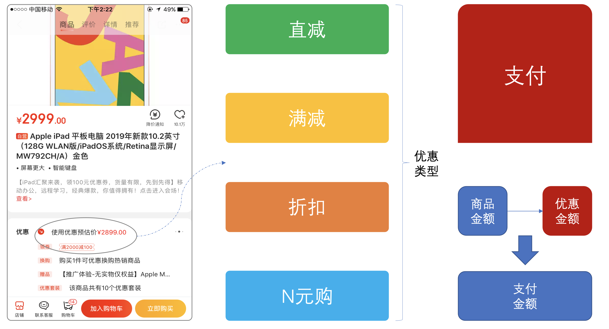
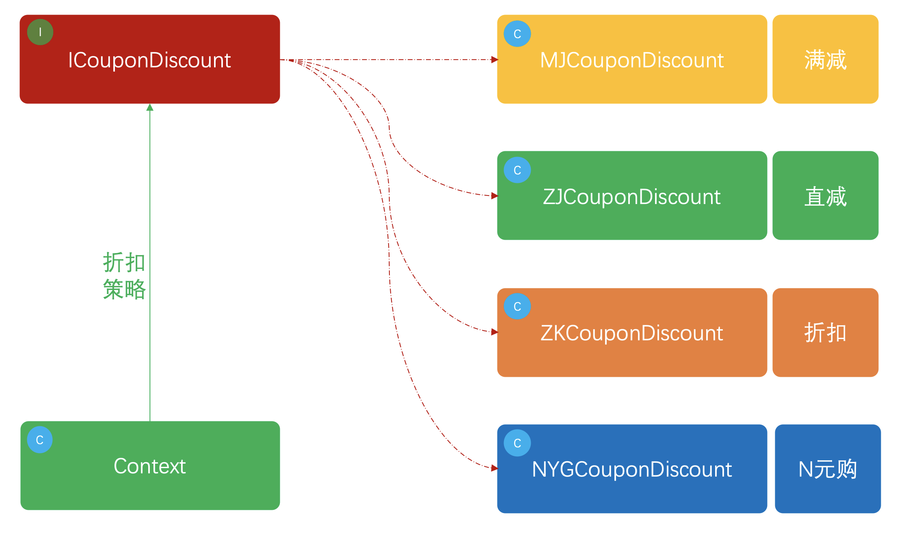

> 本文章仅用于本人学习笔记记录
> 微信：wxid_ygj58saenbjh22（如本文档内容侵权了您的权益，请您通过微信联系到我）

## 策略模式介绍

策略模式是一种行为模式，也是替代大量ifelse的利器。

## 简单例子



## 用一坨坨代码实现

### 代码实现

```
public class CouponDiscountService {

    public double discountAmount(int type, double typeContent, double skuPrice, double typeExt) {
        // 1. 直减券
        if (1 == type) {
            return skuPrice - typeContent;
        }
        // 2. 满减券
        if (2 == type) {
            if (skuPrice < typeExt) return skuPrice;
            return skuPrice - typeContent;
        }
        // 3. 折扣券
        if (3 == type) {
            return skuPrice * typeContent;
        }
        // 4. n元购
        if (4 == type) {
            return typeContent;
        }
        return 0D;
    }

}
```

## 策略模式重构代码

### 策略模式模型结构



### 代码实现

#### 优惠券接口

```
public interface ICouponDiscount<T> {

    /**
     * 优惠券金额计算
     * @param couponInfo 券折扣信息；直减、满减、折扣、N元购
     * @param skuPrice   sku金额
     * @return           优惠后金额
     */
    BigDecimal discountAmount(T couponInfo, BigDecimal skuPrice);

}


```

- 定义了优惠券折扣接口，也增加了泛型用于不同类型的接口可以传递不同的类型参数。
- 接口中包括商品金额以及出参返回最终折扣后的金额，这里在实际开发中会比现在的接口参数多一些，但核心逻辑是这些。

#### 满减

```
public class MJCouponDiscount implements ICouponDiscount<Map<String,String>>  {

    /**
     * 满减计算
     * 1. 判断满足x元后-n元，否则不减
     * 2. 最低支付金额1元
     */
    public BigDecimal discountAmount(Map<String,String> couponInfo, BigDecimal skuPrice) {
        String x = couponInfo.get("x");
        String o = couponInfo.get("n");

        // 小于商品金额条件的，直接返回商品原价
        if (skuPrice.compareTo(new BigDecimal(x)) < 0) return skuPrice;
        // 减去优惠金额判断
        BigDecimal discountAmount = skuPrice.subtract(new BigDecimal(o));
        if (discountAmount.compareTo(BigDecimal.ZERO) < 1) return BigDecimal.ONE;

        return discountAmount;
    }
}

```

#### 直减

```
public class ZJCouponDiscount implements ICouponDiscount<Double>  {

    /**
     * 直减计算
     * 1. 使用商品价格减去优惠价格
     * 2. 最低支付金额1元
     */
    public BigDecimal discountAmount(Double couponInfo, BigDecimal skuPrice) {
        BigDecimal discountAmount = skuPrice.subtract(new BigDecimal(couponInfo));
        if (discountAmount.compareTo(BigDecimal.ZERO) < 1) return BigDecimal.ONE;
        return discountAmount;
    }

}

```

#### 折扣

```
public class ZKCouponDiscount implements ICouponDiscount<Double> {


    /**
     * 折扣计算
     * 1. 使用商品价格乘以折扣比例，为最后支付金额
     * 2. 保留两位小数
     * 3. 最低支付金额1元
     */
    public BigDecimal discountAmount(Double couponInfo, BigDecimal skuPrice) {
        BigDecimal discountAmount = skuPrice.multiply(new BigDecimal(couponInfo)).setScale(2, BigDecimal.ROUND_HALF_UP);
        if (discountAmount.compareTo(BigDecimal.ZERO) < 1) return BigDecimal.ONE;
        return discountAmount;
    }

}

```

#### N元购

```
public class NYGCouponDiscount implements ICouponDiscount<Double> {

    /**
     * n元购购买
     * 1. 无论原价多少钱都固定金额购买
     */
    public BigDecimal discountAmount(Double couponInfo, BigDecimal skuPrice) {
        return new BigDecimal(couponInfo);
    }

}

```

#### 策略控制类

```
public class Context<T> {

    private ICouponDiscount<T> couponDiscount;

    public Context(ICouponDiscount<T> couponDiscount) {
        this.couponDiscount = couponDiscount;
    }

    public BigDecimal discountAmount(T couponInfo, BigDecimal skuPrice) {
        return couponDiscount.discountAmount(couponInfo, skuPrice);
    }

}

```

#### 测试验证

```
@Test
public void test_zj() {
    // 直减；100-10，商品100元
    Context<Double> context = new Context<Double>(new ZJCouponDiscount());
    BigDecimal discountAmount = context.discountAmount(10D, new BigDecimal(100));
    logger.info("测试结果：直减优惠后金额 {}", discountAmount);
}

```

## 总结

- 通过策略设计模式的使用可以把我们方法中的if语句优化掉，大量的if语句使用会让代码难以扩展，也不好维护，同时在后期遇到各种问题也很难维护。在使用这样的设计模式后可以很好的满足隔离性与和扩展性，对于不断新增的需求也非常方便承接。
- 按照个人风格，一般工厂和策略模式一起使用。[工作中结合Spring案例](2021-04-20-design-策略/https://cike863.gitee.io/2020/08/12/2020-08-12-ce-lue-mo-shi/)