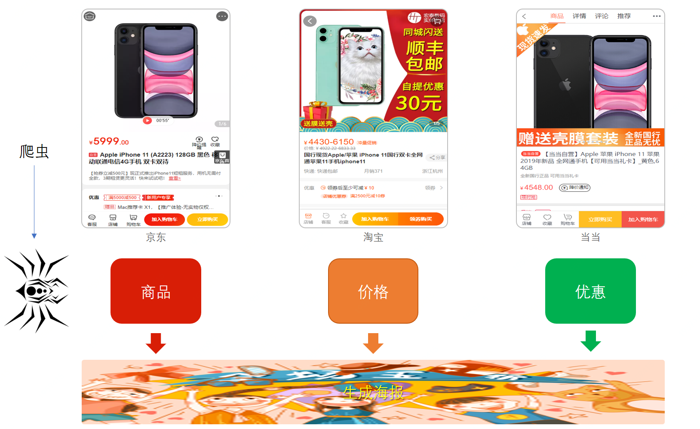
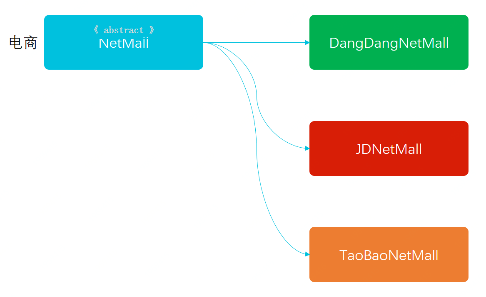

> 本文章仅用于本人学习笔记记录
> 微信：wxid_ygj58saenbjh22（如本文档内容侵权了您的权益，请您通过微信联系到我）

## 模版模式介绍

模板模式的核心设计思路是，通过在抽象类中定义抽象方法的执行顺序，并将抽象方法设定为只有子类实现，但不设计独立访问的方法。

关于模版模式的核心点在于由抽象类定义抽象方法执行策略，也就是说父类规定了好一系列的执行标准，这些标准的串联成一整套业务流程。

就像西游记的99八十一难，基本每一关都是；师傅被掳走、打妖怪、妖怪被收走，具体什么妖怪你自己定义，怎么打你想办法，最后收走还是弄死看你本事，我只定义执行顺序和基本策略，具体的每一难由观音来安排。

## 简单例子



爬取过程分为:模拟登录、爬取信息、生成海报，这三个步骤

### 模版模式模型结构



一个定义了抽象方法执行顺序的核心抽象类，以及三个模拟具体的实现(京东、淘宝、当当)的电商服务。

### 代码实现

#### 定义执行顺序的抽象类

```
/**
 * 基础电商推广服务
 * 1. 生成最优价商品海报
 * 2. 海报含带推广邀请码
 */
public abstract class NetMall {

    protected Logger logger = LoggerFactory.getLogger(NetMall.class);

    String uId;   // 用户ID
    String uPwd;  // 用户密码

    public NetMall(String uId, String uPwd) {
        this.uId = uId;
        this.uPwd = uPwd;
    }

    /**
     * 生成商品推广海报
     *
     * @param skuUrl 商品地址(京东、淘宝、当当)
     * @return 海报图片base64位信息
     */
    public String generateGoodsPoster(String skuUrl) {
        if (!login(uId, uPwd)) return null;             // 1. 验证登录
        Map<String, String> reptile = reptile(skuUrl);  // 2. 爬虫商品
        return createBase64(reptile);                   // 3. 组装海报
    }

    // 模拟登录
    protected abstract Boolean login(String uId, String uPwd);

    // 爬虫提取商品信息(登录后的优惠价格)
    protected abstract Map<String, String> reptile(String skuUrl);

    // 生成商品海报信息
    protected abstract String createBase64(Map<String, String> goodsInfo);

}

```

- 定义可被外部访问的方法generateGoodsPoster，用于生成商品推广海报
- generateGoodsPoster 在方法中定义抽象方法的执行顺序 1 2 3 步
- 提供三个具体的抽象方法，让外部继承方实现；模拟登录(login)、模拟爬取(reptile)、生成海报(createBase64)

#### 模拟爬虫京东

```
public class JDNetMall extends NetMall {

    public JDNetMall(String uId, String uPwd) {
        super(uId, uPwd);
    }

    public Boolean login(String uId, String uPwd) {
        logger.info("模拟京东用户登录 uId：{} uPwd：{}", uId, uPwd);
        return true;
    }

    public Map<String, String> reptile(String skuUrl) {
        String str = HttpClient.doGet(skuUrl);
        Pattern p9 = Pattern.compile("(?<=title\\>).*(?=</title)");
        Matcher m9 = p9.matcher(str);
        Map<String, String> map = new ConcurrentHashMap<String, String>();
        if (m9.find()) {
            map.put("name", m9.group());
        }
        map.put("price", "5999.00");
        logger.info("模拟京东商品爬虫解析：{} | {} 元 {}", map.get("name"), map.get("price"), skuUrl);
        return map;
    }

    public String createBase64(Map<String, String> goodsInfo) {
        BASE64Encoder encoder = new BASE64Encoder();
        logger.info("模拟生成京东商品base64海报");
        return encoder.encode(JSON.toJSONString(goodsInfo).getBytes());
    }

}

```

#### 测试验证

```
@Test
public void test_NetMall() {
    NetMall netMall = new JDNetMall("1000001","*******");
    String base64 = netMall.generateGoodsPoster("https://item.jd.com/100008348542.html");
    logger.info("测试结果：{}", base64);
}
```

## 总结

- 模版模式在定义统一结构也就是执行标准上非常方便，也就很好的控制了后续的实现者不用关心调用逻辑，按照统一方式执行。那么类的继承者只需要关心具体的业务逻辑实现即可。

- 另外模版模式也是为了解决子类通用方法，放到父类中设计的优化。让每一个子类只做子类需要完成的内容，而不需要关心其他逻辑。这样提取公用代码，行为由父类管理，扩展可变部分，也就非常有利于开发拓展和迭代。
- 模板模式的核心设计思路是，通过在抽象类中定义抽象方法的执行顺序，并将抽象方法设定为只有子类实现，但不设计独立访问的方法。
- 关于模版模式的核心点在于由抽象类定义抽象方法执行策略，也就是说父类规定了好一系列的执行标准，这些标准的串联成一整套业务流程。
