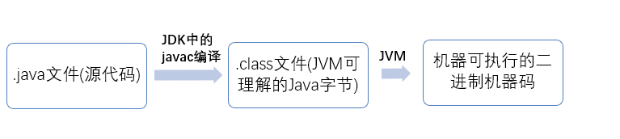
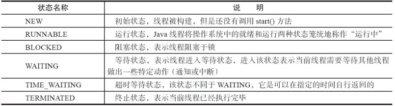
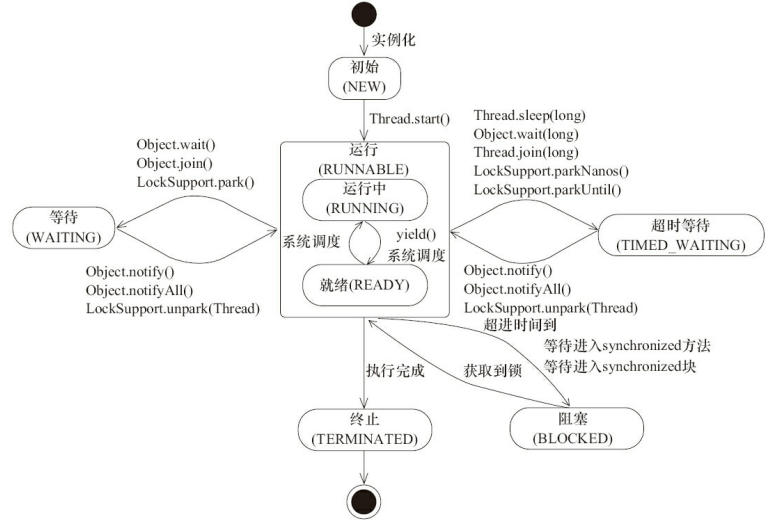
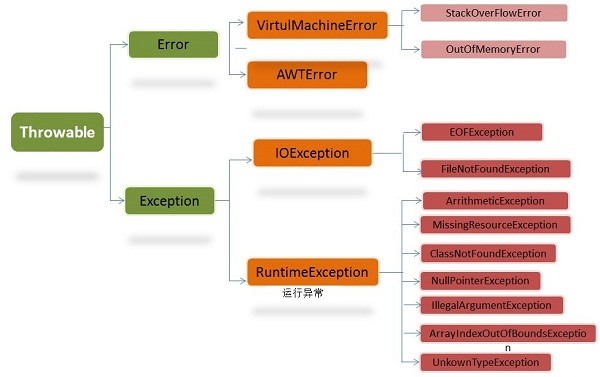
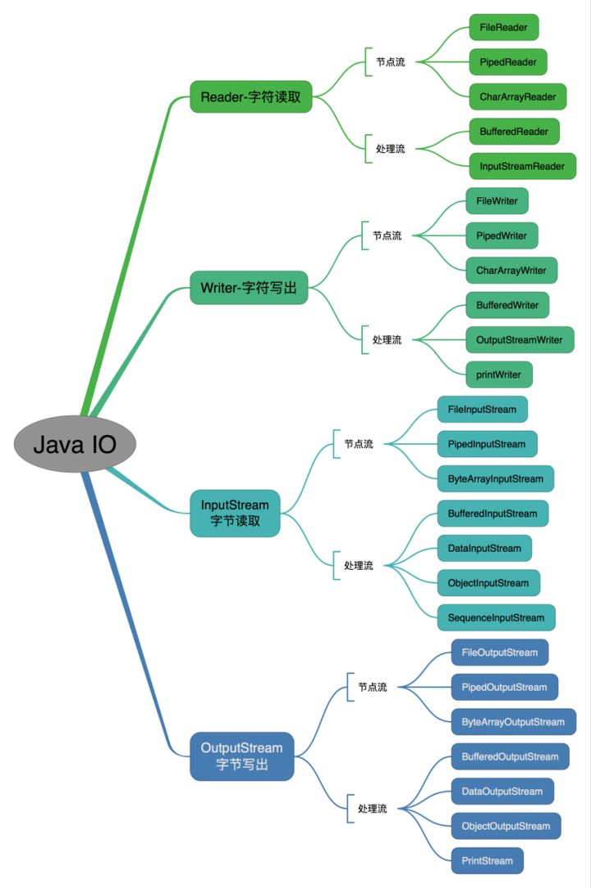
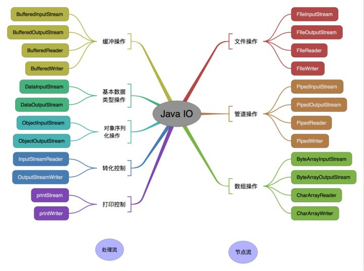

# Java基础

## 1. 面向对象和面向过程的区别
- 面向过程 ：**面向过程性能比面向对象高**。 因为类调用时需要实例化，开销比较大，比较消耗资源，所以当性能是最重要的考量因素的时候，比如单片机、嵌入式开发、Linux/Unix 等一般采用面向过程开发。但是，面向过程没有面向对象易维护、易复用、易扩展。
- 面向对象 ：**面向对象易维护、易复用、易扩展**。 因为面向对象有封装、继承、多态性的特性，所以可以设计出低耦合的系统，使系统更加灵活、更加易于维护。但是，面向对象性能比面向过程低。

## 2. Java 语言有哪些特点?

1. 简单易学；
2. 面向对象（封装，继承，多态）；
3. 平台无关性（ Java 虚拟机实现平台无关性）；
4. 可靠性；
5. 安全性；
6. 支持多线程（ C++ 语言没有内置的多线程机制，因此必须调用操作系统的多线程功能来进行多线程程序设计，而 Java 语言却提供了多线程支持）；
7. 支持网络编程并且很方便（ Java 语言诞生本身就是为简化网络编程设计的，因此 Java 语言不仅支持网络编程而且很方便）；
8. 编译与解释并存；

## 3. 关于 JVM JDK 和 JRE 最详细通俗的解答
- JVM：
Java 虚拟机（JVM）是运行 Java 字节码的虚拟机。JVM 有针对不同系统的特定实现（Windows，Linux，macOS），目的是使用相同的字节码，它们都会给出相同的结果。

- 什么是字节码?采用字节码的好处是什么?

    在 Java 中，JVM 可以理解的代码就叫做字节码（即扩展名为 .class 的文件），它不面向任何特定的处理器，只面向虚拟机。Java 语言通过字节码的方式，在一定程度上解决了传统解释型语言执行效率低的问题，同时又保留了解释型语言可移植的特点。所以 Java 程序运行时比较高效，而且，由于字节码并不针对一种特定的机器，因此，Java 程序无须重新编译便可在多种不同操作系统的计算机上运行。
- Java 程序从源代码到运行一般有下面 3 步：
    
    
    
    总结：Java 虚拟机（JVM）是运行 Java 字节码的虚拟机。JVM 有针对不同系统的特定实现（Windows，Linux，macOS），目的是使用相同的字节码，它们都会给出相同的结果。字节码和不同系统的 JVM 实现是 Java 语言“一次编译，随处可以运行”的关键所在。
    
- JDK 和 JRE：

    JDK 是 Java Development Kit，它是功能齐全的 Java SDK。它拥有 JRE 所拥有的一切，还有编译器（javac）和工具（如 javadoc 和 jdb）。它能够创建和编译程序。
    
    JRE 是 Java 运行时环境。它是运行已编译 Java 程序所需的所有内容的集合，包括 Java 虚拟机（JVM），Java 类库，java 命令和其他的一些基础构件。但是，它不能用于创建新程序。


 ## 4. Java 和 C++的区别?
 
 - 都是面向对象的语言，都支持封装、继承和多态
 - Java 不提供指针来直接访问内存，程序内存更加安全
 - Java 的类是单继承的，C++ 支持多重继承；虽然 Java 的类不可以多继承，但是接口可以多继承。
 - Java 有自动内存管理机制，不需要程序员手动释放无用内存


## 5. 字符型常量和字符串常量的区别?

1. 形式上: 字符常量是单引号引起的一个字符; 字符串常量是双引号引起的若干个字符
2. 含义上: 字符常量相当于一个整型值( ASCII 值),可以参加表达式运算; 字符串常量代表一个地址值(该字符串在内存中存放位置)
3. 占内存大小 字符常量只占 2 个字节; 字符串常量占若干个字节 (注意： char 在 Java 中占两个字节)

## 6. 构造器 Constructor 是否可被 override?
- Constructor 不能被 override（重写）,但是可以 overload（重载）,所以你可以看到一个类中有多个构造函数的情况。

## 7. 重载和重写的区别
1. 重载:
    
    发生在同一个类中，方法名必须相同，参数类型不同、个数不同、顺序不同，方法返回值和访问修饰符可以不同。
2. 重写:

    重写是子类对父类的允许访问的方法的实现过程进行重新编写,发生在子类中，方法名、参数列表必须相同，返回值范围小于等于父类，抛出的异常范围小于等于父类，访问修饰符范围大于等于父类。另外，如果父类方法访问修饰符为 private 则子类就不能重写该方法。也就是说方法提供的行为改变，而方法的外貌并没有改变。

## 8. Java 面向对象编程三大特性: 封装 继承 多态
- 封装
    
    封装把一个对象的属性私有化，同时提供一些可以被外界访问的属性的方法，如果属性不想被外界访问，我们大可不必提供方法给外界访问。但是如果一个类没有提供给外界访问的方法，那么这个类也没有什么意义了。
- 继承

   继承是使用已存在的类的定义作为基础建立新类的技术，新类的定义可以增加新的数据或新的功能，也可以用父类的功能，但不能选择性地继承父类。通过使用继承我们能够非常方便地复用以前的代码。
 
    1. 子类拥有父类对象所有的属性和方法（包括私有属性和私有方法），但是父类中的私有属性和方法子类是无法访问，只是拥有

    2. 子类可以拥有自己属性和方法，即子类可以对父类进行扩展。
    3. 子类可以用自己的方式实现父类的方法。
- 多态

    所谓多态就是指程序中定义的引用变量所指向的具体类型和通过该引用变量发出的方法调用在编程时并不确定，而是在程序运行期间才确定，即一个引用变量到底会指向哪个类的实例对象，该引用变量发出的方法调用到底是哪个类中实现的方法，必须在由程序运行期间才能决定。

    在 Java 中有两种形式可以实现多态：继承（多个子类对同一方法的重写）（继承抽象）和接口（实现接口并覆盖接口中同一方法）。
- 抽象

## 9. String StringBuffer 和 StringBuilder 的区别是什么? String 为什么是不可变的?
- 可变性

    String 类中使用 final 关键字修饰字符数组来保存字符串，private final char value[]，所以 String 对象是不可变的。
    
    而 StringBuilder 与 StringBuffer 都继承自 AbstractStringBuilder 类，在 AbstractStringBuilder 中也是使用字符数组保存字符串char[]value 但是没有用 final 关键字修饰，所以这两种对象都是可变的。
- 线程安全性
   
     String 中的对象是不可变的，也就可以理解为常量，线程安全。。StringBuffer 对方法加了同步锁或者对调用的方法加了同步锁，所以是线程安全的。StringBuilder 并没有对方法进行加同步锁，所以是非线程安全的。
- 性能

    每次对 String 类型进行改变的时候，都会生成一个新的 String 对象，然后将指针指向新的 String 对象。StringBuffer 每次都会对 StringBuffer 对象本身进行操作，而不是生成新的对象并改变对象引用。相同情况下使用 StringBuilder 相比使用 StringBuffer 仅能获得 10%~15% 左右的性能提升，但却要冒多线程不安全的风险。
- 对于三者使用的总结：装箱：将基本类型用它们对应的引用类型包装起来；
    
    1. 操作少量的数据: 适用 String
    2. 单线程操作字符串缓冲区下操作大量数据: 适用 StringBuilder
    3. 多线程操作字符串缓冲区下操作大量数据: 适用 StringBuffer

## 10. 自动装箱与拆箱
- 装箱：将基本类型用它们对应的引用类型包装起来；
- 拆箱：将包装类型转换为基本数据类型；

## 11. 在一个静态方法内调用一个非静态成员为什么是非法的?

由于静态方法可以不通过对象进行调用，因此在静态方法里，不能调用其他非静态变量，也不可以访问非静态变量成员。

## 12. 在 Java 中定义一个不做事且没有参数的构造方法的作用
ava 程序在执行子类的构造方法之前，如果没有用 super()来调用父类特定的构造方法，则会调用父类中“没有参数的构造方法”。因此，如果父类中只定义了有参数的构造方法，而在子类的构造方法中又没有用 super()来调用父类中特定的构造方法，则编译时将发生错误，因为 Java 程序在父类中找不到没有参数的构造方法可供执行。解决办法是在父类里加上一个不做事且没有参数的构造方法。

## 13. 接口和抽象类的区别是什么？
1. 接口的方法默认是 public，所有方法在接口中不能有实现(Java 8 开始接口方法可以有默认实现），而抽象类可以有非抽象的方法。
2. 接口中除了 static、final 变量，不能有其他变量，而抽象类中则不一定。
3. 一个类可以实现多个接口，但只能实现一个抽象类。接口自己本身可以通过 extends 关键字扩展多个接口。
4. 接口方法默认修饰符是 public，抽象方法可以有 public、protected 和 default 这些修饰符（抽象方法就是为了被重写所以不能使用 private 关键字修饰！）。
5. 从设计层面来说，抽象是对类的抽象，是一种模板设计，而接口是对行为的抽象，是一种行为的规范。

## 14. 成员变量与局部变量的区别有哪些？
- 从语法形式上看:成员变量是属于类的，而局部变量是在方法中定义的变量或是方法的参数；成员变量可以被 public,private,static 等修饰符所修饰，而局部变量不能被访问控制修饰符及 static 所修饰；但是，成员变量和局部变量都能被 final 所修饰。
- 从变量在内存中的存储方式来看:如果成员变量是使用static修饰的，那么这个成员变量是属于类的，如果没有使用static修饰，这个成员变量是属于实例的。而对象存在于堆内存，局部变量则存在于栈内存。
- 从变量在内存中的生存时间上看:成员变量是对象的一部分，它随着对象的创建而存在，而局部变量随着方法的调用而自动消失。
- 成员变量如果没有被赋初值:则会自动以类型的默认值而赋值（一种情况例外:被 final 修饰的成员变量也必须显式地赋值），而局部变量则不会自动赋值。

## 15. 一个类的构造方法的作用是什么? 若一个类没有声明构造方法，该程序能正确执行吗? 为什么?

- 主要作用是完成对类对象的初始化工作。可以执行。因为一个类即使没有声明构造方法也会有默认的不带参数的构造方法。

## 16. 构造方法有哪些特性？
- 名字与类名相同。
- 没有返回值，但不能用 void 声明构造函数。
- 生成类的对象时自动执行，无需调用。

## 17. 静态方法和实例方法有何不同
- 在外部调用静态方法时，可以使用"类名.方法名"的方式，也可以使用"对象名.方法名"的方式。而实例方法只有后面这种方式。也就是说，调用静态方法可以无需创建对象。
- 静态方法在访问本类的成员时，只允许访问静态成员（即静态成员变量和静态方法），而不允许访问实例成员变量和实例方法；实例方法则无此限制。

## 18. 对象的相等与指向他们的引用相等,两者有什么不同?
- 对象的相等，比的是内存中存放的内容是否相等。而引用相等，比较的是他们指向的内存地址是否相等。

## 19. 在调用子类构造方法之前会先调用父类没有参数的构造方法,其目的是?
- 帮助子类做初始化工作。

## ****20. == 与 equals(重要)****
- == : 它的作用是判断两个对象的地址是不是相等。即，判断两个对象是不是同一个对象(基本数据类型==比较的是值，引用数据类型==比较的是内存地址)。
- equals() : 它的作用也是判断两个对象是否相等。但它一般有两种使用情况：
1. 情况 1：类没有覆盖 equals() 方法。则通过 equals() 比较该类的两个对象时，等价于通过“==”比较这两个对象。
2. 情况 2：类覆盖了 equals() 方法。一般，我们都覆盖 equals() 方法来比较两个对象的内容是否相等；若它们的内容相等，则返回 true (即，认为这两个对象相等)。

```
public class test1 {
    public static void main(String[] args) {
        String a = new String("ab"); // a 为一个引用
        String b = new String("ab"); // b为另一个引用,对象的内容一样
        String aa = "ab"; // 放在常量池中
        String bb = "ab"; // 从常量池中查找
        if (aa == bb) // true
            System.out.println("aa==bb");
        if (a == b) // false，非同一对象
            System.out.println("a==b");
        if (a.equals(b)) // true
            System.out.println("aEQb");
        if (42 == 42.0) { // true
            System.out.println("true");
        }
    }
}
```
说明：
- String 中的 equals 方法是被重写过的，因为 object 的 equals 方法是比较的对象的内存地址，而 String 的 equals 方法比较的是对象的值。
- 当创建 String 类型的对象时，虚拟机会在常量池中查找有没有已经存在的值和要创建的值相同的对象，如果有就把它赋给当前引用。如果没有就在常量池中重新创建一个 String 对象。

## 21. hashCode 与 equals (重要)
1. hashCode（）介绍

     hashCode() 的作用是获取哈希码，也称为散列码；它实际上是返回一个 int 整数。这个哈希码的作用是确定该对象在哈希表中的索引位置。hashCode() 定义在 JDK 的 Object.java 中，这就意味着 Java 中的任何类都包含有 hashCode() 函数。
    
     散列表存储的是键值对(key-value)，它的特点是：能根据“键”快速的检索出对应的“值”。这其中就利用到了散列码！（可以快速找到所需要的对象）
2. 为什么要有 hashCode
    
    我们先以“HashSet 如何检查重复”为例子来说明为什么要有 hashCode： 当你把对象加入 HashSet 时，HashSet 会先计算对象的 hashcode 值来判断对象加入的位置，同时也会与该位置其他已经加入的对象的 hashcode 值作比较，如果没有相符的 hashcode，HashSet 会假设对象没有重复出现。但是如果发现有相同 hashcode 值的对象，这时会调用 equals()方法来检查 hashcode 相等的对象是否真的相同。如果两者相同，HashSet 就不会让其加入操作成功。如果不同的话，就会重新散列到其他位置。（摘自我的 Java 启蒙书《Head first java》第二版）。这样我们就大大减少了 equals 的次数，相应就大大提高了执行速度。

    通过我们可以看出：hashCode() 的作用就是获取哈希码，也称为散列码；它实际上是返回一个 int 整数。这个哈希码的作用是确定该对象在哈希表中的索引位置。hashCode()在散列表中才有用，在其它情况下没用。在散列表中 hashCode() 的作用是获取对象的散列码，进而确定该对象在散列表中的位置。
    
3. hashCode（）与 equals（）的相关规定
- 如果两个对象相等，则 hashcode 一定也是相同的
- 两个对象相等,对两个对象分别调用 equals 方法都返回 true
- 两个对象有相同的 hashcode 值，它们不一定是相等的
- 因此，equals 方法被覆盖过，则 hashCode 方法也必须被覆盖
- hashCode() 的默认行为是对堆上的对象产生独特值。如果没有重写 hashCode()，则该 class 的两个对象无论如何都不会相等（即使这两个对象指向相同的数据）

## 22. 简述线程、程序、进程的基本概念。以及他们之间关系是什么?
- 线程与进程相似，但线程是一个比进程更小的执行单位。一个进程在其执行的过程中可以产生多个线程。与进程不同的是同类的多个线程共享同一块内存空间和一组系统资源，所以系统在产生一个线程，或是在各个线程之间作切换工作时，负担要比进程小得多，也正因为如此，线程也被称为轻量级进程。
- 程序是含有指令和数据的文件，被存储在磁盘或其他的数据存储设备中，也就是说程序是静态的代码。
- 进程是程序的一次执行过程，是系统运行程序的基本单位，因此进程是动态的。线程是进程划分成的更小的运行单位。线程和进程最大的不同在于基本上各进程是独立的，而各线程则不一定，因为同一进程中的线程极有可能会相互影响。从另一角度来说，进程属于操作系统的范畴，主要是同一段时间内，可以同时执行一个以上的程序，而线程则是在同一程序内几乎同时执行一个以上的程序段。

## 23. 线程有哪些基本状态?





- 线程创建之后它将处于 NEW（新建） 状态，调用 start() 方法后开始运行，线程这时候处于 READY（可运行） 状态。可运行状态的线程获得了 cpu 时间片（timeslice）后就处于 RUNNING（运行） 状态。
- 当线程执行 wait()方法之后，线程进入 WAITING（等待）状态。进入等待状态的线程需要依靠其他线程的通知才能够返回到运行状态，而 TIME_WAITING(超时等待) 状态相当于在等待状态的基础上增加了超时限制，比如通过 sleep（long millis）方法或 wait（long millis）方法可以将 Java 线程置于 TIMED WAITING 状态。当超时时间到达后 Java 线程将会返回到 RUNNABLE 状态。当线程调用同步方法时，在没有获取到锁的情况下，线程将会进入到 BLOCKED（阻塞） 状态。线程在执行 Runnable 的run()方法之后将会进入到 TERMINATED（终止） 状态。

## 24 关于 final 关键字的一些总结
- final 关键字主要用在三个地方：变量、方法、类。
1. 对于一个 final 变量，如果是基本数据类型的变量，则其数值一旦在初始化之后便不能更改；如果是引用类型的变量，则在对其初始化之后便不能再让其指向另一个对象。
2. 当用 final 修饰一个类时，表明这个类不能被继承。final 类中的所有成员方法都会被隐式地指定为 final 方法。
3. 使用 final 方法的原因有两个。第一个原因是把方法锁定，以防任何继承类修改它的含义；第二个原因是效率。在早期的 Java 实现版本中，会将 final 方法转为内嵌调用。但是如果方法过于庞大，可能看不到内嵌调用带来的任何性能提升（现在的 Java 版本已经不需要使用 final 方法进行这些优化了）。类中所有的 private 方法都隐式地指定为 final。

## 25 Java 中的异常处理
- Java 异常类层次结构图


- 在 Java 中，所有的异常都有一个共同的祖先 java.lang 包中的 Throwable 类。Throwable： 有两个重要的子类：Exception（异常） 和 Error（错误） ，二者都是 Java 异常处理的重要子类，各自都包含大量子类。
- Error（错误）:是程序无法处理的错误，表示运行应用程序中较严重问题。大多数错误与代码编写者执行的操作无关，而表示代码运行时 JVM（Java 虚拟机）出现的问题。例如，Java 虚拟机运行错误（Virtual MachineError），当 JVM 不再有继续执行操作所需的内存资源时，将出现 OutOfMemoryError。这些异常发生时，Java 虚拟机（JVM）一般会选择线程终止。
- Exception（异常）:是程序本身可以处理的异常。Exception 类有一个重要的子类 RuntimeException。RuntimeException 异常由 Java 虚拟机抛出。NullPointerException（要访问的变量没有引用任何对象时，抛出该异常）、ArithmeticException（算术运算异常，一个整数除以 0 时，抛出该异常）和 ArrayIndexOutOfBoundsException （下标越界异常）。
- **注意：异常和错误的区别：异常能被程序本身处理，错误是无法处理。**
- Throwable 类常用方法:
    
    1. public string getMessage():返回异常发生时的简要描述
    2. public string toString():返回异常发生时的详细信息
    3. public string getLocalizedMessage():返回异常对象的本地化信息。使用 Throwable 的子类覆盖这个方法，可以生成本地化信息。如果子类没有覆盖该方法，则该方法返回的信息与 getMessage（）返回的结果相同
    4. public void printStackTrace():在控制台上打印 Throwable 对象封装的异常信息
- 异常处理总结
 
    1. try 块： 用于捕获异常。其后可接零个或多个 catch 块，如果没有 catch 块，则必须跟一个 finally 块。
    2. catch 块： 用于处理 try 捕获到的异常。
    3. **finally 块： 无论是否捕获或处理异常，finally 块里的语句都会被执行。当在 try 块或 catch 块中遇到 return 语句时，finally 语句块将在方法返回之前被执行。**
- finally 块： 无论是否捕获或处理异常，finally 块里的语句都会被执行。当在 try 块或 catch 块中遇到 return 语句时，finally 语句块将在方法返回之前被执行。

    1. 在 finally 语句块第一行发生了异常。 因为在其他行，finally 块还是会得到执行
    2. 在前面的代码中用了 System.exit(int)已退出程序。 exit 是带参函数 ；若该语句在异常语句之后，finally 会执行
    
```
    public static int f(int value) {
        try {
            return value * value;
        } finally {
            if (value == 2) {
                return 0;
            }
        }
    }
    // 如果调用 f(2)，返回值将是 0，因为 finally 语句的返回值覆盖了 try 语句块的返回值。
```

## 26 Java 序列化中如果有些字段不想进行序列化，怎么办？
- 对于不想进行序列化的变量，使用 transient 关键字修饰。
- transient 关键字的作用是：阻止实例中那些用此关键字修饰的的变量序列化；当对象被反序列化时，被 transient 修饰的变量值不会被持久化和恢复。transient 只能修饰变量，不能修饰类和方法。

## 27 获取用键盘输入常用的两种方法
1. 方法 1：通过 Scanner

```
Scanner input = new Scanner(System.in);
String s  = input.nextLine();
input.close();
```
2. 方法 2：通过 BufferedReader

```
BufferedReader input = new BufferedReader(new InputStreamReader(System.in));
String s = input.readLine();
```

## 28 Java 中 IO 流
1. Java 中 IO 流分为几种?
- 按照流的流向分，可以分为输入流和输出流；
- 按照操作单元划分，可以划分为字节流和字符流；
- 按照流的角色划分为节点流和处理流。
2. Java I0 流的 40 多个类都是从如下 4 个抽象类基类中派生出来的。
- **InputStream/Reader: 所有的输入流的基类，前者是字节输入流，后者是字符输入流。**
- **OutputStream/Writer: 所有输出流的基类，前者是字节输出流，后者是字符输出流。**




3. 既然有了字节流,为什么还要有字符流?
- 字符流是由 Java 虚拟机将字节转换得到的，问题就出在这个过程还算是非常耗时，并且，如果我们不知道编码类型就很容易出现乱码问题。所以， I/O 流就干脆提供了一个直接操作字符的接口，方便我们平时对字符进行流操作。如果音频文件、图片等媒体文件用字节流比较好，如果涉及到字符的话使用字符流比较好。
4. BIO,NIO,AIO 有什么区别?
- BIO (Blocking I/O): 同步阻塞 I/O 模式，数据的读取写入必须阻塞在一个线程内等待其完成。在活动连接数不是特别高（小于单机 1000）的情况下，这种模型是比较不错的，可以让每一个连接专注于自己的 I/O 并且编程模型简单，也不用过多考虑系统的过载、限流等问题。线程池本身就是一个天然的漏斗，可以缓冲一些系统处理不了的连接或请求。但是，当面对十万甚至百万级连接的时候，传统的 BIO 模型是无能为力的。因此，我们需要一种更高效的 I/O 处理模型来应对更高的并发量。
- NIO (Non-blocking/New I/O): NIO 是一种同步非阻塞的 I/O 模型，在 Java 1.4 中引入了 NIO 框架，对应 java.nio 包，提供了 Channel , Selector，Buffer 等抽象。NIO 中的 N 可以理解为 Non-blocking，不单纯是 New。它支持面向缓冲的，基于通道的 I/O 操作方法。 NIO 提供了与传统 BIO 模型中的 Socket 和 ServerSocket 相对应的 SocketChannel 和 ServerSocketChannel 两种不同的套接字通道实现,两种通道都支持阻塞和非阻塞两种模式。阻塞模式使用就像传统中的支持一样，比较简单，但是性能和可靠性都不好；非阻塞模式正好与之相反。对于低负载、低并发的应用程序，可以使用同步阻塞 I/O 来提升开发速率和更好的维护性；对于高负载、高并发的（网络）应用，应使用 NIO 的非阻塞模式来开发
- AIO (Asynchronous I/O): AIO 也就是 NIO 2。在 Java 7 中引入了 NIO 的改进版 NIO 2,它是异步非阻塞的 IO 模型。异步 IO 是基于事件和回调机制实现的，也就是应用操作之后会直接返回，不会堵塞在那里，当后台处理完成，操作系统会通知相应的线程进行后续的操作。AIO 是异步 IO 的缩写，虽然 NIO 在网络操作中，提供了非阻塞的方法，但是 NIO 的 IO 行为还是同步的。对于 NIO 来说，我们的业务线程是在 IO 操作准备好时，得到通知，接着就由这个线程自行进行 IO 操作，IO 操作本身是同步的。查阅网上相关资料，我发现就目前来说 AIO 的应用还不是很广泛，Netty 之前也尝试使用过 AIO，不过又放弃了。

## 29. 常见关键字总结:static,final,this,super
1. final 关键字
2. static 关键字
-  修饰成员变量和成员方法: 被 static 修饰的成员属于类，不属于单个这个类的某个对象，被类中所有对象共享，可以并且建议通过类名调用。被static 声明的成员变量属于静态成员变量，静态变量 存放在 Java 内存区域的方法区。调用格式：类名.静态变量名 类名.静态方法名() 
-  静态代码块: 静态代码块定义在类中方法外, 静态代码块在非静态代码块之前执行(静态代码块—>非静态代码块—>构造方法)。 该类不管创建多少对象，静态代码块只执行一次.
3. this 关键字
- this关键字用于引用类的当前实例。
4. super 关键字
 - super关键字用于从子类访问父类的变量和方法。
 - 在构造器中使用 super（） 调用父类中的其他构造方法时，该语句必须处于构造器的首行，否则编译器会报错。另外，this 调用本类中的其他构造方法时，也要放在首行。
 - this、super不能用在static方法中。

## 30. 深拷贝 vs 浅拷贝
- 浅拷贝：对基本数据类型进行值传递，对引用数据类型进行引用传递般的拷贝，此为浅拷贝。
- 深拷贝：对基本数据类型进行值传递，对引用数据类型，创建一个新的对象，并复制其内容，此为深拷贝。