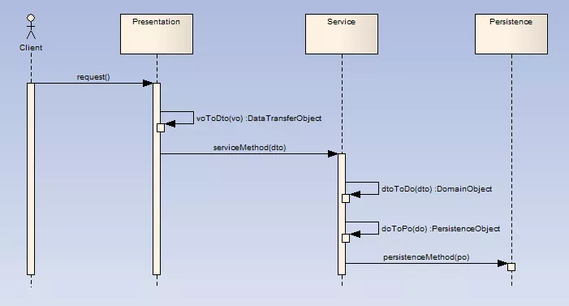

## 概念

- VO（View Object）：视图对象，用于展示层，它的作用是把某个指定页面（或组件）的所有数据封装起来。
- DTO（Data Transfer Object）：数据传输对象，泛指用于展示层与服务层之间的数据传输对象。
- DO（Domain Object）：**领域对象**，就是从现实世界中抽象出来的有形或无形的业务实体。
- PO（Persistent Object）：持久化对象，它跟持久层（通常是关系型数据库）的数据结构形成一一对应的映射关系，如果持久层是关系型数据库，那么，数据表中的每个字段（或若干个）就对应PO的一个（或若干个）属性。

## 模型

1. 用户发出请求（可能是填写表单），表单的数据在展示层被匹配为VO。
2. 展示层把VO转换为服务层对应方法所要求的DTO，传送给服务层。
3. 服务层首先根据DTO的数据构造（或重建）一个DO，调用DO的业务方法完成具体业务。
4. 服务层把DO转换为持久层对应的PO（可以使用ORM工具，也可以不用），调用持久层的持久化方法，把PO传递给它，完成持久化操作。