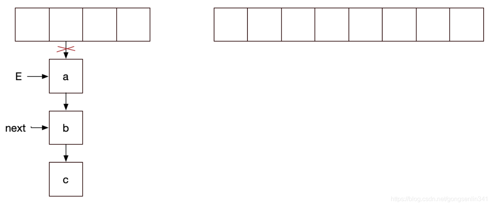
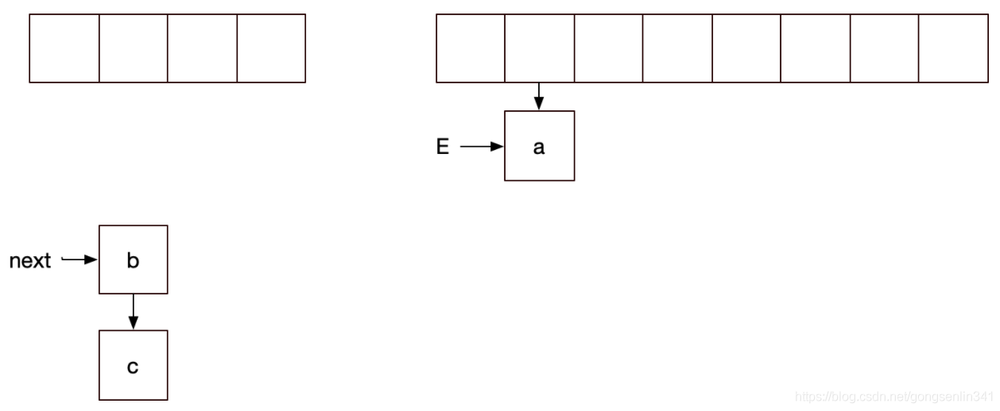

## 扰动函数

HashMap存放元素时候有这样一段代码来处理哈希值，这是java 8的散列值扰动函数，用于优化散列效果

```
static final int hash(Object key) {
    int h;
    return (key == null) ? 0 : (h = key.hashCode()) ^ (h >>> 16);
}
```

### 为什么使用扰动函数

理论上来说字符串的hashCode是一个int类型值，那可以直接作为数组下标了，且不会出现碰撞。但是这个hashCode的取值范围是[-2147483648, 2147483647]，有将近40亿的长度，谁也不能把数组初始化的这么大，内存也是放不下的。

我们默认初始化的Map大小是16个长度 DEFAULT_INITIAL_CAPACITY = 1 << 4，所以获取的Hash值并不能直接作为下标使用，需要与数组长度进行取模运算得到一个下标值。

hashMap源码这里不只是直接获取哈希值，还进行了一次扰动计算，(h = key.hashCode()) ^ (h >>> 16)。把哈希值右移16位，也就正好是自己长度的一半，之后与原哈希值做异或运算，这样就混合了原哈希值中的高位和低位，增大了随机性。计算方式如下图；


**使用扰动函数就是为了增加随机性，让数据元素更加均衡的散列，减少碰撞。**

## 初始化容量和负载因子

选择一个合理的大小下进行扩容，默认值0.75就是说当阀值容量占了3/4时赶紧扩容，减少Hash碰撞。

同时0.75是一个默认构造值，在创建HashMap也可以调整，比如你希望用更多的空间换取时间，可以把负载因子调的更小一些，减少碰撞。

## 扩容元素拆分

扩容最直接的问题，就是需要把元素拆分到新的数组中。拆分元素的过程中，原jdk1.7中会需要重新计算哈希值，但是到jdk1.8中已经进行优化，不在需要重新计算，提升了拆分的性能，设计的还是非常巧妙的。

当put时，如果发现目前的bucket占用程度已经超过了Load Factor所希望的比例，那么就会发生resize。在resize的过程，简单的说就是把bucket扩充为2倍，之后重新计算index，把节点再放到新的bucket中。

当超过限制的时候会resize，然而又因为我们使用的是2次幂的扩展(指长度扩为原来2倍)，所以，元素的位置要么是在原位置，要么是在原位置再移动2次幂的位置。


因此元素在重新计算 hash 之后，因为n变为2倍，那么 n-1 的 mask 范围在高位多1bit(红色)，因此新的index就会发生这样的变化：


因此，我们在扩充HashMap的时候，不需要重新计算hash，只需要看看原来的hash值新增的那个bit是1还是0就好了，是0的话索引没变，是1的话索引变成“原索引+oldCap”。可以看看下图为16扩充为32的resize示意图：


### 扩容并发死循环情况

HashMap1.7当中，扩容的时候，采用的是头插法转移结点，在多线程并发的情况下会造成链表死循环的问题。

假设有两个线程，线程1和线程2，两个线程进行hashMap的put操作，触发了扩容。

下面是扩容的时候结点转移的关键代码

```
void transfer(Entry[] newTable) {
      Entry[] src = table; 
      int newCapacity = newTable.length;
      for (int j = 0; j < src.length; j++) { 
          Entry<K,V> e = src[j];           
          if (e != null) {//两个线程都先进入if
              src[j] = null; 
              do { 
                  Entry<K,V> next = e.next; 
                 int i = indexFor(e.hash, newCapacity);
                 e.next = newTable[i]; //线程1 这里还没执行 停下
                 newTable[i] = e;  
                 e = next;             
             } while (e != null);
         }
     }
 }
```

线程1和线程2 都进入if，然后线程1没有拿到cpu的资源在上面代码注释的地方停下了。此时的变量指针如下图所示：


记住 线程1中 E变量指向a结点，next变量指向b结点。

下面是线程2 拿到cpu的资源，执行结点转移






线程2停下，轮到线程1

因为之前线程1中E变量指向的是a结点，next变量指向的是b结点，所以如下图所示：


再来看看 刚才线程是在e.next = newTable[i] 这句代码还没执行的时候停下的，那么现在就要执行这一句代码

```
void transfer(Entry[] newTable) {
      Entry[] src = table; 
      int newCapacity = newTable.length;
      for (int j = 0; j < src.length; j++) { 
          Entry<K,V> e = src[j];           
          if (e != null) {//两个线程都先进入if
              src[j] = null; 
              do { 
                  Entry<K,V> next = e.next; 
                 int i = indexFor(e.hash, newCapacity);
                 e.next = newTable[i]; //线程1刚才在这里停下，所以现在从这一句代码开始执行
                 newTable[i] = e;  
                 e = next;             
             } while (e != null);
         }
     }
 }

```

此时线程1 执行代码之后，就造成了链表的死循环，结果如下：


java1.8改为尾插法，防止环化。