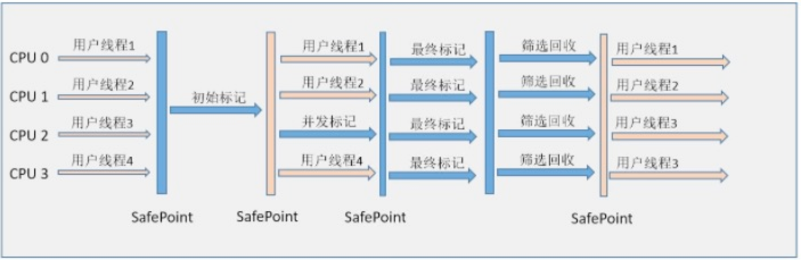
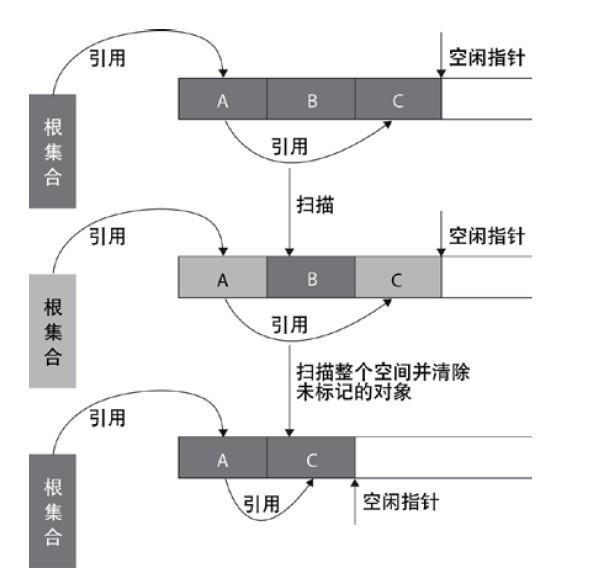
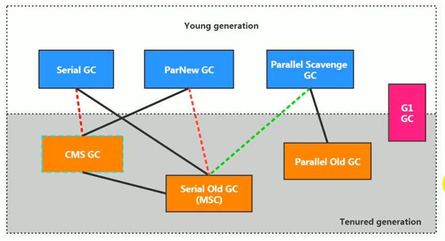

## 1 介绍下 Java 内存区域(运行时数据区)
- JDK 1.8之前：

    
- JDK 1.8 ：

    
- 程序计数器：

    注意：程序计数器是唯一一个不会出现 OutOfMemoryError 的内存区域，它的生命周期随着线程的创建而创建，随着线程的结束而死亡。
   
    1. 字节码解释器通过改变程序计数器来依次读取指令，从而实现代码的流程控制，如：顺序执行、选择、循环、异常处理。

    2. 在多线程的情况下，程序计数器用于记录当前线程执行的位置，从而当线程被切换回来的时候能够知道该线程上次运行到哪儿了。
- Java 虚拟机栈
    
    Java 内存可以粗糙的区分为堆内存（Heap）和栈内存(Stack),其中栈就是现在说的虚拟机栈，或者说是虚拟机栈中局部变量表部分。 

    局部变量表主要存放了编译器可知的各种数据类型（boolean、byte、char、short、int、float、long、double）、对象引用（reference类型，它不同于对象本身，可能是一个指向对象起始地址的引用指针，也可能是指向一个代表对象的句柄或其他与此对象相关的位置）。
    
    Java 虚拟机栈会出现两种异常：StackOverFlowError 和 OutOfMemoryError。
    
     - StackOverFlowError： 若Java虚拟机栈的内存大小不允许动态扩展，那么当线程请求栈的深度超过当前Java虚拟机栈的最大深度的时候，就抛出StackOverFlowError异常。
     - OutOfMemoryError： 若 Java 虚拟机栈的内存大小允许动态扩展，且当线程请求栈时内存用完了，无法再动态扩展了，此时抛出OutOfMemoryError异常。
    
    Java 虚拟机栈也是线程私有的，每个线程都有各自的Java虚拟机栈，而且随着线程的创建而创建，随着线程的死亡而死亡。Java方法有两种返回方式：
    
    Java 栈可用类比数据结构中栈，Java 栈中保存的主要内容是栈帧，每一次函数调用都会有一个对应的栈帧被压入Java栈，每一个函数调用结束后，都会有一个栈帧被弹出。Java方法有两种返回方式：
    - return 语句。
    - 抛出异常。
   
    不管哪种返回方式都会导致栈帧被弹出。
- 本地方法栈

    和虚拟机栈所发挥的作用非常相似，区别是： 虚拟机栈为虚拟机执行 Java 方法 （也就是字节码）服务，而本地方法栈则为虚拟机使用到的 Native 方法服务。 在 HotSpot 虚拟机中和 Java 虚拟机栈合二为一。
    
    本地方法被执行的时候，在本地方法栈也会创建一个栈帧，用于存放该本地方法的局部变量表、操作数栈、动态链接、出口信息。
    
    方法执行完毕后相应的栈帧也会出栈并释放内存空间，也会出现 StackOverFlowError 和 OutOfMemoryError 两种异常。
    
- 堆

    **Java 虚拟机所管理的内存中最大的一块，Java 堆是所有线程共享的一块内存区域，在虚拟机启动时创建。此内存区域的唯一目的就是存放对象实例，几乎所有的对象实例以及数组都在这里分配内存。**
    
    **Java 堆是垃圾收集器管理的主要区域**，因此也被称作GC堆（Garbage Collected Heap）.从垃圾回收的角度，由于现在收集器基本都采用分代垃圾收集算法，所以Java堆还可以细分为：新生代和老年代：再细致一点有：Eden空间、From Survivor、To Survivor空间等。**进一步划分的目的是更好地回收内存，或者更快地分配内存。**
    
    
    
    上图所示的 eden区、s0区、s1区都属于新生代，tentired 区属于老年代。大部分情况，对象都会首先在 Eden 区域分配，在一次新生代垃圾回收后，如果对象还存活，则会进入 s0 或者 s1，并且对象的年龄还会加 1(Eden区->Survivor 区后对象的初始年龄变为1)，当它的年龄增加到一定程度（默认为15岁），就会被晋升到老年代中。对象晋升到老年代的年龄阈值，可以通过参数 -XX:MaxTenuringThreshold 来设置。
    
- 方法区

    方法区与 Java 堆一样，是各个线程共享的内存区域，它用于存储已被虚拟机加载的类信息、常量、静态变量、即时编译器编译后的代码等数据。虽然Java虚拟机规范把方法区描述为堆的一个逻辑部分，但是它却有一个别名叫做 Non-Heap（非堆），目的应该是与 Java 堆区分开来。
    
    **方法区也被称为永久代。** 相对而言，垃圾收集行为在这个区域是比较少出现的，但并非数据进入方法区后就“永久存在”了。
   
    JDK 1.8 的时候，方法区（HotSpot的永久代）被彻底移除了（JDK1.7就已经开始了），取而代之是元空间，元空间使用的是直接内存。
    
    1. 为什么要将永久代(PermGen)替换为元空间(MetaSpace)呢?
    
         整个永久代有一个 JVM 本身设置固定大小上线，无法进行调整，而元空间使用的是直接内存，受本机可用内存的限制，并且永远不会得到java.lang.OutOfMemoryError。你可以使用 -XX：MaxMetaspaceSize 标志设置最大元空间大小，默认值为 unlimited，这意味着它只受系统内存的限制。-XX：MetaspaceSize 调整标志定义元空间的初始大小如果未指定此标志，则 Metaspace 将根据运行时的应用程序需求动态地重新调整大小。
- 运行时常量池

    运行时常量池是方法区的一部分。Class 文件中除了有类的版本、字段、方法、接口等描述信息外，还有常量池信息（用于存放编译期生成的各种字面量和符号引用）
    
    既然运行时常量池时方法区的一部分，自然受到方法区内存的限制，当常量池无法再申请到内存时会抛出 OutOfMemoryError 异常。
    
    **DK1.7及之后版本的 JVM 已经将运行时常量池从方法区中移了出来，在 Java 堆（Heap）中开辟了一块区域存放运行时常量池。**

    
    
- 直接内存

    直接内存并不是虚拟机运行时数据区的一部分，也不是虚拟机规范中定义的内存区域，但是这部分内存也被频繁地使用。而且也可能导致 OutOfMemoryError 异常出现。
    
### 总结

- 线程私有的是JAVA 虚拟机栈、本地方法栈、程序计数器；线程共享的是堆和方法区。
- Java 虚拟机栈：虚拟机栈中主要保存了局部变量，包含各种数据类型（boolean、byte、char、short、int、float、long、double）和对象引用（reference类型）。Java 虚拟机栈会出现两种异常：StackOverFlowError 和 OutOfMemoryError。
- 本地方法栈：本地方法栈和和虚拟机栈所发挥的作用非常相似。两者的区别在于：虚拟机栈执行的是JAVA方法，而本地方法栈调用的是nvtice方法。也会出现 StackOverFlowError 和 OutOfMemoryError 两种异常。
- 程序计数器：程序计数器实现代码的流程控制，如：顺序执行、选择、循环、异常处理。在多线程的情况下，程序计数器用于记录当前线程执行的位置，从而当线程被切换回来的时候能够知道该线程上次运行到哪儿了。程序计数器是唯一一个不会出现 OutOfMemoryError 的内存区域.
- 堆：堆存放的是对象实例，几乎所有的对象实例以及数组都在这里分配内存。堆是垃圾收集器管理的主要区域，因此也被称作GC堆.
- 方法区：方法区主要存储加载的类信息、常量、静态变量等。方法区也被称为永久代。在JDK 1.8 的时候，方法区（背取代成元空间，元空间使用的是直接内存。因为方法区受jvm的大小配置限制，而元空间直接受机器的内存管理，永远不会得到java.lang.OutOfMemoryError。
- 运行时常量池：常量池是方法区的一部分。主要存放符号引用。会抛出 OutOfMemoryError 异常。DK1.7及之后版本的 JVM 已经将运行时常量池从方法区中移了出来，在 Java 堆（Heap）中开辟了一块区域存放运行时常量池。

## **2 说一下Java对象的创建过程**
**下图便是 Java 对象的创建过程，建议最好是能默写出来，并且要掌握每一步在做什么**

    
1. ①类加载检查： 虚拟机遇到一条 new 指令时，首先将去检查这个指令的参数是否能在常量池中定位到这个类的符号引用，并且检查这个符号引用代表的类是否已被加载过、解析和初始化过。如果没有，那必须先执行相应的类加载过程。
    
2. ②分配内存： 在类加载检查通过后，接下来虚拟机将为新生对象分配内存。对象所需的内存大小在类加载完成后便可确定，为对象分配空间的任务等同于把一块确定大小的内存从 Java 堆中划分出来。分配方式有 “指针碰撞” 和 “空闲列表” 两种，选择那种分配方式由 Java 堆是否规整决定，而Java堆是否规整又由所采用的垃圾收集器是否带有压缩整理功能决定。
    
    内存分配的两种方式：（补充内容，需要掌握）
       
     选择以上两种方式中的哪一种，取决于 Java 堆内存是否规整。而 Java 堆内存是否规整，取决于 GC 收集器的算法是"标记-清除"，还是"标记-整理"（也称作"标记-压缩"），值得注意的是，复制算法内存也是规整的
         
     
        
    内存分配并发问题（补充内容，需要掌握）
        
    在创建对象的时候有一个很重要的问题，就是线程安全，因为在实际开发过程中，创建对象是很频繁的事情，作为虚拟机来说，必须要保证线程是安全的，通常来讲，虚拟机采用两种方式来保证线程安全：
        
     - CAS+失败重试： CAS 是乐观锁的一种实现方式。所谓乐观锁就是，每次不加锁而是假设没有冲突而去完成某项操作，如果因为冲突失败就重试，直到成功为止。虚拟机采用 CAS 配上失败重试的方式保证更新操作的原子性。
     - TLAB： 为每一个线程预先在Eden区分配一块儿内存，JVM在给线程中的对象分配内存时，首先在TLAB分配，当对象大于TLAB中的剩余内存或TLAB的内存已用尽时，再采用上述的CAS进行内存分配
3. ③初始化零值： 内存分配完成后，虚拟机需要将分配到的内存空间都初始化为零值（不包括对象头），这一步操作保证了对象的实例字段在 Java 代码中可以不赋初始值就直接使用，程序能访问到这些字段的数据类型所对应的零值。
4. ④设置对象头： 初始化零值完成之后，虚拟机要对对象进行必要的设置，例如这个对象是那个类的实例、如何才能找到类的元数据信息、对象的哈希吗、对象的 GC 分代年龄等信息。 这些信息存放在对象头中。 另外，根据虚拟机当前运行状态的不同，如是否启用偏向锁等，对象头会有不同的设置方式。
5. ⑤执行 init 方法： 在上面工作都完成之后，从虚拟机的视角来看，一个新的对象已经产生了，但从 Java 程序的视角来看，对象创建才刚开始，<init> 方法还没有执行，所有的字段都还为零。所以一般来说，执行 new 指令之后会接着执行 <init> 方法，把对象按照程序员的意愿进行初始化，这样一个真正可用的对象才算完全产生出来。

### 总结

1. 类加载检查：虚拟机遇到一条new指令时，会先在常量池中定位是否有类的符号引用，并且检查这个类是否已经被加载过，如果没有被加载过，就先执行类的加载过程。
2. 分配内存：当类加载检查完成后，对象所需的内存大小也就确定了。分配内存主要有两种方式：“指针碰撞” 和 “空闲列表” 。用哪种方式主要看内存的规整来决定。如果内存规整，也就是用指针碰撞的形式，如serial，parlnew垃圾收集器，回收算法是标志-整理和复制算法。如果内存不规整，用空闲列表的形式，如CMS垃圾收集器，回收算法是标志-清除。
3. 初始化零值：这一步操作保证了对象的实例字段在 Java 代码中可以不赋初始值就直接使用。
4. 设置对象头：主要把类的信息，hash码以及分代年龄等信息存放在对象头中。
5. 执行init方法：把对象按照程序员的意愿进行初始化，这样一个真正可用的对象才算完全产生出来。
  
## 3 对象的访问定位有哪两种方式?
- 建立对象就是为了使用对象，我们的Java程序通过栈上的 reference 数据来操作堆上的具体对象。对象的访问方式有虚拟机实现而定，目前主流的访问方式有①使用句柄和②直接指针两种：
1. 句柄： 如果使用句柄的话，那么Java堆中将会划分出一块内存来作为句柄池，reference 中存储的就是对象的句柄地址，而句柄中包含了对象实例数据与类型数据各自的具体地址信息；


2. 直接指针： 如果使用直接指针访问，那么 Java 堆对象的布局中就必须考虑如何放置访问类型数据的相关信息，而reference 中存储的直接就是对象的地址。


这两种对象访问方式各有优势。使用句柄来访问的最大好处是 reference 中存储的是稳定的句柄地址，在对象被移动时只会改变句柄中的实例数据指针，而 reference 本身不需要修改。使用直接指针访问方式最大的好处就是速度快，它节省了一次指针定位的时间开销。


## 4 说一下堆内存中对象的分配的基本策略

堆空间的基本结构：


上图所示的 eden区、s0区、s1区都属于新生代，tentired 区属于老年代。大部分情况，对象都会首先在 Eden 区域分配，在一次新生代垃圾回收后，如果对象还存活，则会进入 s0 或者 s1，并且对象的年龄还会加 1(Eden区->Survivor 区后对象的初始年龄变为1)，当它的年龄增加到一定程度（默认为15岁），就会被晋升到老年代中。对象晋升到老年代的年龄阈值，可以通过参数 -XX:MaxTenuringThreshold 来设置。

另外，大对象和长期存活的对象会直接进入老年代。


## 5 Minor Gc和Full GC 有什么不同呢？

大多数情况下，对象在新生代中 eden 区分配。当 eden 区没有足够空间进行分配时，虚拟机将发起一次Minor GC。

- 新生代GC（Minor GC）:指发生新生代的的垃圾收集动作，Minor GC非常频繁，回收速度一般也比较快。
- 老年代GC（Major GC/Full GC）:指发生在老年代的GC，出现了Major GC经常会伴随至少一次的Minor GC（并非绝对），Major GC的速度一般会比Minor GC的慢10倍以上。

## 6 如何判断对象是否死亡?(两种方法)
堆中几乎放着所有的对象实例，对堆垃圾回收前的第一步就是要判断哪些对象已经死亡（即不能再被任何途径使用的对象）。
- 引用计数法

    给对象中添加一个引用计数器，每当有一个地方引用它，计数器就加1；当引用失效，计数器就减1；任何时候计数器为0的对象就是不可能再被使用的。
- 可达性分析算法

    这个算法的基本思想就是通过一系列的称为 “GC Roots” 的对象作为起点，从这些节点开始向下搜索，节点所走过的路径称为引用链，当一个对象到 GC Roots 没有任何引用链相连的话，则证明此对象是不可用的。
    
    


## 7 简单的介绍一下强引用,软引用,弱引用,虚引用

无论是通过引用计数法判断对象引用数量，还是通过可达性分析法判断对象的引用链是否可达，判定对象的存活都与“引用”有关。
- 强引用(StrongReference)

    以前我们使用的大部分引用实际上都是强引用，这是使用最普遍的引用。如果一个对象具有强引用，那就类似于必不可少的生活用品，垃圾回收器绝不会回收它。当内存空 间不足，Java虚拟机宁愿抛出OutOfMemoryError错误，使程序异常终止，也不会靠随意回收具有强引用的对象来解决内存不足问题。
- 软引用(SoftReference)

    如果一个对象只具有软引用，那就类似于可有可无的生活用品。如果内存空间足够，垃圾回收器就不会回收它，如果内存空间不足了，就会回收这些对象的内存。只要垃圾回收器没有回收它，该对象就可以被程序使用。软引用可用来实现内存敏感的高速缓存。

    软引用可以和一个引用队列（ReferenceQueue）联合使用，如果软引用所引用的对象被垃圾回收，JAVA虚拟机就会把这个软引用加入到与之关联的引用队列中。
- 弱引用(WeakReference)

    如果一个对象只具有弱引用，那就类似于可有可无的生活用品。弱引用与软引用的区别在于：只具有弱引用的对象拥有更短暂的生命周期。在垃圾回收器线程扫描它 所管辖的内存区域的过程中，一旦发现了只具有弱引用的对象，不管当前内存空间足够与否，都会回收它的内存。不过，由于垃圾回收器是一个优先级很低的线程， 因此不一定会很快发现那些只具有弱引用的对象。 
    
    弱引用可以和一个引用队列（ReferenceQueue）联合使用，如果弱引用所引用的对象被垃圾回收，Java虚拟机就会把这个弱引用加入到与之关联的引用队列中。
- 4．虚引用（PhantomReference）

    "虚引用"顾名思义，就是形同虚设，与其他几种引用都不同，虚引用并不会决定对象的生命周期。如果一个对象仅持有虚引用，那么它就和没有任何引用一样，在任何时候都可能被垃圾回收。

    虚引用主要用来跟踪对象被垃圾回收的活动。
    
    虚引用与软引用和弱引用的一个区别在于： 虚引用必须和引用队列（ReferenceQueue）联合使用。当垃 圾回收器准备回收一个对象时，如果发现它还有虚引用，就会在回收对象的内存之前，把这个虚引用加入到与之关联的引用队列中。程序可以通过判断引用队列中是 否已经加入了虚引用，来了解被引用的对象是否将要被垃圾回收。程序如果发现某个虚引用已经被加入到引用队列，那么就可以在所引用的对象的内存被回收之前采取必要的行动。 
    
    特别注意，在程序设计中一般很少使用弱引用与虚引用，使用软引用的情况较多，这是因为软引用可以加速JVM对垃圾内存的回收速度，可以维护系统的运行安全，防止内存溢出（OutOfMemory）等问题的产生。

## 8 如何判断一个常量是废弃常量?

运行时常量池主要回收的是废弃的常量。那么，我们如何判断一个常量是废弃常量呢？

假如在常量池中存在字符串 "abc"，如果当前没有任何String对象引用该字符串常量的话，就说明常量 "abc" 就是废弃常量，如果这时发生内存回收的话而且有必要的话，"abc" 就会被系统清理出常量池。

## 9 如何判断一个类是无用的类?
- 该类所有的实例都已经被回收，也就是 Java 堆中不存在该类的任何实例。
- 加载该类的 ClassLoader 已经被回收。
- 该类对应的 java.lang.Class 对象没有在任何地方被引用，无法在任何地方通过反射访问该类的方法。

## 10 垃圾收集有哪些算法，各自的特点？


- 标记-清除算法

    算法分为“标记”和“清除”阶段：首先标记出所有需要回收的对象，在标记完成后统一回收所有被标记的对象。它是最基础的收集算法，后续的算法都是对其不足进行改进得到。这种垃圾收集算法会带来两个明显的问题：
        - 效率问题
        - 空间问题（标记清除后会产生大量不连续的碎片）
    
    
- 复制算法

    为了解决效率问题，“复制”收集算法出现了。它可以将内存分为大小相同的两块，每次使用其中的一块。当这一块的内存使用完后，就将还存活的对象复制到另一块去，然后再把使用的空间一次清理掉。这样就使每次的内存回收都是对内存区间的一半进行回收。
    
    
- 标记-整理算法

    根据老年代的特点特出的一种标记算法，标记过程仍然与“标记-清除”算法一样，但后续步骤不是直接对可回收对象回收，而是让所有存活的对象向一端移动，然后直接清理掉端边界以外的内存。
    
    
- 分代收集算法

    当前虚拟机的垃圾收集都采用分代收集算法，这种算法没有什么新的思想，只是根据对象存活周期的不同将内存分为几块。一般将java堆分为新生代和老年代，这样我们就可以根据各个年代的特点选择合适的垃圾收集算法。
    
    比如在新生代中，每次收集都会有大量对象死去，所以可以选择复制算法，只需要付出少量对象的复制成本就可以完成每次垃圾收集。而老年代的对象存活几率是比较高的，而且没有额外的空间对它进行分配担保，所以我们必须选择“标记-清除”或“标记-整理”算法进行垃圾收集。

## 11 HotSpot为什么要分为新生代和老年代？

**主要是为了提升GC效率。**

## 12 常见的垃圾回收器有那些?


如果说收集算法是内存回收的方法论，那么垃圾收集器就是内存回收的具体实现。
根据具体应用场景选择适合的垃圾收集器。

- Serial收集器

    Serial（串行）收集器收集器是最基本、历史最悠久的垃圾收集器了。大家看名字就知道这个收集器是一个单线程收集器了。它的 “单线程” 的意义不仅仅意味着它只会使用一条垃圾收集线程去完成垃圾收集工作，更重要的是它在进行垃圾收集工作的时候必须暂停其他所有的工作线程（ "Stop The World" ），直到它收集结束。
    
    

    

    **新生代采用复制算法，老年代采用标记-整理算法**
    
    虚拟机的设计者们当然知道Stop The World带来的不良用户体验，所以在后续的垃圾收集器设计中停顿时间在不断缩短（仍然还有停顿，寻找最优秀的垃圾收集器的过程仍然在继续）。
    
    但是Serial收集器有没有优于其他垃圾收集器的地方呢？当然有，它简单而高效（与其他收集器的单线程相比）。Serial收集器由于没有线程交互的开销，自然可以获得很高的单线程收集效率。Serial收集器对于运行在Client模式下的虚拟机来说是个不错的选择。

- ParNew收集器
    
    ParNew收集器其实就是Serial收集器的多线程版本，除了使用多线程进行垃圾收集外，其余行为（控制参数、收集算法、回收策略等等）和Serial收集器完全一样。

    

    
    
    **新生代采用复制算法，老年代采用标记-整理算法。**
    
    它是许多运行在Server模式下的虚拟机的首要选择，除了Serial收集器外，只有它能与CMS收集器（真正意义上的并发收集器）配合工作。
    
    并行和并发概念补充：
    
    - 并行（Parallel） ：指多条垃圾收集线程并行工作，但此时用户线程仍然处于等待状态。
    - 并发（Concurrent）：指用户线程与垃圾收集线程同时执行（但不一定是并行，可能会交替执行），用户程序在继续运行，而垃圾收集器运行在另一个CPU上。

- Parallel Scavenge收集器

    Parallel Scavenge 收集器类似于ParNew 收集器。
    
    ```
    -XX:+UseParallelGC 
    
        使用Parallel收集器+ 老年代串行
    
    -XX:+UseParallelOldGC
    
        使用Parallel收集器+ 老年代并行
    
    ```
    
    Parallel Scavenge收集器关注点是吞吐量（高效率的利用CPU）。CMS等垃圾收集器的关注点更多的是用户线程的停顿时间（提高用户体验）。所谓吞吐量就是CPU中用于运行用户代码的时间与CPU总消耗时间的比值。 Parallel Scavenge收集器提供了很多参数供用户找到最合适的停顿时间或最大吞吐量，如果对于收集器运作不太了解的话，手工优化存在的话可以选择把内存管理优化交给虚拟机去完成也是一个不错的选择。
    
    

    **新生代采用复制算法，老年代采用标记-整理算法。**

- Serial Old收集器

    Serial收集器的老年代版本，它同样是一个单线程收集器。它主要有两大用途：一种用途是在JDK1.5以及以前的版本中与Parallel Scavenge收集器搭配使用，另一种用途是作为CMS收集器的后备方案。

- Parallel Old收集器

    Parallel Scavenge收集器的老年代版本。使用多线程和“标记-整理”算法。在注重吞吐量以及CPU资源的场合，都可以优先考虑 Parallel Scavenge收集器和Parallel Old收集器。

- CMS收集器

    CMS（Concurrent Mark Sweep）收集器是一种以获取最短回收停顿时间为目标的收集器。它而非常符合在注重用户体验的应用上使用。
    
    CMS（Concurrent Mark Sweep）收集器是HotSpot虚拟机第一款真正意义上的并发收集器，它第一次实现了让垃圾收集线程与用户线程（基本上）同时工作。
    
    从名字中的Mark Sweep这两个词可以看出，CMS收集器是一种 “标记-清除”算法实现的，它的运作过程相比于前面几种垃圾收集器来说更加复杂一些。整个过程分为四个步骤：
    
    - 初始标记： 暂停所有的其他线程，并记录下直接与root相连的对象，速度很快 ；
    - 并发标记： 同时开启GC和用户线程，用一个闭包结构去记录可达对象。但在这个阶段结束，这个闭包结构并不能保证包含当前所有的可达对象。因为用户线程可能会不断的更新引用域，所以GC线程无法保证可达性分析的实时性。所以这个算法里会跟踪记录这些发生引用更新的地方。
    - 重新标记： 重新标记阶段就是为了修正并发标记期间因为用户程序继续运行而导致标记产生变动的那一部分对象的标记记录，这个阶段的停顿时间一般会比初始标记阶段的时间稍长，远远比并发标记阶段时间短
    - 并发清除： 开启用户线程，同时GC线程开始对为标记的区域做清扫。
    
    

    从它的名字就可以看出它是一款优秀的垃圾收集器，主要优点：并发收集、低停顿。但是它有下面三个明显的缺点：
    - 对CPU资源敏感；
    - 无法处理浮动垃圾(三色标志法时白色标志为黑色)；
    - 它使用的回收算法-“标记-清除”算法会导致收集结束时会有大量空间碎片产生。

    由于 CMS 的并发标记和并发清除阶段，用户线程还在进行运行，所以也会不断产生垃圾，而 CMS 无法在当次收集中处理它们，只能等到下一次垃圾收集时再清理掉，这部分垃圾就称为浮动垃圾。

- G1收集器

    G1 (Garbage-First)是一款面向服务器的垃圾收集器,主要针对配备多颗处理器及大容量内存的机器. 以极高概率满足GC停顿时间要求的同时,还具备高吞吐量性能特征.
    
    被视为JDK1.7中HotSpot虚拟机的一个重要进化特征。它具备一下特点：
    
    - 并行与并发：G1能充分利用CPU、多核环境下的硬件优势，使用多个CPU（CPU或者CPU核心）来缩短Stop-The-World停顿时间。部分其他收集器原本需要停顿Java线程执行的GC动作，G1收集器仍然可以通过并发的方式让java程序继续执行。
    - 分代收集：虽然G1可以不需要其他收集器配合就能独立管理整个GC堆，但是还是保留了分代的概念。
    - 空间整合：与CMS的“标记--清理”算法不同，G1从整体来看是基于“标记整理”算法实现的收集器；从局部上来看是基于“复制”算法实现的。
    - 可预测的停顿：这是G1相对于CMS的另一个大优势，降低停顿时间是G1 和 CMS 共同的关注点，但G1 除了追求低停顿外，还能建立可预测的停顿时间模型，能让使用者明确指定在一个长度为M毫秒的时间片段内。
    
    G1收集器的运作大致分为以下几个步骤：
    - 初始标记
    - 并发标记
    - 最终标记
    - 筛选回收
    
    G1收集器在后台维护了一个优先列表，每次根据允许的收集时间，优先选择回收价值最大的Region(这也就是它的名字Garbage-First的由来)。这种使用Region划分内存空间以及有优先级的区域回收方式，保证了GF收集器在有限时间内可以尽可能高的收集效率（把内存化整为零）。
    
    

## 13 类文件结构

根据 Java 虚拟机规范，类文件由单个 ClassFile 结构组成：

```
ClassFile {
    u4             magic; //Class 文件的标志
    u2             minor_version;//Class 的小版本号
    u2             major_version;//Class 的大版本号
    u2             constant_pool_count;//常量池的数量
    cp_info        constant_pool[constant_pool_count-1];//常量池
    u2             access_flags;//Class 的访问标记
    u2             this_class;//当前类
    u2             super_class;//父类
    u2             interfaces_count;//接口
    u2             interfaces[interfaces_count];//一个类可以实现多个接口
    u2             fields_count;//Class 文件的字段属性
    field_info     fields[fields_count];//一个类会可以有个字段
    u2             methods_count;//Class 文件的方法数量
    method_info    methods[methods_count];//一个类可以有个多个方法
    u2             attributes_count;//此类的属性表中的属性数
    attribute_info attributes[attributes_count];//属性表集合
}
```
Class文件字节码结构组织示意图


## 14 类加载过程

类加载过程：加载->连接->初始化。连接过程又可分为三步:验证->准备->解析。


类加载过程的第一步，主要完成下面3件事情：

1. 通过全类名获取定义此类的二进制字节流
2. 将字节流所代表的静态存储结构转换为方法区的运行时数据结构
3. 在内存中生成一个代表该类的 Class 对象,作为方法区这些数据的访问入口

**一个非数组类的加载阶段（加载阶段获取类的二进制字节流的动作）是可控性最强的阶段，这一步我们可以去完成还可以自定义类加载器去控制字节流的获取方式（重写一个类加载器的 loadClass() 方法）。数组类型不通过类加载器创建，它由 Java 虚拟机直接创建。**

- 知道哪些类加载器?

    JVM 中内置了三个重要的 ClassLoader，除了 BootstrapClassLoader 其他类加载器均由 Java 实现且全部继承自java.lang.ClassLoader：
    
    1. BootstrapClassLoader(启动类加载器) ：最顶层的加载类，由C++实现，负责加载 %JAVA_HOME%/lib目录下的jar包和类或者或被 -Xbootclasspath参数指定的路径中的所有类。
    2. ExtensionClassLoader(扩展类加载器) ：主要负责加载目录 %JRE_HOME%/lib/ext 目录下的jar包和类，或被 java.ext.dirs 系统变量所指定的路径下的jar包。
    3. AppClassLoader(应用程序类加载器) :面向我们用户的加载器，负责加载当前应用classpath下的所有jar包和类。
- 双亲委派模型知道吗？能介绍一下吗?

    **每一个类都有一个对应它的类加载器。系统中的 ClassLoder 在协同工作的时候会默认使用 双亲委派模型 。即在类加载的时候，系统会首先判断当前类是否被加载过。已经被加载的类会直接返回，否则才会尝试加载。加载的时候，首先会把该请求委派该父类加载器的 loadClass() 处理，因此所有的请求最终都应该传送到顶层的启动类加载器 BootstrapClassLoader 中。当父类加载器无法处理时，才由自己来处理。当父类加载器为null时，会使用启动类加载器 BootstrapClassLoader 作为父类加载器。**
    
    
    
    每个类加载都有一个父类加载器，我们通过下面的程序来验证。
    
     ```
    public class ClassLoaderDemo {
        public static void main(String[] args) {
            System.out.println("ClassLodarDemo's ClassLoader is " + ClassLoaderDemo.class.getClassLoader());
            System.out.println("The Parent of ClassLodarDemo's ClassLoader is " + ClassLoaderDemo.class.getClassLoader().getParent());
            System.out.println("The GrandParent of ClassLodarDemo's ClassLoader is " + ClassLoaderDemo.class.getClassLoader().getParent().getParent());
        }
    }
    ```
    
    ```
    ClassLodarDemo's ClassLoader is sun.misc.Launcher$AppClassLoader@18b4aac2
    The Parent of ClassLodarDemo's ClassLoader is sun.misc.Launcher$ExtClassLoader@1b6d3586
    The GrandParent of ClassLodarDemo's ClassLoader is null
    ```
    
    AppClassLoader的父类加载器为ExtClassLoader ExtClassLoader的父类加载器为null，null并不代表ExtClassLoader没有父类加载器，而是 Bootstrap ClassLoader 。
    
    - 双亲委派模型实现源码分析
    
    双亲委派模型的实现代码非常简单，逻辑非常清晰，都集中在 java.lang.ClassLoader 的 loadClass() 中，相关代码如下所示。
    
    ```
    private final ClassLoader parent; 
    protected Class<?> loadClass(String name, boolean resolve)
            throws ClassNotFoundException
        {
            synchronized (getClassLoadingLock(name)) {
                // 首先，检查请求的类是否已经被加载过
                Class<?> c = findLoadedClass(name);
                if (c == null) {
                    long t0 = System.nanoTime();
                    try {
                        if (parent != null) {//父加载器不为空，调用父加载器loadClass()方法处理
                            c = parent.loadClass(name, false);
                        } else {//父加载器为空，使用启动类加载器 BootstrapClassLoader 加载
                            c = findBootstrapClassOrNull(name);
                        }
                    } catch (ClassNotFoundException e) {
                       //抛出异常说明父类加载器无法完成加载请求
                    }
    
                    if (c == null) {
                        long t1 = System.nanoTime();
                        //自己尝试加载
                        c = findClass(name);
    
                        // this is the defining class loader; record the stats
                        sun.misc.PerfCounter.getParentDelegationTime().addTime(t1 - t0);
                        sun.misc.PerfCounter.getFindClassTime().addElapsedTimeFrom(t1);
                        sun.misc.PerfCounter.getFindClasses().increment();
                    }
                }
                if (resolve) {
                    resolveClass(c);
                }
                return c;
            }
        }
    ```
    - **双亲委派模型带来了什么好处呢？**
        **双亲委派模型保证了Java程序的稳定运行，可以避免类的重复加载（JVM 区分不同类的方式不仅仅根据类名，相同的类文件被不同的类加载器加载产生的是两个不同的类），也保证了 Java 的核心 API 不被篡改。如果不用没有使用双亲委派模型，而是每个类加载器加载自己的话就会出现一些问题，比如我们编写一个称为 java.lang.Object 类的话，那么程序运行的时候，系统就会出现多个不同的 Object 类。**
    
    - 如果我们不想用双亲委派模型怎么办？
    
    为了避免双亲委托机制，我们可以自己定义一个类加载器，然后重载 loadClass() 即可。
    
    - 如何自定义类加载器?
    
    除了 BootstrapClassLoader 其他类加载器均由 Java 实现且全部继承自java.lang.ClassLoader。如果我们要自定义自己的类加载器，很明显需要继承 ClassLoader。

## 15 类的加载过程

类的加载过程为：加载、链接和初始化，其中链接可以细分为：验证、准备和解析。


### 加载阶段

- 通过类的全限定名读取此类二进制字节流。
- 将字节流转化为方法区的运行时数据结构。
- 在堆内存中生成该类的 Class 对象，作为该类的访问入口。

### 链接阶段

- 验证：确保被加载类的正确性。
- 准备：为类变量分配内存并设置默认初始值。
- 解析：将常量池内的符号引用转换为直接引用。(符号引用就是描述目标，直接引用就是指向目标的地址。举个例子来说，现在调用方法 hello，这个方法的地址是 1234567，那么 hello 就是符号引用，1234567 就是直接引用)

### 初始化阶段

执行类的初始化方法 clinit，执行内容包括静态变量初始化和静态块的执行。

## 16 双亲委派机制

### 类加载器

- 启动类加载器属于虚拟机的一部分，是用 C++ 写的，看不到源码。

    启动类加载器：加载的是 jre/lib 目录下的核心库。

- 其他类加载器是用 Java 写的。

    - 扩展类加载器：加载的是 jre/lib/ext 目录下的扩展包。

    - 应用类加载器：加载的是 我们自己的 Java 代码编译成的 Class 文件的目录（ClassPath）。

    - 自定义类加载器。

### 双亲委派机制的工作原理

1. 当一个类加载器接收到类加载任务时，先查缓存里有没有，如果没有，将任务委托给它的父加载器去执行。
2. 父加载器也做同样的事情，一层一层往上委托，直到最顶层的启动类加载器为止。
3. 如果启动类加载器没有找到所需加载的类，便将此加载任务退回给下一级类加载器去执行，而下一级的类加载器也做同样的事情。
4. 如果最底层类加载器仍然没有找到所需要的 class 文件，则抛出异常。


### 双亲委派机制的优势

避免类被重复加载 + 避免核心 API 被篡改。

如果没有双亲委托机制来确保类的全局唯一性，谁都可以编写一个 java.lang.String 类放在 classpath 下，那应用程序就乱套了。所以自定义一个与核心类库重名的类，会发现这个类可以被正常编译，但永远无法被加载运行。因为这个类不会被应用类加载器加载，而是被委托到顶层，被启动类加载器在核心类库中找到了。

### 如何破坏双亲委派模型

自定义类加载器，重写 loadClass 方法。


## 17 堆


### 默认新生代和老年代的占比

默认 -XX:NewRatio=2，代表新生代占 1，老年代占 2，即新生代占整个堆的 1/3。

### 默认 Eden 和 Survivor 的占比

默认 -xx:SurvivorRatio=8，代表 Eden 和 From Survivor，To Survivor 占比是 8：1：1。

### 堆对象流转过程


1. 创建的对象优先在 Eden 区分配（较长的字符串，数组，大对象直接进老年代）。
2. 如果发现 Eden 满了，会执行 Minor GC 回收新生代，把 Eden 和 From Survivor 存活的对象复制到 To Survivor 上（对象年龄+1），然后 To Survivor 和 From Survivor 交换身份。
3. 默认情况下如果对象经过 15 次回收还存活，则放到老年代上。
4. 当老年代内存不足时，会触发 Major GC 对老年代进行回收。

## 18 遇到过哪些 OOM 问题

- 内存泄漏memory leak :是指程序在申请内存后，无法释放已申请的内存空间，一次内存泄漏似乎不会有大的影响，但内存泄漏堆积后的后果就是内存溢出。 
- 内存溢出out of memory :指程序申请内存时，没有足够的内存供申请者使用，或者说，给了你一块存储int类型数据的存储空间，但是你却存储long类型的数据，那么结果就是内存不够用，此时就会报错OOM,即所谓的内存溢出。

### 解决思路

1. 一般首先考虑内存泄露/内存溢出的情况，需要配置 JVM 参数输出 dump 文件。

    -XX:+HeapDumpOnOutOfMemoryError -XX:HeapDumpPath=/tmp/heapdump.hprof。

    -XX:+HeapDumpOnOutOfMemoryError 设置当首次遭遇内存溢出时导出此时堆中相关信息。

    -XX:HeapDumpPath=/tmp/heapdump.hprof 指定导出堆信息时的路径或文件名。

2. 接着通过内存映像分析工具（如 JProfiler，MAT）对 dump 出来的堆转储快照进行分析，确认内存中的对象是否是必要的，也就是要先分清楚到底是出现了内存泄漏还是内存溢出。

3. 如果是内存泄漏，可进一步通过工具查看泄漏对象到 GC Roots 的引用链。于是就能找到泄漏对象是通过怎样的路径与 GCRoots 相关联并导致垃圾收集器无法自动回收它们的。掌握了泄漏对象的类型信息，以及 GCRoots 引用链的信息，就可以比较准确地定位出泄漏代码的位置。

4. 如果不存在内存泄漏，换句话说就是内存中的对象确实都还必须存活着，那就应当检查虚拟机的堆参数（-Xmx与-Xms），与机器物理内存对比看是否还可以调大，从代码上检查是否存在某些对象生命周期过长、持有状态时间过长的情况，尝试减少程序运行期的内存消耗。

### 溢出场景

#### 内存溢出

如突发高峰期时，内存存活对象使用空间的量超出最大堆，并且无法回收。

- 小公司没这个可能，可以说是某个时间段导出特大报表导致。
- 想下项目有哪些垃圾代码使用了大内存耗时操作，且长时间不能被回收，什么全表查数据计算，循环做 String 拼接操作等等。

#### 内存泄漏

重新不在使用的对象仍然存在引用导致无法回收，随着时间推移，泄漏内存对象占用了所有可用堆。

- 比如 dubbo 泛化调用没缓存 ReferenceConfig 实例导致了内存泄漏。

### OOM 原因

#### Java heap space（应用尝试从堆申请一个区域时，堆没有可分配的空间）


原因：内存泄漏、内存溢出

#### GC overhead limit exceeded（超过 98% 的时间在 GC，且回收了不到 2% 的堆内存）

原因：内存泄漏、内存溢出

#### unable to create new native thread（无法创建新的本地线程）

- 原因

    - 系统内存耗尽，无法为新线程分配内存
    - 创建线程数超过了操作系统的限制

- 解决

    - 排查应用线程数：通过 jstack 排查应用哪个地方创建了过多的线程。
    - 调整操作系统线程数阈值：通过 ulimit -u 查看操作系统的最大进程数是否需要修改。
    - 减小堆内存：JVM 是否占满了系统总内存，导致系统线程没有足够的内存分配，如果是这种，就考虑降低堆内存，否则就增加系统内存。

#### Metaspace（元空间不足，加载到内存中的 class 数量太多或者体积太大）

解决：修改 -XX:MetaspaceSize 和 -XX:MaxMetaspaceSize。

#### Direct buffer memory（直接内存不足，通常是 NIO 引起的）

- 原因

    ByteBuffer.allocteDirect(capability) 是直接分配 OS 本地内存，如何不断分配本地内存，堆内存很少使用，那么 JVM 就不需要执行 GC，DirectByteBuffer 就不会被回收，这时候堆内存充足，但本地内存很快就给耗光了。

- 解决

    加大 -XX:MaxDirectMemorySize。

#### Requested array size exceeds VM limit（数组太大，超过了平台限制值）

解决：减小数组长度，拆分大数组等。

#### Out of swap space（交换空间空间不足，表明请求分配内存的操作失败了）

解决：java 进程使用了虚拟内存才会发生，这时得增加虚拟内存的大小。

### 堆是分配对象的唯一选择

不一定，在 JDK 1.7 版本之后，HotSpot 中默认就已经开启了逃逸分析。

如果经过逃逸分析后发现，一个对象没有逃逸出方法的话，就会被优化成栈上分配，以此达到降低 GC 的回收频率和提升 GC 的回收效率的目的。

逃逸分析的基本行为就是分析对象动态作用域：

- 当一个对象在方法中被定义后，对象只在方法内部使用，则认为没有发生逃逸。
- 当一个对象在方法中被定义后，它被外部方法所引用，则认为发生逃逸。例如作为调用参数传递到其他地方中。

## 19 方法区与其他内存结构关系

- Person：存放在元空间，也可以说方法区。
- person：存放在Java栈的局部变量表中。
- new Person()：存放在Java堆中。


## 20 垃圾回收相关

### 标记垃圾的算法

堆中几乎放着所有的对象实例，对堆垃圾回收前的第一步就是要判断哪些对象已经死亡（垃圾标记阶段）。

判断对象存活一般有两种方式：引用计数算法和可达性分析算法。

#### 引用计数法

给对象中添加一个引用计数器，每当有一个地方引用它，计数器就加 1；当引用失效，计数器就减 1；任何时候计数器为 0 的对象就是不可能再被使用的。

- 优点：实现简单，垃圾对象便于辨识；判定效率高，回收没有延迟性。
- 缺点：无法解决循环引用问题


#### 可达性分析法

这个算法的基本思想就是通过一系列的称为 “GC Roots” 的对象作为起点，从这些节点开始向下搜索，节点所走过的路径称为引用链，当一个对象到 GC Roots 没有任何引用链相连的话，则证明此对象是不可用的。


## 21 并发的可达性分析（三色标记）

首先需要引入三种颜色：

- 白色：对象没被 GC 访问过。若分析结束还是白色的对象，则代表不可达。
- 黑色：对象已经被 GC 访问过，且这个对象的所有引用都扫描过了，他是安全存活的。
- 灰色：对象已经被 GC 访问过，但这个对象上还存在没有被扫描过的引用。


并发标记阶段，会出现两种问题：

- 把白色对象错标成了黑色对象（问题不大，只是产生了浮动垃圾，下次再清理）。
- 把黑色对象错标成白色对象（裂了啊，我的对象怎么不见了）。并发时，灰色对象的一个引用被切断，然后和已扫描过的黑色对象建立了引用关系。

解决这个问题的方案有两个：增量更新和原始快照。

- 增量更新（CMS）：当黑色对象和白色对象建立引用关系时，会记录下来黑色对象的引用，等到最终标记时，再将这些黑色对象作为根，再重新扫描。
- 原始快照（G1）：当灰色对象删除对白色对象的引用关系时，会记录下来白色对象的引用，再以这些白色对象作为根，再重新扫描。

## 22 垃圾收集算法

注意，这些只是基本的算法思路，实际 GC 实现过程要复杂的多，目前还在发展中的前沿 GC 都是复合算法，并且并行和并发兼备。

### 标记-复制算法（Copying）

标记-复制算法会从根节点开始遍历，标记所有存活对象，同时将这些对象复制到一块新内存中，之后将原来那块内存全部回收掉。


适用场合：

- 存活对象较少的情况下比较高效（新生代）。
- 只扫描了整个空间一次（标记存活对象并复制移动）。

优点：

- 效率高
- 内存规整

缺点：

- 需要两倍的内存空间。
- 像老年代那种回收完还有大量的对象存活的区域，需要复制的对象将会有很多，效率会很低。
- 对于 G1 这种分拆成为大量 Region 的 GC，复制而不是移动，意味着 GC 需要维护 Region 之间对象引用关系，不管是内存占用或者时间开销也不小。


### 标记-清除算法（Mark-Sweep）

标记-清除算法将垃圾回收分为两个阶段：

- 标记：从根节点开始遍历，标记所有被引用的对象。一般是在对象头中记录为可达对象。
- 清除：对堆内存从头到尾进行线性的遍历，如果发现某个对象在其对象头中没有标记为可达对象，则将其回收。


适用场景：存活对象较多的情况下比较高效（老年代）。

优点：

- 使用内存少

缺点：

- 效率低。扫描了整个空间两次。
- 会产生内存碎片，导致大对象无法在空闲列表找到可分配的空间。


### 标记-整理算法（Mark-Compact）

标记-压缩算法是一种老年代的回收算法，它在标记-清除算法的基础上做了一些优化。

首先也需要从根节点开始对所有可达对象做一次标记，但之后，它并不简单地清理未标记的对象，而是将所有的存活对象压缩到内存的一端。之后，清理边界外所有的空间。这种方法既避免了碎片的产生，又不需要两块相同的内存空间，因此，其性价比比较高。



优点：

- 解决了标记-复制算法当中内存减半的代价。
- 解决了标记-清除算法当中的内存碎片问题。

缺点：

- 回收效率是最低的。

### 分代收集算法（Generational Collection）

分代收集算法，是基于这样一个事实：不同的对象的生命周期是不一样的。因此，不同生命周期的对象可以采取不同的收集方式，以便提高回收效率。一般是把堆分为新生代和老年代，这样就可以根据各个年代的特点使用不同的回收算法，以提高垃圾回收的效率。

目前几乎所有的 GC 都采用分代收集算法执行垃圾回收的。

在 HotSpot 中，基于分代的概念，GC 所使用的内存回收算法必须结合年轻代和老年代各自的特点。


- 年轻代特点：区域相对老年代较小，对象生命周期短、存活率低，回收频繁。

    这种情况复制算法的回收整理，速度是最快的。复制算法的效率只和当前存活对象大小有关，因此很适用于年轻代的回收。而复制算法内存利用率不高的问题，通过 Hotspot 中的两个 Survivor 的设计得到缓解。

- 老年代特点：区域较大，对象生命周期长、存活率高，回收不及年轻代频繁。

    这种情况存在大量存活率高的对象，复制算法明显变得不合适。一般是由标记-清除或者是标记-清除与标记-整理的混合实现。

## 23 垃圾收集器

### 有哪些垃圾收集器

- 串行回收器：Serial、Serial Old。
- 并行回收器：ParNew、Parallel Scavenge、Parallel Old。
- 并发回收器：CMS、G1。

垃圾收集器与分代之间的关系：

- 新生代收集器：Serial、ParNew、Parallel Scavenge。
- 老年代收集器：Serial Old、Parallel Old、CMS。
- 整堆收集器：G1。


垃圾收集器的组合关系：



- Serial + Serial Old，Serial + CMS
- ParNew + Serial Old，ParNew + CMS
- Parallel Scavenge + Serial Old，Parallel Scavenge + Parallel Old。
- 其中 Serial Old 还会作为 CMS 出现 “Concurrent Mode Failure” 失败的后备预案。

- 红色虚线：在 JDK 8 时将 Serial + CMS，ParNew + Serial Old 声明为废弃，并在 JDK9 中彻底取消了对这些组合的支持。
- 绿色虚线：在 JDK14 中，弃用 Parallel Scavenge + Serial Old 的组合。
- 青色虚线：在 JDK14 中，删除 CMS 垃圾收集器。

### 查看默认收集器

Java -XX:+PrintCommandLineFlags -version


## 24 分析 GC 日志

### Young GC 参数图


### Full GC 参数图


## 25 JVM参数

### 标准参数

标准参数以-开头，比较稳定，后续版本基本不会变化。

在控制台输入java -help，可以看到所有的标准参数

### -X参数

非标准化参数，功能比较稳定，后续版本可能会变更，以-X开头

在控制台输入java -X，可以看到相关参数

- -Xinit：禁用JIT，所有的字节码都被解释执行，速度最慢
- -Xcomp，所有的字节码第一次就被编译，然后再执行
- -Xmixed，混合模式，默认，让JIT根据程序运行情况，动态编译
- -Xms，初始化java堆的大小，相当于-XX:InitialHeapSize，如-Xms2g
- -Xmx，设置最大java堆大小，相当于-XX:MaxHeapSize
- -Xss，设置java线程栈的大小，相当于-XX:ThreadStackSize

### -XX参数

使用最多的参数类型，比较不稳定，以-XX开头

-XX参数分为Boolean类型和非Boolean类型

#### Boolean类型

-XX:+，表示开启option

-XX:-，表示关闭option，有些参数是默认开启的，可以通过-进行关闭

如，-XX:+UseParallelGC，-XX:+UseAdaptiveSizePolicy

#### 非Boolean

非Boolean，分为数值类型和非数值类型，如果是数值类型，就进行赋值

-XX:=<option>=<string>

如，-XX:NewRatio=2，-XX:NewSize=2M

如果是非数值类型，则填写对应的值

-XX:=<option>=<string>

如，-XX:HeapDumpPath=/xxx/xxx/duml.hprof


#### PrintFlagsFinal

-XX:+PrintFlagsFinal，输出所有参数的名称和默认值，默认不包括诊断和实验的参数

## 大厂面试题

### 阿里

- 你知道哪几种垃圾回收器，各自的优缺点，重点讲一下 CMS 和 G1？
- JVM GC 算法有哪些，目前的 JDK 版本采用什么回收算法？可以说用的 JDK8，Parallel Scavenge（复制） + Parallel Old（标记-整理）。
- G1 回收器讲下回收过程？GC 是什么？为什么要有 GC？
- CMS 收集器与 G1 收集器的特点？
- CMS 特点，垃圾回收算法有哪些？各自的优缺点，他们共同的缺点是什么？
- JDK8 的内存分代改进？JVM 内存分哪几个区，每个区的作用是什么？
- JVM 内存分布/内存结构？
- 栈和堆的区别？
- 堆的结构？
- 为什么两个 Survivor 区？ 
- Eden 和 Survior 的比例分配？
- 讲一讲垃圾回收算法。
- 什么情况下触发垃圾回收？
- 如何选择合适的垃圾收集算法？
- JVM有哪三种垃圾回收器？

### 字节

- 常见的垃圾回收器算法有哪些，各有什么优劣？
- System.gc() 和 Runtime.gc() 会做什么事情？
- Java GC 机制？GC Roots 有哪些？
- Java对象的回收方式，回收算法。
- CMS 和 G1 了解么，CMS 解决什么问题，说一下回收的过程。
- CMS 回收停顿了几次，为什么要停顿两次？
- 什么时候对象会进入老年代？

### 百度

- 说一下 JVM 内存模型吧，有哪些区？分别干什么的？
- 说一下 GC 算法，分代回收说下。

### 京东

- 你知道哪几种垃圾收集器，各自的优缺点，重点讲下 CMS 和 G1。 

### 小米

- JVM 内存分区，为什么要有新生代和老年代？

### 美团

- JVM 的永久代中会发生垃圾回收吗？

### 滴滴

- Java 的垃圾回收器都有哪些，说下 G1 的应用场景，平时你是如何搭配使用垃圾回收器的？