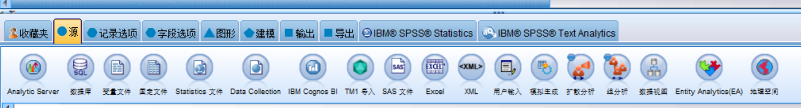
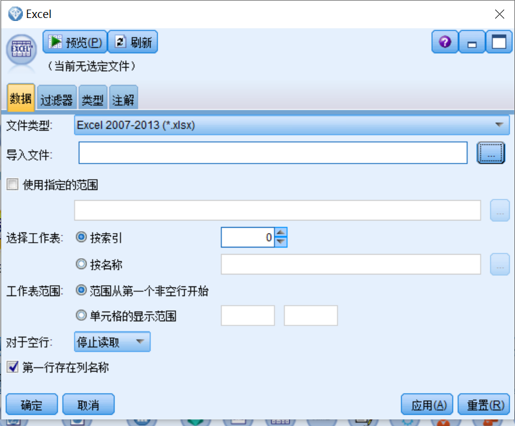
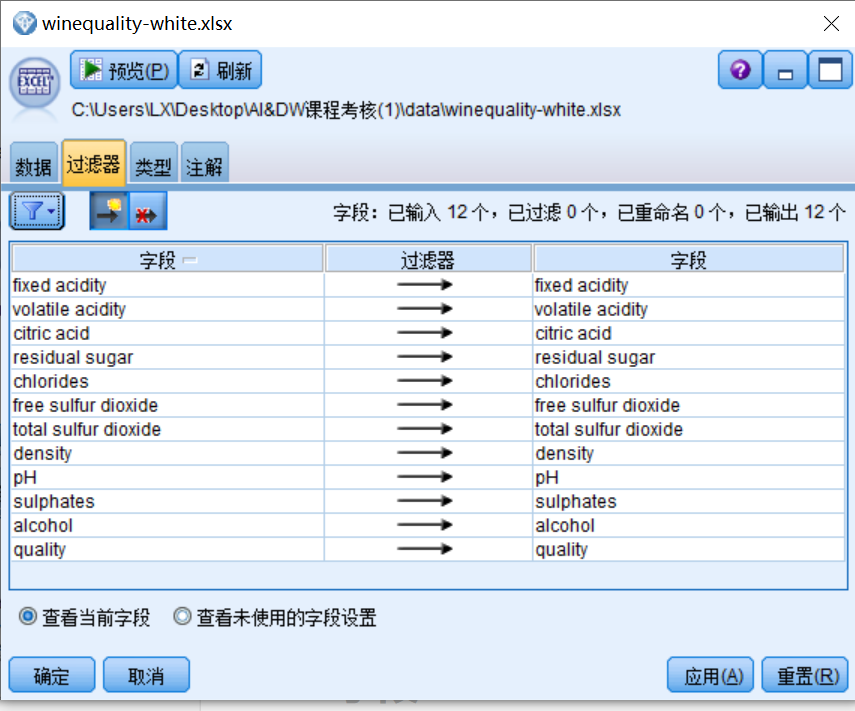
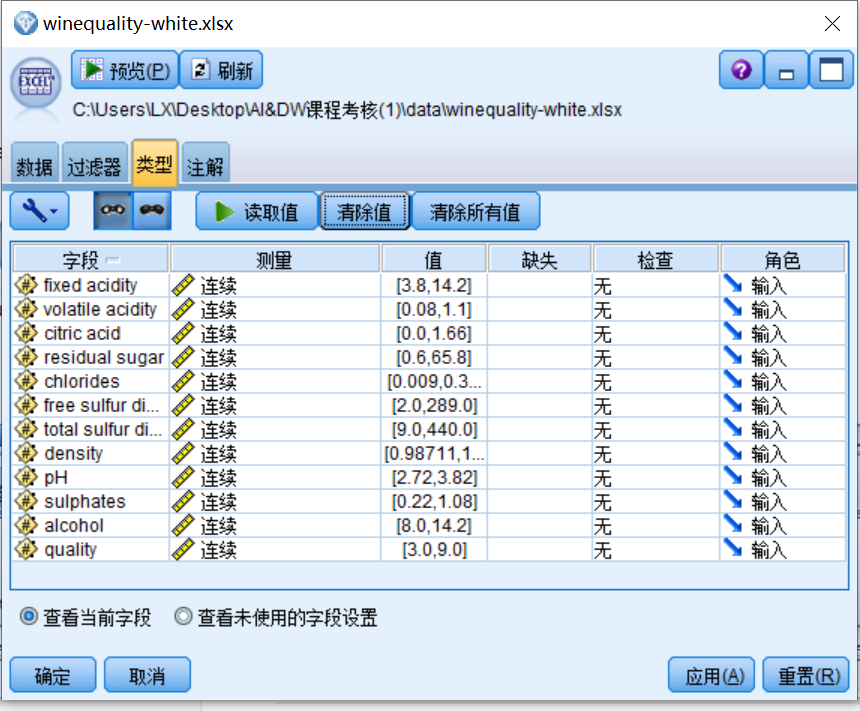
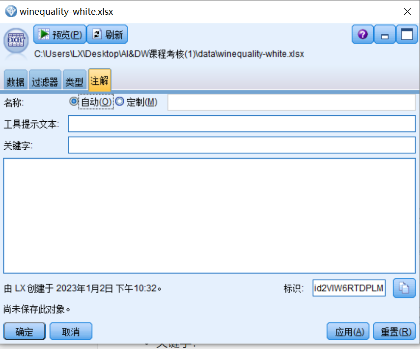
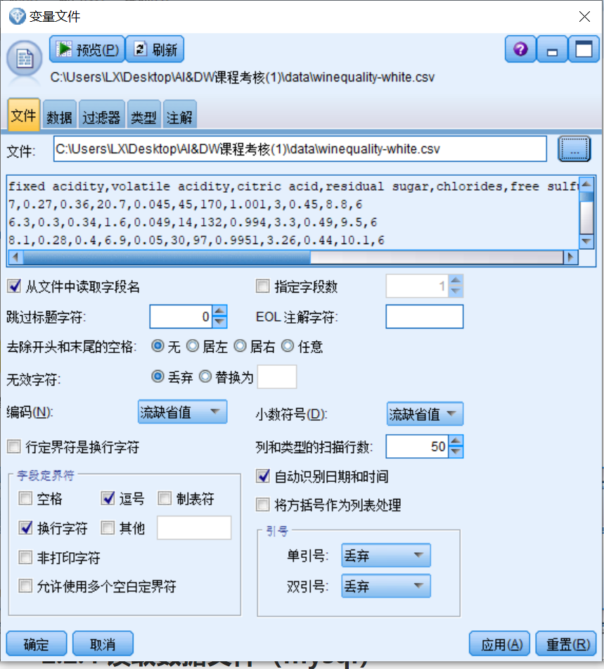
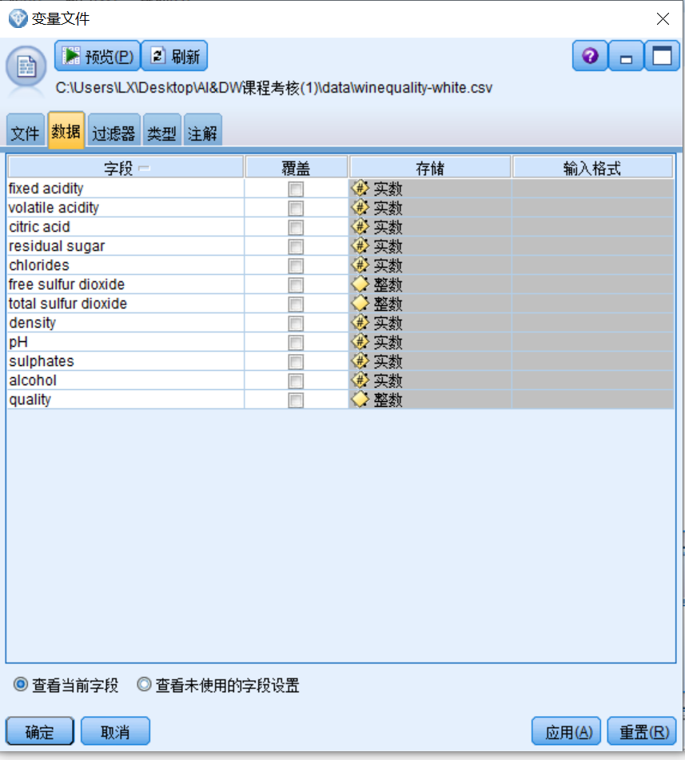
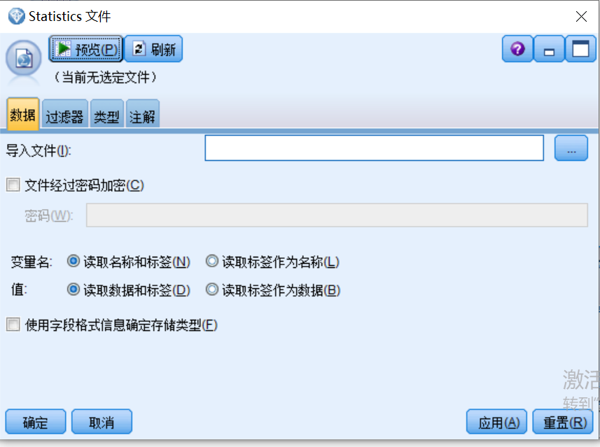

# 1：SPSS Modeler 基本介绍

## 简介

SPSS最初称为“Statistical Package for the Social Sciences"，即社会科学统计软件包。1968年，SPSS由斯坦福3个学生所开发，它是世界上最早的统计分析软件。在1984年，SPSS公司推出全球第个统计分析软件微机版本(SPSS/PC+)，并使其能很快地应用于自然科学、技术科学、社会科学的各个领域。之后在1999年，SPSS公司收购了Clementine产品线，并将其改名为SPSS Modeler。随着这次收购，以及SPSS产品能力和服务范围的扩
展，SPSS公司将英文全称改为Statistical Product and Service Solutions, 即统计产品与服务解决方案，这也标志着公司战略方向和产品设计的重大转型。在2009年，SPSS公司被IBM收购，而直到现在，IBMSPSS产品线下最主要的两款产品依然为IBMSPSSStatistics以及IBM SPSS Modeler,前者定位于为统计分析工具，后者则定位为数据挖掘工具。

## 特点

- 专业性
  - 覆盖整个数据挖掘的生命周期
    - 数据处理
    - 分析探索
    - 模型创建
    - 评估及部署
  - 高效的流程处理
    - 数据合并
    - 数据导出
    - 数据筛选
    - 数据汇总
    - 。。。
  - 丰富、稳健的数据挖掘模型
    - 分类算法
    - 距离算法
    - 。。。。
- 易用性
  - 图形化界面
  - 自动建模算法
  - 便捷的参数调整
- 拓展性
  - 集成多重数据源
  - 
- 高性能

## CRISP-DM方法论

- 商业理解

  在数据收集及建立模型之前，应该先完成对商业目标的界定。在这个阶段，需要与相关业务及技术人员对
  数据挖掘目标的达成、对现有资源的评估及对计划的制定进行充分讨论。商业理解阶段是整个数据挖掘过程路线图的基础所在。在商业理解阶段，需要完成以下工作:

  - 确定业务目标
  - 评估情况
  - 确定数据挖掘目标
  - 指定项目计划

- 数据理解

  在数据理解阶段，需要深入理解可用于数据挖掘项目的相关数据资源。只有完成对数据资源的充分掌握，才能避免在下一-阶段 (数据准备)中发生意外问题，因此可以利用表格、图形或统计指标对数据进行进一步 的数据探索。在数据理解阶段，需要完成以下工作:

  - 收集准备原始数据
  - 描述数据
  - 探索数据
  - 验证数据质量

- 数据准备

  在数据准备阶段，需要花费大量的时间对数据进行清洗，以保证在建模时具备高质量的数据基础。在实际的数据挖掘项目中，数据准备阶段的工作往往占整个项目工作的50%~70%。值得高兴的是，假如用户在商业理解及数据理解阶段投了足够多的精力，将能有效地减少在此阶段不必要的返工。在数据准备阶段，需要完成以下工作:

  - 选择数据

  - 清理数据
  - 构建新数据
  - 集成数据
  - 格式化数据

- 建立模型

  建立模型是整个数据挖据项目中的核心阶段，通过前面的数据准备，用户已经获得可用于数据建模的高质量数据，接下来就是通过构建合适的模型从数据中获得真正的润察。在建立模型阶段，可能会需要进行多次迭代，以找到- 个能够圆满解决商业问题的模型。在建立模型阶段，需要完成以下工作:

  - 选择建模技术
  - 生成测试设计
  - 构建模型
  - 评估模型

- 模型评估

  模型评估是验证用户的工作是否获得成功的关键。在此阶段，除了需要对算法模型进行技术上的评估外，还需要根据在业务理解阶段设定的目标进行业务评估，以确保项目成果能满足实际的业务需求。在模型评估阶段，需要完成以下工作:

  - 评估结果
  - 审核过程
  - 确定后续步骤

- 结果部署

  结果部署是最终结果的运用过程。在此阶段，需要把在数据中获得的洞察应用到具体业务中，以求实现最终的商业价值。在结果部署阶段，需要完成以下工作:

  - 指定部署计划
  - 计划监视和维护
  - 生成最终报告
  - 执行最终项目审核

# 2：数据读取

## 2.1 数据类型

变量被称为属性或者字段，是对一个对象的抽象描述。在数据挖掘的过程中，每一条记录可以看错一个对象。一个变量可以有3个角度进行划分：存储类型、策略级别、角色

### 2.1.1 变量的存储类型

- 整数型：值为整数的字段，如1，2，3，4
- 实数型：值为包含小数的字段，如1.1，1.2，1.3
- 字符串型：值为数字、字符（字母其他符号）组成的一串字符，对于字符串 SPSS Modeler 不能将其用于计算。
- 日期型：值为标准时间格式的数据，如2020-01-01
- 时间戳型：值为标准时间戳格式的数据，如00：00：00
- 时间型：值为持续时间的数据
- 列表型：值为单个记录包含多个值，如地理空间、集合

### 2.1.2 变量的测量级别

- 默认型：当变量微信为未知时候的类型
- 连续型：用于描述年龄、收入、销量等数据型变量
- 分类型：当变量的存储类型为字符串型，但取值范围未知时，则为分类型，当取值范围已知的情况下，将被进一步确定为标记型、名义型、有序型
- 标记型：用于描述具有两个不同标记的变量类型，如男、女
- 名义型：用户描述具有多个不同标记的变量类型，如婚姻状况分为 已婚、未婚、离异
- 有序型：用户描述具有多个不同标记的变量类型，并且变量存在固有的顺序，如血压水平分为 低、中、高
- 地理空间型：
- 集合型：
- 无序型：

### 2.1.3 变量的角色

- 输入：数据的输入，也称为自变量
- 目标：属鸡的输出，也称为因变量
- 任意：只适用于关联规则算法，其他算法节点将忽略此字段
- 无：忽略的字段
- 分区：用于标记数据是属于训练集还是测试集。该字段只能具有2/3个可能值，第一个表示训练样本，第二个表示测试样本，第三个表示验证样本
- 拆分：仅分类（标记、名义、有序）字段能够被设置成拆分，SPSS Modeler会为该字段的没一个可能值建立一个模型
- 频率：用作记录的频率权重因子
- 记录标识：记录的id，用于记录样本的标记

## 2.2数据读取

数据读取在源节点上。

### 2.2.1 读取excel

#### 2.2.1.1 数据

- 文件类型：即excel 文件的格式
- 导入文件：导入excel 文件的地址
- 使用指定的范围：
- 选择工作表：
  - 按索引：按照索引的角度选择工作表
  - 按名称：按照工作表名称的角色选择工作表
- 工作表范围：
- 对于空行：空行的处理方式，默认停止读取
- 第一行存在列名称：第一行作为列明

#### 2.2.1.2 过滤器

#### 2.2.1.3 类型

#### 2.2.1.3 注解

- 名称：该节点的名称
- 工具提示文本：
- 关键字：
- 说明文本：节点的说明

### 2.2.2 读取变量文件

格式为csv、txt文件的的读取

#### 2.2.2.1 文件

- 文件：文件地址
- 从文件读取字段名：第一行字段的名称
- 指定字段数：选定多少字段数
- 跳过标题字符：忽略第一个记录前的多少个起始字符
- EOL注解字符：指定注释字符，用与读取时字符被忽略
- 无效字符：为空字符串或编码不存在的字符
- 编码：文本编码格式，默认utf-8
- 小数字符：
- 行定界符是转行字符：新的记录换行，非字段分隔的识别
- 自动识别日期和时间：
- 将方括号作为列表处理：将方括号所有内容识别为一个值，处理地理类型的数据可使用该设置
- 字段定界符：字段分割个识别
- 引号：单、双引号的处理方式

#### 2.2.2.2 数据

#### 2.2.2.3 过滤器

同2.2.1.2

#### 2.2.2.4 类型

同2.2.1.3

#### 2.2.2.5 注解

同2.2.1.4

### 2.2.3 读取spss（.sav）文件

#### 2.2.3.1 数据

- 导入文件：文件地址
- 文件经过密码加密：文件密码
- 变量名：
- 值：
- 使用字段格式信息确定存储类型：

#### 2.2.3.2 过滤器

同2.2.1.2

#### 2.2.3.3 类型

同2.2.1.3

#### 2.2.3.4 注解

同2.2.1.4

### 2.2.4 读取数据文件（mysql）

# 3：数据整理-数据的基本设定与集成

## 3.1 字段

- 类型功能
- 过滤器功能

## 3.2 数据集成

- 追加节点
- 合并节点

# 4：数据整理-行的处理

## 4.1选择功能

## 4.2数据排序

## 4.3 数据区分

## 4.4数据汇总

# 5：数据整理-列的处理

## 5.1 导出

## 5.2 填充

## 5.3 重新分类

## 5.4 匿名化

## 5.4 分级化

# 6：图形可视化-图形节点

## 6.1 散点图

- 散点图
- 线图
- 多重散点图
- 时间散点图

## 6.2 条形图

- 简单条形图
- 堆积条形图

## 6.3 直方图

- 直方图
- 堆积直方图

## 6.4 网络

## 6.5 图形扳

- 气泡图
- 散点图矩阵
- 箱图
- 聚类箱图
- 热图

# 7：描述性统计分析

## 7.1 描述性统计分析概述

## 7.2 数据审核

## 7.3 缺失值定义、检查和处理

- 缺失值定义和检查
- 缺失值自动化处理

# 8：常用统计校验分析

## 8.1 两个联系性变量的关系分析-相关分析

### 8.1.1 相关分析

### 8.1.2

## 8.2 两个分类型变量的关系分析-卡方检验

### 8.1.1列连表与卡方校验

## 8.3 连续型变量与分类型变量间的关系分析-t检验及卡方检验

### 8.3.1 两组独立样本均值比较

### 8.3.2 两组配对样本均值比较

### 8.3.3 方差分析

# 9：回归分析

### 9.1 一元线性回归分析

### 9.2 多元线性回归分析

### 9.3 逐步线性回归分析

# 10：Logistic 回归分析

### 10.1 Logistic 回归分析理论说明

### 10.2 Logistic 回归中叫检验

- 方程的显著性校验
- 系数显著性校验
- 拟合有毒校验

# 11：RFM 分析

# 12：决策树分析

### 12.1 决策树概述

- 决策树的理解
- 决策树的生长
- 决策树的剪枝

### 12.2 C5.0 算法

- C5.0 算法的决策树生长
- C5.0 算法的决策树剪枝
- 代价敏感学习

### 12.3 CART 算法

- CART 算法的决策树生长
- CART 算法的决策树剪枝
- 先验概率

# 13：神经网络网络

## 13.1 感知机

## 13.2 多层感知机与误差反向传播算法

- 隐藏层
- 反向传播算法

# 14：聚类分析

##  14.1 聚类方法概述

## 14.2 聚类方法关键-距离

## 14.3 K-means算法

### 算法原理

# 15：KNN分类器

## KNN 学习方法原理

# 16：关联分析

## 关联分析的基本概念

## 关联规则的有效性指标

### 关联规则的基本评价指标

### 关联规则的实用性指标

### 其他的关联规则评价指标

## Apriori 算法

### 生成频繁项集

### 生成关联规则

