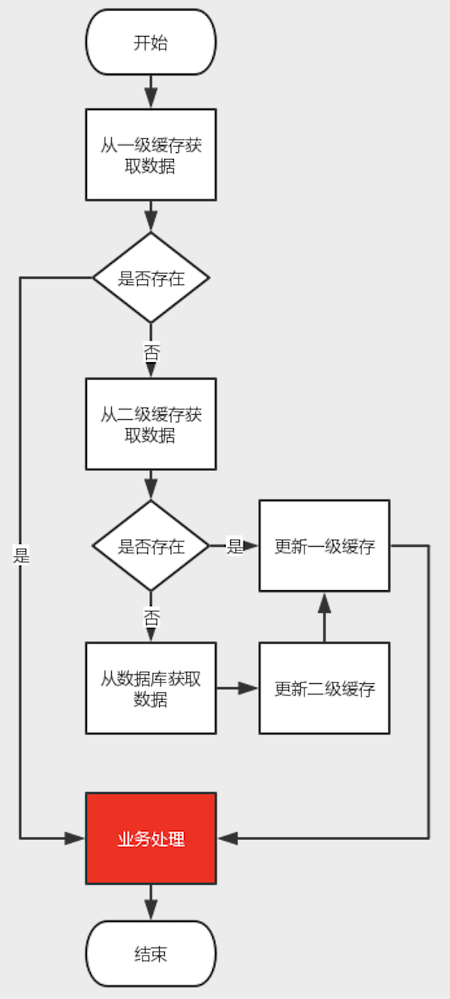
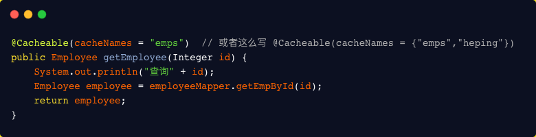
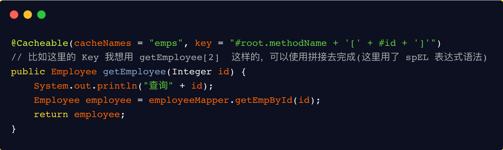
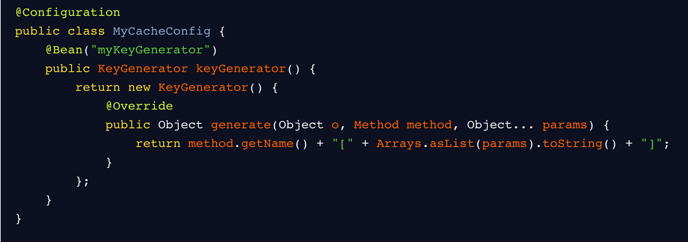
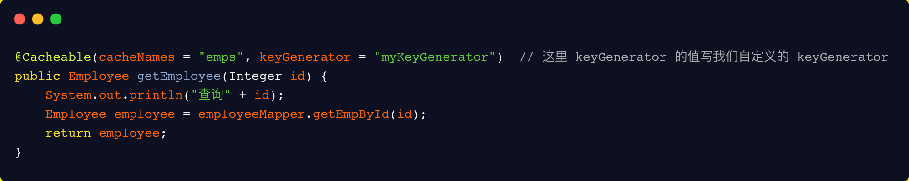
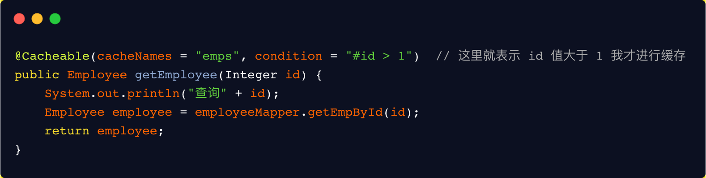
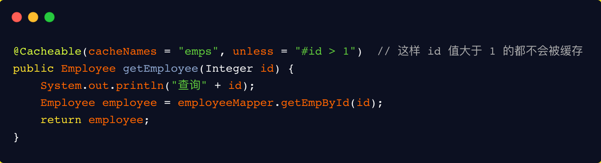
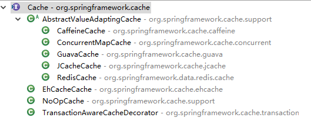

> 本篇主要记录和总结工作中用到的两级缓存实现

## 二级缓存

### 简介

将数据读取出来放到内存里，这样当需要获取数据时，就能够直接从内存中拿到数据返回，能够很大程度的提高速度。但是一般Redis是单独部署成集群，所以会有网络IO上的消耗，虽然与Redis集群的链接已经有连接池这种工具，但是数据传输上也还是会有一定消耗。所以就有了应用内缓存，如：Caffeine。当应用内缓存有符合条件的数据时，就可以直接使用，而不用通过网络到Redis中去获取，这样就形成了两级缓存。应用内缓存（如Caffeine）叫做一级缓存，远程缓存（如Redis）叫做二级缓存。

### 说明

本文档主要结合于Spring Boot+Spring Cache实现两级缓存(Redis+Caffeine)。

### 逻辑

业务获取数据，从一级缓存获取数据判断是否获取成功，失败则进入二级缓存获取数据，获取数据失败，进入查询数据，返回数据后，更新到二级缓存，在更新到一级缓存，最后响应业务。



### 操作

#### 引入依赖

pom.xml中加入以下starter依赖，cache-redis-caffeine-spring-boot-starter为开发好的二级缓存组件

```java
<dependency>
  <groupId>com.demo</groupId>
  <artifactId>cache-redis-caffeine-spring-boot-starter</artifactId>
  <version>1.0.0-SNAPSHOT</version>
</dependency>
```

#### 开启缓存支持

@EnableCaching：启用spring cache缓存，作为总的开关，在spring boot的启动类或配置类上需要加上此注解才会生效

```
@EnableCaching
@SpringBootApplication
public class FrameworkBoot {
    public static void main(String[] args) {
        new SpringApplicationBuilder(FrameworkBoot.class)
                .web(WebApplicationType.SERVLET)
                .run(args);
    }
}
```

#### 设置缓存配置

```
spring:
  #redis配置,默认单机配置
  redis:
    host: 127.0.0.1
    #    password:
    port: 6379
    #    cluster:
    ##    配置集群
    ##      nodes: 127.0.0.1:6379,127.0.0.1:6380,127.0.0.1:6381
    #      nodes:
    #        - 127.0.0.1:6379
    #        - 127.0.0.1:6380
    #        - 127.0.0.1:6381
    #连接池配置
    jedis:
      pool:
        #连接池最大连接数
        max-active: 1000
        #连接池最大阻塞等待时间(使用负值没有限制)
        max-wait: -1
        #连接池中的最大空闲连接
        max-idle: 10
        #连接池中的最小空闲连接
        min-idle: 5

  cache:
    #开启缓存
    enabled: true
    #redis模式，true默认单机
    stand-alone: true
    #开启二级缓存
    multistage-enabled: true
    #缓存key前缀配置
    cache-prefix: cachePrefix
    #是否存储空值，默认true，防止缓存穿透
    cache-null-values: true
    caffeine:
      #统一配置L1缓存初始化容量
      initial-capacity: 10
      #统一配置L2缓存最大容量
      maximum-size: 1000
      #全局配置写入后的过期时间
      expire-after-write: 3000000
    redis:
      #优先级最高过期时间
      expires:
        #单个key过期时间
        user: 6000
        test: 60000
      #全局配置过期时间
      default-expiration: 3000000
```

#### 常用注解

- @Cacheable：主要应用到查询数据的方法上；

```
@Cacheable(value = "user", key = "#id",condition = "#result != null")
public Object findById(String id){
    return null;
}
```

- @CacheEvict：清除缓存，主要应用到删除数据的方法上；

```
@CacheEvict(value = "user", key = "#id")
public void delete(String id){
	taskLogMapper.deleteById(id);
}
```

- @CachePut：放入缓存，主要用到对数据有更新的方法上；

```
 @CachePut(value = "user", key = "#tasklog.id")
 public Tasklog update(Tasklog tasklog){
 	taskLogMapper.update(tasklog);
 	return tasklog;
 }
```

- @Caching：用于在一个方法上配置多种注解。

```
@Caching(put = {
@CachePut(value = "user", key = "#user.id"),
@CachePut(value = "user", key = "#user.username"),
@CachePut(value = "user", key = "#user.email")
})
public User save(User user) {
}
```

#### 自定义缓存注解

比如之前的那个@Caching组合，会让方法上的注解显得整个代码比较乱，此时可以使用自定义注解把这些注解组合到一个注解中

```
@Caching(put = {
    @CachePut(value = "user", key = "#user.id"),
    @CachePut(value = "user", key = "#user.username"),
    @CachePut(value = "user", key = "#user.email")
})
@Target({ElementType.METHOD, ElementType.TYPE})
@Retention(RetentionPolicy.RUNTIME)
@Inherited
public @interface UserSaveCache {
}
```

#### 注解属性

> - `cacheNames/value` ：用来指定缓存组件的名字
> - `key` ：缓存数据时使用的 key，可以用它来指定。默认是使用方法参数的值。（这个 key 你可以使用 spEL 表达式来编写）
> - `keyGenerator` ：key 的生成器。 key 和 keyGenerator 二选一使用
> - `cacheManager` ：可以用来指定缓存管理器。从哪个缓存管理器里面获取缓存。
> - `condition` ：可以用来指定符合条件的情况下才缓存
> - `unless` ：否定缓存。当 unless 指定的条件为 true ，方法的返回值就不会被缓存。当然你也可以获取到结果进行判断。（通过 `#result` 获取方法结果）
> - `sync` ：是否使用异步模式。

#### 属性运用

##### cacheNames

用来指定缓存组件的名字，将方法的返回结果放在哪个缓存中，可以是数组的方式，支持指定多个缓存。



##### key

缓存数据时使用的 key。默认使用的是方法参数的值。可以使用 spEL 表达式去编写。



##### keyGenerator

key 的生成器，可以自己指定 key 的生成器，通过这个生成器来生成 key。





##### condition

符合条件的情况下才缓存。方法返回的数据要不要缓存，可以做一个动态判断。



##### unless

否定缓存。当 unless 指定的条件为 true ，方法的返回值就不会被缓存。



##### sync

是否使用异步模式。默认是方法执行完，以同步的方式将方法返回的结果存在缓存中。

### 原理

spring  cache是spring-context包中提供的基于注解方式使用的缓存组件，定义了一些标准接口，通过实现这些接口，就可以通过在方法上增加注解来实现缓存。这样就能够避免缓存代码与业务处理耦合在一起的问题。spring cache的实现是使用spring aop中对方法切面（MethodInterceptor）封装的扩展。


spring cache核心的接口就两个：**Cache**和**CacheManager**。


#### Cache接口

提供缓存的具体操作，比如缓存的放入、读取、清理，spring框架中默认提供的实现有：



```
#Cache.java
 
package org.springframework.cache;
 
import java.util.concurrent.Callable;
 
public interface Cache {
 
 // cacheName，缓存的名字，默认实现中一般是CacheManager创建Cache的bean时传入cacheName
 String getName();
 
 // 获取实际使用的缓存，如：RedisTemplate、com.github.benmanes.caffeine.cache.Cache<Object, Object>。暂时没发现实际用处，可能只是提供获取原生缓存的bean，以便需要扩展一些缓存操作或统计之类的东西
 Object getNativeCache();
 
 // 通过key获取缓存值，注意返回的是ValueWrapper，为了兼容存储空值的情况，将返回值包装了一层，通过get方法获取实际值
 ValueWrapper get(Object key);
 
 // 通过key获取缓存值，返回的是实际值，即方法的返回值类型
 <T> T get(Object key, Class<T> type);
 
 // 通过key获取缓存值，可以使用valueLoader.call()来调使用@Cacheable注解的方法。当@Cacheable注解的sync属性配置为true时使用此方法。因此方法内需要保证回源到数据库的同步性。避免在缓存失效时大量请求回源到数据库
 <T> T get(Object key, Callable<T> valueLoader);
 
 // 将@Cacheable注解方法返回的数据放入缓存中
 void put(Object key, Object value);
 
 // 当缓存中不存在key时才放入缓存。返回值是当key存在时原有的数据
 ValueWrapper putIfAbsent(Object key, Object value);
 
 // 删除缓存
 void evict(Object key);
 
 // 删除缓存中的所有数据。需要注意的是，具体实现中只删除使用@Cacheable注解缓存的所有数据，不要影响应用内的其他缓存
 void clear();
 
 // 缓存返回值的包装
 interface ValueWrapper {
 
 // 返回实际缓存的对象
 Object get();
 }
 
 // 当{@link #get(Object, Callable)}抛出异常时，会包装成此异常抛出
 @SuppressWarnings("serial")
 class ValueRetrievalException extends RuntimeException {
 
 private final Object key;
 
 public ValueRetrievalException(Object key, Callable<?> loader, Throwable ex) {
  super(String.format("Value for key '%s' could not be loaded using '%s'", key, loader), ex);
  this.key = key;
 }
 
 public Object getKey() {
  return this.key;
 }
 }
}
```

#### CacheManager接口

主要提供Cache实现bean的创建，每个应用里可以通过cacheName来对Cache进行隔离，每个cacheName对应一个Cache实现。spring框架中默认提供的实现与Cache的实现都是成对出现

```
#CacheManager.java
 
package org.springframework.cache;
 
import java.util.Collection;
 
public interface CacheManager {
 
 // 通过cacheName创建Cache的实现bean，具体实现中需要存储已创建的Cache实现bean，避免重复创建，也避免内存缓存对象（如Caffeine）重新创建后原来缓存内容丢失的情况
 Cache getCache(String name);
 
 // 返回所有的cacheName
 Collection<String> getCacheNames();
}
```

### 自定义实现

#### 引入依赖

```
<dependency>
    <groupId>org.springframework.boot</groupId>
    <artifactId>spring-boot-configuration-processor</artifactId>
    <optional>true</optional>
</dependency>
<dependency>
    <groupId>org.springframework.boot</groupId>
    <artifactId>spring-boot-autoconfigure</artifactId>
</dependency>
<dependency>
    <groupId>org.springframework.boot</groupId>
    <artifactId>spring-boot-starter</artifactId>
</dependency>
<dependency>
    <groupId>org.springframework.boot</groupId>
    <artifactId>spring-boot-starter-aop</artifactId>
</dependency>
<dependency>
    <groupId>org.apache.geronimo.bundles</groupId>
    <artifactId>aspectjweaver</artifactId>
    <version>1.6.8_2</version>
</dependency>
<dependency>
    <groupId>org.aspectj</groupId>
    <artifactId>aspectjrt</artifactId>
    <version>1.9.1</version>
</dependency>
<dependency>
    <groupId>com.alibaba</groupId>
    <artifactId>fastjson</artifactId>
    <version>1.2.78</version>
</dependency>
<dependency>
    <groupId>org.springframework.boot</groupId>
    <artifactId>spring-boot-starter-data-redis</artifactId>
</dependency>
<dependency>
    <groupId>org.apache.commons</groupId>
    <artifactId>commons-pool2</artifactId>
</dependency>
<dependency>
    <groupId>com.github.ben-manes.caffeine</groupId>
    <artifactId>caffeine</artifactId>
</dependency>
```

#### 定义properties配置属性类

```
package com.cache.config;

import org.springframework.boot.context.properties.ConfigurationProperties;

import java.util.HashMap;
import java.util.HashSet;
import java.util.Map;
import java.util.Set;


/**
 * Description:
 * <br/>
 * CacheRedisCaffeineProperties
 *
 * @author feiliang
 */
@ConfigurationProperties(prefix = CacheRedisCaffeineProperties.CACHE_PREFIX)
public class CacheRedisCaffeineProperties {
    /**
     * 配置前缀
     */
    public static final String CACHE_PREFIX = "spring.cache";

    private Set<String> cacheNames = new HashSet<>();
    /**
     * 是否存储空值，默认true，防止缓存穿透
     */
    private boolean cacheNullValues = true;
    /**
     * 是否动态根据cacheName创建Cache的实现，默认true
     */
    private boolean dynamic = true;

    /**
     * 缓存key的前缀
     */
    private String cachePrefix;
    private Redis redis = new Redis();
    private Caffeine caffeine = new Caffeine();

    public class Redis {
        /**
         * 全局过期时间，单位毫秒，默认不过期
         */
        private long defaultExpiration = 0;

        /**
         * 每个cacheName的过期时间，单位毫秒，优先级比defaultExpiration高
         */
        private Map<String, Long> expires = new HashMap<>();

        /**
         * 缓存更新时通知其他节点的topic名称
         */
        private String topic = "cache:redis:caffeine:topic";

        public long getDefaultExpiration() {
            return defaultExpiration;
        }

        public void setDefaultExpiration(long defaultExpiration) {
            this.defaultExpiration = defaultExpiration;
        }

        public Map<String, Long> getExpires() {
            return expires;
        }

        public void setExpires(Map<String, Long> expires) {
            this.expires = expires;
        }

        public String getTopic() {
            return topic;
        }

        public void setTopic(String topic) {
            this.topic = topic;
        }

    }

    public class Caffeine {
        /**
         * 访问后过期时间，单位毫秒
         */
        private long expireAfterAccess;

        /**
         * 写入后过期时间，单位毫秒
         */
        private long expireAfterWrite;

        /**
         * 写入后刷新时间，单位毫秒
         */
        private long refreshAfterWrite;

        /**
         * 初始化大小
         */
        private int initialCapacity;

        /**
         * 最大缓存对象个数，超过此数量时之前放入的缓存将失效
         */
        private long maximumSize;

        /**
         * 由于权重需要缓存对象来提供，对于使用spring cache这种场景不是很适合，所以暂不支持配置
         */
        // private long maximumWeight;
        public long getExpireAfterAccess() {
            return expireAfterAccess;
        }

        public void setExpireAfterAccess(long expireAfterAccess) {
            this.expireAfterAccess = expireAfterAccess;
        }

        public long getExpireAfterWrite() {
            return expireAfterWrite;
        }

        public void setExpireAfterWrite(long expireAfterWrite) {
            this.expireAfterWrite = expireAfterWrite;
        }

        public long getRefreshAfterWrite() {
            return refreshAfterWrite;
        }

        public void setRefreshAfterWrite(long refreshAfterWrite) {
            this.refreshAfterWrite = refreshAfterWrite;
        }

        public int getInitialCapacity() {
            return initialCapacity;
        }

        public void setInitialCapacity(int initialCapacity) {
            this.initialCapacity = initialCapacity;
        }

        public long getMaximumSize() {
            return maximumSize;
        }

        public void setMaximumSize(long maximumSize) {
            this.maximumSize = maximumSize;
        }
    }

    public Set<String> getCacheNames() {
        return cacheNames;
    }

    public void setCacheNames(Set<String> cacheNames) {
        this.cacheNames = cacheNames;
    }

    public boolean isCacheNullValues() {
        return cacheNullValues;
    }

    public void setCacheNullValues(boolean cacheNullValues) {
        this.cacheNullValues = cacheNullValues;
    }

    public boolean isDynamic() {
        return dynamic;
    }

    public void setDynamic(boolean dynamic) {
        this.dynamic = dynamic;
    }

    public String getCachePrefix() {
        return cachePrefix;
    }

    public void setCachePrefix(String cachePrefix) {
        this.cachePrefix = cachePrefix;
    }

    public Redis getRedis() {
        return redis;
    }

    public void setRedis(Redis redis) {
        this.redis = redis;
    }

    public Caffeine getCaffeine() {
        return caffeine;
    }

    public void setCaffeine(Caffeine caffeine) {
        this.caffeine = caffeine;
    }
}
```


#### 实现Cache接口

spring cache中有实现Cache接口的一个抽象类AbstractValueAdaptingCache，包含了空值的包装和缓存值的包装，所以就不用实现Cache接口了，直接实现AbstractValueAdaptingCache抽象类

```
package com.cache.support;

import java.lang.reflect.Constructor;
import java.util.Map;
import java.util.Set;
import java.util.concurrent.Callable;
import java.util.concurrent.TimeUnit;
import java.util.concurrent.locks.ReentrantLock;

import com.cache.config.CacheRedisCaffeineProperties;
import org.slf4j.Logger;
import org.slf4j.LoggerFactory;
import org.springframework.cache.support.AbstractValueAdaptingCache;
import org.springframework.data.redis.core.RedisTemplate;
import org.springframework.util.StringUtils;
import com.github.benmanes.caffeine.cache.Cache;

/**
 * Description:
 * <br/>
 * RedisCaffeineCache
 *
 * @author feiliang
 */
public class RedisCaffeineCache extends AbstractValueAdaptingCache {
    private final Logger logger = LoggerFactory.getLogger(RedisCaffeineCache.class);
    private String name;
    private RedisTemplate<Object, Object> redisTemplate;
    private Cache<Object, Object> caffeineCache;
    private String cachePrefix;
    private long defaultExpiration = 0;
    private Map<String, Long> expires;
    private String topic = "cache:redis:caffeine:topic";

    protected RedisCaffeineCache(boolean allowNullValues) {
        super(allowNullValues);
    }

    public RedisCaffeineCache(String name, RedisTemplate<Object, Object> redisTemplate, Cache<Object, Object> caffeineCache, CacheRedisCaffeineProperties cacheRedisCaffeineProperties) {
        super(cacheRedisCaffeineProperties.isCacheNullValues());
        this.name = name;
        this.redisTemplate = redisTemplate;
        this.caffeineCache = caffeineCache;
        this.cachePrefix = cacheRedisCaffeineProperties.getCachePrefix();
        this.defaultExpiration = cacheRedisCaffeineProperties.getRedis().getDefaultExpiration();
        this.expires = cacheRedisCaffeineProperties.getRedis().getExpires();
        this.topic = cacheRedisCaffeineProperties.getRedis().getTopic();
    }

    @Override
    public String getName() {
        return this.name;
    }

    @Override
    public Object getNativeCache() {
        return this;
    }

    @SuppressWarnings("unchecked")
    @Override
    public <T> T get(Object key, Callable<T> valueLoader) {
        Object value = lookup(key);
        if (value != null) {
            return (T) value;
        }

        ReentrantLock lock = new ReentrantLock();
        try {
            lock.lock();
            value = lookup(key);
            if (value != null) {
                return (T) value;
            }
            value = valueLoader.call();
            Object storeValue = toStoreValue(valueLoader.call());
            put(key, storeValue);
            return (T) value;
        } catch (Exception e) {
            try {
                Class<?> c = Class.forName("org.springframework.cache.Cache$ValueRetrievalException");
                Constructor<?> constructor = c.getConstructor(Object.class, Callable.class, Throwable.class);
                RuntimeException exception = (RuntimeException) constructor.newInstance(key, valueLoader, e.getCause());
                throw exception;
            } catch (Exception e1) {
                throw new IllegalStateException(e1);
            }
        } finally {
            lock.unlock();
        }
    }

    @Override
    public void put(Object key, Object value) {
        if (!super.isAllowNullValues() && value == null) {
            this.evict(key);
            return;
        }
        long expire = getExpire();
        if (expire > 0) {
            redisTemplate.opsForValue().set(getKey(key), toStoreValue(value), expire, TimeUnit.MILLISECONDS);
        } else {
            redisTemplate.opsForValue().set(getKey(key), toStoreValue(value));
        }

        push(new CacheMessage(this.name, key));

        caffeineCache.put(key, value);
    }

    @Override
    public ValueWrapper putIfAbsent(Object key, Object value) {
        Object cacheKey = getKey(key);
        Object prevValue = null;
        // 考虑使用分布式锁，或者将redis的setIfAbsent改为原子性操作
        synchronized (key) {
            prevValue = redisTemplate.opsForValue().get(cacheKey);
            if (prevValue == null) {
                long expire = getExpire();
                if (expire > 0) {
                    redisTemplate.opsForValue().set(getKey(key), toStoreValue(value), expire, TimeUnit.MILLISECONDS);
                } else {
                    redisTemplate.opsForValue().set(getKey(key), toStoreValue(value));
                }

                push(new CacheMessage(this.name, key));

                caffeineCache.put(key, toStoreValue(value));
            }
        }
        return toValueWrapper(prevValue);
    }

    @Override
    public void evict(Object key) {
        // 先清除redis中缓存数据，然后清除caffeine中的缓存，避免短时间内如果先清除caffeine缓存后其他请求会再从redis里加载到caffeine中
        redisTemplate.delete(getKey(key));

        push(new CacheMessage(this.name, key));

        caffeineCache.invalidate(key);
    }

    @Override
    public void clear() {
        // 先清除redis中缓存数据，然后清除caffeine中的缓存，避免短时间内如果先清除caffeine缓存后其他请求会再从redis里加载到caffeine中
        Set<Object> keys = redisTemplate.keys(this.name.concat(":"));
        for (Object key : keys) {
            redisTemplate.delete(key);
        }

        push(new CacheMessage(this.name, null));

        caffeineCache.invalidateAll();
    }

    @Override
    protected Object lookup(Object key) {
        Object cacheKey = getKey(key);
        Object value = caffeineCache.getIfPresent(key);
        if (value != null) {
            logger.debug("get cache from caffeine, the key is : {}", cacheKey);
            return value;
        }

        value = redisTemplate.opsForValue().get(cacheKey);

        if (value != null) {
            logger.debug("get cache from redis and put in caffeine, the key is : {}", cacheKey);
            caffeineCache.put(key, value);
        }
        return value;
    }

    private Object getKey(Object key) {
        return StringUtils.isEmpty(cachePrefix) ? this.name.concat(":").concat(key.toString()) : cachePrefix.concat(":").concat(this.name).concat(":").concat(key.toString());
    }

    private long getExpire() {
        long expire = defaultExpiration;
        Long cacheNameExpire = expires.get(this.name);
        return cacheNameExpire == null ? expire : cacheNameExpire.longValue();
    }

    /**
     * @param message
     * @description 缓存变更时通知其他节点清理本地缓存
     */
    private void push(CacheMessage message) {
        redisTemplate.convertAndSend(topic, message);
    }

    /**
     * @param key
     * @description 清理本地缓存
     */
    public void clearLocal(Object key) {
        logger.debug("clear local cache, the key is : {}", key);
        if (key == null) {
            caffeineCache.invalidateAll();
        } else {
            caffeineCache.invalidate(key);
        }
    }
}
```

#### 实现CacheManager接口

```
package com.cache.support;

import java.util.Collection;
import java.util.Set;
import java.util.concurrent.ConcurrentHashMap;
import java.util.concurrent.ConcurrentMap;
import java.util.concurrent.TimeUnit;

import com.cache.config.CacheRedisCaffeineProperties;
import org.slf4j.Logger;
import org.slf4j.LoggerFactory;
import org.springframework.cache.Cache;
import org.springframework.cache.CacheManager;
import org.springframework.data.redis.core.RedisTemplate;

import com.github.benmanes.caffeine.cache.Caffeine;

/**
 * Description:
 * <br/>
 * RedisCaffeineCacheManager
 *
 * @author feiliang
 */
public class RedisCaffeineCacheManager implements CacheManager {
    private final Logger logger = LoggerFactory.getLogger(RedisCaffeineCacheManager.class);

    private ConcurrentMap<String, Cache> cacheMap = new ConcurrentHashMap();

    private CacheRedisCaffeineProperties cacheRedisCaffeineProperties;

    private RedisTemplate<Object, Object> redisTemplate;

    private boolean dynamic = true;

    private Set<String> cacheNames;

    public RedisCaffeineCacheManager(CacheRedisCaffeineProperties cacheRedisCaffeineProperties,
                                     RedisTemplate<Object, Object> redisTemplate) {
        super();
        this.cacheRedisCaffeineProperties = cacheRedisCaffeineProperties;
        this.redisTemplate = redisTemplate;
        this.dynamic = cacheRedisCaffeineProperties.isDynamic();
        this.cacheNames = cacheRedisCaffeineProperties.getCacheNames();
    }

    @Override
    public Cache getCache(String name) {
        Cache cache = cacheMap.get(name);
        if(cache != null) {
            return cache;
        }
        if(!dynamic && !cacheNames.contains(name)) {
            return cache;
        }

        cache = new RedisCaffeineCache(name, redisTemplate, caffeineCache(), cacheRedisCaffeineProperties);
        Cache oldCache = cacheMap.putIfAbsent(name, cache);
        logger.debug("create cache instance, the cache name is : {}", name);
        return oldCache == null ? cache : oldCache;
    }

    public com.github.benmanes.caffeine.cache.Cache<Object, Object> caffeineCache(){
        Caffeine<Object, Object> cacheBuilder = Caffeine.newBuilder();
        if(cacheRedisCaffeineProperties.getCaffeine().getExpireAfterAccess() > 0) {
            cacheBuilder.expireAfterAccess(cacheRedisCaffeineProperties.getCaffeine().getExpireAfterAccess(), TimeUnit.MILLISECONDS);
        }
        if(cacheRedisCaffeineProperties.getCaffeine().getExpireAfterWrite() > 0) {
            cacheBuilder.expireAfterWrite(cacheRedisCaffeineProperties.getCaffeine().getExpireAfterWrite(), TimeUnit.MILLISECONDS);
        }
        if(cacheRedisCaffeineProperties.getCaffeine().getInitialCapacity() > 0) {
            cacheBuilder.initialCapacity(cacheRedisCaffeineProperties.getCaffeine().getInitialCapacity());
        }
        if(cacheRedisCaffeineProperties.getCaffeine().getMaximumSize() > 0) {
            cacheBuilder.maximumSize(cacheRedisCaffeineProperties.getCaffeine().getMaximumSize());
        }
        if(cacheRedisCaffeineProperties.getCaffeine().getRefreshAfterWrite() > 0) {
            cacheBuilder.refreshAfterWrite(cacheRedisCaffeineProperties.getCaffeine().getRefreshAfterWrite(), TimeUnit.MILLISECONDS);
        }
        return cacheBuilder.build();
    }

    @Override
    public Collection<String> getCacheNames() {
        return this.cacheNames;
    }

    public void clearLocal(String cacheName, Object key) {
        Cache cache = cacheMap.get(cacheName);
        if(cache == null) {
            return ;
        }

        RedisCaffeineCache redisCaffeineCache = (RedisCaffeineCache) cache;
        redisCaffeineCache.clearLocal(key);
    }
}
```

#### redis消息发布/订阅，传输的消息类

```
package com.cache.support;

import java.io.Serializable;

/**
 * Description:
 * <br/>
 * CacheMessage
 *
 * @author feiliang
 */
public class CacheMessage implements Serializable {
    private static final long serialVersionUID = 5987219310442078193L;

    private String cacheName;
    private Object key;
    public CacheMessage(String cacheName, Object key) {
        super();
        this.cacheName = cacheName;
        this.key = key;
    }

    public String getCacheName() {
        return cacheName;
    }

    public void setCacheName(String cacheName) {
        this.cacheName = cacheName;
    }

    public Object getKey() {
        return key;
    }

    public void setKey(Object key) {
        this.key = key;
    }
}
```

#### 监听redis消息需要实现MessageListener接口

```
package com.cache.support;

import org.slf4j.Logger;
import org.slf4j.LoggerFactory;
import org.springframework.data.redis.connection.Message;
import org.springframework.data.redis.connection.MessageListener;
import org.springframework.data.redis.core.RedisTemplate;

/**
 * Description:
 * <br/>
 * CacheMessageListener
 *
 * @author feiliang
 */
public class CacheMessageListener implements MessageListener {
    private final Logger logger = LoggerFactory.getLogger(CacheMessageListener.class);
    private RedisTemplate<Object, Object> redisTemplate;
    private RedisCaffeineCacheManager redisCaffeineCacheManager;
    public CacheMessageListener(RedisTemplate<Object, Object> redisTemplate,
                                RedisCaffeineCacheManager redisCaffeineCacheManager) {
        super();
        this.redisTemplate = redisTemplate;
        this.redisCaffeineCacheManager = redisCaffeineCacheManager;
    }

    @Override
    public void onMessage(Message message, byte[] pattern) {
        CacheMessage cacheMessage = (CacheMessage) redisTemplate.getValueSerializer().deserialize(message.getBody());
        logger.debug("recevice a redis topic message, clear local cache, the cacheName is {}, the key is {}", cacheMessage.getCacheName(), cacheMessage.getKey());
        redisCaffeineCacheManager.clearLocal(cacheMessage.getCacheName(), cacheMessage.getKey());
    }
}

```

#### 增加spring boot配置类

```
package com.cache.config;

import com.fasterxml.jackson.annotation.JsonAutoDetect;
import com.fasterxml.jackson.annotation.PropertyAccessor;
import com.fasterxml.jackson.databind.ObjectMapper;
import com.fasterxml.jackson.databind.jsontype.impl.LaissezFaireSubTypeValidator;
import org.springframework.context.annotation.Bean;
import org.springframework.context.annotation.Configuration;
import org.springframework.data.redis.connection.RedisConnectionFactory;
import org.springframework.data.redis.core.RedisTemplate;
import org.springframework.data.redis.serializer.Jackson2JsonRedisSerializer;
import org.springframework.data.redis.serializer.StringRedisSerializer;

/**
 * Description:
 * <br/>
 * RedisAutoConfig
 *
 * @author feiliang
 */
@Configuration
public class RedisAutoConfig {

    @Bean
    public RedisTemplate<Object, Object> redisTemplate(RedisConnectionFactory redisConnectionFactory) {
        RedisTemplate<Object, Object> redisTemplate = new RedisTemplate<>();
        redisTemplate.setConnectionFactory(redisConnectionFactory);
        // 用Jackson2JsonRedisSerializer来序列化和反序列化redis的value值
        StringRedisSerializer stringRedisSerializer = new StringRedisSerializer();
        // key
        redisTemplate.setKeySerializer(stringRedisSerializer);
        Jackson2JsonRedisSerializer jackson2JsonRedisSerializer = new Jackson2JsonRedisSerializer(Object.class);
        ObjectMapper objectMapper = new ObjectMapper();
        // 指定要序列化的域(field,get,set)，访问修饰符(public,private,protected)
        objectMapper.setVisibility(PropertyAccessor.ALL, JsonAutoDetect.Visibility.ANY);
        objectMapper.activateDefaultTyping(LaissezFaireSubTypeValidator.instance, ObjectMapper.DefaultTyping.NON_FINAL);
        jackson2JsonRedisSerializer.setObjectMapper(objectMapper);
        //value
        redisTemplate.setValueSerializer(jackson2JsonRedisSerializer);

        redisTemplate.setHashKeySerializer(stringRedisSerializer);
        redisTemplate.setHashValueSerializer(jackson2JsonRedisSerializer);
        redisTemplate.afterPropertiesSet();
        return redisTemplate;
    }
}

```


```
package com.cache.config;

import com.cache.support.CacheMessageListener;
import com.cache.support.RedisCaffeineCacheManager;
import org.springframework.beans.factory.annotation.Autowired;
import org.springframework.boot.autoconfigure.AutoConfigureAfter;
import org.springframework.boot.autoconfigure.AutoConfigureBefore;
import org.springframework.boot.autoconfigure.condition.ConditionalOnBean;
import org.springframework.boot.autoconfigure.condition.ConditionalOnProperty;
import org.springframework.boot.autoconfigure.data.redis.RedisAutoConfiguration;
import org.springframework.boot.context.properties.EnableConfigurationProperties;
import org.springframework.context.annotation.Bean;
import org.springframework.context.annotation.Configuration;
import org.springframework.data.redis.core.RedisTemplate;
import org.springframework.data.redis.listener.ChannelTopic;
import org.springframework.data.redis.listener.RedisMessageListenerContainer;

/**
 * Description:
 * <br/>
 * CacheRedisCaffeineAutoConfiguration
 *
 * @author feiliang
 */
@Configuration
@AutoConfigureBefore(RedisAutoConfiguration.class)
@AutoConfigureAfter(RedisAutoConfig.class)
@EnableConfigurationProperties(CacheRedisCaffeineProperties.class)
@ConditionalOnProperty(prefix = CacheRedisCaffeineProperties.CACHE_PREFIX, name = "multistage-enabled", havingValue = "true")
public class CacheRedisCaffeineAutoConfiguration {

    @Autowired
    private CacheRedisCaffeineProperties cacheRedisCaffeineProperties;

    @Bean
    @ConditionalOnBean(RedisTemplate.class)
    public RedisCaffeineCacheManager cacheManager(RedisTemplate<Object, Object> redisTemplate) {
        return new RedisCaffeineCacheManager(cacheRedisCaffeineProperties, redisTemplate);
    }

    @Bean
    public RedisMessageListenerContainer redisMessageListenerContainer(RedisTemplate<Object, Object> redisTemplate,
                                                                       RedisCaffeineCacheManager redisCaffeineCacheManager) {
        RedisMessageListenerContainer redisMessageListenerContainer = new RedisMessageListenerContainer();
        redisMessageListenerContainer.setConnectionFactory(redisTemplate.getConnectionFactory());
        CacheMessageListener cacheMessageListener = new CacheMessageListener(redisTemplate, redisCaffeineCacheManager);
        redisMessageListenerContainer.addMessageListener(cacheMessageListener, new ChannelTopic(cacheRedisCaffeineProperties.getRedis().getTopic()));
        return redisMessageListenerContainer;
    }
}

```


#### 在resources/META-INF/spring.factories文件中增加spring boot配置扫描

```
org.springframework.boot.autoconfigure.EnableAutoConfiguration=\
  com.cache.config.RedisAutoConfig,\
  com.cache.config.CacheRedisCaffeineAutoConfiguration
```

#### 接下来就可以使用maven引入使用了

```
<dependency>
  <groupId>com.demo</groupId>
  <artifactId>cache-redis-caffeine-spring-boot-starter</artifactId>
  <version>1.0.0-SNAPSHOT</version>
</dependency>
```

#### 开启缓存支持

@EnableCaching：启用spring cache缓存，作为总的开关，在spring boot的启动类或配置类上需要加上此注解才会生效

```
@EnableCaching
@SpringBootApplication
public class FrameworkBoot {
    public static void main(String[] args) {
        new SpringApplicationBuilder(FrameworkBoot.class)
                .web(WebApplicationType.SERVLET)
                .run(args);
    }
}
```

#### 设置缓存配置

```
spring:
  #redis配置,默认单机配置
  redis:
    host: 127.0.0.1
    #    password:
    port: 6379
    #    cluster:
    ##    配置集群
    ##      nodes: 127.0.0.1:6379,127.0.0.1:6380,127.0.0.1:6381
    #      nodes:
    #        - 127.0.0.1:6379
    #        - 127.0.0.1:6380
    #        - 127.0.0.1:6381
    #连接池配置
    jedis:
      pool:
        #连接池最大连接数
        max-active: 1000
        #连接池最大阻塞等待时间(使用负值没有限制)
        max-wait: -1
        #连接池中的最大空闲连接
        max-idle: 10
        #连接池中的最小空闲连接
        min-idle: 5

  cache:
    #开启缓存
    enabled: true
    #redis模式，true默认单机
    stand-alone: true
    #开启二级缓存
    multistage-enabled: true
    #缓存key前缀配置
    cache-prefix: cachePrefix
    #是否存储空值，默认true，防止缓存穿透
    cache-null-values: true
    caffeine:
      #统一配置L1缓存初始化容量
      initial-capacity: 10
      #统一配置L2缓存最大容量
      maximum-size: 1000
      #全局配置写入后的过期时间
      expire-after-write: 3000000
    redis:
      #优先级最高过期时间
      expires:
        #单个key过期时间
        user: 6000
        test: 60000
      #全局配置过期时间
      default-expiration: 3000000
```