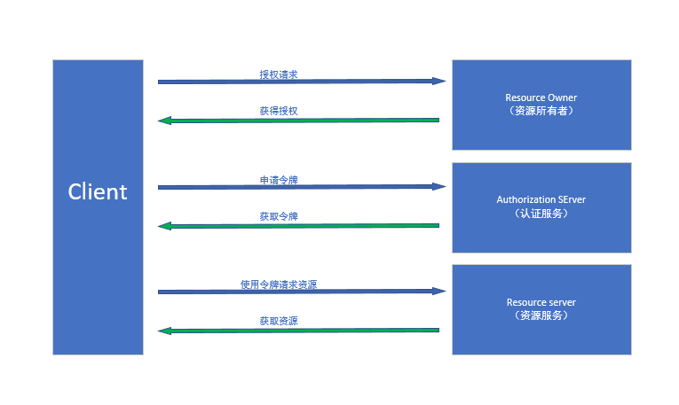

> 本篇主要记录和总结工作中用到授权认证的OAuth2.0
> 如果有人再问你OAuth2.0,你就把这篇文章扔给他

## 流程原理

使用授权码模式完成OAuth2.0授权的过程需要以下四个步骤：

- client请求授权服务端，获取Authorization Code；
- client通过Authorization Code再次请求授权服务端，获取Access Token和Refresh Token；
- client通过Refresh Token刷新获取Access Token；
- client通过服务端返回的Access Token调取服务端接口。



## 数据库的表结构设计

### t_partner_interfaces

用于记录后台分配给用户的权限

```
CREATE TABLE `t_partner_interfaces` (
  `id` bigint(11) unsigned NOT NULL AUTO_INCREMENT,
  `partner_no` varchar(20) NOT NULL DEFAULT '' COMMENT '合作伙伴编号',
  `interfaces` varchar(255) NOT NULL DEFAULT '' COMMENT '接口标志（多个用，分隔）',
  `create_time` timestamp NOT NULL DEFAULT CURRENT_TIMESTAMP,
  `update_time` timestamp NOT NULL DEFAULT CURRENT_TIMESTAMP ON UPDATE CURRENT_TIMESTAMP,
  PRIMARY KEY (`id`)
) ENGINE=InnoDB DEFAULT CHARSET=utf8mb4 COMMENT='合作伙伴接口表';
```

### t_auth_info

用于记录用户的clientId、clientSecret、redirectUri等

```
CREATE TABLE `t_auth_info` (
  `id` bigint(11) unsigned NOT NULL AUTO_INCREMENT,
  `partner_no` varchar(20) NOT NULL DEFAULT '' COMMENT '合作伙伴编号',
  `client_id` varchar(64) NOT NULL DEFAULT '' COMMENT '唯一的clientId',
  `client_secret` varchar(64) NOT NULL DEFAULT '' COMMENT '密钥',
  `redirect_uri` varchar(255) NOT NULL DEFAULT '' COMMENT '回调URI（多个用，分隔）',
  `create_time` timestamp NOT NULL DEFAULT CURRENT_TIMESTAMP,
  `update_time` timestamp NOT NULL DEFAULT CURRENT_TIMESTAMP ON UPDATE CURRENT_TIMESTAMP,
  PRIMARY KEY (`id`)
) ENGINE=InnoDB DEFAULT CHARSET=utf8mb4 COMMENT='授权信息表';
```
### t_auth_token

用户记录授权完成后的授权信息

```
CREATE TABLE `t_auth_token` (
  `id` bigint(11) unsigned NOT NULL AUTO_INCREMENT,
  `partner_no` varchar(20) NOT NULL DEFAULT '' COMMENT '合作伙伴编号',
  `access_token` varchar(128) NOT NULL DEFAULT '' COMMENT '唯一的Access Token',
  `refresh_token` varchar(128) NOT NULL DEFAULT '' COMMENT '唯一的Refresh Token',
  `access_expires_in` timestamp NOT NULL DEFAULT CURRENT_TIMESTAMP COMMENT 'accessToken过期时间',
  `refresh_expires_in` timestamp NOT NULL DEFAULT CURRENT_TIMESTAMP COMMENT 'refreshToken过期时间',
  `scope` varchar(255) NOT NULL DEFAULT '' COMMENT 'accessToken可访问范围',
  `create_time` timestamp NOT NULL DEFAULT CURRENT_TIMESTAMP,
  `update_time` timestamp NOT NULL DEFAULT CURRENT_TIMESTAMP ON UPDATE CURRENT_TIMESTAMP,
  PRIMARY KEY (`id`)
) ENGINE=InnoDB DEFAULT CHARSET=utf8mb4 COMMENT='令牌表';
```

## 授权服务端主要接口的代码实现

### 获取code接口

```
@ApiOperation( "授权获取code")
@GetMapping("/authorize")
public ResultData authorize(HttpServletRequest request) {
    try {
        oAuthService.auth(request);
    } catch (IllegalArgumentException | IllegalStateException e) {
        return ResultData.fail(e.getMessage());
    } catch (Exception e) {
        LOGGER.error("Exception 请求授权接口异常", e);
        return ResultData.fail("系统繁忙，请稍候重试");
    }
    return ResultData.succeed();
}
```

```
public void auth(HttpServletRequest request) {
    oAuthDomain.auth(request);
}
```

```
@Component
@Scope(DefaultListableBeanFactory.SCOPE_PROTOTYPE)
public class OAuthDomain {
    public void auth(HttpServletRequest request) {
        // 客户端ID
        String clientId = request.getParameter("client_id");
        // 权限范围
        String scope = request.getParameter("scope");
        // 回调URL
        String redirectUri = request.getParameter("redirect_uri");
        // state，用于防止CSRF攻击（非必填）
        String state = request.getParameter("state");

        Assert.hasText(clientId, ErrorCodeEnum.INVALID_REQUEST.getErrorDescription());
        Assert.hasText(scope, ErrorCodeEnum.INVALID_REQUEST.getErrorDescription());
        Assert.hasText(redirectUri, ErrorCodeEnum.INVALID_REQUEST.getErrorDescription());

        // 1 校验clientId
        AuthInfoDO authInfoDO = authInfoDAO.getByClientId(clientId);
        Assert.notNull(authInfoDO, ErrorCodeEnum.INVALID_CLIENT.getErrorDescription());

        // 2 校验scope范围
        String partnerNo = authInfoDO.getPartnerNo();
        // 2.1 TODO 校验系统的scope范围
        // 2.2 校验用户的scope范围
        PartnerDO partnerDO = partnerDAO.getByPartnerNo(partnerNo);
        Assert.state(PartnerStatusEnum.OPEN.getStatus().equals(partnerDO.getStatus()), ErrorCodeEnum.INVALID_SCOPE.getErrorDescription());
        PartnerInterfacesDO partnerInterfacesDO = partnerInterfacesDAO.getByPartnerNo(partnerNo);
        Assert.notNull(partnerInterfacesDO, ErrorCodeEnum.INVALID_SCOPE.getErrorDescription());
        String interfaces = partnerInterfacesDO.getInterfaces();
        List interfacesList = Arrays.asList(interfaces.split(","));
        List scopeList = Arrays.asList(scope.split(","));
        Assert.state(interfacesList.containsAll(scopeList), ErrorCodeEnum.INVALID_SCOPE.getErrorDescription());

        // 3 校验redirectUri是否存在
        List redirectUriList = Arrays.asList(authInfoDO.getRedirectUri().split(","));
        Assert.state(redirectUriList.contains(redirectUri), ErrorCodeEnum.INVALID_REDIRECT_URI.getErrorDescription());

        // 4 生成Authorization Code
        String code = createAuthorizationCode(clientId, scope);
        LOGGER.info("客户端ID：" + clientId + "生成的code：" + code);

        // 5 保存Authorization Code, scope到redis
        redisTemplate.opsForValue().set("code:" + partnerNo, code, ExpireEnum.AUTHORIZATION_CODE.getTime(), ExpireEnum.AUTHORIZATION_CODE.getTimeUnit());
        redisTemplate.opsForValue().set("scope:" + partnerNo, scope);

        // 6 设置返回参数
        String params = "?code=" + code;
        params = StringUtils.isNotBlank(state) ? params.concat("&state=").concat(state) : params;

        String uri = redirectUri.concat(params);

        // 7 开子线程，请求重定向地址
        ObjectU.execute(() -> {
            request(uri);
        });
    }
}
```

### code获取Access Token

```
@ApiOperation( "code获取token")
@GetMapping(value = "/token")
public ResultData<Map<String,Object>> token(HttpServletRequest request){
    try {
        return ResultData.succeed(oAuthService.token(request));
    } catch (IllegalArgumentException | IllegalStateException e) {
        return ResultData.fail(e.getMessage());
    } catch (Exception e) {
        LOGGER.error("Exception 请求授权接口异常", e);
        return ResultData.fail("系统繁忙，请稍候重试");
    }
}
```

```
public Map<String,Object> token(HttpServletRequest request) {
    // 1 返回token
    Map<String, Object> result = oAuthDomain.token(request);
    // 2 保存token相关信息
    String clientId = request.getParameter("client_id");
    AuthInfoDO authInfoDO = authInfoDAO.getByClientId(clientId);
    AuthTokenDO authTokenDO = createAuthTokenDO(result, authInfoDO.getPartnerNo(), TokenEnum.ACCESS.getType());
    AuthToken authToken = authTokenFactory.get(authTokenDO);
    authToken.saveOrUpdate();
    return result;
}
```

```
public Map<String,Object> token(HttpServletRequest request) {
    Map<String,Object> result = new HashMap<>(8);

    // 授权方式
    String grantType = request.getParameter("grant_type");
    // 前面获取的Authorization Code
    String code = request.getParameter("code");
    // 客户端ID
    String clientId = request.getParameter("client_id");
    // 接入的客户端的密钥
    String clientSecret = request.getParameter("client_secret");

    Assert.hasText(grantType, ErrorCodeEnum.INVALID_REQUEST.getErrorDescription());
    Assert.hasText(code, ErrorCodeEnum.INVALID_REQUEST.getErrorDescription());
    Assert.hasText(clientId, ErrorCodeEnum.INVALID_REQUEST.getErrorDescription());
    Assert.hasText(clientSecret, ErrorCodeEnum.INVALID_REQUEST.getErrorDescription());

    // 1 校验授权方式
    Assert.state(GrantTypeEnum.AUTHORIZATION_CODE.getType().equals(grantType), ErrorCodeEnum.UNSUPPORTED_GRANT_TYPE.getErrorDescription());

    // 2 校验clientId
    AuthInfoDO authInfoDO = authInfoDAO.getByClientId(clientId);
    Assert.notNull(authInfoDO, ErrorCodeEnum.INVALID_CLIENT.getErrorDescription());

    // 3 校验clientSecret
    String localClientSecret = authInfoDO.getClientSecret();
    Assert.state(clientSecret.equals(localClientSecret), ErrorCodeEnum.INVALID_CLIENT.getErrorDescription());

    // 4 校验code
    String partnerNo = authInfoDO.getPartnerNo();
    String authCode = redisTemplate.opsForValue().get("code:" + partnerNo);
    Assert.hasText(authCode, ErrorCodeEnum.INVALID_GRANT.getErrorDescription());
    Assert.state(code.equals(authCode), ErrorCodeEnum.INVALID_GRANT.getErrorDescription());

    // 5 生成accessToken
    String accessToken = createAccessToken(partnerNo, clientId);

    // 6 生成refreshToken
    String refreshToken = createRefreshToken(partnerNo, accessToken);

    String scope = redisTemplate.opsForValue().get("scope:" + partnerNo);
    // 7 返回数据
    result.put("access_token", accessToken);
    result.put("refresh_token", refreshToken);
    result.put("expires_in", ExpireEnum.ACCESS_TOKEN.getTime() * 3600);
    result.put("scope", scope);
    return result;
}
```

### refreshToken刷新获取accessToken

```
@ApiOperation( "refreshToken获取accessToken")
@GetMapping(value = "/refreshToken")
public ResultData<Map<String,Object>> refreshToken(HttpServletRequest request){
    try {
        return ResultData.succeed(oAuthService.refreshToken(request));
    } catch (IllegalArgumentException | IllegalStateException e) {
        return ResultData.fail(e.getMessage());
    } catch (Exception e) {
        LOGGER.error("Exception 请求授权接口异常", e);
        return ResultData.fail("系统繁忙，请稍候重试");
    }
}
```

```
public Map<String, Object> refreshToken(HttpServletRequest request) {
    // 1 返回token
    Map<String, Object> result = oAuthDomain.refreshToken(request);
    // 2 保存token相关信息
    String refreshToken = request.getParameter("refresh_token");
    AuthTokenDO localAuthTokenDO = authTokenDAO.getByRefreshToken(refreshToken);
    AuthTokenDO authTokenDO = createAuthTokenDO(result, localAuthTokenDO.getPartnerNo(), TokenEnum.REFRESH.getType());
    AuthToken authToken = authTokenFactory.get(authTokenDO);
    authToken.saveOrUpdate();
    return result;
}
```

```
public Map<String, Object> refreshToken(HttpServletRequest request) {
    Map<String,Object> result = new HashMap<>(8);

    // 获取refreshToken
    String refreshToken = request.getParameter("refresh_token");

    // 1 校验refreshToken是否真实有效
    Assert.hasText(refreshToken, ErrorCodeEnum.INVALID_REQUEST.getErrorDescription());
    AuthTokenDO authTokenDO = authTokenDAO.getByRefreshToken(refreshToken);
    Assert.notNull(authTokenDO, ErrorCodeEnum.INVALID_GRANT.getErrorDescription());

    // 2 校验refreshToken是否过期
    Timestamp refreshExpiresIn = authTokenDO.getRefreshExpiresIn();
    Assert.state(LocalDateTime.now().isBefore(refreshExpiresIn.toLocalDateTime()), ErrorCodeEnum.EXPIRED_TOKEN.getErrorDescription());

    // 3 生成新的Access Token
    String partnerNo = authTokenDO.getPartnerNo();
    AuthInfoDO authInfoDO = authInfoDAO.getByPartnerNo(partnerNo);
    String newAccessToken = createAccessToken(partnerNo, authInfoDO.getClientId());

    // 4 返回数据
    result.put("access_token", newAccessToken);
    result.put("refresh_token", refreshToken);
    result.put("expires_in", ExpireEnum.ACCESS_TOKEN.getTime() * 3600);
    result.put("scope", authTokenDO.getScope());
    return result;
}
```

### 枚举

```
public enum ErrorCodeEnum {
    INVALID_REQUEST("invalid_request","请求缺少某个必需参数，包含一个不支持的参数或参数值，或者格式不正确。"),
    INVALID_CLIENT("invalid_client","请求的client_id或client_secret参数无效。"),
    INVALID_GRANT("invalid_grant","请求的Authorization Code、Access Token、Refresh Token等信息是无效的。"),
    UNSUPPORTED_GRANT_TYPE("unsupported_grant_type","不支持的grant_type。"),
    INVALID_SCOPE("invalid_scope","请求的scope参数是无效的、未知的、格式不正确的，或所请求的权限范围超过了数据拥有者所授予的权限范围。"),
    EXPIRED_TOKEN("expired_token","请求的Access Token或Refresh Token已过期。"),
    REDIRECT_URI_MISMATCH("redirect_uri_mismatch","请求的redirect_uri所在的域名与开发者注册应用时所填写的域名不匹配。"),
    INVALID_REDIRECT_URI("invalid_redirect_uri","请求的回调URL不在白名单中。"),
    UNKNOWN_ERROR("unknown_error","程序发生未知异常，请联系管理员解决。");

    /**
     * 错误码
     */
    private String error;
    /**
     * 错误描述信息
     */
    private String errorDescription;

    ErrorCodeEnum(String error, String errorDescription) {
        this.error = error;
        this.errorDescription = errorDescription;
    }

    public String getError() {
        return error;
    }

    public String getErrorDescription() {
        return errorDescription;
    }
}
```

```
/**
 * 过期时间相关枚举
 * @author CFL
 */
public enum ExpireEnum {
    // Authorization Code的有效期为10分钟
    AUTHORIZATION_CODE(10L, TimeUnit.MINUTES),
    // Access Token的有效期为12小时
    ACCESS_TOKEN(12L, TimeUnit.HOURS),
    // Refresh Token的有效期为24小时
    REFRESH_TOKEN(24L,TimeUnit.HOURS)
    ;

    /**
     * 过期时间
     */
    private Long time;
    /**
     * 时间单位
     */
    private TimeUnit timeUnit;

    ExpireEnum(Long time, TimeUnit timeUnit) {
        this.time = time;
        this.timeUnit = timeUnit;
    }

    public Long getTime() {
        return time;
    }

    public TimeUnit getTimeUnit() {
        return timeUnit;
    }
}
```

```
/**
 * 授权方式
 */
public enum GrantTypeEnum {
    // 授权码模式
    AUTHORIZATION_CODE("authorization_code");

    private String type;

    GrantTypeEnum(String type) {
        this.type = type;
    }

    public String getType() {
        return type;
    }
}
```

```
public enum TokenEnum {
    ACCESS((byte)0, "accessToken"),
    REFRESH((byte)1, "refreshToken");
    private Byte type;
    private String remark;

    TokenEnum(Byte type, String remark) {
        this.type = type;
        this.remark = remark;
    }

    public Byte getType() {
        return type;
    }

    public String getRemark() {
        return remark;
    }
}
```

### 拦截器

```
@Component
public class AuthAccessTokenInterceptor extends HandlerInterceptorAdapter {

    @Override
    public boolean preHandle(HttpServletRequest request, HttpServletResponse response, Object handler) throws Exception {
        String accessToken = request.getHeader("accessToken");
        String requestURI = request.getRequestURI();

        if (StringUtils.isNotBlank(accessToken)) {
            AuthTokenDO authTokenDO = authTokenDAO.getByAccessToken(accessToken);
            if (Objects.nonNull(authTokenDO)) {
                String scope = authTokenDO.getScope();
                if (StringUtils.isBlank(scope)) {
                    return generateErrorResponse(response, ErrorCodeEnum.INVALID_SCOPE);
                }
                List<String> scopeList = Arrays.asList(scope.split(","));
                String uri = requestURI.substring(requestURI.lastIndexOf("/") + 1);
                if (!scopeList.contains(uri)) {
                    return generateErrorResponse(response, ErrorCodeEnum.INVALID_SCOPE);
                }
                ApiPermissionDO apiPermissionDO = apiPermissionDAO.getByApiSource(uri);
                if (Objects.isNull(apiPermissionDO) || apiPermissionDO.getStatus() == 0) {
                    return generateErrorResponse(response, ErrorCodeEnum.INVALID_SCOPE);
                }
                PartnerDO partnerDO = partnerDAO.getByPartnerNo(authTokenDO.getPartnerNo());
                if (Objects.isNull(partnerDO) || partnerDO.getStatus() == 1) {
                    return generateErrorResponse(response, ErrorCodeEnum.INVALID_SCOPE);
                }
                LocalDateTime accessExpiresIn = authTokenDO.getAccessExpiresIn().toLocalDateTime();
                request.setAttribute("partner_no", authTokenDO.getPartnerNo());
                return LocalDateTime.now().isBefore(accessExpiresIn) || generateErrorResponse(response, ErrorCodeEnum.EXPIRED_TOKEN);
            } else {
                return generateErrorResponse(response, ErrorCodeEnum.INVALID_GRANT);
            }
        } else {
            return generateErrorResponse(response, ErrorCodeEnum.INVALID_REQUEST);
        }
    }

    private boolean generateErrorResponse(HttpServletResponse response, ErrorCodeEnum errorCodeEnum) throws Exception {
        response.setCharacterEncoding("UTF-8");
        response.setHeader("Content-type", "application/json;charset=UTF-8");
        Map<String,String> result = new HashMap<>(2);
        result.put("statusCode", errorCodeEnum.getError());
        result.put("message",errorCodeEnum.getErrorDescription());

        response.getWriter().write(JSON.toJSON(result).toString());
        return false;
    }
}
```

```
public class AuthUtil {
    public static String getPartnerNo() {
        ServletRequestAttributes servletRequestAttributes = (ServletRequestAttributes) RequestContextHolder.getRequestAttributes();
        if (Objects.isNull(servletRequestAttributes)){
            return null;
        }
        HttpServletRequest request = servletRequestAttributes.getRequest();
        String partnerNo = (String) request.getAttribute("partner_no");
        return partnerNo;
    }
}
```

```
@Configuration
public class InterceptorConfig implements WebMvcConfigurer {
    @Autowired
    private AuthAccessTokenInterceptor authAccessTokenInterceptor;

    @Override
    public void addInterceptors(InterceptorRegistry registry) {
        registry.addInterceptor(authAccessTokenInterceptor)
                .addPathPatterns("/api/**");
    }
}
```