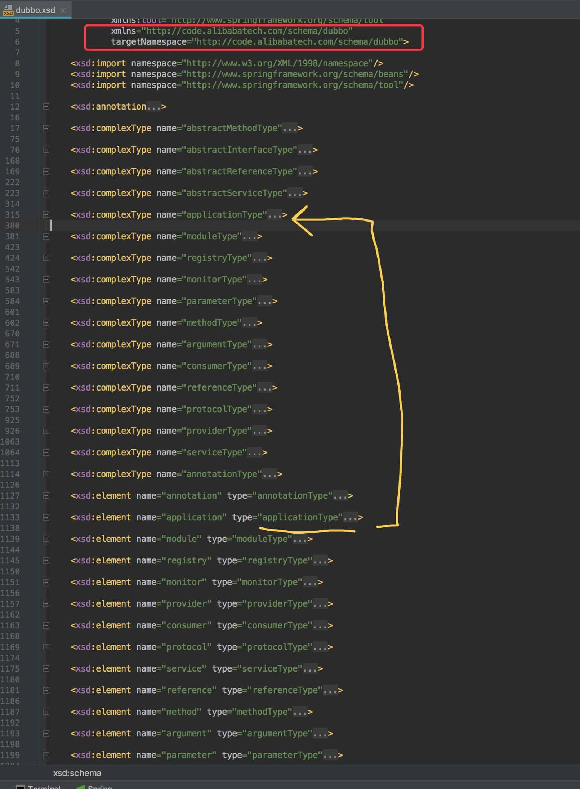
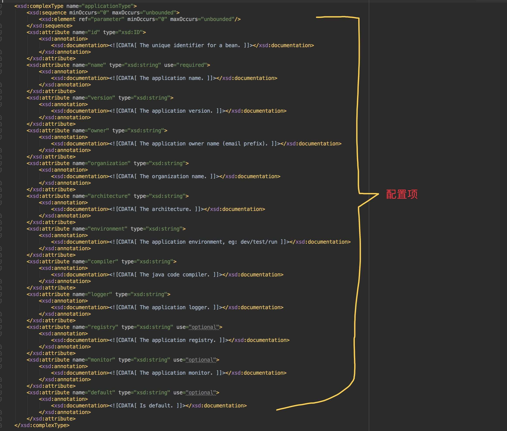
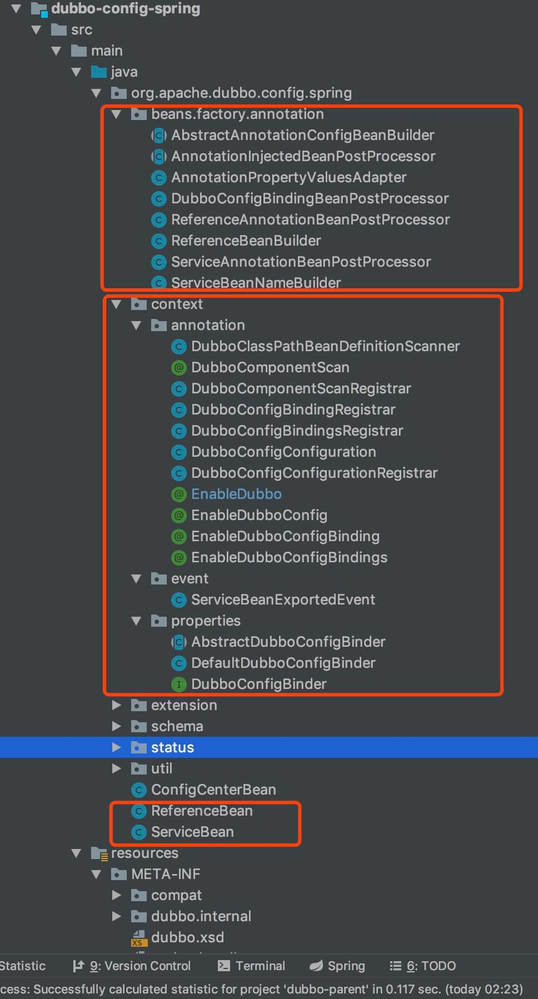

# 属性配置

## 1. 概述

首先，我们来看看**属性配置**的定义：

> FROM [《Dubbo 用户指南 —— 属性配置》](http://dubbo.apache.org/zh-cn/docs/user/configuration/properties.html)
>
> 如果公共配置很**简单**，没有多注册中心，多协议等情况，或者想多个 Spring 容器想共享配置，可以使用 `dubbo.properties` 作为缺省配置。
>
> Dubbo 将自动加载 classpath 根目录下的 `dubbo.properties`，可以通过JVM启动参数 `-Ddubbo.properties.file=xxx.properties` 改变缺省配置位置。

从定义上，很关键的一个词是 “**简单**” 。

- **属性配置**，不支持多注册中心，多协议等情况，原因见代码。
- **外部化配置**，能够解决上述的问题，感兴趣的可以自己看下 [《Dubbo 外部化配置（Externalized Configuration）》](https://github.com/mercyblitz/blogs/blob/master/java/dubbo/Dubbo-Externalized-Configuration.md) 。当然，这块内容后面分享，不在本文的范畴。

OK ，下面在开始看看具体代码之前，先仔细阅读下 [《Dubbo 用户指南 —— 属性配置》](http://dubbo.apache.org/zh-cn/docs/user/configuration/properties.html) ，有助于下面代码的理解。

## 2. AbstractConfig

在 AbstractConfig 中，提供了 [`#appendProperties(config)`](https://github.com/YunaiV/dubbo/blob/d3c3975f320c78452f96098b04441fed4c00ab70/dubbo-config/dubbo-config-api/src/main/java/com/alibaba/dubbo/config/AbstractConfig.java#L132-L212) 方法，读取**启动参数变量**和 **properties 配置**到配置对象。在前面的几篇文章里，我们多次看到这个方法被调用，如下图所示：

[](http://static.iocoder.cn/images/Dubbo/2018_01_13/01.png)读取调用

代码如下：

```
 1: protected static void appendProperties(AbstractConfig config) {
 2:     if (config == null) {
 3:         return;
 4:     }
 5:     String prefix = "dubbo." + getTagName(config.getClass()) + ".";
 6:     Method[] methods = config.getClass().getMethods();
 7:     for (Method method : methods) {
 8:         try {
 9:             String name = method.getName();
10:             if (name.length() > 3 && name.startsWith("set") && Modifier.isPublic(method.getModifiers()) // 方法是 public 的 setting 方法。
11:                     && method.getParameterTypes().length == 1 && isPrimitive(method.getParameterTypes()[0])) { // 方法的唯一参数是基本数据类型
12:                 // 获得属性名，例如 `ApplicationConfig#setName(...)` 方法，对应的属性名为 name 。
13:                 String property = StringUtils.camelToSplitName(name.substring(3, 4).toLowerCase() + name.substring(4), ".");
14: 
15:                 // 【启动参数变量】优先从带有 `Config#id` 的配置中获取，例如：`dubbo.application.demo-provider.name` 。
16:                 String value = null;
17:                 if (config.getId() != null && config.getId().length() > 0) {
18:                     String pn = prefix + config.getId() + "." + property; // 带有 `Config#id`
19:                     value = System.getProperty(pn);
20:                     if (!StringUtils.isBlank(value)) {
21:                         logger.info("Use System Property " + pn + " to config dubbo");
22:                     }
23:                 }
24:                 // 【启动参数变量】获取不到，其次不带 `Config#id` 的配置中获取，例如：`dubbo.application.name` 。
25:                 if (value == null || value.length() == 0) {
26:                     String pn = prefix + property; // // 不带 `Config#id`
27:                     value = System.getProperty(pn);
28:                     if (!StringUtils.isBlank(value)) {
29:                         logger.info("Use System Property " + pn + " to config dubbo");
30:                     }
31:                 }
32:                 if (value == null || value.length() == 0) {
33:                     // 覆盖优先级为：启动参数变量 > XML 配置 > properties 配置，因此需要使用 getter 判断 XML 是否已经设置
34:                     Method getter;
35:                     try {
36:                         getter = config.getClass().getMethod("get" + name.substring(3), new Class<?>[0]);
37:                     } catch (NoSuchMethodException e) {
38:                         try {
39:                             getter = config.getClass().getMethod("is" + name.substring(3), new Class<?>[0]);
40:                         } catch (NoSuchMethodException e2) {
41:                             getter = null;
42:                         }
43:                     }
44:                     if (getter != null) {
45:                         if (getter.invoke(config, new Object[0]) == null) { // 使用 getter 判断 XML 是否已经设置
46:                             // 【properties 配置】优先从带有 `Config#id` 的配置中获取，例如：`dubbo.application.demo-provider.name` 。
47:                             if (config.getId() != null && config.getId().length() > 0) {
48:                                 value = ConfigUtils.getProperty(prefix + config.getId() + "." + property);
49:                             }
50:                             // 【properties 配置】获取不到，其次不带 `Config#id` 的配置中获取，例如：`dubbo.application.name` 。
51:                             if (value == null || value.length() == 0) {
52:                                 value = ConfigUtils.getProperty(prefix + property);
53:                             }
54:                             // 【properties 配置】老版本兼容，获取不到，最后不带 `Config#id` 的配置中获取，例如：`dubbo.protocol.name` 。
55:                             if (value == null || value.length() == 0) {
56:                                 String legacyKey = legacyProperties.get(prefix + property);
57:                                 if (legacyKey != null && legacyKey.length() > 0) {
58:                                     value = convertLegacyValue(legacyKey, ConfigUtils.getProperty(legacyKey));
59:                                 }
60:                             }
61: 
62:                         }
63:                     }
64:                 }
65:                 // 获取到值，进行反射设置。
66:                 if (value != null && value.length() > 0) {
67:                     method.invoke(config, new Object[]{convertPrimitive(method.getParameterTypes()[0], value)});
68:                 }
69:             }
70:         } catch (Exception e) {
71:             logger.error(e.getMessage(), e);
72:         }
73:     }
74: }
```

- 第 5 行：获得配置项**前缀**。此处的 [`#getTagName(Class)`](https://github.com/YunaiV/dubbo/blob/d3c3975f320c78452f96098b04441fed4c00ab70/dubbo-config/dubbo-config-api/src/main/java/com/alibaba/dubbo/config/AbstractConfig.java#L214-L230) 方法，使用配置类的类名，获得对应的属性标签。该方法代码如下：

  ```
   1: /**
   2:  * 配置类名的后缀
   3:  * 例如，ServiceConfig 后缀为 Config；ServiceBean 后缀为 Bean。
   4:  */
   5: private static final String[] SUFFIXES = new String[]{"Config", "Bean"};
   6: 
   7: /**
   8:  * 获取类名对应的属性标签，例如，ServiceConfig 对应为 service 。
   9:  *
  10:  * @param cls 类名
  11:  * @return 标签
  12:  */
  13: private static String getTagName(Class<?> cls) {
  14:     String tag = cls.getSimpleName();
  15:     for (String suffix : SUFFIXES) {
  16:         if (tag.endsWith(suffix)) {
  17:             tag = tag.substring(0, tag.length() - suffix.length());
  18:             break;
  19:         }
  20:     }
  21:     tag = tag.toLowerCase();
  22:     return tag;
  23: }
  ```

- 第 6 行：获得配置类的所有方法，用于下面通过**反射**获得配置项的属性名，再用属性名，去读取**启动参数变量**和 **properties 配置**到配置对象。

- 第 10 至 11 行：public && setting 方法 && **唯一**参数为基本类型。

  - 其中**唯一**参数为**基本类型**，决定了一个配置对象无法设置另外一个配置对象**数组**为属性，即**没有多注册中心，多协议等情况**。例如，ServiceConfig 无法通过**属性配置**设置多个 ProtocolConfig 对象。

  - 当然上述问题，正如文初所说，[《Dubbo 外部化配置（Externalized Configuration）》](https://github.com/mercyblitz/blogs/blob/master/java/dubbo/Dubbo-Externalized-Configuration.md) 已经支持。

  - 另外，**属性配置**和**外部化配置**有一定的相似点：

    > FROM [《Dubbo 外部化配置（Externalized Configuration）》](https://github.com/mercyblitz/blogs/blob/master/java/dubbo/Dubbo-Externalized-Configuration.md)

    在 Dubbo 官方用户手册的[“属性配置”](http://dubbo.apache.org/zh-cn/docs/user/configuration/properties.html)章节中，`dubbo.properties` 配置属性能够映射到 `ApplicationConfig` 、`ProtocolConfig` 以及 `RegistryConfig` 的字段。从某种意义上来说，`dubbo.properties` 也是 Dubbo 的外部化配置。

- 第 13 行：获得属性名。例如，`ApplicationConfig#setName(...)` 方法，对应的属性名为 `"name"` 。

- 读取的**覆盖策略**如下：

  > [](http://static.iocoder.cn/images/Dubbo/2018_01_13/02.png)覆盖策略

- 第 15 至 31 行：优先从【**启动参数变量**】获取配置项的值。

  - 🙂 有**两种**情况，细看下注释。

- 第 33 至 45 行：因为 XML配置 的优先级**大于** properties配置，因此需要**获取并使用** getting 方法，判断配置对象**已经拥有**该配置项的值。如果有，则不从 properties配置 读取对应的值。

- 第 46 至 59 行：最后从【**properties配置**】获取配置项的值。

  - 🙂 有**三种**情况，前两种和【**启动参数变量**】相同。

  - 最后一种，主要是兼容老版本的配置项。代码如下：

    ```
     1: /**
     2:  * 新老版本的 properties 的 key 映射
     3:  *
     4:  * key：新版本的配置 映射
     5:  * value：旧版本的配置 映射
     6:  *
     7:  * 来自 2012/3/8 下午 5：51 cb1f705 提交
     8:  * DUBBO-251 增加API覆盖dubbo.properties的测试，以及旧版本配置项测试。
     9:  */
    10: private static final Map<String, String> legacyProperties = new HashMap<String, String>();
    11: 
    12: /**
    13:  * 将键对应的值转换成目标的值。
    14:  *
    15:  * 因为，新老配置可能有一些差异，通过该方法进行转换。
    16:  *
    17:  * @param key 键
    18:  * @param value 值
    19:  * @return 转换后的值
    20:  */
    21: private static String convertLegacyValue(String key, String value) {
    22:     if (value != null && value.length() > 0) {
    23:         if ("dubbo.service.max.retry.providers".equals(key)) {
    24:             return String.valueOf(Integer.parseInt(value) - 1);
    25:         } else if ("dubbo.service.allow.no.provider".equals(key)) {
    26:             return String.valueOf(!Boolean.parseBoolean(value));
    27:         }
    28:     }
    29:     return value;
    30: }
    ```

    - x

- 第 65 至 68 行：有值，通过反射进行设置到配置对象中。

- 第 70 至 72 行：逻辑中间发生异常，**不抛出异常**，仅打印错误日志。

# XML 配置

## 1. 概述

在 Dubbo 提供的几种方式中，**XML 配置**肯定是大家最熟悉的方式。

如果不熟悉，可以查看如下文档：

- [《Dubbo 用户指南 —— XML 配置》](http://dubbo.apache.org/zh-cn/docs/user/configuration/xml.html)
- [《Dubbo 用户指南 —— schema 配置参考手册》](http://dubbo.apache.org/zh-cn/docs/user/references/xml/introduction.html)

XML 配置，自定义 `<dubbo: />` 标签，基于 **Spring XML** 进行解析。如果不了解的，可以查看如下文档：

- [《Spring 源码阅读 —— XML 文件默认标签的解析》](https://gavinzhang1.gitbooks.io/spring/content/xmlwen_jian_mo_ren_biao_qian_de_jie_xi.html)
- [《Spring 源码阅读 —— XML 自定义标签的解析》](https://gavinzhang1.gitbooks.io/spring/content/xmlzi_ding_yi_biao_qian_de_jie_xi.html)

## 2. 定义

### 2.1 sprng.schemas

Dubbo 在 `dubbo-spring-config` 的 [`META-INF/spring.schemas`](https://github.com/YunaiV/dubbo/blob/05dd4fe091e37d08e01d4e243e3fc24dbfdc61ff/dubbo-config/dubbo-config-spring/src/main/resources/META-INF/spring.schemas) 定义如下：

```
http\://code.alibabatech.com/schema/dubbo/dubbo.xsd=META-INF/dubbo.xsd
```

- `xmlns` 为 `http://code.alibabatech.com/schema/dubbo`
- `xsd` 为 `META-INF/dubbo.xsd`

### 2.2 dubbo.xsd

[`dubbo.xsd`](https://github.com/YunaiV/dubbo/blob/05dd4fe091e37d08e01d4e243e3fc24dbfdc61ff/dubbo-config/dubbo-config-spring/src/main/resources/META-INF/dubbo.xsd) 定义如下：

[](http://static.iocoder.cn/images/Dubbo/2018_01_19/01.png)dubbo.xsd

- `<xsd:element name="" />` ，定义了**元素的名称**。例如，`<xsd:element name="application" />` 对应 `<dubbo:application />` 。
- `<xsd:element type="" />` ，定义了**内建数据类型的名称**。例如，`<xsd:element type="applicationType" />` 对应 `<xsd:complexType name="applicationType" />` 。
- `<xsd:complexType name="">` ，定义了**复杂类型**。例如 `<xsd:complexType name="applicationType" />` 如下：

[](http://static.iocoder.cn/images/Dubbo/2018_01_19/02.png)applicationType

### 2.3 spring.handlers

[`spring.handlers`](https://github.com/YunaiV/dubbo/blob/05dd4fe091e37d08e01d4e243e3fc24dbfdc61ff/dubbo-config/dubbo-config-spring/src/main/resources/META-INF/spring.handlers) 定义如下：

```
http\://code.alibabatech.com/schema/dubbo=com.alibaba.dubbo.config.spring.schema.DubboNamespaceHandler
```

- 定义了 Dubbo 的 XML Namespace 的处理器 DubboNamespaceHandler 。

### 2.4 DubboNamespaceHandler

[`com.alibaba.dubbo.config.spring.schema.DubboNamespaceHandler`](https://github.com/YunaiV/dubbo/blob/025ac8b49c7608b0a76ea7bd8c2de6c72138b5ef/dubbo-config/dubbo-config-spring/src/main/java/com/alibaba/dubbo/config/spring/schema/DubboNamespaceHandler.java) ，实现 `org.springframework.beans.factory.xml.NamespaceHandlerSupport` **抽象类**，Dubbo 的 XML Namespace 的处理器。

在 [`#init()`](https://github.com/YunaiV/dubbo/blob/6cd9a5b53ca8f86de7eac4e978c1f2d13c439845/dubbo-config/dubbo-config-spring/src/main/java/com/alibaba/dubbo/config/spring/schema/DubboNamespaceHandler.java#L36-L49) 方法，定义了每个 `<xsd:element />` 对应的 `org.springframework.beans.factory.xml.BeanDefinitionParser` ，代码如下：

```
@Override
public void init() {
    registerBeanDefinitionParser("application", new DubboBeanDefinitionParser(ApplicationConfig.class, true));
    registerBeanDefinitionParser("module", new DubboBeanDefinitionParser(ModuleConfig.class, true));
    registerBeanDefinitionParser("registry", new DubboBeanDefinitionParser(RegistryConfig.class, true));
    registerBeanDefinitionParser("monitor", new DubboBeanDefinitionParser(MonitorConfig.class, true));
    registerBeanDefinitionParser("provider", new DubboBeanDefinitionParser(ProviderConfig.class, true));
    registerBeanDefinitionParser("consumer", new DubboBeanDefinitionParser(ConsumerConfig.class, true));
    registerBeanDefinitionParser("protocol", new DubboBeanDefinitionParser(ProtocolConfig.class, true));
    registerBeanDefinitionParser("service", new DubboBeanDefinitionParser(ServiceBean.class, true));
    registerBeanDefinitionParser("reference", new DubboBeanDefinitionParser(ReferenceBean.class, false));

    registerBeanDefinitionParser("annotation", new AnnotationBeanDefinitionParser()); // 废弃
}
```

- 细心的，会看到 `service` 标签使用的是 ServiceBean ，而不是 ServiceConfig ，`reference` 表示用的是 ReferenceBean ，因为无论是 ServiceConfig 还是 ReferenceBean ，在解析完具体配置后，需要调用它们对应的方法进行**初始化**。🙂 考虑到篇幅，我们在后续文章分享。这篇我们重点放在**解析**。

## 3. 解析

[`com.alibaba.dubbo.config.spring.schema.DubboBeanDefinitionParser`](http://svip.iocoder.cn/Dubbo/configuration-xml/DubboBeanDefinitionParser) ，实现 `org.springframework.beans.factory.xml.BeanDefinitionParser` **接口**，Dubbo Bean 定义解析器。

### 3.1 构造方法

[构造方法](https://github.com/YunaiV/dubbo/blob/55227e1897030c42342c65b2fce8e1705844a531/dubbo-config/dubbo-config-spring/src/main/java/com/alibaba/dubbo/config/spring/schema/DubboBeanDefinitionParser.java#L62-L74) ，代码如下：

```
/**
 * Bean 对象的类
 */
private final Class<?> beanClass;
/**
 * 是否需要 Bean 的 `id` 属性
 */
private final boolean required;

public DubboBeanDefinitionParser(Class<?> beanClass, boolean required) {
    this.beanClass = beanClass;
    this.required = required;
}
```

- `beanClass` ，Bean 对象的**类**。
- `required` ，是否需要在 Bean 对象的编号( `id` ) 不存在时，**自动生成编号**。无需被其他应用引用的配置对象，无需自动生成编号。例如有 `<dubbo:reference />` 。

### 3.2 解析方法【主流程】

[`#parse(Element, ParserContext)`](https://github.com/YunaiV/dubbo/blob/55227e1897030c42342c65b2fce8e1705844a531/dubbo-config/dubbo-config-spring/src/main/java/com/alibaba/dubbo/config/spring/schema/DubboBeanDefinitionParser.java#L516-L518) 方法，解析 XML 元素。代码如下：

```
public BeanDefinition parse(Element element, ParserContext parserContext) {
    return parse(element, parserContext, beanClass, required);
}
```

- 调用 [`#parse(Element, ParserContext, beanClass, required)`](https://github.com/YunaiV/dubbo/blob/55227e1897030c42342c65b2fce8e1705844a531/dubbo-config/dubbo-config-spring/src/main/java/com/alibaba/dubbo/config/spring/schema/DubboBeanDefinitionParser.java#L76-L292) 方法，**真正**解析 XML 元素。该方法十分冗长，近 200+ 行。另外算上内部会调用其他方法，整体 500+ 行左右。🙂 下面，我们来将方法切换理解。

> 友情提示：建议，能够边看边调试。

##### 3.2.1 创建 RootBeanDefinition

[`#parse(Element, ParserContext, beanClass, required)`](https://github.com/YunaiV/dubbo/blob/55227e1897030c42342c65b2fce8e1705844a531/dubbo-config/dubbo-config-spring/src/main/java/com/alibaba/dubbo/config/spring/schema/DubboBeanDefinitionParser.java#L76-L292) 的第 78 至 80 行，代码如下：

```
RootBeanDefinition beanDefinition = new RootBeanDefinition();
beanDefinition.setBeanClass(beanClass);
beanDefinition.setLazyInit(false);
```

- 默认 `lazyInit = false` 。

  > FROM [《Dubbo 用户指南 —— XML 配置》](http://dubbo.apache.org/zh-cn/docs/user/configuration/xml.html)
  > 引用缺省是延迟初始化的，只有引用被注入到其它 Bean，或被 getBean() 获取，才会初始化。如果需要饥饿加载，即没有人引用也立即生成动态代理，可以配置：`<dubbo:reference ... init="true" />`

##### 3.2.2 处理 Bean 的编号

[`#parse(Element, ParserContext, beanClass, required)`](https://github.com/YunaiV/dubbo/blob/55227e1897030c42342c65b2fce8e1705844a531/dubbo-config/dubbo-config-spring/src/main/java/com/alibaba/dubbo/config/spring/schema/DubboBeanDefinitionParser.java#L81-L111) 的第 81 至 111 行，代码如下：

```
 81: // 解析配置对象的 id 。若不存在，则进行生成。
 82: String id = element.getAttribute("id");
 83: if ((id == null || id.length() == 0) && required) {
 84:     // 生成 id 。不同的配置对象，会存在不同。
 85:     String generatedBeanName = element.getAttribute("name");
 86:     if (generatedBeanName == null || generatedBeanName.length() == 0) {
 87:         if (ProtocolConfig.class.equals(beanClass)) {
 88:             generatedBeanName = "dubbo";
 89:         } else {
 90:             generatedBeanName = element.getAttribute("interface");
 91:         }
 92:     }
 93:     if (generatedBeanName == null || generatedBeanName.length() == 0) {
 94:         generatedBeanName = beanClass.getName();
 95:     }
 96:     id = generatedBeanName;
 97:     // 若 id 已存在，通过自增序列，解决重复。
 98:     int counter = 2;
 99:     while (parserContext.getRegistry().containsBeanDefinition(id)) {
100:         id = generatedBeanName + (counter++);
101:     }
102: }
103: if (id != null && id.length() > 0) {
104:     if (parserContext.getRegistry().containsBeanDefinition(id)) {
105:         throw new IllegalStateException("Duplicate spring bean id " + id);
106:     }
107:     // 添加到 Spring 的注册表
108:     parserContext.getRegistry().registerBeanDefinition(id, beanDefinition);
109:     // 设置 Bean 的 `id` 属性值
110:     beanDefinition.getPropertyValues().addPropertyValue("id", id);
111: }
```

- 第 82 至 102 行：解析 Bean 的

   

  ```
  id
  ```

   

  。若不存在，则自动进行生成。

  - 第 85 至 96 行：生成 `id` 。规则为 `name` > 特殊规则 > `className` 。
  - 第 97 至 101 行：若 `id` 在 Spring 注册表已经存在，通过添加**自增序列**作为后缀，避免冲突。

- 第 108 行：添加 Bean 到 Spring 注册表。

- 第 110 行：设置 Bean 的 `id` 。

##### 3.2.3 处理 `<dubbo:protocol/>` 特殊情况

[`#parse(Element, ParserContext, beanClass, required)`](https://github.com/YunaiV/dubbo/blob/55227e1897030c42342c65b2fce8e1705844a531/dubbo-config/dubbo-config-spring/src/main/java/com/alibaba/dubbo/config/spring/schema/DubboBeanDefinitionParser.java#L113-L128) 的第 113 至 128 行，代码如下：

```
113: // 处理 `<dubbo:protocol` /> 的特殊情况
114: if (ProtocolConfig.class.equals(beanClass)) {
115:     // 需要满足第 220 至 233 行。
116:     // 例如：【顺序要这样】
117:     // <dubbo:service interface="com.alibaba.dubbo.demo.DemoService" protocol="dubbo" ref="demoService"/>
118:     // <dubbo:protocol id="dubbo" name="dubbo" port="20880"/>
119:     for (String name : parserContext.getRegistry().getBeanDefinitionNames()) {
120:         BeanDefinition definition = parserContext.getRegistry().getBeanDefinition(name);
121:         PropertyValue property = definition.getPropertyValues().getPropertyValue("protocol");
122:         if (property != null) {
123:             Object value = property.getValue();
124:             if (value instanceof ProtocolConfig && id.equals(((ProtocolConfig) value).getName())) {
125:                 definition.getPropertyValues().addPropertyValue("protocol", new RuntimeBeanReference(id));
126:             }
127:         }
128:     }
```

在 [「3.2.7 循环 Bean 对象的 setting 方法，将属性赋值到 Bean 对象」](http://svip.iocoder.cn/Dubbo/configuration-xml/#) 统一解析。

##### 3.2.4 处理 `<dubbo:service />` 的 `class` 属性

[`#parse(Element, ParserContext, beanClass, required)`](https://github.com/YunaiV/dubbo/blob/55227e1897030c42342c65b2fce8e1705844a531/dubbo-config/dubbo-config-spring/src/main/java/com/alibaba/dubbo/config/spring/schema/DubboBeanDefinitionParser.java#L129-L142) 的第 129 至 142 行，代码如下：

```
113: // 处理 `<dubbo:service />` 的属性 `class`
114: } else if (ServiceBean.class.equals(beanClass)) {
115:     // 处理 `class` 属性。例如  <dubbo:service id="sa" interface="com.alibaba.dubbo.demo.DemoService" class="com.alibaba.dubbo.demo.provider.DemoServiceImpl" >
116:     String className = element.getAttribute("class");
117:     if (className != null && className.length() > 0) {
118:         // 创建 Service 的 RootBeanDefinition 对象。相当于内嵌了 <bean class="com.alibaba.dubbo.demo.provider.DemoServiceImpl" />
119:         RootBeanDefinition classDefinition = new RootBeanDefinition();
120:         classDefinition.setBeanClass(ReflectUtils.forName(className));
121:         classDefinition.setLazyInit(false);
122:         // 解析 Service Bean 对象的属性
123:         parseProperties(element.getChildNodes(), classDefinition);
124:         // 设置 `<dubbo:service ref="" />` 属性
125:         beanDefinition.getPropertyValues().addPropertyValue("ref", new BeanDefinitionHolder(classDefinition, id + "Impl"));
126:     }
```

- 处理 `<dubbo:service class="" />` 场景下的处理，**大多数**情况下我们不这么使用，包括官方文档也没提供这种方式的说明。当配置 `class` 属时，会自动创建 Service Bean 对象，而无需再配置 `ref` 属性，指向 Service Bean 对象。示例如下：

  ```
  <bean id="demoDAO" class="com.alibaba.dubbo.demo.provider.DemoDAO" />
  
  <dubbo:service id="sa" interface="com.alibaba.dubbo.demo.DemoService"  class="com.alibaba.dubbo.demo.provider.DemoServiceImpl">
      <property name="demoDAO" ref="demoDAO" />
  </dubbo:service>
  ```

  - 通过这种方式，可以使用 `<property />` 标签，设置 Service Bean 的属性。

- 第 118 至 121 行：创建 Service 的 Bean 对象。

- 第 123 行：调用 [`#parseProperties(NodeList, RootBeanDefinition)`](https://github.com/YunaiV/dubbo/blob/55227e1897030c42342c65b2fce8e1705844a531/dubbo-config/dubbo-config-spring/src/main/java/com/alibaba/dubbo/config/spring/schema/DubboBeanDefinitionParser.java#L368-L399) 方法，解析 Service Bean 对象的属性们。详细解析见 [「3.3.1 parseProperties」](http://svip.iocoder.cn/Dubbo/configuration-xml/#) 方法。

##### 3.2.5 解析 `<dubbo:provider />` 的内嵌子元素 `<dubbo:service />`

[`#parse(Element, ParserContext, beanClass, required)`](https://github.com/YunaiV/dubbo/blob/55227e1897030c42342c65b2fce8e1705844a531/dubbo-config/dubbo-config-spring/src/main/java/com/alibaba/dubbo/config/spring/schema/DubboBeanDefinitionParser.java#L143-L145) 的第 143 至 145 行，代码如下：

```
// 解析 `<dubbo:provider />` 的内嵌子元素 `<dubbo:service />`
} else if (ProviderConfig.class.equals(beanClass)) {
    parseNested(element, parserContext, ServiceBean.class, true, "service", "provider", id, beanDefinition);
```

- 调用 [`#parseNested(...)`](https://github.com/YunaiV/dubbo/blob/55227e1897030c42342c65b2fce8e1705844a531/dubbo-config/dubbo-config-spring/src/main/java/com/alibaba/dubbo/config/spring/schema/DubboBeanDefinitionParser.java#L326-L366) 方法，解析内嵌的指向的子 XML 元素。详细解析见 [「3.3.2 parseNested」](http://svip.iocoder.cn/Dubbo/configuration-xml/#) 方法。

##### 3.2.6 解析 `<dubbo:consumer />` 的内嵌子元素 `<dubbo:reference />`

[`#parse(Element, ParserContext, beanClass, required)`](https://github.com/YunaiV/dubbo/blob/55227e1897030c42342c65b2fce8e1705844a531/dubbo-config/dubbo-config-spring/src/main/java/com/alibaba/dubbo/config/spring/schema/DubboBeanDefinitionParser.java#L146-L149) 的第 146 至 149 行，代码如下：

```
// 解析 `<dubbo:consumer />` 的内嵌子元素 `<dubbo:reference />`
} else if (ConsumerConfig.class.equals(beanClass)) {
    parseNested(element, parserContext, ReferenceBean.class, false, "reference", "consumer", id, beanDefinition);
}
```

- 调用 [`#parseNested(...)`](https://github.com/YunaiV/dubbo/blob/55227e1897030c42342c65b2fce8e1705844a531/dubbo-config/dubbo-config-spring/src/main/java/com/alibaba/dubbo/config/spring/schema/DubboBeanDefinitionParser.java#L326-L366) 方法，解析内嵌的指向的子 XML 元素。

##### 3.2.7 循环 Bean 对象的 setting 方法，将属性赋值到 Bean 对象

[`#parse(Element, ParserContext, beanClass, required)`](https://github.com/YunaiV/dubbo/blob/55227e1897030c42342c65b2fce8e1705844a531/dubbo-config/dubbo-config-spring/src/main/java/com/alibaba/dubbo/config/spring/schema/DubboBeanDefinitionParser.java#L150-L273) 的第 150 至 273 行，代码如下：

```
150: Set<String> props = new HashSet<String>(); // 已解析的属性集合
151: ManagedMap parameters = null; //
152: // 循环 Bean 对象的 setting 方法，将属性添加到 Bean 对象的属性赋值
153: for (Method setter : beanClass.getMethods()) {
154:     String name = setter.getName();
155:     if (name.length() > 3 && name.startsWith("set")
156:             && Modifier.isPublic(setter.getModifiers())
157:             && setter.getParameterTypes().length == 1) { // setting && public && 唯一参数
158:         Class<?> type = setter.getParameterTypes()[0];
159:         // 添加 `props`
160:         String property = StringUtils.camelToSplitName(name.substring(3, 4).toLowerCase() + name.substring(4), "-");
161:         props.add(property);
162:         // getting && public && 属性值类型统一
163:         Method getter = null;
164:         try {
165:             getter = beanClass.getMethod("get" + name.substring(3), new Class<?>[0]);
166:         } catch (NoSuchMethodException e) {
167:             try {
168:                 getter = beanClass.getMethod("is" + name.substring(3), new Class<?>[0]);
169:             } catch (NoSuchMethodException e2) {
170:             }
171:         }
172:         if (getter == null
173:                 || !Modifier.isPublic(getter.getModifiers())
174:                 || !type.equals(getter.getReturnType())) {
175:             continue;
176:         }
177:         // 解析 `<dubbo:parameters />`
178:         if ("parameters".equals(property)) {
179:             parameters = parseParameters(element.getChildNodes(), beanDefinition);
180:         // 解析 `<dubbo:method />`
181:         } else if ("methods".equals(property)) {
182:             parseMethods(id, element.getChildNodes(), beanDefinition, parserContext);
183:         // 解析 `<dubbo:argument />`
184:         } else if ("arguments".equals(property)) {
185:             parseArguments(id, element.getChildNodes(), beanDefinition, parserContext);
186:         } else {
187:             String value = element.getAttribute(property);
188:             if (value != null) {
189:                 value = value.trim();
190:                 if (value.length() > 0) {
191:                     // 不想注册到注册中心的情况，即 `registry=N/A` 。
192:                     if ("registry".equals(property) && RegistryConfig.NO_AVAILABLE.equalsIgnoreCase(value)) {
193:                         RegistryConfig registryConfig = new RegistryConfig();
194:                         registryConfig.setAddress(RegistryConfig.NO_AVAILABLE);
195:                         beanDefinition.getPropertyValues().addPropertyValue(property, registryConfig);
196:                     // 多注册中心的情况
197:                     } else if ("registry".equals(property) && value.indexOf(',') != -1) {
198:                         parseMultiRef("registries", value, beanDefinition, parserContext);
199:                     // 多服务提供者的情况
200:                     } else if ("provider".equals(property) && value.indexOf(',') != -1) {
201:                         parseMultiRef("providers", value, beanDefinition, parserContext);
202:                     // 多协议的情况
203:                     } else if ("protocol".equals(property) && value.indexOf(',') != -1) {
204:                         parseMultiRef("protocols", value, beanDefinition, parserContext);
205:                     } else {
206:                         Object reference;
207:                         // 处理属性类型为基本属性的情况
208:                         if (isPrimitive(type)) {
209:                             // 兼容性处理
210:                             if ("async".equals(property) && "false".equals(value)
211:                                     || "timeout".equals(property) && "0".equals(value)
212:                                     || "delay".equals(property) && "0".equals(value)
213:                                     || "version".equals(property) && "0.0.0".equals(value)
214:                                     || "stat".equals(property) && "-1".equals(value)
215:                                     || "reliable".equals(property) && "false".equals(value)) {
216:                                 // backward compatibility for the default value in old version's xsd
217:                                 value = null;
218:                             }
219:                             reference = value;
220:                         // 处理在 `<dubbo:provider />` 或者 `<dubbo:service />` 上定义了 `protocol` 属性的 兼容性。
221:                         } else if ("protocol".equals(property)
222:                                 && ExtensionLoader.getExtensionLoader(Protocol.class).hasExtension(value) // 存在该注册协议的实现
223:                                 && (!parserContext.getRegistry().containsBeanDefinition(value) // Spring 注册表中不存在该 `<dubbo:provider />` 的定义
224:                                     || !ProtocolConfig.class.getName().equals(parserContext.getRegistry().getBeanDefinition(value).getBeanClassName())) // Spring 注册表中存在该编号，但是类型不为 ProtocolConfig 。
225:                                 ) {
226:                             // 目前，`<dubbo:provider protocol="" />` 推荐独立成 `<dubbo:protocol />`
227:                             if ("dubbo:provider".equals(element.getTagName())) {
228:                                 logger.warn("Recommended replace <dubbo:provider protocol=\"" + value + "\" ... /> to <dubbo:protocol name=\"" + value + "\" ... />");
229:                             }
230:                             // backward compatibility
231:                             ProtocolConfig protocol = new ProtocolConfig();
232:                             protocol.setName(value);
233:                             reference = protocol;
234:                         // 处理 `onreturn` 属性
235:                         } else if ("onreturn".equals(property)) {
236:                             // 按照 `.` 拆分
237:                             int index = value.lastIndexOf(".");
238:                             String returnRef = value.substring(0, index);
239:                             String returnMethod = value.substring(index + 1);
240:                             // 创建 RuntimeBeanReference ，指向回调的对象
241:                             reference = new RuntimeBeanReference(returnRef);
242:                             // 设置 `onreturnMethod` 到 BeanDefinition 的属性值
243:                             beanDefinition.getPropertyValues().addPropertyValue("onreturnMethod", returnMethod);
244:                             // 处理 `onthrow` 属性
245:                         } else if ("onthrow".equals(property)) {
246:                             // 按照 `.` 拆分
247:                             int index = value.lastIndexOf(".");
248:                             String throwRef = value.substring(0, index);
249:                             String throwMethod = value.substring(index + 1);
250:                             // 创建 RuntimeBeanReference ，指向回调的对象
251:                             reference = new RuntimeBeanReference(throwRef);
252:                             // 设置 `onthrowMethod` 到 BeanDefinition 的属性值
253:                             beanDefinition.getPropertyValues().addPropertyValue("onthrowMethod", throwMethod);
254:                         // 通用解析
255:                         } else {
256:                             // 指向的 Service 的 Bean 对象，必须是单例
257:                             if ("ref".equals(property) && parserContext.getRegistry().containsBeanDefinition(value)) {
258:                                 BeanDefinition refBean = parserContext.getRegistry().getBeanDefinition(value);
259:                                 if (!refBean.isSingleton()) {
260:                                     throw new IllegalStateException("The exported service ref " + value + " must be singleton! Please set the " + value + " bean scope to singleton, eg: <bean id=\"" + value + "\" scope=\"singleton\" ...>");
261:                                 }
262:                             }
263:                             // 创建 RuntimeBeanReference ，指向 Service 的 Bean 对象
264:                             reference = new RuntimeBeanReference(value);
265:                         }
266:                         // 设置 BeanDefinition 的属性值
267:                         beanDefinition.getPropertyValues().addPropertyValue(property, reference);
268:                     }
269:                 }
270:             }
271:         }
272:     }
273: }
```

- 第 150 行：已解析的属性集合 `props` 。该属性在 [「3.2.8 将 XML 元素未遍历到的属性，添加到 `parameters` 集合中」](http://svip.iocoder.cn/Dubbo/configuration-xml/#) 会使用到。

- 第 151 行：解析的参数集合 `parameters` 。

- 第 153 行：循环 Bean 对象的 setting 方法，将属性添加到 Bean 对象的属性赋值。

- 第 154 至 157 行：判断方法符合 setting && `public` && 唯一参数的条件。

- 第 159 至 161 行：添加**属性名**到 `props` 。

- 第 162 至 176 行：判断方法符合 getting && `public` && 返回类型与 setting 参数类型**一致**的条件。

- 第 177 至 179 行：调用 [`#parseParameters(id, nodeList, beanDefinition, parserContext)`](https://github.com/YunaiV/dubbo/blob/55227e1897030c42342c65b2fce8e1705844a531/dubbo-config/dubbo-config-spring/src/main/java/com/alibaba/dubbo/config/spring/schema/DubboBeanDefinitionParser.java#L436-L476) 方法，解析 `<dubbo:argument />` 标签。详细解析见 [「3.3.6 parseParameters」](http://svip.iocoder.cn/Dubbo/configuration-xml/#) 方法。

- 第 180 至 182 行：调用 [`#parseMethods(id, nodeList, beanDefinition, parserContext)`](https://github.com/YunaiV/dubbo/blob/55227e1897030c42342c65b2fce8e1705844a531/dubbo-config/dubbo-config-spring/src/main/java/com/alibaba/dubbo/config/spring/schema/DubboBeanDefinitionParser.java#L436-L476) 方法，解析 `<dubbo:method />` 标签。详细解析见 [「3.3.4 parseMethods」](http://svip.iocoder.cn/Dubbo/configuration-xml/#) 方法。

- 第 183 至 185 行：调用 [`#parseArguments(id, nodeList, beanDefinition, parserContext)`](https://github.com/YunaiV/dubbo/blob/55227e1897030c42342c65b2fce8e1705844a531/dubbo-config/dubbo-config-spring/src/main/java/com/alibaba/dubbo/config/spring/schema/DubboBeanDefinitionParser.java#L436-L476) 方法，解析 `<dubbo:argument />` 标签。详细解析见 [「3.3.5 parseArguments」](http://svip.iocoder.cn/Dubbo/configuration-xml/#) 方法。

- 第 191 至 195 行：处理 `"registry"` 属性，不想注册到注册中心的情况，即 `registry=N/A` 。

- 第 196 至 204 行：调用 [`#parseMultiRef(property, beanDefinition, parserContext)`](https://github.com/YunaiV/dubbo/blob/55227e1897030c42342c65b2fce8e1705844a531/dubbo-config/dubbo-config-spring/src/main/java/com/alibaba/dubbo/config/spring/schema/DubboBeanDefinitionParser.java#L301-L324) 方法，处理多注册中心、多服务提供者、多协议的情况下。详细解析见 [「3.3. parseMultiRef」](http://svip.iocoder.cn/Dubbo/configuration-xml/#) 方法。

- 第 207 至 219 行：处理属性类型为**基础属性**( [`#isPrimitive(Class)`](https://github.com/YunaiV/dubbo/blob/55227e1897030c42342c65b2fce8e1705844a531/dubbo-config/dubbo-config-spring/src/main/java/com/alibaba/dubbo/config/spring/schema/DubboBeanDefinitionParser.java#L294-L299) )的情况。

- 第 220 至 233 行：这块比较

  复杂

  。

  ```
  "protocol"
  ```

   

  属性，在多个标签中会使用，例如

   

  ```
  <dubbo:service />
  ```

   

  或者

   

  ```
  <dubbo:provider />
  ```

   

  等等。根据

   

  《Dubbo 文档 —— schema 配置参考手册》

   

  的说明，

  ```
  "protocol"
  ```

   

  代表的是指向的

   

  ```
  <dubbo:protocol />
  ```

   

  的编号(

   

  ```
  id
  ```

   

  )。

  - 【此处是猜测】但是，早期的版本，`"protocol"` 属性，代表的是**协议名**。这就麻烦了，和现有的逻辑有冲突啊！

  - 那怎么解决呢？优先以指向的 `<dubbo:protocol />` 的**编号**( `id` ) 为准备，否则认为是**协议名**。

  - 那实际在解析 Bean 对象时，带有

     

    ```
    "protocol"
    ```

     

    属性的标签，无法保证一定在

     

    ```
    <dubbo:protocol />
    ```

     

    之后

    解析。那咋整呢？

    - 如果带有 `"protocol"` 属性的标签**先**解析，先【第 221 至 223 行】**直接**创建 ProtocolConfig 对象并设置到 `"protocol"` 属性，再【第 119 至 127 行】在 `<dubbo:protocol />` 解析后，进行**覆盖**。这样，如果不存在 `<dubbo:protocol />` 的情况，最多不进行覆盖呢。
    - 如果带有 `"protocol"` 属性的标签**后**解析，无需走上述流程，走【第 257 至 264 行】即可。
    - 🙂 如果这段无法理解，可以给我留言，有点绕。

- 第 234 至 243 行 **||** 第 244 至 253 行：处理 `"onreturn"` 和 `"onthrow"` 属性。该属性用于 [《Dubbo 用户指南 —— 事件通知》](http://dubbo.apache.org/zh-cn/docs/user/demos/events-notify.html) 功能。

- 第 254 至 264 行：剩余情况，通用解析，创建 RuntimeBeanReference 对象。例如，`<dubbo:service />` 的 `"ref"` 属性。

- 第 267 行：设置 Bean 的属性值。**该属性值来自第 206 至 265 行代码的逻辑**。

##### 3.2.8 将 XML 元素未遍历到的属性，添加到 `parameters` 集合中

[`#parse(Element, ParserContext, beanClass, required)`](https://github.com/YunaiV/dubbo/blob/55227e1897030c42342c65b2fce8e1705844a531/dubbo-config/dubbo-config-spring/src/main/java/com/alibaba/dubbo/config/spring/schema/DubboBeanDefinitionParser.java#L274-L290) 的第 274 至 290 行，代码如下：

```
274: // 将 XML 元素，未在上面遍历到的属性，添加到 `parameters` 集合中。目前测试下来，不存在这样的情况。
275: NamedNodeMap attributes = element.getAttributes();
276: int len = attributes.getLength();
277: for (int i = 0; i < len; i++) {
278:     Node node = attributes.item(i);
279:     String name = node.getLocalName();
280:     if (!props.contains(name)) {
281:         if (parameters == null) {
282:             parameters = new ManagedMap();
283:         }
284:         String value = node.getNodeValue();
285:         parameters.put(name, new TypedStringValue(value, String.class));
286:     }
287: }
288: if (parameters != null) {
289:     beanDefinition.getPropertyValues().addPropertyValue("parameters", parameters);
290: }
```

- 第 275 至 287 行：将 XML 元素，**未在上面遍历到的属性**，添加到 `parameters` 集合中。目前测试下来，不存在这样的情况。
- 第 288 至 290 行：设置 Bean 的 `parameters` 。

### 3.3 解析方法【辅流程】

#### 3.3.1 parseProperties

[`#parseProperties(NodeList, RootBeanDefinition)`](https://github.com/YunaiV/dubbo/blob/55227e1897030c42342c65b2fce8e1705844a531/dubbo-config/dubbo-config-spring/src/main/java/com/alibaba/dubbo/config/spring/schema/DubboBeanDefinitionParser.java#L368-L399) 方法，解析 Service Bean 对象的属性们。代码如下：

```
 1: /**
 2:  * 解析 <dubbo:service class="" /> 情况下，内涵的 `<property />` 的赋值。
 3:  *
 4:  * @param nodeList 子元素数组
 5:  * @param beanDefinition Bean 定义对象
 6:  */
 7: private static void parseProperties(NodeList nodeList, RootBeanDefinition beanDefinition) {
 8:     if (nodeList != null && nodeList.getLength() > 0) {
 9:         for (int i = 0; i < nodeList.getLength(); i++) {
10:             Node node = nodeList.item(i);
11:             if (node instanceof Element) {
12:                 if ("property".equals(node.getNodeName())
13:                         || "property".equals(node.getLocalName())) {
14:                     String name = ((Element) node).getAttribute("name");
15:                     if (name != null && name.length() > 0) {
16:                         String value = ((Element) node).getAttribute("value");
17:                         String ref = ((Element) node).getAttribute("ref");
18:                         // value
19:                         if (value != null && value.length() > 0) {
20:                             beanDefinition.getPropertyValues().addPropertyValue(name, value);
21:                         // ref
22:                         } else if (ref != null && ref.length() > 0) {
23:                             beanDefinition.getPropertyValues().addPropertyValue(name, new RuntimeBeanReference(ref));
24:                         } else {
25:                             throw new UnsupportedOperationException("Unsupported <property name=\"" + name + "\"> sub tag, Only supported <property name=\"" + name + "\" ref=\"...\" /> or <property name=\"" + name + "\" value=\"...\" />");
26:                         }
27:                     }
28:                 }
29:             }
30:         }
31:     }
32: }
```

- 第 11 至 13 行：**只**解析 `<property />` 标签。
- 第 18 至 20 行：优先使用 `"value"` 属性。
- 第 21 至 23 行：其次使用 `"ref"` 属性。
- 第 24 至 27 行：属性补全，抛出异常。

#### 3.3.2 parseNested

[`#parseNested(...)`](https://github.com/YunaiV/dubbo/blob/55227e1897030c42342c65b2fce8e1705844a531/dubbo-config/dubbo-config-spring/src/main/java/com/alibaba/dubbo/config/spring/schema/DubboBeanDefinitionParser.java#L326-L366) 方法，解析内嵌的指向的子 XML 元素。代码如下：

```
 1: /**
 2:  * 解析内嵌的指向的子 XML 元素
 3:  *
 4:  * @param element 父 XML 元素
 5:  * @param parserContext Spring 解析上下文
 6:  * @param beanClass 内嵌解析子元素的 Bean 的类
 7:  * @param required 是否需要 Bean 的 `id` 属性
 8:  * @param tag 标签
 9:  * @param property 父 Bean 对象在子元素中的属性名
10:  * @param ref 指向
11:  * @param beanDefinition 父 Bean 定义对象
12:  */
13: private static void parseNested(Element element, ParserContext parserContext, Class<?> beanClass, boolean required, String tag,
14:                                 String property, String ref, BeanDefinition beanDefinition) {
15:     NodeList nodeList = element.getChildNodes();
16:     if (nodeList != null && nodeList.getLength() > 0) {
17:         boolean first = true;
18:         for (int i = 0; i < nodeList.getLength(); i++) {
19:             Node node = nodeList.item(i);
20:             if (node instanceof Element) {
21:                 if (tag.equals(node.getNodeName())
22:                         || tag.equals(node.getLocalName())) { // 这三行，判断是否为指定要解析的子元素
23:                     // 【TODO 8008】 芋艿，default 是干锤子的
24:                     if (first) {
25:                         first = false;
26:                         String isDefault = element.getAttribute("default");
27:                         if (isDefault == null || isDefault.length() == 0) {
28:                             beanDefinition.getPropertyValues().addPropertyValue("default", "false");
29:                         }
30:                     }
31:                     // 解析子元素，创建 BeanDefinition 对象
32:                     BeanDefinition subDefinition = parse((Element) node, parserContext, beanClass, required);
33:                     // 设置子 BeanDefinition ，指向父 BeanDefinition 。
34:                     if (subDefinition != null && ref != null && ref.length() > 0) {
35:                         subDefinition.getPropertyValues().addPropertyValue(property, new RuntimeBeanReference(ref));
36:                     }
37:                 }
38:             }
39:         }
40:     }
41: }
```

- 第 20 至 22 行：**只**解析**指定标签**。目前有**内嵌**的 `<dubbo:service />` 和 `<dubbo:reference />` 标签。
- 第 32 行：解析指定标签，创建子 Bean 对象。
- 第 33 至 36 行：设置创建的**子** Bean 对象，指向**父** Bean 对象。

#### 3.3.3 parseMultiRef

[`#parseMultiRef(property, beanDefinition, parserContext)`](https://github.com/YunaiV/dubbo/blob/55227e1897030c42342c65b2fce8e1705844a531/dubbo-config/dubbo-config-spring/src/main/java/com/alibaba/dubbo/config/spring/schema/DubboBeanDefinitionParser.java#L301-L324) 方法，解析多指向的情况，例如多注册中心，多协议等等。代码如下：

```
 1: /**
 2:  * 解析多指向的情况，例如多注册中心，多协议等等。
 3:  *
 4:  * @param property 属性
 5:  * @param value 值
 6:  * @param beanDefinition Bean 定义对象
 7:  * @param parserContext Spring 解析上下文
 8:  */
 9: @SuppressWarnings("unchecked")
10: private static void parseMultiRef(String property, String value, RootBeanDefinition beanDefinition,
11:                                   ParserContext parserContext) {
12:     String[] values = value.split("\\s*[,]+\\s*");
13:     ManagedList list = null;
14:     for (int i = 0; i < values.length; i++) {
15:         String v = values[i];
16:         if (v != null && v.length() > 0) {
17:             if (list == null) {
18:                 list = new ManagedList();
19:             }
20:             list.add(new RuntimeBeanReference(v));
21:         }
22:     }
23:     beanDefinition.getPropertyValues().addPropertyValue(property, list);
24: }
```

- 第 12 至 22 行：以 `.` 拆分**值**字符串，创建 RuntimeBeanReference 数组。
- 第 23 行：设置 Bean 对象的指定属性值。

#### 3.3.4 parseMethods

[`#parseMethods(id, nodeList, beanDefinition, parserContext)`](https://github.com/YunaiV/dubbo/blob/55227e1897030c42342c65b2fce8e1705844a531/dubbo-config/dubbo-config-spring/src/main/java/com/alibaba/dubbo/config/spring/schema/DubboBeanDefinitionParser.java#L436-L476) 方法，解析 `<dubbo:method />` 标签。代码如下：

```
 1: /**
 2:  * 解析 `<dubbo:method />`
 3:  *
 4:  * @param id Bean 的 `id` 属性。
 5:  * @param nodeList 子元素节点数组
 6:  * @param beanDefinition Bean 定义对象
 7:  * @param parserContext 解析上下文
 8:  */
 9: @SuppressWarnings("unchecked")
10: private static void parseMethods(String id, NodeList nodeList, RootBeanDefinition beanDefinition,
11:                                  ParserContext parserContext) {
12:     if (nodeList != null && nodeList.getLength() > 0) {
13:         ManagedList methods = null; // 解析的方法数组
14:         for (int i = 0; i < nodeList.getLength(); i++) {
15:             Node node = nodeList.item(i);
16:             if (node instanceof Element) {
17:                 Element element = (Element) node;
18:                 if ("method".equals(node.getNodeName())
19:                         || "method".equals(node.getLocalName())) { // 这三行，判断值解析 `<dubbo:method />`
20:                     // 方法名不能为空
21:                     String methodName = element.getAttribute("name");
22:                     if (methodName == null || methodName.length() == 0) {
23:                         throw new IllegalStateException("<dubbo:method> name attribute == null");
24:                     }
25:                     if (methods == null) {
26:                         methods = new ManagedList();
27:                     }
28:                     // 解析 `<dubbo:method />`，创建 BeanDefinition 对象
29:                     BeanDefinition methodBeanDefinition = parse(((Element) node), parserContext, MethodConfig.class, false);
30:                     // 添加到 `methods` 中
31:                     String name = id + "." + methodName;
32:                     BeanDefinitionHolder methodBeanDefinitionHolder = new BeanDefinitionHolder(methodBeanDefinition, name);
33:                     methods.add(methodBeanDefinitionHolder);
34:                 }
35:             }
36:         }
37:         if (methods != null) {
38:             beanDefinition.getPropertyValues().addPropertyValue("methods", methods);
39:         }
40:     }
41: }
```

- 第 13 行：解析的方法数组 `methods` 。
- 第 16 至 19 行：**只**解析 `<dubbo:method>` 标签。
- 第 29 行：调用 [`#parse(Element, ParserContext)`](https://github.com/YunaiV/dubbo/blob/55227e1897030c42342c65b2fce8e1705844a531/dubbo-config/dubbo-config-spring/src/main/java/com/alibaba/dubbo/config/spring/schema/DubboBeanDefinitionParser.java#L516-L518) 方法，**主流程**，解析 `<dubbo:method>` 标签，创建子 Bean 对象。
- 第 33 至 36 行：设置创建的**子** Bean 对象，指向**父** Bean 对象。
- 第 30 至 33 行：添加子 Bean 对象到 `methods` 中。
- 第 37 至 39 行：设置 Bean 的 `methods` 。

#### 3.3.5 parseArguments

[`#parseArguments(id, nodeList, beanDefinition, parserContext)`](https://github.com/YunaiV/dubbo/blob/55227e1897030c42342c65b2fce8e1705844a531/dubbo-config/dubbo-config-spring/src/main/java/com/alibaba/dubbo/config/spring/schema/DubboBeanDefinitionParser.java#L436-L476) 方法，解析 `<dubbo:argument />` 标签。

和 [「3.3.4 parseMethods」](http://svip.iocoder.cn/Dubbo/configuration-xml/#) 基本一致，🙂 点击方法，直接查看代码。

#### 3.3.6 parseParameters

[`#parseParameters(id, nodeList, beanDefinition, parserContext)`](https://github.com/YunaiV/dubbo/blob/55227e1897030c42342c65b2fce8e1705844a531/dubbo-config/dubbo-config-spring/src/main/java/com/alibaba/dubbo/config/spring/schema/DubboBeanDefinitionParser.java#L401-L434) 方法，解析 `<dubbo:argument />` 标签。代码如下：

```
 1: /**
 2:  * 解析 `<dubbo:parameter />`
 3:  *
 4:  * @param nodeList 子元素节点数组
 5:  * @param beanDefinition Bean 定义对象
 6:  * @return 参数集合
 7:  */
 8: @SuppressWarnings("unchecked")
 9: private static ManagedMap parseParameters(NodeList nodeList, RootBeanDefinition beanDefinition) {
10:     if (nodeList != null && nodeList.getLength() > 0) {
11:         ManagedMap parameters = null;
12:         for (int i = 0; i < nodeList.getLength(); i++) {
13:             Node node = nodeList.item(i);
14:             if (node instanceof Element) {
15:                 if ("parameter".equals(node.getNodeName())
16:                         || "parameter".equals(node.getLocalName())) { // 这三行，只解析子元素中的 `<dubbo:parameter />`
17:                     if (parameters == null) {
18:                         parameters = new ManagedMap();
19:                     }
20:                     // 添加到参数集合
21:                     String key = ((Element) node).getAttribute("key");
22:                     String value = ((Element) node).getAttribute("value");
23:                     boolean hide = "true".equals(((Element) node).getAttribute("hide")); // 【TODO 8007】 <dubbo:parameter hide=“” /> 的用途
24:                     if (hide) {
25:                         key = Constants.HIDE_KEY_PREFIX + key;
26:                     }
27:                     parameters.put(key, new TypedStringValue(value, String.class));
28:                 }
29:             }
30:         }
31:         return parameters;
32:     }
33:     return null;
34: }
```

- 第 13 行：解析的参数集合 `parameters` 。
- 第 20 至 27 行：添加 `"key"` `"value"` 到 `parameters` 。

# 注解配置

## 1. 概述

在 Dubbo 提供的几种方式中，**注解配置**慢慢变成大家最常用的方式。

如果不熟悉，可以查看如下文档：

- [《Dubbo 用户指南 —— 注解配置》](http://dubbo.apache.org/zh-cn/docs/user/configuration/annotation.html)
- [《在 Dubbo 中使用注解》](http://dubbo.apache.org/zh-cn/blog/dubbo-annotation.html)
- [《Dubbo 注解驱动（Annotation-Driven）》](https://dubbo.apache.org/zh-cn/blog/dubbo-annotation-driven.html)

## 2. 使用示例

我们来看看 `dubbo-demo-annotation` 项目下的 `dubbo-demo-annotation-provider` 子项目提供的 Dubbo Provider 示例。代码如下：

```
// Application.java

public class Application {

    /**
     * In order to make sure multicast registry works, need to specify '-Djava.net.preferIPv4Stack=true' before
     * launch the application
     */
    public static void main(String[] args) throws Exception {
        AnnotationConfigApplicationContext context = new AnnotationConfigApplicationContext(ProviderConfiguration.class);
        context.start();
        System.in.read();
    }

    @Configuration
    @EnableDubbo(scanBasePackages = "org.apache.dubbo.demo.provider") // <1>
    @PropertySource("classpath:/spring/dubbo-provider.properties") // <2>
    static class ProviderConfiguration {

        @Bean // <3>
        public RegistryConfig registryConfig() {
            RegistryConfig registryConfig = new RegistryConfig();
            registryConfig.setAddress("multicast://224.5.6.7:1234");
            return registryConfig;
        }

    }

}
```

- `<1>` 处，使用 `@EnableDubbo` 注解，配置扫描 `"org.apache.dubbo.demo.provider"` 目录下的 `@Service` 和 `@Reference` Bean 对象。
- `<2>` 处，使用 `@PropertySource` 注解，导入 `"classpath:/spring/dubbo-provider.properties"` 配置文件。
- `<3>` 处，通过 `@Bean` 注解方法，创建 RegistryConfig Bean 对象，即注册中心。
- 通过使用 Java Config + 注解的方式，相比 XML 来说，会更加熟悉一些~

下面，我们就来看看具体的源码落。本文涉及的类，主要如下图所示：[](http://static.iocoder.cn/images/Dubbo/2018_01_22/01.jpg)类

## 3. @EnableDubbo

`org.apache.dubbo.config.spring.context.annotation.@EnableDubbo` 注解，是 `@EnableDubboConfig` 和 `@DubboComponentScan` 的组合注解，使用时更加便利。代码如下：

```
// EnableDubbo.java

/**
 * Enables Dubbo components as Spring Beans, equals
 * {@link DubboComponentScan} and {@link EnableDubboConfig} combination.
 * <p>
 * Note : {@link EnableDubbo} must base on Spring Framework 4.2 and above
 *
 * @see DubboComponentScan
 * @see EnableDubboConfig
 * @since 2.5.8
 */
@Target({ElementType.TYPE})
@Retention(RetentionPolicy.RUNTIME)
@Inherited
@Documented
@EnableDubboConfig // 开启 Dubbo Config
@DubboComponentScan // 扫描 Dubbo @Service 和 @Reference Bean
public @interface EnableDubbo {

    /**
     * 配置 @DubboComponentScan 注解，扫描的包
     *
     * Base packages to scan for annotated @Service classes.
     * <p>
     * Use {@link #scanBasePackageClasses()} for a type-safe alternative to String-based
     * package names.
     *
     * @return the base packages to scan
     * @see DubboComponentScan#basePackages()
     */
    @AliasFor(annotation = DubboComponentScan.class, attribute = "basePackages")
    String[] scanBasePackages() default {};

    /**
     * 配置 @DubboComponentScan 注解，扫描的类
     *
     * Type-safe alternative to {@link #scanBasePackages()} for specifying the packages to
     * scan for annotated @Service classes. The package of each class specified will be
     * scanned.
     *
     * @return classes from the base packages to scan
     * @see DubboComponentScan#basePackageClasses
     */
    @AliasFor(annotation = DubboComponentScan.class, attribute = "basePackageClasses")
    Class<?>[] scanBasePackageClasses() default {};

    /**
     * 配置 @EnableDubboConfig 注解，配置是否绑定到多个 Spring Bean 上
     *
     * It indicates whether {@link AbstractConfig} binding to multiple Spring Beans.
     *
     * @return the default value is <code>false</code>
     * @see EnableDubboConfig#multiple()
     */
    @AliasFor(annotation = EnableDubboConfig.class, attribute = "multiple")
    boolean multipleConfig() default false;

}
```

- 注意看下具体的注释。

> 通过 `@EnableDubbo` 可以在指定的包名下（通过 `scanBasePackages` 属性），或者指定的类中（通过 `scanBasePackageClasses` 属性）扫描 Dubbo 的服务提供者（以 `@Service` 注解）以及 Dubbo 的服务消费者（以 `@Reference` 注解）。
>
> 扫描到 Dubbo 的服务提供方和消费者之后，对其做相应的组装并初始化，并最终完成服务暴露或者引用的工作。

## 4. @EnableDubboConfig

`org.apache.dubbo.config.spring.context.annotation.@EnableDubboConfig` 注解，开启 Dubbo 配置。代码如下：

```
// EnableDubboConfig.java

/**
 * As  a convenient and multiple {@link EnableDubboConfigBinding}
 * in default behavior , is equal to single bean bindings with below convention prefixes of properties:
 * <ul>
 * <li>{@link ApplicationConfig} binding to property : "dubbo.application"</li>
 * <li>{@link ModuleConfig} binding to property :  "dubbo.module"</li>
 * <li>{@link RegistryConfig} binding to property :  "dubbo.registry"</li>
 * <li>{@link ProtocolConfig} binding to property :  "dubbo.protocol"</li>
 * <li>{@link MonitorConfig} binding to property :  "dubbo.monitor"</li>
 * <li>{@link ProviderConfig} binding to property :  "dubbo.provider"</li>
 * <li>{@link ConsumerConfig} binding to property :  "dubbo.consumer"</li>
 * </ul>
 * <p>
 * In contrast, on multiple bean bindings that requires to set {@link #multiple()} to be <code>true</code> :
 * <ul>
 * <li>{@link ApplicationConfig} binding to property : "dubbo.applications"</li>
 * <li>{@link ModuleConfig} binding to property :  "dubbo.modules"</li>
 * <li>{@link RegistryConfig} binding to property :  "dubbo.registries"</li>
 * <li>{@link ProtocolConfig} binding to property :  "dubbo.protocols"</li>
 * <li>{@link MonitorConfig} binding to property :  "dubbo.monitors"</li>
 * <li>{@link ProviderConfig} binding to property :  "dubbo.providers"</li>
 * <li>{@link ConsumerConfig} binding to property :  "dubbo.consumers"</li>
 * </ul>
 *
 * @see EnableDubboConfigBinding
 * @see DubboConfigConfiguration
 * @see DubboConfigConfigurationSelector
 * @since 2.5.8
 */
@Target({ElementType.TYPE})
@Retention(RetentionPolicy.RUNTIME)
@Inherited
@Documented
@Import(DubboConfigConfigurationRegistrar.class)
public @interface EnableDubboConfig {

    /**
     * It indicates whether binding to multiple Spring Beans.
     *
     * 配置是否绑定到多个 Spring Bean 上
     *
     * @return the default value is <code>false</code>
     * @revised 2.5.9
     */
    boolean multiple() default false;

}
```

- 关于

   

  ```
  multiple
  ```

   

  属性，可能第一眼会有点懵逼，那咋整呢？

  - 第一步，可以看看 [《Dubbo 新编程模型之外部化配置 —— `@EnableDubboConfig`》](https://segmentfault.com/a/1190000012661402#articleHeader4) 对 `@EnableDubboConfig` 注解的介绍。
  - 第二步，我们在接下来会看具体的源码，会更易懂一些。

- `@Import(DubboConfigConfigurationRegistrar.class)` 注解，表明使用 DubboConfigConfigurationRegistrar 类进行导入。详细的，我们继续来看 [「4.1 DubboConfigConfigurationRegistrar」](http://svip.iocoder.cn/Dubbo/configuration-annotation/#) 。

### 4.1 DubboConfigConfigurationRegistrar

`org.apache.dubbo.config.spring.context.annotation.DubboConfigConfigurationRegistrar` ，实现 ImportBeanDefinitionRegistrar 接口，处理 `@EnableDubboConfig` 注解，注册相应的 DubboConfigConfiguration 到 Spring 容器中。代码如下：

```
// DubboConfigConfigurationRegistrar.java

/**
 * Dubbo {@link AbstractConfig Config} {@link ImportBeanDefinitionRegistrar register}, which order can be configured
 *
 * @see EnableDubboConfig
 * @see DubboConfigConfiguration
 * @see Ordered
 * @since 2.5.8
 */
public class DubboConfigConfigurationRegistrar implements ImportBeanDefinitionRegistrar {

    @Override
    public void registerBeanDefinitions(AnnotationMetadata importingClassMetadata, BeanDefinitionRegistry registry) {
        // 获得 @EnableDubboConfig 注解的属性
        AnnotationAttributes attributes = AnnotationAttributes.fromMap(importingClassMetadata.getAnnotationAttributes(EnableDubboConfig.class.getName()));
        // 获得 multiple 属性
        boolean multiple = attributes.getBoolean("multiple");
        // 如果为 true ，则注册 DubboConfigConfiguration.Multiple Bean 对象
        if (multiple) {
            AnnotatedBeanDefinitionRegistryUtils.registerBeans(registry, DubboConfigConfiguration.Multiple.class);
        // 如果为 false ，则注册 DubboConfigConfiguration.Single Bean 对象
        } else {
            AnnotatedBeanDefinitionRegistryUtils.registerBeans(registry, DubboConfigConfiguration.Single.class);
        }
    }

}

// AnnotatedBeanDefinitionRegistryUtils.java

public static void registerBeans(BeanDefinitionRegistry registry, Class<?>... annotatedClasses) {
    if (ObjectUtils.isEmpty(annotatedClasses)) {
        return;
    }
    boolean debugEnabled = logger.isDebugEnabled();
    // 创建 AnnotatedBeanDefinitionReader 对象
    AnnotatedBeanDefinitionReader reader = new AnnotatedBeanDefinitionReader(registry);
    if (debugEnabled) {
        logger.debug(registry.getClass().getSimpleName() + " will register annotated classes : " + Arrays.asList(annotatedClasses) + " .");
    }
    // 注册
    reader.register(annotatedClasses);
}
```

- 根据 `@EnableDubboConfig` 注解上的 `multiple` 属性的不同，创建 DubboConfigConfiguration.Multiple 或 DubboConfigConfiguration.Single 对象，注册到 Spring 容器中。

### 4.2 DubboConfigConfiguration

`org.apache.dubbo.config.spring.beans.factory.annotation.DubboConfigConfiguration` ，Dubbo AbstractConfig 配置类。代码如下：

```
// DubboConfigConfiguration.java

/**
 * Dubbo {@link AbstractConfig Config} {@link Configuration}
 *
 * @see Configuration
 * @see EnableDubboConfigBindings
 * @see EnableDubboConfigBinding
 * @see ApplicationConfig
 * @see ModuleConfig
 * @see RegistryConfig
 * @see ProtocolConfig
 * @see MonitorConfig
 * @see ProviderConfig
 * @see ConsumerConfig
 * @see org.apache.dubbo.config.ConfigCenterConfig
 * @since 2.5.8
 */
public class DubboConfigConfiguration {

    /**
     * Single Dubbo {@link AbstractConfig Config} Bean Binding
     */
    @EnableDubboConfigBindings({
            @EnableDubboConfigBinding(prefix = "dubbo.application", type = ApplicationConfig.class),
            @EnableDubboConfigBinding(prefix = "dubbo.module", type = ModuleConfig.class),
            @EnableDubboConfigBinding(prefix = "dubbo.registry", type = RegistryConfig.class),
            @EnableDubboConfigBinding(prefix = "dubbo.protocol", type = ProtocolConfig.class),
            @EnableDubboConfigBinding(prefix = "dubbo.monitor", type = MonitorConfig.class),
            @EnableDubboConfigBinding(prefix = "dubbo.provider", type = ProviderConfig.class),
            @EnableDubboConfigBinding(prefix = "dubbo.consumer", type = ConsumerConfig.class),
            @EnableDubboConfigBinding(prefix = "dubbo.config-center", type = ConfigCenterBean.class),
            @EnableDubboConfigBinding(prefix = "dubbo.metadata-report", type = MetadataReportConfig.class)
    })
    public static class Single {
    }

    /**
     * Multiple Dubbo {@link AbstractConfig Config} Bean Binding
     */
    @EnableDubboConfigBindings({
            @EnableDubboConfigBinding(prefix = "dubbo.applications", type = ApplicationConfig.class, multiple = true),
            @EnableDubboConfigBinding(prefix = "dubbo.modules", type = ModuleConfig.class, multiple = true),
            @EnableDubboConfigBinding(prefix = "dubbo.registries", type = RegistryConfig.class, multiple = true),
            @EnableDubboConfigBinding(prefix = "dubbo.protocols", type = ProtocolConfig.class, multiple = true),
            @EnableDubboConfigBinding(prefix = "dubbo.monitors", type = MonitorConfig.class, multiple = true),
            @EnableDubboConfigBinding(prefix = "dubbo.providers", type = ProviderConfig.class, multiple = true),
            @EnableDubboConfigBinding(prefix = "dubbo.consumers", type = ConsumerConfig.class, multiple = true),
            @EnableDubboConfigBinding(prefix = "dubbo.config-centers", type = ConfigCenterBean.class, multiple = true),
            @EnableDubboConfigBinding(prefix = "dubbo.metadata-reports", type = MetadataReportConfig.class, multiple = true)
    })
    public static class Multiple {
    }

}
```

- 乍眼一看，就是 Single 和 Multiple 内部类。其上都有

   

  ```
  @@EnableDubboConfigBindings
  ```

   

  和

   

  ```
  @EnableDubboConfigBinding
  ```

   

  注解。

  - 前者 Single ，其上的注解，`prefix` 都是单数。
  - 后者 Multiple ，其上的注解，`prefix` 都是复数，且有 `multiple = true` 。

- 那么会有什么效果呢？我们继续往 [「4.3 @@EnableDubboConfigBindings」](http://svip.iocoder.cn/Dubbo/configuration-annotation/#) 和 [「4.4 @@EnableDubboConfigBinding」](http://svip.iocoder.cn/Dubbo/configuration-annotation/#) 看。

### 4.3 @EnableDubboConfigBindings

`org.apache.dubbo.config.spring.context.annotation.@EnableDubboConfigBindings` 注解，是 `@EnableDubboConfigBinding` 注解的数组。代码如下：

```
// EnableDubboConfigBindings.java

/**
 * Multiple {@link EnableDubboConfigBinding} {@link Annotation}
 *
 * @since 2.5.8
 * @see EnableDubboConfigBinding
 */
@Target({ElementType.TYPE})
@Retention(RetentionPolicy.RUNTIME)
@Documented
@Import(DubboConfigBindingsRegistrar.class)
public @interface EnableDubboConfigBindings {

    /**
     * The value of {@link EnableDubboConfigBindings}
     *
     * @return non-null
     */
    EnableDubboConfigBinding[] value();

}
```

- `@Import(DubboConfigBindingsRegistrar.class)` 注解，表明使用 DubboConfigBindingsRegistrar 类进行导入。详细的，我们继续来看 [「4.3.1 DubboConfigBindingsRegistrar」](http://svip.iocoder.cn/Dubbo/configuration-annotation/#) 。

#### 4.3.1 DubboConfigBindingsRegistrar

`org.apache.dubbo.config.spring.context.annotation.DubboConfigBindingsRegistrar` ，实现 ImportBeanDefinitionRegistrar、EnvironmentAware 接口，处理 `@EnableDubboConfigBindings` 注解，注册相应的 Dubbo AbstractConfig 到 Spring 容器中。代码如下：

```
// DubboConfigBindingsRegistrar.java

/**
 * {@link AbstractConfig Dubbo Config} binding Bean registrar for {@link EnableDubboConfigBindings}
 *
 * @see EnableDubboConfigBindings
 * @see DubboConfigBindingRegistrar
 * @since 2.5.8
 */
public class DubboConfigBindingsRegistrar implements ImportBeanDefinitionRegistrar, EnvironmentAware {

    private ConfigurableEnvironment environment;

    @Override
    public void registerBeanDefinitions(AnnotationMetadata importingClassMetadata, BeanDefinitionRegistry registry) {
        // <1.1> 获得 @EnableDubboConfigBindings 注解
        AnnotationAttributes attributes = AnnotationAttributes.fromMap(importingClassMetadata.getAnnotationAttributes(EnableDubboConfigBindings.class.getName()));
        // <1.2> 获得内部的 @EnableDubboConfigBinding 注解的数组
        AnnotationAttributes[] annotationAttributes = attributes.getAnnotationArray("value");
        // <2> 创建 DubboConfigBindingRegistrar 对象，并设置 environment 属性
        DubboConfigBindingRegistrar registrar = new DubboConfigBindingRegistrar();
        registrar.setEnvironment(environment);
        // <3> 遍历 annotationAttributes 数组，使用 registrar 进行逐个 @EnableDubboConfigBinding 注解的注册对应的 Bean
        for (AnnotationAttributes element : annotationAttributes) {
            registrar.registerBeanDefinitions(element, registry);
        }
    }

    @Override
    public void setEnvironment(Environment environment) {
        Assert.isInstanceOf(ConfigurableEnvironment.class, environment);
        this.environment = (ConfigurableEnvironment) environment;
    }

}
```

- `<1.1>`、`<1.2>` 处，获得 `@EnableDubboConfigBindings` 注解，从而后面获得内部的 `@EnableDubboConfigBinding` 注解的数组。
- `<2>` 处，创建 DubboConfigBindingRegistrar 对象，并设置 `environment` 属性。
- `<3>` 处，遍历 `annotationAttributes` 数组，使用 `registrar` ，调用 `DubboConfigBindingRegistrar#registerBeanDefinitions(AnnotationAttributes attributes, BeanDefinitionRegistry registry)` 方法，进行逐个 `@EnableDubboConfigBinding` 注解的注册对应的 Bean 。
- 在下文中，我们会看到 DubboConfigBindingRegistrar 本来就是用来处理 `EnableDubboConfigBinding` 注解。

### 4.4 @EnableDubboConfigBinding

`org.apache.dubbo.config.spring.context.annotation.@EnableDubboConfigBinding` 注解，代码如下：

```
// EnableDubboConfigBinding.java

@Target({ElementType.TYPE, ElementType.ANNOTATION_TYPE})
@Retention(RetentionPolicy.RUNTIME)
@Documented
@Repeatable(EnableDubboConfigBindings.class)
@Import(DubboConfigBindingRegistrar.class)
public @interface EnableDubboConfigBinding {

    /**
     * The name prefix of the properties that are valid to bind to {@link AbstractConfig Dubbo Config}.
     *
     * 配置前缀
     *
     * @return the name prefix of the properties to bind
     */
    String prefix();

    /**
     * 配置类
     *
     * @return The binding type of {@link AbstractConfig Dubbo Config}.
     * @see AbstractConfig
     * @see ApplicationConfig
     * @see ModuleConfig
     * @see RegistryConfig
     */
    Class<? extends AbstractConfig> type();

    /**
     * 是否 multiple
     *
     * It indicates whether {@link #prefix()} binding to multiple Spring Beans.
     *
     * @return the default value is <code>false</code>
     */
    boolean multiple() default false;

}
```

- 每个属性，看其上的代码注释。
- - `@Import(DubboConfigBindingRegistrar.class)` 注解，表明使用 DubboConfigBindingRegistrar 类进行导入。详细的，我们继续来看 [「4.4.1 DubboConfigBindingRegistrar」](http://svip.iocoder.cn/Dubbo/configuration-annotation/#) 。

#### 4.4.1 DubboConfigBindingRegistrar

`org.apache.dubbo.config.spring.context.annotation.DubboConfigBindingRegistrar` ，实现 ImportBeanDefinitionRegistrar、EnvironmentAware 接口，处理 `@EnableDubboConfigBinding` 注解，注册相应的 Dubbo AbstractConfig 到 Spring 容器中。

##### 4.4.1.1 registerBeanDefinitions

实现 `#registerBeanDefinitions(AnnotationMetadata importingClassMetadata, BeanDefinitionRegistry registry)` 方法，处理 `@EnableDubboConfigBinding` 注解，注册相应的 Dubbo AbstractConfig 到 Spring 容器中。代码如下：

```
// DubboConfigBindingRegistrar.java

@Override
public void registerBeanDefinitions(AnnotationMetadata importingClassMetadata, BeanDefinitionRegistry registry) {
    // <1> 获得 @EnableDubboConfigBinding 注解
    AnnotationAttributes attributes = AnnotationAttributes.fromMap(importingClassMetadata.getAnnotationAttributes(EnableDubboConfigBinding.class.getName()));
    // <2> 注册配置对应的 Bean Definition 对象
    registerBeanDefinitions(attributes, registry);
}

protected void registerBeanDefinitions(AnnotationAttributes attributes, BeanDefinitionRegistry registry) {
    // <2.1> 获得 prefix 属性
    String prefix = environment.resolvePlaceholders(attributes.getString("prefix")); // 因为，有可能有占位符，所以要解析。
    // <2.2> 获得 type 属性，即 AbstractConfig 的实现类
    Class<? extends AbstractConfig> configClass = attributes.getClass("type");
    // <2.3> 获得 multiple 属性
    boolean multiple = attributes.getBoolean("multiple");
    // <2.4> 注册 Dubbo Config Bean 对象
    registerDubboConfigBeans(prefix, configClass, multiple, registry);
}
```

- `<1>` 处，获得 `@EnableDubboConfigBinding` 注解。

- ```
  <2>
  ```

   

  注册配置对应的 Bean Definition 对象。😈 这里有个知识点要补充下，Spring 在创建 Bean 之前，会将 XML 配置或者注解配置，先解析成对应的 BeanDefinition 对象，然后在创建 Bean 对象。

  - `<2.1>` 处，获得 `prefix` 属性。
  - `<2.2>` 处，获得 `type` 属性，即 AbstractConfig 的实现类。
  - `<2.3>` 处，获得 `multiple` 属性。
  - `<2.4>` 处，调用 `#registerDubboConfigBeans(String prefix, Class<? extends AbstractConfig> configClass, boolean multiple, BeanDefinitionRegistry registry)` 方法，注册 Dubbo Config Bean 对象。

##### 4.4.1.2 registerDubboConfigBeans

`#registerDubboConfigBeans(String prefix, Class<? extends AbstractConfig> configClass, boolean multiple, BeanDefinitionRegistry registry)` 方法，注册 Dubbo Config Bean 对象。代码如下：

```
// DubboConfigBindingRegistrar.java

private void registerDubboConfigBeans(String prefix, Class<? extends AbstractConfig> configClass, boolean multiple,
                                      BeanDefinitionRegistry registry) {
    // <1.1> 获得 prefix 开头的配置属性
    Map<String, Object> properties = PropertySourcesUtils.getSubProperties(environment.getPropertySources(), prefix);
    // <1.2> 如果配置属性为空，则无需创建
    if (CollectionUtils.isEmpty(properties)) {
        if (log.isDebugEnabled()) {
            log.debug("There is no property for binding to dubbo config class [" + configClass.getName()
                    + "] within prefix [" + prefix + "]");
        }
        return;
    }
    // <2> 获得配置属性对应的 Bean 名字的集合
    Set<String> beanNames = multiple ? resolveMultipleBeanNames(properties) :
            Collections.singleton(resolveSingleBeanName(properties, configClass, registry));
    // <3> 遍历 beanNames 数组，逐个注册
    for (String beanName : beanNames) {
        // <3.1> 注注册 Dubbo Config Bean 对象
        registerDubboConfigBean(beanName, configClass, registry);
        // <3.2> 注注册 Dubbo Config 对象对应的 DubboConfigBindingBeanPostProcessor 对象
        registerDubboConfigBindingBeanPostProcessor(prefix, beanName, multiple, registry);
    }
}
```

- `<1.1>` 处，调用 `PropertySourcesUtils#getSubProperties(Iterable<PropertySource<?>> propertySources, String prefix)` 方法，获得 `prefix` 开头的配置属性。因为，后续会用这个属性，设置到创建的 Bean 对象中。

- `<1.2>` 处，如果配置属性为空，则无需创建。

- `<2>` 处，根据 `multiple` 的值，调用不同的方法，获得配置属性对应的 Bean 名字的集合。代码如下：

  ```
  // DubboConfigBindingRegistrar.java
  
  // 例如：dubbo.application.${beanName}.name=dubbo-demo-annotation-provider
  private Set<String> resolveMultipleBeanNames(Map<String, Object> properties) {
      Set<String> beanNames = new LinkedHashSet<String>();
      for (String propertyName : properties.keySet()) {
          // 获取上述示例的 ${beanName} 字符串
          int index = propertyName.indexOf(".");
          if (index > 0) {
              String beanName = propertyName.substring(0, index);
              beanNames.add(beanName);
          }
      }
      return beanNames;
  }
  
  // 例如：dubbo.application.name=dubbo-demo-annotation-provider
  private String resolveSingleBeanName(Map<String, Object> properties, Class<? extends AbstractConfig> configClass,
                                       BeanDefinitionRegistry registry) {
      // 获得 Bean 的名字
      String beanName = (String) properties.get("id");
      // 如果定义，基于 Spring 提供的机制，生成对应的 Bean 的名字。例如说：org.apache.dubbo.config.ApplicationConfig#0
      if (!StringUtils.hasText(beanName)) {
          BeanDefinitionBuilder builder = BeanDefinitionBuilder.rootBeanDefinition(configClass);
          beanName = BeanDefinitionReaderUtils.generateBeanName(builder.getRawBeanDefinition(), registry);
      }
      return beanName;
  }
  ```

  - 这两个方法，看看我提供的示例。

  - `#resolveMultipleBeanNames(Map<String, Object> properties)` 方法，可能比较难理解一点。可以增加如下到配置文件中：

    ```
    # application.properties
    dubbo.applications.x.name=biu
    dubbo.applications.y.name=biubiubiu
    ```

    - 此时，你需要指定 `@Service` Bean 使用哪个应用。

- `<3>` 处，遍历 `beanNames` 数组，逐个注册。

  - `<3.1>` 处，调用 `#registerDubboConfigBean(String beanName, Class<? extends AbstractConfig> configClass, BeanDefinitionRegistry registry)` 方法，注册 Dubbo Config Bean 对象。代码如下：

    ```
    // DubboConfigBindingRegistrar.java
    
    private void registerDubboConfigBean(String beanName, Class<? extends AbstractConfig> configClass,
                                         BeanDefinitionRegistry registry) {
        // 创建 BeanDefinitionBuilder 对象
        BeanDefinitionBuilder builder = BeanDefinitionBuilder.rootBeanDefinition(configClass);
        // 获得 AbstractBeanDefinition 对象
        AbstractBeanDefinition beanDefinition = builder.getBeanDefinition();
        // 注册到 registry 中
        registry.registerBeanDefinition(beanName, beanDefinition);
        if (log.isInfoEnabled()) {
            log.info("The dubbo config bean definition [name : " + beanName + ", class : " + configClass.getName() + "] has been registered.");
        }
    }
    ```

    - 此时，仅仅是通过酱紫的方式，创建了一个 Dubbo Config Bean 对象，并没有将配置属性，设置到该对象中。答案在 `<3.2>` 中。

  - `<3.2>` 处，调用 `#registerDubboConfigBindingBeanPostProcessor(String prefix, String beanName, boolean multiple, BeanDefinitionRegistry registry)` 方法，注册 Dubbo Config 对象对象的 DubboConfigBindingBeanPostProcessor 对象。代码如下：

    ```
    // DubboConfigBindingRegistrar.java
    
    private void registerDubboConfigBindingBeanPostProcessor(String prefix, String beanName, boolean multiple,
                                                             BeanDefinitionRegistry registry) {
        // 创建 BeanDefinitionBuilder 对象
        Class<?> processorClass = DubboConfigBindingBeanPostProcessor.class;
        BeanDefinitionBuilder builder = rootBeanDefinition(processorClass);
        // 添加构造方法的参数为 actualPrefix 和 beanName 。即，创建 DubboConfigBindingBeanPostProcessor 对象，需要这两个构造参数
        String actualPrefix = multiple ? PropertySourcesUtils.normalizePrefix(prefix) + beanName : prefix;
        builder.addConstructorArgValue(actualPrefix).addConstructorArgValue(beanName);
        // 获得 AbstractBeanDefinition 对象
        AbstractBeanDefinition beanDefinition = builder.getBeanDefinition();
        // 设置 role 属性
        beanDefinition.setRole(BeanDefinition.ROLE_INFRASTRUCTURE);
        // 注册到 registry 中
        BeanDefinitionReaderUtils.registerWithGeneratedName(beanDefinition, registry);
        if (log.isInfoEnabled()) {
            log.info("The BeanPostProcessor bean definition [" + processorClass.getName() + "] for dubbo config bean [name : " + beanName + "] has been registered.");
        }
    }
    ```

    - 因为此时 Dubbo Config Bean 对象还未创建，所以需要等后续它真的创建之后，使用 DubboConfigBindingBeanPostProcessor 类，实现对对象（Bean 对象）的配置输入的设置。

至此，我们发现，需要继续挖掘，让我们继续来看 [「DubboConfigBindingBeanPostProcessor」](http://svip.iocoder.cn/Dubbo/configuration-annotation/#) 类。

### 4.5 DubboConfigBindingBeanPostProcessor

`org.apache.dubbo.config.spring.beans.factory.annotation.DubboConfigBindingBeanPostProcessor` ，实现 BeanPostProcessor、ApplicationContextAware、InitializingBean 接口，处理 Dubbo AbstractConfig Bean 的配置属性注入。

#### 4.5.1 构造方法

```
// DubboConfigBindingBeanPostProcessor.java

/**
 * The prefix of Configuration Properties
 *
 * 配置属性的前缀
 */
private final String prefix;

/**
 * Binding Bean Name
 *
 * Bean 的名字
 */
private final String beanName;

private DubboConfigBinder dubboConfigBinder;

private ApplicationContext applicationContext;

/**
 * 是否忽略位置的属性
 */
private boolean ignoreUnknownFields = true;

/**
 * 是否忽略类型不对的属性
 */
private boolean ignoreInvalidFields = true;

/**
 * @param prefix   the prefix of Configuration Properties
 * @param beanName the binding Bean Name
 */
public DubboConfigBindingBeanPostProcessor(String prefix, String beanName) {
    Assert.notNull(prefix, "The prefix of Configuration Properties must not be null");
    Assert.notNull(beanName, "The name of bean must not be null");
    this.prefix = prefix;
    this.beanName = beanName;
}
```

- 所以，我们在上文中会看到，创建 DubboConfigBindingBeanPostProcessor Bean 时，会有 `builder.addConstructorArgValue(actualPrefix).addConstructorArgValue(beanName);` 一段的代码。

#### 4.5.2 afterPropertiesSet

`#afterPropertiesSet()` 方法，设置 `dubboConfigBinder` 属性。代码如下：

```
// DubboConfigBindingBeanPostProcessor.java

@Override
public void afterPropertiesSet() throws Exception {
    // 获得（创建）DubboConfigBinder 对象
    if (dubboConfigBinder == null) {
        try {
            dubboConfigBinder = applicationContext.getBean(DubboConfigBinder.class);
        } catch (BeansException ignored) {
            if (log.isDebugEnabled()) {
                log.debug("DubboConfigBinder Bean can't be found in ApplicationContext.");
            }
            // Use Default implementation
            dubboConfigBinder = createDubboConfigBinder(applicationContext.getEnvironment());
        }
    }
    // 设置 ignoreUnknownFields、ignoreInvalidFields 属性
    dubboConfigBinder.setIgnoreUnknownFields(ignoreUnknownFields);
    dubboConfigBinder.setIgnoreInvalidFields(ignoreInvalidFields);
}

/**
 * Create {@link DubboConfigBinder} instance.
 *
 * @param environment
 * @return {@link DefaultDubboConfigBinder}
 */
protected DubboConfigBinder createDubboConfigBinder(Environment environment) {
    // 创建 DefaultDubboConfigBinder 对象
    DefaultDubboConfigBinder defaultDubboConfigBinder = new DefaultDubboConfigBinder();
    // 设置 environment 属性
    defaultDubboConfigBinder.setEnvironment(environment);
    return defaultDubboConfigBinder;
}
```

- 关于 DefaultDubboConfigBinder 类，我们在下面的小节先来瞅瞅。

##### 4.5.2.1 DubboConfigBinder

`org.apache.dubbo.config.spring.context.properties.DubboConfigBinder` ，继承 EnvironmentAware 接口，Dubbo Config Binder 接口。代码如下：

```
// DubboConfigBinder.java

/**
 * {@link AbstractConfig DubboConfig} Binder
 *
 * @see AbstractConfig
 * @see EnvironmentAware
 * @since 2.5.11
 */
public interface DubboConfigBinder extends EnvironmentAware {

    /**
     * Set whether to ignore unknown fields, that is, whether to ignore bind
     * parameters that do not have corresponding fields in the target object.
     * <p>Default is "true". Turn this off to enforce that all bind parameters
     * must have a matching field in the target object.
     *
     * @see #bind
     */
    void setIgnoreUnknownFields(boolean ignoreUnknownFields);

    /**
     * Set whether to ignore invalid fields, that is, whether to ignore bind
     * parameters that have corresponding fields in the target object which are
     * not accessible (for example because of null values in the nested path).
     * <p>Default is "false".
     *
     * @see #bind
     */
    void setIgnoreInvalidFields(boolean ignoreInvalidFields);

    /**
     * Bind the properties to Dubbo Config Object under specified prefix.
     *
     * @param prefix
     * @param dubboConfig
     */
    <C extends AbstractConfig> void bind(String prefix, C dubboConfig);
    
}
```

- 后续的实现，我们会看到基于 Spring DataBinder 来实现。不了解 DataBinder 的，可以看看 [《Spring 验证、数据绑定和类型转换》](https://my.oschina.net/u/2453016/blog/1512184) 文章。

##### 4.5.2.2 DubboConfigBinder

`org.apache.dubbo.config.spring.context.properties.AbstractDubboConfigBinder` ，实现 DubboConfigBinder 接口，DubboConfigBinder 的抽象基类。代码如下：

```
// AbstractDubboConfigBinder.java

public abstract class AbstractDubboConfigBinder implements DubboConfigBinder {

    /**
     * PropertySource 数组（迭代）
     */
    private Iterable<PropertySource<?>> propertySources;

    private boolean ignoreUnknownFields = true;

    private boolean ignoreInvalidFields = false;

    /**
     * Get multiple {@link PropertySource propertySources}
     *
     * @return multiple {@link PropertySource propertySources}
     */
    protected Iterable<PropertySource<?>> getPropertySources() {
        return propertySources;
    }

    public boolean isIgnoreUnknownFields() {
        return ignoreUnknownFields;
    }

    @Override
    public void setIgnoreUnknownFields(boolean ignoreUnknownFields) {
        this.ignoreUnknownFields = ignoreUnknownFields;
    }

    public boolean isIgnoreInvalidFields() {
        return ignoreInvalidFields;
    }

    @Override
    public void setIgnoreInvalidFields(boolean ignoreInvalidFields) {
        this.ignoreInvalidFields = ignoreInvalidFields;
    }

    @Override
    public final void setEnvironment(Environment environment) {
        if (environment instanceof ConfigurableEnvironment) {
            this.propertySources = ((ConfigurableEnvironment) environment).getPropertySources();
        }
    }

}
```

- 提供默认的属性。

##### 4.5.2.3 DefaultDubboConfigBinder

`org.apache.dubbo.config.spring.context.properties.DefaultDubboConfigBinder` ，继承 AbstractDubboConfigBinder 抽象类，使用 Spring DataBinder ，将配置属性设置到 Dubbo Config 对象中。代码如下：

```
// DefaultDubboConfigBinder.java

/**
 * Default {@link DubboConfigBinder} implementation based on Spring {@link DataBinder}
 */
public class DefaultDubboConfigBinder extends AbstractDubboConfigBinder {

    @Override
    public <C extends AbstractConfig> void bind(String prefix, C dubboConfig) {
        // 将 dubboConfig 包装成 DataBinder 对象
        DataBinder dataBinder = new DataBinder(dubboConfig);
        // Set ignored*
        // 设置响应的 ignored* 属性
        dataBinder.setIgnoreInvalidFields(isIgnoreInvalidFields());
        dataBinder.setIgnoreUnknownFields(isIgnoreUnknownFields());
        // Get properties under specified prefix from PropertySources
        // 获得 prefix 开头的配置属性
        Map<String, Object> properties = PropertySourcesUtils.getSubProperties(getPropertySources(), prefix);
        // Convert Map to MutablePropertyValues
        // 创建 MutablePropertyValues 对象
        MutablePropertyValues propertyValues = new MutablePropertyValues(properties);
        // Bind
        // 绑定配置属性到 dubboConfig 中
        dataBinder.bind(propertyValues);
    }

}
```

- 比较简单，自己瞅一眼代码即可。

在 [《Dubbo 源码分析 —— 集成 Spring Boot》](http://www.iocoder.cn/Dubbo/spring-boot-integration/) 中，我们可以看到另外一个 AbstractDubboConfigBinder 的实现类 RelaxedDubboConfigBinder ，它是基于 Spring Boot [Binder](https://docs.spring.io/spring-boot/docs/current/api/org/springframework/boot/context/properties/bind/Binder.html) 进行实现。😈 因为艿艿没有深入了解过 Spring Boot Binder 相关，所以还说不出和 Spring DataBinder 的区别在哪。orz

#### 4.5.3 postProcessBeforeInitialization

实现 `#postProcessBeforeInitialization(Object bean, String beanName)` 方法，设置配置属性到 Dubbo Config 中。代码如下：

```
// DubboConfigBindingBeanPostProcessor.java

@Override
public Object postProcessBeforeInitialization(Object bean, String beanName) throws BeansException {
    // 判断必须是 beanName ，并且是 AbstractConfig 类型
    if (beanName.equals(this.beanName) && bean instanceof AbstractConfig) {
        AbstractConfig dubboConfig = (AbstractConfig) bean;
        // 设置属性到 dubboConfig 中
        dubboConfigBinder.bind(prefix, dubboConfig);
        if (log.isInfoEnabled()) {
            log.info("The properties of bean [name : " + beanName + "] have been binding by prefix of " + "configuration properties : " + prefix);
        }
    }
    return bean;
}
```

至此，Dubbo Config 对象的创建和属性设置，已经完成。如果还是有点懵逼，可以调试一次，没有什么复杂逻辑哟。

## 5. @DubboComponentScan

`org.apache.dubbo.config.spring.context.annotation.@DubboComponentScan` 注解，配置要扫描 `@Service` 和 `@Reference` 注解的包或者类们，从而创建对应的 Bean 对象。代码如下：

```
// DubboComponentScan.java

/**
 * Dubbo Component Scan {@link Annotation},scans the classpath for annotated components that will be auto-registered as
 * Spring beans. Dubbo-provided {@link Service} and {@link Reference}.
 *
 * @see Service
 * @see Reference
 * @since 2.5.7
 */
@Target(ElementType.TYPE)
@Retention(RetentionPolicy.RUNTIME)
@Documented
@Import(DubboComponentScanRegistrar.class)
public @interface DubboComponentScan {

    /**
     * 和 {@link #basePackages()} 等价
     *
     * Alias for the {@link #basePackages()} attribute. Allows for more concise annotation
     * declarations e.g.: {@code @DubboComponentScan("org.my.pkg")} instead of
     * {@code @DubboComponentScan(basePackages="org.my.pkg")}.
     *
     * @return the base packages to scan
     */
    String[] value() default {};

    /**
     * 要扫描的包的数组
     *
     * Base packages to scan for annotated @Service classes. {@link #value()} is an
     * alias for (and mutually exclusive with) this attribute.
     * <p>
     * Use {@link #basePackageClasses()} for a type-safe alternative to String-based
     * package names.
     *
     * @return the base packages to scan
     */
    String[] basePackages() default {};

    /**
     * 要扫描的类的数组
     *
     * Type-safe alternative to {@link #basePackages()} for specifying the packages to
     * scan for annotated @Service classes. The package of each class specified will be
     * scanned.
     *
     * @return classes from the base packages to scan
     */
    Class<?>[] basePackageClasses() default {};

}
```

- `@Import(DubboComponentScanRegistrar.class)` 注解，表明使用 DubboComponentScanRegistrar 类进行导入。详细的，我们继续来看 [「5.1 DubboComponentScanRegistrar」](http://svip.iocoder.cn/Dubbo/configuration-annotation/#) 。

### 5.1 DubboComponentScanRegistrar

`org.apache.dubbo.config.spring.context.annotation.DubboComponentScanRegistrar` ，实现 ImportBeanDefinitionRegistrar 接口，处理 `@DubboComponentScan` 注解，注册相应的 ServiceAnnotationBeanPostProcessor 和 ReferenceAnnotationBeanPostProcessor 到 Spring 容器中。代码如下：

```
// DubboComponentScanRegistrar.java

@Override
public void registerBeanDefinitions(AnnotationMetadata importingClassMetadata, BeanDefinitionRegistry registry) {
    // <1> 获得要扫描的包
    Set<String> packagesToScan = getPackagesToScan(importingClassMetadata);
    // <2> 创建 ServiceAnnotationBeanPostProcessor Bean 对象，后续扫描 `@Service` 注解的类，创建对应的 Service Bean 对象
    registerServiceAnnotationBeanPostProcessor(packagesToScan, registry);
    // <3> 创建 ReferenceAnnotationBeanPostProcessor Bean 对象，后续扫描 `@Reference` 注解的类，创建对应的 Reference Bean 对象
    registerReferenceAnnotationBeanPostProcessor(registry);
}

// ... 省略稍后调用的方法。
```

- `<1>` 处，调用 `#getPackagesToScan(AnnotationMetadata metadata)` 方法，获得要扫描的包。代码如下：

  ```
  // DubboComponentScanRegistrar.java
  
  private Set<String> getPackagesToScan(AnnotationMetadata metadata) {
      // 获得 @DubboComponentScan 注解
      AnnotationAttributes attributes = AnnotationAttributes.fromMap(metadata.getAnnotationAttributes(DubboComponentScan.class.getName()));
      // 获得其上的属性
      String[] basePackages = attributes.getStringArray("basePackages");
      Class<?>[] basePackageClasses = attributes.getClassArray("basePackageClasses");
      String[] value = attributes.getStringArray("value");
      // Appends value array attributes
      // 情况一，将属性添加到 packagesToScan 集合中
      Set<String> packagesToScan = new LinkedHashSet<String>(Arrays.asList(value));
      packagesToScan.addAll(Arrays.asList(basePackages));
      for (Class<?> basePackageClass : basePackageClasses) {
          packagesToScan.add(ClassUtils.getPackageName(basePackageClass));
      }
      // 情况二，如果 packagesToScan 为空，则默认使用注解类所在的包
      if (packagesToScan.isEmpty()) {
          return Collections.singleton(ClassUtils.getPackageName(metadata.getClassName()));
      }
      return packagesToScan;
  }
  ```

  - 有两种情况，看的时候，要注意下。

- `<2>` 处，调用 `#registerServiceAnnotationBeanPostProcessor(Set<String> packagesToScan, BeanDefinitionRegistry registry)` 方法，创建 ServiceAnnotationBeanPostProcessor Bean 对象，后续扫描 `@Service` 注解的类，创建对应的 Service Bean 对象。代码如下：

  ```
  // DubboComponentScanRegistrar.java
  
  private void registerServiceAnnotationBeanPostProcessor(Set<String> packagesToScan, BeanDefinitionRegistry registry) {
      // 创建 BeanDefinitionBuilder 对象
      BeanDefinitionBuilder builder = BeanDefinitionBuilder.rootBeanDefinition(ServiceAnnotationBeanPostProcessor.class);
      // 设置构造方法参数为 packagesToScan ，即 BeanDefinitionBuilder 扫描该包
      builder.addConstructorArgValue(packagesToScan);
      // 设置 role 属性
      builder.setRole(BeanDefinition.ROLE_INFRASTRUCTURE);
      // 获得 AbstractBeanDefinition 对象
      AbstractBeanDefinition beanDefinition = builder.getBeanDefinition();
      // 注册到 registry 中
      BeanDefinitionReaderUtils.registerWithGeneratedName(beanDefinition, registry);
  }
  ```

  - 关于 ServiceAnnotationBeanPostProcessor 类，我们在 [「5.2 ServiceAnnotationBeanPostProcessor」](http://svip.iocoder.cn/Dubbo/configuration-annotation/#) 中，详细解析。

- `<3>` 处，调用 `#registerReferenceAnnotationBeanPostProcessor(BeanDefinitionRegistry registry)` 方法，创建 ReferenceAnnotationBeanPostProcessor Bean 对象，后续扫描 `@Reference` 注解的类，创建对应的 Reference Bean 对象。代码如下：

  ```
  // DubboComponentScanRegistrar.java
  
  private void registerReferenceAnnotationBeanPostProcessor(BeanDefinitionRegistry registry) {
      // Register @Reference Annotation Bean Processor
      BeanRegistrar.registerInfrastructureBean(registry, ReferenceAnnotationBeanPostProcessor.BEAN_NAME, ReferenceAnnotationBeanPostProcessor.class);
  }
  
  // BeanRegistrar.java
  
  public static void registerInfrastructureBean(BeanDefinitionRegistry beanDefinitionRegistry,
                                                String beanName, Class<?> beanType) {
      // 不存在 beanName 对应的 BeanDefinition 对象
      if (!beanDefinitionRegistry.containsBeanDefinition(beanName)) {
          // 创建 RootBeanDefinition 对象
          RootBeanDefinition beanDefinition = new RootBeanDefinition(beanType);
          // 设置 role
          beanDefinition.setRole(BeanDefinition.ROLE_INFRASTRUCTURE);
          // 注册到 beanDefinitionRegistry 中
          beanDefinitionRegistry.registerBeanDefinition(beanName, beanDefinition);
      }
  }
  ```

  - 关于 ReferenceAnnotationBeanPostProcessor 类，我们在 [「5.3 ReferenceAnnotationBeanPostProcessor」](http://svip.iocoder.cn/Dubbo/configuration-annotation/#) 中，详细解析。

### 5.2 ServiceAnnotationBeanPostProcessor

`org.apache.dubbo.config.spring.beans.factory.annotation.ServiceAnnotationBeanPostProcessor` ，实现 BeanDefinitionRegistryPostProcessor、EnvironmentAware、ResourceLoaderAware、BeanClassLoaderAware 接口，扫描 `@Service` 注解的类，创建对应的 Spring BeanDefinition 对象，从而创建 Dubbo Service Bean 对象。

#### 5.2.1 构造方法

```
// ServiceAnnotationBeanPostProcessor.java

/**
 * 要扫描的包的集合
 */
private final Set<String> packagesToScan;

private Environment environment;

private ResourceLoader resourceLoader;

private ClassLoader classLoader;

public ServiceAnnotationBeanPostProcessor(String... packagesToScan) { // 上述文章使用到的构造方法
    this(Arrays.asList(packagesToScan));
}

public ServiceAnnotationBeanPostProcessor(Collection<String> packagesToScan) {
    this(new LinkedHashSet<String>(packagesToScan));
}

public ServiceAnnotationBeanPostProcessor(Set<String> packagesToScan) {
    this.packagesToScan = packagesToScan;
}
```

#### 5.2.2 postProcessBeanDefinitionRegistry

实现 `#postProcessBeanDefinitionRegistry(BeanDefinitionRegistry registry)` 方法，扫描 `@Service` 注解的类，创建对应的 Spring BeanDefinition 对象，从而创建 Dubbo Service Bean 对象。代码如下：

```
// ServiceAnnotationBeanPostProcessor.java

@Override
public void postProcessBeanDefinitionRegistry(BeanDefinitionRegistry registry) throws BeansException {
    // <1> 解析 packagesToScan 集合。因为，可能存在占位符
    Set<String> resolvedPackagesToScan = resolvePackagesToScan(packagesToScan);
    // <2> 扫描 packagesToScan 包，创建对应的 Spring BeanDefinition 对象，从而创建 Dubbo Service Bean 对象。
    if (!CollectionUtils.isEmpty(resolvedPackagesToScan)) {
        registerServiceBeans(resolvedPackagesToScan, registry);
    } else {
        if (logger.isWarnEnabled()) {
            logger.warn("packagesToScan is empty , ServiceBean registry will be ignored!");
        }
    }
}
```

- `<1>` 处，调用 `#resolvePackagesToScan(Set<String> packagesToScan)` 方法，解析 `packagesToScan` 集合。因为，可能存在占位符。代码如下：

  ```
  // ServiceAnnotationBeanPostProcessor.java
  
  private Set<String> resolvePackagesToScan(Set<String> packagesToScan) {
      Set<String> resolvedPackagesToScan = new LinkedHashSet<String>(packagesToScan.size());
      // 遍历 packagesToScan 数组
      for (String packageToScan : packagesToScan) {
          if (StringUtils.hasText(packageToScan)) {
              // 解析可能存在的占位符
              String resolvedPackageToScan = environment.resolvePlaceholders(packageToScan.trim());
              // 添加到 resolvedPackagesToScan 中
              resolvedPackagesToScan.add(resolvedPackageToScan);
          }
      }
      return resolvedPackagesToScan;
  }
  ```

- `<2>` 处，调用 `#registerServiceBeans(Set<String> packagesToScan, BeanDefinitionRegistry registry)` 方法，扫描 `packagesToScan` 包，创建对应的 Spring BeanDefinition 对象，从而创建 Dubbo Service Bean 对象。详细解析，见 [「5.2.3 resolvePackagesToScan」](http://svip.iocoder.cn/Dubbo/configuration-annotation/#) 中。

#### 5.2.3 resolvePackagesToScan

`#registerServiceBeans(Set<String> packagesToScan, BeanDefinitionRegistry registry)` 方法，扫描 `packagesToScan` 包，创建对应的 Spring BeanDefinition 对象，从而创建 Dubbo Service Bean 对象。代码如下：

```
// ServiceAnnotationBeanPostProcessor.java

private void registerServiceBeans(Set<String> packagesToScan, BeanDefinitionRegistry registry) {
    // <1.1> 创建 DubboClassPathBeanDefinitionScanner 对象
    DubboClassPathBeanDefinitionScanner scanner = new DubboClassPathBeanDefinitionScanner(registry, environment, resourceLoader);
    // <1.2> 获得 BeanNameGenerator 对象，并设置 beanNameGenerator 到 scanner 中
    BeanNameGenerator beanNameGenerator = resolveBeanNameGenerator(registry);
    scanner.setBeanNameGenerator(beanNameGenerator);
    // <1.3> 设置过滤获得带有 @Service 注解的类
    scanner.addIncludeFilter(new AnnotationTypeFilter(Service.class));

    // <2> 遍历 packagesToScan 数组
    for (String packageToScan : packagesToScan) {
        // Registers @Service Bean first
        // <2.1> 执行扫描
        scanner.scan(packageToScan);
        // Finds all BeanDefinitionHolders of @Service whether @ComponentScan scans or not.
        // <2.2> 创建每个在 packageToScan 扫描到的类，对应的 BeanDefinitionHolder 对象，返回 BeanDefinitionHolder 集合
        Set<BeanDefinitionHolder> beanDefinitionHolders = findServiceBeanDefinitionHolders(scanner, packageToScan, registry, beanNameGenerator);
        // <2.3> 注册到 registry 中
        if (!CollectionUtils.isEmpty(beanDefinitionHolders)) {
            for (BeanDefinitionHolder beanDefinitionHolder : beanDefinitionHolders) {
                registerServiceBean(beanDefinitionHolder, registry, scanner);
            }
            if (logger.isInfoEnabled()) {
                logger.info(beanDefinitionHolders.size() + " annotated Dubbo's @Service Components { " + beanDefinitionHolders + " } were scanned under package[" + packageToScan + "]");
            }
        } else {
            if (logger.isWarnEnabled()) {
                logger.warn("No Spring Bean annotating Dubbo's @Service was found under package[" + packageToScan + "]");
            }
        }
    }
}
```

- `<1.1>` 处，创建 DubboClassPathBeanDefinitionScanner 对象。它是用于扫描指定包下符合条件的类，用于将每个符合条件的类，创建对应的 BeanDefinition 对象，从而创建 Bean 。关于 DubboClassPathBeanDefinitionScanner 类，点击 [链接](https://github.com/apache/incubator-dubbo/blob/master/dubbo-config/dubbo-config-spring/src/main/java/org/apache/dubbo/config/spring/beans/factory/annotation/ServiceAnnotationBeanPostProcessor.java) 瞅一眼即可。

- `<1.2>` 处，调用 `#resolveBeanNameGenerator(BeanDefinitionRegistry registry)` 方法，获得 BeanNameGenerator 对象，并设置 `beanNameGenerator` 到 `scanner` 中。代码如下：

  ```
  // ServiceAnnotationBeanPostProcessor.java
  
  /**
   * It'd better to use BeanNameGenerator instance that should reference
   * {@link ConfigurationClassPostProcessor#componentScanBeanNameGenerator},
   * thus it maybe a potential problem on bean name generation.
   *
   * @param registry {@link BeanDefinitionRegistry}
   * @return {@link BeanNameGenerator} instance
   * @see SingletonBeanRegistry
   * @see AnnotationConfigUtils#CONFIGURATION_BEAN_NAME_GENERATOR
   * @see ConfigurationClassPostProcessor#processConfigBeanDefinitions
   * @since 2.5.8
   */
  @SuppressWarnings("Duplicates")
  private BeanNameGenerator resolveBeanNameGenerator(BeanDefinitionRegistry registry) {
      BeanNameGenerator beanNameGenerator = null;
      // 如果是 SingletonBeanRegistry 类型，从中获得对应的 BeanNameGenerator Bean 对象
      if (registry instanceof SingletonBeanRegistry) {
          SingletonBeanRegistry singletonBeanRegistry = SingletonBeanRegistry.class.cast(registry);
          beanNameGenerator = (BeanNameGenerator) singletonBeanRegistry.getSingleton(AnnotationConfigUtils.CONFIGURATION_BEAN_NAME_GENERATOR);
      }
      // 如果不存在，则创建 AnnotationBeanNameGenerator 对象
      if (beanNameGenerator == null) {
          if (logger.isInfoEnabled()) {
              logger.info("BeanNameGenerator bean can't be found in BeanFactory with name [" + CONFIGURATION_BEAN_NAME_GENERATOR + "]");
              logger.info("BeanNameGenerator will be a instance of " + AnnotationBeanNameGenerator.class.getName() + " , it maybe a potential problem on bean name generation.");
          }
          beanNameGenerator = new AnnotationBeanNameGenerator();
      }
      return beanNameGenerator;
  }
  ```

- `<1.3>` 处，设置过滤获得带有 `@Service` 注解的类。关于 `@Service` 注解的具体的属性，本文就不过分介绍，自己瞅瞅。

- ```
  <2>
  ```

   

  处，遍历

   

  ```
  packagesToScan
  ```

   

  数组。

  - `<2.1>` 处，调用 `DubboClassPathBeanDefinitionScanner#scan(String... basePackages)` 方法，执行扫描。
  - `<2.2>` 处，调用 `#findServiceBeanDefinitionHolders(ClassPathBeanDefinitionScanner scanner, String packageToScan, BeanDefinitionRegistry registry, BeanNameGenerator beanNameGenerator)` 方法，创建每个在 `packageToScan` 扫描到的类，对应的 BeanDefinitionHolder 对象，返回 BeanDefinitionHolder 集合。详细解析 ，见 [「5.2.4 findServiceBeanDefinitionHolders」](http://svip.iocoder.cn/Dubbo/configuration-annotation/#) 中。
  - `<2.3>` 处，调用 `#registerServiceBean(BeanDefinitionHolder beanDefinitionHolder, BeanDefinitionRegistry registry, DubboClassPathBeanDefinitionScanner scanner)` 方法，注册到 `registry` 中。详细解析，见 [「5.2.5 registerServiceBean」](http://svip.iocoder.cn/Dubbo/configuration-annotation/#) 中。

#### 5.2.4 findServiceBeanDefinitionHolders

`#findServiceBeanDefinitionHolders(ClassPathBeanDefinitionScanner scanner, String packageToScan, BeanDefinitionRegistry registry, BeanNameGenerator beanNameGenerator)` 方法，创建每个在 `packageToScan` 扫描到的类，对应的 BeanDefinitionHolder 对象，返回 BeanDefinitionHolder 集合。代码如下：

```
// ServiceAnnotationBeanPostProcessor.java

/**
 * Finds a {@link Set} of {@link BeanDefinitionHolder BeanDefinitionHolders} whose bean type annotated
 * {@link Service} Annotation.
 *
 * @param scanner       {@link ClassPathBeanDefinitionScanner}
 * @param packageToScan pachage to scan
 * @param registry      {@link BeanDefinitionRegistry}
 * @return non-null
 * @since 2.5.8
 */
@SuppressWarnings("Duplicates")
private Set<BeanDefinitionHolder> findServiceBeanDefinitionHolders(
        ClassPathBeanDefinitionScanner scanner, String packageToScan, BeanDefinitionRegistry registry,
        BeanNameGenerator beanNameGenerator) {
    // 获得 packageToScan 包下符合条件的 BeanDefinition 集合
    Set<BeanDefinition> beanDefinitions = scanner.findCandidateComponents(packageToScan);

    // 创建 BeanDefinitionHolder 集合
    Set<BeanDefinitionHolder> beanDefinitionHolders = new LinkedHashSet<BeanDefinitionHolder>(beanDefinitions.size());
    // 遍历 beanDefinitions 数组
    for (BeanDefinition beanDefinition : beanDefinitions) {
        // 获得 Bean 的名字
        String beanName = beanNameGenerator.generateBeanName(beanDefinition, registry);
        // 创建 BeanDefinitionHolder 对象
        BeanDefinitionHolder beanDefinitionHolder = new BeanDefinitionHolder(beanDefinition, beanName);
        // 添加到 beanDefinitions 中
        beanDefinitionHolders.add(beanDefinitionHolder);
    }
    return beanDefinitionHolders;
}
```

#### 5.2.5 registerServiceBean

`#registerServiceBean(BeanDefinitionHolder beanDefinitionHolder, BeanDefinitionRegistry registry, DubboClassPathBeanDefinitionScanner scanner)` 方法，注册到 `registry` 中。代码如下：

```
// ServiceAnnotationBeanPostProcessor.java

/**
 * Registers {@link ServiceBean} from new annotated {@link Service} {@link BeanDefinition}
 *
 * @param beanDefinitionHolder
 * @param registry
 * @param scanner
 * @see ServiceBean
 * @see BeanDefinition
 */
@SuppressWarnings("Duplicates")
private void registerServiceBean(BeanDefinitionHolder beanDefinitionHolder, BeanDefinitionRegistry registry,
                                 DubboClassPathBeanDefinitionScanner scanner) {
    // <1.1> 解析 Bean 的类
    Class<?> beanClass = resolveClass(beanDefinitionHolder);
    // <1.2> 获得 @Service 注解
    Service service = AnnotationUtils.findAnnotation(beanClass, Service.class);
    // <1.3> 获得 Service 接口
    Class<?> interfaceClass = resolveServiceInterfaceClass(beanClass, service);
    // <1.4> 获得 Bean 的名字
    String annotatedServiceBeanName = beanDefinitionHolder.getBeanName();
    // <1.5> 创建 AbstractBeanDefinition 对象
    AbstractBeanDefinition serviceBeanDefinition = buildServiceBeanDefinition(service, interfaceClass, annotatedServiceBeanName);

    // ServiceBean Bean name
    // <2> 重新生成 Bean 的名字
    String beanName = generateServiceBeanName(service, interfaceClass, annotatedServiceBeanName);
    // <3> 校验在 scanner 中，已经存在 beanName 。若不存在，则进行注册。
    if (scanner.checkCandidate(beanName, serviceBeanDefinition)) { // check duplicated candidate bean
        registry.registerBeanDefinition(beanName, serviceBeanDefinition);
        if (logger.isInfoEnabled()) {
            logger.info("The BeanDefinition[" + serviceBeanDefinition + "] of ServiceBean has been registered with name : " + beanName);
        }
    } else {
        if (logger.isWarnEnabled()) {
            logger.warn("The Duplicated BeanDefinition[" + serviceBeanDefinition + "] of ServiceBean[ bean name : " + beanName + "] was be found , Did @DubboComponentScan scan to same package in many times?");
        }
    }
}
```

- `<1.1>` 处，调用 `#resolveClass(BeanDefinitionHolder beanDefinitionHolder)` 方法，解析返回 Bean 的类。代码如下：

  ```
  // ServiceAnnotationBeanPostProcessor.java
  
  private Class<?> resolveClass(BeanDefinitionHolder beanDefinitionHolder) {
      BeanDefinition beanDefinition = beanDefinitionHolder.getBeanDefinition();
      return resolveClass(beanDefinition);
  }
  
  private Class<?> resolveClass(BeanDefinition beanDefinition) {
      String beanClassName = beanDefinition.getBeanClassName();
      return ClassUtils.resolveClassName(beanClassName, classLoader);
  }
  ```

  - 因为 BeanDefinition 的 `beanClassName` 是 String 类型，所以得转换成 Class 类型。

- `<1.2>` 处，获得 `@Service` 注解。

- `<1.3>` 处，调用 `#resolveServiceInterfaceClass(Class<?> annotatedServiceBeanClass, Service service)` 方法，获得 Service 接口。代码如下：

  ```
  // ServiceAnnotationBeanPostProcessor.java
  
  @SuppressWarnings("Duplicates")
  private Class<?> resolveServiceInterfaceClass(Class<?> annotatedServiceBeanClass, Service service) {
      // 首先，从注解本身上获得
      Class<?> interfaceClass = service.interfaceClass();
      if (void.class.equals(interfaceClass)) { // 一般是满足的
          interfaceClass = null;
          // 获得 @Service 注解的 interfaceName 属性。
          String interfaceClassName = service.interfaceName();
          // 如果存在，获得其对应的类
          if (StringUtils.hasText(interfaceClassName)) {
              if (ClassUtils.isPresent(interfaceClassName, classLoader)) {
                  interfaceClass = ClassUtils.resolveClassName(interfaceClassName, classLoader);
              }
          }
      }
  
      // <X>【一般情况下，使用这个】获得不到，则从被注解的类上获得其实现的首个接口
      if (interfaceClass == null) {
          Class<?>[] allInterfaces = annotatedServiceBeanClass.getInterfaces();
          if (allInterfaces.length > 0) {
              interfaceClass = allInterfaces[0];
          }
      }
  
      Assert.notNull(interfaceClass, "@Service interfaceClass() or interfaceName() or interface class must be present!");
      Assert.isTrue(interfaceClass.isInterface(), "The type that was annotated @Service is not an interface!");
      return interfaceClass;
  }
  ```

  - 虽然代码比较长，但是重点看 `<X>` 处，从被注解的类上获得其实现的首个接口。

- `<1.4>` 处，获得 Bean 的名字。

- `<1.5>` 处，调用 `#buildServiceBeanDefinition(Service service, Class<?> interfaceClass, String annotatedServiceBeanName)` 方法，创建 AbstractBeanDefinition 对象。代码如下：

  ```
  // ServiceAnnotationBeanPostProcessor.java
  
  @SuppressWarnings("Duplicates")
  private AbstractBeanDefinition buildServiceBeanDefinition(Service service, Class<?> interfaceClass, String annotatedServiceBeanName) {
      // 创建 BeanDefinitionBuilder 对象
      BeanDefinitionBuilder builder = BeanDefinitionBuilder.rootBeanDefinition(ServiceBean.class);
      // 获得 AbstractBeanDefinition 对象
      AbstractBeanDefinition beanDefinition = builder.getBeanDefinition();
  
      // 获得 MutablePropertyValues 属性。后续 ，通过向它添加属性，设置到 BeanDefinition 中，即 Service Bean 中。
      MutablePropertyValues propertyValues = beanDefinition.getPropertyValues();
  
      // <X> 创建 AnnotationPropertyValuesAdapter 对象，添加到 propertyValues 中。
      // 此处，是将注解上的属性，设置到 propertyValues 中
      String[] ignoreAttributeNames = of("provider", "monitor", "application", "module", "registry", "protocol", "interface", "interfaceName"); // 忽略的属性，下面进行单独设置。
      propertyValues.addPropertyValues(new AnnotationPropertyValuesAdapter(service, environment, ignoreAttributeNames));
  
      // References "ref" property to annotated-@Service Bean
      // 设置 ref 属性指向的 Service Bean 名字
      addPropertyReference(builder, "ref", annotatedServiceBeanName);
      // Set interface 设置 Service 接口类全类名
      builder.addPropertyValue("interface", interfaceClass.getName());
  
      /**
       * Add {@link org.apache.dubbo.config.ProviderConfig} Bean reference
       *
       * 添加 provider 属性对应的 ProviderConfig Bean 对象
       */
      String providerConfigBeanName = service.provider();
      if (StringUtils.hasText(providerConfigBeanName)) {
          addPropertyReference(builder, "provider", providerConfigBeanName);
      }
  
      /**
       * Add {@link org.apache.dubbo.config.MonitorConfig} Bean reference
       *
       * 添加 monitor 属性对应的 MonitorConfig Bean 对象
       */
      String monitorConfigBeanName = service.monitor();
      if (StringUtils.hasText(monitorConfigBeanName)) {
          addPropertyReference(builder, "monitor", monitorConfigBeanName);
      }
  
      /**
       * Add {@link org.apache.dubbo.config.ApplicationConfig} Bean reference
       *
       * 添加 application 属性对应的 ApplicationConfig Bean 对象
       */
      String applicationConfigBeanName = service.application();
      if (StringUtils.hasText(applicationConfigBeanName)) {
          addPropertyReference(builder, "application", applicationConfigBeanName);
      }
  
      /**
       * Add {@link org.apache.dubbo.config.ModuleConfig} Bean reference
       *
       * 添加 module 属性对应的 ModuleConfig Bean 对象
       */
      String moduleConfigBeanName = service.module();
      if (StringUtils.hasText(moduleConfigBeanName)) {
          addPropertyReference(builder, "module", moduleConfigBeanName);
      }
  
  
      /**
       * Add {@link org.apache.dubbo.config.RegistryConfig} Bean reference
       *
       * 添加 registries 属性对应的 RegistryConfig Bean 数组（一个或多个）
       */
      String[] registryConfigBeanNames = service.registry();
      List<RuntimeBeanReference> registryRuntimeBeanReferences = toRuntimeBeanReferences(registryConfigBeanNames);
      if (!registryRuntimeBeanReferences.isEmpty()) {
          builder.addPropertyValue("registries", registryRuntimeBeanReferences);
      }
  
      /**
       * Add {@link org.apache.dubbo.config.ProtocolConfig} Bean reference
       *
       * 添加 protocols 属性对应的 ProtocolConfig Bean 数组（一个或多个）
       */
      String[] protocolConfigBeanNames = service.protocol();
      List<RuntimeBeanReference> protocolRuntimeBeanReferences = toRuntimeBeanReferences(protocolConfigBeanNames);
      if (!protocolRuntimeBeanReferences.isEmpty()) {
          builder.addPropertyValue("protocols", protocolRuntimeBeanReferences);
      }
  
      return builder.getBeanDefinition();
  }
  
  // RuntimeBeanReference ，在解析到依赖的Bean的时侯，解析器会依据依赖bean的name创建一个RuntimeBeanReference对像，将这个对像放入BeanDefinition的MutablePropertyValues中。
  // 此处，和上面不太一样的原因，因为是多个
  @SuppressWarnings("Duplicates")
  private ManagedList<RuntimeBeanReference> toRuntimeBeanReferences(String... beanNames) {
      ManagedList<RuntimeBeanReference> runtimeBeanReferences = new ManagedList<RuntimeBeanReference>();
      if (!ObjectUtils.isEmpty(beanNames)) {
          for (String beanName : beanNames) {
              // 解析真正的 Bean 名字，如果有占位符的话
              String resolvedBeanName = environment.resolvePlaceholders(beanName);
              runtimeBeanReferences.add(new RuntimeBeanReference(resolvedBeanName));
          }
      }
      return runtimeBeanReferences;
  }
  
  // 添加属性值是引用类型
  private void addPropertyReference(BeanDefinitionBuilder builder, String propertyName, String beanName) {
      String resolvedBeanName = environment.resolvePlaceholders(beanName);
      builder.addPropertyReference(propertyName, resolvedBeanName);
  }
  ```

  - 比较冗长，顺着往下看即可。

  - ```
    <X>
    ```

     

    处，创建 AnnotationPropertyValuesAdapter 对象，添加到

     

    ```
    propertyValues
    ```

     

    中。此处，是将注解上的属性，设置到

     

    ```
    propertyValues
    ```

     

    中。也就是说，注解上的属性，自然的能够设置到后续创建的 Service Bean 的对象中。

    - 举个例子，如果说 `@Service(version="1.0.0")` ，那么这个版本号（`version`），就可以设置到 Dubbo Service Bean 中去了。
    - 关于 `org.apache.dubbo.config.spring.beans.factory.annotation.AnnotationPropertyValuesAdapter` 类，就是上述的用途，比较简单，点击 [链接](https://github.com/apache/incubator-dubbo/blob/ff0ce37c46523e9d0dfa13748fca339e68edc027/dubbo-config/dubbo-config-spring/src/main/java/org/apache/dubbo/config/spring/beans/factory/annotation/AnnotationPropertyValuesAdapter.java) 查看即可。

- `<2>` 处，调用 `#generateServiceBeanName(Service service, Class<?> interfaceClass, String annotatedServiceBeanName)` 方法，重新生成 Bean 的名字。代码如下：

  ```
  // ServiceAnnotationBeanPostProcessor.java
  
  private String generateServiceBeanName(Service service, Class<?> interfaceClass, String annotatedServiceBeanName) {
      ServiceBeanNameBuilder builder = ServiceBeanNameBuilder.create(service, interfaceClass, environment);
      return builder.build();
  }
  
  // ServiceBeanNameBuilder.java
  
  private static final String SEPARATOR = ":";
  
  private final String interfaceClassName;
  private final Environment environment;
  // Optional
  private String version;
  private String group;
  
  // ServiceBean:${interfaceClassName}:${version}:${group}
  public String build() {
      StringBuilder beanNameBuilder = new StringBuilder("ServiceBean");
      // Required
      append(beanNameBuilder, interfaceClassName);
      // Optional
      append(beanNameBuilder, version);
      append(beanNameBuilder, group);
      // Build
      String rawBeanName = beanNameBuilder.toString();
      // Resolve placeholders
      return environment.resolvePlaceholders(rawBeanName);
  }
  
  private static void append(StringBuilder builder, String value) {
      if (StringUtils.hasText(value)) {
          builder.append(SEPARATOR).append(value);
      }
  }
  ```

  - 结果示例如下：[](http://static.iocoder.cn/images/Dubbo/2018_01_22/02.jpg)`beanName`

- `<3>` 处，校验在 `scanner` 中，是否已经存在 `beanName` 。若不存在，则进行注册。

😈 整个逻辑，有点长长滴。辛苦上下滑动，在瞅瞅。

### 5.3 ReferenceAnnotationBeanPostProcessor

`org.apache.dubbo.config.spring.beans.factory.annotation.ReferenceAnnotationBeanPostProcessor` ，继承 AnnotationInjectedBeanPostProcessor 抽象类，实现 ApplicationContextAware、ApplicationListener 接口，扫描 `@Reference` 注解的类，创建对应的 Spring BeanDefinition 对象，从而创建 Dubbo Reference Bean 对象。

> 虽然 `org.apache.dubbo.config.spring.beans.factory.annotation.AnnotationInjectedBeanPostProcessor` 放在 Dubbo 项目中，但是是 clone 自 https://github.com/alibaba/spring-context-support/blob/1.0.2/src/main/java/com/alibaba/spring/beans/factory/annotation/AnnotationInjectedBeanPostProcessor.java 类。所以呢，我们先不深究这个类，只要知道如下：
>
> - 英文：Abstract generic {@link BeanPostProcessor} implementation for customized annotation that annotated injected-object.
> - 中文：BeanPostProcessor 的抽象实现类，用于支持使用自定义注解，注入对象的属性。

- 此时，ReferenceAnnotationBeanPostProcessor 实现的就是 支持 `@Reference` 注解的属性注入。

> 相对来说，本节的 ReferenceAnnotationBeanPostProcessor ，会比上一节的 ServiceAnnotationBeanPostProcessor 复杂蛮多~ SO ，保持耐心哈。

#### 5.3.1 构造方法

```
// ReferenceAnnotationBeanPostProcessor.java

/**
 * The bean name of {@link ReferenceAnnotationBeanPostProcessor}
 */
public static final String BEAN_NAME = "referenceAnnotationBeanPostProcessor";

/**
 * Cache size
 */
private static final int CACHE_SIZE = Integer.getInteger(BEAN_NAME + ".cache.size", 32);

/**
 * ReferenceBean 缓存 Map
 *
 * KEY：Reference Bean 的名字
 */
private final ConcurrentMap<String, ReferenceBean<?>> referenceBeanCache = new ConcurrentHashMap<String, ReferenceBean<?>>(CACHE_SIZE);

/**
 * ReferenceBeanInvocationHandler 缓存 Map
 *
 * KEY：Reference Bean 的名字
 */
private final ConcurrentHashMap<String, ReferenceBeanInvocationHandler> localReferenceBeanInvocationHandlerCache = new ConcurrentHashMap<String, ReferenceBeanInvocationHandler>(CACHE_SIZE);

/**
 * 使用属性进行注入的 @Reference Bean 的缓存 Map
 *
 * 一般情况下，使用这个
 */
private final ConcurrentMap<InjectionMetadata.InjectedElement, ReferenceBean<?>> injectedFieldReferenceBeanCache = new ConcurrentHashMap<InjectionMetadata.InjectedElement, ReferenceBean<?>>(CACHE_SIZE);

/**
 * 使用方法进行注入的 @Reference Bean 的缓存 Map
 */
private final ConcurrentMap<InjectionMetadata.InjectedElement, ReferenceBean<?>> injectedMethodReferenceBeanCache = new ConcurrentHashMap<InjectionMetadata.InjectedElement, ReferenceBean<?>>(CACHE_SIZE);

private ApplicationContext applicationContext;
```

- 具体的每个变量的时候，结合下面来看。

#### 5.3.2 doGetInjectedBean

实现 `#doGetInjectedBean(Reference reference, Object bean, String beanName, Class<?> injectedType, InjectionMetadata.InjectedElement injectedElement)` 方法，获得要注入的 `@Reference` Bean 。代码如下：

```
// ReferenceAnnotationBeanPostProcessor.java

@Override
protected Object doGetInjectedBean(Reference reference, Object bean, String beanName, Class<?> injectedType,
                                   InjectionMetadata.InjectedElement injectedElement) throws Exception {
    // <1> 获得 Reference Bean 的名字
    String referencedBeanName = buildReferencedBeanName(reference, injectedType);
    // <2> 创建 ReferenceBean 对象
    ReferenceBean referenceBean = buildReferenceBeanIfAbsent(referencedBeanName, reference, injectedType, getClassLoader());
    // <3> 缓存到 injectedFieldReferenceBeanCache or injectedMethodReferenceBeanCache 中
    cacheInjectedReferenceBean(referenceBean, injectedElement);
    // <4> 创建 Proxy 代理对象
    return buildProxy(referencedBeanName, referenceBean, injectedType);
}
```

- `<1>` 处，调用 `#buildReferencedBeanName(Reference reference, Class<?> injectedType)` 方法，获得 Reference Bean 的名字。代码如下：

  ```
  // ReferenceAnnotationBeanPostProcessor.java
  
  private String buildReferencedBeanName(Reference reference, Class<?> injectedType) {
      // 创建 Service Bean 的名字
      ServiceBeanNameBuilder builder = ServiceBeanNameBuilder.create(reference, injectedType, getEnvironment());
      return getEnvironment().resolvePlaceholders(builder.build()); // 这里，貌似重复解析占位符了。不过没啥影响~
  }
  ```

  - 实际上，使用的就是 ServiceBeanNameBuilder 的逻辑，即和 Dubbo Service Bean 的名字，是 同一套。当然，这个也非常合理~

- `<2>` 处，调用 `#buildReferenceBeanIfAbsent(String referencedBeanName, Reference reference, Class<?> referencedType, ClassLoader classLoader)` 方法，创建（获得） ReferenceBean 对象。代码如下：

  ```
  // ReferenceAnnotationBeanPostProcessor.java
  
  private ReferenceBean buildReferenceBeanIfAbsent(String referencedBeanName, Reference reference, Class<?> referencedType, ClassLoader classLoader)
          throws Exception {
      // 首先，从 referenceBeanCache 缓存中，获得 referencedBeanName 对应的 ReferenceBean 对象
      ReferenceBean<?> referenceBean = referenceBeanCache.get(referencedBeanName);
      // 然后，如果不存在，则进行创建。然后，添加到 referenceBeanCache 缓存中。
      if (referenceBean == null) {
          ReferenceBeanBuilder beanBuilder = ReferenceBeanBuilder
                  .create(reference, classLoader, applicationContext)
                  .interfaceClass(referencedType);
          referenceBean = beanBuilder.build();
          referenceBeanCache.put(referencedBeanName, referenceBean);
      }
      return referenceBean;
  }
  ```

  - 其中，会使用 ReferenceBeanBuilder 类，构建 ReferenceBean 对象。关于它，我们稍后在 [「5.3.4 ReferenceBeanBuilder」](http://svip.iocoder.cn/Dubbo/configuration-annotation/#) 来瞅瞅。实际上，和上面 ServiceBean 的构建，也差不了太多。

- `<3>` 处，调用 `#cacheInjectedReferenceBean(String referencedBeanName, Reference reference, Class<?> referencedType, ClassLoader classLoader)` 方法，缓存到 `injectedFieldReferenceBeanCache` or `injectedMethodReferenceBeanCache` 中。代码如下：

  ```
  // ReferenceAnnotationBeanPostProcessor.java
  
  private void cacheInjectedReferenceBean(ReferenceBean referenceBean, InjectionMetadata.InjectedElement injectedElement) {
      if (injectedElement.getMember() instanceof Field) {
          injectedFieldReferenceBeanCache.put(injectedElement, referenceBean);
      } else if (injectedElement.getMember() instanceof Method) {
          injectedMethodReferenceBeanCache.put(injectedElement, referenceBean);
      }
  }
  ```

- `<4>` 处，调用 `#buildProxy(String referencedBeanName, ReferenceBean referenceBean, Class<?> injectedType)` 方法，创建 Proxy 代理对象。代码如下：

  ```
  // ReferenceAnnotationBeanPostProcessor.java
  
  private Object buildProxy(String referencedBeanName, ReferenceBean referenceBean, Class<?> injectedType) {
      InvocationHandler handler = buildInvocationHandler(referencedBeanName, referenceBean);
      return Proxy.newProxyInstance(getClassLoader(), new Class[]{injectedType}, handler);
  }
  
  private InvocationHandler buildInvocationHandler(String referencedBeanName, ReferenceBean referenceBean) {
      // 首先，从 localReferenceBeanInvocationHandlerCache 缓存中，获得 ReferenceBeanInvocationHandler 对象
      ReferenceBeanInvocationHandler handler = localReferenceBeanInvocationHandlerCache.get(referencedBeanName);
      // 然后，如果不存在，则创建 ReferenceBeanInvocationHandler 对象
      if (handler == null) {
          handler = new ReferenceBeanInvocationHandler(referenceBean);
      }
  
      // <X> 之后，根据引用的 Dubbo 服务是远程的还是本地的，做不同的处理。
      // 【本地】判断如果 applicationContext 中已经初始化，说明是本地的 @Service Bean ，则添加到 localReferenceBeanInvocationHandlerCache 缓存中。
      // 等到本地的 @Service Bean 暴露后，再进行初始化。
      if (applicationContext.containsBean(referencedBeanName)) { // Is local @Service Bean or not ?
          // ReferenceBeanInvocationHandler's initialization has to wait for current local @Service Bean has been exported.
          localReferenceBeanInvocationHandlerCache.put(referencedBeanName, handler);
      // 【远程】判断若果 applicationContext 中未初始化，说明是远程的 @Service Bean 对象，则立即进行初始化
      } else {
          // Remote Reference Bean should initialize immediately
          handler.init();
      }
      return handler;
  }
  ```

  - 比较复杂的是，

    ```
    <X>
    ```

     

    处，根据引用的 Dubbo 服务是远程的还是本地的，做不同的处理。为什么呢？

    - 远程的 Dubbo 服务，理论来说（不考虑对方挂掉的情况），是已经存在，此时可以进行加载引用。
    - 本地的 Dubbo 服务，此时并未暴露，则先添加到 `localReferenceBeanInvocationHandlerCache` 中进行缓存。等后续的，通过 Spring 事件监听的功能，进行实现。详细的，我们在 [「5.3.3 onApplicationEvent」](http://svip.iocoder.cn/Dubbo/configuration-annotation/#) 中会看到。

  - ReferenceBeanInvocationHandler ，是 ReferenceAnnotationBeanPostProcessor 的内部静态类，实现 Dubbo InvocationHandler 接口，代码如下：

    ```
    // ReferenceAnnotationBeanPostProcessor#ReferenceBeanInvocationHandler.java
    
    private static class ReferenceBeanInvocationHandler implements InvocationHandler {
    
        /**
         * ReferenceBean 对象
         */
        private final ReferenceBean referenceBean;
    
        /**
         * Bean 对象
         */
        private Object bean;
    
        private ReferenceBeanInvocationHandler(ReferenceBean referenceBean) {
            this.referenceBean = referenceBean;
        }
    
        @Override
        public Object invoke(Object proxy, Method method, Object[] args) throws Throwable {
            // 调用 bean 的对应的方法
            return method.invoke(bean, args);
        }
    
        // 通过初始化方法，可以获得 `ReferenceBean.ref`
        private void init() {
            this.bean = referenceBean.get();
        }
    
    }
    ```

    - 重心在于 `#init()` 方法，可以调用 `ReferenceBean#get()` 方法，进行引用的 Bean 的初始化，最后返回引用 `ref` 。

#### 5.3.3 onApplicationEvent

实现 `#onApplicationEvent(ApplicationEvent event)` 方法，代码如下：

```
// ReferenceAnnotationBeanPostProcessor.java

@Override
public void onApplicationEvent(ApplicationEvent event) {
    if (event instanceof ServiceBeanExportedEvent) {
        onServiceBeanExportEvent((ServiceBeanExportedEvent) event);
    } else if (event instanceof ContextRefreshedEvent) {
        onContextRefreshedEvent((ContextRefreshedEvent) event);
    }
}

private void onServiceBeanExportEvent(ServiceBeanExportedEvent event) {
    // 获得 ServiceBean 对象
    ServiceBean serviceBean = event.getServiceBean();
    // 初始化对应的 ReferenceBeanInvocationHandler
    initReferenceBeanInvocationHandler(serviceBean);
}

private void initReferenceBeanInvocationHandler(ServiceBean serviceBean) {
    String serviceBeanName = serviceBean.getBeanName();
    // Remove ServiceBean when it's exported
    // 从 localReferenceBeanInvocationHandlerCache 缓存中，移除
    ReferenceBeanInvocationHandler handler = localReferenceBeanInvocationHandlerCache.remove(serviceBeanName);
    // Initialize
    // 执行初始化
    if (handler != null) {
        handler.init();
    }
}

private void onContextRefreshedEvent(ContextRefreshedEvent event) {
}
```

- 重点在于处理 ServiceBeanExportedEvent 事件。处理时，如果判断 `localReferenceBeanInvocationHandlerCache` 中存在 ReferenceBeanInvocationHandler 对象，说明有它未初始化。后续，调用 `ReferenceBeanInvocationHandler#init()` 方法，从而完成。这块，结合 [「5.2.2 doGetInjectedBean」](http://svip.iocoder.cn/Dubbo/configuration-annotation/#) 一起，是不是就明白了。

- 在 ServiceBean 暴露服务完成后，会发布 ServiceBeanExportedEvent 事件。代码如下：

  ```
  // ServiceBean.java
  
  private ApplicationEventPublisher applicationEventPublisher;
  
  /**
   * @since 2.6.5
   */
  @Override
  public void export() {
      // 暴露服务
      super.export();
      // Publish ServiceBeanExportedEvent
      // 发布事件
      publishExportEvent();
  }
  
  /**
   * @since 2.6.5
   */
  private void publishExportEvent() {
      // 创建 ServiceBeanExportedEvent 对象
      ServiceBeanExportedEvent exportEvent = new ServiceBeanExportedEvent(this);
      // 发布事件
      applicationEventPublisher.publishEvent(exportEvent);
  }
  ```

- `org.apache.dubbo.config.spring.context.event.ServiceBeanExportedEvent` ，Service Bean 暴露完成事件。代码如下：

  ```
  // BeanExportedEvent.java
  
  /**
   * A {@link ApplicationEvent} after {@link ServiceBean} {@link ServiceBean#export() export} invocation
   *
   * @see ApplicationEvent
   * @see ApplicationListener
   * @see ServiceBean
   * @since 2.6.5
   */
  public class ServiceBeanExportedEvent extends ApplicationEvent {
  
      /**
       * Create a new ApplicationEvent.
       *
       * @param serviceBean {@link ServiceBean} bean
       */
      public ServiceBeanExportedEvent(ServiceBean serviceBean) {
          super(serviceBean);
      }
  
      /**
       * Get {@link ServiceBean} instance
       *
       * @return non-null
       */
      public ServiceBean getServiceBean() {
          return (ServiceBean) super.getSource();
      }
  
  }
  ```

#### 5.3.4 ReferenceBeanBuilder

`org.apache.dubbo.config.spring.beans.factory.annotation.ReferenceBeanBuilder` ，继承 AbstractAnnotationConfigBeanBuilder 抽象类，ReferenceBean 的构建器。

> 考虑到 ReferenceBeanBuilder 类，就是 `#build()` 方法，我们就直接结合 AbstractAnnotationConfigBeanBuilder 抽象类，一起写了。

##### 5.3.4.1 构造方法

```
// AbstractAnnotationConfigBeanBuilder.java

abstract class AbstractAnnotationConfigBeanBuilder<A extends Annotation, B extends AbstractInterfaceConfig> {

    /**
     * 注解
     */
    protected final A annotation;
    
    protected final ApplicationContext applicationContext;
    
    protected final ClassLoader classLoader;
    
    /**
     * Bean 对象
     */
    protected Object bean;
    /**
     * 接口
     */
    protected Class<?> interfaceClass;
    
    protected AbstractAnnotationConfigBeanBuilder(A annotation, ClassLoader classLoader,
                                                  ApplicationContext applicationContext) {
        Assert.notNull(annotation, "The Annotation must not be null!");
        Assert.notNull(classLoader, "The ClassLoader must not be null!");
        Assert.notNull(applicationContext, "The ApplicationContext must not be null!");
        this.annotation = annotation;
        this.applicationContext = applicationContext;
        this.classLoader = classLoader;
    }
}

// ReferenceBeanBuilder.java

class ReferenceBeanBuilder extends AbstractAnnotationConfigBeanBuilder<Reference, ReferenceBean> {

    private ReferenceBeanBuilder(Reference annotation, ClassLoader classLoader, ApplicationContext applicationContext) {
        super(annotation, classLoader, applicationContext);
    }

    public static ReferenceBeanBuilder create(Reference annotation, ClassLoader classLoader, ApplicationContext applicationContext) {
        return new ReferenceBeanBuilder(annotation, classLoader, applicationContext);
    }
    
}
```

- 其中，泛型 `A` 对应 `@Reference` 注解，泛型 `B` 对应 ReferenceBean 类。

##### 5.3.4.2 build

`#build()` 方法，构造泛型 `B` 对象。此处，就是构造 ReferenceBean 对象。代码如下：

```
// AbstractAnnotationConfigBeanBuilder.java

public final B build() throws Exception {
    // 校验依赖
    checkDependencies();
    // 执行构造 Bean 对象
    B bean = doBuild();
    // 配置 Bean 对象
    configureBean(bean);
    if (logger.isInfoEnabled()) {
        logger.info("The bean[type:" + bean.getClass().getSimpleName() + "] has been built.");
    }
    return bean;
}

private void checkDependencies() {
}

/**
 * Builds {@link B Bean}
 *
 * @return {@link B Bean}
 */
protected abstract B doBuild();


protected void configureBean(B bean) throws Exception {
    // 前置配置
    preConfigureBean(annotation, bean);

    // 配置 RegistryConfig 属性
    configureRegistryConfigs(bean);
    // 配置 MonitorConfig 属性
    configureMonitorConfig(bean);
    // 配置 ApplicationConfig 属性
    configureApplicationConfig(bean);
    // 配置 ModuleConfig 属性
    configureModuleConfig(bean);

    // 后置配置
    postConfigureBean(annotation, bean);
}

protected abstract void preConfigureBean(A annotation, B bean) throws Exception; // 抽象方法

private void configureRegistryConfigs(B bean) {
    String[] registryConfigBeanIds = resolveRegistryConfigBeanNames(annotation);
    List<RegistryConfig> registryConfigs = BeanFactoryUtils.getBeans(applicationContext, registryConfigBeanIds, RegistryConfig.class);
    bean.setRegistries(registryConfigs);
}

private void configureMonitorConfig(B bean) {
    String monitorBeanName = resolveMonitorConfigBeanName(annotation);
    MonitorConfig monitorConfig = BeanFactoryUtils.getOptionalBean(applicationContext, monitorBeanName, MonitorConfig.class);
    bean.setMonitor(monitorConfig);
}

private void configureApplicationConfig(B bean) {
    String applicationConfigBeanName = resolveApplicationConfigBeanName(annotation);
    ApplicationConfig applicationConfig = BeanFactoryUtils.getOptionalBean(applicationContext, applicationConfigBeanName, ApplicationConfig.class);
    bean.setApplication(applicationConfig);
}

private void configureModuleConfig(B bean) {
    String moduleConfigBeanName = resolveModuleConfigBeanName(annotation);
    ModuleConfig moduleConfig = BeanFactoryUtils.getOptionalBean(applicationContext, moduleConfigBeanName, ModuleConfig.class);
    bean.setModule(moduleConfig);
}

protected abstract String resolveModuleConfigBeanName(A annotation); // 抽象方法
protected abstract String resolveApplicationConfigBeanName(A annotation); // 抽象方法
protected abstract String[] resolveRegistryConfigBeanNames(A annotation); // 抽象方法
protected abstract String resolveMonitorConfigBeanName(A annotation); // 抽象方法

protected abstract void postConfigureBean(A annotation, B bean) throws Exception; // 抽象方法
```

- ReferenceBeanBuilder 主要对上面的抽象方法，进行具体实现。代码如下：

  ```
  // ReferenceBeanBuilder.java
  
  static final String[] IGNORE_FIELD_NAMES = of("application", "module", "consumer", "monitor", "registry")
  
  @Override
  protected ReferenceBean doBuild() {
      // 创建 ReferenceBean 对象
      return new ReferenceBean<>();
  }
  
  @SuppressWarnings("Duplicates")
  @Override
  protected void preConfigureBean(Reference reference, ReferenceBean referenceBean) {
      Assert.notNull(interfaceClass, "The interface class must set first!");
  
      // 创建 DataBinder 对象
      DataBinder dataBinder = new DataBinder(referenceBean);
      // Register CustomEditors for special fields
      // 注册指定属性的自定义 Editor
      dataBinder.registerCustomEditor(String.class, "filter", new StringTrimmerEditor(true));
      dataBinder.registerCustomEditor(String.class, "listener", new StringTrimmerEditor(true));
      dataBinder.registerCustomEditor(Map.class, "parameters", new PropertyEditorSupport() {
          @Override
          public void setAsText(String text) throws java.lang.IllegalArgumentException {
              // Trim all whitespace
              String content = StringUtils.trimAllWhitespace(text);
              if (!StringUtils.hasText(content)) { // No content , ignore directly
                  return;
              }
              // replace "=" to ","
              content = StringUtils.replace(content, "=", ",");
              // replace ":" to ","
              content = StringUtils.replace(content, ":", ",");
              // String[] to Map
              Map<String, String> parameters = CollectionUtils.toStringMap(commaDelimitedListToStringArray(content));
              setValue(parameters);
          }
      });
  
      // Bind annotation attributes
      // 将注解的属性，设置到 reference 中
      dataBinder.bind(new AnnotationPropertyValuesAdapter(reference, applicationContext.getEnvironment(), IGNORE_FIELD_NAMES));
  }
  
  
  @Override
  protected String resolveModuleConfigBeanName(Reference annotation) {
      return annotation.module();
  }
  
  @Override
  protected String resolveApplicationConfigBeanName(Reference annotation) {
      return annotation.application();
  }
  
  @Override
  protected String[] resolveRegistryConfigBeanNames(Reference annotation) {
      return annotation.registry();
  }
  
  @Override
  protected String resolveMonitorConfigBeanName(Reference annotation) {
      return annotation.monitor();
  }
  
  @Override
  protected void postConfigureBean(Reference annotation, ReferenceBean bean) throws Exception {
      // 设置 applicationContext
      bean.setApplicationContext(applicationContext);
      // 配置 interfaceClass
      configureInterface(annotation, bean);
      // 配置 ConsumerConfig
      configureConsumerConfig(annotation, bean);
  
      // 执行 Bean 后置属性初始化
      bean.afterPropertiesSet();
  }
  
  @SuppressWarnings("Duplicates")
  private void configureInterface(Reference reference, ReferenceBean referenceBean) {
      // 首先，从 @Reference 获得 interfaceName 属性，从而获得 interfaceClass 类
      Class<?> interfaceClass = reference.interfaceClass();
      if (void.class.equals(interfaceClass)) {
          interfaceClass = null;
          String interfaceClassName = reference.interfaceName();
          if (StringUtils.hasText(interfaceClassName)) {
              if (ClassUtils.isPresent(interfaceClassName, classLoader)) {
                  interfaceClass = ClassUtils.resolveClassName(interfaceClassName, classLoader);
              }
          }
  
      }
  
      // 如果获得不到，则使用 interfaceClass 即可
      if (interfaceClass == null) {
          interfaceClass = this.interfaceClass;
      }
  
      Assert.isTrue(interfaceClass.isInterface(), "The class of field or method that was annotated @Reference is not an interface!");
      referenceBean.setInterface(interfaceClass);
  }
  
  
  private void configureConsumerConfig(Reference reference, ReferenceBean<?> referenceBean) {
      // 获得 ConsumerConfig 对象
      String consumerBeanName = reference.consumer();
      ConsumerConfig consumerConfig = getOptionalBean(applicationContext, consumerBeanName, ConsumerConfig.class);
      // 设置到 referenceBean 中
      referenceBean.setConsumer(consumerConfig);
  }
  ```

  - ~

😈 写的相对简略。注意看每一个的注释哈~

#### 5.3.5 destroy

实现 `#destroy()` 方法，执行销毁逻辑。代码如下：

```
// ReferenceAnnotationBeanPostProcessor.java

@Override
public void destroy() throws Exception {
    // 父类销毁
    super.destroy();
    // 清空缓存
    this.referenceBeanCache.clear();
    this.localReferenceBeanInvocationHandlerCache.clear();
    this.injectedFieldReferenceBeanCache.clear();
    this.injectedMethodReferenceBeanCache.clear();
}
```

