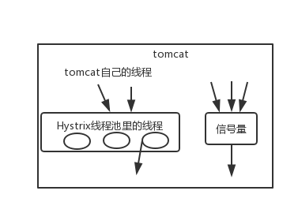

## Hystrix介绍

### Hystrix 是什么

在分布式系统中，每个服务都可能会调用很多其他服务，被调用的那些服务就是依赖服务，有的时候某些依赖服务出现故障也是很正常的。

Hystrix 可以让我们在分布式系统中对服务间的调用进行控制，加入一些调用延迟或者依赖故障的容错机制。

Hystrix 通过将依赖服务进行资源隔离，进而阻止某个依赖服务出现故障时在整个系统所有的依赖服务调用中进行蔓延；同时 Hystrix 还提供故障时的 fallback 降级机制。

总而言之，Hystrix 通过这些方法帮助我们提升分布式系统的可用性和稳定性。

### Hystrix 的设计原则

- 对依赖服务调用时出现的调用延迟和调用失败进行控制和容错保护。
- 在复杂的分布式系统中，阻止某一个依赖服务的故障在整个系统中蔓延。比如某一个服务故障了，导致其它服务也跟着故障。
- 提供 fail-fast（快速失败）和快速恢复的支持。
- 提供 fallback 优雅降级的支持。
- 支持近实时的监控、报警以及运维操作。

举个栗子。

有这样一个分布式系统，服务 A 依赖于服务 B，服务 B 依赖于服务 C/D/E。在这样一个成熟的系统内，比如说最多可能只有 100 个线程资源。正常情况下，40 个线程并发调用服务 C，各 30 个线程并发调用 D/E。

调用服务 C，只需要 20ms，现在因为服务 C 故障了，比如延迟，或者挂了，此时线程会 hang 住 2s 左右。40 个线程全部被卡住，由于请求不断涌入，其它的线程也用来调用服务 C，同样也会被卡住。这样导致服务 B 的线程资源被耗尽，无法接收新的请求，甚至可能因为大量线程不断的运转，导致自己宕机。这种影响势必会蔓延至服务 A，导致服务 A 也跟着挂掉。


Hystrix 可以对其进行资源隔离，比如限制服务 B 只有 40 个线程调用服务 C。当此 40 个线程被 hang 住时，其它 60 个线程依然能正常调用工作。从而确保整个系统不会被拖垮。

### Hystrix 更加细节的设计原则

- 阻止任何一个依赖服务耗尽所有的资源，比如 tomcat 中的所有线程资源。
- 避免请求排队和积压，采用限流和 fail fast 来控制故障。
- 提供 fallback 降级机制来应对故障。
- 使用资源隔离技术，比如 bulkhead（舱壁隔离技术）、swimlane（泳道技术）、circuit breaker（断路技术）来限制任何一个依赖服务的故障的影响。
- 通过近实时的统计/监控/报警功能，来提高故障发现的速度。
- 通过近实时的属性和配置热修改功能，来提高故障处理和恢复的速度。
- 保护依赖服务调用的所有故障情况，而不仅仅只是网络故障情况。

## 基于 Hystrix 线程池技术实现资源隔离

资源隔离，就是说，你如果要把对某一个依赖服务的所有调用请求，全部隔离在同一份资源池内，不会去用其它资源了，这就叫资源隔离。哪怕对这个依赖服务，比如说商品服务，现在同时发起的调用量已经到了 1000，但是分配给商品服务线程池内就 10 个线程，最多就只会用这 10 个线程去执行。不会因为对商品服务调用的延迟，将 Tomcat 内部所有的线程资源全部耗尽。

Hystrix 进行资源隔离，其实是提供了一个抽象，叫做 Command。这也是 Hystrix 最最基本的资源隔离技术。

## 基于 Hystrix 信号量机制实现资源隔离

Hystrix 里面核心的一项功能，其实就是所谓的资源隔离，要解决的最最核心的问题，就是将多个依赖服务的调用分别隔离到各自的资源池内。避免说对某一个依赖服务的调用，因为依赖服务的接口调用的延迟或者失败，导致服务所有的线程资源全部耗费在这个服务的接口调用上。一旦说某个服务的线程资源全部耗尽的话，就可能导致服务崩溃，甚至说这种故障会不断蔓延。

Hystrix 实现资源隔离，主要有两种技术：

- 线程池
- 信号量

默认情况下，Hystrix 使用线程池模式。

### 信号量机制

信号量的资源隔离只是起到一个开关的作用，比如，服务 A 的信号量大小为 10，那么就是说它同时只允许有 10 个 tomcat 线程来访问服务 A，其它的请求都会被拒绝，从而达到资源隔离和限流保护的作用。


### 线程池与信号量区别

线程池隔离技术，并不是说去控制类似 tomcat 这种 web 容器的线程。更加严格的意义上来说，Hystrix 的线程池隔离技术，控制的是 tomcat 线程的执行。Hystrix 线程池满后，会确保说，tomcat 的线程不会因为依赖服务的接口调用延迟或故障而被 hang 住，tomcat 其它的线程不会卡死，可以快速返回，然后支撑其它的事情。

线程池隔离技术，是用 Hystrix 自己的线程去执行调用；而信号量隔离技术，是直接让 tomcat 线程去调用依赖服务。信号量隔离，只是一道关卡，信号量有多少，就允许多少个 tomcat 线程通过它，然后去执行。



适用场景：

- 线程池技术，适合绝大多数场景，比如说我们对依赖服务的网络请求的调用和访问、需要对调用的 timeout 进行控制（捕捉 timeout 超时异常）。
- 信号量技术，适合说你的访问不是对外部依赖的访问，而是对内部的一些比较复杂的业务逻辑的访问，并且系统内部的代码，其实不涉及任何的网络请求，那么只要做信号量的普通限流就可以了，因为不需要去捕获 timeout 类似的问题。

## Hystrix 隔离策略细粒度控制

线程池机制，每个 command 运行在一个线程中，限流是通过线程池的大小来控制的；信号量机制，command 是运行在调用线程中（也就是 Tomcat 的线程池），通过信号量的容量来进行限流。

如何在线程池和信号量之间做选择？

**默认的策略就是线程池。**

线程池其实最大的好处就是对于网络访问请求，如果有超时的话，可以避免调用线程阻塞住。

而使用信号量的场景，通常是针对超大并发量的场景下，每个服务实例每秒都几百的 QPS，那么此时你用线程池的话，线程一般不会太多，可能撑不住那么高的并发，如果要撑住，可能要耗费大量的线程资源，那么就是用信号量，来进行限流保护。一般用信号量常见于那种基于纯内存的一些业务逻辑服务，而不涉及到任何网络访问请求。

### command key & command group

我们使用线程池隔离，要怎么对依赖服务、依赖服务接口、线程池三者做划分呢？

每一个 command，都可以设置一个自己的名称 command key，同时可以设置一个自己的组 command group。

```
private static final Setter cachedSetter = Setter.withGroupKey(HystrixCommandGroupKey.Factory.asKey("ExampleGroup"))
                                                 .andCommandKey(HystrixCommandKey.Factory.asKey("HelloWorld"));

public CommandHelloWorld(String name) {
    super(cachedSetter);
    this.name = name;
}
```

command group 是一个非常重要的概念，默认情况下，就是通过 command group 来定义一个线程池的，而且还会通过 command group 来聚合一些监控和报警信息。同一个 command group 中的请求，都会进入同一个线程池中。

### command thread pool


