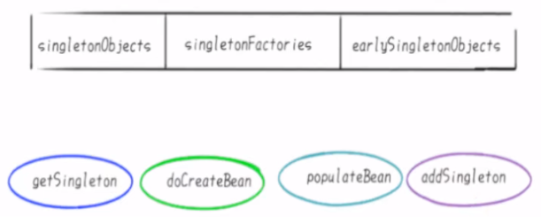
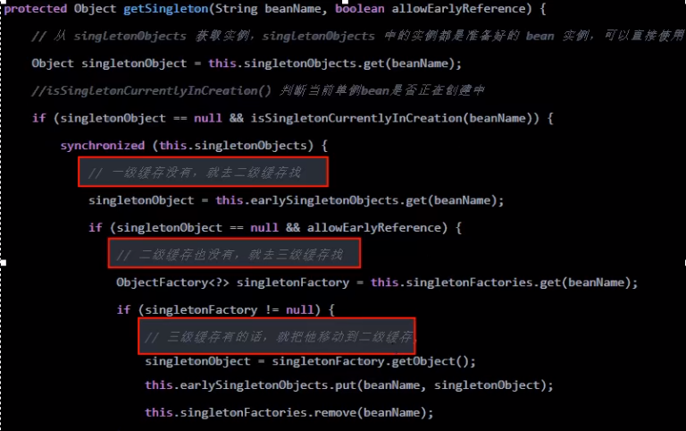

## spring循环依赖前置知识

3个Map和四大方法，总体相关对象



- 第一层singletonObjects存放的是已经初始化好了的Bean
- 第二层earlySingletonObjects存放的是实例化了，但是未初始化的Bean
- 第三层singletonFactories存放的是FactoryBean。假如A类实现了FactoryBean,那么依赖注入的时候不是A类，而是A类产生的Bean

```
package org.springframework.beans.factory.support;

...

public class DefaultSingletonBeanRegistry extends SimpleAliasRegistry implements SingletonBeanRegistry {

	...

	/** 
	单例对象的缓存:bean名称—bean实例，即:所谓的单例池。
	表示已经经历了完整生命周期的Bean对象
	第一级缓存
	*/
	private final Map<String, Object> singletonObjects = new ConcurrentHashMap<>(256);

	/**
	早期的单例对象的高速缓存: bean名称—bean实例。
	表示 Bean的生命周期还没走完（Bean的属性还未填充）就把这个 Bean存入该缓存中也就是实例化但未初始化的 bean放入该缓存里
	第二级缓存
	*/
	private final Map<String, ObjectFactory<?>> singletonFactories = new HashMap<>(16);

	/**
	单例工厂的高速缓存:bean名称—ObjectFactory
	表示存放生成 bean的工厂
	第三级缓存
	*/
	private final Map<String, Object> earlySingletonObjects = new HashMap<>(16);
 
    ...
    
}
```

A / B两对象在三级缓存中的迁移说明

1. A创建过程中需要B，于是A将自己放到三级缓里面，去实例化B。
2. B实例化的时候发现需要A，于是B先查一级缓存，没有，再查二级缓存，还是没有，再查三级缓存，找到了A然后把三级缓存里面的这个A放到二级缓存里面，并删除三级缓存里面的A。
3. B顺利初始化完毕，将自己放到一级缓存里面（此时B里面的A依然是创建中状态)，然后回来接着创建A，此时B已经创建结束，直接从一级缓存里面拿到B，然后完成创建，并将A自己放到一级缓存里面。


## Spring解决循环依赖过程：

1. 调用doGetBean()方法，想要获取beanA，于是调用getSingleton()方法从缓存中查找beanA
2. 在getSingleton()方法中，从一级缓存中查找，没有，返回null
3. doGetBean()方法中获取到的beanA为null，于是走对应的处理逻辑，调用getSingleton()的重载方法（参数为ObjectFactory的)
4. 在getSingleton()方法中，先将beanA_name添加到一个集合中，用于标记该bean正在创建中。然后回调匿名内部类的creatBean方法
5. 进入AbstractAutowireCapableBeanFactory#ndoCreateBean，先反射调用构造器创建出beanA的实例，然后判断:是否为单例、是否允许提前暴露引用(对于单例一般为true)、是否正在创建中（即是否在第四步的集合中）。判断为true则将beanA添加到【三级缓存】中
6. 对beanA进行属性填充，此时检测到beanA依赖于beanB，于是开始查找beanB
7. 调用doGetBean()方法，和上面beanA的过程一样，到缓存中查找beanB，没有则创建，然后给beanB填充属性
8. 此时 beanB依赖于beanA，调用getSingleton()获取beanA，依次从一级、二级、三级缓存中找，此时从三级缓存中获取到beanA的创建工厂，通过创建工厂获取到singletonObject，此时这个singletonObject指向的就是上面在doCreateBean()方法中实例化的beanA
9. 这样beanB就获取到了beanA的依赖，于是beanB顺利完成实例化，并将beanA从三级缓存移动到二级缓存中
10. 随后beanA继续他的属性填充工作，此时也获取到了beanB，beanA也随之完成了创建，回到getsingleton()方法中继续向下执行，将beanA从二级缓存移动到一级缓存中

## spring循环依赖结论

Spring创建 bean主要分为两个步骤，创建原始bean对象，接着去填充对象属性和初始化

每次创建 bean之前，我们都会从缓存中查下有没有该bean，因为是单例，只能有一个

当我们创建 beanA的原始对象后，并把它放到三级缓存中，接下来就该填充对象属性了，这时候发现依赖了beanB，接着就又去创建beanB，同样的流程，创建完beanB填充属性时又发现它依赖了beanA又是同样的流程.

不同的是：这时候可以在三级缓存中查到刚放进去的原始对象beanA.所以不需要继续创建，用它注入 beanB，完成 beanB的创建

既然 beanB创建好了，所以 beanA就可以完成填充属性的步骤了，接着执行剩下的逻辑，闭环完成



Spring为了解决单例的循坏依赖问题，使用了三级缓存：

- 其中一级缓存为单例池(singletonObjects)。
- 二级缓存为提前曝光对象(earlySingletonObjects)。
- 三级缓存为提前曝光对象工厂(singletonFactories) 。