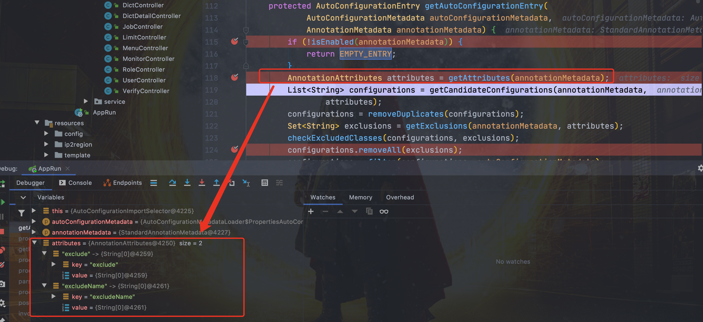

## 自动装配是什么

SpringBoot 定义了一套接口规范，这套规范规定：SpringBoot 在启动时会扫描外部引用 jar 包中的META-INF/spring.factories文件，将文件中配置的类型信息加载到 Spring 容器，并执行类中定义的各种操作。对于外部 jar 来说，只需要按照 SpringBoot 定义的标准，就能将自己的功能装置进 SpringBoot。

没有 Spring Boot 的情况下，如果我们需要引入第三方依赖，需要手动配置，非常麻烦。但是，Spring Boot 中，我们直接引入一个 starter 即可。比如你想要在项目中使用 redis 的话，直接在项目中引入对应的 starter 即可。

```
<dependency>
    <groupId>org.springframework.boot</groupId>
    <artifactId>spring-boot-starter-data-redis</artifactId>
</dependency>
```

引入 starter 之后，我们通过少量注解和一些简单的配置就能使用第三方组件提供的功能了。

在我看来，自动装配可以简单理解为：**通过注解或者一些简单的配置就能在 Spring Boot 的帮助下实现某块功能**。

## 自动装配如何实现

先看一下 SpringBoot 的核心注解 SpringBootApplication

```
@Target({ElementType.TYPE})
@Retention(RetentionPolicy.RUNTIME)
@Documented
@Inherited
<1.>@SpringBootConfiguration
<2.>@ComponentScan
<3.>@EnableAutoConfiguration
public @interface SpringBootApplication {

}

@Target({ElementType.TYPE})
@Retention(RetentionPolicy.RUNTIME)
@Documented
@Configuration //实际上它也是一个配置类
public @interface SpringBootConfiguration {
}
```

大概可以把 @SpringBootApplication看作是 @Configuration、@EnableAutoConfiguration、@ComponentScan 注解的集合。根据 SpringBoot 官网，这三个注解的作用分别是：

- @EnableAutoConfiguration：启用 SpringBoot 的自动配置机制
- @Configuration：允许在上下文中注册额外的 bean 或导入其他配置类
- @ComponentScan： 扫描被@Component (@Service,@Controller)注解的 bean，注解默认会扫描启动类所在的包下所有的类 ，可以自定义不扫描某些 bean。如下图所示，容器中将排除TypeExcludeFilter和AutoConfigurationExcludeFilter。

### @EnableAutoConfiguration核心注解

@EnableAutoConfiguration:实现自动装配的核心注解

EnableAutoConfiguration 只是一个简单地注解，自动装配核心功能的实现实际是通过 AutoConfigurationImportSelector类。

```
@Target({ElementType.TYPE})
@Retention(RetentionPolicy.RUNTIME)
@Documented
@Inherited
@AutoConfigurationPackage //作用：将main包下的所欲组件注册到容器中
@Import({AutoConfigurationImportSelector.class}) //加载自动装配类 xxxAutoconfiguration
public @interface EnableAutoConfiguration {
    String ENABLED_OVERRIDE_PROPERTY = "spring.boot.enableautoconfiguration";

    Class<?>[] exclude() default {};

    String[] excludeName() default {};
}
```

#### AutoConfigurationImportSelector:加载自动装配类

AutoConfigurationImportSelector类的继承体系如下：

```
public class AutoConfigurationImportSelector implements DeferredImportSelector, BeanClassLoaderAware, ResourceLoaderAware, BeanFactoryAware, EnvironmentAware, Ordered {

}

public interface DeferredImportSelector extends ImportSelector {

}

public interface ImportSelector {
    String[] selectImports(AnnotationMetadata var1);
}
```

可以看出，AutoConfigurationImportSelector 类实现了 ImportSelector接口，也就实现了这个接口中的 selectImports方法，该方法主要用于获取所有符合条件的类的全限定类名，这些类需要被加载到 IoC 容器中。

```
private static final String[] NO_IMPORTS = new String[0];

public String[] selectImports(AnnotationMetadata annotationMetadata) {
        // <1>.判断自动装配开关是否打开
        if (!this.isEnabled(annotationMetadata)) {
            return NO_IMPORTS;
        } else {
          //<2>.获取所有需要装配的bean
            AutoConfigurationMetadata autoConfigurationMetadata = AutoConfigurationMetadataLoader.loadMetadata(this.beanClassLoader);
            AutoConfigurationImportSelector.AutoConfigurationEntry autoConfigurationEntry = this.getAutoConfigurationEntry(autoConfigurationMetadata, annotationMetadata);
            return StringUtils.toStringArray(autoConfigurationEntry.getConfigurations());
        }
    }
```

这里我们需要重点关注一下getAutoConfigurationEntry()方法，这个方法主要负责加载自动配置类的。

该方法调用链如下：


现在我们结合getAutoConfigurationEntry()的源码来详细分析一下：

```
private static final AutoConfigurationEntry EMPTY_ENTRY = new AutoConfigurationEntry();

AutoConfigurationEntry getAutoConfigurationEntry(AutoConfigurationMetadata autoConfigurationMetadata, AnnotationMetadata annotationMetadata) {
        //<1>.
        if (!this.isEnabled(annotationMetadata)) {
            return EMPTY_ENTRY;
        } else {
            //<2>.
            AnnotationAttributes attributes = this.getAttributes(annotationMetadata);
            //<3>.
            List<String> configurations = this.getCandidateConfigurations(annotationMetadata, attributes);
            //<4>.
            configurations = this.removeDuplicates(configurations);
            Set<String> exclusions = this.getExclusions(annotationMetadata, attributes);
            this.checkExcludedClasses(configurations, exclusions);
            configurations.removeAll(exclusions);
            configurations = this.filter(configurations, autoConfigurationMetadata);
            this.fireAutoConfigurationImportEvents(configurations, exclusions);
            return new AutoConfigurationImportSelector.AutoConfigurationEntry(configurations, exclusions);
        }
    }
```

1. 判断自动装配开关是否打开。默认spring.boot.enableautoconfiguration=true，可在 application.properties 或 application.yml 中设置


2. 用于获取EnableAutoConfiguration注解中的 exclude 和 excludeName。



3. 获取需要自动装配的所有配置类，读取META-INF/spring.factories


从下图可以看到这个文件的配置内容都被我们读取到了。XXXAutoConfiguration的作用就是按需加载组件。


不光是这个依赖下的META-INF/spring.factories被读取到，所有 Spring Boot Starter 下的META-INF/spring.factories都会被读取到。

4. spring.factories中这么多配置，每次启动都要全部加载么？”。

很明显，这是不现实的。我们 debug 到后面你会发现，configurations 的值变小了。


因为，这一步有经历了一遍筛选，@ConditionalOnXXX 中的所有条件都满足，该类才会生效。

```
@Configuration
// 检查相关的类：RabbitTemplate 和 Channel是否存在
// 存在才会加载
@ConditionalOnClass({ RabbitTemplate.class, Channel.class })
@EnableConfigurationProperties(RabbitProperties.class)
@Import(RabbitAnnotationDrivenConfiguration.class)
public class RabbitAutoConfiguration {
}
```

- @ConditionalOnBean：当容器里有指定 Bean 的条件下
- @ConditionalOnMissingBean：当容器里没有指定 Bean 的情况下
- @ConditionalOnSingleCandidate：当指定 Bean 在容器中只有一个，或者虽然有多个但是指定首选 Bean
- @ConditionalOnClass：当类路径下有指定类的条件下
- @ConditionalOnMissingClass：当类路径下没有指定类的条件下
- @ConditionalOnProperty：指定的属性是否有指定的值
- @ConditionalOnResource：类路径是否有指定的值
- @ConditionalOnExpression：基于 SpEL 表达式作为判断条件
- @ConditionalOnJava：基于 Java 版本作为判断条件
- @ConditionalOnJndi：在 JNDI 存在的条件下差在指定的位置
- @ConditionalOnNotWebApplication：当前项目不是 Web 项目的条件下
- @ConditionalOnWebApplication：当前项目是 Web 项 目的条件下

## 如何实现一个 Starter

### 新创建一个maven项目

这里创建一个threadpool-spring-boot-starter


### 引入 Spring Boot 相关依赖

```
<groupId>org.example</groupId>
    <artifactId>threadpool-spring-boot-starter</artifactId>
    <version>1.0-SNAPSHOT</version>

    <packaging>jar</packaging>

    <parent>
        <groupId>org.springframework.boot</groupId>
        <artifactId>spring-boot-starter-parent</artifactId>
        <version>2.2.6.RELEASE</version>
    </parent>

    <dependencies>
        <dependency>
            <groupId>org.springframework.boot</groupId>
            <artifactId>spring-boot-starter</artifactId>
            <version>2.2.6.RELEASE</version>
        </dependency>
    </dependencies>
```

### 创建ThreadPoolAutoConfiguration

```
@Configuration
public class ThreadPoolAutoConfiguration {
    // 第一种方式
    @Bean
    @ConditionalOnMissingBean
    public MyThreadPool myThreadPool1() {
        return new MyThreadPool();
    }

    // 第二种方式
    @Bean
    @ConditionalOnClass(ThreadPoolExecutor.class)
    public ThreadPoolExecutor myThreadPool() {
        // rejection-policy：当pool已经达到max size的时候，如何处理新任务
        // CALLER_RUNS：不在新线程中执行任务，而是有调用者所在的线程来执行
        // 一下参数可配置从配置文件获取，引用方配置参数即可@value(&{xxx.xxxx.corePoolSize})
        return new ThreadPoolExecutor(10,
                10,
                10,
                TimeUnit.SECONDS,
                new LinkedBlockingQueue<Runnable>(100),
                new ThreadPoolExecutor.CallerRunsPolicy());
    }
}
```

```
public class MyThreadPool {

    // 第一种方式
    public ThreadPoolExecutor get() {
        // rejection-policy：当pool已经达到max size的时候，如何处理新任务
        // CALLER_RUNS：不在新线程中执行任务，而是有调用者所在的线程来执行
        return new ThreadPoolExecutor(10,
                10,
                10,
                TimeUnit.SECONDS,
                new LinkedBlockingQueue<Runnable>(100),
                new ThreadPoolExecutor.CallerRunsPolicy());
    }
}
```

### 配置spring.factories

在threadpool-spring-boot-starter工程的 resources 包下创建META-INF/spring.factories文件

```
org.springframework.boot.autoconfigure.EnableAutoConfiguration=threadPool.starter.ThreadPoolAutoConfiguration
```

### install threadpool-spring-boot-starter工程

### 引用

其他工程引入pom.xml

```
<dependency>
    <groupId>org.example</groupId>
    <artifactId>threadpool-spring-boot-starter</artifactId>
    <version>1.0-SNAPSHOT</version>
</dependency>
```

```
    @Resource
    private MyThreadPool myThreadPool;
    @Resource
    private ThreadPoolExecutor threadPoolExecutor;

    @Test
    public void test111() {
        System.out.println(myThreadPool.get().getCorePoolSize());
        System.out.println(threadPoolExecutor.getCorePoolSize());
    }
```

## 总结

Spring Boot启动类里面有个@SpringBootApplication注解，这个注解是@Configuration、@EnableAutoConfiguration、@ComponentScan 注解的集合。

@EnableAutoConfiguration注解里面@Import({AutoConfigurationImportSelector.class}) //加载自动装配类 xxxAutoconfiguration。AutoConfigurationImportSelector 类实现了 ImportSelector接口，也就实现了这个接口中的 selectImports方法，该方法主要用于获取所有符合条件的类的全限定类名，这些类需要被加载到 IoC 容器中。

不光是这个依赖下的META-INF/spring.factories被读取到，所有 Spring Boot Starter 下的META-INF/spring.factories都会被读取到。但需要过滤，@ConditionalOnXXX。

Spring Boot 通过@EnableAutoConfiguration开启自动装配，通过 SpringFactoriesLoader 最终加载META-INF/spring.factories中的自动配置类实现自动装配，自动配置类其实就是通过@Conditional按需加载的配置类，想要其生效必须引入spring-boot-starter-xxx包实现起步依赖