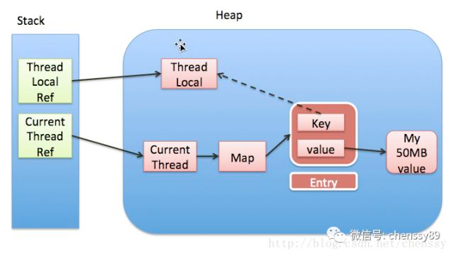
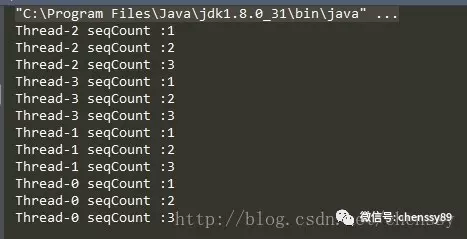
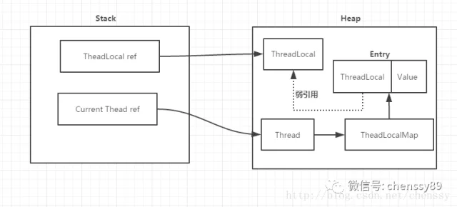

## ThreadLoacal是什么？
ThreadLocal虽然提供了一种解决多线程环境下成员变量的问题，但是它并不是解决多线程共享变量的问题。

该类提供了线程局部 (thread-local) 变量。这些变量不同于它们的普通对应物，因为访问某个变量（通过其 get 或 set 方法）的每个线程都有自己的局部变量，它独立于变量的初始化副本。 ThreadLocal实例通常是类中的 private static 字段，它们希望将状态与某一个线程（例如，用户 ID 或事务 ID）相关联。

**所以ThreadLocal与线程同步机制不同，线程同步机制是多个线程共享同一个变量，而ThreadLocal是为每一个线程创建一个单独的变量副本，故而每个线程都可以独立地改变自己所拥有的变量副本，而不会影响其他线程所对应的副本。**

ThreadLocal定义了四个方法：
- get()：返回此线程局部变量的当前线程副本中的值。
- initialValue()：返回此线程局部变量的当前线程的“初始值”。
- remove()：移除此线程局部变量当前线程的值。
- set(T value)：将此线程局部变量的当前线程副本中的值设置为指定值。


除了这四个方法，**ThreadLocal内部还有一个静态内部类ThreadLocalMap，该内部类才是实现线程隔离机制的关键**，get()、set()、remove()都是基于该内部类操作。ThreadLocalMap提供了一种用键值对方式存储每一个线程的变量副本的方法，key为当前ThreadLocal对象，value则是对应线程的变量副本。

对于ThreadLocal需要注意的有两点：

1. ThreadLocal实例本身是不存储值，它只是提供了一个在当前线程中找到副本值得key。
2. 是ThreadLocal包含在Thread中，而不是Thread包含在ThreadLocal中。



## ThreadLocal使用示例
```
public class SeqCount {

    private static ThreadLocal<Integer> seqCount = new ThreadLocal<Integer>(){

        // 实现initialValue()

        public Integer initialValue() {

            return 0;

        }

    };

    public int nextSeq(){

        seqCount.set(seqCount.get() + 1);

        return seqCount.get();

    }

    public static void main(String[] args){

        SeqCount seqCount = new SeqCount();

        SeqThread thread1 = new SeqThread(seqCount);

        SeqThread thread2 = new SeqThread(seqCount);

        SeqThread thread3 = new SeqThread(seqCount);

        SeqThread thread4 = new SeqThread(seqCount);

        thread1.start();

        thread2.start();

        thread3.start();

        thread4.start();

    }

    private static class SeqThread extends Thread{

        private SeqCount seqCount;

        SeqThread(SeqCount seqCount){

            this.seqCount = seqCount;

        }

        public void run() {

            for(int i = 0 ; i < 3 ; i++){

                System.out.println(Thread.currentThread().getName() + " seqCount :" + seqCount.nextSeq());

            }

        }

    }

}
```
运行结果：



从运行结果可以看出，ThreadLocal确实是可以达到线程隔离机制，确保变量的安全性。

## ThreadLocalMap
**ThreadLocalMap其内部利用Entry来实现key-value的存储**，如下：

```
static class Entry extends WeakReference<ThreadLocal<?>> {

    /** The value associated with this ThreadLocal. */

    Object value;

    Entry(ThreadLocal<?> k, Object v) {

        super(k);

        value = v;

    }
}
```

**从上面代码中可以看出Entry的key就是ThreadLocal，而value就是值。**同时，Entry也继承WeakReference，所以说**Entry所对应key（ThreadLocal实例）的引用为一个弱引用**

ThreadLocalMap最核心的方法getEntry()、set(ThreadLocal key, Object value)方法。

### get()

返回当前线程所对应的线程变量

```
public T get() {
    // 获取当前线程
    Thread t = Thread.currentThread();
    // 获取当前线程的成员变量 threadLocal
    ThreadLocalMap map = getMap(t);
    if (map != null) {
        // 从当前线程的ThreadLocalMap获取相对应的Entry
        ThreadLocalMap.Entry e = map.getEntry(this);
        if (e != null) {
            @SuppressWarnings("unchecked")
            // 获取目标值        
            T result = (T)e.value;
            return result;
        }
    }
    return setInitialValue();
}
```
首先通过当前线程获取所对应的成员变量ThreadLocalMap，然后通过ThreadLocalMap获取当前ThreadLocal的Entry，最后通过所获取的Entry获取目标值result。

getMap()方法可以获取当前线程所对应的ThreadLocalMap，如下：


```
ThreadLocalMap getMap(Thread t) {
    return t.threadLocals;
}
```
### set(T value)
设置当前线程的线程局部变量的值。


```
public void set(T value) {
    Thread t = Thread.currentThread();
    ThreadLocalMap map = getMap(t);
    if (map != null)
        map.set(this, value);
    else
        createMap(t, value);
}
```
获取当前线程所对应的ThreadLocalMap，如果不为空，则调用ThreadLocalMap的set()方法，key就是当前ThreadLocal，如果不存在，则调用createMap()方法新建一个，如下：

```
void createMap(Thread t, T firstValue) {
    t.threadLocals = new ThreadLocalMap(this, firstValue);
}
```

set(ThreadLocal key, Object value)

```
private void set(ThreadLocal<?> key, Object value) {

    ThreadLocal.ThreadLocalMap.Entry[] tab = table;

    int len = tab.length;

    // 根据 ThreadLocal 的散列值，查找对应元素在数组中的位置

    int i = key.threadLocalHashCode & (len-1);

    // 采用“线性探测法”，寻找合适位置

    for (ThreadLocal.ThreadLocalMap.Entry e = tab[i];

        e != null;

        e = tab[i = nextIndex(i, len)]) {

        ThreadLocal<?> k = e.get();

        // key 存在，直接覆盖

        if (k == key) {

            e.value = value;

            return;

        }

        // key == null，但是存在值（因为此处的e != null），说明之前的ThreadLocal对象已经被回收了

        if (k == null) {

            // 用新元素替换陈旧的元素

            replaceStaleEntry(key, value, i);

            return;

        }

    }

    // ThreadLocal对应的key实例不存在也没有陈旧元素，new 一个

    tab[i] = new ThreadLocal.ThreadLocalMap.Entry(key, value);

    int sz = ++size;

    // cleanSomeSlots 清楚陈旧的Entry（key == null）

    // 如果没有清理陈旧的 Entry 并且数组中的元素大于了阈值，则进行 rehash

    if (!cleanSomeSlots(i, sz) && sz >= threshold)

        rehash();

}
```
这个set()操作和我们在集合了解的put()方式有点儿不一样，虽然他们都是key-value结构，不同在于他们解决散列冲突的方式不同。集合Map的put()采用的是拉链法，而ThreadLocalMap的set()则是采用开放定址法。

set()操作除了存储元素外，还有一个很重要的作用，就是replaceStaleEntry()和cleanSomeSlots()，这两个方法可以清除掉key == null 的实例，防止内存泄漏。
### initialValue()
返回该线程局部变量的初始值。

```
protected T initialValue() {
    return null;
}
```

该方法定义为protected级别且返回为null，很明显是要子类实现它的，所以我们在使用ThreadLocal的时候一般都应该覆盖该方法。该方法不能显示调用，只有在第一次调用get()或者set()方法时才会被执行，并且仅执行1次。
### remove()
将当前线程局部变量的值删除。

```
public void remove() {
    ThreadLocalMap m = getMap(Thread.currentThread());
    if (m != null)
        m.remove(this);
}
```
该方法的目的是减少内存的占用。当然，我们不需要显示调用该方法，因为一个线程结束后，它所对应的局部变量就会被垃圾回收。
## ThreadLocal为什么会内存泄漏
前面提到每个Thread都有一个ThreadLocal.ThreadLocalMap的map，该map的key为ThreadLocal实例，它为一个弱引用，我们知道弱引用有利于GC回收。当ThreadLocal的key == null时，GC就会回收这部分空间，但是value却不一定能够被回收，因为他还与Current Thread存在一个强引用关系。


由于存在这个强引用关系，会导致value无法回收。如果这个线程对象不会销毁那么这个强引用关系则会一直存在，就会出现内存泄漏情况。所以说只要这个线程对象能够及时被GC回收，就不会出现内存泄漏。如果碰到线程池，那就更坑了。

那么要怎么避免这个问题呢？

在前面提过，在ThreadLocalMap中的setEntry()、getEntry()，如果遇到key == null的情况，会对value设置为null。当然我们也可以显示调用ThreadLocal的remove()方法进行处理。
## 划重点，总结辣：

- ThreadLocal与线程同步机制不同，线程同步机制是多个线程共享同一个变量，而ThreadLocal是为每一个线程创建一个单独的变量副本，故而每个线程都可以独立地改变自己所拥有的变量副本，而不会影响其他线程所对应的副本。（ThreadLocal在多线程下，每个线程对共享变量都会创建一份变量副本去操作，不会影响其他线程的变量副本）
- ThreadLocal内部还有一个静态内部类ThreadLocalMap，该内部类才是实现线程隔离机制的关键。ThreadLocalMap提供了一种用键值对方式存储每一个线程的变量副本的方法，key为当前ThreadLocal对象，value则是对应线程的变量副本。
- ThreadLocal为什么会内存泄漏？每个Thread都有一个ThreadLocal.ThreadLocalMap的map，该map的key为ThreadLocal实例，它为一个弱引用，我们知道弱引用有利于GC回收。当ThreadLocal的key == null时，GC就会回收这部分空间，但是value却不一定能够被回收，因为他还与Current Thread存在一个强引用关系。由于存在这个强引用关系，会导致value无法回收。如果这个线程对象不会销毁那么这个强引用关系则会一直存在，就会出现内存泄漏情况。那么要怎么避免这个问题呢？在ThreadLocalMap中的setEntry()、getEntry()，如果遇到key == null的情况，会对value设置为null。当然我们也可以显示调用ThreadLocal的remove()方法进行处理。
