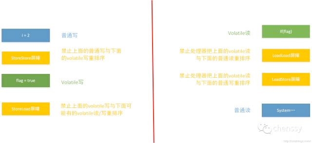

## volatile的特性
1. volatile可见性；对一个volatile的读，总可以看到对这个变量最终的写；
2. volatile原子性；volatile对单个读/写具有原子性（32位Long、Double），但是复合操作除外，例如i++;
3. JVM底层采用“内存屏障”来实现volatile语义。

## volatile的内存语义及其实现

在JMM中，线程之间的通信采用共享内存来实现的。

volatile的内存语义是：当写一个volatile变量时，JMM会把该线程对应的本地内存中的共享变量值立即刷新到主内存中。
当读一个volatile变量时，JMM会把该线程对应的本地内存设置为无效，直接从主内存中读取共享变量。

**所以volatile的写内存语义是直接刷新到主内存中，读的内存语义是直接从主内存中读取。**

实现volatile的内存语义JMM会限制重排序，其重排序规则如下：
- 如果第一个操作为volatile读，则不管第二个操作是啥，都不能重排序。这个操作确保volatile读之后的操作不会被编译器重排序到volatile读之前；
- 当第二个操作为volatile写是，则不管第一个操作是啥，都不能重排序。这个操作确保volatile写之前的操作不会被编译器重排序到volatile写之后；
- 当第一个操作volatile写，第二操作为volatile读时，不能重排序。

volatile的底层实现是通过插入内存屏障，但是对于编译器来说，发现一个最优布置来最小化插入内存屏障的总数几乎是不可能的，所以，JMM采用了保守策略：
- 在每一个volatile写操作前面插入一个StoreStore屏障
- 在每一个volatile写操作后面插入一个StoreLoad屏障
- 在每一个volatile读操作后面插入一个LoadLoad屏障
- 在每一个volatile读操作后面插入一个LoadStore屏障
1. StoreStore屏障可以保证在volatile写之前，其前面的所有普通写操作都已经刷新到主内存中。
2. **StoreLoad**屏障的作用是避免volatile写与后面可能有的volatile读/写操作重排序。
3. LoadLoad屏障用来禁止处理器把上面的volatile读与下面的普通读重排序。
4. LoadStore屏障用来禁止处理器把上面的volatile读与下面的普通写重排序。

## 栗子1
```
public class VolatileTest {
int i = 0;
volatile boolean flag = false;
public void write(){
    i = 2;
    flag = true;
}

public void read(){
    if(flag){
        System.out.println("---i = " + i); 
    }
}}
```



## 栗子2
volatile的内存屏障插入策略非常保守，其实在实际中，只要不改变volatile写-读得内存语义，编译器可以根据具体情况优化，省略不必要的屏障。

```
public class VolatileBarrierExample {
    int a = 0;
    volatile int v1 = 1;
    volatile int v2 = 2;

    void readAndWrite(){
        int i = v1;     //volatile读
        int j = v2;     //volatile读
        a = i + j;      //普通读
        v1 = i + 1;     //volatile写
        v2 = j * 2;     //volatile写
    }
}
```
没有优化的示例图如下：


我们来分析上图有哪些内存屏障指令是多余的
1. 这个肯定要保留了
2. 禁止下面所有的普通写与上面的volatile读重排序，但是由于存在第二个volatile读，那个普通的读根本无法越过第二个volatile读。所以可以省略。
3. 下面已经不存在普通读了，可以省略。
4. 保留
5. 保留
6. 下面跟着一个volatile写，所以可以省略
7. 保留
8. 保留

所以2、3、6可以省略，其示意图如下：


## 划重点，总结辣：

- 在JMM（内存模型）中，线程之间的通信采用共享内存来实现的。
- volatile的写内存语义是直接刷新到主内存中，读的内存语义是直接从主内存中读取。
- 实现volatile的内存语义JMM会限制重排序，其重排序规则如下：
    - 如果当前为volatile读时，后面的操作不能重排序。（这个操作确保volatile读之后的操作不会被编译器重排序到volatile读之前）；
    - 如果当前为volatile写时，前面的操作不能重排序。（这个操作确保volatile写之前的操作不会被编译器重排序到volatile写之后）；
    - 如果当前为volatile写时，紧接操作为volatile读时，不能重排序。
- volatile的底层是通过插入内存屏障实现的。

    - 在每一个volatile写操作前面插入一个StoreStore屏障
    - 在每一个volatile写操作后面插入一个StoreLoad屏障
    - 在每一个volatile读操作后面插入一个LoadLoad屏障
    - 在每一个volatile读操作后面插入一个LoadStore屏障

    1. StoreStore屏障可以保证在volatile写之前，其前面的所有普通写操作都已经刷新到主内存中。
    2. StoreLoad屏障的作用是避免volatile写与后面可能有的volatile读/写操作重排序。
    3. LoadLoad屏障用来禁止处理器把上面的volatile读与下面的普通读重排序。
    4. LoadStore屏障用来禁止处理器把上面的volatile读与下面的普通写重排序。

- volatile可以保证可见性，对一个volatile的读，总可以看到对这个变量最终的写；
- volatile不可以保证原子性，volatile对单个读/写具有原子性（32位Long、Double），但是复合操作除外，例如i++;
- volatile可以保证有序性，JVM底层采用“内存屏障”来实现。
- volatile 主要解决的是一个线程修改变量值之后，其他线程立马可以读到最新的值，是解决这个问题的，也就是可见性！但是如果是多个线程同时修改一个变量的值，那还是可能出现多线程并发的安全问题，导致数据值修改错乱，volatile 是不负责解决这个问题的，也就是不负责解决原子性问题！原子性问题，得依赖 synchronized、ReentrantLock 等加锁机制来解决。
- 对一个变量加了 volatile 关键字修饰之后，只要一个线程修改了这个变量的值，立马强制刷回主内存。接着强制过期其他线程的本地工作内存中的缓存，最后其他线程读取变量值的时候，强制重新从主内存来加载最新的值！