谈到并发，我们不得不说AQS(AbstractQueuedSynchronizer)，所谓的AQS即是抽象的队列式的同步器，内部定义了很多锁相关的方法，我们熟知的ReentrantLock、ReentrantReadWriteLock、CountDownLatch、Semaphore等都是基于AQS来实现的。

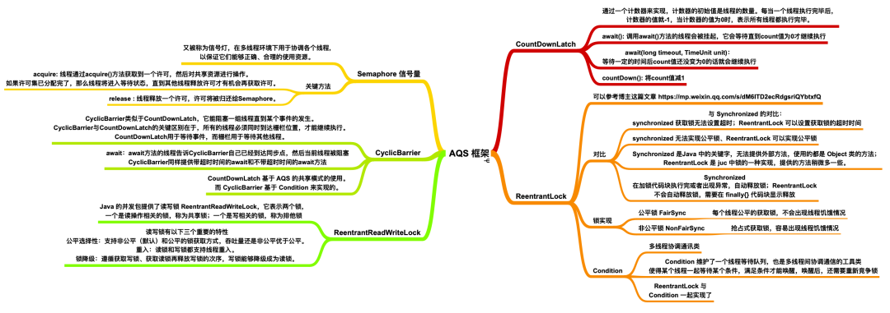

## AQS实现原理

AQS中 维护了一个volatile int state（代表共享资源）和一个FIFO线程等待队列（多线程争用资源被阻塞时会进入此队列）。

这里volatile能够保证多线程下的可见性，当state=1则代表当前对象锁已经被占有，其他线程来加锁时则会失败，加锁失败的线程会被放入一个FIFO的等待队列中，比列会被UNSAFE.park()操作挂起，等待其他获取锁的线程释放锁才能够被唤醒。

另外state的操作都是通过CAS来保证其并发修改的安全性。

具体原理我们可以用一张图来简单概括：

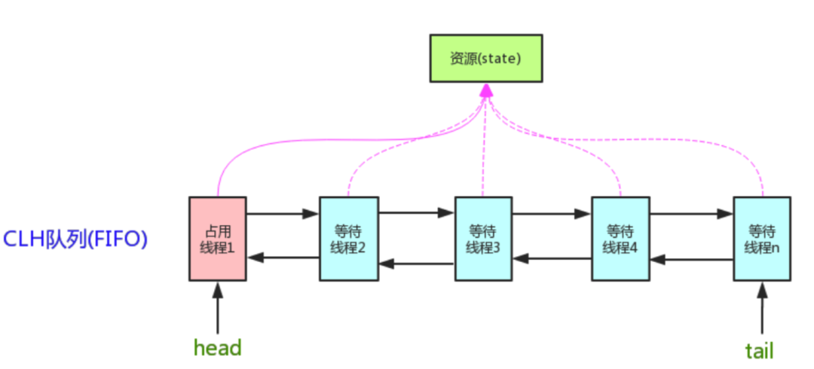

AQS 中提供了很多关于锁的实现方法，
- getState()：获取锁的标志state值
- setState()：设置锁的标志state值
- tryAcquire(int)：独占方式获取锁。尝试获取资源，成功则返回true，失败则返回false。
- tryRelease(int)：独占方式释放锁。尝试释放资源，成功则返回true，失败则返回false。

这里还有一些方法并没有列出来，接下来我们以ReentrantLock作为突破点通过源码和画图的形式一步步了解AQS内部实现原理。

## 目录结构
文章准备模拟多线程竞争锁、释放锁的场景来进行分析AQS源码：

三个线程(线程一、线程二、线程三)同时来加锁/释放锁

目录如下：
- 线程一加锁成功时AQS内部实现
- 线程二/三加锁失败时AQS中等待队列的数据模型
- 线程一释放锁及线程二获取锁实现原理
- 通过线程场景来讲解公平锁具体实现原理
- 通过线程场景来讲解Condition中await()和signal()实现原理

## 场景分析

### 线程一加锁成功

如果同时有三个线程并发抢占锁，此时线程一抢占锁成功，线程二和线程三抢占锁失败，具体执行流程如下：

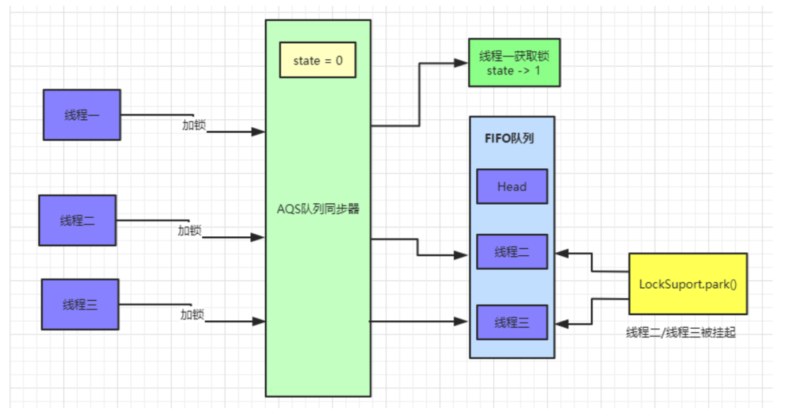

此时AQS内部数据为：

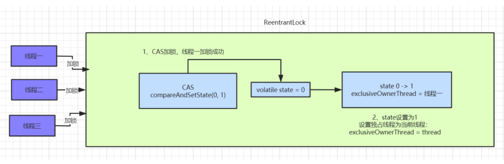

### 线程二、线程三加锁失败：

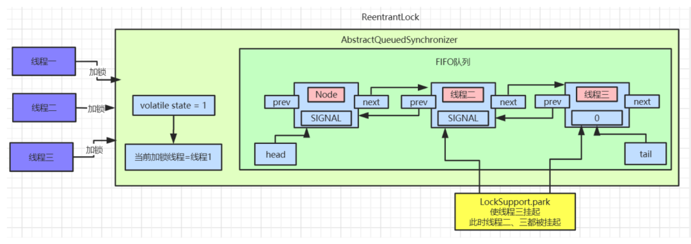

有图可以看出，等待队列中的节点Node是一个双向链表，这里SIGNAL是Node中waitStatus属性，Node中还有一个nextWaiter属性，这个并未在图中画出来，这个到后面Condition会具体讲解的。

### 具体看下抢占锁代码实现：

java.util.concurrent.locks.ReentrantLock .NonfairSync:
```
static final class NonfairSync extends Sync {
    
    final void lock() {
        if (compareAndSetState(0, 1))
            setExclusiveOwnerThread(Thread.currentThread());
        else
            acquire(1);
    }

    protected final boolean tryAcquire(int acquires) {
        return nonfairTryAcquire(acquires);
    }
}
```

这里使用的ReentrantLock非公平锁，线程进来直接利用CAS尝试抢占锁，如果抢占成功state值回被改为1，且设置对象独占锁线程为当前线程。如下所示：
```
protected final boolean compareAndSetState(int expect, int update) {
    return unsafe.compareAndSwapInt(this, stateOffset, expect, update);
}

protected final void setExclusiveOwnerThread(Thread thread) {
    exclusiveOwnerThread = thread;
}
```

### 线程二抢占锁失败

我们按照真实场景来分析，线程一抢占锁成功后，state变为1，线程二通过CAS修改state变量必然会失败。此时AQS中FIFO(First In First Out 先进先出)队列中数据如图所示：

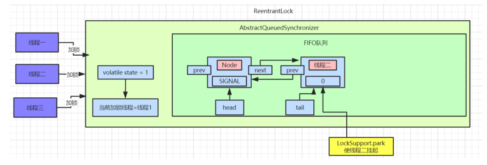

### 我们将线程二执行的逻辑一步步拆解来看：

java.util.concurrent.locks.AbstractQueuedSynchronizer.acquire():

```
public final void acquire(int arg) {
    if (!tryAcquire(arg) &&
        acquireQueued(addWaiter(Node.EXCLUSIVE), arg))
        selfInterrupt();
}
```

先看看tryAcquire()的具体实现：java.util.concurrent.locks.ReentrantLock .nonfairTryAcquire():

```
final boolean nonfairTryAcquire(int acquires) {
    final Thread current = Thread.currentThread();
    int c = getState();
    if (c == 0) {
        if (compareAndSetState(0, acquires)) {
            setExclusiveOwnerThread(current);
            return true;
        }
    }
    else if (current == getExclusiveOwnerThread()) {
        int nextc = c + acquires;
        if (nextc < 0)
            throw new Error("Maximum lock count exceeded");
        setState(nextc);
        return true;
    }
    return false;
}
```

nonfairTryAcquire()方法中首先会获取state的值，如果不为0则说明当前对象的锁已经被其他线程所占有，接着判断占有锁的线程是否为当前线程，如果是则累加state值，这就是可重入锁的具体实现，累加state值，释放锁的时候也要依次递减state值。

如果state为0，则执行CAS操作，尝试更新state值为1，如果更新成功则代表当前线程加锁成功。

以线程二为例，因为线程一已经将state修改为1，所以线程二通过CAS修改state的值不会成功。加锁失败。

线程二执行tryAcquire()后会返回false，接着执行addWaiter(Node.EXCLUSIVE)逻辑，将自己加入到一个FIFO等待队列中，代码实现如下：

java.util.concurrent.locks.AbstractQueuedSynchronizer.addWaiter():

```
private Node addWaiter(Node mode) {    
    Node node = new Node(Thread.currentThread(), mode);
    Node pred = tail;
    if (pred != null) {
        node.prev = pred;
        if (compareAndSetTail(pred, node)) {
            pred.next = node;
            return node;
        }
    }
    enq(node);
    return node;
}
```

这段代码首先会创建一个和当前线程绑定的Node节点，Node为双向链表。此时等待对内中的tail指针为空，直接调用enq(node)方法将当前线程加入等待队列尾部：

```
private Node enq(final Node node) {
    for (;;) {
        Node t = tail;
        if (t == null) {
            if (compareAndSetHead(new Node()))
                tail = head;
        } else {
            node.prev = t;
            if (compareAndSetTail(t, node)) {
                t.next = node;
                return t;
            }
        }
    }
}
```

第一遍循环时tail指针为空，进入if逻辑，使用CAS操作设置head指针，将head指向一个新创建的Node节点。此时AQS中数据：

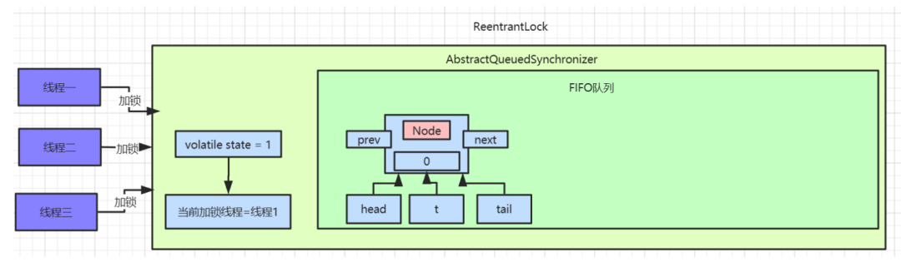

执行完成之后，head、tail、t都指向第一个Node元素。

接着执行第二遍循环，进入else逻辑，此时已经有了head节点，这里要操作的就是将线程二对应的Node节点挂到head节点后面。此时队列中就有了两个Node节点：

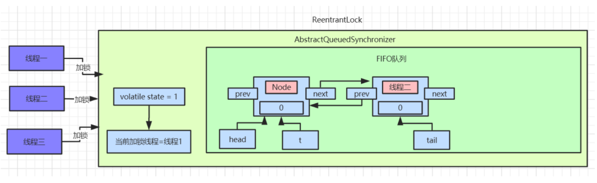

addWaiter()方法执行完后，会返回当前线程创建的节点信息。继续往后执行acquireQueued(addWaiter(Node.EXCLUSIVE), arg)逻辑，此时传入的参数为线程二对应的Node节点信息：

java.util.concurrent.locks.AbstractQueuedSynchronizer.acquireQueued():

```
final boolean acquireQueued(final Node node, int arg) {
    boolean failed = true;
    try {
        boolean interrupted = false;
        for (;;) {
            final Node p = node.predecessor();
            if (p == head && tryAcquire(arg)) {
                setHead(node);
                p.next = null; // help GC
                failed = false;
                return interrupted;
            }
            if (shouldParkAfterFailedAcquire(p, node) &&
                parkAndChecknIterrupt())
                interrupted = true;
        }
    } finally {
        if (failed)
            cancelAcquire(node);
    }
}

private static boolean shouldParkAfterFailedAcquire(Node pred, Node node) {
    int ws = pred.waitStatus;
    if (ws == Node.SIGNAL)
        return true;
    if (ws > 0) {
        do {
            node.prev = pred = pred.prev;
        } while (pred.waitStatus > 0);
        pred.next = node;
    } else {
        compareAndSetWaitStatus(pred, ws, Node.SIGNAL);
    }
    return false;
}

private final boolean parkAndCheckInterrupt() {
    LockSupport.park(this);
    return Thread.interrupted();
}
```

acquireQueued()这个方法会先判断当前传入的Node对应的前置节点是否为head，如果是则尝试加锁。加锁成功过则将当前节点设置为head节点，然后空置之前的head节点，方便后续被垃圾回收掉。

如果加锁失败或者Node的前置节点不是head节点，就会通过shouldParkAfterFailedAcquire方法 将head节点的waitStatus变为了SIGNAL=-1，最后执行parkAndChecknIterrupt方法，调用LockSupport.park()挂起当前线程。

此时AQS中的数据如下图：

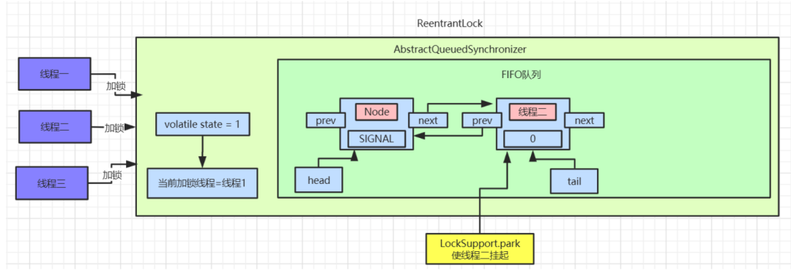

此时线程二就静静的待在AQS的等待队列里面了，等着其他线程释放锁来唤醒它。

### 线程三抢占锁失败

看完了线程二抢占锁失败的分析，那么再来分析线程三抢占锁失败就很简单了，先看看addWaiter(Node mode)方法：

```
private Node addWaiter(Node mode) {
    Node node = new Node(Thread.currentThread(), mode);
    Node pred = tail;
    if (pred != null) {
        node.prev = pred;
        if (compareAndSetTail(pred, node)) {
            pred.next = node;
            return node;
        }
    }
    enq(node);
    return node;
}
```

此时等待队列的tail节点指向线程二，进入if逻辑后，通过CAS指令将tail节点重新指向线程三。

接着线程三调用enq()方法执行入队操作，和上面线程二执行方式是一致的，入队后会修改线程二对应的Node中的waitStatus=SIGNAL。最后线程三也会被挂起。此时等待队列的数据如图：

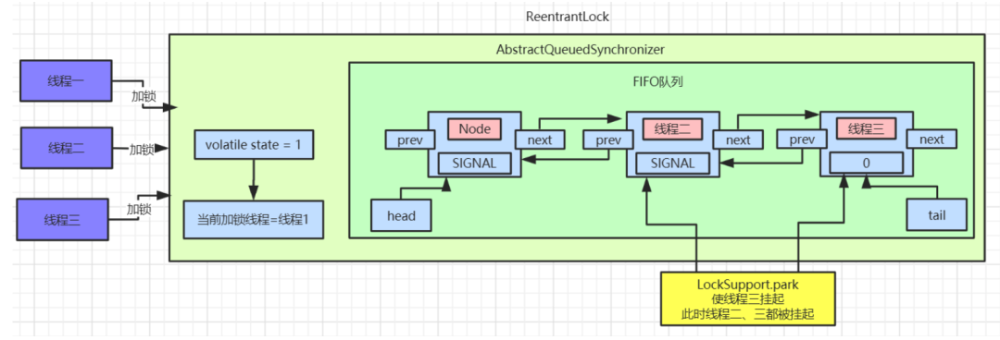

### 线程一释放锁

现在来分析下释放锁的过程，首先是线程一释放锁，释放锁后会唤醒head节点的后置节点，也就是我们现在的线程二，具体操作流程如下：

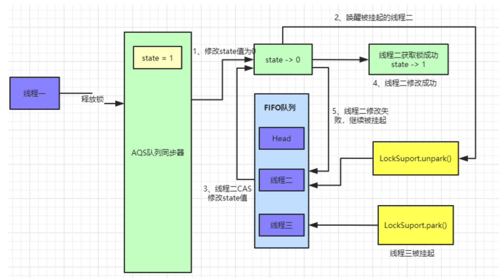

执行完后等待队列数据如下：

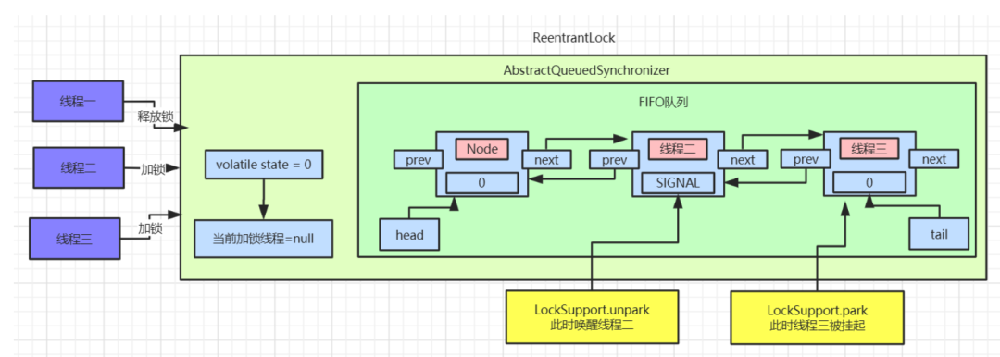

此时线程二已经被唤醒，继续尝试获取锁，如果获取锁失败，则会继续被挂起。如果获取锁成功，则AQS中数据如图：

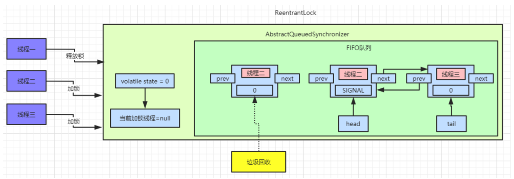

### 接着还是一步步拆解来看，先看看线程一释放锁的代码：

java.util.concurrent.locks.AbstractQueuedSynchronizer.release()

```
public final boolean release(int arg) {
    if (tryRelease(arg)) {
        Node h = head;
        if (h != null && h.waitStatus != 0)
            unparkSuccessor(h);
        return true;
    }
    return false;
}
```

这里首先会执行tryRelease()方法，这个方法具体实现在ReentrantLock中，如果tryRelease执行成功，则继续判断head节点的waitStatus是否为0

前面我们已经看到过，head的waitStatue为SIGNAL(-1)，这里就会执行unparkSuccessor()方法来唤醒head的后置节点，也就是我们上面图中线程二对应的Node节点。

此时看ReentrantLock.tryRelease()中的具体实现：

```
protected final boolean tryRelease(int releases) {
    int c = getState() - releases;
    if (Thread.currentThread() != getExclusiveOwnerThread())
        throw new IllegalMonitorStateException();
    boolean free = false;
    if (c == 0) {
        free = true;
        setExclusiveOwnerThread(null);
    }
    setState(c);
    return free;
}
```

执行完ReentrantLock.tryRelease()后，state被设置成0，Lock对象的独占锁被设置为null。此时看下AQS中的数据：

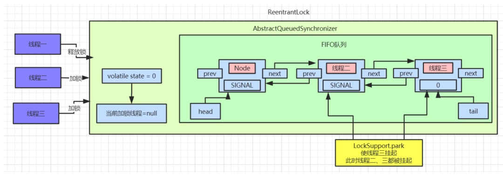

接着执行java.util.concurrent.locks.AbstractQueuedSynchronizer.unparkSuccessor()方法，唤醒head的后置节点：

```
private void unparkSuccessor(Node node) {
    int ws = node.waitStatus;
    if (ws < 0)
        compareAndSetWaitStatus(node, ws, 0);
    Node s = node.next;
    if (s == null || s.waitStatus > 0) {
        s = null;
        for (Node t = tail; t != null && t != node; t = t.prev)
            if (t.waitStatus <= 0)
                s = t;
    }
    if (s != null)
        LockSupport.unpark(s.thread);
}
```

这里主要是将head节点的waitStatus设置为0，然后解除head节点next的指向，使head节点空置，等待着被垃圾回收。

此时重新将head指针指向线程二对应的Node节点，且使用LockSupport.unpark方法来唤醒线程二。

被唤醒的线程二会接着尝试获取锁，用CAS指令修改state数据。执行完成后可以查看AQS中数据：

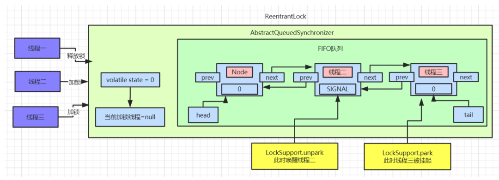

此时线程二被唤醒，线程二接着之前被park的地方继续执行，继续执行acquireQueued()方法。

### 线程二唤醒继续加锁

```
final boolean acquireQueued(final Node node, int arg) {
    boolean failed = true;
    try {
        boolean interrupted = false;
        for (;;) {
            final Node p = node.predecessor();
            if (p == head && tryAcquire(arg)) {
                setHead(node);
                p.next = null; // help GC
                failed = false;
                return interrupted;
            }
            if (shouldParkAfterFailedAcquire(p, node) &&
                parkAndCheckInterrupt())
                interrupted = true;
        }
    } finally {
        if (failed)
            cancelAcquire(node);
    }
}
```

此时线程二被唤醒，继续执行for循环，判断线程二的前置节点是否为head，如果是则继续使用tryAcquire()方法来尝试获取锁，其实就是使用CAS操作来修改state值，如果修改成功则代表获取锁成功。接着将线程二设置为head节点，然后空置之前的head节点数据，被空置的节点数据等着被垃圾回收。

此时线程三获取锁成功，AQS中队列数据如下：

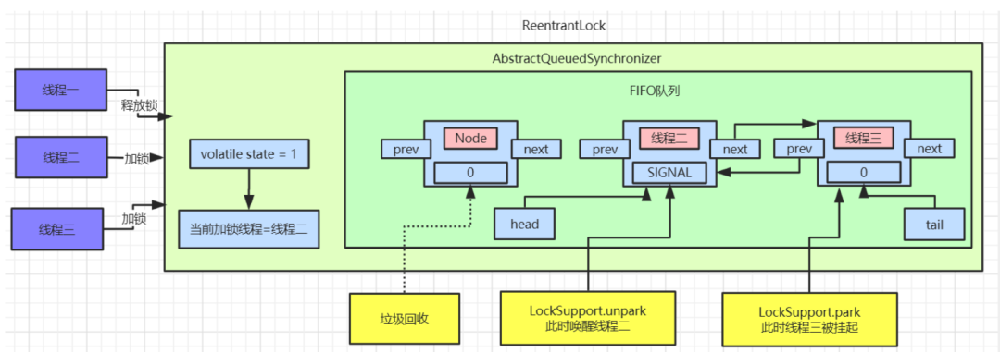

等待队列中的数据都等待着被垃圾回收。

### 线程二释放锁/线程三加锁

当线程二释放锁时，会唤醒被挂起的线程三，流程和上面大致相同，被唤醒的线程三会再次尝试加锁，具体代码可以参考上面内容。具体流程图如下：

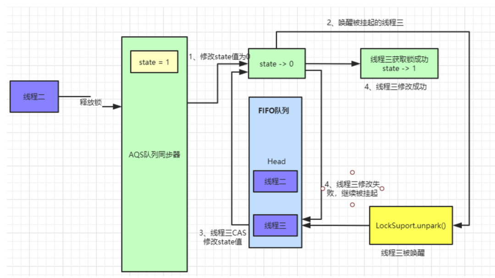

此时AQS中队列数据如图：

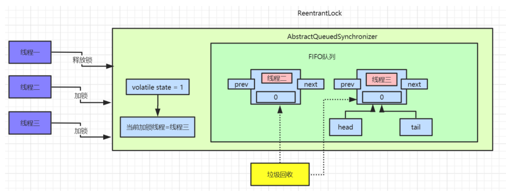

## 划重点，总结辣：

### AQS实现原理：

- AQS中 维护了一个volatile int state（代表共享资源）和一个FIFO双向等待CLH队列（多线程争用资源被阻塞时会进入此队列）。
- 另外state的操作都是通过CAS来保证其并发修改的安全性。
- 这里volatile能够保证多线程下的可见性，当state=1则代表当前对象锁已经被占有，其他线程来加锁时则会失败，加锁失败的线程会被放入一个FIFO的等待队列中，比列会被UNSAFE.park()操作挂起，等待其他获取锁的线程释放锁才能够被唤醒。
- 当线程执行完逻辑后，会释放同步状态，释放后会唤醒其后继节点，使其再次尝试获取同步状态。


### 加锁和挂起线程流程：

1. 首先调用nonfairTryAcquire()获取`state`的值。如果为0，利用`CAS`尝试抢占锁compareAndSetState(0, 1)，且设置对象独占锁线程为当前线程setExclusiveOwnerThread(Thread.currentThread())；如果不为0则说明当前对象的锁已经被其他线程所占有，接着判断占有锁的线程是否为当前线程，如果是则累加`state`值。获取锁成功。

2. 如果获取锁失败：首先执行`addWaiter(Node.EXCLUSIVE)`，加入到一个`FIFO`   CLH等待队列中。`addWaiter()`方法执行完后，会返回当前线程创建的节点信息。继续往后执行`acquireQueued(addWaiter(Node.EXCLUSIVE), arg)`逻辑。`acquireQueued()`这个方法会先判断当前传入的`Node`对应的前置节点是否为`head`，如果是则尝试加锁。加锁成功过则将当前节点设置为`head`节点，然后空置之前的`head`节点，方便后续被垃圾回收掉。如果加锁失败或者`Node`的前置节点不是`head`节点，就会通过`shouldParkAfterFailedAcquire`方法 将前一个节点的`waitStatus`变为了`SIGNAL=-1`，最后执行`parkAndChecknIterrupt`方法，调用`LockSupport.park()`挂起当前线程，等着其他线程释放锁来唤醒它。

### 释放锁和唤醒线程流程：

1. 首先是拥有锁的线程释放锁，释放锁后会唤醒`head`节点的后置节点。
2. 首先会执行`tryRelease()`方法，执行完`ReentrantLock.tryRelease()`后，`state`被设置成0，Lock对象的独占锁被设置为null。如果`tryRelease`执行成功，则继续判断`head`节点的`waitStatus`是否为0，就会执行`unparkSuccessor()`方法来唤醒`head`的后置节点。`unparkSuccessor()`主要是将`head`节点的`waitStatus`设置为0，然后解除`head`节点`next`的指向，使`head`节点空置，等待着被垃圾回收。然后唤醒的节点就可以执行加锁流程了。