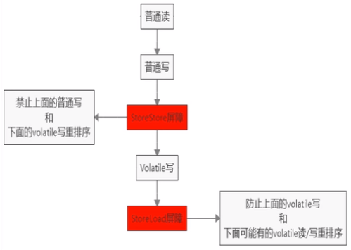
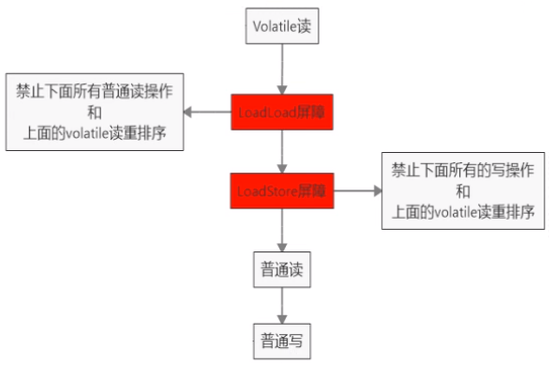

## volatile是什么

volatile是JVM提供的轻量级的同步机制

- 保证可见性
- 不保证原子性
- 禁止指令重排（保证有序性）


## JMM内存模型之可见性

JMM（Java内存模型Java Memory Model，简称JMM）本身是一种抽象的概念并不真实存在，它描述的是一组规则或规范，通过这组规范定义了程序中各个变量（包括实例字段，静态字段和构成数组对象的元素）的访问方式。

JMM关于同步的规定：

- 线程解锁前，必须把共享变量的值刷新回主内存
- 线程加锁前，必须读取主内存的最新值到自己的工作内存
- 加锁解锁是同一把锁

由于JVM运行程序的实体是线程，而每个线程创建时JVM都会为其创建一个工作内存（有些地方称为栈空间），工作内存是每个线程的私有数据区域，而Java内存模型中规定所有变量都存储在主内存，主内存是共享内存区域，所有线程都可以访问，但线程对变量的操作（读取赋值等）必须在工作内存中进行，首先要将变量从主内存拷贝的自己的工作内存空间，然后对变量进行操作，操作完成后再将变量写回主内存，不能直接操作主内存中的变量，各个线程中的工作内存中存储着主内存中的变量副本拷贝，因此不同的线程间无法访问对方的工作内存，线程间的通信（传值）必须通过主内存来完成，其简要访问过程如下图：


### 可见性

各个线程对主内存中共享变量的操作,都是各个线程各自拷贝到自己的工作内存进行操作后再写回到主内存中的。

这就可能存在一个线程AAA修改了共享变量X的值但还未写回主内存时，另外一个线程BBB又对主内存中同一个共享变量X进行操作，但此时A线程工作内存中共享变量x对线程B来说并不可见，这种工作内存与主内存同步延迟现象就造成了可见性问题

## 可见性的代码验证说明

```
import java.util.concurrent.TimeUnit;

/**
 * 假设是主物理内存
 */
class MyData {

    //volatile int number = 0;
    int number = 0;

    public void addTo60() {
        this.number = 60;
    }
}

/**
 * 验证volatile的可见性
 * 1. 假设int number = 0， number变量之前没有添加volatile关键字修饰
 */
public class VolatileDemo {

    public static void main(String args []) {

        // 资源类
        MyData myData = new MyData();

        // AAA线程 实现了Runnable接口的，lambda表达式
        new Thread(() -> {

            System.out.println(Thread.currentThread().getName() + "\t come in");

            // 线程睡眠3秒，假设在进行运算
            try {
                TimeUnit.SECONDS.sleep(3);
            } catch (InterruptedException e) {
                e.printStackTrace();
            }
            // 修改number的值
            myData.addTo60();

            // 输出修改后的值
            System.out.println(Thread.currentThread().getName() + "\t update number value:" + myData.number);

        }, "AAA").start();

        // main线程就一直在这里等待循环，直到number的值不等于零
        while(myData.number == 0) {}

        // 按道理这个值是不可能打印出来的，因为主线程运行的时候，number的值为0，所以一直在循环
        // 如果能输出这句话，说明AAA线程在睡眠3秒后，更新的number的值，重新写入到主内存，并被main线程感知到了
        System.out.println(Thread.currentThread().getName() + "\t mission is over");

    }
}

```

由于没有volatile修饰MyData类的成员变量number，main线程将会卡在while(myData.number == 0) {}，不能正常结束。若想正确结束，用volatile修饰MyData类的成员变量number吧。

## volatile不保证原子性

原子性指不可分割，完整性，也即某个线程正在做某个具体业务时，中间不可以被加塞或者被分割。需要整体完整要么同时成功，要么同时失败。

volatile不保证原子性案例演示：

```
class MyData2 {
    /**
     * volatile 修饰的关键字，是为了增加 主线程和线程之间的可见性，只要有一个线程修改了内存中的值，其它线程也能马上感知
     */
    volatile int number = 0;


    public void addPlusPlus() {
        number ++;
    }
}

public class VolatileAtomicityDemo {

	public static void main(String[] args) {
        MyData2 myData = new MyData2();

        // 创建10个线程，线程里面进行1000次循环
        for (int i = 0; i < 20; i++) {
            new Thread(() -> {
                // 里面
                for (int j = 0; j < 1000; j++) {
                    myData.addPlusPlus();
                }
            }, String.valueOf(i)).start();
        }

        // 需要等待上面20个线程都计算完成后，在用main线程取得最终的结果值
        // 这里判断线程数是否大于2，为什么是2？因为默认是有两个线程的，一个main线程，一个gc线程
        while(Thread.activeCount() > 2) {
            // yield表示不执行
            Thread.yield();
        }

        // 查看最终的值
        // 假设volatile保证原子性，那么输出的值应该为：  20 * 1000 = 20000
        System.out.println(Thread.currentThread().getName() + "\t finally number value: " + myData.number);

	}

}
```

最后的结果总是小于20000。因为i++里面包含有几条语句操作，并发时当A线程写入主内存后，还没来得及通知其他线程时，B线程就覆盖A写入主内存的值了。

## volatile不保证原子性理论解释

number++在多线程下是非线程安全的。

我们可以将代码编译成字节码，可看出number++被编译成3条指令。


假设我们没有加 synchronized那么第一步就可能存在着，三个线程同时通过getfield命令，拿到主存中的 n值，然后三个线程，各自在自己的工作内存中进行加1操作，但他们并发进行 iadd 命令的时候，因为只能一个进行写，所以其它操作会被挂起，假设1线程，先进行了写操作，在写完后，volatile的可见性，应该需要告诉其它两个线程，主内存的值已经被修改了，但是因为太快了，其它两个线程，陆续执行 iadd命令，进行写入操作，这就造成了其他线程没有接受到主内存n的改变，从而覆盖了原来的值，出现写丢失，这样也就让最终的结果少于20000。


## volatile不保证原子性问题解决

可加synchronized解决，但它是重量级同步机制，性能上有所顾虑。

如何不加synchronized解决number++在多线程下是非线程安全的问题？使用AtomicInteger。

```
import java.util.concurrent.atomic.AtomicInteger;

class MyData2 {
    /**
     * volatile 修饰的关键字，是为了增加 主线程和线程之间的可见性，只要有一个线程修改了内存中的值，其它线程也能马上感知
     */
	volatile int number = 0;
	AtomicInteger number2 = new AtomicInteger();

    public void addPlusPlus() {
        number ++;
    }
    
    public void addPlusPlus2() {
    	number2.getAndIncrement();
    }
}

public class VolatileAtomicityDemo {

	public static void main(String[] args) {
        MyData2 myData = new MyData2();

        // 创建10个线程，线程里面进行1000次循环
        for (int i = 0; i < 20; i++) {
            new Thread(() -> {
                // 里面
                for (int j = 0; j < 1000; j++) {
                    myData.addPlusPlus();
                    myData.addPlusPlus2();
                }
            }, String.valueOf(i)).start();
        }

        // 需要等待上面20个线程都计算完成后，在用main线程取得最终的结果值
        // 这里判断线程数是否大于2，为什么是2？因为默认是有两个线程的，一个main线程，一个gc线程
        while(Thread.activeCount() > 2) {
            // yield表示不执行
            Thread.yield();
        }

        // 查看最终的值
        // 假设volatile保证原子性，那么输出的值应该为：  20 * 1000 = 20000
        System.out.println(Thread.currentThread().getName() + "\t finally number value: " + myData.number);
        System.out.println(Thread.currentThread().getName() + "\t finally number2 value: " + myData.number2);
	}
}
```

输出结果为：

```
main	 finally number value: 18766
main	 finally number2 value: 20000
```

## volatile指令重排案例1

计算机在执行程序时，为了提高性能，编译器和处理器的常常会对指令做重排，一般分以下3种：


单线程环境里面确保程序最终执行结果和代码顺序执行的结果一致。

处理器在进行重排序时必须要考虑指令之间的数据依赖性

多线程环境中线程交替执行，由于编译器优化重排的存在，两个线程中使用的变量能否保证一致性是无法确定的，结果无法预测。


```
public void mySort{
	int x = 11;//语句1
    int y = 12;//语句2
    × = × + 5;//语句3
    y = x * x;//语句4
}
```

可重排序列：

- 1234
- 2134
- 1324

语句4可以重排后变成第一个条吗？答：不能。

## volatile指令重排案例2

```
public class ReSortSeqDemo{
	int a = 0;
	boolean flag = false;
    
	public void method01(){
		a = 1;//语句1
		flag = true;//语句2
	}
    
    public void method02(){
        if(flag){
            a = a + 5; //语句3
        }
        System.out.println("retValue: " + a);//可能是6或1或5或0
    }
    
}

```

多线程环境中线程交替执行method01()和method02()，由于编译器优化重排的存在，两个线程中使用的变量能否保证一致性是无法确定的，结果无法预测。

## 禁止指令重排小总结

volatile实现禁止指令重排优化，从而避免多线程环境下程序出现乱序执行的现象

先了解一个概念，内存屏障(Memory Barrier）又称内存栅栏，是一个CPU指令，它的作用有两个:

- 保证特定操作的执行顺序
- 保证某些变量的内存可见性（利用该特性实现volatile的内存可见性）

由于编译器和处理器都能执行指令重排优化。如果在指令间插入一条Memory Barrier则会告诉编译器和CPU，不管什么指令都不能和这条Memory Barrier指令重排序，也就是说通过插入内存屏障禁止在内存屏障前后的指令执行重排序优化。内存屏障另外一个作用是强制刷出各种CPU的缓存数据，因此任何CPU上的线程都能读取到这些数据的最新版本。

对volatile变量进行写操作时，会在写操作后加入一条store屏障指令，将工作内存中的共享变量值刷新回到主内存。



对Volatile变量进行读操作时，会在读操作前加入一条load屏障指令，从主内存中读取共享变量。



### 线性安全性获得保证

工作内存与主内存同步延迟现象导致的可见性问题 - 可以使用synchronized或volatile关键字解决，它们都可以使一个线程修改后的变量立即对其他线程可见。

对于指令重排导致的可见性问题和有序性问题 - 可以利用volatile关键字解决，因为volatile的另外一个作用就是禁止重排序优化。

## 单例模式volatile分析

DCL（Double Check Lock双端检锁机制）和volatile

```
public class SingletonDemo{
	private SingletonDemo(){}
    
    private volatile static SingletonDemo instance = null;

    public static SingletonDemo getInstance() {
        if(instance == null) {
            synchronized(SingletonDemo.class){
                if(instance == null){
                    instance = new SingletonDemo();       
                }
            }
        }
        return instance;
    }
}

```

DCL中volatile解析

原因在于某一个线程执行到第一次检测，读取到的instance不为null时，instance的引用对象可能没有完成初始化，返回了空的对象。instance = new SingletonDemo(),可以分为以下3步完成(伪代码)：

```
memory = allocate(); //1.分配对象内存空间
instance(memory); //2.初始化对象
instance = memory; //3.设置instance指向刚分配的内存地址，此时instance != null

```

步骤2和步骤3不存在数据依赖关系，而且无论重排前还是重排后程序的执行结果在单线程中并没有改变，因此这种重排优化是允许的。

```
memory = allocate(); //1.分配对象内存空间
instance = memory;//3.设置instance指向刚分配的内存地址，此时instance! =null，但是对象还没有初始化完成!
instance(memory);//2.初始化对象

```

但是指令重排只会保证串行语义的执行的一致性(单线程)，但并不会关心多线程间的语义一致性。

所以当一条线程访问instance不为null时，由于instance实例未必已初始化完成，也就造成了线程安全问题。