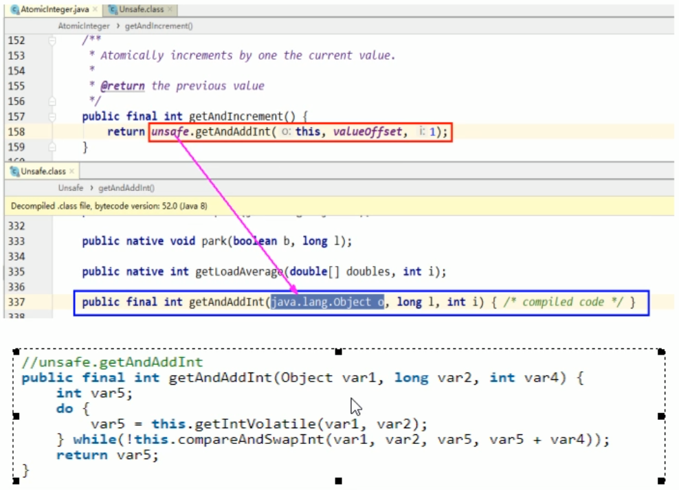
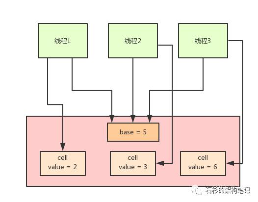

## CAS是什么

CAS的全称为Compare-And-Swap，它是一条CPU并发原语。

它的功能是判断内存某个位置的值是否为预期值，如果是则更改为新的值，这个过程是原子的。

**CAS并发原语体现在JAVA语言中就是sun.misc.Unsafe类中的各个方法。调用UnSafe类中的CAS方法，JVM会帮我们实现出CAS汇编指令。这是一种完全依赖于硬件的功能，通过它实现了原子操作。再次强调，由于CAS是一种系统原语，原语属于操作系统用语范畴，是由若干条指令组成的，用于完成某个功能的一个过程，并且原语的执行必须是连续的，在执行过程中不允许被中断，也就是说CAS是一条CPU的原子指令，不会造成所谓的数据不一致问题。（原子性）**


## AtomicInteger

Compare And Set 比较和设置

```
public class CASDemo{
    public static void main(string[] args){
        AtomicInteger atomicInteger = new AtomicInteger(5);// mian do thing. . . . ..
        System.out.println(atomicInteger.compareAndSet(5, 2019)+"\t current data: "+atomicInteger.get());
        System.out.println(atomicInteger.compareAndset(5, 1024)+"\t current data: "+atomicInteger.get());
    }
}

```

输出结果为

```
true    2019
false   2019

```


## UnSafe类


atomiclnteger.getAndIncrement()源码


```
public class AtomicInteger extends Number implements java.io.Serializable {
    private static final long serialVersionUID = 6214790243416807050L;

    // setup to use Unsafe.compareAndSwapInt for updates
    private static final Unsafe unsafe = Unsafe.getUnsafe();
    private static final long valueOffset;

    static {
        try {
            valueOffset = unsafe.objectFieldOffset
                (AtomicInteger.class.getDeclaredField("value"));
        } catch (Exception ex) { throw new Error(ex); }
    }

    private volatile int value;
    
    /**
     * Creates a new AtomicInteger with the given initial value.
     *
     * @param initialValue the initial value
     */
    public AtomicInteger(int initialValue) {
        value = initialValue;
    }

    /**
     * Creates a new AtomicInteger with initial value {@code 0}.
     */
    public AtomicInteger() {
    }
    
    ...
            
    /**
     * Atomically increments by one the current value.
     *
     * @return the previous value
     */
    public final int getAndIncrement() {
        return unsafe.getAndAddInt(this, valueOffset, 1);
    }
    
    ...
}   

```


```
public final int getAndAddInt(Object var1, long var2, int var4) {
    int var5;
    do {
        var5 = this.getIntVolatile(var1, var2);
    } while(!this.compareAndSwapInt(var1, var2, var5, var5 + var4));

    return var5;
}
```


```
public final native boolean compareAndSwapInt(Object var1, long var2, int var4, int var5);
```


Unsafe是CAS的核心类，由于Java方法无法直接访问底层系统，需要通过本地（native）方法来访问，Unsafe相当于一个后门，基于该类可以直接操作特定内存的数据。Unsafe类存在于sun.misc包中，其内部方法操作可以像C的指针一样直接操作内存，因为Java中CAS操作的执行依赖于Unsafe类的方法。

注意Unsafe类中的所有方法都是native修饰的，也就是说Unsafe类中的方法都直接调用操作系统底层资源执行相应任务。

变量valueOffset，表示该变量值在内存中的偏移地址，因为Unsafe就是根据内存偏移地址获取数据的。

变量value用volatile修饰，保证了多线程之间的内存可见性。


## Unsafe源码解释



- var1 AtomicInteger对象本身。
- var2 该对象值得引用地址。
- var4 需要变动的数量。
- var5是用过var1，var2找出的主内存中真实的值。
- 用该对象当前的值与var5比较： 如果相同，更新var5+var4并且返回true,如果不同，继续取值然后再比较，直到更新完成。

假设线程A和线程B两个线程同时执行getAndAddInt操作（分别跑在不同CPU上) ：

- Atomiclnteger里面的value原始值为3，即主内存中Atomiclnteger的value为3，根据JMM模型，线程A和线程B各自持有一份值为3的value的副本分别到各自的工作内存。
- 线程A通过getIntVolatile(var1, var2)拿到value值3，这时线程A被挂起。
- 线程B也通过getintVolatile(var1, var2)方法获取到value值3，此时刚好线程B没有被挂起并执行compareAndSwapInt方法比较内存值也为3，成功修改内存值为4，线程B打完收工，一切OK。
- 这时线程A恢复，执行compareAndSwapInt方法比较，发现自己手里的值数字3和主内存的值数字4不一致，说明该值己经被其它线程抢先一步修改过了，那A线程本次修改失败，只能重新读取重新来一遍了。
- 线程A重新获取value值，因为变量value被volatile修饰，所以其它线程对它的修改，线程A总是能够看到，线程A继续执行compareAndSwaplnt进行比较替换，直到成功。

Unsafe类中的compareAndSwapInt，是一个本地方法，该方法的实现位于unsafe.cpp中。

## 小结

CAS有3个操作数，内存值V，旧的预期值A，要修改的更新值B。

当且仅当预期值A和内存值V相同时，将内存值V修改为B，否则什么都不做。

## CAS缺点

### 循环时间长开销很大

```
// ursafe.getAndAddInt
public final int getAndAddInt(Object var1, long var2, int var4){
	int var5;
	do {
		var5 = this.getIntVolatile(var1, var2);
	}while(!this.compareAndSwapInt(varl, var2, var5，var5 + var4));
    return var5;
}

```

我们可以看到getAndAddInt方法执行时，有个do while，如果CAS失败，会一直进行尝试。如果CAS长时间一直不成功，可能会给CPU带来很大的开销。

Java 8 推出了一个新的类，LongAdder，他就是尝试使用分段 CAS 以及自动分段迁移的方式来大幅度提升多线程高并发执行 CAS 操作的性能.



在 LongAdder 的底层实现中，首先有一个 base 值，刚开始多线程来不停的累加数值，都是对 base 进行累加的，比如刚开始累加成了 base = 5。

接着如果发现并发更新的线程数量过多，就会开始施行分段 CAS 的机制，也就是内部会搞一个 Cell 数组，每个数组是一个数值分段。

这时，让大量的线程分别去对不同 Cell 内部的 value 值进行 CAS 累加操作，这样就把 CAS 计算压力分散到了不同的 Cell 分段数值中了！

这样就可以大幅度的降低多线程并发更新同一个数值时出现的无限循环的问题，大幅度提升了多线程并发更新数值的性能和效率！

而且他内部实现了自动分段迁移的机制，也就是如果某个 Cell 的 value 执行 CAS 失败了，那么就会自动去找另外一个 Cell 分段内的 value 值进行 CAS 操作。

这样也解决了线程空旋转、自旋不停等待执行 CAS 操作的问题，让一个线程过来执行 CAS 时可以尽快的完成这个操作。

最后，如果你要从 LongAdder 中获取当前累加的总值，就会把 base 值和所有 Cell 分段数值加起来返回给你。

### 只能保证一个共享变量的原子操作

当对一个共享变量执行操作时，我们可以使用循环CAS的方式来保证原子操作，但是，对多个共享变量操作时，循环CAS就无法保证操作的原子性，这个时候就可以用锁来保证原子性。

### ABA问题

CAS算法实现一个重要前提需要取出内存中某时刻的数据并在当下时刻比较并替换，那么在这个时间差类会导致数据的变化。

比如说一个线程one从内存位置V中取出A，这时候另一个线程two也从内存中取出A，并且线程two进行了一些操作将值变成了B,然后线程two又将V位置的数据变成A，这时候线程one进行CAS操作发现内存中仍然是A，然后线程one操作成功。

尽管线程one的CAS操作成功，但是不代表这个过程就是没有问题的。

## AtomicReference原子引用

```
import java.util.concurrent.atomic.AtomicReference;

class User{
	
	String userName;
	
	int age;
	
    public User(String userName, int age) {
		this.userName = userName;
		this.age = age;
	}

	@Override
	public String toString() {
		return String.format("User [userName=%s, age=%s]", userName, age);
	}
    
}

public class AtomicReferenceDemo {
    public static void main(String[] args){
        User z3 = new User( "z3",22);
        User li4 = new User("li4" ,25);
		AtomicReference<User> atomicReference = new AtomicReference<>();
        atomicReference.set(z3);
		System.out.println(atomicReference.compareAndSet(z3, li4)+"\t"+atomicReference.get().toString());
        System.out.println(atomicReference.compareAndSet(z3, li4)+"\t"+atomicReference.get().toString());
    }
}
```

```
true	User [userName=li4, age=25]
false	User [userName=li4, age=25]

```

## AtomicStampedReference版本号原子引用(解决ABA问题)

原子引用 + 新增一种机制，那就是修改版本号（类似时间戳），它用来解决ABA问题。

```
import java.util.concurrent.TimeUnit;
import java.util.concurrent.atomic.AtomicReference;
import java.util.concurrent.atomic.AtomicStampedReference;

public class ABADemo {
	/**
	 * 普通的原子引用包装类
	 */
	static AtomicReference<Integer> atomicReference = new AtomicReference<>(100);

	// 传递两个值，一个是初始值，一个是初始版本号
	static AtomicStampedReference<Integer> atomicStampedReference = new AtomicStampedReference<>(100, 1);

	public static void main(String[] args) {

		System.out.println("============以下是ABA问题的产生==========");

		new Thread(() -> {
			// 把100 改成 101 然后在改成100，也就是ABA
			atomicReference.compareAndSet(100, 101);
			atomicReference.compareAndSet(101, 100);
		}, "t1").start();

		new Thread(() -> {
			try {
				// 睡眠一秒，保证t1线程，完成了ABA操作
				TimeUnit.SECONDS.sleep(1);
			} catch (InterruptedException e) {
				e.printStackTrace();
			}
			// 把100 改成 101 然后在改成100，也就是ABA
			System.out.println(atomicReference.compareAndSet(100, 2019) + "\t" + atomicReference.get());

		}, "t2").start();

		/
		try {
			TimeUnit.SECONDS.sleep(2);
		} catch (Exception e) {
			e.printStackTrace();
		}
		/

		
		System.out.println("============以下是ABA问题的解决==========");

		new Thread(() -> {

			// 获取版本号
			int stamp = atomicStampedReference.getStamp();
			System.out.println(Thread.currentThread().getName() + "\t 第一次版本号" + stamp);

			// 暂停t3一秒钟
			try {
				TimeUnit.SECONDS.sleep(1);
			} catch (InterruptedException e) {
				e.printStackTrace();
			}

			// 传入4个值，期望值，更新值，期望版本号，更新版本号
			atomicStampedReference.compareAndSet(100, 101, atomicStampedReference.getStamp(),
					atomicStampedReference.getStamp() + 1);

			System.out.println(Thread.currentThread().getName() + "\t 第二次版本号" + atomicStampedReference.getStamp());

			atomicStampedReference.compareAndSet(101, 100, atomicStampedReference.getStamp(),
					atomicStampedReference.getStamp() + 1);

			System.out.println(Thread.currentThread().getName() + "\t 第三次版本号" + atomicStampedReference.getStamp());

		}, "t3").start();

		new Thread(() -> {

			// 获取版本号
			int stamp = atomicStampedReference.getStamp();
			System.out.println(Thread.currentThread().getName() + "\t 第一次版本号" + stamp);

			// 暂停t4 3秒钟，保证t3线程也进行一次ABA问题
			try {
				TimeUnit.SECONDS.sleep(3);
			} catch (InterruptedException e) {
				e.printStackTrace();
			}

			boolean result = atomicStampedReference.compareAndSet(100, 2019, stamp, stamp + 1);

			System.out.println(Thread.currentThread().getName() + "\t 修改成功否：" + result + "\t 当前最新实际版本号："
					+ atomicStampedReference.getStamp());

			System.out.println(Thread.currentThread().getName() + "\t 当前实际最新值" + atomicStampedReference.getReference());

		}, "t4").start();

	}
}

```

```
============以下是ABA问题的产生==========
true	2019
============以下是ABA问题的解决==========
t3	 第一次版本号1
t4	 第一次版本号1
t3	 第二次版本号2
t3	 第三次版本号3
t4	 修改成功否：false	 当前最新实际版本号：3
t4	 当前实际最新值100
```