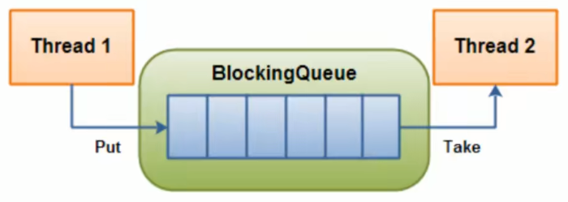
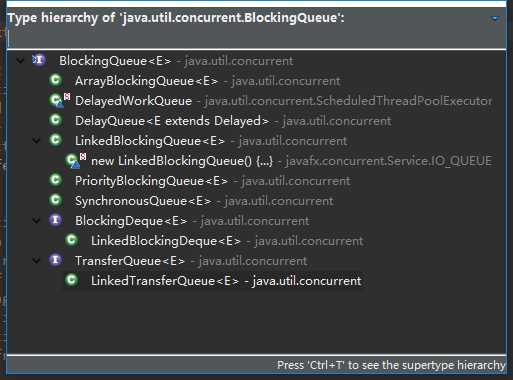
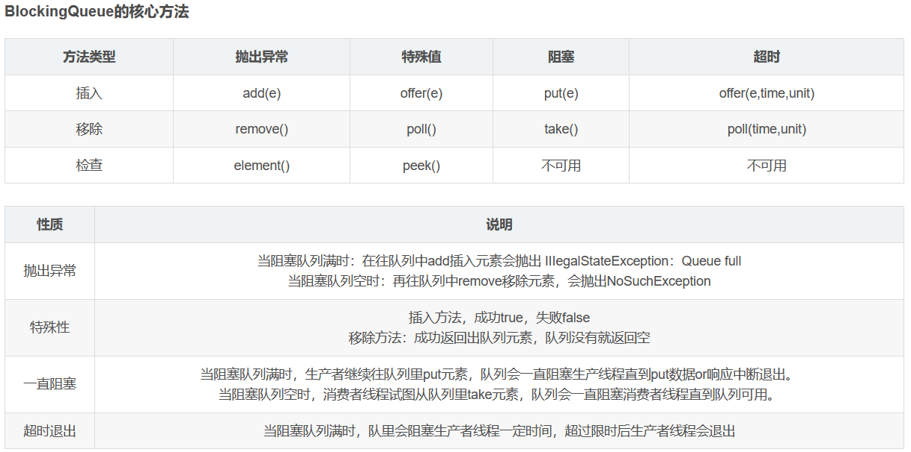

## 阻塞队列接口结构和实现类

阻塞队列，顾名思义，首先它是一个队列，而一个阻塞队列在数据结构中所起的作用大致如下图所示：



线程1往阻塞队列中添加元素，而线程2从阻塞队列中移除元素。

当阻塞队列是空时，从队列中获取元素的操作将会被阻塞。

当阻塞队列是满时，往队列里添加元素的操作将会被阻塞。

试图从空的阻塞队列中获取元素的线程将会被阻塞，直到其他的线程往空的队列插入新的元素。

同样试图往已满的阻塞队列中添加新元素的线程同样也会被阻塞，直到其他的线程从列中移除一个或者多个元素或者完全清空队列后使队列重新变得空闲起来并后续新增

## 为什么用阻塞队列？有什么好处？

在多线程领域：所谓阻塞，在某些情况下余挂起线程（即阻塞），一旦条件满足，被挂起的线程又会自动被唤醒

为什么需要BlockingQueue:

好处是我们不需要关心什么时候需要阻塞线程，什么时候需要唤醒线程，因为这一切BlockingQueue都给你一手包办了

在Concurrent包发布以前，在多线程环境下，我们每个程序员都必须去自己控制这些细节，尤其还要兼顾效率和线程安全，而这会给我们的程序带来不小的复杂度。

## 阻塞队列种类



最常用的三种：

- ArrayBlockingQueue：由数组结构组成的有界阻塞队列。
- LinkedBlockingQueue：由链表结构组成的有界（但大小默认值为Integer.MAX_VALUE）阻塞队列。
- SynchronousQueue：不存储元素的阻塞队列。



## 抛出异常组

```
import java.util.concurrent.ArrayBlockingQueue;
import java.util.concurrent.BlockingQueue;

public class BlockingQueueExceptionDemo {

	public static void main(String[] args) {
		BlockingQueue<String> blockingQueue = new ArrayBlockingQueue<>(3);

		System.out.println(blockingQueue.add("a"));
		System.out.println(blockingQueue.add("b"));
		System.out.println(blockingQueue.add("c"));

		try {
			//抛出 java.lang.IllegalStateException: Queue full
			System.out.println(blockingQueue.add("XXX"));
		} catch (Exception e) {
			System.err.println(e);
		}
		
		System.out.println(blockingQueue.element());
		
		///
		
		System.out.println(blockingQueue.remove());
		System.out.println(blockingQueue.remove());
		System.out.println(blockingQueue.remove());
		
		try {
			//抛出 java.util.NoSuchElementException
			System.out.println(blockingQueue.remove());			
		} catch (Exception e) {
			System.err.println(e);
		}

		try {
			//element()相当于peek(),但element()会抛NoSuchElementException
			System.out.println(blockingQueue.element());
		} catch (Exception e) {
			System.err.println(e);
		}
		
	}
}

```

输出结果：

```
true
true
true
a
java.lang.IllegalStateException: Queue full
a
b
c
java.util.NoSuchElementException
java.util.NoSuchElementException

```

## 返回布尔值组

```
import java.util.concurrent.ArrayBlockingQueue;
import java.util.concurrent.BlockingQueue;

public class BlockingQueueBooleanDemo {

	public static void main(String[] args) {
		BlockingQueue<String> blockingQueue = new ArrayBlockingQueue<>(3);

		System.out.println(blockingQueue.offer("a"));
		System.out.println(blockingQueue.offer("b"));
		System.out.println(blockingQueue.offer("c"));
		System.out.println(blockingQueue.offer("d"));

		System.out.println(blockingQueue.poll());
		System.out.println(blockingQueue.poll());
		System.out.println(blockingQueue.poll());
		System.out.println(blockingQueue.poll());
	}
}

```

输出结果：

```
true
true
true
false
a
b
c
null

```

## 阻塞和超时控制

队列阻塞演示：

```
import java.util.concurrent.ArrayBlockingQueue;
import java.util.concurrent.BlockingQueue;
import java.util.concurrent.TimeUnit;

public class BlockingQueueBlockedDemo {

	public static void main(String[] args) throws InterruptedException {
		BlockingQueue<String> blockingQueue = new ArrayBlockingQueue<>(3);
		
		new Thread(()->{
			try {
				blockingQueue.put("a");
				blockingQueue.put("b");
				blockingQueue.put("c");
				blockingQueue.put("c");//将会阻塞,直到主线程take()
				System.out.println("it was blocked.");

			} catch (InterruptedException e) {
				e.printStackTrace();
			}
		}).start();
		
		TimeUnit.SECONDS.sleep(2);
		
		try {
	
			blockingQueue.take();
			blockingQueue.take();
			blockingQueue.take();
			blockingQueue.take();
			
			System.out.println("Blocking...");
			blockingQueue.take();//将会阻塞
			
		} catch (InterruptedException e) {
			e.printStackTrace();
		}
	}

}

```

阻塞超时放弃演示

```
import java.util.concurrent.ArrayBlockingQueue;
import java.util.concurrent.BlockingQueue;
import java.util.concurrent.TimeUnit;

public class BlockingQueueTimeoutDemo {

	public static void main(String[] args) throws InterruptedException {
		BlockingQueue<String> blockingQueue = new ArrayBlockingQueue<>(3);
		
		System.out.println("Offer.");
		System.out.println(blockingQueue.offer("a", 2L, TimeUnit.SECONDS));
		System.out.println(blockingQueue.offer("b", 2L, TimeUnit.SECONDS));
		System.out.println(blockingQueue.offer("c", 2L, TimeUnit.SECONDS));
		System.out.println(blockingQueue.offer("d", 2L, TimeUnit.SECONDS));
		
		System.out.println("Poll.");
		System.out.println(blockingQueue.poll(2L, TimeUnit.SECONDS));
		System.out.println(blockingQueue.poll(2L, TimeUnit.SECONDS));
		System.out.println(blockingQueue.poll(2L, TimeUnit.SECONDS));
		System.out.println(blockingQueue.poll(2L, TimeUnit.SECONDS));
	}

}
```

输出结果：

```
Offer.
true
true
true
false
Poll.
a
b
c
null
```

## 同步SynchronousQueue队列

SynchronousQueue没有容量。

与其他BlockingQueue不同，SynchronousQueue是一个不存储元素的BlockingQueue。

每一个put操作必须要等待一个take操作，否则不能继续添加元素，反之亦然。

## 线程通信之生产者消费者传统版

```
import java.util.concurrent.locks.Condition;
import java.util.concurrent.locks.Lock;
import java.util.concurrent.locks.ReentrantLock;

class ShareData {

    private int number = 0;

    private Lock lock = new ReentrantLock();

    private Condition condition = lock.newCondition();

    public void increment() throws Exception{
        // 同步代码块，加锁
        lock.lock();
        try {
            // 判断
            while(number != 0) {
                // 等待不能生产
                condition.await();
            }

            // 干活
            number++;

            System.out.println(Thread.currentThread().getName() + "\t " + number);

            // 通知 唤醒
            condition.signalAll();
        } catch (Exception e) {
            e.printStackTrace();
        } finally {
            lock.unlock();
        }
    }

    public void decrement() throws Exception{
        // 同步代码块，加锁
        lock.lock();
        try {
            // 判断
            while(number == 0) {
                // 等待不能消费
                condition.await();
            }

            // 干活
            number--;

            System.out.println(Thread.currentThread().getName() + "\t " + number);

            // 通知 唤醒
            condition.signalAll();
        } catch (Exception e) {
            e.printStackTrace();
        } finally {
            lock.unlock();
        }
    }
}

public class TraditionalProducerConsumerDemo {
    
	public static void main(String[] args) {

        ShareData shareData = new ShareData();

        // t1线程，生产
        new Thread(() -> {
            for (int i = 0; i < 5; i++) {
                try {
                    shareData.increment();
                } catch (Exception e) {
                    e.printStackTrace();
                }
            }
        }, "t1").start();

        // t2线程，消费
        new Thread(() -> {
            for (int i = 0; i < 5; i++) {
                try {
                    shareData.decrement();
                } catch (Exception e) {
                    e.printStackTrace();
                }
            }
        }, "t2").start();
        
    }
}

```

## 锁绑定多个条件Condition

```
import java.util.concurrent.locks.Condition;
import java.util.concurrent.locks.Lock;
import java.util.concurrent.locks.ReentrantLock;

class ShareResource {
    // A 1   B 2   c 3
    private int number = 1;
    // 创建一个重入锁
    private Lock lock = new ReentrantLock();

    // 这三个相当于备用钥匙
    private Condition condition1 = lock.newCondition();
    private Condition condition2 = lock.newCondition();
    private Condition condition3 = lock.newCondition();

    public void print5() {
        lock.lock();
        try {
            // 判断
            while(number != 1) {
                // 不等于1，需要等待
                condition1.await();
            }

            // 干活
            for (int i = 0; i < 5; i++) {
                System.out.println(Thread.currentThread().getName() + "\t " + number + "\t" + i);
            }

            // 唤醒 （干完活后，需要通知B线程执行）
            number = 2;
            // 通知2号去干活了
            condition2.signal();

        } catch (Exception e) {
            e.printStackTrace();
        } finally {
            lock.unlock();
        }
    }

    public void print10() {
        lock.lock();
        try {
            // 判断
            while(number != 2) {
                // 不等于1，需要等待
                condition2.await();
            }

            // 干活
            for (int i = 0; i < 10; i++) {
                System.out.println(Thread.currentThread().getName() + "\t " + number + "\t" + i);
            }

            // 唤醒 （干完活后，需要通知C线程执行）
            number = 3;
            // 通知2号去干活了
            condition3.signal();

        } catch (Exception e) {
            e.printStackTrace();
        } finally {
            lock.unlock();
        }
    }

    public void print15() {
        lock.lock();
        try {
            // 判断
            while(number != 3) {
                // 不等于1，需要等待
                condition3.await();
            }

            // 干活
            for (int i = 0; i < 15; i++) {
                System.out.println(Thread.currentThread().getName() + "\t " + number + "\t" + i);
            }

            // 唤醒 （干完活后，需要通知C线程执行）
            number = 1;
            // 通知1号去干活了
            condition1.signal();

        } catch (Exception e) {
            e.printStackTrace();
        } finally {
            lock.unlock();
        }
    }
}

public class SynchronizedAndReentrantLockDemo {
    public static void main(String[] args) {

        ShareResource shareResource = new ShareResource();
        int num = 10;

        new Thread(() -> {
            for (int i = 0; i < num; i++) {
                    shareResource.print5();
            }
        }, "A").start();

        new Thread(() -> {
            for (int i = 0; i < num; i++) {
                shareResource.print10();
            }
        }, "B").start();

        new Thread(() -> {
            for (int i = 0; i < num; i++) {
                shareResource.print15();
            }
        }, "C").start();
    }
}
```