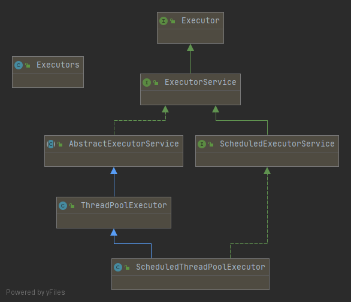
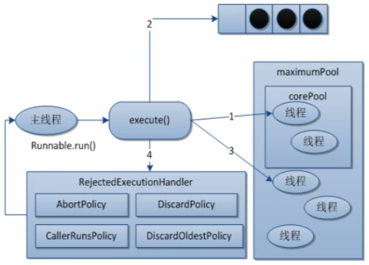

## Callable接口

Callable接口，是一种让线程执行完成后，能够返回结果的。

```
import java.util.concurrent.Callable;
import java.util.concurrent.ExecutionException;
import java.util.concurrent.FutureTask;
import java.util.concurrent.TimeUnit;

class MyThread implements Callable<Integer> {

    @Override
    public Integer call() throws Exception {
        System.out.println(Thread.currentThread().getName() + " come in Callable");
        TimeUnit.SECONDS.sleep(2);
        return 1024;
    }
}

public class CallableDemo {
	
	public static void main(String[] args) throws InterruptedException, ExecutionException {
		FutureTask<Integer> futureTask = new FutureTask<>(new MyThread());
		
		new Thread(futureTask, "A").start();
		new Thread(futureTask, "B").start();//多个线程执行 一个FutureTask的时候，只会计算一次
		
		// 输出FutureTask的返回值
		System.out.println("result FutureTask " + futureTask.get());
	}
	
}
```

## 线程池使用及优势

线程池做的工作主要是控制运行的线程的数量，处理过程中将任务放入队列，然后在线程创建后启动这些任务，如果线程数量超过了最大数量超出数量的线程排队等候，等其它线程执行完毕，再从队列中取出任务来执行。

它的主要特点为：线程复用，控制最大并发数，管理线程。

- 降低资源消耗。通过重复利用己创建的线程降低线程创建和销毁造成的消耗。
- 提高响应速度。当任务到达时，任务可以不需要的等到线程创建就能立即执行。
- 提高线程的可管理性。线程是稀缺资源，如果无限制的创建，不仅会消耗系统资源，还会降低系统的稳定性，使用线程池可以进行统一的分配，调优和监控。

## 线程池3个常用方式

Java中的线程池是通过Executor框架实现的，该框架中用到了Executor，Executors，ExecutorService，ThreadPoolExecutor这几个类。



### Executors.newSingleThreadExecutor()

```
public static ExecutorService newSingleThreadExecutor() {
    return new FinalizableDelegatedExecutorService
        (new ThreadPoolExecutor(1, 1,
                                0L, TimeUnit.MILLISECONDS,
                                new LinkedBlockingQueue<Runnable>()));
}
```

- 创建一个单线程化的线程池，它只会用唯一的工作线程来执行任务，保证所有任务按照指定顺序执行。
- newSingleThreadExecutor将corePoolSize和maximumPoolSize都设置为1，它使用的LinkedBlockingQueue。

### Executors.newFixedThreadPool(int)

```
public static ExecutorService newFixedThreadPool(int nThreads) {
    return new ThreadPoolExecutor(nThreads, nThreads,
                                  0L, TimeUnit.MILLISECONDS,
                                  new LinkedBlockingQueue<Runnable>());
}

```

- 创建一个定长线程池，可控制线程最大并发数，超出的线程会在队列中等待。
- newFixedThreadPool创建的线程池corePoolSize和maximumPoolSize值是相等的，它使用的LinkedBlockingQueue。

### Executors.newCachedThreadPool()

```
public static ExecutorService newCachedThreadPool() {
    return new ThreadPoolExecutor(0, Integer.MAX_VALUE,
                                  60L, TimeUnit.SECONDS,
                                  new SynchronousQueue<Runnable>());
}

```

- 创建一个可缓存线程池，如果线程池长度超过处理需要，可灵活回收空闲线程，若无可回收，则新建线程。
- newCachedThreadPool将corePoolSize设置为0，将maximumPoolSize设置为Integer.MAX_VALUE，使用的SynchronousQueue，也就是说来了任务就创建线程运行，当线程空闲超过60秒，就销毁线程。

```
import java.util.concurrent.ExecutorService;
import java.util.concurrent.Executors;

public class ThreadPoolDemo {
    public static void main(String[] args) {

    	// 一池5个处理线程（用池化技术，一定要记得关闭）
//    	ExecutorService threadPool = Executors.newFixedThreadPool(5);

    	// 创建一个只有一个线程的线程池
//    	ExecutorService threadPool = Executors.newSingleThreadExecutor();

    	// 创建一个拥有N个线程的线程池，根据调度创建合适的线程
    	ExecutorService threadPool = Executors.newCachedThreadPool();

        // 模拟10个用户来办理业务，每个用户就是一个来自外部请求线程
        try {

            // 循环十次，模拟业务办理，让5个线程处理这10个请求
            for (int i = 0; i < 10; i++) {
                final int tempInt = i;
                threadPool.execute(() -> {
                    System.out.println(Thread.currentThread().getName() + "\t 给用户:" + tempInt + " 办理业务");
                });
            }
        } catch (Exception e) {
            e.printStackTrace();
        } finally {
            threadPool.shutdown();
        }
    }
}

```

## 线程池7大参数入门简介

```
public class ThreadPoolExecutor extends AbstractExecutorService {
    
    ...
    
	public ThreadPoolExecutor(int corePoolSize,
                              int maximumPoolSize,
                              long keepAliveTime,
                              TimeUnit unit,
                              BlockingQueue<Runnable> workQueue,
                              ThreadFactory threadFactory,
                              RejectedExecutionHandler handler) {
        if (corePoolSize < 0 ||
            maximumPoolSize <= 0 ||
            maximumPoolSize < corePoolSize ||
            keepAliveTime < 0)
            throw new IllegalArgumentException();
        if (workQueue == null || threadFactory == null || handler == null)
            throw new NullPointerException();
        this.acc = System.getSecurityManager() == null ?
                null :
                AccessController.getContext();
        this.corePoolSize = corePoolSize;
        this.maximumPoolSize = maximumPoolSize;
        this.workQueue = workQueue;
        this.keepAliveTime = unit.toNanos(keepAliveTime);
        this.threadFactory = threadFactory;
        this.handler = handler;
    }
    
    ...
    
}
```

## 线程池7大参数深入介绍

### corePoolSize：线程池中的常驻核心线程数

- 在创建了线程池后，当有请求任务来之后，就会安排池中的线程去执行请求任务。
- 当线程池中的线程数目达到corePoolSize后，就会把到达的任务放到缓存队列当中。

### maximumPoolSize：
    
    线程池能够容纳同时执行的最大线程数，此值必须大于等于1

### keepAliveTime：

    多余的空闲线程的存活时间。

    当前线程池数量超过corePoolSize时，当空闲时间达到keepAliveTime值时，多余空闲线程会被销毁直到只剩下corePoolSize个线程为止

### unit：

    keepAliveTime的单位。

### workQueue：

    任务队列，被提交但尚未被执行的任务。

### threadFactory：

    表示生成线程池中工作线程的线程工厂，用于创建线程一般用默认的即可。

### handler：

    拒绝策略，表示当队列满了并且工作线程大于等于线程池的最大线程数（ maximumPoolSize)。

## 线程池底层工作原理




- 在创建了线程池后，等待提交过来的任务请求。
- 当调用execute()方法添加一个请求任务时，线程池会做如下判断：

    - 如果正在运行的线程数量小于corePoolSize，那么马上创建线程运行这个任务；
    - 如果正在运行的线程数量大于或等于corePoolSize，那么将这个任务放入队列；
    - 如果这时候队列满了且正在运行的线程数量还小于maximumPoolSize，那么还是要创建非核心线程立刻运行这个任务;
    - 如果队列满了且正在运行的线程数量大于或等于maximumPoolSize，那么线程池会启动饱和拒绝策略来执行。

- 当一个线程完成任务时，它会从队列中取下一个任务来执行。
- 当一个线程无事可做超过一定的时间（keepAliveTime）时，线程池会判断:如果当前运行的线程数大于corePoolSize，那么这个线程就被停掉，所以线程池的所有任务完成后它最终会收缩到corePoolSize的大小。


## 线程池的4种拒绝策略理论简介

等待队列也已经排满了，再也塞不下新任务了同时，线程池中的max线程也达到了，无法继续为新任务服务。这时候我们就需要拒绝策略机制合理的处理这个问题。

JDK拒绝策略：

- AbortPolicy（默认）：直接抛出 RejectedExecutionException异常阻止系统正常运知。
- CallerRunsPolicy："调用者运行"一种调节机制，该策略既不会抛弃任务，也不会抛出异常，而是将某些任务回退到调用者，从而降低新任务的流量。
- DiscardOldestPolicy：抛弃队列中等待最久的任务，然后把当前任务加入队列中尝试再次提交当前任务。
- DiscardPolicy：直接丢弃任务，不予任何处理也不抛出异常。如果允许任务丢失，这是最好的一种方案。

以上内置拒绝策略均实现了RejectedExecutionHandler接口。

## 线程池实际中使用哪一种拒绝策略

工作中单一的/固定数的/可变的三种创建线程池的方法都不用，用自定义的，自己定义7个参数构建。

## 线程池的手写改造和拒绝策略

```
import java.util.concurrent.ExecutorService;
import java.util.concurrent.Executors;
import java.util.concurrent.LinkedBlockingQueue;
import java.util.concurrent.RejectedExecutionHandler;
import java.util.concurrent.ThreadPoolExecutor;
import java.util.concurrent.TimeUnit;

public class MyThreadPoolExecutorDemo {

	public static void doSomething(ExecutorService executorService, int numOfRequest) {
	    
        try {

            System.out.println(((ThreadPoolExecutor)executorService).getRejectedExecutionHandler().getClass() + ":");
            TimeUnit.SECONDS.sleep(1);

            for (int i = 0; i < numOfRequest; i++) {
                final int tempInt = i;
                executorService.execute(() -> {
                    System.out.println(Thread.currentThread().getName() + "\t 给用户:" + tempInt + " 办理业务");
                });
            }
            
            TimeUnit.SECONDS.sleep(1);
            System.out.println("\n\n");
            
        } catch (Exception e) {
        	System.err.println(e);
        } finally {
            executorService.shutdown();
        }
	}
	
	public static ExecutorService newMyThreadPoolExecutor(int corePoolSize,
           int maximumPoolSize, int blockingQueueSize, RejectedExecutionHandler handler){
		return new ThreadPoolExecutor(
                corePoolSize,
                maximumPoolSize,
                1,//keepAliveTime
                TimeUnit.SECONDS,
                new LinkedBlockingQueue<>(blockingQueueSize),
                Executors.defaultThreadFactory(),
                handler);
	}
	
	
	public static void main(String[] args) {
		doSomething(newMyThreadPoolExecutor(2, 5, 3, new ThreadPoolExecutor.AbortPolicy()), 10);
		doSomething(newMyThreadPoolExecutor(2, 5, 3, new ThreadPoolExecutor.CallerRunsPolicy()), 20);
		doSomething(newMyThreadPoolExecutor(2, 5, 3, new ThreadPoolExecutor.DiscardOldestPolicy()), 10);
		doSomething(newMyThreadPoolExecutor(2, 5, 3, new ThreadPoolExecutor.DiscardPolicy()), 10);
	}

}
```

## 线程池配置合理线程数

### CPU密集型

CPU密集的意思是该任务需要大量的运算，而没有阻塞，CPU一直全速运行。

CPU密集任务只有在真正的多核CPU上才可能得到加速(通过多线程),而在单核CPU上，无论你开几个模拟的多线程该任务都不可能得到加速，因为CPU总的运算能力就那些。

CPU密集型任务配置尽可能少的线程数量：

一般公式：（CPU核数+1）个线程的线程池

### IO密集型

由于IO密集型任务线程并不是一直在执行任务，则应配置尽可能多的线程，如CPU核数 * 2。

IO密集型，即该任务需要大量的IO，即大量的阻塞。

在单线程上运行IO密集型的任务会导致浪费大量的CPU运算能力浪费在等待。

所以在IO密集型任务中使用多线程可以大大的加速程序运行，即使在单核CPU上，这种加速主要就是利用了被浪费掉的阻塞时间。

IO密集型时，大部分线程都阻塞，故需要多配置线程数：

参考公式：CPU核数/ (1-阻塞系数)

阻塞系数在0.8~0.9之间

比如8核CPU：8/(1-0.9)=80个线程数