## AQS理论初步

AbstractQueuedSynchronizer 是一个抽象队列同步器。

AQS是用来构建锁或者其它同步器组件的重量级基础框架及整个JUC体系的基石，通过内置的FIFO队列来完成资源获取线程的排队工作，并通过一个int类型变量表示持有锁的状态。

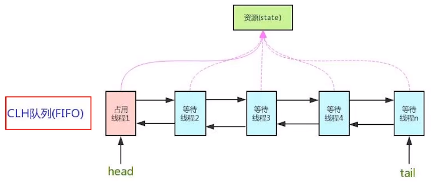

CLH：Craig、Landin and Hagersten队列，是一个单向链表，AQS中的队列是CLH变体的虚拟双向队列FIFO。

## AQS能干嘛

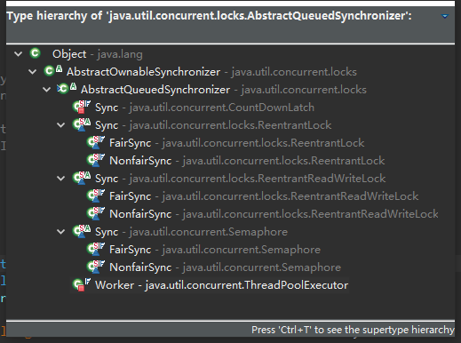

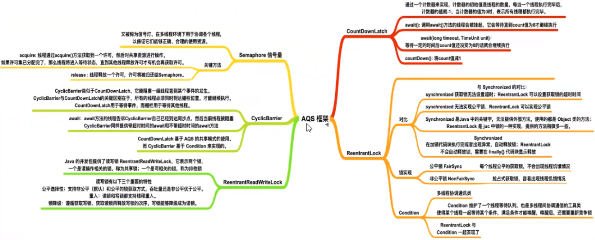

进一步理解锁和同步器的关系

- 锁:面向锁的使用者 - 定义了程序员和锁交互的使用层APl，隐藏了实现细节，你调用即可
- 同步器:面向锁的实现者 - 简化了锁的实现，屏蔽了同步状态管理、阻塞线程排队和通知、唤醒机制等。

加锁会导致阻塞 - 有阻塞就需要排队，实现排队必然需要有某种形式的队列来进行管理

抢到资源的线程直接使用处理业务逻辑，抢不到资源的必然涉及一种排队等候机制。抢占资源失败的线程继续去等待(类似银行业务办理窗口都满了，暂时没有受理窗口的顾客只能去候客区排队等候)，但等候线程仍然保留获取锁的可能且获取锁流程仍在继续(候客区的顾客也在等着叫号，轮到了再去受理窗口办理业务)。

如果共享资源被占用，就需要一定的阻塞等待唤醒机制来保证锁分配。这个机制主要用的是CLH队列的变体实现的，将暂时获取不到锁的线程加入到队列中，这个队列就是AQS的抽象表现。它将请求共享资源的线程封装成队列的结点(Node)，通过CAS、自旋以及LockSupportpark)的方式，维护state变量的状态，使并发达到同步的控制效果。

## AQS源码

有阻塞就需要排队，实现排队必然需要队列

AQS使用一个volatile的int类型的成员变量来表示同步状态，通过内置的FIFO队列来完成资源获取的排队工作将每条要去抢占资源的线程封装成一个Node，节点来实现锁的分配，通过CAS完成对State值的修改。

```
public abstract class AbstractQueuedSynchronizer
    extends AbstractOwnableSynchronizer
    implements java.io.Serializable {

    private static final long serialVersionUID = 7373984972572414691L;

     * Creates a new {@code AbstractQueuedSynchronizer} instance
    protected AbstractQueuedSynchronizer() { }

     * Wait queue node class.
    static final class Node {

     * Head of the wait queue, lazily initialized.  Except for
    private transient volatile Node head;

     * Tail of the wait queue, lazily initialized.  Modified only via
    private transient volatile Node tail;

     * The synchronization state.
    private volatile int state;

     * Returns the current value of synchronization state.
    protected final int getState() {

     * Sets the value of synchronization state.
    protected final void setState(int newState) {

     * Atomically sets synchronization state to the given updated
    protected final boolean compareAndSetState(int expect, int update) {
         
    ...
}         
```

### AQS的int变量 - AQS的同步状态state成员变量

```
public abstract class AbstractQueuedSynchronizer
    extends AbstractOwnableSynchronizer
    implements java.io.Serializable {

    ...

     * The synchronization state.
    private volatile int state;
    
    ...
}
```

state成员变量可以理解为银行办理业务的受理窗口状态。零就是没人，自由状态可以办理，大于等于1，有人占用窗口，等着去。

### AQS的CLH队列

FIFO双向队列

### AbstractQueuedSynchronizer内部类Node源码

```
public abstract class AbstractQueuedSynchronizer
    extends AbstractOwnableSynchronizer
    implements java.io.Serializable {

    ...

     * Creates a new {@code AbstractQueuedSynchronizer} instance
    protected AbstractQueuedSynchronizer() { }

     * Wait queue node class.
    static final class Node {
        //表示线程以共享的模式等待锁
        /** Marker to indicate a node is waiting in shared mode */
        static final Node SHARED = new Node();
        
        //表示线程正在以独占的方式等待锁
        /** Marker to indicate a node is waiting in exclusive mode */
        static final Node EXCLUSIVE = null;

        //线程被取消了
        /** waitStatus value to indicate thread has cancelled */
        static final int CANCELLED =  1;

        //后继线程需要唤醒
        /** waitStatus value to indicate successor's thread needs unparking */
        static final int SIGNAL    = -1;
        
        //等待condition唤醒
        /** waitStatus value to indicate thread is waiting on condition */
        static final int CONDITION = -2;
        
        //共享式同步状态获取将会无条件地传播下去
        * waitStatus value to indicate the next acquireShared should     
        static final int PROPAGATE = -3;

        //当前节点在队列中的状态（重点）
        //队列中每个排队的个体就是一个Node
        //初始为0，状态上面的几种
         * Status field, taking on only the values:
        volatile int waitStatus;

        //前驱节点（重点）
         * Link to predecessor node that current node/thread relies on
        volatile Node prev;

        //后继节点（重点）
         * Link to the successor node that the current node/thread
        volatile Node next;

        //表示处于该节点的线程
         * The thread that enqueued this node.  Initialized on
        volatile Thread thread;

        //指向下一个处于CONDITION状态的节点
         * Link to next node waiting on condition, or the special
        Node nextWaiter;

         * Returns true if node is waiting in shared mode.
        final boolean isShared() {

        //返回前驱节点，没有的话抛出npe
         * Returns previous node, or throws NullPointerException if null.
        final Node predecessor() throws NullPointerException {

        Node() {    // Used to establish initial head or SHARED marker

        Node(Thread thread, Node mode) {     // Used by addWaiter

        Node(Thread thread, int waitStatus) { // Used by Condition
    }
	...
}

```

AQS同步队列的基本结构

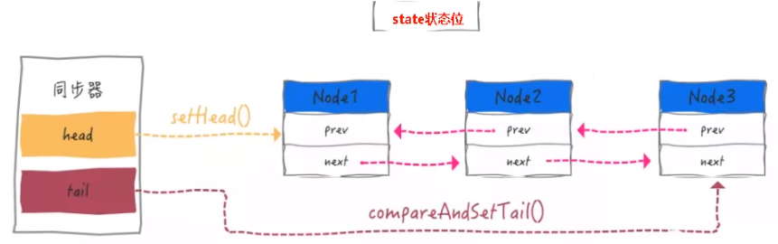

## AQS源码深度解读

从ReentrantLock开始解读AQS,Lock接口的实现类，基本都是通过聚合了一个队列同步器的子类完成线程访问控制的。

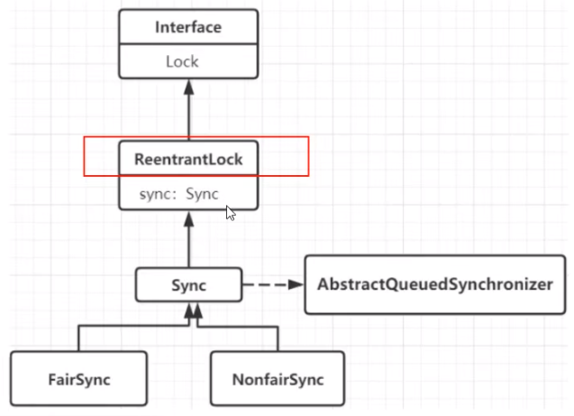

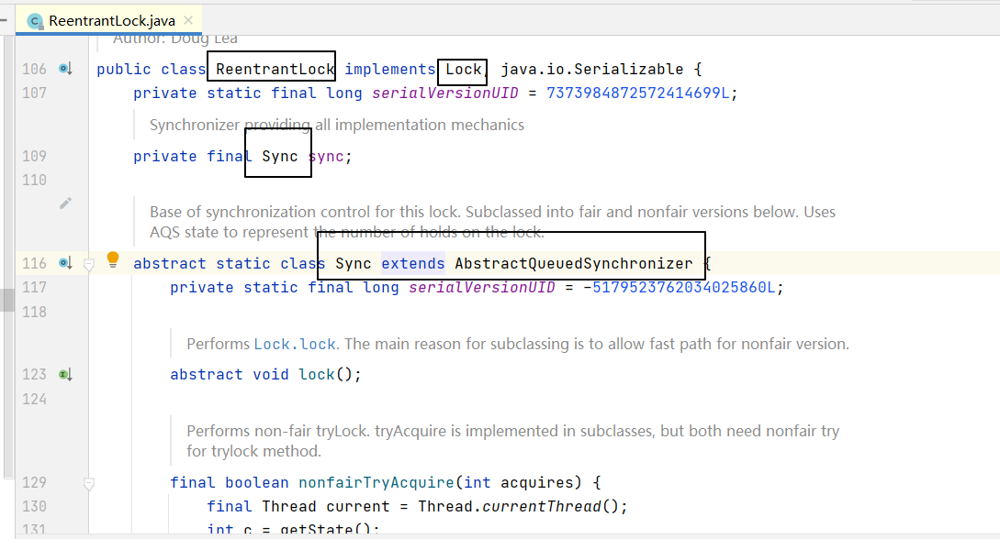

```
 * A reentrant mutual exclusion {@link Lock} with the same basic
public class ReentrantLock implements Lock, java.io.Serializable {
    private static final long serialVersionUID = 7373984872572414699L;
    /** Synchronizer providing all implementation mechanics */
    private final Sync sync;

     * Base of synchronization control for this lock. Subclassed
    abstract static class Sync extends AbstractQueuedSynchronizer {

     * Sync object for non-fair locks
    static final class NonfairSync extends Sync {

     * Sync object for fair locks
    static final class FairSync extends Sync {

     * Creates an instance of {@code ReentrantLock}.
    public ReentrantLock() {
        sync = new NonfairSync();
    }

     * Creates an instance of {@code ReentrantLock} with the
    public ReentrantLock(boolean fair) {
        sync = fair ? new FairSync() : new NonfairSync();
    }

     * Acquires the lock.
    public void lock() {
        sync.lock();//<------------------------注意，我们从这里入手
    }
        
    * Attempts to release this lock.
    public void unlock() {
        sync.release(1);
    }
    ...
}
```

从最简单的lock方法开始看看公平和非公平，先浏览下AbstractQueuedSynchronizer，FairSync，NonfairSync类的源码。

```
public abstract class AbstractQueuedSynchronizer
    extends AbstractOwnableSynchronizer
    implements java.io.Serializable {

	...

     * Acquires in exclusive mode, ignoring interrupts.  Implemented
    public final void acquire(int arg) {//公平锁或非公平锁都会调用这方法
        if (!tryAcquire(arg) &&//0.
            acquireQueued(addWaiter(Node.EXCLUSIVE), arg))//1. 2.
            selfInterrupt();//3.
    }
    
    //0.
    * Attempts to acquire in exclusive mode. This method should query
    protected boolean tryAcquire(int arg) {//取决于公平锁或非公平锁的实现
        throw new UnsupportedOperationException();
    }
	
    
    //1.
    * Acquires in exclusive uninterruptible mode for thread already in
    final boolean acquireQueued(final Node node, int arg) {
        boolean failed = true;
        try {
            boolean interrupted = false;
            for (;;) {
                final Node p = node.predecessor();
                if (p == head && tryAcquire(arg)) {
                    setHead(node);
                    p.next = null; // help GC
                    failed = false;
                    return interrupted;
                }
                if (shouldParkAfterFailedAcquire(p, node) &&
                    parkAndCheckInterrupt())
                    interrupted = true;
            }
        } finally {
            if (failed)
                cancelAcquire(node);
        }
    }
    
    //2.
    * Creates and enqueues node for current thread and given mode.
    private Node addWaiter(Node mode) {
        Node node = new Node(Thread.currentThread(), mode);
        // Try the fast path of enq; backup to full enq on failure
        Node pred = tail;
        if (pred != null) {
            node.prev = pred;
            if (compareAndSetTail(pred, node)) {
                pred.next = node;
                return node;
            }
        }
        enq(node);
        return node;
    }
    
    //3.
    static void selfInterrupt() {
        Thread.currentThread().interrupt();
    }
    
    //这个方法将会被公平锁的tryAcquire()调用
    * Queries whether any threads have been waiting to acquire longer
    public final boolean hasQueuedPredecessors() {
        // The correctness of this depends on head being initialized
        // before tail and on head.next being accurate if the current
        // thread is first in queue.
        Node t = tail; // Read fields in reverse initialization order
        Node h = head;
        Node s;
        return h != t &&
            ((s = h.next) == null || s.thread != Thread.currentThread());
    }
    
    
	...         
}
```

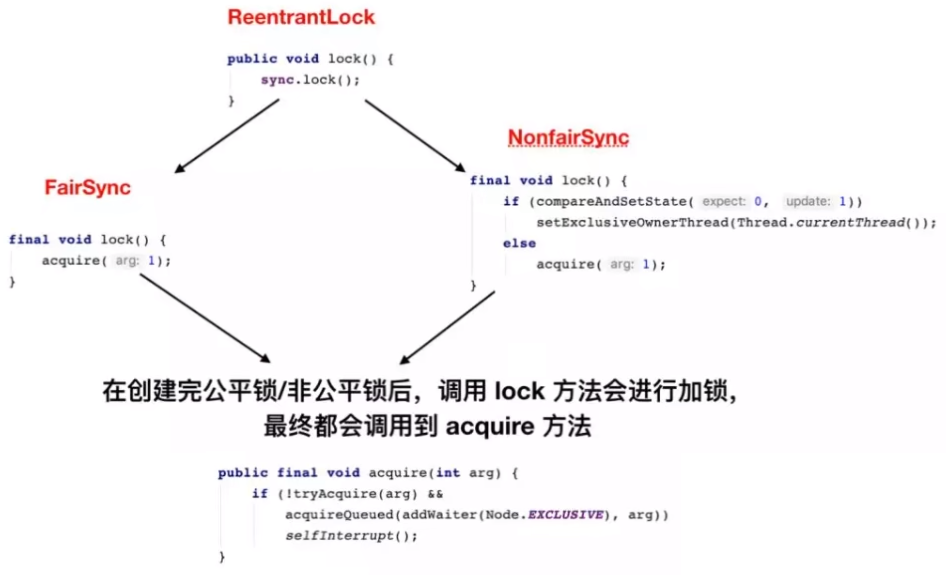

可以明显看出公平锁与非公平锁的lock()方法唯一的区别就在于tryAcquire公平锁在获取同步状态时多了一个限制条件：hasQueuedPredecessors()

hasQueuedPredecessors()中判断了是否需要排队，导致公平锁和非公平锁的差异如下：

- 公平锁：公平锁讲究先来先到，线程在获取锁时，如果这个锁的等待队列中已经有线程在等待，那么当前线程就会进入等待队列中;
- 非公平锁：不管是否有等待队列，如果可以获取锁，则立刻占有锁对象。也就是说队列的第一个排队线程在unpark()，之后还是需要竞争锁（存在线程竞争的情况下)


整个ReentrantLock 的加锁lock()过程，可以分为三个阶段：

- 尝试加锁；
- 加锁失败，线程入队列；
- 线程入队列后，进入阻赛状态。

## 结合例子看ReentranLock源码比较容易理解

```
import java.util.concurrent.TimeUnit;
import java.util.concurrent.locks.ReentrantLock;

public class AQSDemo {
	
	public static void main(String[] args) {
		ReentrantLock lock = new ReentrantLock();
		
		//带入一个银行办理业务的案例来模拟我们的AQs 如何进行线程的管理和通知唤醒机制
		//3个线程模拟3个来银行网点，受理窗口办理业务的顾客

		//A顾客就是第一个顾客，此时受理窗口没有任何人，A可以直接去办理
		new Thread(()->{
			lock.lock();
			try {
				System.out.println(Thread.currentThread().getName() + " come in.");
				
				try {
					TimeUnit.SECONDS.sleep(5);//模拟办理业务时间
				} catch (InterruptedException e) {
					e.printStackTrace();
				}
			} finally {
				lock.unlock();
			}
		}, "Thread A").start();
		
		//第2个顾客，第2个线程---->，由于受理业务的窗口只有一个(只能一个线程持有锁)，此代B只能等待，
		//进入候客区
		new Thread(()->{
			lock.lock();
			try {
				System.out.println(Thread.currentThread().getName() + " come in.");
				
			} finally {
				lock.unlock();
			}
		}, "Thread B").start();
		
		
		//第3个顾客，第3个线程---->，由于受理业务的窗口只有一个(只能一个线程持有锁)，此代C只能等待，
		//进入候客区
		new Thread(()->{
			lock.lock();
			try {
				System.out.println(Thread.currentThread().getName() + " come in.");
				
			} finally {
				lock.unlock();
			}
		}, "Thread C").start();
	}
}
```

程序初始状态方便理解图

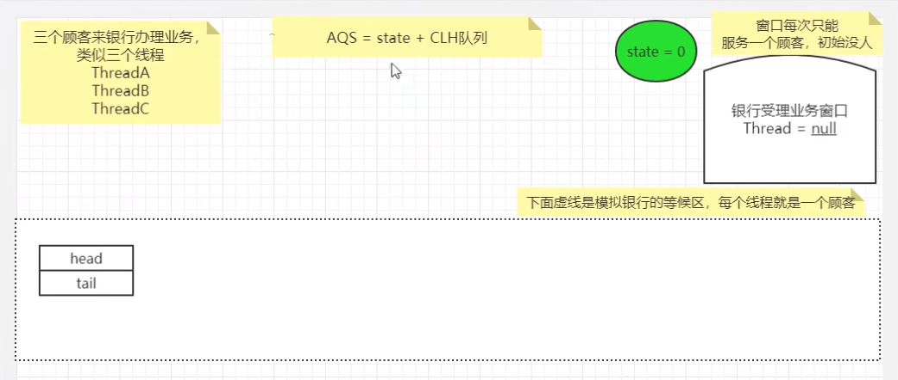

### 线程A先执行

启动程序，首先是运行线程A，ReentrantLock默认是选用非公平锁。

```
public class ReentrantLock implements Lock, java.io.Serializable {
    
    ...
        
    * Acquires the lock.
    public void lock() {
        sync.lock();//<------------------------注意，我们从这里入手,一开始将线程A的
    }
    
    abstract static class Sync extends AbstractQueuedSynchronizer {
        
        ...

        //被NonfairSync的tryAcquire()调用
        final boolean nonfairTryAcquire(int acquires) {
            final Thread current = Thread.currentThread();
            int c = getState();
            if (c == 0) {
                if (compareAndSetState(0, acquires)) {
                    setExclusiveOwnerThread(current);
                    return true;
                }
            }
            else if (current == getExclusiveOwnerThread()) {
                int nextc = c + acquires;
                if (nextc < 0) // overflow
                    throw new Error("Maximum lock count exceeded");
                setState(nextc);
                return true;
            }
            return false;
        }
        ...

    }
    
    
	//非公平锁
	static final class NonfairSync extends Sync {
        private static final long serialVersionUID = 7316153563782823691L;

        /**
         * Performs lock.  Try immediate barge, backing up to normal
         * acquire on failure.
         */
        final void lock() {//<----线程A的lock.lock()调用该方法
            if (compareAndSetState(0, 1))//AbstractQueuedSynchronizer的方法,刚开始这方法返回true
                setExclusiveOwnerThread(Thread.currentThread());//设置独占的所有者线程，显然一开始是线程A
            else
                acquire(1);//稍后紧接着的线程B将会调用该方法。
        }

        //acquire()将会间接调用该方法
        protected final boolean tryAcquire(int acquires) {
            return nonfairTryAcquire(acquires);//调用父类Sync的nonfairTryAcquire()
        }
        

        
    }
    
    ...
}
```


```
public abstract class AbstractQueuedSynchronizer
    extends AbstractOwnableSynchronizer
    implements java.io.Serializable {

    /**
     * The synchronization state.
     */
    private volatile int state;

    //线程A将state设为1，下图红色椭圆区
    /*Atomically sets synchronization state to the given updated value 
    if the current state value equals the expected value.
    This operation has memory semantics of a volatile read and write.*/
    protected final boolean compareAndSetState(int expect, int update) {
        // See below for intrinsics setup to support this
        return unsafe.compareAndSwapInt(this, stateOffset, expect, update);
    }

}
```

线程A开始办业务了。

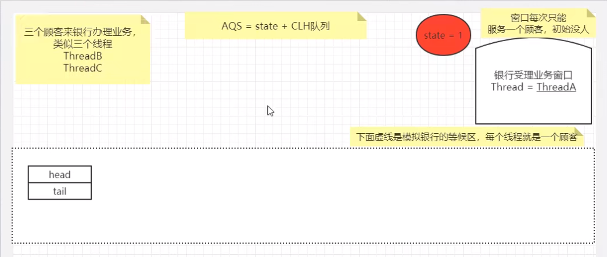

### 轮到线程B运行

```
public class ReentrantLock implements Lock, java.io.Serializable {
    
    ...
        
    * Acquires the lock.
    public void lock() {
        sync.lock();//<------------------------注意，我们从这里入手,线程B的执行这
    }
    
	//非公平锁
	static final class NonfairSync extends Sync {
        private static final long serialVersionUID = 7316153563782823691L;

        /**
         * Performs lock.  Try immediate barge, backing up to normal
         * acquire on failure.
         */
        final void lock() {//<-------------------------线程B的lock.lock()调用该方法
            if (compareAndSetState(0, 1))//这是预定线程A还在工作，这里返回false
                setExclusiveOwnerThread(Thread.currentThread());//
            else
                acquire(1);//线程B将会调用该方法，该方法在AbstractQueuedSynchronizer，
            			   //它会调用本类的tryAcquire()方法
        }

        //acquire()将会间接调用该方法
        protected final boolean tryAcquire(int acquires) {
            return nonfairTryAcquire(acquires);//调用父类Sync的nonfairTryAcquire()
        }
    }

    //非公平锁与公平锁的公共父类
     * Base of synchronization control for this lock. Subclassed
    abstract static class Sync extends AbstractQueuedSynchronizer {
    
        //acquire()将会间接调用该方法
    	...
        final boolean nonfairTryAcquire(int acquires) {
            final Thread current = Thread.currentThread();//这里是线程B
            int c = getState();//线程A还在工作，c=>1
            if (c == 0) {//false
                if (compareAndSetState(0, acquires)) {
                    setExclusiveOwnerThread(current);
                    return true;
                }
            }
            else if (current == getExclusiveOwnerThread()) {//(线程B == 线程A) => false
                int nextc = c + acquires;//+1
                if (nextc < 0) // overflow
                    throw new Error("Maximum lock count exceeded");
                setState(nextc);
                return true;
            }
            return false;//最终返回false
        } 
        ...
    
    }
    
    ...
}
```

```
public abstract class AbstractQueuedSynchronizer
    extends AbstractOwnableSynchronizer
    implements java.io.Serializable {

	...

     * Acquires in exclusive mode, ignoring interrupts.  Implemented
    public final void acquire(int arg) {
        if (!tryAcquire(arg) &&//线程B调用非公平锁的tryAcquire(), 最终返回false，加上!,也就是true,也就是还要执行下面两行语句
            acquireQueued(addWaiter(Node.EXCLUSIVE), arg))
            selfInterrupt();
    }
    
    ...
}
```

```
public abstract class AbstractQueuedSynchronizer
    extends AbstractOwnableSynchronizer
    implements java.io.Serializable {

	...

     * Acquires in exclusive mode, ignoring interrupts.  Implemented
    public final void acquire(int arg) {
        if (!tryAcquire(arg) &&//线程B调用非公平锁的tryAcquire(), 最终返回false，加上!,也就是true,也就是还要执行下面两行语句
            acquireQueued(addWaiter(Node.EXCLUSIVE), arg))//线程B加入等待队列
            selfInterrupt();//
    }
    
    private Node addWaiter(Node mode) {
        Node node = new Node(Thread.currentThread(), mode);
        // Try the fast path of enq; backup to full enq on failure
        Node pred = tail;
        if (pred != null) {//根据上面一句注释，本语句块的意义是将新节点快速添加至队尾
            node.prev = pred;
            if (compareAndSetTail(pred, node)) {
                pred.next = node;
                return node;
            }
        }
        enq(node);//快速添加至队尾失败，则用这方法调用（可能链表为空，才调用该方法）
        return node;
    }
    
    //Inserts node into queue, initializing if necessary.
    private Node enq(final Node node) {
        for (;;) {
            Node t = tail;
            if (t == null) { // Must initialize
                if (compareAndSetHead(new Node()))//插入一个哨兵节点（或称傀儡节点）
                    tail = head;
            } else {
                node.prev = t;
                if (compareAndSetTail(t, node)) {//真正插入我们需要的节点，也就是包含线程B引用的节点
                    t.next = node;
                    return t;
                }
            }
        }
    }
    
    //CAS head field. Used only by enq.
    private final boolean compareAndSetHead(Node update) {
        return unsafe.compareAndSwapObject(this, headOffset, null, update);
    }

    //CAS tail field. Used only by enq.
    private final boolean compareAndSetTail(Node expect, Node update) {
        return unsafe.compareAndSwapObject(this, tailOffset, expect, update);
    }

    
    ...
}
```

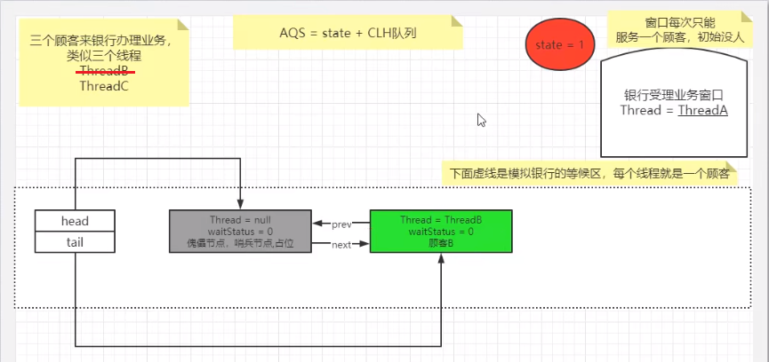

线程B加入等待队列。

### 假设线程A第二次lock.lock()

假设线程B，C还没启动，正在工作线程A重新尝试获得锁，也就是调用lock.lock()多一次

```
    //非公平锁与公平锁的公共父类fa
     * Base of synchronization control for this lock. Subclassed
    abstract static class Sync extends AbstractQueuedSynchronizer {
    
    	...
        final boolean nonfairTryAcquire(int acquires) {
            final Thread current = Thread.currentThread();//这里是线程A
            int c = getState();//线程A还在工作，c=>1；如果线程A恰好运行到在这工作完了，c=>0，这时它又要申请锁的话
            if (c == 0) {//线程A正在工作为false;如果线程A恰好工作完，c=>0，这时它又要申请锁的话,则为true
                if (compareAndSetState(0, acquires)) {//线程A重新获得锁
                    setExclusiveOwnerThread(current);//这里相当于NonfairSync.lock()另一重设置吧！
                    return true;
                }
            }
            else if (current == getExclusiveOwnerThread()) {//(线程A == 线程A) => true
                int nextc = c + acquires;//1+1=>nextc=2
                if (nextc < 0) // overflow
                    throw new Error("Maximum lock count exceeded");
                setState(nextc);//state=2,说明要unlock多两次吧（现在盲猜）
                return true;//返回true
            }
            return false;
        } 
        ...
    
    }
```

### 线程C执行

线程A依然工作，线程C如线程B那样炮制加入等待队列。

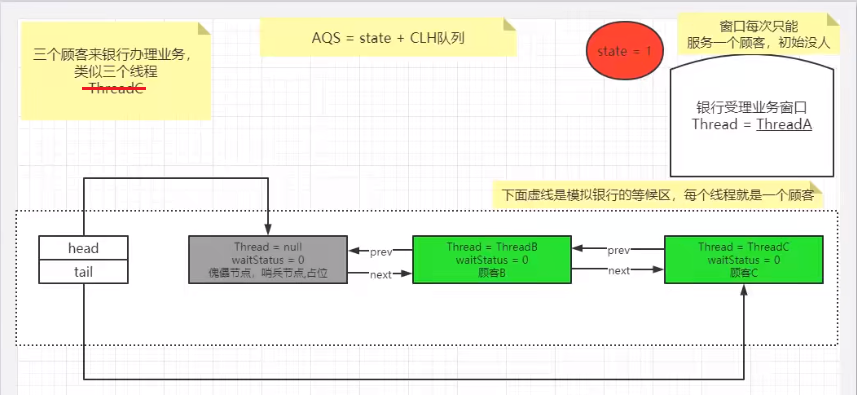

双向链表中，第一个节点为虚节点(也叫哨兵节点)，其实并不存储任何信息，只是占位。真正的第一个有数据的节点，是从第二个节点开始的。

### 线程B加入等待队列后，继续执行

```
public abstract class AbstractQueuedSynchronizer
    extends AbstractOwnableSynchronizer
    implements java.io.Serializable {

	...

     * Acquires in exclusive mode, ignoring interrupts.  Implemented
    public final void acquire(int arg) {
        if (!tryAcquire(arg) &&//线程B调用非公平锁的tryAcquire(), 最终返回false，加上!,也就是true,也就是还要执行下面两行语句
            //线程B加入等待队列，acquireQueued现在论述<--------------------------
            acquireQueued(addWaiter(Node.EXCLUSIVE), arg))
            selfInterrupt();//
    }
    
    //Acquires in exclusive uninterruptible mode for thread already inqueue. 
    //Used by condition wait methods as well as acquire.
    //
    //return true if interrupted while waiting
    final boolean acquireQueued(final Node node, int arg) {
        boolean failed = true;
        try {
            boolean interrupted = false;
            for (;;) {
                final Node p = node.predecessor();//1.返回前一节点，对与线程B来说，p也就是傀儡节点
				//p==head为true，tryAcquire()方法
                //假设线程A正在工作,现在线程B只能等待，所以tryAcquire(arg)返回false，下面的if语块不执行
                //
                //第二次循环，假设线程A继续正在工作，下面的if语块还是不执行
                if (p == head && tryAcquire(arg)) {
                    setHead(node);
                    p.next = null; // help GC
                    failed = false;
                    return interrupted;
                }
                //请移步到2.处的shouldParkAfterFailedAcquire()解说。第一次返回false, 下一次（第二次）循环
                //第二次循环，shouldParkAfterFailedAcquire()返回true，执行parkAndCheckInterrupt()
                if (shouldParkAfterFailedAcquire(p, node) && 
                    //4. 
                    parkAndCheckInterrupt())
                    interrupted = true;
            }
        } finally {
            if (failed)
                cancelAcquire(node);
        }
    }
    
    
    static final class Node {

        ...
        //1.返回前一节点
        final Node predecessor() throws NullPointerException {
            Node p = prev;
            if (p == null)
                throw new NullPointerException();
            else
                return p;
        }
        
        ...

    }
    
    //2. 
    private static boolean shouldParkAfterFailedAcquire(Node pred, Node node) {
        int ws = pred.waitStatus;//此时pred指向傀儡节点，它的waitStatus为0
        //Node.SIGNAL为-1，跳过
        //第二次调用，ws为-1，条件成立，返回true
        if (ws == Node.SIGNAL)//-1
            /*
             * This node has already set status asking a release
             * to signal it, so it can safely park.
             */
            return true;
        if (ws > 0) {//跳过
            /*
             * Predecessor was cancelled. Skip over predecessors and
             * indicate retry.
             */
            do {
                node.prev = pred = pred.prev;
            } while (pred.waitStatus > 0);
            pred.next = node;
        } else {
            /*
             * waitStatus must be 0 or PROPAGATE.  Indicate that we
             * need a signal, but don't park yet.  Caller will need to
             * retry to make sure it cannot acquire before parking.
             */
            //3. 傀儡节点的WaitStatus设置为-1//下图红圈
            compareAndSetWaitStatus(pred, ws, Node.SIGNAL);
        }
        return false;//第一次返回
    }
    
    /**
     * CAS waitStatus field of a node.
     */
    //3.
    private static final boolean compareAndSetWaitStatus(Node node,
                                                         int expect,
                                                         int update) {
        return unsafe.compareAndSwapInt(node, waitStatusOffset,
                                        expect, update);
    }
    
    /**
     * Convenience method to park and then check if interrupted
     *
     * @return {@code true} if interrupted
     */
    //4.
    private final boolean parkAndCheckInterrupt() {
        //前段章节讲述的LockSupport，this指的是NonfairSync对象，
        //这意味着真正阻塞线程B，同样地阻塞了线程C
        LockSupport.park(this);//线程B,C在此处暂停了运行<-------------------------
        return Thread.interrupted();
    }
    
}
```

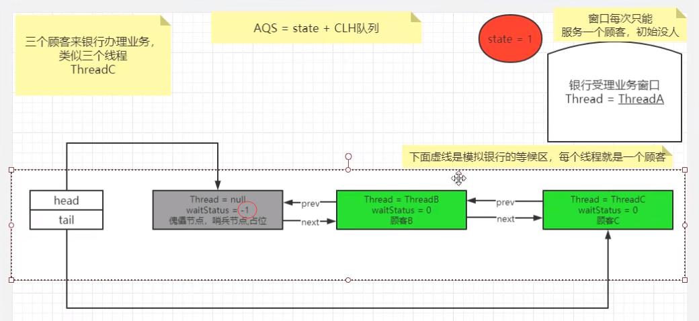

图中的傀儡节点的waitStatus由0变为-1（Node.SIGNAL）。

### 线程A执行完毕

假设线程A工作结束，调用unLock()，释放锁占用。

```
public class ReentrantLock implements Lock, java.io.Serializable {
    
    private final Sync sync;

    abstract static class Sync extends AbstractQueuedSynchronizer {
        
        ...
        //2.unlock()间接调用本方法，releases传入1
        protected final boolean tryRelease(int releases) {
            //3.
            int c = getState() - releases;//c为0
            //4.
            if (Thread.currentThread() != getExclusiveOwnerThread())
                throw new IllegalMonitorStateException();
            boolean free = false;
            if (c == 0) {//c为0，条件为ture，执行if语句块
                free = true;
                //5.
                setExclusiveOwnerThread(null);
            }
            //6.
            setState(c);
            return free;//最后返回true
        }
    	...
    
    }
    
    static final class NonfairSync extends Sync {...}
    
    public ReentrantLock() {
        sync = new NonfairSync();//我们使用的非公平锁
    }
    					//注意！注意！注意！
    public void unlock() {//<----------从这开始，假设线程A工作结束，调用unLock()，释放锁占用
        //1.
        sync.release(1);//在AbstractQueuedSynchronizer类定义
    }
    
    ...
 
}
```

```
public abstract class AbstractQueuedSynchronizer
    extends AbstractOwnableSynchronizer
    implements java.io.Serializable {

    ...
    //1.
    public final boolean release(int arg) {
        //2.
        if (tryRelease(arg)) {//该方法看子类NonfairSync实现，最后返回true
            Node h = head;//返回傀儡节点
            if (h != null && h.waitStatus != 0)//傀儡节点非空，且状态为-1，条件为true，执行if语句
                //7.
                unparkSuccessor(h);
            return true;
        }
        return false;//返回true,false都无所谓了，unlock方法只是简单调用release方法，对返回结果没要求
    }
    
    /**
     * The synchronization state.
     */
    private volatile int state;

    //3.
    protected final int getState() {
        return state;
    }

    //6.
    protected final void setState(int newState) {
        state = newState;
    }
    
    //7. Wakes up node's successor, if one exists.
    //传入傀儡节点
    private void unparkSuccessor(Node node) {
        /*
         * If status is negative (i.e., possibly needing signal) try
         * to clear in anticipation of signalling.  It is OK if this
         * fails or if status is changed by waiting thread.
         */
        int ws = node.waitStatus;//傀儡节点waitStatus为-1
        if (ws < 0)//ws为-1，条件成立，执行if语块
            compareAndSetWaitStatus(node, ws, 0);//8.将傀儡节点waitStatus由-1变为0

        /*
         * Thread to unpark is held in successor, which is normally
         * just the next node.  But if cancelled or apparently null,
         * traverse backwards from tail to find the actual
         * non-cancelled successor.
         */
        Node s = node.next;//傀儡节点的下一节点,也就是带有线程B的节点
        if (s == null || s.waitStatus > 0) {//s非空，s.waitStatus非0，条件为false，不执行if语块
            s = null;
            for (Node t = tail; t != null && t != node; t = t.prev)
                if (t.waitStatus <= 0)
                    s = t;
        }
        if (s != null)//s非空，条件为true，不执行if语块
            LockSupport.unpark(s.thread);//唤醒线程B。运行到这里，线程A的工作基本告一段落了。
    }
    
    //8.
    private static final boolean compareAndSetWaitStatus(Node node,
                                                         int expect,
                                                         int update) {
        return unsafe.compareAndSwapInt(node, waitStatusOffset,
                                        expect, update);
    }
    
    
}
```

```
public abstract class AbstractOwnableSynchronizer
    implements java.io.Serializable {

    ...

    protected AbstractOwnableSynchronizer() { }

    private transient Thread exclusiveOwnerThread;

    //5.
    protected final void setExclusiveOwnerThread(Thread thread) {
        exclusiveOwnerThread = thread;
    }
    
    //4.
    protected final Thread getExclusiveOwnerThread() {
        return exclusiveOwnerThread;
    }
}
```

线程A结束工作，调用unlock()的tryRelease()后的状态，state由1变为0，exclusiveOwnerThread由线程A变为null。

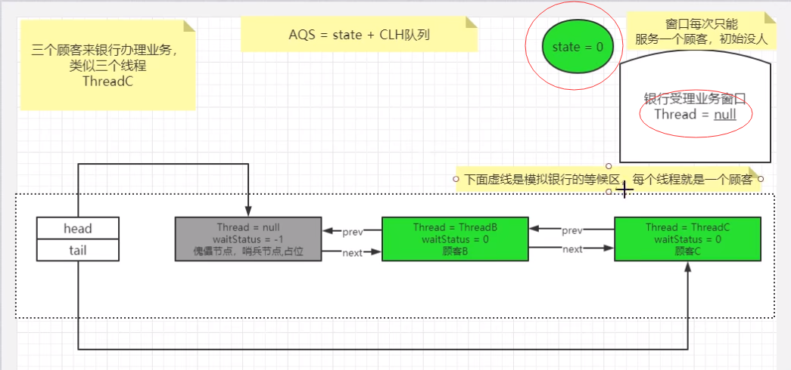

### 线程B被唤醒

线程B被唤醒，即从原先park()的方法继续运行

```
public abstract class AbstractQueuedSynchronizer
    extends AbstractOwnableSynchronizer
    implements java.io.Serializable {

     private final boolean parkAndCheckInterrupt() {
        LockSupport.park(this);//线程B从阻塞到非阻塞，继续执行(这里第一步)
        return Thread.interrupted();//线程B没有被中断，返回false
    }
    
	...
 
    //Acquires in exclusive uninterruptible mode for thread already inqueue. 
    //Used by condition wait methods as well as acquire.
    //
    //return true if interrupted while waiting
    final boolean acquireQueued(final Node node, int arg) {
        boolean failed = true;
        try {
            boolean interrupted = false;
            for (;;) {
                final Node p = node.predecessor();//线程B所在的节点的是傀儡节点
                //傀儡节点是头节点
                //tryAcquire()返回true,线程B成功上位(这里第三步)
                if (p == head && tryAcquire(arg)) {
                    setHead(node);//1.将附带线程B的节点的变成新的傀儡节点
                    p.next = null; // help GC//置空原傀儡指针与新的傀儡节点之间的前后驱指针，方便GC回收
                    failed = false;
                    return interrupted;//返回false，跳到2.acquire()
                }
               
                if (shouldParkAfterFailedAcquire(p, node) && 
                    //唤醒线程B继续工作，parkAndCheckInterrupt()返回false
                    //if语块不执行，跳到下一循环(这里第二步)
                    parkAndCheckInterrupt())//<---------------------------------唤醒线程在这里继续运行(这里第二步)
                    interrupted = true;
            }
        } finally {
            if (failed)
                cancelAcquire(node);
        }
    }
    
    //1. 
    private void setHead(Node node) {
        head = node;
        node.thread = null;
        node.prev = null;
    }
    
    //2.
    * Acquires in exclusive mode, ignoring interrupts.  Implemented
    public final void acquire(int arg) {
        if (!tryAcquire(arg) &&
            //acquireQueued()返回fasle,条件为false，if语块不执行，acquire()返回
            //也就是说，线程B成功获得锁，可以展开线程B自己的工作了。(这里第四步)
            acquireQueued(addWaiter(Node.EXCLUSIVE), arg))
            selfInterrupt();//
    }
    
}

```

最后，线程B成功获取锁。

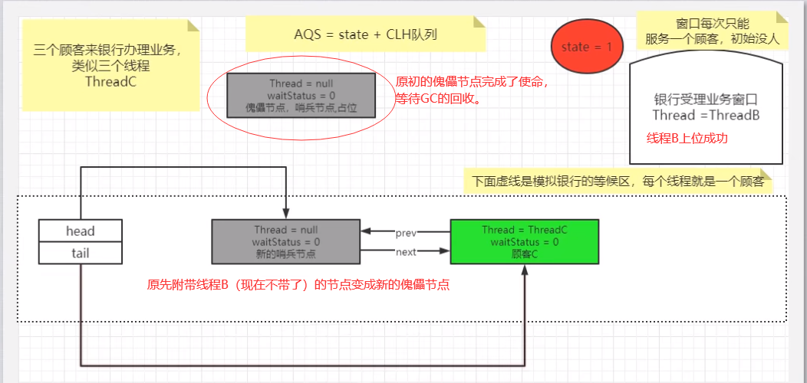

## 总结辣，太复杂了

### 加锁和挂起线程流程：

1. 首先调用nonfairTryAcquire()获取`state`的值。如果为0，利用`CAS`尝试抢占锁compareAndSetState(0, 1)，且设置对象独占锁线程为当前线程setExclusiveOwnerThread(Thread.currentThread())；如果不为0则说明当前对象的锁已经被其他线程所占有，接着判断占有锁的线程是否为当前线程，如果是则累加`state`值。获取锁成功。

2. 如果获取锁失败：首先执行`addWaiter(Node.EXCLUSIVE)`，加入到一个`FIFO`   CLH等待队列中。`addWaiter()`方法执行完后，会返回当前线程创建的节点信息。继续往后执行`acquireQueued(addWaiter(Node.EXCLUSIVE), arg)`逻辑。`acquireQueued()`这个方法会先判断当前传入的`Node`对应的前置节点是否为`head`，如果是则尝试加锁。加锁成功过则将当前节点设置为`head`节点，然后空置之前的`head`节点，方便后续被垃圾回收掉。如果加锁失败或者`Node`的前置节点不是`head`节点，就会通过`shouldParkAfterFailedAcquire`方法 将前一个节点的`waitStatus`变为了`SIGNAL=-1`，最后执行`parkAndChecknIterrupt`方法，调用`LockSupport.park()`挂起当前线程，等着其他线程释放锁来唤醒它。

### 释放锁和唤醒线程流程：

1. 首先是拥有锁的线程释放锁，释放锁后会唤醒`head`节点的后置节点。
2. 首先会执行`tryRelease()`方法，执行完`ReentrantLock.tryRelease()`后，`state`被设置成0，Lock对象的独占锁被设置为null。如果`tryRelease`执行成功，则继续判断`head`节点的`waitStatus`是否为0，就会执行`unparkSuccessor()`方法来唤醒`head`的后置节点。`unparkSuccessor()`主要是将`head`节点的`waitStatus`设置为0，然后解除`head`节点`next`的指向，使`head`节点空置，等待着被垃圾回收。`LockSupport.unpark(傀儡节点后的下一个节点)`，然后唤醒的节点就可以执行加锁流程了。


### 总的来说

- CountDownLatch、CyclicBarriar、Semaphore信号量、ReentrantLock、ReentrantReadWriteLock读写锁底层都有Sync类继承AQS类，都属于AQS框架。
- AQS中 维护了一个volatile int state（代表共享资源）和一个FIFO双向等待CLH队列（多线程争用资源被阻塞时会进入此队列）。
- 另外state的操作都是通过CAS来保证其并发修改的安全性。
- 这里volatile能够保证多线程下的可见性，当state=1则代表当前对象锁已经被占有，其他线程来加锁时则会失败，加锁失败的线程会被放入一个FIFO的等待队列中，比列会被UNSAFE.park()操作挂起，等待其他获取锁的线程释放锁才能够被唤醒。
- 当线程执行完逻辑后，会释放同步状态，释放后会唤醒其后继节点，使其再次尝试获取同步状态。